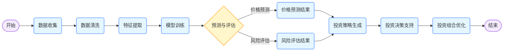

# 特价股票投资中的动态数字产业生态系统模型应用

> 关键词：特价股票投资、动态数字产业生态系统模型、投资策略、产业生态、模型应用

> 摘要：本文聚焦于特价股票投资领域，深入探讨动态数字产业生态系统模型的应用。首先介绍了研究的背景、目的、预期读者等内容。接着阐述了核心概念及联系，通过示意图和流程图清晰展示其架构。详细讲解了核心算法原理，结合Python代码给出具体操作步骤，并运用数学模型和公式进行理论支撑。通过项目实战案例，从开发环境搭建到代码实现和解读，全面展示了模型在特价股票投资中的实际应用。分析了该模型在不同场景下的实际应用，推荐了相关的学习资源、开发工具和论文著作。最后总结了未来发展趋势与挑战，提供常见问题解答及扩展阅读参考资料，旨在为投资者和相关研究人员提供全面、深入的技术指导和决策依据。

## 1. 背景介绍 
### 1.1 目的和范围
在股票投资市场中，特价股票因其价格相对较低，往往吸引着众多投资者的目光。然而，特价股票的投资具有较高的风险性，其价格波动受到多种因素的影响，包括宏观经济环境、行业发展趋势、公司内部治理等。动态数字产业生态系统模型作为一种新兴的分析工具，旨在综合考虑这些复杂因素，为特价股票投资提供更科学、准确的决策依据。

本研究的范围涵盖了特价股票投资的各个环节，从数据收集、模型构建、算法实现到实际应用。通过对动态数字产业生态系统模型的深入研究和应用，试图揭示特价股票价格波动的内在规律，提高投资决策的准确性和收益率。

### 1.2 预期读者
本文的预期读者主要包括以下几类人群：
- **股票投资者**：希望通过运用科学的分析方法，提高特价股票投资的成功率和收益水平。
- **金融分析师**：对股票市场的动态变化和数据分析方法感兴趣，希望深入了解动态数字产业生态系统模型在投资分析中的应用。
- **科研人员**：从事金融工程、投资学等相关领域的研究，关注新兴的分析模型和技术在股票投资中的应用。
- **软件开发人员**：对金融领域的数据分析和模型应用有一定了解，希望学习如何将动态数字产业生态系统模型转化为实际的软件应用。

### 1.3 文档结构概述
本文的文档结构如下：
- **核心概念与联系**：介绍动态数字产业生态系统模型的核心概念、原理和架构，通过文本示意图和Mermaid流程图进行直观展示。
- **核心算法原理 & 具体操作步骤**：详细讲解模型所涉及的核心算法原理，并用Python源代码实现具体操作步骤。
- **数学模型和公式 & 详细讲解 & 举例说明**：运用数学模型和公式对模型进行理论分析，通过具体例子说明其应用。
- **项目实战：代码实际案例和详细解释说明**：通过一个实际的项目案例，展示如何搭建开发环境、实现源代码并进行代码解读。
- **实际应用场景**：分析动态数字产业生态系统模型在特价股票投资中的实际应用场景。
- **工具和资源推荐**：推荐相关的学习资源、开发工具和论文著作。
- **总结：未来发展趋势与挑战**：总结动态数字产业生态系统模型在特价股票投资中的应用现状，展望未来发展趋势并分析面临的挑战。
- **附录：常见问题与解答**：解答读者在阅读过程中可能遇到的常见问题。
- **扩展阅读 & 参考资料**：提供相关的扩展阅读材料和参考资料。

### 1.4 术语表
#### 1.4.1 核心术语定义
- **特价股票**：指价格相对较低，通常低于市场平均价格或其内在价值的股票。
- **动态数字产业生态系统模型**：一种综合考虑产业生态系统中各种因素的动态变化，通过数字化手段进行建模和分析的工具。
- **投资策略**：投资者为实现投资目标而制定的一系列投资决策和操作方法。
- **数据挖掘**：从大量数据中发现有价值信息和知识的过程。
- **机器学习算法**：一类让计算机自动从数据中学习规律和模式的算法。

#### 1.4.2 相关概念解释
- **产业生态系统**：由相互关联的企业、组织和个人组成的生态系统，它们在产业发展过程中相互作用、相互影响。
- **数字经济**：以数字化的知识和信息为关键生产要素，以数字技术创新为核心驱动力，以现代信息网络为重要载体的经济形态。
- **股票价格波动**：股票价格在一定时间内的上下变动，受到多种因素的影响。

#### 1.4.3 缩略词列表
- **AI**：Artificial Intelligence，人工智能
- **ML**：Machine Learning，机器学习
- **API**：Application Programming Interface，应用程序编程接口

## 2. 核心概念与联系 
### 核心概念原理
动态数字产业生态系统模型的核心原理是将特价股票投资置于一个动态的数字产业生态系统中进行分析。该模型认为，特价股票的价格波动不仅受到公司自身基本面的影响，还与所处的产业生态系统密切相关。产业生态系统中的各种因素，如行业竞争态势、技术创新、政策环境等，都会对特价股票的价值产生影响。

模型通过收集和整合大量的相关数据，包括公司财务数据、行业数据、宏观经济数据等，运用数据挖掘和机器学习算法，对这些数据进行分析和处理，挖掘出数据背后的规律和模式。然后，根据这些规律和模式，构建预测模型，对特价股票的未来价格走势进行预测。

### 架构的文本示意图
```plaintext
动态数字产业生态系统模型架构

数据层：
- 公司财务数据
- 行业数据
- 宏观经济数据
- 市场情绪数据

处理层：
- 数据清洗
- 特征提取
- 模型训练

分析层：
- 价格预测
- 风险评估
- 投资策略生成

应用层：
- 投资决策支持
- 投资组合优化
```

### Mermaid流程图


## 3. 核心算法原理 & 具体操作步骤 
### 核心算法原理
动态数字产业生态系统模型主要运用了以下几种核心算法：
- **回归分析**：用于建立特价股票价格与各种影响因素之间的线性或非线性关系。通过回归分析，可以确定哪些因素对股票价格的影响最为显著，以及影响的程度。
- **决策树算法**：一种基于树结构进行决策的算法。决策树可以根据不同的特征对数据进行分类和预测，能够处理复杂的非线性关系。
- **神经网络算法**：模仿人类神经系统的结构和功能，通过多层神经元的相互连接和计算，实现对数据的学习和预测。神经网络具有强大的非线性建模能力，能够处理复杂的模式和关系。

### 具体操作步骤及Python源代码
以下是一个简单的示例，展示如何运用Python实现动态数字产业生态系统模型的核心算法。假设我们已经收集到了特价股票的相关数据，包括公司财务指标、行业指标等。

```python
import pandas as pd
from sklearn.model_selection import train_test_split
from sklearn.linear_model import LinearRegression
from sklearn.tree import DecisionTreeRegressor
from sklearn.neural_network import MLPRegressor
from sklearn.metrics import mean_squared_error

# 读取数据
data = pd.read_csv('special_stock_data.csv')

# 分离特征和目标变量
X = data.drop('stock_price', axis=1)
y = data['stock_price']

# 划分训练集和测试集
X_train, X_test, y_train, y_test = train_test_split(X, y, test_size=0.2, random_state=42)

# 线性回归模型
lr_model = LinearRegression()
lr_model.fit(X_train, y_train)
lr_predictions = lr_model.predict(X_test)
lr_mse = mean_squared_error(y_test, lr_predictions)
print(f'线性回归模型均方误差: {lr_mse}')

# 决策树模型
dt_model = DecisionTreeRegressor()
dt_model.fit(X_train, y_train)
dt_predictions = dt_model.predict(X_test)
dt_mse = mean_squared_error(y_test, dt_predictions)
print(f'决策树模型均方误差: {dt_mse}')

# 神经网络模型
mlp_model = MLPRegressor(hidden_layer_sizes=(10, 10), max_iter=1000)
mlp_model.fit(X_train, y_train)
mlp_predictions = mlp_model.predict(X_test)
mlp_mse = mean_squared_error(y_test, mlp_predictions)
print(f'神经网络模型均方误差: {mlp_mse}')
```

在上述代码中，我们首先读取了特价股票的相关数据，并将其划分为特征变量和目标变量。然后，使用`train_test_split`函数将数据划分为训练集和测试集。接着，分别使用线性回归、决策树和神经网络模型进行训练和预测，并计算每个模型的均方误差。通过比较不同模型的均方误差，可以选择最优的模型进行特价股票价格的预测。

## 4. 数学模型和公式 & 详细讲解 & 举例说明 
### 线性回归模型
线性回归模型是一种常用的统计模型，用于建立自变量和因变量之间的线性关系。其数学表达式为：

$$y = \beta_0 + \beta_1x_1 + \beta_2x_2 + \cdots + \beta_nx_n + \epsilon$$

其中，$y$ 是因变量（特价股票价格），$x_1, x_2, \cdots, x_n$ 是自变量（各种影响因素），$\beta_0, \beta_1, \cdots, \beta_n$ 是回归系数，$\epsilon$ 是误差项。

回归系数 $\beta$ 的估计通常使用最小二乘法，即通过最小化误差平方和来求解：

$$\min_{\beta_0, \beta_1, \cdots, \beta_n} \sum_{i=1}^{m} (y_i - (\beta_0 + \beta_1x_{i1} + \beta_2x_{i2} + \cdots + \beta_nx_{in}))^2$$

例如，假设我们有两个自变量 $x_1$（公司净利润）和 $x_2$（行业增长率），通过线性回归模型得到回归系数 $\beta_0 = 10$，$\beta_1 = 0.5$，$\beta_2 = 2$。如果某特价股票的公司净利润为 100 万元，行业增长率为 5%，则该股票的预测价格为：

$$y = 10 + 0.5 \times 100 + 2 \times 5 = 60$$

### 决策树模型
决策树模型是一种基于树结构进行决策的模型。决策树的每个内部节点是一个特征上的测试，每个分支是测试输出，每个叶节点是一个类别或值。

决策树的构建过程通常使用递归的方式，通过选择最优的特征和划分点，将数据集不断划分为更小的子集，直到满足停止条件。常用的划分标准有信息增益、信息增益比、基尼指数等。

例如，假设我们有一个决策树用于预测特价股票的涨跌情况，根节点选择的特征是公司的市盈率。如果市盈率小于 10，则进入左子树，预测股票上涨；如果市盈率大于等于 10，则进入右子树，继续根据其他特征进行判断。

### 神经网络模型
神经网络模型是一种模仿人类神经系统的模型，由输入层、隐藏层和输出层组成。每个神经元接收输入信号，经过激活函数处理后输出信号。

神经网络的训练过程通常使用反向传播算法，通过不断调整神经元之间的连接权重，使得模型的输出与实际值之间的误差最小化。

以一个简单的三层神经网络为例，输入层有 $n$ 个神经元，隐藏层有 $m$ 个神经元，输出层有 1 个神经元。输入层到隐藏层的权重矩阵为 $W_{1}$，隐藏层到输出层的权重矩阵为 $W_{2}$。则神经网络的输出可以表示为：

$$y = f_2(W_{2} \cdot f_1(W_{1} \cdot x + b_1) + b_2)$$

其中，$x$ 是输入向量，$b_1$ 和 $b_2$ 是偏置向量，$f_1$ 和 $f_2$ 是激活函数。

例如，假设输入层有 3 个神经元，隐藏层有 2 个神经元，输出层有 1 个神经元。输入向量 $x = [1, 2, 3]$，$W_{1} = \begin{bmatrix}0.1 & 0.2 & 0.3\\0.4 & 0.5 & 0.6\end{bmatrix}$，$b_1 = [0.1, 0.2]$，$W_{2} = [0.7, 0.8]$，$b_2 = 0.3$，激活函数 $f_1$ 和 $f_2$ 都使用 sigmoid 函数。则首先计算隐藏层的输出：

$$h = f_1(W_{1} \cdot x + b_1) = f_1(\begin{bmatrix}0.1 & 0.2 & 0.3\\0.4 & 0.5 & 0.6\end{bmatrix} \cdot \begin{bmatrix}1\\2\\3\end{bmatrix} + \begin{bmatrix}0.1\\0.2\end{bmatrix}) = f_1(\begin{bmatrix}1.4\\3.2\end{bmatrix})$$

假设 sigmoid 函数的计算公式为 $f(x) = \frac{1}{1 + e^{-x}}$，则：

$$h = \begin{bmatrix}\frac{1}{1 + e^{-1.4}}\\\frac{1}{1 + e^{-3.2}}\end{bmatrix} \approx \begin{bmatrix}0.80\\0.96\end{bmatrix}$$

然后计算输出层的输出：

$$y = f_2(W_{2} \cdot h + b_2) = f_2([0.7, 0.8] \cdot \begin{bmatrix}0.80\\0.96\end{bmatrix} + 0.3) = f_2(1.528) \approx 0.82$$

## 5. 项目实战：代码实际案例和详细解释说明 
### 5.1  开发环境搭建
在进行项目实战之前，需要搭建相应的开发环境。以下是具体的搭建步骤：
1. **安装Python**：建议使用Python 3.7及以上版本。可以从Python官方网站（https://www.python.org/downloads/）下载并安装。
2. **安装必要的库**：使用`pip`命令安装以下必要的库：
```bash
pip install pandas numpy scikit-learn matplotlib
```
3. **选择开发工具**：可以选择使用Jupyter Notebook、PyCharm等开发工具。Jupyter Notebook适合进行交互式开发和数据分析，PyCharm适合进行大型项目的开发和调试。

### 5.2  源代码详细实现和代码解读
以下是一个完整的项目实战代码示例，用于实现动态数字产业生态系统模型在特价股票投资中的应用。

```python
import pandas as pd
import numpy as np
from sklearn.model_selection import train_test_split
from sklearn.ensemble import RandomForestRegressor
from sklearn.metrics import mean_squared_error
import matplotlib.pyplot as plt

# 读取数据
data = pd.read_csv('special_stock_data.csv')

# 数据预处理
# 处理缺失值
data = data.dropna()

# 分离特征和目标变量
X = data.drop('stock_price', axis=1)
y = data['stock_price']

# 划分训练集和测试集
X_train, X_test, y_train, y_test = train_test_split(X, y, test_size=0.2, random_state=42)

# 构建随机森林回归模型
rf_model = RandomForestRegressor(n_estimators=100, random_state=42)
rf_model.fit(X_train, y_train)

# 预测
y_pred = rf_model.predict(X_test)

# 评估模型
mse = mean_squared_error(y_test, y_pred)
rmse = np.sqrt(mse)
print(f'均方误差 (MSE): {mse}')
print(f'均方根误差 (RMSE): {rmse}')

# 可视化预测结果
plt.figure(figsize=(10, 6))
plt.scatter(y_test, y_pred)
plt.xlabel('实际价格')
plt.ylabel('预测价格')
plt.title('实际价格 vs 预测价格')
plt.show()
```

### 代码解读与分析
1. **数据读取**：使用`pandas`库的`read_csv`函数读取特价股票的相关数据。
2. **数据预处理**：使用`dropna`函数处理数据中的缺失值，确保数据的完整性。
3. **特征和目标变量分离**：将数据集中的特征变量和目标变量（股票价格）分离。
4. **数据集划分**：使用`train_test_split`函数将数据集划分为训练集和测试集，测试集占比为 20%。
5. **模型构建**：使用`RandomForestRegressor`构建随机森林回归模型，设置树的数量为 100。
6. **模型训练**：使用训练集对模型进行训练。
7. **模型预测**：使用训练好的模型对测试集进行预测。
8. **模型评估**：使用均方误差（MSE）和均方根误差（RMSE）评估模型的性能。
9. **可视化**：使用`matplotlib`库绘制实际价格和预测价格的散点图，直观展示模型的预测效果。

## 6. 实际应用场景 
### 投资决策支持
动态数字产业生态系统模型可以为投资者提供投资决策支持。通过对特价股票的价格走势进行预测，投资者可以判断是否值得投资该股票。例如，如果模型预测某特价股票的价格将上涨，投资者可以考虑买入该股票；如果预测价格将下跌，则可以考虑卖出或避免买入。

### 投资组合优化
投资者可以使用该模型对不同的特价股票进行评估，选择具有较高投资价值的股票构建投资组合。通过优化投资组合，可以降低投资风险，提高投资收益。例如，模型可以分析不同股票之间的相关性，选择相关性较低的股票进行组合，以实现分散风险的目的。

### 风险评估
动态数字产业生态系统模型可以对特价股票的投资风险进行评估。通过分析各种影响因素的不确定性，模型可以计算出股票价格波动的概率分布，从而为投资者提供风险评估报告。投资者可以根据风险评估结果，调整投资策略，合理控制风险。

### 行业趋势分析
该模型可以用于分析特价股票所处行业的发展趋势。通过对行业数据的分析，模型可以发现行业的潜在机会和威胁，为投资者提供行业洞察。例如，模型可以预测某行业的增长率、市场份额变化等，帮助投资者做出更明智的投资决策。

## 7. 工具和资源推荐
### 7.1 学习资源推荐
#### 7.1.1 书籍推荐
- 《Python数据分析实战》：介绍了Python在数据分析领域的应用，包括数据处理、可视化、机器学习等方面的内容。
- 《机器学习实战》：通过实际案例介绍了机器学习的基本算法和应用，适合初学者入门。
- 《金融计量学》：讲解了金融领域的计量分析方法，包括回归分析、时间序列分析等。

#### 7.1.2 在线课程
- Coursera上的“机器学习”课程：由斯坦福大学教授Andrew Ng主讲，是机器学习领域的经典课程。
- edX上的“Python for Data Science”课程：介绍了Python在数据科学领域的应用，包括数据处理、分析和可视化等方面的内容。
- 中国大学MOOC上的“金融数据分析与挖掘”课程：结合金融领域的实际案例，介绍了数据分析和挖掘的方法和技术。

#### 7.1.3 技术博客和网站
- Towards Data Science：一个专注于数据科学和机器学习的博客平台，提供了大量的技术文章和案例分析。
- Kaggle：一个数据科学竞赛平台，上面有很多优秀的数据集和解决方案，可以学习到不同的数据处理和建模方法。
- 金融界网站：提供了丰富的金融数据和资讯，包括股票行情、公司财报、行业分析等。

### 7.2 开发工具框架推荐
#### 7.2.1 IDE和编辑器
- PyCharm：一款专业的Python集成开发环境，具有代码编辑、调试、版本控制等功能，适合大型项目的开发。
- Jupyter Notebook：一个交互式的开发环境，支持代码、文本、图像等多种格式的展示，适合数据分析和模型开发。
- Visual Studio Code：一款轻量级的代码编辑器，支持多种编程语言和插件扩展，适合快速开发和调试。

#### 7.2.2 调试和性能分析工具
- PySnooper：一个简单易用的Python调试工具，可以自动记录函数的调用过程和变量的值，方便调试代码。
- cProfile：Python内置的性能分析工具，可以分析代码的运行时间和函数调用次数，帮助优化代码性能。
- Scikit-learn中的`GridSearchCV`：用于模型参数调优的工具，可以通过网格搜索的方式找到最优的模型参数。

#### 7.2.3 相关框架和库
- Pandas：一个强大的数据处理和分析库，提供了高效的数据结构和数据操作方法。
- NumPy：一个用于科学计算的基础库，提供了多维数组和矩阵运算的功能。
- Scikit-learn：一个常用的机器学习库，提供了各种机器学习算法和工具，包括分类、回归、聚类等。
- TensorFlow和PyTorch：两个流行的深度学习框架，用于构建和训练神经网络模型。

### 7.3 相关论文著作推荐
#### 7.3.1 经典论文
- Fama, E. F., & French, K. R. (1992). The cross-section of expected stock returns. The Journal of Finance, 47(2), 427-465. 该论文提出了Fama-French三因子模型，用于解释股票收益率的差异。
- Sharpe, W. F. (1964). Capital asset prices: A theory of market equilibrium under conditions of risk. The Journal of Finance, 19(3), 425-442. 该论文提出了资本资产定价模型（CAPM），用于计算资产的预期收益率。

#### 7.3.2 最新研究成果
- 关注顶级金融期刊，如The Journal of Financial Economics、The Review of Financial Studies等，了解动态数字产业生态系统模型在金融领域的最新研究成果。

#### 7.3.3 应用案例分析
- 可以参考一些金融机构的研究报告和案例分析，了解动态数字产业生态系统模型在实际投资中的应用效果和经验教训。

## 8. 总结：未来发展趋势与挑战
### 未来发展趋势
- **智能化程度不断提高**：随着人工智能技术的不断发展，动态数字产业生态系统模型将更加智能化。模型将能够自动学习和适应市场的变化，不断优化投资策略，提高投资决策的准确性和效率。
- **多学科融合**：该模型将与计算机科学、数学、经济学、金融学等多学科进行深度融合。通过综合运用不同学科的知识和方法，模型将能够更全面、深入地分析特价股票投资的各种因素，提供更准确的预测和决策支持。
- **数据驱动的个性化投资**：随着大数据技术的发展，模型将能够收集和分析更多的个性化数据，如投资者的风险偏好、投资目标等。根据这些个性化数据，模型将能够为投资者提供定制化的投资策略和建议，实现个性化投资。

### 挑战
- **数据质量和安全问题**：动态数字产业生态系统模型需要大量的高质量数据来进行训练和分析。然而，数据的质量和安全问题一直是困扰该领域的难题。数据可能存在缺失、错误、不一致等问题，同时数据的安全性也需要得到保障，防止数据泄露和滥用。
- **模型解释性问题**：一些复杂的机器学习和深度学习模型，如神经网络模型，具有较高的预测准确性，但模型的解释性较差。投资者难以理解模型的决策过程和依据，这可能会影响投资者对模型的信任和使用。
- **市场不确定性**：股票市场具有高度的不确定性，受到多种因素的影响，如宏观经济环境、政策变化、突发事件等。动态数字产业生态系统模型虽然能够对市场进行分析和预测，但难以完全准确地预测市场的变化。因此，模型在实际应用中仍然面临一定的风险。

## 9. 附录：常见问题与解答
### 问题1：动态数字产业生态系统模型的准确性如何保证？
答：模型的准确性可以通过以下几个方面来保证：
- **数据质量**：确保收集到的数据准确、完整、一致。对数据进行清洗和预处理，去除噪声和异常值。
- **特征选择**：选择与特价股票价格相关的重要特征，避免无关特征的干扰。可以使用特征选择算法来筛选特征。
- **模型选择和调优**：根据数据的特点和问题的性质，选择合适的模型。使用交叉验证和网格搜索等方法对模型进行调优，找到最优的模型参数。
- **模型评估**：使用多种评估指标对模型进行评估，如均方误差、均方根误差、决定系数等。通过不断优化模型，提高模型的评估指标。

### 问题2：该模型是否适用于所有类型的特价股票？
答：动态数字产业生态系统模型适用于大多数类型的特价股票，但并不是适用于所有情况。模型的适用性取决于数据的可用性和特征的相关性。如果某些特价股票的数据非常有限，或者其价格波动受到特殊因素的影响，模型的预测效果可能会受到影响。在实际应用中，需要根据具体情况对模型进行调整和优化。

### 问题3：如何获取特价股票的相关数据？
答：可以通过以下几种途径获取特价股票的相关数据：
- **金融数据提供商**：如万得资讯、东方财富等，这些数据提供商提供了丰富的金融数据，包括股票行情、公司财报、行业数据等。
- **证券交易所网站**：可以从证券交易所的官方网站获取上市公司的公告、财报等信息。
- **新闻媒体和财经网站**：关注新闻媒体和财经网站的报道，可以获取有关特价股票的最新消息和分析。
- **API接口**：一些金融数据平台提供了API接口，可以通过编程的方式获取数据。

### 问题4：模型的运行时间和资源消耗如何？
答：模型的运行时间和资源消耗取决于模型的复杂度、数据的规模和计算资源的配置。一些简单的模型，如线性回归模型，运行时间较短，资源消耗较低；而一些复杂的模型，如神经网络模型，运行时间较长，资源消耗较高。在实际应用中，可以通过优化模型结构、使用并行计算等方法来减少模型的运行时间和资源消耗。

## 10. 扩展阅读 & 参考资料
### 扩展阅读
- 《智能投资：从传统到量化的投资革命》：介绍了智能投资的概念、方法和应用，包括量化投资、机器学习在投资领域的应用等内容。
- 《大数据金融》：探讨了大数据技术在金融领域的应用，包括金融数据挖掘、风险评估、投资决策等方面的内容。
- 《金融科技前沿：技术驱动的金融创新》：介绍了金融科技的最新发展趋势和应用案例，包括人工智能、区块链、云计算等技术在金融领域的应用。

### 参考资料
- Fama, E. F., & French, K. R. (1992). The cross-section of expected stock returns. The Journal of Finance, 47(2), 427-465.
- Sharpe, W. F. (1964). Capital asset prices: A theory of market equilibrium under conditions of risk. The Journal of Finance, 19(3), 425-442.
- 李航. (2012). 统计学习方法. 清华大学出版社.
- 周志华. (2016). 机器学习. 清华大学出版社.