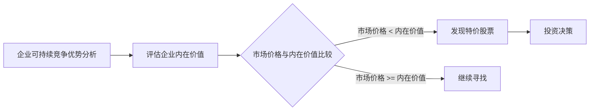

# 特价股票投资中的可持续竞争优势模型应用

> 关键词：特价股票投资、可持续竞争优势模型、投资分析、企业价值评估、竞争优势评估

> 摘要：本文聚焦于特价股票投资中可持续竞争优势模型的应用。首先介绍了相关背景，包括目的、预期读者等内容。接着阐述了核心概念，如可持续竞争优势、特价股票等及其联系。详细讲解了核心算法原理及操作步骤，通过 Python 代码进行示例。运用数学模型和公式对投资决策进行量化分析并举例说明。以实际项目为案例，从开发环境搭建到代码实现与解读进行了全面剖析。探讨了该模型在实际中的应用场景，推荐了学习资源、开发工具框架和相关论文著作。最后总结了未来发展趋势与挑战，解答常见问题并提供扩展阅读与参考资料，旨在为投资者提供全面、深入的特价股票投资策略指导。

## 1. 背景介绍 
### 1.1 目的和范围
在股票投资领域，特价股票因其价格低于内在价值而具有潜在的投资吸引力。然而，要准确识别真正具有投资价值的特价股票并非易事。可持续竞争优势模型作为一种重要的分析工具，可以帮助投资者评估企业的长期竞争力和价值。本文的目的在于深入探讨可持续竞争优势模型在特价股票投资中的应用，为投资者提供一套系统的分析方法和决策依据。范围涵盖了可持续竞争优势模型的核心概念、算法原理、数学模型，以及在实际投资项目中的应用案例，并对相关的工具和资源进行推荐。

### 1.2 预期读者
本文预期读者主要包括股票投资者，无论是个人投资者还是专业投资机构的从业者，希望通过学习可持续竞争优势模型来提高特价股票投资的成功率。同时，也适合金融专业的学生和研究人员，他们可以从本文中获取理论与实践相结合的知识，加深对股票投资和企业竞争优势的理解。

### 1.3 文档结构概述
本文将按照以下结构展开：首先介绍相关背景知识，让读者了解文章的目的、读者对象和整体结构。接着阐述核心概念及其联系，使读者对可持续竞争优势模型和特价股票有清晰的认识。然后详细讲解核心算法原理和具体操作步骤，并结合 Python 代码进行说明。通过数学模型和公式对投资决策进行量化分析，并举例说明。以实际项目为案例，介绍开发环境搭建、源代码实现和代码解读。探讨该模型在实际中的应用场景。推荐相关的学习资源、开发工具框架和论文著作。最后总结未来发展趋势与挑战，解答常见问题并提供扩展阅读与参考资料。

### 1.4 术语表
#### 1.4.1 核心术语定义
- **特价股票**：指市场价格低于其内在价值的股票。内在价值是基于企业的基本面、未来现金流等因素评估得出的股票的真实价值。
- **可持续竞争优势**：企业在市场中能够长期保持优于竞争对手的地位和盈利能力的优势。这种优势可以来源于多种因素，如品牌优势、成本优势、技术优势等。
- **投资回报率（ROI）**：投资所获得的收益与投资成本的比率，用于衡量投资的盈利能力。计算公式为：$ROI = \frac{投资收益 - 投资成本}{投资成本} \times 100\%$。

#### 1.4.2 相关概念解释
- **企业护城河**：与可持续竞争优势类似，是指企业抵御竞争对手侵蚀其市场份额和利润的能力。具有宽阔“护城河”的企业通常具有更强的可持续竞争优势。
- **内在价值评估**：通过对企业的财务状况、经营业绩、行业前景等因素进行分析，估算企业股票的内在价值。常用的方法包括现金流折现法、相对估值法等。

#### 1.4.3 缩略词列表
- **ROE**：净资产收益率（Return on Equity），是衡量企业运用自有资本的效率和盈利能力的指标。计算公式为：$ROE = \frac{净利润}{净资产} \times 100\%$。
- **EPS**：每股收益（Earnings Per Share），是指普通股股东每持有一股所能享有的企业净利润或需承担的企业净亏损。计算公式为：$EPS = \frac{净利润}{发行在外普通股股数}$。

## 2. 核心概念与联系 

### 核心概念原理
#### 可持续竞争优势
可持续竞争优势是企业在市场中生存和发展的关键因素。它可以分为多种类型，如成本领先优势、差异化优势和聚焦优势。
- **成本领先优势**：企业通过优化生产流程、降低原材料采购成本、提高运营效率等方式，使自己的产品或服务成本低于竞争对手。这样，企业可以在相同价格下获得更高的利润，或者以更低的价格吸引更多的客户。例如，沃尔玛通过大规模采购、高效的物流配送和先进的库存管理系统，实现了成本领先，从而在零售行业占据了重要地位。
- **差异化优势**：企业通过提供独特的产品或服务，满足客户的特殊需求，从而与竞争对手形成差异化。这种差异化可以体现在产品的质量、功能、设计、品牌形象等方面。例如，苹果公司以其创新的产品设计、强大的品牌影响力和优质的用户体验，在智能手机市场获得了高额利润。
- **聚焦优势**：企业专注于特定的细分市场，针对特定客户群体的需求提供专业化的产品或服务。通过聚焦，企业可以深入了解目标客户的需求，提供更符合他们需求的产品或服务，从而在细分市场中获得竞争优势。例如，一些高端定制服装品牌专注于为特定的高端客户群体提供个性化的服装定制服务。

#### 特价股票
特价股票是指市场价格低于其内在价值的股票。股票的内在价值是基于企业的基本面、未来现金流等因素评估得出的。当市场由于各种原因（如短期市场情绪波动、行业负面消息等）导致股票价格下跌到低于其内在价值时，就形成了特价股票。投资者购买特价股票的目的是在股票价格回归其内在价值的过程中获得收益。

### 架构的文本示意图
可持续竞争优势与特价股票投资之间存在着密切的联系。可持续竞争优势是评估企业内在价值的重要因素之一。具有可持续竞争优势的企业通常具有较高的盈利能力和稳定性，其未来现金流也更有保障，因此内在价值相对较高。当市场价格低于这类企业股票的内在价值时，就形成了具有投资价值的特价股票。投资者可以通过分析企业的可持续竞争优势，筛选出具有潜力的特价股票进行投资。

### Mermaid 流程图


## 3. 核心算法原理 & 具体操作步骤 

### 核心算法原理
在特价股票投资中，核心算法的目标是评估企业的可持续竞争优势和内在价值，从而判断股票是否为特价股票。常用的方法是基于财务指标和行业分析的综合评估。以下是一种简化的算法思路：
1. **收集企业财务数据**：包括营业收入、净利润、净资产、现金流等。
2. **计算关键财务指标**：如 ROE、EPS、毛利率、净利率等。
3. **评估企业可持续竞争优势**：通过分析企业的财务指标、市场份额、品牌影响力、技术创新能力等因素，评估企业的可持续竞争优势。
4. **估算企业内在价值**：可以使用现金流折现法、相对估值法等方法估算企业的内在价值。
5. **比较市场价格与内在价值**：如果市场价格低于内在价值，则认为该股票为特价股票。

### 具体操作步骤
#### 步骤 1：收集数据
可以通过金融数据提供商（如东方财富、同花顺等）或企业的财务报表收集企业的财务数据。以下是一个使用 Python 从网络获取财务数据的示例代码：
```python
import pandas as pd

# 从东方财富获取某股票的财务数据
url = 'https://emweb.securities.eastmoney.com/PC_HSF10/FinanceAnalysis/Index?type=web&code=sh600519'
dfs = pd.read_html(url)
financial_data = dfs[0]
print(financial_data)
```
#### 步骤 2：计算关键财务指标
根据收集到的财务数据，计算关键财务指标。以下是一个计算 ROE 和 EPS 的示例代码：
```python
# 假设已经获取了净利润和净资产数据
net_income = 1000  # 净利润
net_assets = 5000  # 净资产
roe = (net_income / net_assets) * 100
print(f'ROE: {roe}%')

# 假设已经获取了净利润和发行在外普通股股数
shares_outstanding = 2000  # 发行在外普通股股数
eps = net_income / shares_outstanding
print(f'EPS: {eps}')
```
#### 步骤 3：评估企业可持续竞争优势
可以通过建立评分体系，对企业的各项竞争优势因素进行评分。以下是一个简单的示例代码：
```python
# 假设各项竞争优势因素的权重和评分
factors = {
    '品牌影响力': {'weight': 0.3, 'score': 8},
    '成本优势': {'weight': 0.2, 'score': 7},
    '技术创新能力': {'weight': 0.3, 'score': 9},
    '市场份额': {'weight': 0.2, 'score': 7}
}

total_score = 0
for factor, info in factors.items():
    total_score += info['weight'] * info['score']

print(f'企业可持续竞争优势评分: {total_score}')
```
#### 步骤 4：估算企业内在价值
使用现金流折现法估算企业内在价值。以下是一个简化的示例代码：
```python
# 假设未来每年的现金流和折现率
cash_flows = [100, 120, 130, 140, 150]
discount_rate = 0.1

present_value = 0
for i, cash_flow in enumerate(cash_flows):
    present_value += cash_flow / ((1 + discount_rate) ** (i + 1))

print(f'企业内在价值: {present_value}')
```
#### 步骤 5：比较市场价格与内在价值
假设已经获取了市场价格，将其与估算的内在价值进行比较。以下是一个示例代码：
```python
market_price = 120
if market_price < present_value:
    print('该股票为特价股票，可以考虑投资')
else:
    print('该股票不是特价股票，继续寻找')
```

## 4. 数学模型和公式 & 详细讲解 & 举例说明 

### 现金流折现法
现金流折现法（Discounted Cash Flow, DCF）是一种常用的估算企业内在价值的方法。其基本原理是将企业未来的现金流按照一定的折现率折现到当前时刻，得到企业的内在价值。

#### 数学公式
$$V = \sum_{t=1}^{n} \frac{CF_t}{(1 + r)^t} + \frac{TV}{(1 + r)^n}$$
其中：
- $V$ 表示企业的内在价值；
- $CF_t$ 表示第 $t$ 期的现金流；
- $r$ 表示折现率；
- $n$ 表示预测期数；
- $TV$ 表示终值。

#### 详细讲解
1. **现金流（$CF_t$）**：是指企业在未来各期产生的现金流入减去现金流出后的净额。可以通过分析企业的历史财务数据和行业前景，预测未来各期的现金流。
2. **折现率（$r$）**：反映了资金的时间价值和投资的风险。通常可以使用企业的加权平均资本成本（WACC）作为折现率。WACC 的计算公式为：
$$WACC = w_d \times r_d \times (1 - T) + w_e \times r_e$$
其中：
- $w_d$ 表示债务资本的权重；
- $r_d$ 表示债务资本的成本；
- $T$ 表示企业所得税税率；
- $w_e$ 表示权益资本的权重；
- $r_e$ 表示权益资本的成本。
3. **终值（$TV$）**：是指预测期结束后企业的价值。可以使用永续增长模型来估算终值，公式为：
$$TV = \frac{CF_{n+1}}{r - g}$$
其中：
- $CF_{n+1}$ 表示预测期结束后下一期的现金流；
- $g$ 表示永续增长率。

#### 举例说明
假设某企业未来 5 年的现金流分别为 100 万元、120 万元、130 万元、140 万元、150 万元，折现率为 10%，预测期结束后现金流的永续增长率为 3%。则该企业的内在价值计算如下：
1. 计算前 5 年现金流的现值：
$$PV_1 = \frac{100}{(1 + 0.1)^1} + \frac{120}{(1 + 0.1)^2} + \frac{130}{(1 + 0.1)^3} + \frac{140}{(1 + 0.1)^4} + \frac{150}{(1 + 0.1)^5} \approx 463.19 \text{ 万元}$$
2. 计算终值：
首先计算第 6 年的现金流：$CF_6 = 150 \times (1 + 0.03) = 154.5$ 万元。
则终值为：
$$TV = \frac{154.5}{0.1 - 0.03} \approx 2207.14 \text{ 万元}$$
终值的现值为：
$$PV_2 = \frac{2207.14}{(1 + 0.1)^5} \approx 1370.32 \text{ 万元}$$
3. 计算企业的内在价值：
$$V = PV_1 + PV_2 = 463.19 + 1370.32 = 1833.51 \text{ 万元}$$

### 相对估值法
相对估值法是通过比较同行业其他企业的估值指标，来估算目标企业的价值。常用的相对估值指标包括市盈率（P/E）、市净率（P/B）等。

#### 数学公式
- **市盈率法**：
$$V = EPS \times P/E$$
其中：
- $V$ 表示企业的价值；
- $EPS$ 表示每股收益；
- $P/E$ 表示市盈率。
- **市净率法**：
$$V = BVPS \times P/B$$
其中：
- $BVPS$ 表示每股净资产；
- $P/B$ 表示市净率。

#### 详细讲解
1. **市盈率（P/E）**：是指股票价格与每股收益的比率。它反映了市场对企业盈利能力的预期。一般来说，市盈率越高，市场对企业的预期越好。
2. **市净率（P/B）**：是指股票价格与每股净资产的比率。它反映了市场对企业净资产的估值。市净率越低，说明股票价格相对净资产越低，可能存在投资机会。

#### 举例说明
假设某企业的每股收益为 2 元，同行业平均市盈率为 15 倍，则该企业的估值为：
$$V = 2 \times 15 = 30 \text{ 元/股}$$

假设该企业的每股净资产为 10 元，同行业平均市净率为 2 倍，则该企业的估值为：
$$V = 10 \times 2 = 20 \text{ 元/股}$$

## 5. 项目实战：代码实际案例和详细解释说明 

### 5.1  开发环境搭建
#### 安装 Python
首先需要安装 Python 环境。可以从 Python 官方网站（https://www.python.org/downloads/）下载适合自己操作系统的 Python 版本，并按照安装向导进行安装。

#### 安装必要的库
在命令行中使用以下命令安装必要的库：
```sh
pip install pandas requests beautifulsoup4
```
- `pandas`：用于数据处理和分析。
- `requests`：用于发送 HTTP 请求，获取网络数据。
- `beautifulsoup4`：用于解析 HTML 页面。

### 5.2  源代码详细实现和代码解读
以下是一个完整的特价股票投资分析的 Python 代码示例：
```python
import requests
from bs4 import BeautifulSoup
import pandas as pd

# 定义函数获取某股票的财务数据
def get_financial_data(stock_code):
    url = f'https://emweb.securities.eastmoney.com/PC_HSF10/FinanceAnalysis/Index?type=web&code={stock_code}'
    response = requests.get(url)
    soup = BeautifulSoup(response.text, 'html.parser')
    tables = soup.find_all('table')
    financial_data = pd.read_html(str(tables))[0]
    return financial_data

# 定义函数计算 ROE
def calculate_roe(net_income, net_assets):
    return (net_income / net_assets) * 100

# 定义函数计算 EPS
def calculate_eps(net_income, shares_outstanding):
    return net_income / shares_outstanding

# 定义函数评估企业可持续竞争优势
def evaluate_competitive_advantage():
    factors = {
        '品牌影响力': {'weight': 0.3, 'score': 8},
        '成本优势': {'weight': 0.2, 'score': 7},
        '技术创新能力': {'weight': 0.3, 'score': 9},
        '市场份额': {'weight': 0.2, 'score': 7}
    }
    total_score = 0
    for factor, info in factors.items():
        total_score += info['weight'] * info['score']
    return total_score

# 定义函数使用现金流折现法估算企业内在价值
def estimate_intrinsic_value():
    cash_flows = [100, 120, 130, 140, 150]
    discount_rate = 0.1
    present_value = 0
    for i, cash_flow in enumerate(cash_flows):
        present_value += cash_flow / ((1 + discount_rate) ** (i + 1))
    return present_value

# 主函数
def main():
    stock_code = 'sh600519'
    # 获取财务数据
    financial_data = get_financial_data(stock_code)
    print('财务数据：')
    print(financial_data)

    # 假设已经从财务数据中提取了净利润、净资产和发行在外普通股股数
    net_income = 1000
    net_assets = 5000
    shares_outstanding = 2000

    # 计算 ROE 和 EPS
    roe = calculate_roe(net_income, net_assets)
    eps = calculate_eps(net_income, shares_outstanding)
    print(f'ROE: {roe}%')
    print(f'EPS: {eps}')

    # 评估企业可持续竞争优势
    competitive_advantage_score = evaluate_competitive_advantage()
    print(f'企业可持续竞争优势评分: {competitive_advantage_score}')

    # 估算企业内在价值
    intrinsic_value = estimate_intrinsic_value()
    print(f'企业内在价值: {intrinsic_value}')

    # 假设已经获取了市场价格
    market_price = 120
    if market_price < intrinsic_value:
        print('该股票为特价股票，可以考虑投资')
    else:
        print('该股票不是特价股票，继续寻找')

if __name__ == '__main__':
    main()
```

### 5.3  代码解读与分析
1. **获取财务数据**：`get_financial_data` 函数通过发送 HTTP 请求获取某股票的财务数据，并使用 `pandas` 的 `read_html` 方法解析 HTML 页面中的表格数据。
2. **计算关键财务指标**：`calculate_roe` 和 `calculate_eps` 函数分别用于计算 ROE 和 EPS。
3. **评估企业可持续竞争优势**：`evaluate_competitive_advantage` 函数通过建立评分体系，对企业的各项竞争优势因素进行评分。
4. **估算企业内在价值**：`estimate_intrinsic_value` 函数使用现金流折现法估算企业的内在价值。
5. **主函数**：`main` 函数调用上述函数，完成数据获取、指标计算、竞争优势评估和内在价值估算，并根据市场价格与内在价值的比较结果给出投资建议。

## 6. 实际应用场景 
### 个人投资者
对于个人投资者来说，可持续竞争优势模型可以帮助他们筛选出具有潜力的特价股票。个人投资者可以通过分析企业的财务指标、品牌影响力、技术创新能力等因素，评估企业的可持续竞争优势，从而找到被市场低估的股票进行投资。例如，个人投资者可以使用上述的 Python 代码，结合自己的投资分析，选择适合自己的投资标的。

### 专业投资机构
专业投资机构通常拥有更丰富的资源和更专业的分析团队。他们可以使用可持续竞争优势模型对大量的股票进行筛选和分析，构建投资组合。投资机构可以通过深入研究企业的可持续竞争优势，预测企业的未来发展趋势，从而做出更准确的投资决策。例如，一些对冲基金可以利用该模型挖掘市场中的投资机会，获取超额收益。

### 企业战略投资
企业在进行战略投资时，也可以使用可持续竞争优势模型评估目标企业的价值。企业可以通过分析目标企业的竞争优势，判断其是否与自身的战略布局相契合，从而决定是否进行投资或并购。例如，一家科技企业在考虑收购另一家科技企业时，可以通过评估目标企业的技术创新能力、市场份额等竞争优势因素，来判断收购的可行性和价值。

## 7. 工具和资源推荐
### 7.1 学习资源推荐
#### 7.1.1 书籍推荐
- 《聪明的投资者》（The Intelligent Investor）：作者是本杰明·格雷厄姆（Benjamin Graham），被誉为“价值投资之父”。这本书是价值投资领域的经典之作，详细介绍了价值投资的理念和方法，对特价股票投资有很大的指导意义。
- 《巴菲特致股东的信：股份公司教程》（The Essays of Warren Buffett: Lessons for Corporate America）：由沃伦·巴菲特（Warren Buffett）的信件整理而成。书中包含了巴菲特对投资、企业管理等方面的深刻见解，是学习价值投资和企业分析的重要读物。
- 《竞争优势：创造和保持卓越绩效》（Competitive Advantage: Creating and Sustaining Superior Performance）：作者是迈克尔·波特（Michael Porter），他是竞争战略领域的权威专家。这本书系统地阐述了企业竞争优势的来源和构建方法，对理解可持续竞争优势模型有很大的帮助。

#### 7.1.2 在线课程
- Coursera 上的“投资学原理”（Principles of Investing）：该课程由知名大学的教授授课，涵盖了投资的基本原理、股票投资分析等内容，适合初学者学习。
- edX 上的“金融市场”（Financial Markets）：由耶鲁大学的教授授课，深入讲解了金融市场的运行机制和投资策略，对提高投资分析能力有很大的帮助。

#### 7.1.3 技术博客和网站
- 雪球网（https://xueqiu.com/）：是一个投资者社区，提供股票行情、财务数据、投资分析等信息。投资者可以在上面交流投资经验，学习他人的分析方法。
- 东方财富网（https://www.eastmoney.com/）：是国内知名的金融门户网站，提供丰富的金融数据和资讯。投资者可以通过该网站获取企业的财务报表、行业分析等信息。

### 7.2 开发工具框架推荐
#### 7.2.1 IDE和编辑器
- PyCharm：是一款专业的 Python 集成开发环境（IDE），具有代码编辑、调试、版本控制等功能，适合开发 Python 程序。
- Visual Studio Code：是一款轻量级的代码编辑器，支持多种编程语言，通过安装插件可以实现 Python 开发的各种功能。

#### 7.2.2 调试和性能分析工具
- PDB：是 Python 自带的调试器，可以帮助开发者调试 Python 程序。
- cProfile：是 Python 的性能分析工具，可以分析程序的运行时间和函数调用情况，帮助开发者优化程序性能。

#### 7.2.3 相关框架和库
- Pandas：用于数据处理和分析，提供了丰富的数据结构和数据操作方法。
- NumPy：是 Python 的数值计算库，提供了高效的数组操作和数学函数。
- Scikit-learn：是 Python 的机器学习库，提供了各种机器学习算法和工具，可用于数据挖掘和预测分析。

### 7.3 相关论文著作推荐
#### 7.3.1 经典论文
- “The Capital Asset Pricing Model: Theory and Evidence”：该论文详细介绍了资本资产定价模型（CAPM），是现代金融理论的重要基础。
- “Efficient Capital Markets: A Review of Theory and Empirical Work”：作者是尤金·法玛（Eugene F. Fama），他是有效市场假说的提出者。这篇论文对有效市场假说进行了系统的阐述和实证研究。

#### 7.3.2 最新研究成果
- 可以关注《金融研究》《管理世界》等国内权威金融期刊，以及《Journal of Finance》《Review of Financial Studies》等国际顶级金融期刊，获取最新的金融研究成果。

#### 7.3.3 应用案例分析
- 可以参考一些投资机构的研究报告和案例分析，了解他们在实际投资中如何应用可持续竞争优势模型进行分析和决策。例如，高盛、摩根士丹利等投资银行的研究报告。

## 8. 总结：未来发展趋势与挑战
### 未来发展趋势
#### 数据驱动的投资分析
随着信息技术的发展，金融数据的获取和分析变得更加便捷和高效。未来，可持续竞争优势模型将更多地依赖于大数据和人工智能技术，通过对海量数据的挖掘和分析，更准确地评估企业的竞争优势和内在价值。

#### 跨学科融合
可持续竞争优势模型的应用将不再局限于金融领域，而是与管理学、经济学、社会学等多个学科进行融合。例如，结合管理学的企业战略理论，更深入地分析企业的竞争优势来源；结合社会学的消费者行为理论，更好地理解市场需求和企业的市场定位。

#### 全球化投资
随着全球经济一体化的发展，投资者的投资范围将不再局限于本国市场，而是拓展到全球市场。可持续竞争优势模型将需要考虑不同国家和地区的政治、经济、文化等因素，以适应全球化投资的需求。

### 挑战
#### 数据质量和可靠性
数据是可持续竞争优势模型应用的基础，但金融数据的质量和可靠性可能存在问题。例如，企业财务报表可能存在造假行为，市场数据可能存在误差。因此，如何获取准确、可靠的数据是模型应用的一大挑战。

#### 模型的复杂性和可解释性
随着模型的不断发展和完善，其复杂性也在不断增加。复杂的模型可能会导致计算成本增加，同时也会降低模型的可解释性。投资者需要在模型的准确性和可解释性之间找到平衡。

#### 市场的不确定性
股票市场是一个复杂的系统，受到多种因素的影响，如宏观经济环境、政策变化、突发事件等。这些因素的不确定性增加了模型预测的难度，投资者需要不断调整模型和投资策略，以适应市场的变化。

## 9. 附录：常见问题与解答
### 问题 1：如何确定企业的可持续竞争优势？
答：可以从多个方面来确定企业的可持续竞争优势，如品牌影响力、成本优势、技术创新能力、市场份额等。可以通过分析企业的财务指标、行业地位、研发投入等数据，结合行业研究和实地调研，综合评估企业的竞争优势。

### 问题 2：现金流折现法中的折现率如何确定？
答：折现率通常可以使用企业的加权平均资本成本（WACC）。WACC 的计算需要确定债务资本的权重、债务资本的成本、权益资本的权重和权益资本的成本。债务资本的成本可以根据企业的贷款利率确定，权益资本的成本可以使用资本资产定价模型（CAPM）计算。

### 问题 3：可持续竞争优势模型适用于所有类型的股票吗？
答：可持续竞争优势模型更适用于具有一定规模和稳定性的企业的股票。对于一些新兴行业的初创企业，由于其业务模式和盈利能力尚未稳定，可持续竞争优势较难评估，该模型的应用可能存在一定的局限性。

### 问题 4：如何获取准确的企业财务数据？
答：可以通过金融数据提供商（如东方财富、同花顺等）、企业的官方网站、证券交易所等渠道获取企业的财务数据。同时，为了确保数据的准确性，可以参考多个数据源，并对数据进行交叉验证。

## 10. 扩展阅读 & 参考资料
### 扩展阅读
- 《金融炼金术》（The Alchemy of Finance）：作者是乔治·索罗斯（George Soros），书中介绍了他的投资哲学和金融市场的反射理论。
- 《非理性繁荣》（Irrational Exuberance）：作者是罗伯特·席勒（Robert J. Shiller），探讨了金融市场中的非理性行为和泡沫现象。

### 参考资料
- 东方财富网：https://www.eastmoney.com/
- 同花顺财经：https://www.10jqka.com.cn/
- Coursera：https://www.coursera.org/
- edX：https://www.edx.org/