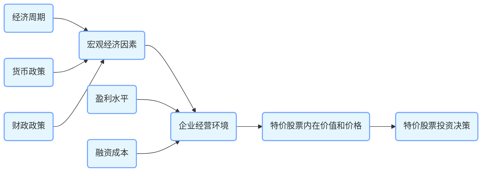

# 特价股票投资中的宏观经济因素分析

> 关键词：特价股票投资、宏观经济因素、经济周期、货币政策、财政政策

> 摘要：本文旨在深入分析特价股票投资中宏观经济因素所起的作用。通过对宏观经济核心概念的阐述，介绍相关算法原理及数学模型，结合实际项目案例展示宏观经济因素如何影响特价股票投资决策。还探讨了该领域的实际应用场景，推荐了学习资源、开发工具和相关论文，最后总结了未来发展趋势与挑战，并对常见问题进行解答。

## 1. 背景介绍 
### 1.1 目的和范围
本研究的目的是全面剖析宏观经济因素对特价股票投资的影响。特价股票通常指价格相对其内在价值被低估的股票，对这类股票进行投资决策时，宏观经济因素是不可忽视的重要方面。范围涵盖了主要的宏观经济指标，如国内生产总值（GDP）、通货膨胀率、利率、货币政策、财政政策等，以及它们与特价股票投资之间的相互关系。

### 1.2 预期读者
本文预期读者包括股票投资者、金融分析师、投资顾问以及对金融市场和宏观经济有兴趣的研究人员。对于投资者来说，了解宏观经济因素如何影响特价股票投资有助于做出更明智的投资决策；金融分析师和投资顾问可以将本文的分析方法和结论应用于实际工作中；研究人员则可以在本文基础上进行更深入的学术研究。

### 1.3 文档结构概述
本文首先介绍宏观经济的核心概念及其与特价股票投资的联系，通过文本示意图和 Mermaid 流程图进行清晰展示。接着阐述核心算法原理和具体操作步骤，使用 Python 源代码详细说明。然后给出相关的数学模型和公式，并结合实际例子进行讲解。之后通过项目实战，展示代码实际案例并进行详细解释。再探讨宏观经济因素在特价股票投资中的实际应用场景。随后推荐学习资源、开发工具和相关论文。最后总结未来发展趋势与挑战，解答常见问题并提供扩展阅读和参考资料。

### 1.4 术语表
#### 1.4.1 核心术语定义
- **特价股票**：价格相对其内在价值被低估的股票，通常具有一定的投资价值。
- **宏观经济因素**：影响整个经济体系运行的各种因素，如 GDP、通货膨胀率、利率等。
- **经济周期**：经济活动沿着经济发展的总体趋势所经历的有规律的扩张和收缩。
- **货币政策**：中央银行通过控制货币供应量以及通过货币供应量来调节利率进而影响投资和整个经济以达到一定经济目标的行为。
- **财政政策**：政府通过调整财政收支来影响经济活动的政策。

#### 1.4.2 相关概念解释
- **内在价值**：股票所代表的企业的真实价值，通常通过对企业的财务状况、盈利能力、行业前景等因素进行分析来估算。
- **通货膨胀率**：物价总水平在一定时期内的上涨幅度，反映了货币的购买力变化。
- **利率**：一定时期内利息额与借贷资金额（本金）的比率，对企业的融资成本和投资者的投资收益有重要影响。

#### 1.4.3 缩略词列表
- **GDP**：国内生产总值（Gross Domestic Product）
- **CPI**：消费者物价指数（Consumer Price Index）
- **PPI**：生产者物价指数（Producer Price Index）
- **M2**：广义货币供应量（Broad Money Supply）

## 2. 核心概念与联系 

### 核心概念原理
宏观经济因素对特价股票投资有着深远的影响。经济周期是宏观经济运行的重要特征，包括繁荣、衰退、萧条和复苏四个阶段。在不同的经济周期阶段，特价股票的表现和投资机会也有所不同。

在繁荣阶段，经济增长强劲，企业盈利增加，市场对股票的需求旺盛，特价股票可能会随着市场整体上涨而被发掘，价格逐渐向其内在价值回归。衰退阶段，经济增长放缓，企业盈利下滑，市场信心受挫，特价股票可能面临更大的下行压力，但也可能因为市场过度恐慌而被进一步低估，为投资者提供更好的买入机会。萧条阶段，经济处于低谷，多数企业经营困难，但一些具有核心竞争力和抗风险能力的特价股票可能会在这个阶段脱颖而出。复苏阶段，经济开始回升，企业盈利逐渐改善，特价股票的投资价值更加凸显。

货币政策和财政政策也是影响特价股票投资的重要因素。宽松的货币政策，如降低利率、增加货币供应量，会降低企业的融资成本，刺激经济增长，有利于特价股票的表现。相反，紧缩的货币政策则会提高企业的融资成本，抑制经济增长，对特价股票产生不利影响。财政政策方面，政府增加支出、减少税收的扩张性财政政策可以刺激经济增长，提高企业的盈利水平，对特价股票投资有积极作用；而减少支出、增加税收的紧缩性财政政策则可能对特价股票投资产生负面影响。

### 架构的文本示意图
宏观经济因素与特价股票投资之间的关系可以用以下文本示意图表示：

宏观经济因素（经济周期、货币政策、财政政策等） -> 影响企业经营环境（盈利水平、融资成本等） -> 影响特价股票的内在价值和市场价格 -> 影响特价股票投资决策

### Mermaid 流程图


## 3. 核心算法原理 & 具体操作步骤 

### 算法原理
在分析宏观经济因素对特价股票投资的影响时，我们可以采用多元线性回归模型。该模型的基本思想是通过建立宏观经济因素与特价股票收益率之间的线性关系，来评估各个宏观经济因素对特价股票投资的影响程度。

假设我们有 $n$ 个宏观经济因素 $x_1, x_2, \cdots, x_n$ 和特价股票的收益率 $y$，多元线性回归模型可以表示为：

$y = \beta_0 + \beta_1 x_1 + \beta_2 x_2 + \cdots + \beta_n x_n + \epsilon$

其中，$\beta_0$ 是截距项，$\beta_1, \beta_2, \cdots, \beta_n$ 是各个宏观经济因素的回归系数，$\epsilon$ 是误差项。

### 具体操作步骤
1. **数据收集**：收集宏观经济数据和特价股票的收益率数据。宏观经济数据可以包括 GDP 增长率、通货膨胀率、利率等，特价股票的收益率数据可以通过计算股票价格的变化得到。
2. **数据预处理**：对收集到的数据进行清洗和预处理，包括去除缺失值、异常值等。
3. **模型建立**：使用 Python 的 `statsmodels` 库建立多元线性回归模型。
4. **模型拟合**：将预处理后的数据输入到模型中进行拟合，得到回归系数。
5. **模型评估**：使用拟合优度、t 检验、F 检验等指标对模型进行评估，判断模型的有效性和各个宏观经济因素的显著性。
6. **结果分析**：根据回归系数的正负和大小，分析各个宏观经济因素对特价股票收益率的影响方向和程度。

### Python 源代码实现
```python
import pandas as pd
import statsmodels.api as sm

# 假设我们已经收集到了宏观经济数据和特价股票收益率数据
# 数据存储在一个 CSV 文件中，第一列是特价股票收益率，其余列是宏观经济因素
data = pd.read_csv('macro_stock_data.csv')

# 分离自变量和因变量
X = data.drop('stock_return', axis=1)
y = data['stock_return']

# 添加常数项
X = sm.add_constant(X)

# 建立多元线性回归模型
model = sm.OLS(y, X)

# 拟合模型
results = model.fit()

# 输出模型摘要
print(results.summary())
```

## 4. 数学模型和公式 & 详细讲解 & 举例说明 

### 数学模型
如前所述，我们使用的多元线性回归模型为：

$y = \beta_0 + \beta_1 x_1 + \beta_2 x_2 + \cdots + \beta_n x_n + \epsilon$

其中，$y$ 是特价股票的收益率，$x_1, x_2, \cdots, x_n$ 是宏观经济因素，$\beta_0$ 是截距项，$\beta_1, \beta_2, \cdots, \beta_n$ 是回归系数，$\epsilon$ 是误差项。

### 公式讲解
- **回归系数 $\beta_i$**：表示在其他宏观经济因素不变的情况下，第 $i$ 个宏观经济因素每变化一个单位，特价股票收益率的平均变化量。如果 $\beta_i$ 为正，说明该宏观经济因素与特价股票收益率呈正相关；如果 $\beta_i$ 为负，说明该宏观经济因素与特价股票收益率呈负相关。
- **截距项 $\beta_0$**：表示当所有宏观经济因素都为 0 时，特价股票的平均收益率。
- **误差项 $\epsilon$**：表示模型无法解释的部分，反映了除宏观经济因素外其他因素对特价股票收益率的影响。

### 举例说明
假设我们使用 GDP 增长率（$x_1$）、通货膨胀率（$x_2$）和利率（$x_3$）作为宏观经济因素，建立的多元线性回归模型为：

$y = 0.05 + 0.1 x_1 - 0.05 x_2 - 0.2 x_3 + \epsilon$

这意味着，在其他因素不变的情况下，GDP 增长率每提高 1 个百分点，特价股票收益率平均提高 0.1 个百分点；通货膨胀率每提高 1 个百分点，特价股票收益率平均降低 0.05 个百分点；利率每提高 1 个百分点，特价股票收益率平均降低 0.2 个百分点。

## 5. 项目实战：代码实际案例和详细解释说明 

### 5.1 开发环境搭建
- **操作系统**：Windows、Linux 或 macOS 均可。
- **Python 版本**：建议使用 Python 3.7 及以上版本。
- **开发工具**：可以使用 Jupyter Notebook、PyCharm 等开发工具。
- **所需库**：`pandas`、`statsmodels`、`numpy` 等。可以使用以下命令进行安装：
```bash
pip install pandas statsmodels numpy
```

### 5.2 源代码详细实现和代码解读
```python
import pandas as pd
import statsmodels.api as sm
import numpy as np

# 读取数据
data = pd.read_csv('macro_stock_data.csv')

# 分离自变量和因变量
X = data.drop('stock_return', axis=1)
y = data['stock_return']

# 添加常数项
X = sm.add_constant(X)

# 建立多元线性回归模型
model = sm.OLS(y, X)

# 拟合模型
results = model.fit()

# 输出模型摘要
print(results.summary())

# 预测
new_data = pd.DataFrame({
    'const': [1],
    'gdp_growth': [0.03],
    'inflation': [0.02],
    'interest_rate': [0.05]
})

prediction = results.predict(new_data)
print("预测的特价股票收益率为:", prediction[0])
```

### 代码解读与分析
1. **数据读取**：使用 `pandas` 库的 `read_csv` 函数读取存储宏观经济数据和特价股票收益率数据的 CSV 文件。
2. **自变量和因变量分离**：将数据集中的特价股票收益率列作为因变量 $y$，其余列作为自变量 $X$。
3. **添加常数项**：使用 `sm.add_constant` 函数为自变量矩阵 $X$ 添加常数项，以便在回归模型中包含截距项。
4. **建立模型**：使用 `sm.OLS` 函数建立多元线性回归模型。
5. **模型拟合**：使用 `fit` 方法对模型进行拟合，得到回归结果。
6. **模型摘要输出**：使用 `summary` 方法输出模型的详细信息，包括回归系数、拟合优度、t 检验、F 检验等指标。
7. **预测**：创建一个新的数据框 `new_data`，包含要预测的宏观经济因素值。使用 `predict` 方法对特价股票收益率进行预测，并输出预测结果。

## 6. 实际应用场景 
### 投资决策
投资者可以根据宏观经济因素的分析结果，调整特价股票的投资组合。例如，在经济繁荣阶段，当 GDP 增长率较高、通货膨胀率较低、利率稳定时，可以适当增加特价股票的投资比例；在经济衰退阶段，当 GDP 增长率下降、通货膨胀率上升、利率升高时，可以减少特价股票的投资比例，或者选择具有较强抗风险能力的特价股票。

### 风险评估
宏观经济因素的变化会对特价股票的价格产生影响，从而带来投资风险。通过分析宏观经济因素与特价股票收益率之间的关系，可以评估投资风险的大小。例如，如果某个宏观经济因素的回归系数较大且不稳定，说明该因素对特价股票收益率的影响较大，投资风险也相对较高。

### 行业分析
不同行业的特价股票对宏观经济因素的敏感度不同。例如，周期性行业（如钢铁、汽车等）的特价股票对经济周期的变化较为敏感，而防御性行业（如食品、医药等）的特价股票对经济周期的变化相对不敏感。通过分析宏观经济因素对不同行业特价股票的影响，可以选择具有较好投资前景的行业进行投资。

## 7. 工具和资源推荐
### 7.1 学习资源推荐
#### 7.1.1 书籍推荐
- 《宏观经济学》（N. 格里高利·曼昆著）：经典的宏观经济学教材，系统介绍了宏观经济的基本理论和分析方法。
- 《聪明的投资者》（本杰明·格雷厄姆著）：价值投资的经典著作，对股票投资的基本原理和方法进行了深入阐述。
- 《金融市场与金融机构基础》（弗兰克·J. 法博齐等著）：全面介绍了金融市场和金融机构的基本知识，有助于理解宏观经济因素与金融市场的相互关系。

#### 7.1.2 在线课程
- Coursera 上的“宏观经济学原理”课程：由知名高校教授授课，系统讲解宏观经济的基本概念和分析方法。
- edX 上的“投资学原理”课程：介绍了股票投资的基本原理和策略，包括如何分析宏观经济因素对股票投资的影响。
- 中国大学 MOOC 上的“金融市场学”课程：全面介绍金融市场的基本知识和运行机制，对理解宏观经济因素在金融市场中的作用有很大帮助。

#### 7.1.3 技术博客和网站
- 雪球网：国内知名的股票投资社区，提供丰富的股票投资资讯和分析文章，包括宏观经济因素对股票投资的影响分析。
- 东方财富网：提供全面的金融市场数据和资讯，包括宏观经济数据、股票行情等，有助于投资者及时了解宏观经济动态和股票市场变化。
- 华尔街见闻：专注于全球金融市场的资讯平台，提供及时、准确的宏观经济新闻和分析，对投资者把握宏观经济趋势有很大帮助。

### 7.2 开发工具框架推荐
#### 7.2.1 IDE和编辑器
- Jupyter Notebook：一个交互式的开发环境，适合进行数据探索和模型开发，支持 Python、R 等多种编程语言。
- PyCharm：专业的 Python 开发工具，具有强大的代码编辑、调试和项目管理功能。
- Visual Studio Code：一款轻量级的代码编辑器，支持多种编程语言和插件，可用于 Python 代码的开发和调试。

#### 7.2.2 调试和性能分析工具
- `pdb`：Python 内置的调试工具，可用于调试 Python 代码，定位和解决代码中的问题。
- `cProfile`：Python 内置的性能分析工具，可用于分析 Python 代码的性能瓶颈，找出代码中耗时较长的部分。
- `memory_profiler`：用于分析 Python 代码的内存使用情况，帮助开发者优化代码的内存占用。

#### 7.2.3 相关框架和库
- `pandas`：用于数据处理和分析的 Python 库，提供了高效的数据结构和数据操作方法，适合处理宏观经济数据和股票收益率数据。
- `statsmodels`：用于统计建模和计量分析的 Python 库，支持多种统计模型，如线性回归、时间序列分析等。
- `scikit-learn`：用于机器学习的 Python 库，提供了丰富的机器学习算法和工具，可用于建立更复杂的投资模型。

### 7.3 相关论文著作推荐
#### 7.3.1 经典论文
- Fama, E. F., & French, K. R. (1993). Common risk factors in the returns on stocks and bonds. *Journal of Financial Economics*, 33(1), 3-56. 该论文提出了著名的 Fama-French 三因子模型，对股票收益率的影响因素进行了深入研究。
- Campbell, J. Y., & Shiller, R. J. (1988). The dividend-price ratio and expectations of future dividends and discount factors. *The Review of Financial Studies*, 1(3), 195-228. 该论文研究了股息价格比与未来股息和贴现因子之间的关系，对股票估值有重要意义。

#### 7.3.2 最新研究成果
- Rapach, D. E., Strauss, J. K., & Zhou, G. (2013). Out-of-sample equity premium prediction: Combination forecasts and links to the real economy. *Review of Financial Studies*, 26(4), 821-862. 该论文研究了宏观经济因素与股票市场溢价预测之间的关系，提出了组合预测方法。
- Bali, T. G., Brown, S. J., & Caglayan, M. (2017). Economic uncertainty and the cross-section of expected stock returns. *Journal of Financial Economics*, 126(3), 537-561. 该论文研究了经济不确定性对股票横截面预期收益率的影响。

#### 7.3.3 应用案例分析
- Ang, A., & Bekaert, G. (2007). Stock return predictability: Is it there? *Review of Financial Studies*, 20(3), 651-707. 该论文通过实证分析，探讨了股票收益率的可预测性以及宏观经济因素在其中的作用。
- Welch, I., & Goyal, A. (2008). A comprehensive look at the empirical performance of equity premium prediction. *The Review of Financial Studies*, 21(4), 1455-1508. 该论文对股票市场溢价预测的实证研究进行了全面回顾和分析。

## 8. 总结：未来发展趋势与挑战
### 未来发展趋势
- **大数据和人工智能的应用**：随着大数据技术的发展，投资者可以获取更多的宏观经济数据和股票市场数据，利用人工智能算法进行数据分析和模型建立，提高投资决策的准确性和效率。
- **跨学科研究的加强**：宏观经济因素对特价股票投资的影响是一个复杂的问题，需要综合运用经济学、金融学、统计学、计算机科学等多学科的知识进行研究。未来，跨学科研究将成为该领域的发展趋势。
- **国际化投资的增加**：随着全球经济一体化的发展，投资者越来越关注国际市场的宏观经济动态和特价股票投资机会。未来，国际化投资将成为特价股票投资的重要方向。

### 挑战
- **数据质量和可靠性**：宏观经济数据的质量和可靠性对投资决策至关重要。然而，由于数据来源的多样性和数据处理方法的差异，数据质量和可靠性可能存在问题，需要投资者进行仔细甄别和处理。
- **模型的复杂性和不确定性**：宏观经济因素与特价股票投资之间的关系非常复杂，建立准确的模型难度较大。而且，宏观经济环境不断变化，模型的有效性和稳定性也面临挑战。
- **政策风险**：政府的货币政策、财政政策等宏观经济政策的变化会对特价股票投资产生重大影响。政策的不确定性增加了投资风险，投资者需要密切关注政策动态，及时调整投资策略。

## 9. 附录：常见问题与解答
### 问题 1：如何判断一只股票是否为特价股票？
判断一只股票是否为特价股票需要综合考虑多个因素。可以通过分析公司的财务报表，计算市盈率、市净率等估值指标，与同行业其他公司进行比较。如果该股票的估值指标明显低于同行业平均水平，且公司具有良好的盈利能力和发展前景，则可能是特价股票。此外，还可以关注市场情绪和投资者预期，当市场对某只股票过度悲观时，也可能出现特价股票的投资机会。

### 问题 2：宏观经济因素对不同行业的特价股票影响是否相同？
不同行业的特价股票对宏观经济因素的敏感度不同。周期性行业（如钢铁、汽车等）的特价股票对经济周期的变化较为敏感，在经济繁荣阶段，这些行业的企业盈利增加，特价股票的价格可能会大幅上涨；在经济衰退阶段，企业盈利下滑，特价股票的价格可能会受到较大影响。防御性行业（如食品、医药等）的特价股票对经济周期的变化相对不敏感，因为这些行业的产品需求相对稳定，受经济波动的影响较小。

### 问题 3：如何利用宏观经济因素进行特价股票投资决策？
投资者可以通过分析宏观经济因素的变化趋势，判断经济所处的周期阶段，进而调整特价股票的投资组合。在经济繁荣阶段，可以增加周期性行业特价股票的投资比例；在经济衰退阶段，可以减少周期性行业特价股票的投资比例，增加防御性行业特价股票的投资比例。此外，还可以关注货币政策和财政政策的变化，根据政策导向选择具有投资潜力的特价股票。

### 问题 4：多元线性回归模型在分析宏观经济因素对特价股票投资的影响时存在哪些局限性？
多元线性回归模型假设宏观经济因素与特价股票收益率之间存在线性关系，但实际情况可能并非如此。宏观经济因素之间可能存在复杂的非线性关系，而且还可能受到其他未考虑因素的影响。此外，多元线性回归模型的有效性依赖于数据的质量和样本的代表性，如果数据存在偏差或样本不具有代表性，模型的结果可能会不准确。

## 10. 扩展阅读 & 参考资料
### 扩展阅读
- 《金融炼金术》（乔治·索罗斯著）：作者通过讲述自己的投资经历，阐述了金融市场的运行规律和投资哲学，对投资者理解宏观经济因素与金融市场的关系有很大启发。
- 《漫步华尔街》（伯顿·马尔基尔著）：介绍了股票投资的各种理论和方法，包括技术分析、基本面分析等，对投资者进行特价股票投资有一定的指导作用。

### 参考资料
- 国家统计局官方网站：提供权威的宏观经济数据，如 GDP、通货膨胀率等。
- 中国人民银行官方网站：发布货币政策相关信息，包括利率调整、货币供应量等。
- 证券交易所官方网站：提供股票市场的行情数据和上市公司的财务报表等信息。