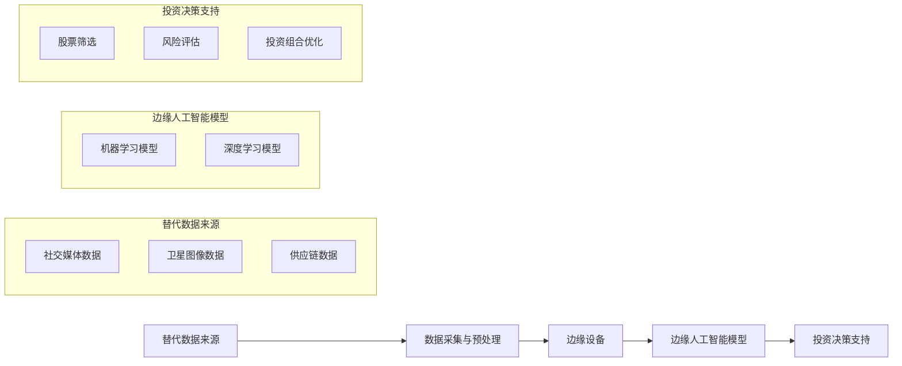

# 特价股票投资中的替代数据分析与边缘人工智能应用

> 关键词：特价股票投资、替代数据分析、边缘人工智能、股票预测、金融科技

> 摘要：本文聚焦于特价股票投资领域，深入探讨了替代数据分析与边缘人工智能的应用。首先介绍了相关背景知识，明确了文章的目的、范围、预期读者和文档结构。接着阐述了替代数据、边缘人工智能等核心概念及其联系，并给出了相应的原理和架构示意图。详细讲解了核心算法原理，结合 Python 源代码进行说明，同时给出了相关数学模型和公式。通过项目实战展示了代码的实际案例和详细解释。分析了其在特价股票投资中的实际应用场景，推荐了相关的学习资源、开发工具框架和论文著作。最后总结了未来发展趋势与挑战，并提供了常见问题解答和扩展阅读参考资料，旨在为投资者和技术人员提供全面且深入的技术与投资融合的知识体系。

## 1. 背景介绍 
### 1.1 目的和范围
在股票投资市场中，特价股票往往蕴含着巨大的投资机会，但同时也伴随着较高的风险。传统的股票分析方法主要依赖于财务报表、市场行情等公开数据，然而这些数据具有一定的局限性，无法全面反映股票的真实价值和潜在风险。替代数据分析作为一种新兴的分析方法，通过收集和分析非传统来源的数据，如社交媒体数据、卫星图像数据、供应链数据等，可以为投资者提供更全面、更及时的信息。边缘人工智能则可以在数据产生的边缘端进行实时处理和分析，提高数据处理效率和决策速度。本文的目的在于探讨替代数据分析与边缘人工智能在特价股票投资中的应用，为投资者提供新的投资思路和方法。

本文的范围主要涵盖替代数据分析和边缘人工智能的基本概念、核心算法原理、数学模型、实际应用场景以及相关工具和资源推荐等方面。通过理论分析和实际案例相结合的方式，深入探讨替代数据分析与边缘人工智能在特价股票投资中的应用价值和潜力。

### 1.2 预期读者
本文的预期读者包括股票投资者、金融分析师、数据科学家、人工智能工程师以及对金融科技和股票投资感兴趣的研究人员和爱好者。对于股票投资者来说，本文可以帮助他们了解替代数据分析和边缘人工智能在股票投资中的应用，从而更好地做出投资决策；对于金融分析师来说，本文可以为他们提供新的分析方法和工具，提高分析的准确性和效率；对于数据科学家和人工智能工程师来说，本文可以为他们提供在金融领域的应用案例和研究方向；对于研究人员和爱好者来说，本文可以为他们提供一个全面了解替代数据分析和边缘人工智能在股票投资中应用的平台。

### 1.3 文档结构概述
本文共分为十个部分，具体结构如下：
1. **背景介绍**：介绍本文的目的、范围、预期读者和文档结构，以及相关术语的定义和解释。
2. **核心概念与联系**：阐述替代数据、边缘人工智能等核心概念的原理和架构，并给出相应的文本示意图和 Mermaid 流程图。
3. **核心算法原理 & 具体操作步骤**：详细讲解替代数据分析和边缘人工智能的核心算法原理，结合 Python 源代码进行说明。
4. **数学模型和公式 & 详细讲解 & 举例说明**：给出替代数据分析和边缘人工智能的数学模型和公式，并进行详细讲解和举例说明。
5. **项目实战：代码实际案例和详细解释说明**：通过项目实战展示替代数据分析和边缘人工智能在特价股票投资中的应用，包括开发环境搭建、源代码详细实现和代码解读。
6. **实际应用场景**：分析替代数据分析和边缘人工智能在特价股票投资中的实际应用场景，如股票筛选、风险评估、投资组合优化等。
7. **工具和资源推荐**：推荐相关的学习资源、开发工具框架和论文著作，帮助读者进一步深入学习和研究。
8. **总结：未来发展趋势与挑战**：总结替代数据分析和边缘人工智能在特价股票投资中的应用现状和未来发展趋势，分析面临的挑战和解决方案。
9. **附录：常见问题与解答**：提供常见问题的解答，帮助读者解决在学习和应用过程中遇到的问题。
10. **扩展阅读 & 参考资料**：提供扩展阅读的建议和参考资料，方便读者进一步深入学习和研究。

### 1.4 术语表
#### 1.4.1 核心术语定义
- **特价股票**：指价格相对较低，可能被市场低估的股票。
- **替代数据**：指除传统财务报表、市场行情等公开数据之外的非传统来源的数据，如社交媒体数据、卫星图像数据、供应链数据等。
- **边缘人工智能**：指在数据产生的边缘端进行实时处理和分析的人工智能技术，无需将数据全部传输到云端进行处理。
- **股票预测**：指通过对股票相关数据的分析和建模，预测股票未来的价格走势和收益情况。
- **金融科技**：指将金融和科技相结合的领域，利用先进的技术手段提高金融服务的效率和质量。

#### 1.4.2 相关概念解释
- **数据挖掘**：指从大量的数据中提取有价值信息和知识的过程，包括数据预处理、特征选择、模型训练等步骤。
- **机器学习**：指让计算机通过数据学习和改进性能的技术，包括监督学习、无监督学习、强化学习等方法。
- **深度学习**：指基于人工神经网络的机器学习技术，具有强大的特征提取和模式识别能力。
- **云计算**：指通过互联网提供计算资源和服务的模式，包括计算能力、存储能力、软件服务等。
- **物联网**：指通过传感器、网络等技术将物理设备连接起来，实现数据的采集、传输和处理的网络。

#### 1.4.3 缩略词列表
- **AI**：Artificial Intelligence，人工智能
- **ML**：Machine Learning，机器学习
- **DL**：Deep Learning，深度学习
- **IoT**：Internet of Things，物联网
- **GPU**：Graphics Processing Unit，图形处理器

## 2. 核心概念与联系 
### 替代数据
替代数据是指除传统财务报表、市场行情等公开数据之外的非传统来源的数据。这些数据可以来自社交媒体、卫星图像、供应链、消费者行为等多个领域。替代数据的特点是数据量大、种类繁多、实时性强，可以为投资者提供更全面、更及时的信息。

例如，社交媒体数据可以反映市场情绪和投资者的预期，卫星图像数据可以反映企业的生产和运营情况，供应链数据可以反映企业的上下游关系和市场竞争力。通过对替代数据的分析，投资者可以发现传统数据中无法发现的信息和趋势，从而更好地做出投资决策。

### 边缘人工智能
边缘人工智能是指在数据产生的边缘端进行实时处理和分析的人工智能技术。传统的人工智能应用通常需要将数据全部传输到云端进行处理，这会导致数据传输延迟、带宽消耗大等问题。边缘人工智能通过在边缘设备上部署人工智能模型，实现数据的实时处理和分析，减少数据传输延迟，提高系统的响应速度和效率。

例如，在股票投资中，边缘人工智能可以在智能终端设备上实时分析替代数据，如社交媒体数据、卫星图像数据等，及时发现投资机会和风险，为投资者提供实时的决策支持。

### 核心概念的联系
替代数据和边缘人工智能在特价股票投资中相互关联、相互促进。替代数据为边缘人工智能提供了丰富的数据来源，边缘人工智能则为替代数据的分析和处理提供了强大的技术支持。

通过边缘人工智能技术，可以对替代数据进行实时处理和分析，挖掘数据中的有价值信息和知识，为投资者提供更准确、更及时的投资决策支持。同时，边缘人工智能可以根据投资者的需求和偏好，对替代数据进行个性化的分析和处理，提高投资决策的针对性和有效性。

### 原理和架构的文本示意图
替代数据分析与边缘人工智能在特价股票投资中的应用原理和架构可以用以下文本示意图表示：

替代数据来源（社交媒体、卫星图像、供应链等） -> 数据采集与预处理 -> 边缘设备（智能终端、传感器等） -> 边缘人工智能模型（机器学习、深度学习等） -> 投资决策支持（股票筛选、风险评估、投资组合优化等）

### Mermaid 流程图


## 3. 核心算法原理 & 具体操作步骤 
### 替代数据分析的核心算法原理
替代数据分析的核心算法主要包括数据挖掘、机器学习和深度学习等技术。下面我们将结合 Python 源代码详细讲解这些算法的原理和具体操作步骤。

#### 数据挖掘算法 - 关联规则挖掘
关联规则挖掘是一种数据挖掘技术，用于发现数据集中不同项目之间的关联关系。在特价股票投资中，关联规则挖掘可以用于发现不同股票之间的关联关系，以及股票与替代数据之间的关联关系。

以下是一个使用 Python 的 `mlxtend` 库进行关联规则挖掘的示例代码：
```python
import pandas as pd
from mlxtend.preprocessing import TransactionEncoder
from mlxtend.frequent_patterns import apriori, association_rules

# 示例数据集
dataset = [['股票 A', '股票 B', '替代数据 1'],
           ['股票 A', '替代数据 2'],
           ['股票 B', '替代数据 1', '替代数据 3'],
           ['股票 A', '股票 B', '替代数据 2']]

# 数据预处理
te = TransactionEncoder()
te_ary = te.fit(dataset).transform(dataset)
df = pd.DataFrame(te_ary, columns=te.columns_)

# 挖掘频繁项集
frequent_itemsets = apriori(df, min_support=0.5, use_colnames=True)

# 生成关联规则
rules = association_rules(frequent_itemsets, metric="confidence", min_threshold=0.7)

print(rules)
```
代码解释：
1. **数据预处理**：使用 `TransactionEncoder` 将数据集转换为布尔矩阵。
2. **挖掘频繁项集**：使用 `apriori` 算法挖掘频繁项集，设置最小支持度为 0.5。
3. **生成关联规则**：使用 `association_rules` 生成关联规则，设置最小置信度为 0.7。

#### 机器学习算法 - 逻辑回归
逻辑回归是一种常用的机器学习算法，用于分类问题。在特价股票投资中，逻辑回归可以用于预测股票的涨跌情况。

以下是一个使用 Python 的 `scikit-learn` 库进行逻辑回归的示例代码：
```python
import pandas as pd
from sklearn.model_selection import train_test_split
from sklearn.linear_model import LogisticRegression
from sklearn.metrics import accuracy_score

# 示例数据集
data = pd.read_csv('stock_data.csv')
X = data.drop('label', axis=1)
y = data['label']

# 划分训练集和测试集
X_train, X_test, y_train, y_test = train_test_split(X, y, test_size=0.2, random_state=42)

# 训练逻辑回归模型
model = LogisticRegression()
model.fit(X_train, y_train)

# 预测
y_pred = model.predict(X_test)

# 评估模型
accuracy = accuracy_score(y_test, y_pred)
print(f"模型准确率: {accuracy}")
```
代码解释：
1. **数据加载**：使用 `pandas` 读取股票数据集。
2. **划分训练集和测试集**：使用 `train_test_split` 将数据集划分为训练集和测试集，测试集占比为 0.2。
3. **训练逻辑回归模型**：使用 `LogisticRegression` 训练逻辑回归模型。
4. **预测**：使用训练好的模型对测试集进行预测。
5. **评估模型**：使用 `accuracy_score` 计算模型的准确率。

#### 深度学习算法 - 循环神经网络（RNN）
循环神经网络（RNN）是一种常用的深度学习算法，用于处理序列数据。在特价股票投资中，RNN 可以用于预测股票的价格走势。

以下是一个使用 Python 的 `tensorflow` 库进行 RNN 建模的示例代码：
```python
import pandas as pd
import numpy as np
from sklearn.preprocessing import MinMaxScaler
from tensorflow.keras.models import Sequential
from tensorflow.keras.layers import SimpleRNN, Dense

# 示例数据集
data = pd.read_csv('stock_price.csv')
scaler = MinMaxScaler()
data_scaled = scaler.fit_transform(data.values.reshape(-1, 1))

# 准备训练数据
X = []
y = []
for i in range(len(data_scaled) - 10):
    X.append(data_scaled[i:i+10])
    y.append(data_scaled[i+10])

X = np.array(X)
y = np.array(y)

# 划分训练集和测试集
train_size = int(len(X) * 0.8)
X_train, X_test = X[:train_size], X[train_size:]
y_train, y_test = y[:train_size], y[train_size:]

# 构建 RNN 模型
model = Sequential()
model.add(SimpleRNN(50, input_shape=(10, 1)))
model.add(Dense(1))
model.compile(optimizer='adam', loss='mse')

# 训练模型
model.fit(X_train, y_train, epochs=50, batch_size=32)

# 预测
y_pred = model.predict(X_test)

# 反归一化
y_pred = scaler.inverse_transform(y_pred)
y_test = scaler.inverse_transform(y_test)

print(y_pred)
```
代码解释：
1. **数据预处理**：使用 `MinMaxScaler` 对股票价格数据进行归一化处理。
2. **准备训练数据**：将数据转换为适合 RNN 输入的序列数据。
3. **划分训练集和测试集**：将数据集划分为训练集和测试集，训练集占比为 0.8。
4. **构建 RNN 模型**：使用 `SimpleRNN` 构建 RNN 模型，添加一个全连接层进行输出。
5. **训练模型**：使用 `fit` 方法训练模型，设置训练轮数为 50，批次大小为 32。
6. **预测**：使用训练好的模型对测试集进行预测。
7. **反归一化**：将预测结果反归一化，得到真实的股票价格。

### 边缘人工智能的核心算法原理
边缘人工智能的核心算法主要包括模型压缩、模型量化和模型剪枝等技术。这些技术可以减少模型的大小和计算量，使其能够在边缘设备上高效运行。

#### 模型压缩 - 知识蒸馏
知识蒸馏是一种模型压缩技术，通过将一个大模型（教师模型）的知识转移到一个小模型（学生模型）中，实现模型的压缩。

以下是一个使用 Python 的 `torch` 库进行知识蒸馏的示例代码：
```python
import torch
import torch.nn as nn
import torch.optim as optim

# 定义教师模型
class TeacherModel(nn.Module):
    def __init__(self):
        super(TeacherModel, self).__init__()
        self.fc1 = nn.Linear(10, 20)
        self.fc2 = nn.Linear(20, 2)

    def forward(self, x):
        x = torch.relu(self.fc1(x))
        x = self.fc2(x)
        return x

# 定义学生模型
class StudentModel(nn.Module):
    def __init__(self):
        super(StudentModel, self).__init__()
        self.fc1 = nn.Linear(10, 10)
        self.fc2 = nn.Linear(10, 2)

    def forward(self, x):
        x = torch.relu(self.fc1(x))
        x = self.fc2(x)
        return x

# 初始化模型
teacher_model = TeacherModel()
student_model = StudentModel()

# 定义损失函数和优化器
criterion = nn.KLDivLoss()
optimizer = optim.Adam(student_model.parameters(), lr=0.001)

# 模拟训练数据
x = torch.randn(100, 10)
y_teacher = teacher_model(x)

# 知识蒸馏训练
for epoch in range(100):
    optimizer.zero_grad()
    y_student = student_model(x)
    loss = criterion(torch.log_softmax(y_student, dim=1), torch.softmax(y_teacher, dim=1))
    loss.backward()
    optimizer.step()

print("知识蒸馏训练完成")
```
代码解释：
1. **定义教师模型和学生模型**：分别定义一个大模型（教师模型）和一个小模型（学生模型）。
2. **初始化模型**：初始化教师模型和学生模型。
3. **定义损失函数和优化器**：使用 `KLDivLoss` 作为损失函数，使用 `Adam` 作为优化器。
4. **模拟训练数据**：生成随机的训练数据。
5. **知识蒸馏训练**：通过最小化学生模型和教师模型输出的 KL 散度，将教师模型的知识转移到学生模型中。

#### 模型量化 - 8 位量化
模型量化是一种将模型参数和计算从浮点数转换为低精度整数的技术，以减少模型的存储和计算量。8 位量化是一种常用的模型量化方法。

以下是一个使用 Python 的 `torch` 库进行 8 位量化的示例代码：
```python
import torch
import torch.nn as nn

# 定义模型
class Model(nn.Module):
    def __init__(self):
        super(Model, self).__init__()
        self.fc1 = nn.Linear(10, 20)
        self.fc2 = nn.Linear(20, 2)

    def forward(self, x):
        x = torch.relu(self.fc1(x))
        x = self.fc2(x)
        return x

# 初始化模型
model = Model()

# 8 位量化
quantized_model = torch.quantization.quantize_dynamic(
    model, {nn.Linear}, dtype=torch.qint8
)

print("模型 8 位量化完成")
```
代码解释：
1. **定义模型**：定义一个简单的神经网络模型。
2. **初始化模型**：初始化模型。
3. **8 位量化**：使用 `quantize_dynamic` 方法对模型进行 8 位量化，将线性层的参数和计算转换为 8 位整数。

#### 模型剪枝 - 结构化剪枝
模型剪枝是一种通过删除模型中不重要的参数和连接，减少模型大小和计算量的技术。结构化剪枝是一种常用的模型剪枝方法。

以下是一个使用 Python 的 `torch` 库进行结构化剪枝的示例代码：
```python
import torch
import torch.nn as nn
import torch.nn.utils.prune as prune

# 定义模型
class Model(nn.Module):
    def __init__(self):
        super(Model, self).__init__()
        self.fc1 = nn.Linear(10, 20)
        self.fc2 = nn.Linear(20, 2)

    def forward(self, x):
        x = torch.relu(self.fc1(x))
        x = self.fc2(x)
        return x

# 初始化模型
model = Model()

# 结构化剪枝
parameters_to_prune = (
    (model.fc1, 'weight'),
    (model.fc2, 'weight'),
)

prune.global_unstructured(
    parameters_to_prune,
    pruning_method=prune.L1Unstructured,
    amount=0.2,
)

print("模型结构化剪枝完成")
```
代码解释：
1. **定义模型**：定义一个简单的神经网络模型。
2. **初始化模型**：初始化模型。
3. **结构化剪枝**：使用 `global_unstructured` 方法对模型的线性层进行结构化剪枝，删除 20% 的不重要参数。

## 4. 数学模型和公式 & 详细讲解 & 举例说明 
### 替代数据分析的数学模型和公式
#### 关联规则挖掘的数学模型和公式
关联规则挖掘的核心是发现数据集中不同项目之间的关联关系。常用的度量指标包括支持度、置信度和提升度。

- **支持度（Support）**：指项目集在数据集中出现的频率。支持度的计算公式为：
$$
\text{Support}(X) = \frac{\text{包含项目集 } X \text{ 的事务数}}{\text{总事务数}}
$$
例如，假设有 100 个事务，其中包含项目集 `{股票 A, 替代数据 1}` 的事务有 20 个，则该项目集的支持度为：
$$
\text{Support}(\text{股票 A, 替代数据 1}) = \frac{20}{100} = 0.2
$$

- **置信度（Confidence）**：指在包含项目集 $X$ 的事务中，同时包含项目集 $Y$ 的比例。置信度的计算公式为：
$$
\text{Confidence}(X \to Y) = \frac{\text{Support}(X \cup Y)}{\text{Support}(X)}
$$
例如，假设有 100 个事务，其中包含项目集 `{股票 A}` 的事务有 30 个，包含项目集 `{股票 A, 替代数据 1}` 的事务有 20 个，则关联规则 `{股票 A} -> {替代数据 1}` 的置信度为：
$$
\text{Confidence}(\text{股票 A} \to \text{替代数据 1}) = \frac{0.2}{0.3} \approx 0.67
$$

- **提升度（Lift）**：指关联规则的置信度与项目集 $Y$ 的支持度的比值。提升度的计算公式为：
$$
\text{Lift}(X \to Y) = \frac{\text{Confidence}(X \to Y)}{\text{Support}(Y)}
$$
例如，假设有 100 个事务，其中包含项目集 `{替代数据 1}` 的事务有 25 个，关联规则 `{股票 A} -> {替代数据 1}` 的置信度为 0.67，则该关联规则的提升度为：
$$
\text{Lift}(\text{股票 A} \to \text{替代数据 1}) = \frac{0.67}{0.25} = 2.68
$$

#### 逻辑回归的数学模型和公式
逻辑回归是一种常用的分类算法，用于预测事件发生的概率。逻辑回归的数学模型可以表示为：
$$
P(Y = 1|X) = \frac{1}{1 + e^{-z}}
$$
其中，$P(Y = 1|X)$ 表示在给定特征 $X$ 的条件下，事件 $Y = 1$ 发生的概率，$z$ 是线性组合：
$$
z = \beta_0 + \beta_1X_1 + \beta_2X_2 + \cdots + \beta_nX_n
$$
$\beta_0, \beta_1, \cdots, \beta_n$ 是模型的参数，需要通过训练数据进行估计。

逻辑回归的损失函数通常使用对数损失函数（Log Loss），其计算公式为：
$$
L(\beta) = -\frac{1}{m} \sum_{i=1}^{m} [y_i \log(P(Y = 1|X_i)) + (1 - y_i) \log(1 - P(Y = 1|X_i))]
$$
其中，$m$ 是训练样本的数量，$y_i$ 是第 $i$ 个样本的真实标签，$P(Y = 1|X_i)$ 是第 $i$ 个样本的预测概率。

#### 循环神经网络（RNN）的数学模型和公式
循环神经网络（RNN）是一种用于处理序列数据的神经网络。RNN 的基本结构可以表示为：
$$
h_t = \sigma(W_{hh}h_{t-1} + W_{xh}x_t + b_h)
$$
$$
y_t = W_{hy}h_t + b_y
$$
其中，$h_t$ 是时刻 $t$ 的隐藏状态，$x_t$ 是时刻 $t$ 的输入，$y_t$ 是时刻 $t$ 的输出，$W_{hh}$ 是隐藏状态到隐藏状态的权重矩阵，$W_{xh}$ 是输入到隐藏状态的权重矩阵，$W_{hy}$ 是隐藏状态到输出的权重矩阵，$b_h$ 和 $b_y$ 是偏置项，$\sigma$ 是激活函数，通常使用 `tanh` 函数。

RNN 的损失函数通常使用均方误差（MSE），其计算公式为：
$$
L = \frac{1}{T} \sum_{t=1}^{T} (y_t - \hat{y}_t)^2
$$
其中，$T$ 是序列的长度，$y_t$ 是时刻 $t$ 的真实输出，$\hat{y}_t$ 是时刻 $t$ 的预测输出。

### 边缘人工智能的数学模型和公式
#### 知识蒸馏的数学模型和公式
知识蒸馏的核心是将教师模型的知识转移到学生模型中。常用的损失函数是 KL 散度（Kullback-Leibler Divergence），其计算公式为：
$$
\text{KL}(p || q) = \sum_{i} p(i) \log \frac{p(i)}{q(i)}
$$
其中，$p(i)$ 是教师模型的输出概率分布，$q(i)$ 是学生模型的输出概率分布。

在知识蒸馏中，损失函数可以表示为：
$$
L = \alpha \text{KL}(p || q) + (1 - \alpha) L_{\text{student}}
$$
其中，$\alpha$ 是一个超参数，用于平衡 KL 散度损失和学生模型的原始损失 $L_{\text{student}}$。

#### 模型量化的数学模型和公式
模型量化的核心是将模型参数和计算从浮点数转换为低精度整数。8 位量化通常将浮点数转换为 8 位整数（-128 到 127）。

量化公式可以表示为：
$$
x_q = \text{round}(\frac{x}{S}) + Z
$$
其中，$x$ 是浮点数，$x_q$ 是量化后的整数，$S$ 是缩放因子，$Z$ 是零点。

反量化公式可以表示为：
$$
x = (x_q - Z) \times S
$$

#### 模型剪枝的数学模型和公式
模型剪枝的核心是删除模型中不重要的参数和连接。结构化剪枝通常根据参数的绝对值大小进行排序，删除绝对值较小的参数。

剪枝比例可以表示为：
$$
\text{Pruning Ratio} = \frac{\text{删除的参数数量}}{\text{总参数数量}}
$$

## 5. 项目实战：代码实际案例和详细解释说明 
### 5.1  开发环境搭建
#### 安装 Python
首先，需要安装 Python 环境。建议使用 Python 3.7 及以上版本。可以从 Python 官方网站（https://www.python.org/downloads/） 下载并安装 Python。

#### 安装必要的库
安装以下必要的 Python 库：
```sh
pip install pandas numpy scikit-learn tensorflow torch mlxtend
```

### 5.2  源代码详细实现和代码解读
#### 数据准备
首先，我们需要准备股票数据和替代数据。假设我们已经有了一个包含股票价格、替代数据和股票涨跌标签的 CSV 文件 `stock_data.csv`。

```python
import pandas as pd

# 读取数据
data = pd.read_csv('stock_data.csv')

# 查看数据基本信息
print(data.info())

# 查看数据集行数和列数
rows, columns = data.shape

if rows < 1000:
    print('数据少于 1000，请补充数据')
```
代码解释：
1. **读取数据**：使用 `pandas` 的 `read_csv` 函数读取 CSV 文件。
2. **查看数据基本信息**：使用 `info` 方法查看数据的基本信息，包括列名、数据类型等。
3. **检查数据量**：检查数据行数是否少于 1000，如果少于 1000 则提示补充数据。

#### 数据预处理
接下来，我们需要对数据进行预处理，包括数据清洗、特征选择和数据标准化等。

```python
from sklearn.preprocessing import StandardScaler
from sklearn.model_selection import train_test_split

# 提取特征和标签
X = data.drop('label', axis=1)
y = data['label']

# 特征选择（这里简单选择所有特征）
selected_features = X.columns

# 数据标准化
scaler = StandardScaler()
X_scaled = scaler.fit_transform(X[selected_features])

# 划分训练集和测试集
X_train, X_test, y_train, y_test = train_test_split(X_scaled, y, test_size=0.2, random_state=42)
```
代码解释：
1. **提取特征和标签**：从数据中提取特征和标签。
2. **特征选择**：这里简单选择所有特征。
3. **数据标准化**：使用 `StandardScaler` 对特征数据进行标准化处理。
4. **划分训练集和测试集**：使用 `train_test_split` 将数据集划分为训练集和测试集，测试集占比为 0.2。

#### 模型训练
然后，我们使用逻辑回归模型进行训练。

```python
from sklearn.linear_model import LogisticRegression

# 初始化逻辑回归模型
model = LogisticRegression()

# 训练模型
model.fit(X_train, y_train)
```
代码解释：
1. **初始化逻辑回归模型**：使用 `LogisticRegression` 初始化逻辑回归模型。
2. **训练模型**：使用 `fit` 方法对模型进行训练。

#### 模型评估
最后，我们对训练好的模型进行评估。

```python
from sklearn.metrics import accuracy_score, precision_score, recall_score, f1_score

# 预测
y_pred = model.predict(X_test)

# 评估模型
accuracy = accuracy_score(y_test, y_pred)
precision = precision_score(y_test, y_pred)
recall = recall_score(y_test, y_pred)
f1 = f1_score(y_test, y_pred)

print(f"准确率: {accuracy}")
print(f"精确率: {precision}")
print(f"召回率: {recall}")
print(f"F1 值: {f1}")
```
代码解释：
1. **预测**：使用训练好的模型对测试集进行预测。
2. **评估模型**：使用 `accuracy_score`、`precision_score`、`recall_score` 和 `f1_score` 评估模型的准确率、精确率、召回率和 F1 值。

### 5.3  代码解读与分析
通过上述代码，我们完成了一个简单的特价股票投资预测项目。首先，我们对数据进行了预处理，包括数据清洗、特征选择和数据标准化，以提高模型的性能。然后，我们使用逻辑回归模型进行训练和预测，并使用多种评估指标对模型进行评估。

在实际应用中，我们可以根据需要选择不同的模型和算法，如决策树、随机森林、支持向量机等，以提高预测的准确性。同时，我们还可以使用替代数据分析和边缘人工智能技术，挖掘更多有价值的信息，提高投资决策的效率和准确性。

## 6. 实际应用场景 
### 股票筛选
在特价股票投资中，替代数据分析和边缘人工智能可以用于股票筛选。通过分析替代数据，如社交媒体数据、卫星图像数据、供应链数据等，可以发现潜在的特价股票。例如，社交媒体上的热议话题和情绪可以反映市场对某只股票的关注度和预期，卫星图像数据可以反映企业的生产和运营情况，供应链数据可以反映企业的上下游关系和市场竞争力。

边缘人工智能可以在智能终端设备上实时分析替代数据，及时发现投资机会。例如，当社交媒体上对某只股票的关注度突然增加，且情绪积极时，边缘人工智能可以及时发出提醒，投资者可以进一步分析该股票的基本面和技术面，判断是否为潜在的特价股票。

### 风险评估
替代数据分析和边缘人工智能还可以用于风险评估。通过分析替代数据，可以发现股票投资中的潜在风险。例如，卫星图像数据可以反映企业的生产设施是否正常运行，供应链数据可以反映企业的原材料供应是否稳定，社交媒体数据可以反映企业的声誉和形象是否受到影响。

边缘人工智能可以在边缘设备上实时分析替代数据，及时发现风险信号。例如，当卫星图像显示企业的生产设施出现异常，或供应链数据显示企业的原材料供应出现问题时，边缘人工智能可以及时发出风险预警，投资者可以及时调整投资组合，降低风险。

### 投资组合优化
替代数据分析和边缘人工智能可以用于投资组合优化。通过分析替代数据和股票的历史数据，可以发现不同股票之间的关联关系和风险收益特征，从而优化投资组合。例如，通过关联规则挖掘可以发现不同股票之间的协同运动关系，通过风险评估可以发现不同股票的风险水平，投资者可以根据这些信息调整投资组合的权重，提高投资组合的收益和风险控制能力。

边缘人工智能可以在边缘设备上实时分析替代数据和股票的实时数据，及时调整投资组合。例如，当市场行情发生变化，或替代数据显示某只股票的风险水平发生变化时，边缘人工智能可以及时调整投资组合的权重，实现投资组合的动态优化。

## 7. 工具和资源推荐
### 7.1 学习资源推荐
#### 7.1.1 书籍推荐
- 《Python 数据分析实战》：介绍了 Python 在数据分析领域的应用，包括数据处理、数据可视化、机器学习等方面的知识。
- 《深度学习》：由深度学习领域的三位先驱 Ian Goodfellow、Yoshua Bengio 和 Aaron Courville 所著，是深度学习领域的经典教材。
- 《金融科技：应用与创新》：介绍了金融科技的基本概念、技术和应用，包括替代数据分析、边缘人工智能在金融领域的应用。

#### 7.1.2 在线课程
- Coursera 上的 “机器学习” 课程：由 Andrew Ng 教授主讲，是机器学习领域的经典课程。
- edX 上的 “深度学习” 课程：由麻省理工学院（MIT）的教授主讲，介绍了深度学习的基本概念、算法和应用。
- 网易云课堂上的 “Python 数据分析与挖掘实战” 课程：介绍了 Python 在数据分析和挖掘领域的应用，包括数据预处理、特征工程、模型训练等方面的知识。

#### 7.1.3 技术博客和网站
- Medium：一个技术博客平台，有很多关于数据科学、人工智能和金融科技的优质文章。
- Towards Data Science：一个专注于数据科学和机器学习的技术博客，有很多实用的教程和案例。
- 金融界：一个金融资讯网站，提供股票行情、财经新闻、金融分析等信息。

### 7.2 开发工具框架推荐
#### 7.2.1 IDE和编辑器
- PyCharm：一款专业的 Python 集成开发环境（IDE），提供代码编辑、调试、版本控制等功能。
- Jupyter Notebook：一个交互式的编程环境，适合进行数据分析和模型训练。
- Visual Studio Code：一款轻量级的代码编辑器，支持多种编程语言和插件扩展。

#### 7.2.2 调试和性能分析工具
- TensorBoard：一个用于可视化深度学习模型训练过程和性能的工具，由 TensorFlow 提供。
- PyTorch Profiler：一个用于分析 PyTorch 模型性能的工具，提供详细的性能指标和分析报告。
- cProfile：Python 内置的性能分析工具，用于分析 Python 代码的运行时间和函数调用情况。

#### 7.2.3 相关框架和库
- Pandas：一个用于数据处理和分析的 Python 库，提供了高效的数据结构和数据操作方法。
- NumPy：一个用于科学计算的 Python 库，提供了高效的多维数组对象和数学函数。
- Scikit-learn：一个用于机器学习的 Python 库，提供了丰富的机器学习算法和工具。
- TensorFlow：一个开源的深度学习框架，由 Google 开发，提供了高效的深度学习模型训练和部署工具。
- PyTorch：一个开源的深度学习框架，由 Facebook 开发，提供了动态计算图和丰富的深度学习模型库。

### 7.3 相关论文著作推荐
#### 7.3.1 经典论文
- “Deep Learning” by Yann LeCun, Yoshua Bengio, and Geoffrey Hinton：深度学习领域的经典综述论文，介绍了深度学习的基本概念、算法和应用。
- “A Brief Introduction to Neural Networks” by Michael A. Nielsen：神经网络领域的入门论文，介绍了神经网络的基本原理和训练方法。
- “The Efficient Market Hypothesis and Its Critics” by Burton G. Malkiel：有效市场假说领域的经典论文，讨论了有效市场假说的理论和实践。

#### 7.3.2 最新研究成果
- 关注顶级学术会议和期刊，如 NeurIPS（神经信息处理系统大会）、ICML（国际机器学习会议）、JMLR（机器学习研究杂志）等，了解替代数据分析和边缘人工智能在金融领域的最新研究成果。

#### 7.3.3 应用案例分析
- 阅读金融科技公司和投资机构的研究报告和案例分析，了解替代数据分析和边缘人工智能在实际股票投资中的应用案例和经验教训。

## 8. 总结：未来发展趋势与挑战
### 未来发展趋势
- **数据多元化**：随着互联网、物联网等技术的发展，替代数据的来源将越来越多元化，包括社交媒体数据、卫星图像数据、传感器数据等。这些多元化的数据将为投资者提供更全面、更及时的信息，有助于发现更多的投资机会。
- **人工智能与金融的深度融合**：边缘人工智能技术将在金融领域得到更广泛的应用，实现数据的实时处理和分析，提高投资决策的效率和准确性。同时，人工智能技术将与金融业务深度融合，推动金融产品和服务的创新。
- **智能化投资顾问**：随着人工智能技术的发展，智能化投资顾问将逐渐普及。智能化投资顾问可以根据投资者的风险偏好、投资目标等因素，为投资者提供个性化的投资建议和投资组合优化方案，提高投资的智能化水平。

### 挑战
- **数据质量和隐私问题**：替代数据的质量和隐私问题是一个重要的挑战。替代数据来源广泛，数据质量参差不齐，需要进行有效的数据清洗和预处理。同时，替代数据涉及大量的个人隐私和商业机密，需要加强数据安全和隐私保护。
- **模型解释性和可解释性**：人工智能模型的解释性和可解释性是一个重要的问题。在金融领域，投资者需要了解模型的决策过程和依据，以便做出合理的投资决策。因此，需要开发具有良好解释性和可解释性的人工智能模型。
- **法律法规和监管问题**：替代数据分析和边缘人工智能在金融领域的应用涉及到一系列的法律法规和监管问题。需要建立健全相关的法律法规和监管制度，规范替代数据分析和边缘人工智能在金融领域的应用，保护投资者的合法权益。

## 9. 附录：常见问题与解答
### 什么是替代数据？
替代数据是指除传统财务报表、市场行情等公开数据之外的非传统来源的数据，如社交媒体数据、卫星图像数据、供应链数据等。

### 什么是边缘人工智能？
边缘人工智能是指在数据产生的边缘端进行实时处理和分析的人工智能技术，无需将数据全部传输到云端进行处理。

### 替代数据分析和边缘人工智能在特价股票投资中有什么作用？
替代数据分析可以为投资者提供更全面、更及时的信息，发现传统数据中无法发现的投资机会和风险。边缘人工智能可以在边缘设备上实时分析替代数据，提高数据处理效率和决策速度，为投资者提供实时的决策支持。

### 如何获取替代数据？
替代数据的获取方式有很多种，包括网络爬虫、数据供应商、公开数据源等。在获取替代数据时，需要注意数据的合法性、质量和隐私问题。

### 如何选择合适的人工智能模型？
选择合适的人工智能模型需要考虑多个因素，包括数据类型、数据量、问题类型、模型性能等。一般来说，可以先尝试一些简单的模型，如逻辑回归、决策树等，然后根据模型的性能和需求选择更复杂的模型，如深度学习模型。

## 10. 扩展阅读 & 参考资料
### 扩展阅读
- 阅读更多关于金融科技、数据科学、人工智能等领域的书籍和文章，深入了解相关技术和应用。
- 关注金融科技公司和投资机构的官方网站和博客，了解最新的行业动态和应用案例。

### 参考资料
- 相关的学术论文、研究报告和技术文档。
- 相关的开源代码库和项目，如 GitHub 上的相关项目。
- 相关的技术书籍和在线课程，如本文推荐的书籍和课程。