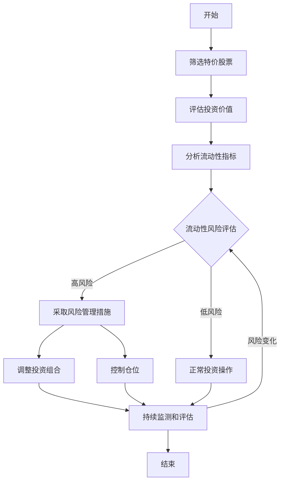

# 特价股票投资中的流动性风险管理

> 关键词：特价股票、流动性风险、风险管理、投资策略、市场分析

> 摘要：本文聚焦于特价股票投资中的流动性风险管理。首先介绍了研究的背景、目的、预期读者等内容，随后阐述了特价股票及流动性风险的核心概念与联系。通过深入讲解核心算法原理、数学模型和公式，为流动性风险管理提供理论支撑。结合项目实战案例，详细说明如何在实际操作中进行流动性风险管理。探讨了特价股票投资中流动性风险管理的实际应用场景，推荐了相关的工具和资源。最后总结未来发展趋势与挑战，解答常见问题并提供扩展阅读和参考资料，旨在帮助投资者更好地理解和应对特价股票投资中的流动性风险，提升投资决策的科学性和有效性。

## 1. 背景介绍 
### 1.1 目的和范围
在金融市场中，特价股票往往因其价格相对较低而吸引众多投资者的关注。然而，特价股票通常伴随着较高的流动性风险，这可能导致投资者在买卖过程中面临困难，甚至遭受损失。本研究的目的在于深入探讨特价股票投资中流动性风险管理的方法和策略，以帮助投资者降低风险，提高投资收益。

本研究的范围涵盖了特价股票的定义、流动性风险的评估、风险管理的具体措施以及相关的实际应用案例等方面。通过对这些内容的研究，为投资者提供全面、系统的流动性风险管理指导。

### 1.2 预期读者
本文的预期读者主要包括股票投资者、金融分析师、投资顾问以及对金融市场风险管理感兴趣的专业人士和学者。对于投资者而言，本文可以帮助他们更好地理解特价股票投资中的流动性风险，制定合理的投资策略；对于金融分析师和投资顾问，本文提供了专业的分析方法和风险管理思路，有助于他们为客户提供更优质的服务；对于学者来说，本文可以作为研究特价股票市场和流动性风险管理的参考资料。

### 1.3 文档结构概述
本文将按照以下结构进行组织：首先介绍研究的背景信息，包括目的、范围、预期读者等；接着阐述特价股票和流动性风险的核心概念与联系，通过文本示意图和 Mermaid 流程图进行详细说明；然后讲解核心算法原理和具体操作步骤，结合 Python 源代码进行阐述；再介绍数学模型和公式，并通过举例说明其应用；之后通过项目实战案例，详细展示代码实现和解读；探讨实际应用场景；推荐相关的工具和资源；总结未来发展趋势与挑战；解答常见问题；最后提供扩展阅读和参考资料。

### 1.4 术语表
#### 1.4.1 核心术语定义
- **特价股票**：通常指价格相对较低的股票，可能由于公司业绩不佳、市场环境变化或其他因素导致股价下跌。
- **流动性风险**：指投资者在买卖资产时，由于市场流动性不足而无法以合理价格及时成交的风险。
- **流动性指标**：用于衡量市场或资产流动性的指标，如成交量、买卖价差等。
- **风险管理**：指识别、评估和控制风险的过程，旨在降低风险对投资组合的影响。

#### 1.4.2 相关概念解释
- **市场深度**：指市场在一定价格范围内能够容纳的交易量，反映了市场的流动性和稳定性。
- **冲击成本**：指投资者在买卖资产时，由于交易行为对市场价格产生的影响而导致的额外成本。
- **流动性黑洞**：指市场在某些情况下突然失去流动性，导致资产价格大幅下跌，投资者无法及时平仓的现象。

#### 1.4.3 缩略词列表
- **VWAP**：Volume - Weighted Average Price，成交量加权平均价格。
- **ATR**：Average True Range，平均真实波幅。

## 2. 核心概念与联系 
### 2.1 特价股票的概念
特价股票是指那些价格相对较低的股票，通常具有以下特点：
- **低股价**：其股价可能低于市场平均水平，甚至低于公司的净资产价值。
- **高风险**：由于公司业绩、行业竞争等因素，特价股票往往伴随着较高的风险。
- **潜在价值**：部分特价股票可能具有潜在的投资价值，如公司进行重组、业务转型等。

### 2.2 流动性风险的概念
流动性风险是金融市场中普遍存在的风险之一，它主要表现为以下几个方面：
- **交易困难**：投资者在买卖资产时，可能无法找到合适的交易对手，导致交易无法及时完成。
- **价格波动**：由于市场流动性不足，少量的交易可能会对资产价格产生较大的影响，导致价格波动加剧。
- **成本增加**：为了完成交易，投资者可能需要接受更高的买入价格或更低的卖出价格，从而增加交易成本。

### 2.3 特价股票与流动性风险的联系
特价股票通常与较高的流动性风险相关联，主要原因如下：
- **关注度低**：由于股价较低，特价股票往往受到市场的关注度较低，交易活跃度不高。
- **信息不对称**：对于一些特价股票，市场上的信息可能相对较少，投资者难以全面了解公司的情况，增加了投资决策的难度。
- **市场信心不足**：特价股票的低价格可能反映了市场对公司未来发展的信心不足，导致投资者不愿意买入或持有这些股票。

### 2.4 核心概念原理和架构的文本示意图
特价股票投资中的流动性风险管理涉及多个环节和因素，其原理和架构可以用以下文本示意图表示：

投资者首先需要对特价股票进行筛选和评估，确定其投资价值和潜在风险。然后，通过分析流动性指标，评估股票的流动性状况。在投资过程中，根据流动性风险的大小，采取相应的风险管理措施，如调整投资组合、控制仓位等。最后，通过持续监测和评估，及时调整风险管理策略，以适应市场变化。

### 2.5 Mermaid 流程图


## 3. 核心算法原理 & 具体操作步骤 
### 3.1 流动性指标计算算法
在特价股票投资中，常用的流动性指标包括成交量、买卖价差等。下面以成交量为例，介绍其计算算法及 Python 实现。

#### 3.1.1 算法原理
成交量是指在一定时间内股票的交易数量，它反映了市场的交易活跃度。计算成交量的公式很简单，就是统计在指定时间段内的交易股数总和。

#### 3.1.2 Python 源代码实现
```python
import pandas as pd

def calculate_volume(data, start_date, end_date):
    """
    计算指定时间段内的成交量
    :param data: 包含股票交易数据的 DataFrame，列名包含 'date' 和 'volume'
    :param start_date: 开始日期，格式为 'YYYY-MM-DD'
    :param end_date: 结束日期，格式为 'YYYY-MM-DD'
    :return: 成交量总和
    """
    # 筛选指定时间段内的数据
    filtered_data = data[(data['date'] >= start_date) & (data['date'] <= end_date)]
    # 计算成交量总和
    total_volume = filtered_data['volume'].sum()
    return total_volume

# 示例数据
data = pd.DataFrame({
    'date': ['2023-01-01', '2023-01-02', '2023-01-03'],
    'volume': [1000, 2000, 1500]
})

start_date = '2023-01-01'
end_date = '2023-01-03'

volume = calculate_volume(data, start_date, end_date)
print(f"指定时间段内的成交量为: {volume}")
```

### 3.2 流动性风险评估算法
#### 3.2.1 算法原理
流动性风险评估可以通过计算流动性比率等指标来进行。流动性比率是指股票的成交量与流通股本的比值，它反映了股票的流动性状况。流动性比率越高，说明股票的流动性越好，流动性风险越低。

#### 3.2.2 Python 源代码实现
```python
def calculate_liquidity_ratio(data, start_date, end_date, outstanding_shares):
    """
    计算指定时间段内的流动性比率
    :param data: 包含股票交易数据的 DataFrame，列名包含 'date' 和 'volume'
    :param start_date: 开始日期，格式为 'YYYY-MM-DD'
    :param end_date: 结束日期，格式为 'YYYY-MM-DD'
    :param outstanding_shares: 流通股本
    :return: 流动性比率
    """
    # 计算指定时间段内的成交量
    volume = calculate_volume(data, start_date, end_date)
    # 计算流动性比率
    liquidity_ratio = volume / outstanding_shares
    return liquidity_ratio

# 示例数据
outstanding_shares = 10000
liquidity_ratio = calculate_liquidity_ratio(data, start_date, end_date, outstanding_shares)
print(f"指定时间段内的流动性比率为: {liquidity_ratio}")
```

### 3.3 具体操作步骤
1. **数据收集**：收集特价股票的交易数据，包括日期、成交量、股价等信息。
2. **指标计算**：根据上述算法，计算流动性指标，如成交量、流动性比率等。
3. **风险评估**：根据计算得到的流动性指标，评估特价股票的流动性风险。
4. **风险管理**：根据风险评估结果，采取相应的风险管理措施，如调整投资组合、控制仓位等。

## 4. 数学模型和公式 & 详细讲解 & 举例说明 
### 4.1 流动性比率公式
流动性比率 $LR$ 的计算公式为：
$$LR = \frac{V}{OS}$$
其中，$V$ 表示指定时间段内的成交量，$OS$ 表示流通股本。

### 4.2 详细讲解
流动性比率反映了股票的交易活跃度与流通股本的关系。当流动性比率较高时，说明在一定时间内有较多的股票进行交易，市场的流动性较好，投资者在买卖股票时更容易找到交易对手，流动性风险相对较低。反之，当流动性比率较低时，市场的交易活跃度较低，投资者可能面临交易困难和价格波动较大的风险。

### 4.3 举例说明
假设某特价股票的流通股本为 10000 万股，在 2023 年 1 月 1 日至 2023 年 1 月 31 日期间的成交量为 5000 万股。则该股票在这段时间内的流动性比率为：
$$LR = \frac{5000}{10000} = 0.5$$

如果该股票的流动性比率低于同行业其他股票的平均水平，说明其流动性相对较差，投资者在买卖该股票时可能需要更加谨慎，以降低流动性风险。

### 4.4 买卖价差模型
买卖价差是衡量市场流动性的另一个重要指标，它反映了投资者买卖股票时的成本。买卖价差 $S$ 的计算公式为：
$$S = P_{ask} - P_{bid}$$
其中，$P_{ask}$ 表示卖方报价，$P_{bid}$ 表示买方报价。

### 4.5 买卖价差与流动性的关系
买卖价差越大，说明市场的流动性越差。因为较大的买卖价差意味着投资者在买卖股票时需要支付更高的成本，这会降低投资者的交易意愿，从而导致市场交易活跃度下降。反之，买卖价差越小，市场的流动性越好。

### 4.6 举例说明
假设某特价股票的卖方报价为 5.1 元，买方报价为 5 元，则该股票的买卖价差为：
$$S = 5.1 - 5 = 0.1$$（元）

如果该股票的买卖价差持续扩大，说明其流动性可能在逐渐变差，投资者需要关注这一风险。

## 5. 项目实战：代码实际案例和详细解释说明 
### 5.1  开发环境搭建
#### 5.1.1 安装 Python
首先需要安装 Python 环境，建议使用 Python 3.7 及以上版本。可以从 Python 官方网站（https://www.python.org/downloads/）下载安装包，按照安装向导进行安装。

#### 5.1.2 安装必要的库
在本项目中，需要使用到 `pandas` 库来处理数据。可以使用以下命令进行安装：
```sh
pip install pandas
```

### 5.2  源代码详细实现和代码解读
以下是一个完整的项目实战代码示例，用于计算特价股票的流动性指标并评估流动性风险。

```python
import pandas as pd

def calculate_volume(data, start_date, end_date):
    """
    计算指定时间段内的成交量
    :param data: 包含股票交易数据的 DataFrame，列名包含 'date' 和 'volume'
    :param start_date: 开始日期，格式为 'YYYY-MM-DD'
    :param end_date: 结束日期，格式为 'YYYY-MM-DD'
    :return: 成交量总和
    """
    # 筛选指定时间段内的数据
    filtered_data = data[(data['date'] >= start_date) & (data['date'] <= end_date)]
    # 计算成交量总和
    total_volume = filtered_data['volume'].sum()
    return total_volume

def calculate_liquidity_ratio(data, start_date, end_date, outstanding_shares):
    """
    计算指定时间段内的流动性比率
    :param data: 包含股票交易数据的 DataFrame，列名包含 'date' 和 'volume'
    :param start_date: 开始日期，格式为 'YYYY-MM-DD'
    :param end_date: 结束日期，格式为 'YYYY-MM-DD'
    :param outstanding_shares: 流通股本
    :return: 流动性比率
    """
    # 计算指定时间段内的成交量
    volume = calculate_volume(data, start_date, end_date)
    # 计算流动性比率
    liquidity_ratio = volume / outstanding_shares
    return liquidity_ratio

def assess_liquidity_risk(liquidity_ratio, threshold):
    """
    评估流动性风险
    :param liquidity_ratio: 流动性比率
    :param threshold: 风险阈值
    :return: 风险评估结果，'高风险' 或 '低风险'
    """
    if liquidity_ratio < threshold:
        return '高风险'
    else:
        return '低风险'

# 示例数据
data = pd.DataFrame({
    'date': ['2023-01-01', '2023-01-02', '2023-01-03'],
    'volume': [1000, 2000, 1500]
})

start_date = '2023-01-01'
end_date = '2023-01-03'
outstanding_shares = 10000
threshold = 0.3

# 计算流动性比率
liquidity_ratio = calculate_liquidity_ratio(data, start_date, end_date, outstanding_shares)
# 评估流动性风险
risk_assessment = assess_liquidity_risk(liquidity_ratio, threshold)

print(f"指定时间段内的流动性比率为: {liquidity_ratio}")
print(f"流动性风险评估结果: {risk_assessment}")
```

### 5.3  代码解读与分析
- **`calculate_volume` 函数**：该函数用于计算指定时间段内的成交量。首先，通过条件筛选出指定时间段内的数据，然后对成交量列进行求和，得到成交量总和。
- **`calculate_liquidity_ratio` 函数**：该函数用于计算指定时间段内的流动性比率。它调用 `calculate_volume` 函数计算成交量，然后将成交量除以流通股本，得到流动性比率。
- **`assess_liquidity_risk` 函数**：该函数用于评估流动性风险。根据流动性比率与风险阈值的比较结果，返回 '高风险' 或 '低风险'。
- **主程序**：定义了示例数据、开始日期、结束日期、流通股本和风险阈值。调用 `calculate_liquidity_ratio` 函数计算流动性比率，再调用 `assess_liquidity_risk` 函数评估流动性风险，并输出结果。

## 6. 实际应用场景 
### 6.1 个人投资者
对于个人投资者来说，在投资特价股票时，需要充分考虑流动性风险。例如，当个人投资者计划买入或卖出某只特价股票时，可以通过计算流动性指标，评估该股票的流动性状况。如果流动性风险较高，投资者可以选择减少买入数量或推迟卖出时间，以避免因交易困难而导致损失。

### 6.2 机构投资者
机构投资者通常管理着较大规模的资金，在投资特价股票时，流动性风险的管理更为重要。机构投资者可以通过分散投资、控制仓位等方式来降低流动性风险。例如，机构投资者可以将资金分散投资于多只特价股票，避免过度集中在某一只股票上。同时，根据流动性风险评估结果，合理控制每只股票的仓位，以确保在市场流动性不足时能够及时调整投资组合。

### 6.3 金融机构风险管理
金融机构在进行资产管理和风险控制时，也需要关注特价股票投资中的流动性风险。例如，银行在进行股票质押贷款业务时，需要评估质押股票的流动性状况，以确保在借款人违约时能够及时处置质押股票，收回贷款。证券公司在进行自营业务和客户资产管理业务时，也需要对特价股票的流动性风险进行管理，以保障自身和客户的利益。

## 7. 工具和资源推荐
### 7.1 学习资源推荐
#### 7.1.1 书籍推荐
- 《金融市场与金融机构基础》：这本书系统地介绍了金融市场和金融机构的基本概念、运行机制和风险管理方法，对于理解特价股票投资中的流动性风险具有重要的参考价值。
- 《聪明的投资者》：作者本杰明·格雷厄姆是价值投资理论的奠基人之一，这本书阐述了价值投资的理念和方法，对于投资者在特价股票投资中进行风险评估和管理具有指导意义。

#### 7.1.2 在线课程
- Coursera 上的“金融市场”课程：该课程由知名大学的教授授课，内容涵盖了金融市场的各个方面，包括股票市场、债券市场、风险管理等，对于学习特价股票投资中的流动性风险管理知识非常有帮助。
- 中国大学 MOOC 上的“投资学”课程：该课程系统地介绍了投资学的基本理论和方法，包括资产定价、投资组合管理、风险管理等内容，适合对投资学感兴趣的学习者。

#### 7.1.3 技术博客和网站
- 雪球网：雪球网是一个知名的投资社区，上面有很多投资者分享的投资经验和研究报告，对于了解特价股票市场和流动性风险管理具有参考价值。
- 东方财富网：东方财富网提供了丰富的金融数据和资讯，包括股票行情、公司公告、研究报告等，是投资者获取信息的重要渠道。

### 7.2 开发工具框架推荐
#### 7.2.1 IDE和编辑器
- PyCharm：PyCharm 是一款专业的 Python 集成开发环境，具有代码编辑、调试、代码分析等功能，非常适合进行 Python 代码开发。
- Jupyter Notebook：Jupyter Notebook 是一个交互式的开发环境，支持多种编程语言，适合进行数据探索和分析，在进行流动性指标计算和风险评估时非常方便。

#### 7.2.2 调试和性能分析工具
- pdb：pdb 是 Python 自带的调试工具，可以帮助开发者在代码运行过程中进行调试，查找问题。
- cProfile：cProfile 是 Python 的性能分析工具，可以分析代码的运行时间和函数调用情况，帮助开发者优化代码性能。

#### 7.2.3 相关框架和库
- Pandas：Pandas 是一个强大的数据处理库，提供了丰富的数据结构和数据处理方法，适合处理股票交易数据。
- Numpy：Numpy 是一个用于科学计算的库，提供了高效的数组操作和数学函数，在进行流动性指标计算时可以提高计算效率。

### 7.3 相关论文著作推荐
#### 7.3.1 经典论文
- "The Cost of Capital, Corporation Finance and the Theory of Investment" by Franco Modigliani and Merton H. Miller：这篇论文提出了著名的 MM 定理，对于理解金融市场的定价和风险管理具有重要的理论意义。
- "Market Liquidity and Trading Activity" by Yakov Amihud and Haim Mendelson：这篇论文研究了市场流动性与交易活动之间的关系，为流动性风险管理提供了理论基础。

#### 7.3.2 最新研究成果
- 可以通过 Google Scholar、IEEE Xplore 等学术数据库搜索关于特价股票投资和流动性风险管理的最新研究成果，了解该领域的前沿动态。

#### 7.3.3 应用案例分析
- 可以参考一些金融机构的研究报告和案例分析，了解他们在特价股票投资中如何进行流动性风险管理，以及取得的实际效果。

## 8. 总结：未来发展趋势与挑战
### 8.1 未来发展趋势
- **技术创新**：随着金融科技的不断发展，人工智能、大数据、区块链等技术将在特价股票投资中的流动性风险管理中得到更广泛的应用。例如，通过人工智能算法可以更准确地预测市场流动性变化，通过区块链技术可以提高交易的透明度和效率。
- **国际化趋势**：随着全球金融市场的一体化程度不断提高，特价股票投资将面临更多的国际市场因素的影响。投资者需要更加关注国际市场的动态，加强跨境流动性风险管理。
- **风险管理理念的转变**：未来，投资者将更加注重风险管理的整体性和系统性，从单一的流动性风险管理转向综合风险管理。同时，风险管理将更加注重前瞻性和预防性，通过提前预警和风险控制措施，降低风险损失。

### 8.2 挑战
- **市场不确定性**：金融市场的不确定性是流动性风险管理面临的最大挑战之一。市场行情的变化、政策调整、突发事件等因素都可能导致市场流动性突然变化，给投资者带来巨大的风险。
- **数据质量和隐私问题**：在利用大数据和人工智能进行流动性风险管理时，数据质量和隐私问题是需要解决的重要问题。不准确或不完整的数据可能导致风险评估结果的偏差，而数据隐私问题则可能引发法律纠纷。
- **投资者教育不足**：目前，许多投资者对特价股票投资中的流动性风险认识不足，缺乏必要的风险管理知识和技能。这可能导致投资者在投资过程中盲目跟风，忽视流动性风险，从而遭受损失。

## 9. 附录：常见问题与解答
### 9.1 什么是特价股票？
特价股票通常指价格相对较低的股票，可能由于公司业绩不佳、市场环境变化或其他因素导致股价下跌。

### 9.2 流动性风险有哪些表现？
流动性风险主要表现为交易困难、价格波动和成本增加等方面。投资者在买卖资产时，可能无法找到合适的交易对手，导致交易无法及时完成；由于市场流动性不足，少量的交易可能会对资产价格产生较大的影响，导致价格波动加剧；为了完成交易，投资者可能需要接受更高的买入价格或更低的卖出价格，从而增加交易成本。

### 9.3 如何评估特价股票的流动性风险？
可以通过计算流动性指标，如成交量、买卖价差、流动性比率等，来评估特价股票的流动性风险。一般来说，成交量越大、买卖价差越小、流动性比率越高，说明股票的流动性越好，流动性风险越低。

### 9.4 如何降低特价股票投资中的流动性风险？
可以采取以下措施降低流动性风险：分散投资，避免过度集中在某一只股票上；控制仓位，根据流动性风险评估结果，合理控制每只股票的仓位；关注市场动态，及时调整投资策略；加强投资者教育，提高风险管理意识和技能。

## 10. 扩展阅读 & 参考资料
### 10.1 扩展阅读
- 《金融风险管理》：这本书系统地介绍了金融风险管理的理论和方法，包括市场风险、信用风险、流动性风险等方面的内容，对于深入学习流动性风险管理具有重要的参考价值。
- 《量化投资：策略与技术》：该书介绍了量化投资的基本概念、策略和技术，包括如何利用量化模型进行风险评估和管理，对于在特价股票投资中应用量化方法进行流动性风险管理具有指导意义。

### 10.2 参考资料
- 证券交易所官方网站：提供了股票交易的相关规则、数据和信息，是获取股票市场数据的重要来源。
- 金融监管机构发布的政策文件和报告：了解金融市场监管政策和行业动态的重要参考资料。
- 学术期刊和会议论文：关注金融领域最新研究成果和发展趋势的重要渠道。