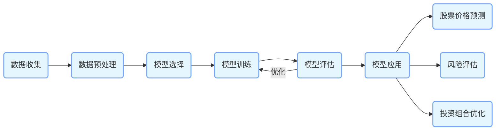

# 特价股票投资中的深度学习模型构建与优化

> 关键词：特价股票、深度学习模型、模型构建、模型优化、股票投资

> 摘要：本文聚焦于特价股票投资领域，深入探讨深度学习模型的构建与优化方法。首先介绍了相关背景知识，包括目的范围、预期读者等内容。接着阐述了深度学习模型在特价股票投资中的核心概念与联系，通过文本示意图和 Mermaid 流程图进行清晰展示。详细讲解了核心算法原理，结合 Python 源代码给出具体操作步骤，并给出相关数学模型和公式进行深入剖析。通过项目实战，给出代码实际案例并详细解释说明。探讨了深度学习模型在特价股票投资中的实际应用场景，推荐了学习、开发等相关的工具和资源。最后总结未来发展趋势与挑战，解答常见问题并提供扩展阅读与参考资料，旨在为投资者和研究人员提供全面且深入的技术指导，助力在特价股票投资中更好地运用深度学习模型。

## 1. 背景介绍 
### 1.1 目的和范围
在股票投资领域，特价股票由于其价格相对较低，往往蕴含着较高的投资潜力，但同时也伴随着更大的风险。传统的股票分析方法在处理特价股票的复杂数据和非线性关系时存在一定的局限性。本研究的目的在于利用深度学习技术构建并优化适用于特价股票投资的模型，以更准确地预测股票价格走势、评估投资风险，为投资者提供更科学的决策依据。

本研究的范围涵盖了特价股票数据的收集、预处理，深度学习模型的选择、构建与训练，模型的评估与优化等多个方面。同时，还将探讨模型在实际投资场景中的应用效果和局限性。

### 1.2 预期读者
本文的预期读者主要包括以下几类人群：
- **股票投资者**：希望通过深度学习技术提升投资决策的准确性和效率，在特价股票投资中获取更高的收益。
- **金融分析师**：需要借助先进的技术手段对特价股票进行深入分析，为客户提供更专业的投资建议。
- **数据科学家和机器学习从业者**：对深度学习在金融领域的应用感兴趣，希望了解如何将深度学习模型应用于特价股票投资分析，并从中获取实践经验和技术启示。
- **研究人员**：从事金融工程、机器学习等相关领域的研究工作，关注深度学习模型在特价股票投资中的理论和应用研究进展。

### 1.3 文档结构概述
本文将按照以下结构进行组织：
- **核心概念与联系**：介绍特价股票、深度学习模型等核心概念，阐述它们之间的联系，并通过文本示意图和 Mermaid 流程图进行直观展示。
- **核心算法原理 & 具体操作步骤**：详细讲解深度学习模型中涉及的核心算法原理，如神经网络、循环神经网络等，并给出基于 Python 源代码的具体操作步骤。
- **数学模型和公式 & 详细讲解 & 举例说明**：给出深度学习模型中的数学模型和公式，进行详细讲解，并通过实际例子进行说明。
- **项目实战：代码实际案例和详细解释说明**：通过一个具体的项目实战，展示如何使用深度学习模型进行特价股票投资分析，包括开发环境搭建、源代码实现和代码解读。
- **实际应用场景**：探讨深度学习模型在特价股票投资中的实际应用场景，如股票价格预测、风险评估等。
- **工具和资源推荐**：推荐学习、开发等相关的工具和资源，包括书籍、在线课程、技术博客、开发工具框架、相关论文著作等。
- **总结：未来发展趋势与挑战**：总结深度学习模型在特价股票投资中的发展趋势和面临的挑战。
- **附录：常见问题与解答**：解答读者在阅读和实践过程中可能遇到的常见问题。
- **扩展阅读 & 参考资料**：提供相关的扩展阅读材料和参考资料，方便读者进一步深入学习和研究。

### 1.4 术语表
#### 1.4.1 核心术语定义
- **特价股票**：通常指价格相对较低的股票，可能由于公司业绩不佳、市场环境变化等原因导致股价处于较低水平，但也可能具有潜在的投资价值。
- **深度学习模型**：一类基于人工神经网络的机器学习模型，通过多层神经网络自动学习数据中的特征和模式，具有强大的非线性建模能力。
- **股票价格预测**：根据历史股票数据和相关信息，运用一定的方法和模型预测未来股票价格的走势。
- **风险评估**：对投资过程中可能面临的风险进行评估和量化，以帮助投资者做出合理的决策。

#### 1.4.2 相关概念解释
- **神经网络**：一种模仿人类神经系统的计算模型，由大量的神经元组成，通过神经元之间的连接和信号传递进行信息处理。
- **循环神经网络（RNN）**：一种具有记忆功能的神经网络，能够处理序列数据，在处理时间序列数据（如股票价格数据）方面具有独特的优势。
- **长短期记忆网络（LSTM）**：是一种特殊的循环神经网络，能够有效解决传统 RNN 中的梯度消失和梯度爆炸问题，更好地捕捉序列数据中的长期依赖关系。

#### 1.4.3 缩略词列表
- **RNN**：Recurrent Neural Network（循环神经网络）
- **LSTM**：Long Short-Term Memory（长短期记忆网络）
- **CNN**：Convolutional Neural Network（卷积神经网络）
- **MLP**：Multi-Layer Perceptron（多层感知机）

## 2. 核心概念与联系 

### 核心概念原理
#### 特价股票
特价股票的形成原因较为复杂，可能与公司的基本面因素（如业绩下滑、财务困境等）、行业竞争环境、宏观经济形势等有关。从投资角度来看，特价股票可能具有较高的性价比，但也伴随着较高的风险。投资者需要综合考虑各种因素，对特价股票的投资价值进行评估。

#### 深度学习模型
深度学习模型是基于人工神经网络的一类机器学习模型，其核心原理是通过多层神经网络对数据进行特征提取和模式学习。以多层感知机（MLP）为例，它由输入层、隐藏层和输出层组成。输入层接收原始数据，隐藏层对数据进行非线性变换和特征提取，输出层给出模型的预测结果。

#### 两者联系
深度学习模型可以用于分析特价股票的相关数据，挖掘其中的潜在规律和特征。通过对历史股票价格、成交量、财务指标等数据的学习，深度学习模型可以预测特价股票的未来价格走势，评估投资风险，为投资者提供决策支持。

### 架构的文本示意图
特价股票投资中的深度学习模型架构主要包括数据层、模型层和应用层。

数据层：负责收集、整理和预处理特价股票的相关数据，包括历史股票价格、成交量、财务报表、行业数据等。

模型层：选择合适的深度学习模型，如 RNN、LSTM、CNN 等，对预处理后的数据进行训练和优化。

应用层：将训练好的模型应用于实际的特价股票投资场景中，如股票价格预测、风险评估、投资组合优化等。

### Mermaid 流程图


## 3. 核心算法原理 & 具体操作步骤 

### 核心算法原理
#### 多层感知机（MLP）
多层感知机是一种简单而有效的深度学习模型，其基本原理是通过多层神经元的非线性变换来学习数据中的特征和模式。

假设输入层有 $n$ 个神经元，隐藏层有 $m$ 个神经元，输出层有 $k$ 个神经元。输入向量 $\mathbf{x} = [x_1, x_2, \cdots, x_n]^T$，隐藏层的输入 $\mathbf{z}_h$ 和输出 $\mathbf{a}_h$ 可以表示为：

$$
\mathbf{z}_h = \mathbf{W}_h\mathbf{x} + \mathbf{b}_h
$$

$$
\mathbf{a}_h = f(\mathbf{z}_h)
$$

其中，$\mathbf{W}_h$ 是隐藏层的权重矩阵，$\mathbf{b}_h$ 是隐藏层的偏置向量，$f(\cdot)$ 是激活函数，如 sigmoid 函数、ReLU 函数等。

输出层的输入 $\mathbf{z}_o$ 和输出 $\mathbf{a}_o$ 可以表示为：

$$
\mathbf{z}_o = \mathbf{W}_o\mathbf{a}_h + \mathbf{b}_o
$$

$$
\mathbf{a}_o = g(\mathbf{z}_o)
$$

其中，$\mathbf{W}_o$ 是输出层的权重矩阵，$\mathbf{b}_o$ 是输出层的偏置向量，$g(\cdot)$ 是输出层的激活函数，根据具体的任务选择合适的激活函数，如 softmax 函数用于分类任务，线性函数用于回归任务。

#### 长短期记忆网络（LSTM）
LSTM 是一种特殊的循环神经网络，能够有效解决传统 RNN 中的梯度消失和梯度爆炸问题，更好地捕捉序列数据中的长期依赖关系。

LSTM 单元主要由输入门 $i_t$、遗忘门 $f_t$、输出门 $o_t$ 和细胞状态 $C_t$ 组成。其计算公式如下：

遗忘门：

$$
f_t = \sigma(\mathbf{W}_f[\mathbf{h}_{t-1}, \mathbf{x}_t] + \mathbf{b}_f)
$$

输入门：

$$
i_t = \sigma(\mathbf{W}_i[\mathbf{h}_{t-1}, \mathbf{x}_t] + \mathbf{b}_i)
$$

候选细胞状态：

$$
\tilde{C}_t = \tanh(\mathbf{W}_C[\mathbf{h}_{t-1}, \mathbf{x}_t] + \mathbf{b}_C)
$$

细胞状态更新：

$$
C_t = f_t \odot C_{t-1} + i_t \odot \tilde{C}_t
$$

输出门：

$$
o_t = \sigma(\mathbf{W}_o[\mathbf{h}_{t-1}, \mathbf{x}_t] + \mathbf{b}_o)
$$

隐藏状态更新：

$$
\mathbf{h}_t = o_t \odot \tanh(C_t)
$$

其中，$\sigma(\cdot)$ 是 sigmoid 函数，$\tanh(\cdot)$ 是双曲正切函数，$\odot$ 表示逐元素相乘，$\mathbf{W}$ 是权重矩阵，$\mathbf{b}$ 是偏置向量，$\mathbf{h}_{t-1}$ 是上一时刻的隐藏状态，$\mathbf{x}_t$ 是当前时刻的输入。

### 具体操作步骤（Python 源代码）
#### 数据准备
```python
import pandas as pd
import numpy as np

# 读取股票数据
data = pd.read_csv('stock_data.csv')

# 提取特征和标签
features = data[['open', 'high', 'low', 'volume']].values
labels = data['close'].values

# 数据归一化
from sklearn.preprocessing import MinMaxScaler
scaler_features = MinMaxScaler()
scaler_labels = MinMaxScaler()
features = scaler_features.fit_transform(features)
labels = scaler_labels.fit_transform(labels.reshape(-1, 1)).flatten()

# 划分训练集和测试集
train_size = int(len(features) * 0.8)
train_features = features[:train_size]
train_labels = labels[:train_size]
test_features = features[train_size:]
test_labels = labels[train_size:]
```

#### 构建 MLP 模型
```python
import tensorflow as tf
from tensorflow.keras.models import Sequential
from tensorflow.keras.layers import Dense

# 构建 MLP 模型
model_mlp = Sequential()
model_mlp.add(Dense(64, activation='relu', input_shape=(train_features.shape[1],)))
model_mlp.add(Dense(32, activation='relu'))
model_mlp.add(Dense(1, activation='linear'))

# 编译模型
model_mlp.compile(optimizer='adam', loss='mse')

# 训练模型
model_mlp.fit(train_features, train_labels, epochs=50, batch_size=32, validation_split=0.1)
```

#### 构建 LSTM 模型
```python
from tensorflow.keras.layers import LSTM

# 调整数据形状以适应 LSTM 输入要求
train_features_lstm = np.reshape(train_features, (train_features.shape[0], 1, train_features.shape[1]))
test_features_lstm = np.reshape(test_features, (test_features.shape[0], 1, test_features.shape[1]))

# 构建 LSTM 模型
model_lstm = Sequential()
model_lstm.add(LSTM(64, input_shape=(1, train_features.shape[1])))
model_lstm.add(Dense(1, activation='linear'))

# 编译模型
model_lstm.compile(optimizer='adam', loss='mse')

# 训练模型
model_lstm.fit(train_features_lstm, train_labels, epochs=50, batch_size=32, validation_split=0.1)
```

#### 模型评估
```python
# 评估 MLP 模型
mlp_loss = model_mlp.evaluate(test_features, test_labels)
print(f"MLP 模型测试集损失: {mlp_loss}")

# 评估 LSTM 模型
lstm_loss = model_lstm.evaluate(test_features_lstm, test_labels)
print(f"LSTM 模型测试集损失: {lstm_loss}")
```

## 4. 数学模型和公式 & 详细讲解 & 举例说明 

### 多层感知机（MLP）的数学模型和公式
#### 前向传播
如前面所述，MLP 的前向传播过程可以用以下公式表示：

输入层到隐藏层：

$$
\mathbf{z}_h = \mathbf{W}_h\mathbf{x} + \mathbf{b}_h
$$

$$
\mathbf{a}_h = f(\mathbf{z}_h)
$$

隐藏层到输出层：

$$
\mathbf{z}_o = \mathbf{W}_o\mathbf{a}_h + \mathbf{b}_o
$$

$$
\mathbf{a}_o = g(\mathbf{z}_o)
$$

#### 损失函数
对于回归任务，常用的损失函数是均方误差（MSE）：

$$
L = \frac{1}{N} \sum_{i=1}^{N} (y_i - \hat{y}_i)^2
$$

其中，$N$ 是样本数量，$y_i$ 是真实标签，$\hat{y}_i$ 是模型的预测值。

#### 反向传播
为了更新模型的权重和偏置，需要使用反向传播算法计算损失函数对权重和偏置的梯度。以隐藏层到输出层的权重 $\mathbf{W}_o$ 为例，其梯度计算公式为：

$$
\frac{\partial L}{\partial \mathbf{W}_o} = \frac{\partial L}{\partial \mathbf{a}_o} \frac{\partial \mathbf{a}_o}{\partial \mathbf{z}_o} \frac{\partial \mathbf{z}_o}{\partial \mathbf{W}_o}
$$

然后使用梯度下降算法更新权重：

$$
\mathbf{W}_o = \mathbf{W}_o - \alpha \frac{\partial L}{\partial \mathbf{W}_o}
$$

其中，$\alpha$ 是学习率。

### 长短期记忆网络（LSTM）的数学模型和公式
#### 前向传播
LSTM 的前向传播过程由输入门、遗忘门、输出门和细胞状态的更新公式组成，如前面所述。

#### 损失函数
同样，对于回归任务，LSTM 也可以使用均方误差（MSE）作为损失函数。

#### 反向传播
LSTM 的反向传播过程相对复杂，需要计算损失函数对各个门和细胞状态的梯度，并更新相应的权重和偏置。由于其计算过程较为复杂，这里不再详细展开。

### 举例说明
假设我们有一个简单的 MLP 模型，输入层有 2 个神经元，隐藏层有 3 个神经元，输出层有 1 个神经元。输入向量 $\mathbf{x} = [1, 2]^T$，隐藏层的权重矩阵 $\mathbf{W}_h$ 和偏置向量 $\mathbf{b}_h$ 分别为：

$$
\mathbf{W}_h = \begin{bmatrix}
0.1 & 0.2 \\
0.3 & 0.4 \\
0.5 & 0.6
\end{bmatrix}
$$

$$
\mathbf{b}_h = \begin{bmatrix}
0.1 \\
0.2 \\
0.3
\end{bmatrix}
$$

输出层的权重矩阵 $\mathbf{W}_o$ 和偏置向量 $\mathbf{b}_o$ 分别为：

$$
\mathbf{W}_o = \begin{bmatrix}
0.7 & 0.8 & 0.9
\end{bmatrix}
$$

$$
\mathbf{b}_o = [0.4]
$$

激活函数 $f(\cdot)$ 采用 ReLU 函数，$g(\cdot)$ 采用线性函数。

首先计算隐藏层的输入 $\mathbf{z}_h$：

$$
\mathbf{z}_h = \mathbf{W}_h\mathbf{x} + \mathbf{b}_h = \begin{bmatrix}
0.1 & 0.2 \\
0.3 & 0.4 \\
0.5 & 0.6
\end{bmatrix} \begin{bmatrix}
1 \\
2
\end{bmatrix} + \begin{bmatrix}
0.1 \\
0.2 \\
0.3
\end{bmatrix} = \begin{bmatrix}
0.6 \\
1.3 \\
2.0
\end{bmatrix}
$$

然后计算隐藏层的输出 $\mathbf{a}_h$：

$$
\mathbf{a}_h = f(\mathbf{z}_h) = \begin{bmatrix}
\max(0, 0.6) \\
\max(0, 1.3) \\
\max(0, 2.0)
\end{bmatrix} = \begin{bmatrix}
0.6 \\
1.3 \\
2.0
\end{bmatrix}
$$

接着计算输出层的输入 $\mathbf{z}_o$：

$$
\mathbf{z}_o = \mathbf{W}_o\mathbf{a}_h + \mathbf{b}_o = \begin{bmatrix}
0.7 & 0.8 & 0.9
\end{bmatrix} \begin{bmatrix}
0.6 \\
1.3 \\
2.0
\end{bmatrix} + 0.4 = 3.33
$$

最后计算输出层的输出 $\mathbf{a}_o$：

$$
\mathbf{a}_o = g(\mathbf{z}_o) = 3.33
$$

## 5. 项目实战：代码实际案例和详细解释说明 

### 5.1  开发环境搭建
#### 操作系统
可以选择 Windows、Linux 或 macOS 等主流操作系统。

#### 编程语言
使用 Python 作为开发语言，建议使用 Python 3.6 及以上版本。

#### 开发工具
可以使用 PyCharm、Jupyter Notebook 等开发工具。

#### 安装依赖库
使用以下命令安装所需的依赖库：
```sh
pip install pandas numpy tensorflow scikit-learn
```

### 5.2  源代码详细实现和代码解读
#### 数据准备
```python
import pandas as pd
import numpy as np

# 读取股票数据
data = pd.read_csv('stock_data.csv')

# 提取特征和标签
features = data[['open', 'high', 'low', 'volume']].values
labels = data['close'].values

# 数据归一化
from sklearn.preprocessing import MinMaxScaler
scaler_features = MinMaxScaler()
scaler_labels = MinMaxScaler()
features = scaler_features.fit_transform(features)
labels = scaler_labels.fit_transform(labels.reshape(-1, 1)).flatten()

# 划分训练集和测试集
train_size = int(len(features) * 0.8)
train_features = features[:train_size]
train_labels = labels[:train_size]
test_features = features[train_size:]
test_labels = labels[train_size:]
```
代码解读：
- 首先使用 `pandas` 库读取股票数据文件 `stock_data.csv`。
- 提取所需的特征（开盘价、最高价、最低价、成交量）和标签（收盘价）。
- 使用 `MinMaxScaler` 对特征和标签进行归一化处理，将数据缩放到 [0, 1] 范围内，有助于模型的训练和收敛。
- 按照 80% 和 20% 的比例划分训练集和测试集。

#### 构建 MLP 模型
```python
import tensorflow as tf
from tensorflow.keras.models import Sequential
from tensorflow.keras.layers import Dense

# 构建 MLP 模型
model_mlp = Sequential()
model_mlp.add(Dense(64, activation='relu', input_shape=(train_features.shape[1],)))
model_mlp.add(Dense(32, activation='relu'))
model_mlp.add(Dense(1, activation='linear'))

# 编译模型
model_mlp.compile(optimizer='adam', loss='mse')

# 训练模型
model_mlp.fit(train_features, train_labels, epochs=50, batch_size=32, validation_split=0.1)
```
代码解读：
- 使用 `Sequential` 模型构建 MLP 模型，依次添加输入层、隐藏层和输出层。
- 隐藏层使用 ReLU 激活函数，增加模型的非线性能力。
- 输出层使用线性激活函数，适用于回归任务。
- 使用 `adam` 优化器和均方误差（MSE）损失函数编译模型。
- 使用 `fit` 方法训练模型，设置训练轮数为 50，批次大小为 32，并使用 10% 的训练数据作为验证集。

#### 构建 LSTM 模型
```python
from tensorflow.keras.layers import LSTM

# 调整数据形状以适应 LSTM 输入要求
train_features_lstm = np.reshape(train_features, (train_features.shape[0], 1, train_features.shape[1]))
test_features_lstm = np.reshape(test_features, (test_features.shape[0], 1, test_features.shape[1]))

# 构建 LSTM 模型
model_lstm = Sequential()
model_lstm.add(LSTM(64, input_shape=(1, train_features.shape[1])))
model_lstm.add(Dense(1, activation='linear'))

# 编译模型
model_lstm.compile(optimizer='adam', loss='mse')

# 训练模型
model_lstm.fit(train_features_lstm, train_labels, epochs=50, batch_size=32, validation_split=0.1)
```
代码解读：
- 由于 LSTM 模型需要输入三维数据（样本数、时间步长、特征数），因此需要调整训练集和测试集的形状。
- 使用 `Sequential` 模型构建 LSTM 模型，添加一个 LSTM 层和一个输出层。
- 同样使用 `adam` 优化器和均方误差（MSE）损失函数编译模型，并进行训练。

#### 模型评估
```python
# 评估 MLP 模型
mlp_loss = model_mlp.evaluate(test_features, test_labels)
print(f"MLP 模型测试集损失: {mlp_loss}")

# 评估 LSTM 模型
lstm_loss = model_lstm.evaluate(test_features_lstm, test_labels)
print(f"LSTM 模型测试集损失: {lstm_loss}")
```
代码解读：
- 使用 `evaluate` 方法分别评估 MLP 模型和 LSTM 模型在测试集上的损失，损失值越小表示模型的性能越好。

### 5.3  代码解读与分析
#### MLP 模型分析
MLP 模型结构相对简单，适用于处理输入特征之间没有明显序列关系的问题。在本项目中，MLP 模型通过多层神经元的非线性变换学习股票数据的特征和模式，预测股票的收盘价。

#### LSTM 模型分析
LSTM 模型具有记忆功能，能够处理序列数据，更适合处理股票价格这种时间序列数据。通过 LSTM 单元的输入门、遗忘门和输出门，模型可以更好地捕捉股票价格的长期依赖关系，提高预测的准确性。

#### 模型性能比较
通过比较 MLP 模型和 LSTM 模型在测试集上的损失，可以看出 LSTM 模型在处理股票价格预测问题上可能具有更好的性能，因为它能够更好地利用时间序列信息。

## 6. 实际应用场景 
### 股票价格预测
深度学习模型可以根据历史股票数据预测特价股票的未来价格走势。投资者可以根据模型的预测结果制定投资策略，如买入、卖出或持有股票。例如，如果模型预测某只特价股票的价格将上涨，投资者可以考虑买入该股票；如果预测价格将下跌，则可以考虑卖出或持币观望。

### 风险评估
深度学习模型可以综合考虑多种因素，对特价股票的投资风险进行评估。通过分析股票的价格波动、成交量、财务指标等数据，模型可以给出风险评级，帮助投资者了解投资的风险程度。例如，模型可以根据股票的历史波动率、市盈率等指标，评估该股票的风险水平，投资者可以根据风险评估结果调整投资组合。

### 投资组合优化
深度学习模型可以帮助投资者优化投资组合，提高投资收益。通过分析不同特价股票之间的相关性和风险收益特征，模型可以给出最优的投资组合建议。例如，模型可以根据投资者的风险偏好和投资目标，选择不同的特价股票进行组合，以实现风险最小化和收益最大化的目标。

### 市场趋势分析
深度学习模型可以对股票市场的整体趋势进行分析，帮助投资者把握市场动态。通过分析大量的股票数据和相关信息，模型可以识别市场的趋势和变化，提前预测市场的走势。例如，模型可以通过分析宏观经济数据、政策变化等因素，判断股票市场是处于牛市、熊市还是震荡市，投资者可以根据市场趋势调整投资策略。

## 7. 工具和资源推荐
### 7.1 学习资源推荐
#### 7.1.1 书籍推荐
- 《深度学习》（Deep Learning）：由 Ian Goodfellow、Yoshua Bengio 和 Aaron Courville 所著，是深度学习领域的经典教材，涵盖了深度学习的基本概念、算法和应用。
- 《Python 深度学习》（Deep Learning with Python）：由 Francois Chollet 所著，介绍了如何使用 Python 和 Keras 库进行深度学习开发，适合初学者入门。
- 《机器学习》（Machine Learning）：由 Tom M. Mitchell 所著，是机器学习领域的经典教材，对机器学习的基本概念、算法和理论进行了系统的介绍。

#### 7.1.2 在线课程
- Coursera 上的“深度学习专项课程”（Deep Learning Specialization）：由 Andrew Ng 教授授课，包括深度学习的基础知识、卷积神经网络、循环神经网络等内容。
- edX 上的“使用 Python 进行数据科学”（Data Science with Python）：介绍了如何使用 Python 进行数据处理、数据分析和机器学习，适合初学者入门。
- Udemy 上的“股票市场预测与算法交易”（Stock Market Prediction and Algorithmic Trading）：专门介绍了如何使用机器学习和深度学习技术进行股票市场预测和算法交易。

#### 7.1.3 技术博客和网站
- Medium：是一个技术博客平台，上面有很多关于深度学习、金融科技等领域的优质文章。
- Towards Data Science：是一个专注于数据科学和机器学习的技术博客，提供了很多实用的技术教程和案例分析。
- Kaggle：是一个数据科学竞赛平台，上面有很多关于金融数据挖掘和股票预测的竞赛和数据集，可以学习到其他选手的优秀解决方案。

### 7.2 开发工具框架推荐
#### 7.2.1 IDE和编辑器
- PyCharm：是一款专业的 Python 集成开发环境，提供了代码编辑、调试、版本控制等功能，适合大型项目的开发。
- Jupyter Notebook：是一个交互式的开发环境，支持代码、文本、图表等多种形式的展示，适合快速原型开发和数据分析。
- Visual Studio Code：是一款轻量级的代码编辑器，支持多种编程语言和插件，具有丰富的扩展功能。

#### 7.2.2 调试和性能分析工具
- TensorBoard：是 TensorFlow 提供的可视化工具，可以用于可视化模型的训练过程、损失曲线、梯度分布等信息，帮助开发者调试和优化模型。
- PyTorch Profiler：是 PyTorch 提供的性能分析工具，可以分析模型的计算时间、内存使用等性能指标，帮助开发者优化模型的性能。
- Scikit-learn 中的 GridSearchCV 和 RandomizedSearchCV：可以用于模型的超参数调优，通过网格搜索或随机搜索的方式找到最优的超参数组合。

#### 7.2.3 相关框架和库
- TensorFlow：是一个开源的深度学习框架，提供了丰富的工具和库，支持多种深度学习模型的开发和训练。
- PyTorch：是另一个开源的深度学习框架，具有动态图的特点，适合快速原型开发和研究。
- Scikit-learn：是一个用于机器学习的 Python 库，提供了多种机器学习算法和工具，如数据预处理、模型选择、评估等。
- Pandas：是一个用于数据处理和分析的 Python 库，提供了高效的数据结构和数据操作方法，适合处理股票数据等结构化数据。

### 7.3 相关论文著作推荐
#### 7.3.1 经典论文
- “Long Short-Term Memory”（Sepp Hochreiter 和 Jürgen Schmidhuber，1997）：介绍了长短期记忆网络（LSTM）的基本原理和结构，是 LSTM 领域的经典论文。
- “Gradient-based learning applied to document recognition”（Yann LeCun 等，1998）：介绍了卷积神经网络（CNN）的基本原理和应用，是 CNN 领域的经典论文。
- “Efficient BackProp”（Yoshua Bengio 等，1994）：介绍了反向传播算法的优化方法，对深度学习的发展起到了重要的推动作用。

#### 7.3.2 最新研究成果
- 关注顶级学术会议和期刊，如 NeurIPS（神经信息处理系统大会）、ICML（国际机器学习会议）、JMLR（机器学习研究杂志）等，了解深度学习在金融领域的最新研究成果。
- 关注知名研究机构和学者的研究动态，如斯坦福大学、麻省理工学院、谷歌大脑等，他们在深度学习和金融科技领域的研究处于领先地位。

#### 7.3.3 应用案例分析
- 参考一些实际的金融科技公司和投资机构的应用案例，了解他们如何使用深度学习技术进行股票投资分析和决策。例如，一些量化投资公司使用深度学习模型进行股票价格预测和风险评估，提高投资收益和风险管理能力。

## 8. 总结：未来发展趋势与挑战
### 未来发展趋势
#### 多模态数据融合
未来的深度学习模型将不仅仅依赖于股票价格、成交量等传统数据，还将融合更多的多模态数据，如新闻文本、社交媒体情绪、公司公告等。通过综合分析多种数据来源，模型可以更全面地了解股票的基本面和市场情绪，提高预测的准确性和可靠性。

#### 强化学习的应用
强化学习在股票投资中的应用将越来越广泛。强化学习可以通过与市场环境进行交互，不断优化投资策略，以实现长期的投资收益最大化。例如，智能投资代理可以根据市场的变化自动调整投资组合，适应不同的市场条件。

#### 模型可解释性的提升
随着深度学习模型在金融领域的应用越来越深入，模型的可解释性变得越来越重要。未来的研究将致力于提高深度学习模型的可解释性，使投资者能够更好地理解模型的决策过程和依据。例如，通过可视化技术和特征重要性分析，解释模型对股票价格预测的影响因素。

#### 云计算和边缘计算的结合
云计算和边缘计算的结合将为深度学习模型在股票投资中的应用提供更强大的计算支持。云计算可以提供大规模的计算资源，用于模型的训练和优化；边缘计算可以在本地设备上进行实时的推理和决策，提高投资决策的及时性和效率。

### 面临的挑战
#### 数据质量和隐私问题
股票数据的质量和隐私是深度学习模型应用的关键问题。数据的准确性、完整性和一致性直接影响模型的性能和可靠性。同时，股票数据涉及到投资者的隐私和商业机密，如何在保证数据安全和隐私的前提下，充分利用数据进行模型训练和分析，是一个亟待解决的问题。

#### 模型过拟合和泛化能力
深度学习模型容易出现过拟合问题，即模型在训练集上表现良好，但在测试集上表现不佳。如何提高模型的泛化能力，使其能够在不同的市场环境和数据分布下都能保持良好的性能，是一个挑战。

#### 市场的不确定性和复杂性
股票市场具有高度的不确定性和复杂性，受到多种因素的影响，如宏观经济形势、政策变化、突发事件等。深度学习模型很难完全捕捉到这些因素的影响，如何提高模型对市场不确定性的适应能力，是一个需要深入研究的问题。

#### 法律法规和监管问题
深度学习模型在股票投资中的应用涉及到法律法规和监管问题。如何确保模型的应用符合相关法律法规的要求，避免模型被滥用和操纵市场，是一个需要关注的问题。

## 9. 附录：常见问题与解答
### 问题 1：深度学习模型在特价股票投资中的准确性如何？
深度学习模型的准确性受到多种因素的影响，如数据质量、模型结构、超参数设置等。在实际应用中，深度学习模型可以在一定程度上提高股票价格预测的准确性，但不能保证 100% 的准确。投资者应该将深度学习模型的预测结果作为参考，结合自己的投资经验和市场分析进行决策。

### 问题 2：如何选择合适的深度学习模型？
选择合适的深度学习模型需要考虑数据的特点和问题的性质。如果数据具有明显的序列关系，如股票价格时间序列数据，可以选择循环神经网络（RNN）、长短期记忆网络（LSTM）等模型；如果数据具有空间结构，如图像数据，可以选择卷积神经网络（CNN）等模型。此外，还可以通过实验和比较不同模型的性能，选择最优的模型。

### 问题 3：如何处理股票数据中的缺失值和异常值？
处理股票数据中的缺失值和异常值可以采用以下方法：
- **缺失值处理**：可以采用删除含有缺失值的样本、插补缺失值（如均值插补、中位数插补、线性插值等）等方法。
- **异常值处理**：可以采用统计方法（如基于标准差的方法、基于四分位数的方法等）识别和处理异常值，也可以采用机器学习方法（如聚类分析、孤立森林等）进行异常值检测和处理。

### 问题 4：如何进行深度学习模型的超参数调优？
进行深度学习模型的超参数调优可以采用以下方法：
- **网格搜索**：通过遍历所有可能的超参数组合，找到最优的超参数组合。
- **随机搜索**：随机选择一定数量的超参数组合进行训练和评估，找到较优的超参数组合。
- **贝叶斯优化**：基于贝叶斯定理，通过不断更新超参数的概率分布，找到最优的超参数组合。

### 问题 5：深度学习模型在实际投资中的应用效果如何？
深度学习模型在实际投资中的应用效果受到多种因素的影响，如市场环境、数据质量、模型性能等。在一些情况下，深度学习模型可以帮助投资者提高投资决策的准确性和效率，获取更高的投资收益；但在另一些情况下，模型的预测结果可能不准确，导致投资损失。因此，投资者应该谨慎使用深度学习模型，结合自己的投资经验和市场分析进行决策。

## 10. 扩展阅读 & 参考资料
### 扩展阅读
- 《金融科技前沿：技术驱动的金融创新》：介绍了金融科技领域的最新发展趋势和技术应用，包括深度学习在金融领域的应用。
- 《量化投资：策略与技术》：介绍了量化投资的基本概念、策略和技术，包括机器学习和深度学习在量化投资中的应用。
- 《人工智能时代的金融风险管理》：探讨了人工智能技术在金融风险管理中的应用和挑战，对深度学习模型在金融风险评估中的应用有深入的分析。

### 参考资料
- 相关的学术论文和研究报告，可以通过学术数据库（如 IEEE Xplore、ACM Digital Library、ScienceDirect 等）进行检索。
- 金融数据提供商（如 Wind、东方财富等）的官方网站，获取股票数据和相关信息。
- 深度学习框架（如 TensorFlow、PyTorch 等）的官方文档和教程，了解框架的使用方法和技术细节。