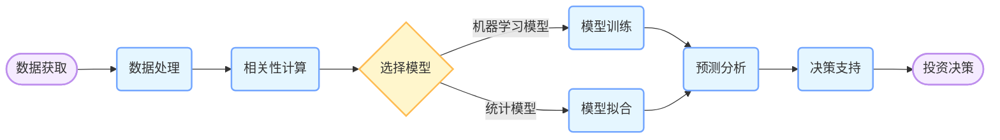

# 特价股票投资中的跨资产类别数字相关性预测分析

> 关键词：特价股票投资、跨资产类别、数字相关性、预测分析、金融市场

> 摘要：本文聚焦于特价股票投资领域，深入探讨跨资产类别数字相关性预测分析的重要性、原理、方法及应用。通过对不同资产类别之间数字关联的研究，旨在为投资者提供更精准的决策依据，降低投资风险，提高投资回报。文章详细阐述了核心概念、算法原理、数学模型，并结合实际项目案例进行代码实现和分析。同时，介绍了该领域的实际应用场景、相关工具和资源，最后对未来发展趋势与挑战进行了总结。

## 1. 背景介绍 
### 1.1 目的和范围
在金融市场中，特价股票由于其价格相对较低，往往吸引着众多投资者的关注。然而，特价股票的投资风险也相对较高，因为其价格波动可能受到多种因素的影响。跨资产类别数字相关性预测分析旨在通过研究不同资产类别（如股票、债券、大宗商品等）之间的数字关联，帮助投资者更好地理解特价股票价格的走势，从而做出更明智的投资决策。

本文的范围涵盖了跨资产类别数字相关性预测分析的基本概念、算法原理、数学模型、实际应用以及相关工具和资源。通过理论分析和实际案例相结合的方式，为读者提供全面而深入的了解。

### 1.2 预期读者
本文的预期读者包括金融投资者、投资分析师、金融科技从业者以及对金融市场和数据分析感兴趣的学者和研究人员。对于希望提高投资决策水平、降低投资风险的投资者来说，本文提供了实用的方法和策略；对于金融科技从业者和研究人员来说，本文则为他们的研究和开发工作提供了理论基础和实践参考。

### 1.3 文档结构概述
本文将按照以下结构进行组织：
1. 背景介绍：介绍本文的目的、范围、预期读者和文档结构概述。
2. 核心概念与联系：阐述跨资产类别数字相关性预测分析的核心概念，包括资产类别、数字相关性、预测分析等，并通过文本示意图和 Mermaid 流程图展示它们之间的关系。
3. 核心算法原理 & 具体操作步骤：详细讲解用于跨资产类别数字相关性预测分析的核心算法，如相关性分析算法、机器学习算法等，并使用 Python 源代码进行详细阐述。
4. 数学模型和公式 & 详细讲解 & 举例说明：介绍跨资产类别数字相关性预测分析的数学模型和公式，如相关系数公式、回归模型公式等，并通过具体例子进行详细讲解。
5. 项目实战：代码实际案例和详细解释说明：通过一个实际的项目案例，展示如何使用 Python 实现跨资产类别数字相关性预测分析，并对代码进行详细解释和分析。
6. 实际应用场景：介绍跨资产类别数字相关性预测分析在金融市场中的实际应用场景，如投资组合优化、风险评估等。
7. 工具和资源推荐：推荐一些用于跨资产类别数字相关性预测分析的学习资源、开发工具框架和相关论文著作。
8. 总结：未来发展趋势与挑战：总结跨资产类别数字相关性预测分析的发展趋势和面临的挑战。
9. 附录：常见问题与解答：解答一些读者可能关心的常见问题。
10. 扩展阅读 & 参考资料：提供一些扩展阅读的建议和参考资料。

### 1.4 术语表
#### 1.4.1 核心术语定义
- **特价股票**：指价格相对较低的股票，通常具有较高的投资潜力，但也伴随着较高的风险。
- **跨资产类别**：指涉及不同类型的资产，如股票、债券、大宗商品、外汇等。
- **数字相关性**：指不同资产类别之间的数字关联程度，可以通过相关系数等指标来衡量。
- **预测分析**：指利用历史数据和统计模型，对未来事件或趋势进行预测的过程。

#### 1.4.2 相关概念解释
- **投资组合**：指投资者将资金分散投资于不同资产类别，以降低风险和提高回报的一种投资策略。
- **风险评估**：指对投资项目的风险进行评估和分析，以确定投资的可行性和风险程度。
- **机器学习**：指让计算机通过数据学习和优化模型，以实现预测和决策的一种技术。

#### 1.4.3 缩略词列表
- **ETF**：交易型开放式指数基金（Exchange Traded Fund）
- **GDP**：国内生产总值（Gross Domestic Product）
- **MACD**：指数平滑异同移动平均线（Moving Average Convergence Divergence）
- **S&P 500**：标准普尔 500 指数（Standard & Poor's 500 Index）

## 2. 核心概念与联系 
### 核心概念原理
在特价股票投资的跨资产类别数字相关性预测分析中，涉及到几个关键的核心概念。

#### 资产类别
资产类别是指具有相似特征和风险收益特性的资产集合。常见的资产类别包括股票、债券、大宗商品（如黄金、原油）、房地产和外汇等。不同的资产类别在经济周期、市场环境和政策变化等因素的影响下，表现出不同的价格走势和波动特征。例如，在经济繁荣时期，股票市场通常表现较好，而债券市场可能相对疲软；在经济衰退时期，债券市场往往成为避险资产，而股票市场则可能下跌。

#### 数字相关性
数字相关性是衡量不同资产类别之间价格变动关系的指标。正相关表示两种资产的价格变动方向相同，负相关表示价格变动方向相反，零相关则表示两者之间没有明显的价格关联。例如，黄金和股票市场在某些情况下呈现负相关关系，当股票市场下跌时，投资者可能会转向黄金等避险资产，导致黄金价格上涨。通过分析不同资产类别之间的数字相关性，投资者可以了解它们之间的相互影响，从而优化投资组合，降低风险。

#### 预测分析
预测分析是利用历史数据和统计模型，对未来资产价格走势进行预测的过程。在跨资产类别数字相关性预测分析中，预测分析的目的是通过分析不同资产类别之间的相关性，预测特价股票的价格走势。例如，通过研究大宗商品价格与特价股票价格之间的相关性，结合大宗商品价格的未来走势预测，来推断特价股票的价格变化。

### 架构的文本示意图
```plaintext
跨资产类别数字相关性预测分析架构

数据获取层
|-- 股票市场数据
|-- 债券市场数据
|-- 大宗商品市场数据
|-- 外汇市场数据

数据处理层
|-- 数据清洗
|-- 数据标准化
|-- 相关性计算

模型构建层
|-- 机器学习模型
|-- 统计模型

预测分析层
|-- 特价股票价格预测
|-- 投资组合优化建议

决策支持层
|-- 投资决策建议
|-- 风险评估报告
```

### Mermaid 流程图


这个流程图展示了跨资产类别数字相关性预测分析的主要流程。首先从不同的市场获取数据，然后对数据进行处理和相关性计算。接着根据具体情况选择合适的模型（机器学习模型或统计模型）进行训练或拟合。通过模型进行预测分析，最后为投资决策提供支持。

## 3. 核心算法原理 & 具体操作步骤 
### 相关性分析算法
相关性分析是跨资产类别数字相关性预测分析的基础，用于衡量不同资产类别之间的关联程度。常用的相关性分析方法是皮尔逊相关系数（Pearson correlation coefficient）。

#### 皮尔逊相关系数原理
皮尔逊相关系数是一种衡量两个变量之间线性关系强度的统计指标，取值范围在 -1 到 1 之间。当相关系数为 1 时，表示两个变量完全正相关；当相关系数为 -1 时，表示两个变量完全负相关；当相关系数为 0 时，表示两个变量之间没有线性关系。

其计算公式为：
$$
r = \frac{\sum_{i=1}^{n} (x_i - \bar{x})(y_i - \bar{y})}{\sqrt{\sum_{i=1}^{n} (x_i - \bar{x})^2 \sum_{i=1}^{n} (y_i - \bar{y})^2}}
$$
其中，$x_i$ 和 $y_i$ 分别是两个变量的第 $i$ 个观测值，$\bar{x}$ 和 $\bar{y}$ 分别是两个变量的均值，$n$ 是观测值的数量。

#### Python 代码实现
```python
import numpy as np

def pearson_correlation(x, y):
    """
    计算两个变量之间的皮尔逊相关系数
    :param x: 第一个变量的数组
    :param y: 第二个变量的数组
    :return: 皮尔逊相关系数
    """
    mean_x = np.mean(x)
    mean_y = np.mean(y)
    numerator = np.sum((x - mean_x) * (y - mean_y))
    denominator = np.sqrt(np.sum((x - mean_x) ** 2) * np.sum((y - mean_y) ** 2))
    return numerator / denominator

# 示例数据
x = np.array([1, 2, 3, 4, 5])
y = np.array([2, 4, 6, 8, 10])

# 计算皮尔逊相关系数
correlation = pearson_correlation(x, y)
print(f"皮尔逊相关系数: {correlation}")
```

### 机器学习算法 - 线性回归
线性回归是一种常用的机器学习算法，用于建立自变量和因变量之间的线性关系。在跨资产类别数字相关性预测分析中，可以使用线性回归来预测特价股票的价格。

#### 线性回归原理
线性回归的基本模型可以表示为：
$$
y = \beta_0 + \beta_1x_1 + \beta_2x_2 + \cdots + \beta_nx_n + \epsilon
$$
其中，$y$ 是因变量（特价股票价格），$x_1, x_2, \cdots, x_n$ 是自变量（其他资产类别的价格或相关指标），$\beta_0, \beta_1, \cdots, \beta_n$ 是回归系数，$\epsilon$ 是误差项。

线性回归的目标是通过最小化误差平方和来估计回归系数，即：
$$
\min_{\beta_0, \beta_1, \cdots, \beta_n} \sum_{i=1}^{m} (y_i - (\beta_0 + \beta_1x_{i1} + \beta_2x_{i2} + \cdots + \beta_nx_{in}))^2
$$
其中，$m$ 是样本数量。

#### Python 代码实现
```python
from sklearn.linear_model import LinearRegression
import numpy as np

# 示例数据
X = np.array([[1], [2], [3], [4], [5]])
y = np.array([2, 4, 6, 8, 10])

# 创建线性回归模型
model = LinearRegression()

# 拟合模型
model.fit(X, y)

# 预测
new_X = np.array([[6]])
prediction = model.predict(new_X)
print(f"预测值: {prediction[0]}")
```

### 具体操作步骤
1. **数据收集**：收集不同资产类别的历史数据，包括股票、债券、大宗商品等的价格数据。
2. **数据预处理**：对收集到的数据进行清洗、缺失值处理和标准化处理，以确保数据的质量和一致性。
3. **相关性分析**：使用皮尔逊相关系数等方法计算不同资产类别之间的相关性。
4. **特征选择**：根据相关性分析的结果，选择与特价股票价格相关性较高的资产类别作为自变量。
5. **模型构建**：选择合适的机器学习模型（如线性回归）或统计模型，使用训练数据进行模型训练。
6. **模型评估**：使用测试数据对训练好的模型进行评估，计算评估指标（如均方误差、决定系数等）。
7. **预测分析**：使用训练好的模型对特价股票的未来价格进行预测。
8. **决策支持**：根据预测结果，为投资决策提供建议，如是否买入、卖出或持有特价股票。

## 4. 数学模型和公式 & 详细讲解 & 举例说明 
### 皮尔逊相关系数公式
如前文所述，皮尔逊相关系数的计算公式为：
$$
r = \frac{\sum_{i=1}^{n} (x_i - \bar{x})(y_i - \bar{y})}{\sqrt{\sum_{i=1}^{n} (x_i - \bar{x})^2 \sum_{i=1}^{n} (y_i - \bar{y})^2}}
$$

#### 详细讲解
- 分子 $\sum_{i=1}^{n} (x_i - \bar{x})(y_i - \bar{y})$ 衡量了两个变量 $x$ 和 $y$ 的协方差，反映了它们之间的共同变化程度。
- 分母 $\sqrt{\sum_{i=1}^{n} (x_i - \bar{x})^2 \sum_{i=1}^{n} (y_i - \bar{y})^2}$ 是两个变量标准差的乘积，用于对协方差进行标准化，使得相关系数的取值范围在 -1 到 1 之间。

#### 举例说明
假设有两个变量 $x = [1, 2, 3, 4, 5]$ 和 $y = [2, 4, 6, 8, 10]$，我们来计算它们的皮尔逊相关系数。

1. 计算均值：
    - $\bar{x} = \frac{1 + 2 + 3 + 4 + 5}{5} = 3$
    - $\bar{y} = \frac{2 + 4 + 6 + 8 + 10}{5} = 6$

2. 计算分子：
    - $(x_1 - \bar{x})(y_1 - \bar{y}) = (1 - 3)(2 - 6) = (-2) \times (-4) = 8$
    - $(x_2 - \bar{x})(y_2 - \bar{y}) = (2 - 3)(4 - 6) = (-1) \times (-2) = 2$
    - $(x_3 - \bar{x})(y_3 - \bar{y}) = (3 - 3)(6 - 6) = 0 \times 0 = 0$
    - $(x_4 - \bar{x})(y_4 - \bar{y}) = (4 - 3)(8 - 6) = 1 \times 2 = 2$
    - $(x_5 - \bar{x})(y_5 - \bar{y}) = (5 - 3)(10 - 6) = 2 \times 4 = 8$
    - 分子 $\sum_{i=1}^{5} (x_i - \bar{x})(y_i - \bar{y}) = 8 + 2 + 0 + 2 + 8 = 20$

3. 计算分母：
    - $\sum_{i=1}^{5} (x_i - \bar{x})^2 = (1 - 3)^2 + (2 - 3)^2 + (3 - 3)^2 + (4 - 3)^2 + (5 - 3)^2 = 4 + 1 + 0 + 1 + 4 = 10$
    - $\sum_{i=1}^{5} (y_i - \bar{y})^2 = (2 - 6)^2 + (4 - 6)^2 + (6 - 6)^2 + (8 - 6)^2 + (10 - 6)^2 = 16 + 4 + 0 + 4 + 16 = 40$
    - 分母 $\sqrt{\sum_{i=1}^{5} (x_i - \bar{x})^2 \sum_{i=1}^{5} (y_i - \bar{y})^2} = \sqrt{10 \times 40} = \sqrt{400} = 20$

4. 计算相关系数：
    - $r = \frac{20}{20} = 1$

这表明变量 $x$ 和 $y$ 之间存在完全正相关关系。

### 线性回归模型公式
线性回归的基本模型为：
$$
y = \beta_0 + \beta_1x_1 + \beta_2x_2 + \cdots + \beta_nx_n + \epsilon
$$

#### 详细讲解
- $\beta_0$ 是截距项，表示当所有自变量都为 0 时，因变量 $y$ 的取值。
- $\beta_1, \beta_2, \cdots, \beta_n$ 是回归系数，表示自变量 $x_1, x_2, \cdots, x_n$ 对因变量 $y$ 的影响程度。
- $\epsilon$ 是误差项，表示模型无法解释的随机误差。

#### 举例说明
假设我们有一个简单的线性回归模型，用于预测特价股票价格 $y$ 与大宗商品价格 $x$ 之间的关系，模型为：
$$
y = 2 + 0.5x + \epsilon
$$
如果某一天大宗商品价格 $x = 10$，那么预测的特价股票价格为：
$$
y = 2 + 0.5 \times 10 = 7
$$
这里的 2 是截距项，0.5 是回归系数，表示大宗商品价格每增加 1 个单位，特价股票价格预计增加 0.5 个单位。

### 均方误差（Mean Squared Error, MSE）公式
均方误差是用于评估回归模型性能的常用指标，其计算公式为：
$$
MSE = \frac{1}{m} \sum_{i=1}^{m} (y_i - \hat{y}_i)^2
$$
其中，$y_i$ 是实际值，$\hat{y}_i$ 是预测值，$m$ 是样本数量。

#### 详细讲解
均方误差衡量了预测值与实际值之间的平均误差平方。值越小，说明模型的预测效果越好。

#### 举例说明
假设我们有一个回归模型，对 5 个样本进行预测，实际值 $y = [2, 4, 6, 8, 10]$，预测值 $\hat{y} = [1, 3, 5, 7, 9]$。

1. 计算误差平方：
    - $(y_1 - \hat{y}_1)^2 = (2 - 1)^2 = 1$
    - $(y_2 - \hat{y}_2)^2 = (4 - 3)^2 = 1$
    - $(y_3 - \hat{y}_3)^2 = (6 - 5)^2 = 1$
    - $(y_4 - \hat{y}_4)^2 = (8 - 7)^2 = 1$
    - $(y_5 - \hat{y}_5)^2 = (10 - 9)^2 = 1$

2. 计算均方误差：
    - $MSE = \frac{1 + 1 + 1 + 1 + 1}{5} = 1$

这表明该回归模型的平均误差平方为 1。

## 5. 项目实战：代码实际案例和详细解释说明 
### 5.1  开发环境搭建
#### 安装 Python
首先，确保你已经安装了 Python 环境。推荐使用 Python 3.7 及以上版本。你可以从 Python 官方网站（https://www.python.org/downloads/）下载并安装 Python。

#### 安装必要的库
在本项目中，我们将使用以下几个 Python 库：
- `pandas`：用于数据处理和分析。
- `numpy`：用于数值计算。
- `scikit-learn`：用于机器学习模型的构建和评估。
- `matplotlib`：用于数据可视化。

你可以使用以下命令来安装这些库：
```sh
pip install pandas numpy scikit-learn matplotlib
```

### 5.2  源代码详细实现和代码解读
```python
import pandas as pd
import numpy as np
from sklearn.linear_model import LinearRegression
from sklearn.model_selection import train_test_split
from sklearn.metrics import mean_squared_error
import matplotlib.pyplot as plt

# 步骤 1: 数据加载
# 假设我们有一个包含特价股票价格和大宗商品价格的 CSV 文件
data = pd.read_csv('stock_commodity_data.csv')

# 步骤 2: 数据预处理
# 提取自变量（大宗商品价格）和因变量（特价股票价格）
X = data[['Commodity_Price']]
y = data['Stock_Price']

# 划分训练集和测试集
X_train, X_test, y_train, y_test = train_test_split(X, y, test_size=0.2, random_state=42)

# 步骤 3: 模型构建
# 创建线性回归模型
model = LinearRegression()

# 步骤 4: 模型训练
# 使用训练集数据拟合模型
model.fit(X_train, y_train)

# 步骤 5: 模型预测
# 使用测试集数据进行预测
y_pred = model.predict(X_test)

# 步骤 6: 模型评估
# 计算均方误差
mse = mean_squared_error(y_test, y_pred)
print(f"均方误差: {mse}")

# 步骤 7: 数据可视化
# 绘制实际值和预测值的散点图
plt.scatter(X_test, y_test, color='blue', label='实际值')
plt.plot(X_test, y_pred, color='red', linewidth=2, label='预测值')
plt.xlabel('大宗商品价格')
plt.ylabel('特价股票价格')
plt.title('特价股票价格预测')
plt.legend()
plt.show()
```

### 5.3  代码解读与分析
#### 数据加载
```python
data = pd.read_csv('stock_commodity_data.csv')
```
使用 `pandas` 库的 `read_csv` 函数从 CSV 文件中加载数据。假设 CSV 文件包含两列：`Commodity_Price`（大宗商品价格）和 `Stock_Price`（特价股票价格）。

#### 数据预处理
```python
X = data[['Commodity_Price']]
y = data['Stock_Price']
X_train, X_test, y_train, y_test = train_test_split(X, y, test_size=0.2, random_state=42)
```
提取自变量 `X` 和因变量 `y`，然后使用 `train_test_split` 函数将数据划分为训练集和测试集，测试集占总数据的 20%。

#### 模型构建和训练
```python
model = LinearRegression()
model.fit(X_train, y_train)
```
创建线性回归模型，并使用训练集数据对模型进行拟合。

#### 模型预测和评估
```python
y_pred = model.predict(X_test)
mse = mean_squared_error(y_test, y_pred)
print(f"均方误差: {mse}")
```
使用训练好的模型对测试集数据进行预测，并计算预测值与实际值之间的均方误差。

#### 数据可视化
```python
plt.scatter(X_test, y_test, color='blue', label='实际值')
plt.plot(X_test, y_pred, color='red', linewidth=2, label='预测值')
plt.xlabel('大宗商品价格')
plt.ylabel('特价股票价格')
plt.title('特价股票价格预测')
plt.legend()
plt.show()
```
使用 `matplotlib` 库绘制实际值和预测值的散点图，直观地展示模型的预测效果。

## 6. 实际应用场景 
### 投资组合优化
在投资组合中，通过分析不同资产类别之间的数字相关性，可以选择相关性较低的资产进行组合，从而降低投资组合的整体风险。例如，如果特价股票与债券市场呈现负相关关系，那么在投资组合中同时持有特价股票和债券，可以在一定程度上平衡风险。当股票市场下跌时，债券市场可能上涨，从而减少投资组合的损失。

### 风险评估
跨资产类别数字相关性预测分析可以帮助投资者评估投资项目的风险。通过分析特价股票与其他资产类别的相关性，以及它们对市场因素的敏感度，投资者可以更准确地预测特价股票价格的波动范围和潜在风险。例如，如果特价股票与大宗商品价格高度相关，而大宗商品价格受到国际政治和经济形势的影响较大，那么投资者在投资该特价股票时需要考虑这些因素带来的风险。

### 市场趋势预测
通过研究不同资产类别之间的数字相关性，可以发现市场的潜在趋势。例如，如果发现特价股票与新兴市场货币的相关性在逐渐增强，可能预示着新兴市场的经济发展对特价股票的影响越来越大。投资者可以根据这些趋势调整投资策略，提前布局。

### 套利机会发现
在金融市场中，不同资产类别之间的价格关系可能会出现短暂的失衡，从而产生套利机会。通过跨资产类别数字相关性预测分析，可以及时发现这些失衡情况。例如，如果发现某只特价股票与同行业其他股票的价格相关性出现异常，可能存在套利空间。投资者可以通过买入低估的股票，卖出高估的股票，从中获利。

## 7. 工具和资源推荐
### 7.1 学习资源推荐
#### 7.1.1 书籍推荐
- 《金融市场技术分析》（Technical Analysis of the Financial Markets）：作者是约翰·墨菲（John J. Murphy），这本书是技术分析领域的经典著作，详细介绍了各种技术分析方法和工具，包括相关性分析、趋势分析等，对于理解金融市场的价格走势和资产相关性有很大帮助。
- 《Python 数据分析实战》（Python for Data Analysis）：作者是韦斯·麦金尼（Wes McKinney），这本书主要介绍了如何使用 Python 进行数据处理、分析和可视化。书中涵盖了 `pandas`、`numpy` 等常用库的使用方法，对于实现跨资产类别数字相关性预测分析的代码实现非常有帮助。
- 《机器学习实战》（Machine Learning in Action）：作者是彼得·哈灵顿（Peter Harrington），这本书通过实际案例介绍了机器学习的各种算法和应用，包括线性回归、决策树、支持向量机等。对于想要深入学习机器学习在金融领域应用的读者来说是一本很好的入门书籍。

#### 7.1.2 在线课程
- Coursera 上的“金融市场数据分析与建模”（Financial Markets Data Analysis and Modeling）：该课程由哥伦比亚大学教授授课，主要介绍了如何使用 Python 进行金融市场数据的分析和建模，包括相关性分析、回归分析等内容。
- edX 上的“机器学习基础”（Foundations of Machine Learning）：该课程由华盛顿大学教授授课，系统地介绍了机器学习的基本概念、算法和应用，对于理解机器学习在跨资产类别数字相关性预测分析中的应用有很大帮助。
- Udemy 上的“Python 金融数据分析”（Python for Financial Analysis and Algorithmic Trading）：该课程详细介绍了如何使用 Python 进行金融数据分析和算法交易，包括数据获取、数据处理、模型构建和回测等内容。

#### 7.1.3 技术博客和网站
- 量化投资与机器学习（https://www.quantinfo.com/）：该网站专注于量化投资和机器学习在金融领域的应用，提供了大量的技术文章、代码示例和案例分析，对于跨资产类别数字相关性预测分析的学习和实践有很大帮助。
- 金融数据挖掘（https://www.financialdatamining.net/）：该网站主要介绍金融数据挖掘的理论和方法，包括数据预处理、特征选择、模型构建等内容，同时提供了一些开源的金融数据集和代码库。
- 机器学习算法与Python实践（https://blog.csdn.net/column/details/12039.html）：该博客专栏主要介绍机器学习算法的原理和 Python 实现，包括线性回归、逻辑回归、决策树等算法，对于想要深入学习机器学习算法的读者来说是一个很好的资源。

### 7.2 开发工具框架推荐
#### 7.2.1 IDE和编辑器
- PyCharm：是一款专门为 Python 开发设计的集成开发环境（IDE），具有代码自动补全、调试、版本控制等功能，对于开发跨资产类别数字相关性预测分析的 Python 代码非常方便。
- Jupyter Notebook：是一个基于 Web 的交互式计算环境，支持多种编程语言，如 Python、R 等。可以在浏览器中直接编写和运行代码，同时可以添加文本说明和可视化图表，非常适合进行数据探索和模型实验。
- Visual Studio Code：是一款轻量级的代码编辑器，支持多种编程语言和插件扩展。通过安装 Python 插件，可以实现代码高亮、调试等功能，是一个简洁易用的开发工具。

#### 7.2.2 调试和性能分析工具
- PDB：是 Python 自带的调试器，可以在代码中设置断点，逐行执行代码，查看变量的值和程序的执行流程，帮助开发者快速定位和解决代码中的问题。
- cProfile：是 Python 自带的性能分析工具，可以统计代码中各个函数的执行时间和调用次数，帮助开发者找出代码中的性能瓶颈。
- Py-Spy：是一个基于 Rust 实现的 Python 性能分析工具，可以实时监控 Python 程序的运行状态，生成火焰图，直观地展示代码的性能瓶颈。

#### 7.2.3 相关框架和库
- Pandas：是一个用于数据处理和分析的 Python 库，提供了高效的数据结构和数据操作方法，如数据读取、清洗、转换等，是进行跨资产类别数字相关性预测分析数据预处理的重要工具。
- Numpy：是一个用于数值计算的 Python 库，提供了高效的多维数组对象和数学函数，如矩阵运算、统计分析等，是实现机器学习算法的基础库。
- Scikit-learn：是一个用于机器学习的 Python 库，提供了丰富的机器学习算法和工具，如分类、回归、聚类等，对于构建跨资产类别数字相关性预测分析的模型非常方便。
- TensorFlow：是一个开源的机器学习框架，由 Google 开发，提供了高效的深度学习算法和工具，如神经网络、卷积神经网络等，适用于处理复杂的金融数据和预测问题。

### 7.3 相关论文著作推荐
#### 7.3.1 经典论文
- “The Capital Asset Pricing Model: Theory and Evidence”（资本资产定价模型：理论与实证）：作者是 Eugene F. Fama 和 Kenneth R. French，这篇论文是资本资产定价模型领域的经典之作，详细介绍了资本资产定价模型的理论和实证研究，对于理解资产定价和风险评估有重要意义。
- “Efficient Capital Markets: A Review of Theory and Empirical Work”（有效资本市场：理论与实证研究综述）：作者是 Eugene F. Fama，这篇论文对有效市场假说进行了系统的阐述和总结，是金融市场效率研究领域的经典文献。
- “On Persistence in Mutual Fund Performance”（共同基金业绩的持续性）：作者是 Mark M. Carhart，这篇论文研究了共同基金业绩的持续性问题，提出了四因子模型，对于理解基金业绩和资产相关性有重要启示。

#### 7.3.2 最新研究成果
- 可以关注《Journal of Financial Economics》（金融经济学杂志）、《Review of Financial Studies》（金融研究评论）等顶级金融学术期刊，这些期刊会发表最新的金融研究成果，包括跨资产类别数字相关性预测分析领域的研究。
- 也可以关注国际金融学术会议，如 American Finance Association（美国金融协会）年会、Western Finance Association（西方金融协会）年会等，这些会议会展示最新的研究成果和前沿动态。

#### 7.3.3 应用案例分析
- 《Quantitative Equity Portfolio Management: Modern Techniques and Applications》（量化股票投资组合管理：现代技术与应用）：作者是 Ludwig B. Chincarini 和 Daehwan Kim，这本书通过实际案例介绍了量化投资组合管理的方法和技术，包括跨资产类别数字相关性预测分析在投资组合优化中的应用。
- 《Algorithmic Trading and DMA: An Introduction to Direct Access Trading Strategies》（算法交易与直接市场接入：直接接入交易策略导论）：作者是 Barry Johnson，这本书介绍了算法交易的基本概念和策略，包括如何利用跨资产类别数字相关性预测分析进行算法交易。

## 8. 总结：未来发展趋势与挑战
### 未来发展趋势
#### 数据驱动的投资决策
随着金融市场数据的不断丰富和数据分析技术的不断发展，未来的投资决策将越来越依赖于数据驱动的方法。跨资产类别数字相关性预测分析将成为投资者进行投资决策的重要工具，通过对大量数据的分析和挖掘，投资者可以更准确地预测资产价格走势，优化投资组合。

#### 人工智能和机器学习的应用
人工智能和机器学习技术在金融领域的应用将越来越广泛。在跨资产类别数字相关性预测分析中，深度学习、强化学习等先进的机器学习算法将被用于构建更复杂、更准确的预测模型。这些算法可以自动从海量数据中学习特征和规律，提高预测的准确性和效率。

#### 多资产类别融合
未来的投资市场将越来越注重多资产类别融合。投资者将不再局限于单一资产类别的投资，而是会同时投资于股票、债券、大宗商品、外汇等多种资产类别。跨资产类别数字相关性预测分析将有助于投资者更好地理解不同资产类别之间的关系，实现多资产类别的有效配置。

#### 实时数据分析
随着金融市场的快速变化，实时数据分析将变得越来越重要。投资者需要及时获取市场信息，对资产价格走势进行实时预测和调整投资策略。未来的跨资产类别数字相关性预测分析系统将具备实时数据处理和分析能力，能够及时响应市场变化。

### 挑战
#### 数据质量和可靠性
跨资产类别数字相关性预测分析依赖于大量的金融市场数据，数据的质量和可靠性直接影响到预测结果的准确性。然而，金融市场数据往往存在噪声、缺失值和异常值等问题，如何有效地处理这些数据，提高数据质量，是一个重要的挑战。

#### 模型复杂性和解释性
随着人工智能和机器学习技术的应用，预测模型的复杂性不断增加。复杂的模型虽然可以提高预测的准确性，但也会导致模型的解释性变差。投资者难以理解模型的决策过程和依据，这给模型的应用和推广带来了一定的困难。

#### 市场不确定性和黑天鹅事件
金融市场具有高度的不确定性，黑天鹅事件（如金融危机、自然灾害等）的发生往往会导致市场价格的剧烈波动。这些事件是难以预测的，会对跨资产类别数字相关性预测分析的结果产生重大影响。如何在不确定的市场环境中提高预测模型的稳定性和鲁棒性，是一个亟待解决的问题。

#### 监管和合规要求
金融行业受到严格的监管和合规要求，跨资产类别数字相关性预测分析的应用也需要遵守相关的法律法规。如何确保模型的开发和应用符合监管要求，保护投资者的利益，是一个重要的挑战。

## 9. 附录：常见问题与解答
### 1. 跨资产类别数字相关性预测分析适用于所有类型的投资者吗？
跨资产类别数字相关性预测分析适用于大多数投资者，但不同类型的投资者可能会根据自己的投资目标和风险承受能力，对分析结果进行不同的应用。例如，对于风险偏好较高的投资者，可能会更关注预测结果中的高收益机会；而对于风险偏好较低的投资者，可能会更注重风险控制和资产的稳定性。

### 2. 如何选择合适的机器学习模型进行跨资产类别数字相关性预测分析？
选择合适的机器学习模型需要考虑多个因素，如数据的特点、预测的目标、模型的复杂度和解释性等。一般来说，如果数据具有线性关系，可以选择线性回归模型；如果数据具有非线性关系，可以选择决策树、随机森林、支持向量机等非线性模型。此外，还可以通过交叉验证等方法对不同的模型进行评估和比较，选择性能最优的模型。

### 3. 跨资产类别数字相关性预测分析的结果一定准确吗？
跨资产类别数字相关性预测分析的结果并不是绝对准确的，因为金融市场具有高度的不确定性，受到多种因素的影响。预测模型只是基于历史数据和统计规律进行预测，无法完全考虑到未来可能出现的各种情况。因此，投资者在使用预测结果时，需要结合自己的判断和经验，进行综合分析和决策。

### 4. 如何获取高质量的金融市场数据？
可以通过以下几种途径获取高质量的金融市场数据：
- 金融数据提供商：如 Bloomberg、Wind、Thomson Reuters 等，这些数据提供商提供了丰富的金融市场数据，包括股票价格、债券收益率、大宗商品价格等。
- 证券交易所：可以从证券交易所的官方网站获取上市公司的财务报表、交易数据等信息。
- 政府部门和统计机构：如国家统计局、央行等，这些部门会发布宏观经济数据，如 GDP、通货膨胀率、利率等，这些数据对于分析金融市场有重要的参考价值。

### 5. 跨资产类别数字相关性预测分析需要具备哪些技术和知识？
进行跨资产类别数字相关性预测分析需要具备以下技术和知识：
- 金融知识：了解金融市场的基本概念、资产类别、投资策略等。
- 数据分析知识：掌握数据处理、数据分析和数据可视化的方法和工具，如 Python、R、SQL 等。
- 机器学习知识：了解机器学习的基本算法和模型，如线性回归、决策树、神经网络等。
- 统计学知识：掌握统计学的基本概念和方法，如相关性分析、回归分析、假设检验等。

## 10. 扩展阅读 & 参考资料
### 扩展阅读
- 《金融炼金术》（The Alchemy of Finance）：作者是乔治·索罗斯（George Soros），这本书介绍了索罗斯的投资哲学和方法，对于理解金融市场的运行机制和投资决策有很大的启发。
- 《聪明的投资者》（The Intelligent Investor）：作者是本杰明·格雷厄姆（Benjamin Graham），这本书是价值投资领域的经典著作，强调了投资者的理性和风险控制，对于投资初学者来说是一本很好的入门书籍。
- 《漫步华尔街》（A Random Walk Down Wall Street）：作者是伯顿·马尔基尔（Burton G. Malkiel），这本书介绍了有效市场假说和随机漫步理论，对于理解金融市场的效率和投资策略有重要意义。

### 参考资料
- Fama, Eugene F., and Kenneth R. French. "The Capital Asset Pricing Model: Theory and Evidence." Journal of Economic Perspectives 18.3 (2004): 25-46.
- Fama, Eugene F. "Efficient Capital Markets: A Review of Theory and Empirical Work." The Journal of Finance 25.2 (1970): 383-417.
- Carhart, Mark M. "On Persistence in Mutual Fund Performance." The Journal of Finance 52.1 (1997): 57-82.
- McKinney, Wes. Python for Data Analysis: Data Wrangling with Pandas, NumPy, and IPython. O'Reilly Media, 2017.
- Harrington, Peter. Machine Learning in Action. Manning Publications, 2012.