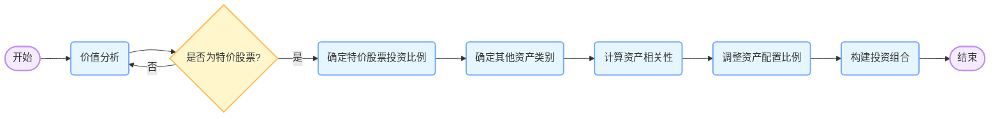

# 特价股票投资中的跨资产类别配置

> 关键词：特价股票投资、跨资产类别配置、资产组合、风险分散、投资策略

> 摘要：本文聚焦于特价股票投资中的跨资产类别配置这一重要主题。首先介绍了相关背景知识，包括目的、预期读者、文档结构和术语表。接着阐述了核心概念与联系，通过文本示意图和Mermaid流程图进行清晰展示。详细讲解了核心算法原理和具体操作步骤，并结合Python源代码进行说明。同时给出了数学模型和公式，辅以举例加深理解。通过项目实战，包括开发环境搭建、源代码实现与解读，深入剖析了跨资产类别配置在特价股票投资中的应用。探讨了实际应用场景，推荐了学习资源、开发工具框架和相关论文著作。最后总结了未来发展趋势与挑战，提供了常见问题解答和扩展阅读参考资料，旨在为投资者在特价股票投资中进行跨资产类别配置提供全面、深入的指导。

## 1. 背景介绍 
### 1.1 目的和范围
在金融市场中，特价股票通常是指那些价格低于其内在价值的股票。投资者购买特价股票的目的是期望在未来价格回归其价值时获得收益。然而，单一投资特价股票面临着较高的风险，因为个别股票的价格波动可能受到多种因素的影响，如公司的经营状况、行业竞争、宏观经济环境等。跨资产类别配置则是将投资分散到不同类型的资产上，如股票、债券、大宗商品、房地产等，以降低投资组合的整体风险。

本文的目的是探讨在特价股票投资中如何进行跨资产类别配置，以实现风险分散和收益最大化的目标。具体范围包括核心概念的介绍、算法原理的讲解、数学模型的构建、项目实战案例分析以及实际应用场景的探讨等。

### 1.2 预期读者
本文预期读者主要包括以下几类人群：
1. **个人投资者**：希望通过跨资产类别配置优化自己的投资组合，在特价股票投资中降低风险、提高收益的普通投资者。
2. **金融从业者**：如投资顾问、基金经理等，他们需要深入了解跨资产类别配置的理论和实践，为客户提供更专业的投资建议。
3. **金融专业学生**：学习金融投资相关课程的学生，通过阅读本文可以加深对跨资产类别配置和特价股票投资的理解。
4. **研究人员**：从事金融投资领域研究的学者，他们可以从本文中获取相关的研究思路和方法。

### 1.3 文档结构概述
本文将按照以下结构进行阐述：
1. **背景介绍**：介绍本文的目的、预期读者、文档结构和术语表。
2. **核心概念与联系**：阐述特价股票投资和跨资产类别配置的核心概念，并通过文本示意图和Mermaid流程图展示它们之间的联系。
3. **核心算法原理 & 具体操作步骤**：讲解跨资产类别配置的核心算法原理，并给出具体的操作步骤，同时使用Python源代码进行详细阐述。
4. **数学模型和公式 & 详细讲解 & 举例说明**：构建跨资产类别配置的数学模型，给出相关公式，并通过具体例子进行说明。
5. **项目实战：代码实际案例和详细解释说明**：通过一个实际的项目案例，介绍开发环境搭建、源代码实现和代码解读。
6. **实际应用场景**：探讨跨资产类别配置在特价股票投资中的实际应用场景。
7. **工具和资源推荐**：推荐学习资源、开发工具框架和相关论文著作。
8. **总结：未来发展趋势与挑战**：总结跨资产类别配置在特价股票投资中的未来发展趋势和面临的挑战。
9. **附录：常见问题与解答**：解答读者在阅读本文过程中可能遇到的常见问题。
10. **扩展阅读 & 参考资料**：提供相关的扩展阅读资料和参考书目。

### 1.4 术语表
#### 1.4.1 核心术语定义
1. **特价股票**：价格低于其内在价值的股票，通常是由于市场情绪、公司短期困境等因素导致。
2. **跨资产类别配置**：将投资资金分散到不同类型的资产上，如股票、债券、大宗商品、房地产等，以降低投资组合的整体风险。
3. **资产组合**：由不同资产组成的投资组合，通过合理配置不同资产的比例，可以实现风险和收益的平衡。
4. **风险分散**：通过投资多种不同的资产，降低单一资产对投资组合的影响，从而降低投资组合的整体风险。
5. **投资策略**：投资者根据自己的投资目标、风险承受能力和市场情况制定的投资计划和方法。

#### 1.4.2 相关概念解释
1. **内在价值**：股票的真实价值，通常通过对公司的财务状况、行业前景、竞争力等因素进行分析来评估。
2. **市场情绪**：投资者对市场的整体看法和预期，会影响股票的价格波动。
3. **资产相关性**：不同资产之间价格变动的关联程度，相关性越低，通过资产配置降低风险的效果越好。
4. **夏普比率**：衡量投资组合风险调整后收益的指标，计算公式为投资组合的预期收益率减去无风险收益率，再除以投资组合的标准差。

#### 1.4.3 缩略词列表
1. **ETF**：交易型开放式指数基金（Exchange Traded Fund）
2. **VAR**：风险价值（Value at Risk）
3. **CAPM**：资本资产定价模型（Capital Asset Pricing Model）

## 2. 核心概念与联系 
### 核心概念原理
#### 特价股票投资原理
特价股票投资的核心原理是基于价值投资的理念。价值投资者认为，市场有时会出现定价错误，导致某些股票的价格低于其内在价值。通过对公司的基本面进行深入分析，如财务报表、行业地位、管理层能力等，投资者可以发现这些被低估的股票。当市场逐渐认识到这些股票的真实价值时，价格就会回归其内在价值，投资者从而获得收益。

#### 跨资产类别配置原理
跨资产类别配置的原理是基于风险分散的理论。不同类型的资产在不同的市场环境下表现不同，它们之间的价格波动往往具有一定的独立性。通过将投资资金分散到不同资产类别上，当某一类资产表现不佳时，其他资产可能表现较好，从而降低投资组合的整体风险。同时，合理的资产配置还可以在一定程度上提高投资组合的收益。

### 架构的文本示意图
特价股票投资和跨资产类别配置之间的关系可以用以下文本示意图表示：

投资者首先通过价值分析筛选出特价股票，确定投资于特价股票的资金比例。然后，为了降低单一股票投资的风险，投资者将剩余资金分配到其他资产类别上，如债券、大宗商品、房地产等。不同资产类别之间通过资产相关性相互关联，投资者通过调整不同资产的比例，实现投资组合的风险和收益平衡。

### Mermaid 流程图


该流程图展示了在特价股票投资中进行跨资产类别配置的基本流程。首先进行价值分析，筛选出特价股票，确定投资比例。然后选择其他资产类别，计算资产相关性，根据相关性调整资产配置比例，最终构建投资组合。

## 3. 核心算法原理 & 具体操作步骤 
### 核心算法原理
在跨资产类别配置中，常用的算法是均值 - 方差模型（Markowitz 模型）。该模型的核心思想是在给定预期收益率的情况下，通过调整不同资产的投资比例，使投资组合的方差最小，从而实现风险最小化。

设投资组合中有 $n$ 种资产，第 $i$ 种资产的预期收益率为 $r_i$，投资比例为 $w_i$，则投资组合的预期收益率 $R_p$ 为：

$$R_p = \sum_{i=1}^{n} w_i r_i$$

投资组合的方差 $\sigma_p^2$ 为：

$$\sigma_p^2 = \sum_{i=1}^{n} \sum_{j=1}^{n} w_i w_j \sigma_{ij}$$

其中，$\sigma_{ij}$ 是资产 $i$ 和资产 $j$ 的协方差。

均值 - 方差模型的目标是在满足一定预期收益率的约束下，最小化投资组合的方差，即：

$$\min_{w_1, w_2, \cdots, w_n} \sigma_p^2 = \sum_{i=1}^{n} \sum_{j=1}^{n} w_i w_j \sigma_{ij}$$

$$s.t. \sum_{i=1}^{n} w_i r_i = R_{target}$$

$$\sum_{i=1}^{n} w_i = 1$$

$$w_i \geq 0, i = 1, 2, \cdots, n$$

其中，$R_{target}$ 是投资者设定的预期收益率目标。

### 具体操作步骤
1. **数据收集**：收集不同资产类别的历史收益率数据，包括特价股票、债券、大宗商品等。
2. **计算预期收益率和协方差矩阵**：根据历史收益率数据，计算每种资产的预期收益率和资产之间的协方差矩阵。
3. **设定预期收益率目标**：根据投资者的风险承受能力和投资目标，设定投资组合的预期收益率目标。
4. **求解最优资产配置比例**：使用优化算法求解均值 - 方差模型，得到不同资产的最优投资比例。
5. **构建投资组合**：根据求解得到的最优投资比例，构建投资组合。

### Python 源代码实现
```python
import numpy as np
from scipy.optimize import minimize

# 示例数据：假设我们有 3 种资产
# 预期收益率
expected_returns = np.array([0.1, 0.08, 0.06])
# 协方差矩阵
cov_matrix = np.array([[0.1, 0.02, 0.01],
                       [0.02, 0.08, 0.03],
                       [0.01, 0.03, 0.06]])
# 预期收益率目标
target_return = 0.09

# 定义目标函数：最小化投资组合的方差
def portfolio_variance(weights, cov_matrix):
    return np.dot(weights.T, np.dot(cov_matrix, weights))

# 定义约束条件
def expected_return_constraint(weights, expected_returns, target_return):
    return np.dot(weights, expected_returns) - target_return

def weight_sum_constraint(weights):
    return np.sum(weights) - 1

# 初始权重
initial_weights = np.ones(len(expected_returns)) / len(expected_returns)

# 约束条件列表
constraints = [{'type': 'eq', 'fun': lambda x: expected_return_constraint(x, expected_returns, target_return)},
               {'type': 'eq', 'fun': weight_sum_constraint}]

# 权重范围约束
bounds = [(0, 1) for _ in range(len(expected_returns))]

# 使用优化算法求解最优权重
result = minimize(portfolio_variance, initial_weights, args=(cov_matrix,),
                  method='SLSQP', constraints=constraints, bounds=bounds)

# 最优权重
optimal_weights = result.x

print("最优投资比例：", optimal_weights)
```

在上述代码中，我们首先定义了预期收益率、协方差矩阵和预期收益率目标。然后定义了目标函数和约束条件，使用 `scipy.optimize.minimize` 函数求解最优投资比例。最后输出最优投资比例。

## 4. 数学模型和公式 & 详细讲解 & 举例说明 
### 数学模型和公式
#### 投资组合的预期收益率
投资组合的预期收益率是每种资产预期收益率的加权平均值，公式为：

$$R_p = \sum_{i=1}^{n} w_i r_i$$

其中，$R_p$ 是投资组合的预期收益率，$w_i$ 是第 $i$ 种资产的投资比例，$r_i$ 是第 $i$ 种资产的预期收益率。

#### 投资组合的方差
投资组合的方差衡量了投资组合的风险，公式为：

$$\sigma_p^2 = \sum_{i=1}^{n} \sum_{j=1}^{n} w_i w_j \sigma_{ij}$$

其中，$\sigma_p^2$ 是投资组合的方差，$w_i$ 和 $w_j$ 分别是第 $i$ 种和第 $j$ 种资产的投资比例，$\sigma_{ij}$ 是资产 $i$ 和资产 $j$ 的协方差。

#### 协方差
资产 $i$ 和资产 $j$ 的协方差 $\sigma_{ij}$ 表示它们之间的相关性，公式为：

$$\sigma_{ij} = \rho_{ij} \sigma_i \sigma_j$$

其中，$\rho_{ij}$ 是资产 $i$ 和资产 $j$ 的相关系数，$\sigma_i$ 和 $\sigma_j$ 分别是资产 $i$ 和资产 $j$ 的标准差。

### 详细讲解
- **预期收益率**：预期收益率反映了投资组合在未来可能获得的平均收益。通过合理配置不同资产的投资比例，可以调整投资组合的预期收益率。
- **方差**：方差衡量了投资组合的波动程度，方差越大，投资组合的风险越高。通过跨资产类别配置，可以降低投资组合的方差，从而降低风险。
- **协方差**：协方差表示不同资产之间的相关性。当协方差为正时，两种资产的价格变动趋势相同；当协方差为负时，两种资产的价格变动趋势相反。通过选择相关性较低的资产进行配置，可以更好地实现风险分散。

### 举例说明
假设我们有两种资产：股票 A 和债券 B。股票 A 的预期收益率为 $15\%$，标准差为 $20\%$；债券 B 的预期收益率为 $8\%$，标准差为 $10\%$。两种资产的相关系数为 $0.2$。

我们将 $60\%$ 的资金投资于股票 A，$40\%$ 的资金投资于债券 B。则投资组合的预期收益率为：

$$R_p = 0.6 \times 0.15 + 0.4 \times 0.08 = 0.122 = 12.2\%$$

资产 A 和资产 B 的协方差为：

$$\sigma_{AB} = 0.2 \times 0.2 \times 0.1 = 0.004$$

投资组合的方差为：

$$\sigma_p^2 = 0.6^2 \times 0.2^2 + 0.4^2 \times 0.1^2 + 2 \times 0.6 \times 0.4 \times 0.004 = 0.0144 + 0.0016 + 0.00192 = 0.01792$$

投资组合的标准差为：

$$\sigma_p = \sqrt{0.01792} \approx 0.1339 = 13.39\%$$

通过这个例子可以看出，通过合理配置股票和债券的比例，我们可以在一定程度上降低投资组合的风险，同时获得一定的预期收益。

## 5. 项目实战：代码实际案例和详细解释说明 
### 5.1  开发环境搭建
#### 安装 Python
首先，需要安装 Python 环境。可以从 Python 官方网站（https://www.python.org/downloads/）下载适合自己操作系统的 Python 安装包，并按照安装向导进行安装。

#### 安装必要的库
在跨资产类别配置的项目中，需要使用一些 Python 库，如 `numpy`、`pandas`、`scipy` 等。可以使用 `pip` 命令进行安装：

```sh
pip install numpy pandas scipy
```

### 5.2  源代码详细实现和代码解读
```python
import numpy as np
import pandas as pd
from scipy.optimize import minimize

# 读取历史数据
data = pd.read_csv('historical_data.csv')

# 提取收益率数据
returns = data.pct_change().dropna()

# 计算预期收益率和协方差矩阵
expected_returns = returns.mean()
cov_matrix = returns.cov()

# 预期收益率目标
target_return = 0.1

# 定义目标函数：最小化投资组合的方差
def portfolio_variance(weights, cov_matrix):
    return np.dot(weights.T, np.dot(cov_matrix, weights))

# 定义约束条件
def expected_return_constraint(weights, expected_returns, target_return):
    return np.dot(weights, expected_returns) - target_return

def weight_sum_constraint(weights):
    return np.sum(weights) - 1

# 初始权重
initial_weights = np.ones(len(expected_returns)) / len(expected_returns)

# 约束条件列表
constraints = [{'type': 'eq', 'fun': lambda x: expected_return_constraint(x, expected_returns, target_return)},
               {'type': 'eq', 'fun': weight_sum_constraint}]

# 权重范围约束
bounds = [(0, 1) for _ in range(len(expected_returns))]

# 使用优化算法求解最优权重
result = minimize(portfolio_variance, initial_weights, args=(cov_matrix,),
                  method='SLSQP', constraints=constraints, bounds=bounds)

# 最优权重
optimal_weights = result.x

# 输出结果
print("最优投资比例：")
for i in range(len(expected_returns.index)):
    print(f"{expected_returns.index[i]}: {optimal_weights[i]:.2%}")
```

### 代码解读与分析
1. **数据读取**：使用 `pandas` 库的 `read_csv` 函数读取历史数据文件 `historical_data.csv`，该文件包含了不同资产的历史价格数据。
2. **收益率计算**：使用 `pct_change` 函数计算资产的收益率，并使用 `dropna` 函数去除缺失值。
3. **预期收益率和协方差矩阵计算**：使用 `mean` 函数计算每种资产的预期收益率，使用 `cov` 函数计算资产之间的协方差矩阵。
4. **目标函数定义**：定义目标函数 `portfolio_variance`，用于计算投资组合的方差。
5. **约束条件定义**：定义两个约束条件，分别是预期收益率约束和权重总和约束。
6. **初始权重设置**：将初始权重设置为每种资产平均分配。
7. **优化求解**：使用 `scipy.optimize.minimize` 函数求解最优投资比例。
8. **结果输出**：输出每种资产的最优投资比例。

## 6. 实际应用场景 
### 个人投资者
对于个人投资者来说，在特价股票投资中进行跨资产类别配置可以降低投资风险。例如，一位投资者发现了几只特价股票，但担心单一股票投资的风险过高。他可以将一部分资金投资于这些特价股票，同时将另一部分资金投资于债券、基金等其他资产。这样，即使特价股票的价格出现波动，其他资产的表现可能会弥补损失，从而实现投资组合的稳定收益。

### 基金管理公司
基金管理公司在管理基金时，通常会采用跨资产类别配置的策略。在特价股票投资方面，基金经理会筛选出具有投资价值的特价股票，将其纳入基金投资组合。同时，为了降低风险，会根据市场情况和基金的投资目标，合理配置债券、大宗商品等其他资产。通过跨资产类别配置，基金可以在不同市场环境下保持较好的业绩表现。

### 保险公司
保险公司在进行资产配置时，需要考虑资产的安全性和收益性。在特价股票投资中，保险公司可以选择一些业绩稳定、分红较高的特价股票进行投资。同时，为了确保资产的安全性，会将大部分资金投资于债券等固定收益类资产。通过跨资产类别配置，保险公司可以在保证资产安全的前提下，获得一定的投资收益。

## 7. 工具和资源推荐
### 7.1 学习资源推荐
#### 7.1.1 书籍推荐
1. 《聪明的投资者》（The Intelligent Investor）：本杰明·格雷厄姆（Benjamin Graham）著，被誉为价值投资的圣经，对特价股票投资有深入的阐述。
2. 《漫步华尔街》（A Random Walk Down Wall Street）：伯顿·马尔基尔（Burton Malkiel）著，介绍了投资的基本原理和跨资产类别配置的方法。
3. 《投资组合理论与资本市场》（Portfolio Theory and Capital Markets）：哈里·马科维茨（Harry Markowitz）著，均值 - 方差模型的创始人的经典著作，对跨资产类别配置的理论有详细的讲解。

#### 7.1.2 在线课程
1. Coursera 上的 “Investment Management Specialization”：由哥伦比亚大学教授授课，涵盖了投资组合管理、资产配置等方面的知识。
2. edX 上的 “Financial Markets”：耶鲁大学教授罗伯特·席勒（Robert Shiller）主讲，介绍了金融市场的基本原理和投资策略。
3. Udemy 上的 “Python for Finance: Investment Fundamentals & Data Analytics”：通过 Python 实现金融数据分析和投资组合优化。

#### 7.1.3 技术博客和网站
1. Seeking Alpha：提供股票分析、投资策略等方面的文章和评论。
2. Bloomberg：全球知名的金融信息服务提供商，提供实时金融市场数据和分析。
3. QuantNet：量化投资领域的专业论坛，有很多关于资产配置和投资策略的讨论。

### 7.2 开发工具框架推荐
#### 7.2.1 IDE和编辑器
1. PyCharm：专业的 Python 集成开发环境，提供代码编辑、调试、版本控制等功能。
2. Jupyter Notebook：交互式笔记本，适合进行数据分析和模型开发，支持 Python、R 等多种编程语言。
3. Visual Studio Code：轻量级的代码编辑器，支持多种编程语言，有丰富的插件扩展。

#### 7.2.2 调试和性能分析工具
1. pdb：Python 内置的调试工具，可以帮助开发者逐步调试代码，查找问题。
2. cProfile：Python 内置的性能分析工具，可以分析代码的运行时间和函数调用情况。
3. Py-Spy：一个跨平台的 Python 性能分析工具，可以实时监测 Python 程序的性能。

#### 7.2.3 相关框架和库
1. NumPy：Python 的数值计算库，提供了高效的数组操作和数学函数。
2. Pandas：用于数据处理和分析的 Python 库，提供了 DataFrame 和 Series 等数据结构。
3. Scipy：Python 的科学计算库，包含了优化、插值、积分等多种算法。

### 7.3 相关论文著作推荐
#### 7.3.1 经典论文
1. “Portfolio Selection”：哈里·马科维茨（Harry Markowitz）于 1952 年发表的论文，提出了均值 - 方差模型，奠定了现代投资组合理论的基础。
2. “The Capital Asset Pricing Model: Theory and Evidence”：由 Eugene F. Fama 和 Kenneth R. French 撰写，对资本资产定价模型进行了深入的研究和实证分析。
3. “Does Asset Allocation Policy Explain 40, 90, or 100 Percent of Performance?”：由 Gary P. Brinson、L. Randolph Hood 和 Gilbert L. Beebower 发表，探讨了资产配置对投资组合绩效的影响。

#### 7.3.2 最新研究成果
1. “Factor-Based Asset Allocation”：探讨了基于因子的资产配置方法，通过考虑多种风险因子来优化投资组合。
2. “Dynamic Asset Allocation in the Presence of Regime Shifts”：研究了在市场状态发生变化时的动态资产配置策略。
3. “Machine Learning for Asset Allocation”：介绍了机器学习在资产配置中的应用，如使用深度学习模型预测资产收益率。

#### 7.3.3 应用案例分析
1. “Case Studies in Asset Allocation”：通过实际案例分析，介绍了不同类型投资者的资产配置策略和实践经验。
2. “Asset Allocation in Practice: Lessons from the Field”：分享了金融机构在资产配置方面的实际操作经验和案例。
3. “Portfolio Optimization Case Studies”：提供了多个投资组合优化的案例，包括不同资产类别和投资目标的配置方案。

## 8. 总结：未来发展趋势与挑战
### 未来发展趋势
#### 智能化投资
随着人工智能和机器学习技术的不断发展，智能化投资将成为未来的发展趋势。通过使用大数据分析、深度学习等技术，可以更准确地预测资产价格走势，优化资产配置方案。例如，一些量化投资基金已经开始使用机器学习模型进行投资决策，提高投资效率和收益。

#### 多元化资产配置
未来，投资者将更加注重多元化资产配置，不仅会投资于传统的股票、债券、大宗商品等资产，还会关注新兴资产类别，如数字货币、私募股权、基础设施等。多元化资产配置可以进一步降低投资组合的风险，提高收益的稳定性。

#### 个性化投资服务
随着投资者需求的不断多样化，个性化投资服务将成为金融机构的重要发展方向。金融机构将根据投资者的风险承受能力、投资目标、投资期限等因素，为投资者提供定制化的资产配置方案。例如，一些互联网金融平台已经开始提供个性化的智能投顾服务。

### 挑战
#### 市场不确定性
金融市场充满了不确定性，资产价格的波动受到多种因素的影响，如宏观经济环境、政治事件、自然灾害等。这些不确定性增加了资产配置的难度，投资者很难准确预测资产价格的走势。

#### 数据质量和隐私问题
在智能化投资中，数据是关键。然而，数据质量和隐私问题是面临的重要挑战。数据的准确性、完整性和及时性会影响模型的预测效果，而数据隐私问题则涉及到投资者的个人信息安全。

#### 模型风险
使用数学模型进行资产配置存在一定的风险。模型的假设和参数可能与实际情况不符，导致模型的预测结果不准确。此外，市场环境的变化可能会使模型失效，投资者需要不断调整和优化模型。

## 9. 附录：常见问题与解答
### 问题 1：什么是特价股票？
特价股票是指价格低于其内在价值的股票。通常是由于市场情绪、公司短期困境等因素导致股票价格被低估。投资者购买特价股票的目的是期望在未来价格回归其价值时获得收益。

### 问题 2：为什么要进行跨资产类别配置？
跨资产类别配置可以降低投资组合的整体风险。不同类型的资产在不同的市场环境下表现不同，它们之间的价格波动往往具有一定的独立性。通过将投资资金分散到不同资产类别上，当某一类资产表现不佳时，其他资产可能表现较好，从而降低投资组合的风险。

### 问题 3：如何确定不同资产的投资比例？
可以使用均值 - 方差模型等优化算法来确定不同资产的投资比例。该模型的核心思想是在给定预期收益率的情况下，通过调整不同资产的投资比例，使投资组合的方差最小。具体步骤包括收集历史数据、计算预期收益率和协方差矩阵、设定预期收益率目标、求解最优资产配置比例等。

### 问题 4：跨资产类别配置是否适合所有投资者？
跨资产类别配置适合大多数投资者，尤其是那些希望降低投资风险、实现资产稳健增值的投资者。然而，不同投资者的风险承受能力和投资目标不同，需要根据自己的实际情况进行合理的资产配置。例如，风险承受能力较低的投资者可以适当增加债券等固定收益类资产的投资比例；而风险承受能力较高的投资者可以适当增加股票等权益类资产的投资比例。

### 问题 5：智能化投资是否可靠？
智能化投资是基于大数据分析和机器学习等技术，通过对历史数据的学习和分析来进行投资决策。虽然智能化投资可以提高投资效率和准确性，但也存在一定的风险。模型的假设和参数可能与实际情况不符，市场环境的变化可能会使模型失效。因此，投资者在使用智能化投资服务时，需要结合自己的判断和经验，谨慎做出投资决策。

## 10. 扩展阅读 & 参考资料
### 扩展阅读
1. 《金融炼金术》（The Alchemy of Finance）：乔治·索罗斯（George Soros）著，介绍了他的投资哲学和方法，对理解金融市场的运行机制有很大帮助。
2. 《黑天鹅》（The Black Swan）：纳西姆·尼古拉斯·塔勒布（Nassim Nicholas Taleb）著，探讨了极端事件对金融市场的影响，提醒投资者要关注不确定性。
3. 《小狗钱钱》（The Little Dog That Couldn't Lose）：博多·舍费尔（Bodo Schäfer）著，是一本适合初学者的理财启蒙书籍，通过生动有趣的故事介绍了投资和理财的基本知识。

### 参考资料
1. Markowitz, H. (1952). Portfolio Selection. The Journal of Finance, 7(1), 77-91.
2. Fama, E. F., & French, K. R. (2004). The Capital Asset Pricing Model: Theory and Evidence. The Journal of Economic Perspectives, 18(3), 25-46.
3. Brinson, G. P., Hood, L. R., & Beebower, G. L. (1986). Determinants of Portfolio Performance. Financial Analysts Journal, 42(4), 39-44.
4. Python 官方文档：https://docs.python.org/
5. NumPy 官方文档：https://numpy.org/doc/
6. Pandas 官方文档：https://pandas.pydata.org/docs/
7. Scipy 官方文档：https://docs.scipy.org/doc/