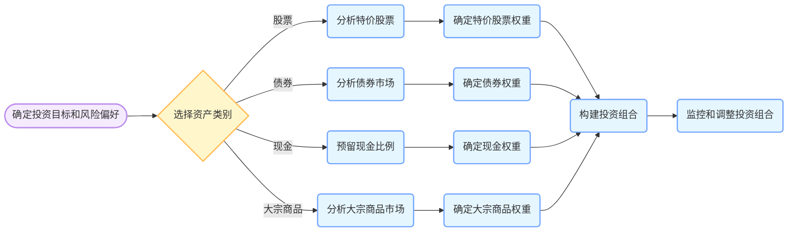

# 特价股票投资中的跨资产类别配置方法

> 关键词：特价股票投资、跨资产类别配置、资产组合、风险分散、投资策略

> 摘要：本文聚焦于特价股票投资中的跨资产类别配置方法。首先介绍了该研究的背景、目的、预期读者等内容。详细阐述了核心概念，包括跨资产类别配置的原理和架构，并以示意图和流程图呈现。深入讲解了核心算法原理，用 Python 代码示例展示具体操作步骤。探讨了相关数学模型和公式，并举例说明。通过项目实战，从开发环境搭建到源代码实现及解读，展示了跨资产类别配置在实际中的应用。分析了实际应用场景，推荐了学习资源、开发工具框架和相关论文著作。最后总结了未来发展趋势与挑战，还提供了常见问题解答和扩展阅读参考资料，旨在为投资者在特价股票投资中合理进行跨资产类别配置提供全面且深入的指导。

## 1. 背景介绍 
### 1.1 目的和范围
在金融市场中，特价股票通常指那些价格被低估的股票，具有潜在的投资价值。然而，单纯投资特价股票可能面临较高的风险，因为股票市场本身具有不确定性和波动性。跨资产类别配置是一种通过将资金分散投资于不同资产类别的策略，旨在降低风险并提高投资组合的整体收益。

本文的目的在于探讨如何在特价股票投资中应用跨资产类别配置方法，以优化投资组合。具体范围涵盖了常见的资产类别，如股票、债券、现金、大宗商品等，以及如何根据不同的市场环境和投资者风险偏好进行合理的配置。

### 1.2 预期读者
本文主要面向对金融投资感兴趣的人群，包括个人投资者、金融从业者、投资顾问等。对于希望了解如何在特价股票投资中运用跨资产类别配置策略，以实现风险控制和收益最大化的读者具有较高的参考价值。

### 1.3 文档结构概述
本文将按照以下结构展开：首先介绍跨资产类别配置的核心概念和它们之间的联系，包括原理和架构，并通过示意图和流程图进行直观展示；接着详细讲解核心算法原理，并给出具体的 Python 代码实现操作步骤；然后介绍相关的数学模型和公式，并举例说明其应用；通过项目实战展示跨资产类别配置在实际中的应用，包括开发环境搭建、源代码实现和代码解读；分析跨资产类别配置在实际中的应用场景；推荐相关的学习资源、开发工具框架和论文著作；最后总结未来发展趋势与挑战，提供常见问题解答和扩展阅读参考资料。

### 1.4 术语表
#### 1.4.1 核心术语定义
- **特价股票**：指市场价格低于其内在价值的股票，通常是由于市场短期波动、公司暂时的困境或被市场忽视等原因导致。
- **跨资产类别配置**：将投资资金分配到不同资产类别（如股票、债券、现金、大宗商品等）的投资策略，以降低投资组合的风险并提高收益。
- **资产组合**：由不同资产组成的集合，投资者通过调整资产组合中各资产的比例来实现特定的投资目标。
- **风险分散**：通过投资于多种不同的资产，使得单个资产的波动对整个投资组合的影响减小，从而降低投资组合的整体风险。

#### 1.4.2 相关概念解释
- **资产相关性**：指不同资产之间价格变动的关联程度。正相关表示资产价格变动方向相同，负相关表示资产价格变动方向相反，零相关表示资产价格变动相互独立。在跨资产类别配置中，选择相关性较低的资产可以更好地实现风险分散。
- **投资组合的预期收益**：根据各资产的预期收益和在投资组合中的权重计算得出的投资组合的平均收益预期。
- **投资组合的风险**：通常用投资组合的方差或标准差来衡量，反映了投资组合收益的波动程度。

#### 1.4.3 缩略词列表
- **CAPM**：Capital Asset Pricing Model，资本资产定价模型
- **VAR**：Value at Risk，风险价值
- **ETF**：Exchange - Traded Fund，交易型开放式指数基金

## 2. 核心概念与联系 

### 核心概念原理
跨资产类别配置的核心原理基于现代投资组合理论。该理论认为，投资者可以通过将资金分散投资于不同资产类别，来降低投资组合的风险，同时在一定程度上提高收益。不同资产类别具有不同的风险 - 收益特征，并且它们之间的价格变动相关性不同。

例如，股票通常具有较高的预期收益，但同时也伴随着较高的风险；债券的预期收益相对较低，但风险也较低，并且在股票市场下跌时，债券可能表现出一定的稳定性，与股票呈现负相关或低相关。通过合理配置股票和债券等不同资产类别，可以在降低投资组合风险的同时，保持一定的预期收益。

### 架构的文本示意图
```plaintext
            投资组合
          /        |        \
       股票       债券       现金
      /   \      /   \
特价股票  普通股票  国债  企业债
```
这个示意图展示了投资组合的基本架构，投资组合由不同资产类别组成，其中股票类别又可细分为特价股票和普通股票，债券类别可细分为国债和企业债等。

### Mermaid 流程图

该流程图展示了跨资产类别配置的基本流程，从确定投资目标和风险偏好开始，选择不同的资产类别，分析各类资产，确定权重，构建投资组合，最后进行监控和调整。

## 3. 核心算法原理 & 具体操作步骤 

### 核心算法原理
在跨资产类别配置中，常用的算法是均值 - 方差优化算法。该算法的目标是在给定的预期收益下，最小化投资组合的风险（方差）；或者在给定的风险水平下，最大化投资组合的预期收益。

假设我们有 $n$ 种资产，其预期收益率向量为 $\mathbf{r} = [r_1, r_2, \cdots, r_n]^T$，资产收益率的协方差矩阵为 $\mathbf{\Sigma}$，投资组合的权重向量为 $\mathbf{w} = [w_1, w_2, \cdots, w_n]^T$，且 $\sum_{i = 1}^{n} w_i = 1$。

投资组合的预期收益率 $R_p$ 为：
$$R_p=\mathbf{w}^T\mathbf{r}$$

投资组合的方差 $\sigma_p^2$ 为：
$$\sigma_p^2=\mathbf{w}^T\mathbf{\Sigma}\mathbf{w}$$

均值 - 方差优化问题可以表示为以下两种形式：

#### 最小方差问题
在给定预期收益率 $R_{target}$ 的约束下，最小化投资组合的方差：
$$\min_{\mathbf{w}} \mathbf{w}^T\mathbf{\Sigma}\mathbf{w}$$
$$\text{s.t. } \mathbf{w}^T\mathbf{r} = R_{target}$$
$$\sum_{i = 1}^{n} w_i = 1$$
$$w_i \geq 0, \forall i = 1, \cdots, n$$

#### 最大预期收益问题
在给定风险水平 $\sigma_{target}^2$ 的约束下，最大化投资组合的预期收益率：
$$\max_{\mathbf{w}} \mathbf{w}^T\mathbf{r}$$
$$\text{s.t. } \mathbf{w}^T\mathbf{\Sigma}\mathbf{w} = \sigma_{target}^2$$
$$\sum_{i = 1}^{n} w_i = 1$$
$$w_i \geq 0, \forall i = 1, \cdots, n$$

### 具体操作步骤及 Python 代码实现
```python
import numpy as np
from scipy.optimize import minimize

# 示例数据：假设有 3 种资产
# 预期收益率向量
expected_returns = np.array([0.1, 0.08, 0.06])
# 协方差矩阵
cov_matrix = np.array([[0.1, 0.02, 0.01],
                       [0.02, 0.08, 0.01],
                       [0.01, 0.01, 0.05]])
# 目标预期收益率
target_return = 0.09

# 定义最小方差问题的目标函数
def portfolio_variance(weights, cov_matrix):
    return np.dot(weights.T, np.dot(cov_matrix, weights))

# 定义约束条件
def portfolio_return_constraint(weights, expected_returns, target_return):
    return np.dot(weights, expected_returns) - target_return

# 定义权重总和为 1 的约束条件
def weights_sum_constraint(weights):
    return np.sum(weights) - 1

# 初始权重猜测
initial_weights = np.ones(len(expected_returns)) / len(expected_returns)

# 约束条件列表
constraints = [
    {'type': 'eq', 'fun': lambda x: portfolio_return_constraint(x, expected_returns, target_return)},
    {'type': 'eq', 'fun': weights_sum_constraint}
]

# 权重的边界条件，所有权重都在 [0, 1] 范围内
bounds = [(0, 1) for _ in range(len(expected_returns))]

# 最小化方差
result = minimize(portfolio_variance, initial_weights, args=(cov_matrix,), method='SLSQP', bounds=bounds, constraints=constraints)

# 最优权重
optimal_weights = result.x

print("最优权重:", optimal_weights)
```
在上述代码中，我们首先定义了预期收益率向量和协方差矩阵，以及目标预期收益率。然后定义了最小方差问题的目标函数和约束条件，使用 `scipy.optimize.minimize` 函数来求解最小方差问题，得到最优的投资组合权重。

## 4. 数学模型和公式 & 详细讲解 & 举例说明 

### 数学模型和公式
#### 投资组合的预期收益率
如前文所述，投资组合的预期收益率 $R_p$ 由各资产的预期收益率和其在投资组合中的权重决定，公式为：
$$R_p=\sum_{i = 1}^{n} w_i r_i=\mathbf{w}^T\mathbf{r}$$
其中，$w_i$ 是第 $i$ 种资产的权重，$r_i$ 是第 $i$ 种资产的预期收益率，$\mathbf{w}$ 是权重向量，$\mathbf{r}$ 是预期收益率向量。

#### 投资组合的方差
投资组合的方差 $\sigma_p^2$ 衡量了投资组合收益的波动程度，公式为：
$$\sigma_p^2=\sum_{i = 1}^{n} \sum_{j = 1}^{n} w_i w_j \sigma_{ij}=\mathbf{w}^T\mathbf{\Sigma}\mathbf{w}$$
其中，$\sigma_{ij}$ 是资产 $i$ 和资产 $j$ 的协方差，$\mathbf{\Sigma}$ 是协方差矩阵。

#### 资本资产定价模型（CAPM）
CAPM 用于描述资产的预期收益率与市场风险之间的关系，公式为：
$$r_i = r_f+\beta_i (r_m - r_f)$$
其中，$r_i$ 是资产 $i$ 的预期收益率，$r_f$ 是无风险利率，$r_m$ 是市场组合的预期收益率，$\beta_i$ 是资产 $i$ 的贝塔系数，衡量了资产 $i$ 的收益率对市场组合收益率的敏感程度。

### 详细讲解
- **投资组合的预期收益率**：该公式直观地反映了投资组合的预期收益是各资产预期收益的加权平均。权重越大的资产，对投资组合预期收益的影响越大。例如，如果投资组合中股票的权重较大，且股票的预期收益率较高，那么投资组合的预期收益率也会相对较高。
- **投资组合的方差**：方差的计算考虑了资产之间的协方差。当资产之间的协方差为正时，它们的价格变动方向相似，会增加投资组合的方差；当协方差为负时，它们的价格变动方向相反，可以降低投资组合的方差。因此，选择相关性较低的资产进行配置可以有效降低投资组合的风险。
- **资本资产定价模型（CAPM）**：CAPM 提供了一种评估资产预期收益率的方法。贝塔系数大于 1 的资产，其收益率波动比市场组合更大；贝塔系数小于 1 的资产，其收益率波动比市场组合更小。投资者可以根据资产的贝塔系数来调整投资组合，以实现特定的风险 - 收益目标。

### 举例说明
假设我们有一个投资组合，包含两种资产：股票 A 和债券 B。股票 A 的预期收益率为 $r_A = 0.15$，权重为 $w_A = 0.6$；债券 B 的预期收益率为 $r_B = 0.05$，权重为 $w_B = 0.4$。

#### 投资组合的预期收益率
根据公式 $R_p=\sum_{i = 1}^{2} w_i r_i$，可得：
$$R_p = w_A r_A+w_B r_B = 0.6\times0.15 + 0.4\times0.05 = 0.11$$
即投资组合的预期收益率为 $11\%$。

#### 投资组合的方差
假设股票 A 和债券 B 的收益率的协方差矩阵为：
$$\mathbf{\Sigma}=\begin{bmatrix}
0.2 & 0.03 \\
0.03 & 0.05
\end{bmatrix}$$
权重向量为 $\mathbf{w} = [0.6, 0.4]^T$。

根据公式 $\sigma_p^2=\mathbf{w}^T\mathbf{\Sigma}\mathbf{w}$，可得：
$$\sigma_p^2=\begin{bmatrix}0.6 & 0.4\end{bmatrix}\begin{bmatrix}
0.2 & 0.03 \\
0.03 & 0.05
\end{bmatrix}\begin{bmatrix}0.6 \\ 0.4\end{bmatrix}$$
$$= 0.6^2\times0.2+2\times0.6\times0.4\times0.03 + 0.4^2\times0.05$$
$$= 0.072 + 0.0144+0.008 = 0.0944$$

#### 资本资产定价模型（CAPM）
假设无风险利率 $r_f = 0.03$，市场组合的预期收益率 $r_m = 0.1$，股票 A 的贝塔系数 $\beta_A = 1.2$。

根据 CAPM 公式 $r_A = r_f+\beta_A (r_m - r_f)$，可得：
$$r_A = 0.03+1.2\times(0.1 - 0.03)=0.03 + 0.084 = 0.114$$
即根据 CAPM 模型，股票 A 的预期收益率为 $11.4\%$。

## 5. 项目实战：代码实际案例和详细解释说明 

### 5.1  开发环境搭建
#### 安装 Python
首先，需要安装 Python 环境。可以从 Python 官方网站（https://www.python.org/downloads/）下载适合自己操作系统的 Python 安装包，并按照安装向导进行安装。建议安装 Python 3.7 及以上版本。

#### 安装必要的库
在跨资产类别配置的项目中，需要使用一些 Python 库，如 `numpy`、`pandas`、`scipy`、`matplotlib` 等。可以使用 `pip` 命令进行安装：
```sh
pip install numpy pandas scipy matplotlib
```

### 5.2  源代码详细实现和代码解读
```python
import numpy as np
import pandas as pd
import matplotlib.pyplot as plt
from scipy.optimize import minimize

# 读取资产数据
data = pd.read_csv('asset_data.csv')
returns = data.pct_change().dropna()

# 计算预期收益率和协方差矩阵
expected_returns = returns.mean()
cov_matrix = returns.cov()

# 资产数量
num_assets = len(expected_returns)

# 定义最小方差问题的目标函数
def portfolio_variance(weights, cov_matrix):
    return np.dot(weights.T, np.dot(cov_matrix, weights))

# 定义约束条件
def portfolio_return_constraint(weights, expected_returns, target_return):
    return np.dot(weights, expected_returns) - target_return

# 定义权重总和为 1 的约束条件
def weights_sum_constraint(weights):
    return np.sum(weights) - 1

# 初始权重猜测
initial_weights = np.ones(num_assets) / num_assets

# 目标预期收益率范围
target_returns = np.linspace(expected_returns.min(), expected_returns.max(), 100)

optimal_weights_list = []
for target_return in target_returns:
    # 约束条件列表
    constraints = [
        {'type': 'eq', 'fun': lambda x: portfolio_return_constraint(x, expected_returns, target_return)},
        {'type': 'eq', 'fun': weights_sum_constraint}
    ]
    # 权重的边界条件，所有权重都在 [0, 1] 范围内
    bounds = [(0, 1) for _ in range(num_assets)]
    # 最小化方差
    result = minimize(portfolio_variance, initial_weights, args=(cov_matrix,), method='SLSQP', bounds=bounds, constraints=constraints)
    optimal_weights = result.x
    optimal_weights_list.append(optimal_weights)

# 计算每个目标预期收益率下的最优投资组合的方差和预期收益率
portfolio_variances = []
portfolio_returns = []
for optimal_weights in optimal_weights_list:
    portfolio_variances.append(portfolio_variance(optimal_weights, cov_matrix))
    portfolio_returns.append(np.dot(optimal_weights, expected_returns))

# 绘制有效前沿
plt.figure(figsize=(10, 6))
plt.scatter(np.sqrt(portfolio_variances), portfolio_returns, c='b', marker='o')
plt.xlabel('标准差（风险）')
plt.ylabel('预期收益率')
plt.title('有效前沿')
plt.grid(True)
plt.show()
```
### 代码解读与分析
1. **数据读取和预处理**：使用 `pandas` 库读取资产数据文件 `asset_data.csv`，并计算资产的收益率。
2. **计算预期收益率和协方差矩阵**：通过 `mean()` 和 `cov()` 方法计算资产的预期收益率和协方差矩阵。
3. **定义目标函数和约束条件**：定义最小方差问题的目标函数 `portfolio_variance`，以及投资组合预期收益率约束和权重总和为 1 的约束条件。
4. **遍历不同的目标预期收益率**：使用 `np.linspace` 生成一系列目标预期收益率，对于每个目标预期收益率，使用 `scipy.optimize.minimize` 函数求解最小方差问题，得到最优权重。
5. **计算最优投资组合的方差和预期收益率**：根据最优权重计算每个目标预期收益率下的最优投资组合的方差和预期收益率。
6. **绘制有效前沿**：使用 `matplotlib` 库绘制有效前沿，展示不同风险水平下的最优预期收益率。

## 6. 实际应用场景 
### 个人投资者
个人投资者在进行特价股票投资时，可以运用跨资产类别配置方法来降低风险。例如，一个投资者看好某些特价股票，但又担心股票市场的波动，可以将一部分资金投资于债券或现金等低风险资产。这样，即使特价股票价格下跌，债券或现金资产的稳定性可以在一定程度上弥补股票投资的损失。

### 机构投资者
机构投资者如基金公司、保险公司等，通常管理着大量的资金，需要进行多元化的投资。在投资特价股票时，他们会考虑跨资产类别配置，以满足不同投资者的风险偏好和收益要求。例如，一只混合型基金可能会将一部分资金投资于特价股票，另一部分资金投资于债券、大宗商品等其他资产类别，以实现风险分散和收益优化。

### 风险管理
跨资产类别配置也是一种重要的风险管理手段。金融机构可以通过合理配置不同资产类别，降低投资组合对单一资产或市场因素的依赖。例如，在经济衰退期间，股票市场可能表现不佳，但债券市场可能相对稳定。通过增加债券在投资组合中的比重，可以降低投资组合的整体风险。

## 7. 工具和资源推荐
### 7.1 学习资源推荐
#### 7.1.1 书籍推荐
- 《聪明的投资者》（The Intelligent Investor）：本杰明·格雷厄姆（Benjamin Graham）著，被誉为投资界的圣经，介绍了价值投资的理念和方法，对于理解特价股票投资有很大帮助。
- 《漫步华尔街》（A Random Walk Down Wall Street）：伯顿·马尔基尔（Burton Malkiel）著，详细介绍了各种投资策略和资产配置方法，包括跨资产类别配置。
- 《投资组合理论与资本市场》（Portfolio Theory and Capital Markets）：威廉·夏普（William Sharpe）著，对现代投资组合理论进行了深入阐述，是学习资产配置的经典书籍。

#### 7.1.2 在线课程
- Coursera 上的“投资学原理”（Principles of Investing）：由知名教授授课，系统介绍了投资学的基本原理和方法，包括资产配置、风险管理等内容。
- edX 上的“金融市场”（Financial Markets）：耶鲁大学教授罗伯特·席勒（Robert Shiller）主讲，涵盖了金融市场的各个方面，对跨资产类别配置有深入讲解。

#### 7.1.3 技术博客和网站
- 雪球（https://xueqiu.com/）：国内知名的投资社区，提供了丰富的股票、基金等投资信息和讨论，投资者可以在这里学习到不同的投资策略和经验。
- Seeking Alpha（https://seekingalpha.com/）：国外的投资分析网站，有大量的专业分析师撰写的投资研究报告和文章，对跨资产类别配置有一定的参考价值。

### 7.2 开发工具框架推荐
#### 7.2.1 IDE和编辑器
- PyCharm：一款功能强大的 Python 集成开发环境，提供了代码编辑、调试、版本控制等一系列功能，适合开发跨资产类别配置相关的 Python 代码。
- Jupyter Notebook：交互式的编程环境，非常适合进行数据分析和可视化，在探索性数据分析和模型验证方面有很大优势。

#### 7.2.2 调试和性能分析工具
- `pdb`：Python 自带的调试工具，可以帮助开发者定位代码中的问题。
- `cProfile`：用于分析 Python 代码的性能，找出代码中的瓶颈，优化代码性能。

#### 7.2.3 相关框架和库
- `PyPortfolioOpt`：专门用于投资组合优化的 Python 库，提供了多种优化算法和工具，方便实现跨资产类别配置。
- `QuantLib`：一个开源的金融计算库，提供了丰富的金融工具和模型，可用于资产定价、风险管理等方面。

### 7.3 相关论文著作推荐
#### 7.3.1 经典论文
- Markowitz, H. M. (1952). "Portfolio Selection". The Journal of Finance, 7(1), 77 - 91. 这篇论文提出了现代投资组合理论，奠定了跨资产类别配置的理论基础。
- Sharpe, W. F. (1964). "Capital Asset Prices: A Theory of Market Equilibrium under Conditions of Risk". The Journal of Finance, 19(3), 425 - 442. 该论文提出了资本资产定价模型（CAPM），对资产定价和投资组合分析有重要影响。

#### 7.3.2 最新研究成果
可以通过学术数据库如 IEEE Xplore、ACM Digital Library、ScienceDirect 等搜索关于跨资产类别配置的最新研究论文，了解该领域的前沿动态和研究方法。

#### 7.3.3 应用案例分析
一些金融研究机构和咨询公司会发布关于跨资产类别配置的应用案例分析报告，如麦肯锡（McKinsey）、波士顿咨询集团（BCG）等。这些报告可以帮助投资者了解如何在实际中应用跨资产类别配置方法。

## 8. 总结：未来发展趋势与挑战
### 未来发展趋势
- **智能化和自动化**：随着人工智能和机器学习技术的发展，跨资产类别配置将越来越智能化和自动化。通过使用大数据分析和机器学习算法，可以更准确地预测资产价格走势和风险，实现更优化的资产配置。
- **全球化配置**：投资者将更加注重全球化的资产配置，不仅关注国内市场的资产，还会将目光投向国际市场。这将有助于进一步分散风险，提高投资组合的收益。
- **可持续投资**：可持续投资理念将越来越受到关注，投资者在进行跨资产类别配置时，会更多地考虑环境、社会和治理（ESG）因素。例如，增加对可再生能源、环保企业等相关资产的投资。

### 挑战
- **市场不确定性**：金融市场充满了不确定性，资产价格受到多种因素的影响，如宏观经济环境、政治局势、突发事件等。准确预测资产价格走势和风险是跨资产类别配置面临的最大挑战之一。
- **数据质量和可用性**：跨资产类别配置需要大量的历史数据来进行分析和建模。然而，数据的质量和可用性可能存在问题，如数据缺失、数据错误等，这会影响模型的准确性和可靠性。
- **模型假设的局限性**：现有的跨资产类别配置模型大多基于一些假设，如资产收益率服从正态分布等。但在实际市场中，这些假设可能并不成立，导致模型的预测结果与实际情况存在偏差。

## 9. 附录：常见问题与解答
### 问题 1：跨资产类别配置是否一定能降低风险？
解答：跨资产类别配置通常可以降低风险，但并不是绝对的。如果不同资产类别之间的相关性较高，那么配置的效果可能会受到影响。此外，如果市场出现极端情况，如金融危机等，所有资产类别可能都会受到影响，导致投资组合的风险无法有效降低。

### 问题 2：如何确定不同资产类别的权重？
解答：可以使用均值 - 方差优化等方法来确定不同资产类别的权重。这些方法需要考虑资产的预期收益率、协方差矩阵以及投资者的风险偏好和投资目标。也可以参考一些经典的资产配置模型，如 60/40 模型（60% 股票 + 40% 债券），并根据自己的情况进行调整。

### 问题 3：跨资产类别配置需要多长时间进行一次调整？
解答：调整的时间间隔取决于市场情况和投资者的投资策略。一般来说，可以定期（如每年、每半年）对投资组合进行评估和调整。如果市场发生重大变化，如经济形势、政策调整等，也可以及时进行调整。

## 10. 扩展阅读 & 参考资料
### 扩展阅读
- 《金融炼金术》（The Alchemy of Finance）：乔治·索罗斯（George Soros）著，探讨了金融市场的运行规律和投资者的心理，对理解市场波动和投资决策有一定的启示。
- 《黑天鹅》（The Black Swan）：纳西姆·尼古拉斯·塔勒布（Nassim Nicholas Taleb）著，介绍了极端事件对金融市场的影响，提醒投资者要关注市场的不确定性。

### 参考资料
- 金融机构发布的研究报告，如各大银行、证券公司的投资研究报告。
- 学术期刊上的相关论文，如《Journal of Financial Economics》、《Review of Financial Studies》等。
- 财经媒体的报道和分析，如《金融时报》（Financial Times）、《华尔街日报》（The Wall Street Journal）等。