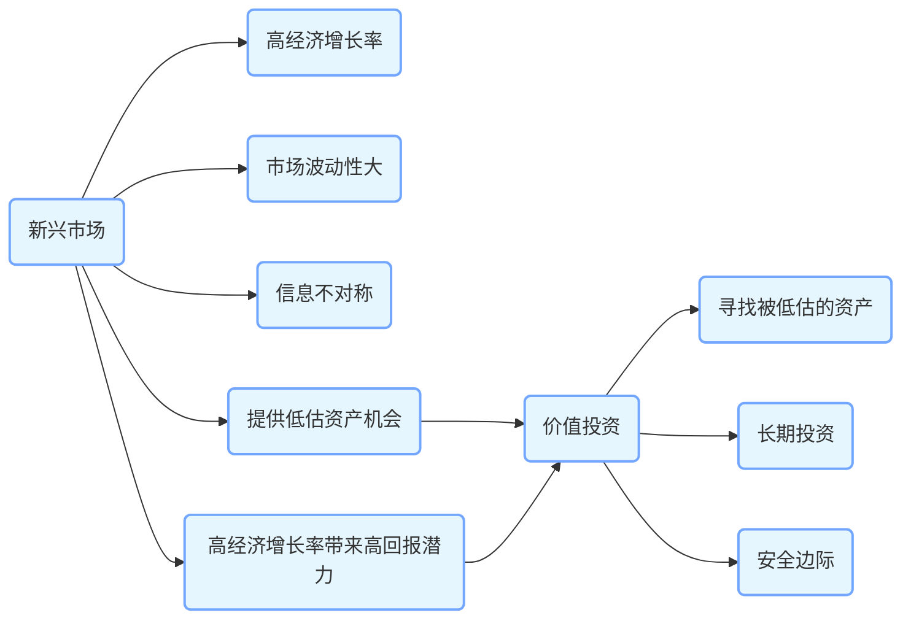

# 玛丽·巴芙特的新兴市场价值投资：高风险中的高回报

> 关键词：玛丽·巴芙特、新兴市场、价值投资、高风险、高回报、投资策略、市场分析

> 摘要：本文围绕玛丽·巴芙特的新兴市场价值投资理念展开，深入探讨在新兴市场这一高风险环境下如何实现高回报。首先介绍新兴市场价值投资的背景，包括目的、预期读者等内容；接着阐述核心概念与联系，明晰新兴市场和价值投资的原理及架构；详细讲解核心算法原理和具体操作步骤，并结合数学模型和公式进行举例说明；通过项目实战展示实际应用的代码案例及解读；分析新兴市场价值投资的实际应用场景；推荐相关的学习资源、开发工具框架以及论文著作；最后总结未来发展趋势与挑战，解答常见问题并提供扩展阅读和参考资料，帮助读者全面理解和应用玛丽·巴芙特的投资理念。

## 1. 背景介绍 
### 1.1 目的和范围
玛丽·巴芙特作为知名的投资专家，她所倡导的新兴市场价值投资策略在投资界引起了广泛关注。本文的目的在于深入剖析这一投资策略，揭示在新兴市场这种充满高风险的环境中，如何通过价值投资的方法实现高回报。我们将涵盖新兴市场的特点、价值投资的核心原则、具体的投资操作方法、相关的数学模型以及实际应用案例等方面，为投资者提供全面而深入的理解。

### 1.2 预期读者
本文主要面向对新兴市场投资感兴趣的投资者，包括个人投资者、专业投资机构的从业者以及金融领域的研究人员。对于那些希望了解新兴市场投资机会、学习价值投资理念以及探索高风险高回报投资策略的人士来说，本文将提供有价值的参考。

### 1.3 文档结构概述
本文将按照以下结构进行阐述：首先介绍背景信息，让读者了解文章的目的和适用对象；接着讲解核心概念与联系，明确新兴市场和价值投资的基本原理和相互关系；然后详细介绍核心算法原理和具体操作步骤，结合Python代码进行说明；随后给出数学模型和公式，并举例说明其应用；通过项目实战展示实际的代码案例和详细解释；分析新兴市场价值投资的实际应用场景；推荐相关的工具和资源；最后总结未来发展趋势与挑战，解答常见问题并提供扩展阅读和参考资料。

### 1.4 术语表
#### 1.4.1 核心术语定义
- **新兴市场**：指的是发展中国家或地区的金融市场，这些市场通常具有较高的经济增长率，但同时也伴随着政治、经济、法律等方面的不确定性和风险。
- **价值投资**：一种投资策略，基于对资产内在价值的评估，寻找被市场低估的资产进行投资，期望在资产价格回归其内在价值时获得收益。
- **高风险高回报**：在投资领域中，通常意味着承担较高的风险可能会带来较高的回报，但同时也可能导致较大的损失。

#### 1.4.2 相关概念解释
- **市场效率**：反映市场上信息的传递速度和资产价格对信息的反映程度。新兴市场的市场效率相对较低，这为价值投资者提供了发现被低估资产的机会。
- **内在价值**：资产的真实价值，由其未来现金流的现值决定。价值投资者通过分析公司的财务状况、行业前景等因素来评估资产的内在价值。

#### 1.4.3 缩略词列表
- **PE**：市盈率（Price - Earnings Ratio），衡量股票价格相对于每股收益的指标。
- **PB**：市净率（Price - to - Book Ratio），衡量股票价格相对于每股净资产的指标。

## 2. 核心概念与联系 

### 新兴市场的特点
新兴市场通常具有以下特点：
- **高经济增长率**：新兴市场国家或地区的经济往往处于快速发展阶段，具有较高的GDP增长率，这为企业的发展提供了良好的宏观环境。
- **市场波动性大**：由于政治、经济、法律等方面的不确定性，新兴市场的金融市场价格波动较为剧烈，投资者面临较高的市场风险。
- **信息不对称**：新兴市场的信息披露制度可能不够完善，投资者获取信息的难度较大，容易导致市场价格与资产内在价值的偏离。

### 价值投资的核心原则
价值投资的核心原则包括：
- **寻找被低估的资产**：通过对公司的财务报表、行业竞争地位等进行分析，寻找那些市场价格低于其内在价值的资产。
- **长期投资**：价值投资强调长期持有被低估的资产，等待资产价格回归其内在价值，从而获得长期的投资回报。
- **安全边际**：在投资时，要为资产价格的下跌留出一定的空间，即确保买入价格与资产内在价值之间存在足够的差距，以降低投资风险。

### 新兴市场与价值投资的联系
新兴市场的特点为价值投资提供了广阔的空间。由于市场波动性大、信息不对称，新兴市场中更容易出现被低估的资产。价值投资者可以利用这些机会，通过深入的研究和分析，挖掘出具有潜力的投资标的。同时，新兴市场的高经济增长率也为价值投资带来了更高的回报潜力。

### 文本示意图
```plaintext
新兴市场
|-- 高经济增长率
|-- 市场波动性大
|-- 信息不对称

价值投资
|-- 寻找被低估的资产
|-- 长期投资
|-- 安全边际

新兴市场与价值投资的联系
|-- 新兴市场提供低估资产机会
|-- 高经济增长率带来高回报潜力
```

### Mermaid 流程图


## 3. 核心算法原理 & 具体操作步骤 

### 核心算法原理
在新兴市场进行价值投资，核心是评估资产的内在价值，并与市场价格进行比较。常用的评估方法包括现金流折现法（DCF）和相对估值法。

#### 现金流折现法（DCF）
现金流折现法的基本原理是将资产未来的现金流折现到当前时刻，得到资产的内在价值。其计算公式为：
$$V = \sum_{t = 1}^{n} \frac{CF_t}{(1 + r)^t}$$
其中，$V$ 表示资产的内在价值，$CF_t$ 表示第 $t$ 期的现金流，$r$ 表示折现率，$n$ 表示预测的期数。

#### 相对估值法
相对估值法是通过与同行业的其他公司进行比较，来评估目标公司的价值。常用的指标包括市盈率（PE）和市净率（PB）。

### 具体操作步骤
#### 步骤1：筛选投资标的
在新兴市场中，首先需要筛选出具有投资潜力的公司。可以从行业前景、公司财务状况、管理层能力等方面进行评估。

#### 步骤2：评估内在价值
对于筛选出的投资标的，使用现金流折现法或相对估值法评估其内在价值。

#### 步骤3：比较内在价值与市场价格
将评估得到的内在价值与市场价格进行比较，如果市场价格低于内在价值，则认为该资产被低估，可以考虑买入。

#### 步骤4：确定投资组合
根据投资者的风险承受能力和投资目标，确定投资组合中各资产的权重。

#### 步骤5：长期持有与监控
买入被低估的资产后，长期持有，并定期监控公司的经营状况和市场价格的变化，根据情况进行调整。

### Python 源代码实现
```python
import numpy as np

# 现金流折现法计算内在价值
def dcf_valuation(cash_flows, discount_rate):
    n = len(cash_flows)
    present_values = []
    for t in range(n):
        present_value = cash_flows[t] / ((1 + discount_rate) ** (t + 1))
        present_values.append(present_value)
    return sum(present_values)

# 示例数据
cash_flows = [100, 120, 150, 180, 200]
discount_rate = 0.1

# 计算内在价值
intrinsic_value = dcf_valuation(cash_flows, discount_rate)
print(f"资产的内在价值为: {intrinsic_value}")
```

## 4. 数学模型和公式 & 详细讲解 & 举例说明 

### 现金流折现法（DCF）
#### 详细讲解
现金流折现法的核心思想是货币的时间价值，即未来的一笔钱在当前时刻的价值低于其面值。通过将未来的现金流按照一定的折现率折现到当前时刻，可以得到资产的内在价值。折现率反映了投资者对资金时间价值和风险的要求。

#### 举例说明
假设一家公司未来 5 年的预计现金流分别为 $100$ 万元、$120$ 万元、$150$ 万元、$180$ 万元和 $200$ 万元，投资者要求的折现率为 $10\%$。则该公司的内在价值计算如下：

第 1 年现金流的现值：$PV_1 = \frac{100}{(1 + 0.1)^1} = 90.91$（万元）
第 2 年现金流的现值：$PV_2 = \frac{120}{(1 + 0.1)^2} = 99.17$（万元）
第 3 年现金流的现值：$PV_3 = \frac{150}{(1 + 0.1)^3} = 112.70$（万元）
第 4 年现金流的现值：$PV_4 = \frac{180}{(1 + 0.1)^4} = 122.94$（万元）
第 5 年现金流的现值：$PV_5 = \frac{200}{(1 + 0.1)^5} = 124.18$（万元）

公司的内在价值：$V = PV_1 + PV_2 + PV_3 + PV_4 + PV_5 = 90.91 + 99.17 + 112.70 + 122.94 + 124.18 = 549.90$（万元）

### 相对估值法
#### 市盈率（PE）
市盈率的计算公式为：
$$PE = \frac{P}{EPS}$$
其中，$P$ 表示股票价格，$EPS$ 表示每股收益。

#### 详细讲解
市盈率反映了投资者为获取公司每股收益所愿意支付的价格。一般来说，市盈率较低的股票可能被低估，但需要结合行业平均水平和公司的未来发展前景进行综合判断。

#### 举例说明
假设某公司的股票价格为 $20$ 元，每股收益为 $2$ 元，则该公司的市盈率为：
$PE = \frac{20}{2} = 10$

如果同行业的平均市盈率为 $15$，则该公司的股票可能被低估。

#### 市净率（PB）
市净率的计算公式为：
$$PB = \frac{P}{BVPS}$$
其中，$P$ 表示股票价格，$BVPS$ 表示每股净资产。

#### 详细讲解
市净率反映了股票价格相对于每股净资产的倍数。市净率较低的股票可能具有较高的投资价值，但同样需要结合行业特点和公司的经营状况进行分析。

#### 举例说明
假设某公司的股票价格为 $15$ 元，每股净资产为 $10$ 元，则该公司的市净率为：
$PB = \frac{15}{10} = 1.5$

如果同行业的平均市净率为 $2$，则该公司的股票可能被低估。

## 5. 项目实战：代码实际案例和详细解释说明 

### 5.1  开发环境搭建
#### 操作系统
可以选择 Windows、Linux 或 macOS 操作系统。

#### Python 环境
安装 Python 3.x 版本，并使用 pip 安装所需的库，如 pandas、numpy、matplotlib 等。

```bash
pip install pandas numpy matplotlib
```

### 5.2  源代码详细实现和代码解读
以下是一个简单的新兴市场价值投资模拟项目的代码示例：

```python
import pandas as pd
import numpy as np
import matplotlib.pyplot as plt

# 模拟新兴市场股票数据
np.random.seed(0)
n_stocks = 10
n_periods = 20
stock_prices = pd.DataFrame(np.random.randn(n_periods, n_stocks).cumsum(axis=0) + 100,
                            columns=[f'Stock_{i}' for i in range(n_stocks)])

# 模拟公司财务数据（每股收益和每股净资产）
eps = pd.DataFrame(np.random.randn(n_periods, n_stocks) + 5,
                   columns=[f'Stock_{i}' for i in range(n_stocks)])
bvps = pd.DataFrame(np.random.randn(n_periods, n_stocks) + 20,
                    columns=[f'Stock_{i}' for i in range(n_stocks)])

# 计算市盈率和市净率
pe_ratio = stock_prices / eps
pb_ratio = stock_prices / bvps

# 筛选被低估的股票
low_pe_stocks = pe_ratio.iloc[-1] < pe_ratio.iloc[-1].mean()
low_pb_stocks = pb_ratio.iloc[-1] < pb_ratio.iloc[-1].mean()
undervalued_stocks = low_pe_stocks & low_pb_stocks

# 构建投资组合
portfolio = stock_prices[undervalued_stocks.index[undervalued_stocks]]

# 计算投资组合的收益率
portfolio_returns = portfolio.pct_change().dropna()
cumulative_returns = (1 + portfolio_returns).cumprod()

# 绘制投资组合的累计收益率曲线
plt.figure(figsize=(10, 6))
plt.plot(cumulative_returns)
plt.title('Cumulative Returns of Undervalued Stocks Portfolio')
plt.xlabel('Period')
plt.ylabel('Cumulative Returns')
plt.legend(portfolio.columns)
plt.show()
```

### 5.3  代码解读与分析
#### 数据模拟
首先，使用 `numpy` 库生成模拟的新兴市场股票价格数据、每股收益数据和每股净资产数据。这些数据用于后续的估值计算。

#### 估值计算
通过股票价格除以每股收益和每股净资产，分别计算出市盈率和市净率。

#### 筛选被低估的股票
根据市盈率和市净率的平均值，筛选出市盈率和市净率均低于平均值的股票，认为这些股票被低估。

#### 构建投资组合
将筛选出的被低估的股票组成投资组合。

#### 计算收益率
计算投资组合的收益率，并绘制累计收益率曲线，以直观展示投资组合的表现。

## 6. 实际应用场景 
### 个人投资者
对于个人投资者来说，新兴市场价值投资提供了一种在高风险环境中获取高回报的机会。个人投资者可以通过学习价值投资的方法，筛选出被低估的新兴市场股票进行投资。同时，由于新兴市场的信息不对称，个人投资者需要花费更多的时间和精力进行研究和分析。

### 专业投资机构
专业投资机构可以利用新兴市场价值投资策略，为客户构建多元化的投资组合。通过深入的研究和分析，投资机构可以挖掘出具有潜力的新兴市场投资标的，为客户实现资产的增值。

### 跨国公司
跨国公司在新兴市场开展业务时，可以运用价值投资的理念，对当地的企业进行投资和并购。通过评估目标企业的内在价值，跨国公司可以以合理的价格获取优质的资产，实现战略扩张。

## 7. 工具和资源推荐
### 7.1 学习资源推荐
#### 7.1.1 书籍推荐
- 《聪明的投资者》（The Intelligent Investor）：本杰明·格雷厄姆（Benjamin Graham）的经典著作，阐述了价值投资的基本原理和方法。
- 《怎样选择成长股》（Common Stocks and Uncommon Profits）：菲利普·费雪（Philip Fisher）的著作，介绍了如何寻找具有成长潜力的股票。
- 《玛丽·巴芙特的新兴市场投资策略》：玛丽·巴芙特本人的著作，详细介绍了她在新兴市场的投资经验和策略。

#### 7.1.2 在线课程
- Coursera 上的“投资学原理”课程，提供了系统的投资知识和理论。
- edX 上的“价值投资基础”课程，深入讲解了价值投资的核心概念和方法。

#### 7.1.3 技术博客和网站
- Seeking Alpha：提供全球金融市场的分析和评论，包括新兴市场的投资机会。
- ValueWalk：专注于价值投资领域，分享价值投资者的观点和研究成果。

### 7.2 开发工具框架推荐
#### 7.2.1 IDE和编辑器
- PyCharm：功能强大的 Python 集成开发环境，适合进行数据分析和投资模拟。
- Jupyter Notebook：交互式的开发环境，方便进行代码演示和数据分析。

#### 7.2.2 调试和性能分析工具
- PDB：Python 自带的调试工具，用于调试 Python 代码。
- cProfile：Python 标准库中的性能分析工具，用于分析代码的运行时间和性能瓶颈。

#### 7.2.3 相关框架和库
- Pandas：用于数据处理和分析的 Python 库，提供了强大的数据结构和数据分析功能。
- Numpy：用于科学计算的 Python 库，提供了高效的数组操作和数学函数。
- Matplotlib：用于数据可视化的 Python 库，可绘制各种类型的图表。

### 7.3 相关论文著作推荐
#### 7.3.1 经典论文
- Eugene F. Fama 和 Kenneth R. French 的“Common Risk Factors in the Returns on Stocks and Bonds”，提出了著名的三因子模型，对资产定价理论产生了深远影响。
- Benjamin Graham 和 David Dodd 的“Security Analysis”，奠定了价值投资的理论基础。

#### 7.3.2 最新研究成果
- 关注金融领域的顶级学术期刊，如《Journal of Finance》《Review of Financial Studies》等，获取新兴市场投资的最新研究成果。

#### 7.3.3 应用案例分析
- 一些知名投资机构的研究报告和案例分析，如高盛、摩根士丹利等，提供了新兴市场投资的实际应用案例和经验分享。

## 8. 总结：未来发展趋势与挑战
### 未来发展趋势
- **新兴市场的重要性日益提升**：随着全球经济格局的变化，新兴市场在全球经济中的地位不断提高，将吸引更多的投资者关注。
- **科技与金融的融合**：科技的发展将为新兴市场价值投资带来更多的机遇，如大数据分析、人工智能等技术的应用，将提高投资决策的效率和准确性。
- **可持续投资的兴起**：投资者越来越关注企业的社会责任和可持续发展，新兴市场的可持续投资将成为未来的发展方向。

### 挑战
- **政治和经济风险**：新兴市场的政治和经济环境相对不稳定，投资者需要面对政策变化、汇率波动、通货膨胀等风险。
- **信息不对称**：新兴市场的信息披露制度不够完善，投资者获取信息的难度较大，容易导致投资决策的失误。
- **市场竞争加剧**：随着越来越多的投资者关注新兴市场，市场竞争将日益激烈，寻找被低估的投资标的将变得更加困难。

## 9. 附录：常见问题与解答
### 问题1：新兴市场价值投资适合所有投资者吗？
解答：新兴市场价值投资具有较高的风险，不适合所有投资者。投资者需要根据自己的风险承受能力、投资目标和投资经验来决定是否适合进行新兴市场价值投资。

### 问题2：如何评估新兴市场的政治和经济风险？
解答：可以通过关注新兴市场国家的政治局势、宏观经济数据、政策变化等方面来评估政治和经济风险。同时，也可以参考国际评级机构的评级报告和专业机构的研究分析。

### 问题3：价值投资在新兴市场的有效性如何？
解答：虽然新兴市场具有较高的波动性和不确定性，但价值投资的基本原理在新兴市场仍然有效。通过深入的研究和分析，投资者可以在新兴市场中找到被低估的投资标的，实现长期的投资回报。

## 10. 扩展阅读 & 参考资料
### 扩展阅读
- 关注金融媒体和财经杂志，如《金融时报》《财经》等，获取新兴市场投资的最新动态和分析。
- 参加投资论坛和研讨会，与其他投资者和专家交流经验和观点。

### 参考资料
- 玛丽·巴芙特的相关著作和演讲。
- 金融领域的学术期刊和研究报告。
- 各大金融机构的投资研究报告和分析。