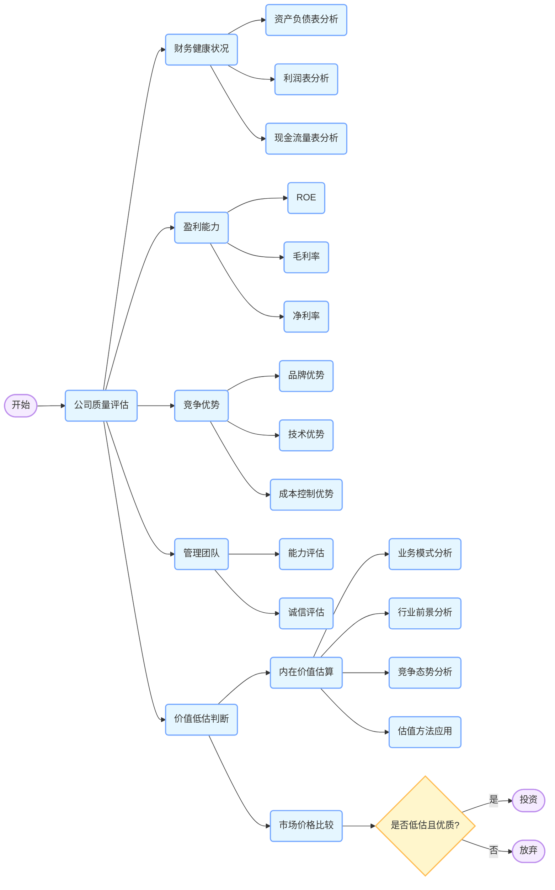

# 玛丽·巴芙特的质量价值投资：寻找优质且低估的公司

> 关键词：玛丽·巴芙特、质量价值投资、优质低估公司、投资策略、财务分析

> 摘要：本文深入探讨了玛丽·巴芙特所倡导的质量价值投资理念，旨在寻找市场中优质且被低估的公司。通过对背景的介绍，阐述了该投资理念的目的、适用读者群体、文档结构及相关术语。详细讲解了核心概念与联系，包括其原理和架构，并以 Mermaid 流程图展示。剖析了核心算法原理及具体操作步骤，运用 Python 代码进行说明。同时给出了数学模型和公式，并举例解释。结合项目实战，展示了代码实际案例及详细解读。还探讨了该投资理念的实际应用场景，推荐了相关的学习资源、开发工具框架和论文著作。最后总结了未来发展趋势与挑战，解答常见问题并提供扩展阅读和参考资料。

## 1. 背景介绍 
### 1.1 目的和范围
玛丽·巴芙特的质量价值投资策略具有重要的现实意义。其目的在于帮助投资者在复杂多变的金融市场中，精准地筛选出那些既具备优秀基本面，又被市场低估的公司进行投资。通过这种方式，投资者有望获得长期稳定且可观的投资回报。

该策略的范围涵盖了各类公开交易的公司，无论是大型蓝筹股，还是具有成长潜力的中小盘股，只要符合质量价值投资的标准，都在其考虑范围之内。它不仅仅局限于某一特定行业或板块，而是适用于广泛的市场环境。

### 1.2 预期读者
本文的预期读者主要包括以下几类人群：
- **个人投资者**：那些希望提升自己投资水平，掌握科学投资方法，在市场中实现资产增值的普通投资者。他们可能缺乏系统的投资知识和经验，通过学习玛丽·巴芙特的质量价值投资策略，能够更好地做出投资决策。
- **专业投资人士**：如基金经理、投资顾问等。他们需要不断更新自己的投资理念和方法，以适应市场的变化。玛丽·巴芙特的投资策略为他们提供了一种新的思路和视角，有助于优化投资组合，提高投资绩效。
- **金融研究人员**：对投资理论和市场现象进行深入研究的专业人员。他们可以通过分析该策略的原理和实践应用，为学术研究提供新的素材和方向，推动金融投资领域的理论发展。

### 1.3 文档结构概述
本文将按照以下结构展开：首先介绍玛丽·巴芙特质量价值投资的背景信息，包括目的、预期读者和文档结构概述等内容。接着阐述核心概念与联系，通过文本示意图和 Mermaid 流程图详细展示其原理和架构。然后深入讲解核心算法原理及具体操作步骤，并使用 Python 代码进行说明。之后给出相关的数学模型和公式，并结合实例进行详细讲解。在项目实战部分，展示代码实际案例并进行详细的解释说明。再探讨该投资策略的实际应用场景，推荐相关的工具和资源，包括学习资源、开发工具框架和论文著作等。最后总结未来发展趋势与挑战，解答常见问题并提供扩展阅读和参考资料。

### 1.4 术语表
#### 1.4.1 核心术语定义
- **质量价值投资**：这是玛丽·巴芙特提出的一种投资理念，强调在选择投资标的时，不仅要关注公司的内在价值，还要重视公司的质量。即寻找那些具有优秀的财务状况、稳定的盈利能力、良好的管理团队和可持续竞争优势的公司，并且这些公司的股价在市场上被低估。
- **优质公司**：指具备一系列优秀特征的公司，如高净资产收益率（ROE）、低债务水平、稳定的现金流、良好的行业地位和品牌形象等。这些特征表明公司具有较强的竞争力和盈利能力，能够在长期内为股东创造价值。
- **低估公司**：是指公司的市场价格低于其内在价值的公司。内在价值是通过对公司的财务报表、业务模式、行业前景等多方面因素进行综合分析后估算出来的。当市场价格低于内在价值时，意味着该公司的股票具有投资价值。

#### 1.4.2 相关概念解释
- **净资产收益率（ROE）**：是衡量公司盈利能力的重要指标，它反映了公司运用自有资本获取收益的能力。计算公式为：$ROE = \frac{净利润}{净资产} \times 100\%$。ROE 越高，说明公司的盈利能力越强。
- **自由现金流**：是指公司在满足了所有运营成本和资本支出后剩余的现金流量。自由现金流是公司真正可以自由支配的资金，它反映了公司的财务健康状况和可持续发展能力。
- **市盈率（PE）**：是指股票价格与每股收益的比率，计算公式为：$PE = \frac{股票价格}{每股收益}$。市盈率是衡量股票估值水平的常用指标，较低的市盈率通常意味着股票被低估。

#### 1.4.3 缩略词列表
- **ROE**：净资产收益率（Return on Equity）
- **PE**：市盈率（Price - Earnings Ratio）
- **FCF**：自由现金流（Free Cash Flow）

## 2. 核心概念与联系 

### 核心概念原理
玛丽·巴芙特的质量价值投资理念基于两个核心要素：公司质量和价值低估。

公司质量方面，主要关注公司的财务健康状况、盈利能力、竞争优势和管理团队等因素。财务健康状况可以通过分析公司的资产负债表、利润表和现金流量表来评估。例如，低债务水平、高流动资产和稳定的现金流是财务健康的重要标志。盈利能力可以通过净资产收益率（ROE）、毛利率、净利率等指标来衡量。具有较高 ROE 的公司通常意味着其能够高效地运用股东的资金创造利润。竞争优势则体现在公司的品牌、技术、成本控制等方面，拥有独特竞争优势的公司能够在市场中脱颖而出，保持长期的盈利能力。管理团队的能力和诚信也是影响公司质量的重要因素，优秀的管理团队能够制定合理的战略，有效地运营公司。

价值低估方面，是通过比较公司的市场价格和内在价值来判断。内在价值是公司未来现金流的折现值，需要对公司的业务模式、行业前景、竞争态势等进行深入分析，并运用适当的估值方法来估算。当市场价格低于内在价值时，说明公司的股票被低估，具有投资价值。

### 架构的文本示意图
```plaintext
玛丽·巴芙特的质量价值投资
|-- 公司质量评估
|   |-- 财务健康状况
|   |   |-- 资产负债表分析
|   |   |-- 利润表分析
|   |   |-- 现金流量表分析
|   |-- 盈利能力
|   |   |-- ROE
|   |   |-- 毛利率
|   |   |-- 净利率
|   |-- 竞争优势
|   |   |-- 品牌优势
|   |   |-- 技术优势
|   |   |-- 成本控制优势
|   |-- 管理团队
|       |-- 能力评估
|       |-- 诚信评估
|-- 价值低估判断
|   |-- 内在价值估算
|   |   |-- 业务模式分析
|   |   |-- 行业前景分析
|   |   |-- 竞争态势分析
|   |   |-- 估值方法应用
|   |-- 市场价格比较
```

### Mermaid 流程图


## 3. 核心算法原理 & 具体操作步骤 

### 核心算法原理
玛丽·巴芙特的质量价值投资核心算法主要围绕公司质量评估和价值低估判断两个方面。

在公司质量评估方面，我们可以使用多指标综合评估的方法。例如，为每个评估指标赋予一定的权重，然后计算加权平均值来得到公司的质量得分。假设我们选择净资产收益率（ROE）、资产负债率、自由现金流等指标，其权重分别为 $w_{ROE}$、$w_{debt}$、$w_{FCF}$，对应的指标值为 $ROE$、$debt$、$FCF$，则公司的质量得分 $Q$ 可以表示为：

$Q = w_{ROE} \times ROE + w_{debt} \times (1 - debt) + w_{FCF} \times FCF$

其中，$w_{ROE} + w_{debt} + w_{FCF} = 1$。

在价值低估判断方面，我们可以使用现金流折现模型（DCF）来估算公司的内在价值。现金流折现模型的基本原理是将公司未来的自由现金流折现到当前时刻，得到公司的内在价值。假设公司未来 $n$ 年的自由现金流分别为 $FCF_1, FCF_2, \cdots, FCF_n$，折现率为 $r$，则公司的内在价值 $V$ 可以表示为：

$V = \sum_{i = 1}^{n} \frac{FCF_i}{(1 + r)^i} + \frac{TV}{(1 + r)^n}$

其中，$TV$ 为公司的终值，可以使用永续增长模型来估算：

$TV = \frac{FCF_n \times (1 + g)}{r - g}$

这里，$g$ 为公司的永续增长率。

### 具体操作步骤
#### 步骤 1：数据收集
收集公司的财务报表数据，包括资产负债表、利润表和现金流量表。同时，收集行业数据、宏观经济数据等相关信息。可以通过金融数据提供商（如 Bloomberg、Wind 等）、公司官方网站、证券交易所网站等渠道获取数据。

#### 步骤 2：公司质量评估
- 计算各项评估指标的值，如 ROE、资产负债率、自由现金流等。
- 根据设定的权重，计算公司的质量得分。

#### 步骤 3：价值低估判断
- 使用现金流折现模型估算公司的内在价值。
- 比较公司的内在价值和市场价格，如果市场价格低于内在价值，则认为公司被低估。

#### 步骤 4：投资决策
根据公司的质量得分和价值低估情况，做出投资决策。如果公司既具有较高的质量得分，又被低估，则可以考虑投资；否则，放弃投资。

### Python 代码实现
```python
import numpy as np

# 步骤 2：公司质量评估
def quality_evaluation(roe, debt, fcf, weights):
    """
    计算公司的质量得分
    :param roe: 净资产收益率
    :param debt: 资产负债率
    :param fcf: 自由现金流
    :param weights: 指标权重列表，顺序为 [roe_weight, debt_weight, fcf_weight]
    :return: 公司的质量得分
    """
    roe_weight, debt_weight, fcf_weight = weights
    quality_score = roe_weight * roe + debt_weight * (1 - debt) + fcf_weight * fcf
    return quality_score

# 步骤 3：价值低估判断
def dcf_valuation(fcf_list, r, g):
    """
    使用现金流折现模型估算公司的内在价值
    :param fcf_list: 未来 n 年的自由现金流列表
    :param r: 折现率
    :param g: 永续增长率
    :return: 公司的内在价值
    """
    n = len(fcf_list)
    fcf_n = fcf_list[-1]
    tv = fcf_n * (1 + g) / (r - g)  # 计算终值
    present_values = []
    for i in range(n):
        present_value = fcf_list[i] / ((1 + r) ** (i + 1))
        present_values.append(present_value)
    present_values.append(tv / ((1 + r) ** n))
    intrinsic_value = sum(present_values)
    return intrinsic_value

# 示例数据
roe = 0.2
debt = 0.3
fcf = 100
weights = [0.4, 0.3, 0.3]
fcf_list = [100, 110, 120, 130, 140]
r = 0.1
g = 0.05
market_price = 1000

# 计算质量得分
quality_score = quality_evaluation(roe, debt, fcf, weights)
print(f"公司的质量得分: {quality_score}")

# 计算内在价值
intrinsic_value = dcf_valuation(fcf_list, r, g)
print(f"公司的内在价值: {intrinsic_value}")

# 投资决策
if quality_score > 0.5 and intrinsic_value > market_price:
    print("可以考虑投资该公司")
else:
    print("放弃投资该公司")
```

## 4. 数学模型和公式 & 详细讲解 & 举例说明 

### 公司质量评估模型
我们在前面已经介绍了公司质量评估的数学模型：

$Q = w_{ROE} \times ROE + w_{debt} \times (1 - debt) + w_{FCF} \times FCF$

其中，$Q$ 表示公司的质量得分，$w_{ROE}$、$w_{debt}$、$w_{FCF}$ 分别为净资产收益率（ROE）、资产负债率、自由现金流的权重，$ROE$、$debt$、$FCF$ 分别为对应的指标值。

详细讲解：该模型通过对多个反映公司质量的指标进行加权求和，得到一个综合的质量得分。权重的设定可以根据投资者的偏好和经验进行调整。例如，如果投资者更看重公司的盈利能力，那么可以适当提高 $w_{ROE}$ 的权重；如果更关注公司的财务风险，那么可以提高 $w_{debt}$ 的权重。

举例说明：假设某公司的 ROE 为 0.2，资产负债率为 0.3，自由现金流为 100，权重分别为 $w_{ROE} = 0.4$，$w_{debt} = 0.3$，$w_{FCF} = 0.3$。则该公司的质量得分 $Q$ 为：

$Q = 0.4 \times 0.2 + 0.3 \times (1 - 0.3) + 0.3 \times 100$
$= 0.08 + 0.21 + 30$
$= 30.29$

### 现金流折现模型（DCF）
现金流折现模型的基本公式为：

$V = \sum_{i = 1}^{n} \frac{FCF_i}{(1 + r)^i} + \frac{TV}{(1 + r)^n}$

其中，$V$ 表示公司的内在价值，$FCF_i$ 表示第 $i$ 年的自由现金流，$r$ 表示折现率，$n$ 表示预测期数，$TV$ 表示公司的终值。

终值 $TV$ 的计算公式为：

$TV = \frac{FCF_n \times (1 + g)}{r - g}$

详细讲解：现金流折现模型的核心思想是将公司未来的自由现金流折现到当前时刻，得到公司的内在价值。预测期数 $n$ 通常根据公司的业务特点和行业发展情况来确定，一般为 5 - 10 年。折现率 $r$ 反映了投资者对资金时间价值和投资风险的要求，通常可以使用资本资产定价模型（CAPM）来估算。永续增长率 $g$ 表示公司在预测期结束后长期的增长率，一般取值在 2% - 5% 之间。

举例说明：假设某公司未来 5 年的自由现金流分别为 100、110、120、130、140，折现率 $r = 0.1$，永续增长率 $g = 0.05$。

首先计算终值 $TV$：

$FCF_5 = 140$
$TV = \frac{140 \times (1 + 0.05)}{0.1 - 0.05}$
$= \frac{147}{0.05}$
$= 2940$

然后计算各年自由现金流的现值和终值的现值：

第 1 年：$\frac{100}{(1 + 0.1)^1} = 90.91$
第 2 年：$\frac{110}{(1 + 0.1)^2} = 90.91$
第 3 年：$\frac{120}{(1 + 0.1)^3} = 90.16$
第 4 年：$\frac{130}{(1 + 0.1)^4} = 88.79$
第 5 年：$\frac{140}{(1 + 0.1)^5} = 86.93$
终值：$\frac{2940}{(1 + 0.1)^5} = 1827.64$

最后计算公司的内在价值 $V$：

$V = 90.91 + 90.91 + 90.16 + 88.79 + 86.93 + 1827.64$
$= 2275.34$

## 5. 项目实战：代码实际案例和详细解释说明 

### 5.1  开发环境搭建
#### 操作系统
可以选择 Windows、Linux 或 macOS 操作系统。建议使用较新的版本，以确保系统的稳定性和兼容性。

#### Python 环境
安装 Python 3.x 版本，推荐使用 Python 3.7 及以上版本。可以从 Python 官方网站（https://www.python.org/downloads/）下载并安装。

#### 开发工具
推荐使用 PyCharm 或 Jupyter Notebook 作为开发工具。PyCharm 是一款功能强大的 Python 集成开发环境（IDE），提供了代码编辑、调试、版本控制等丰富的功能。Jupyter Notebook 则是一个交互式的开发环境，适合进行数据探索和模型验证。

#### 安装必要的库
在命令行中使用以下命令安装必要的 Python 库：
```sh
pip install numpy pandas matplotlib
```

### 5.2  源代码详细实现和代码解读
```python
import numpy as np
import pandas as pd
import matplotlib.pyplot as plt

# 步骤 1：数据收集
# 假设我们已经收集到了一些公司的财务数据，并保存为 CSV 文件
data = pd.read_csv('company_financial_data.csv')

# 步骤 2：公司质量评估
def quality_evaluation(data, weights):
    """
    计算公司的质量得分
    :param data: 包含 ROE、资产负债率、自由现金流的 DataFrame
    :param weights: 指标权重列表，顺序为 [roe_weight, debt_weight, fcf_weight]
    :return: 包含公司质量得分的 DataFrame
    """
    roe_weight, debt_weight, fcf_weight = weights
    data['quality_score'] = roe_weight * data['ROE'] + debt_weight * (1 - data['DebtRatio']) + fcf_weight * data['FCF']
    return data

# 步骤 3：价值低估判断
def dcf_valuation(data, r, g):
    """
    使用现金流折现模型估算公司的内在价值
    :param data: 包含未来 n 年自由现金流的 DataFrame
    :param r: 折现率
    :param g: 永续增长率
    :return: 包含公司内在价值的 DataFrame
    """
    n = len(data.columns) - 1  # 减去公司名称列
    fcf_columns = data.columns[1:]
    data['TV'] = data[fcf_columns[-1]] * (1 + g) / (r - g)  # 计算终值
    present_values = []
    for i in range(n):
        present_value = data[fcf_columns[i]] / ((1 + r) ** (i + 1))
        present_values.append(present_value)
    present_values.append(data['TV'] / ((1 + r) ** n))
    data['intrinsic_value'] = sum(present_values)
    return data

# 步骤 4：投资决策
def investment_decision(data, market_prices):
    """
    根据公司的质量得分和内在价值进行投资决策
    :param data: 包含公司质量得分和内在价值的 DataFrame
    :param market_prices: 公司的市场价格列表
    :return: 包含投资决策结果的 DataFrame
    """
    data['market_price'] = market_prices
    data['decision'] = np.where((data['quality_score'] > 0.5) & (data['intrinsic_value'] > data['market_price']), 'Invest', 'Pass')
    return data

# 示例数据
weights = [0.4, 0.3, 0.3]
r = 0.1
g = 0.05
market_prices = [1000, 1200, 800, 1500]

# 计算质量得分
data = quality_evaluation(data, weights)

# 计算内在价值
data = dcf_valuation(data, r, g)

# 进行投资决策
data = investment_decision(data, market_prices)

# 输出结果
print(data)

# 可视化结果
plt.figure(figsize=(10, 6))
plt.bar(data['CompanyName'], data['intrinsic_value'], label='Intrinsic Value')
plt.bar(data['CompanyName'], data['market_price'], label='Market Price')
plt.xlabel('Company')
plt.ylabel('Value')
plt.title('Intrinsic Value vs Market Price')
plt.legend()
plt.show()
```

### 5.3  代码解读与分析
#### 数据收集
使用 `pandas` 库的 `read_csv` 函数从 CSV 文件中读取公司的财务数据。假设 CSV 文件包含公司名称、ROE、资产负债率、自由现金流等信息。

#### 公司质量评估
定义了 `quality_evaluation` 函数，该函数接受包含财务数据的 `DataFrame` 和指标权重列表作为输入，计算公司的质量得分，并将其添加到 `DataFrame` 中。

#### 价值低估判断
定义了 `dcf_valuation` 函数，该函数接受包含未来自由现金流的 `DataFrame`、折现率和永续增长率作为输入，使用现金流折现模型估算公司的内在价值，并将其添加到 `DataFrame` 中。

#### 投资决策
定义了 `investment_decision` 函数，该函数接受包含质量得分和内在价值的 `DataFrame` 以及公司的市场价格列表作为输入，根据质量得分和内在价值进行投资决策，并将决策结果添加到 `DataFrame` 中。

#### 可视化结果
使用 `matplotlib` 库绘制柱状图，比较公司的内在价值和市场价格，直观地展示投资决策的依据。

## 6. 实际应用场景 
### 个人投资
对于个人投资者来说，玛丽·巴芙特的质量价值投资策略可以帮助他们在众多的股票中筛选出具有投资价值的公司。个人投资者通常资金规模较小，风险承受能力相对较低，通过运用该策略，他们可以选择那些基本面良好、被市场低估的公司进行长期投资，从而降低投资风险，获得稳定的收益。例如，一位普通上班族可以使用该策略分析一些消费类、医药类等防御性行业的公司，选择其中优质且低估的公司进行投资，作为自己的长期资产配置。

### 机构投资
机构投资者如基金公司、保险公司等，管理着大量的资金，需要进行大规模的资产配置。玛丽·巴芙特的投资策略可以为他们提供一种科学的投资方法，帮助他们构建合理的投资组合。基金经理可以运用该策略对不同行业、不同规模的公司进行筛选，选择符合投资标准的公司纳入基金组合，以提高基金的绩效。保险公司可以将该策略应用于其投资业务，选择优质且低估的公司进行长期投资，以实现资产的保值增值。

### 企业并购
在企业并购领域，该投资策略也具有重要的应用价值。收购方在选择目标公司时，可以运用质量价值投资的方法评估目标公司的质量和价值。通过分析目标公司的财务状况、盈利能力、竞争优势等因素，判断其是否具有投资价值。如果目标公司被低估且具有较高的质量，收购方可以通过并购实现资源整合和协同效应，提升自身的竞争力和盈利能力。

### 风险投资
风险投资机构在寻找投资项目时，也可以借鉴玛丽·巴芙特的质量价值投资理念。虽然风险投资主要关注具有高成长潜力的初创企业，但也需要评估企业的质量和价值。通过分析初创企业的商业模式、团队能力、市场前景等因素，判断其是否具有成为优质企业的潜力。对于那些具有较高质量且被市场低估的初创企业，风险投资机构可以进行投资，以期获得高额的回报。

## 7. 工具和资源推荐
### 7.1 学习资源推荐
#### 7.1.1 书籍推荐
- 《价值投资：从格雷厄姆到巴菲特》：这本书系统地介绍了价值投资的理论和方法，从格雷厄姆的安全边际理论到巴菲特的价值投资实践，对玛丽·巴芙特的质量价值投资理念有很好的理论支持和案例参考。
- 《聪明的投资者》：本杰明·格雷厄姆的经典著作，被誉为投资界的圣经。书中强调了价值投资的重要性，以及如何通过分析财务报表和市场情况来选择投资标的，对于理解质量价值投资的核心概念非常有帮助。
- 《巴菲特致股东的信：股份公司教程》：通过阅读巴菲特写给股东的信，可以深入了解巴菲特的投资哲学和方法，其中很多理念与玛丽·巴芙特的质量价值投资相契合，对投资者有很大的启发。

#### 7.1.2 在线课程
- Coursera 上的“投资学原理”课程：该课程由知名大学的教授授课，涵盖了投资学的基本原理、投资组合理论、估值方法等内容，对于学习质量价值投资的理论基础非常有帮助。
- Udemy 上的“价值投资实战课程”：课程结合实际案例，详细讲解了价值投资的分析方法和操作步骤，包括财务报表分析、估值模型应用等，适合想要将理论应用到实践中的投资者。

#### 7.1.3 技术博客和网站
- 雪球网：国内知名的投资社区，汇聚了众多投资者和投资专家。在雪球网上可以看到各种投资分析文章和讨论，了解不同投资者对公司的看法和分析思路，对于学习质量价值投资有很大的帮助。
- Seeking Alpha：国外的投资研究网站，提供了大量的公司分析报告和投资策略文章。网站上的文章由专业的分析师和投资者撰写，质量较高，可以帮助投资者了解国际市场的投资动态和分析方法。

### 7.2 开发工具框架推荐
#### 7.2.1 IDE和编辑器
- PyCharm：功能强大的 Python 集成开发环境，提供了代码编辑、调试、版本控制等丰富的功能，适合开发复杂的投资分析程序。
- Jupyter Notebook：交互式的开发环境，适合进行数据探索和模型验证。可以方便地展示代码和分析结果，与团队成员或其他投资者进行分享和交流。

#### 7.2.2 调试和性能分析工具
- PDB：Python 自带的调试工具，可以帮助开发者在代码中设置断点，逐步执行代码，查看变量的值，从而找出代码中的问题。
- cProfile：Python 的性能分析工具，可以分析代码的运行时间和函数调用次数，帮助开发者找出代码中的性能瓶颈，进行优化。

#### 7.2.3 相关框架和库
- Pandas：强大的数据处理和分析库，提供了丰富的数据结构和数据操作方法，适合处理和分析财务数据。
- Numpy：用于科学计算的基础库，提供了高效的数组操作和数学函数，在投资分析中可以用于计算各种指标和模型。
- Matplotlib：用于数据可视化的库，可以绘制各种类型的图表，如柱状图、折线图、散点图等，帮助投资者直观地展示分析结果。

### 7.3 相关论文著作推荐
#### 7.3.1 经典论文
- 《证券分析》（Security Analysis）：本杰明·格雷厄姆和戴维·多德的经典著作，奠定了价值投资的理论基础。论文中提出了安全边际、内在价值等重要概念，对质量价值投资的发展产生了深远的影响。
- 《有效市场假说》（Efficient Market Hypothesis）：由尤金·法玛提出，该理论探讨了市场的有效性和信息的传播方式。虽然质量价值投资与有效市场假说存在一定的争议，但了解该理论可以帮助投资者更好地理解市场的运行机制。

#### 7.3.2 最新研究成果
- 《基于财务指标的公司质量评估模型研究》：该研究提出了一种基于多财务指标的公司质量评估模型，通过对大量公司的财务数据进行分析和验证，证明了该模型的有效性。对于质量价值投资中的公司质量评估具有重要的参考价值。
- 《现金流折现模型的改进与应用研究》：论文对传统的现金流折现模型进行了改进，考虑了更多的因素和不确定性，提高了模型的准确性和实用性。对于价值低估判断中的内在价值估算有一定的借鉴意义。

#### 7.3.3 应用案例分析
- 《某基金公司运用质量价值投资策略的案例分析》：详细介绍了某基金公司如何运用玛丽·巴芙特的质量价值投资策略进行投资组合管理，包括投资标的的筛选、投资决策的过程和投资绩效的评估等。通过该案例分析，投资者可以了解该策略在实际应用中的具体操作和效果。

## 8. 总结：未来发展趋势与挑战
### 未来发展趋势
#### 与科技的融合
随着科技的不断发展，玛丽·巴芙特的质量价值投资策略将与科技更加紧密地融合。例如，利用大数据和人工智能技术，可以更高效地收集和分析公司的财务数据、行业数据和市场数据，提高投资分析的准确性和效率。通过机器学习算法，可以对大量的历史数据进行学习和分析，挖掘出潜在的投资机会和风险因素，为投资决策提供更科学的依据。

#### 多元化投资
未来，质量价值投资将不仅仅局限于股票市场，还将向多元化投资领域拓展。投资者可以将该策略应用于债券、基金、房地产等不同的投资领域，构建更加多元化的投资组合，降低投资风险，提高投资回报。例如，在房地产投资中，可以运用质量价值投资的方法评估房地产项目的质量和价值，选择具有投资潜力的项目进行投资。

#### 全球投资
随着全球经济一体化的发展，投资者将更加关注全球市场的投资机会。玛丽·巴芙特的质量价值投资策略可以帮助投资者在全球范围内筛选优质且低估的公司进行投资。通过对不同国家和地区的公司进行分析和比较，投资者可以发现那些被市场忽视的投资机会，实现资产的全球配置。

### 挑战
#### 数据质量和可靠性
在运用质量价值投资策略时，需要大量的财务数据和市场数据作为支撑。然而，数据的质量和可靠性可能存在问题。例如，公司的财务报表可能存在造假行为，市场数据可能存在误差或滞后性。这些问题会影响投资分析的准确性和可靠性，给投资者带来风险。因此，投资者需要加强对数据的审核和验证，提高数据的质量和可靠性。

#### 市场变化和不确定性
市场是不断变化的，受到宏观经济、政策法规、行业竞争等多种因素的影响。这些变化和不确定性会导致公司的基本面和市场价格发生波动，增加投资分析的难度。例如，宏观经济衰退可能会导致公司的盈利能力下降，行业竞争加剧可能会影响公司的市场份额和竞争优势。投资者需要及时关注市场变化，调整投资策略，以应对不确定性带来的风险。

#### 投资者情绪和心理因素
投资者的情绪和心理因素也会对投资决策产生影响。在市场波动较大时，投资者可能会出现恐慌或贪婪的情绪，做出不理性的投资决策。例如，在市场下跌时，投资者可能会恐慌性抛售股票，错过投资机会；在市场上涨时，投资者可能会贪婪地追高买入，增加投资风险。因此，投资者需要保持冷静和理性，克服情绪和心理因素的影响，做出明智的投资决策。

## 9. 附录：常见问题与解答
### 问题 1：如何确定指标的权重？
指标的权重可以根据投资者的偏好和经验进行调整。如果投资者更看重公司的盈利能力，可以适当提高净资产收益率（ROE）的权重；如果更关注公司的财务风险，可以提高资产负债率的权重。此外，也可以通过历史数据的回测和优化来确定最优的权重组合。

### 问题 2：现金流折现模型中的折现率和永续增长率如何确定？
折现率可以使用资本资产定价模型（CAPM）来估算，公式为：$r = R_f + \beta \times (R_m - R_f)$，其中 $R_f$ 为无风险利率，$\beta$ 为股票的贝塔系数，$R_m$ 为市场收益率。永续增长率一般取值在 2% - 5% 之间，可以根据公司的行业特点和发展前景进行调整。

### 问题 3：如何判断公司的财务报表是否造假？
可以通过分析财务报表的各项指标之间的逻辑关系、与同行业公司进行比较、关注异常的财务数据等方法来判断公司的财务报表是否造假。例如，如果公司的净利润增长与营业收入增长不匹配，或者资产负债率突然大幅上升，都可能是财务报表造假的信号。此外，还可以关注公司的审计报告和监管机构的处罚信息。

### 问题 4：质量价值投资策略是否适用于所有市场环境？
质量价值投资策略在不同的市场环境中表现可能会有所不同。在市场低迷时，该策略可以帮助投资者寻找被低估的公司，获得较好的投资回报；在市场繁荣时，由于市场整体估值较高，可能难以找到符合标准的投资标的。但从长期来看，质量价值投资策略具有较强的适应性，可以帮助投资者实现资产的稳定增值。

## 10. 扩展阅读 & 参考资料
### 扩展阅读
- 《金融炼金术》：乔治·索罗斯的著作，介绍了他的反身性理论和投资实践，对于理解市场的复杂性和不确定性有很大的帮助。
- 《非理性繁荣》：罗伯特·席勒的著作，探讨了投资者的非理性行为和市场泡沫的形成机制，提醒投资者要警惕市场的风险。

### 参考资料
- 玛丽·巴芙特的相关著作和文章
- 金融数据提供商（如 Bloomberg、Wind 等）的研究报告
- 证券交易所的官方公告和数据
- 学术期刊上关于投资理论和实践的研究论文