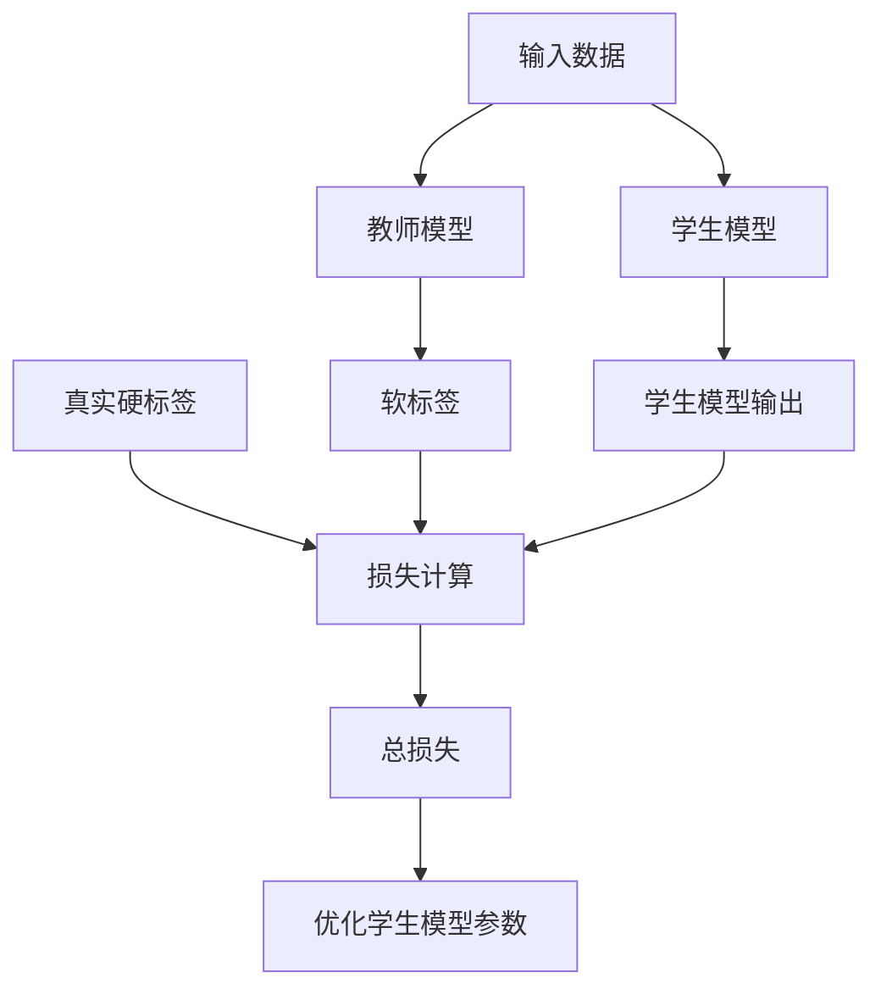

# 知识蒸馏：从大模型到轻量级AI Agent

> 关键词：知识蒸馏、大模型、轻量级AI Agent、模型压缩、迁移学习

> 摘要：本文深入探讨了知识蒸馏这一关键技术，旨在研究如何将大模型的知识迁移到轻量级AI Agent中。首先介绍了知识蒸馏的背景，包括其目的、适用读者、文档结构和相关术语。接着阐述了知识蒸馏的核心概念、联系、算法原理及具体操作步骤，并给出了相应的Python代码示例。然后详细讲解了知识蒸馏的数学模型和公式，结合实际例子进行说明。通过项目实战，展示了如何搭建开发环境、实现源代码并进行代码解读与分析。还探讨了知识蒸馏的实际应用场景，推荐了相关的学习资源、开发工具框架以及论文著作。最后总结了知识蒸馏的未来发展趋势与挑战，提供了常见问题的解答和扩展阅读的参考资料，帮助读者全面了解知识蒸馏技术及其在从大模型到轻量级AI Agent转化过程中的重要作用。

## 1. 背景介绍 
### 1.1 目的和范围
在人工智能领域，大模型（如GPT系列、BERT等）凭借其强大的性能在各种自然语言处理、计算机视觉等任务中取得了显著的成果。然而，大模型通常具有庞大的参数数量和复杂的计算结构，这导致它们在部署和推理时需要大量的计算资源和时间，限制了其在资源受限环境（如移动设备、嵌入式系统）中的应用。知识蒸馏技术应运而生，其目的在于将大模型中蕴含的丰富知识迁移到轻量级的AI Agent中，使得轻量级模型在保持较高性能的同时，能够在资源受限的环境中高效运行。

本文的范围涵盖了知识蒸馏的基本概念、核心算法原理、数学模型、项目实战、实际应用场景以及相关的工具和资源推荐等方面，旨在为读者提供一个全面而深入的知识蒸馏技术的学习和实践指南。

### 1.2 预期读者
本文预期读者包括对人工智能、机器学习领域感兴趣的研究人员、开发者、学生以及相关从业者。无论是想要深入了解知识蒸馏技术原理的理论研究者，还是希望在实际项目中应用知识蒸馏来优化模型性能的开发者，都能从本文中获取有价值的信息。

### 1.3 文档结构概述
本文将按照以下结构展开：首先介绍知识蒸馏的背景信息，包括目的、读者和文档结构等；接着详细阐述知识蒸馏的核心概念和联系，通过文本示意图和Mermaid流程图进行直观展示；然后讲解核心算法原理和具体操作步骤，并给出Python代码示例；再介绍知识蒸馏的数学模型和公式，结合实际例子进行说明；通过项目实战展示知识蒸馏在实际中的应用，包括开发环境搭建、源代码实现和代码解读；探讨知识蒸馏的实际应用场景；推荐相关的学习资源、开发工具框架和论文著作；最后总结知识蒸馏的未来发展趋势与挑战，提供常见问题的解答和扩展阅读的参考资料。

### 1.4 术语表
#### 1.4.1 核心术语定义
- **知识蒸馏（Knowledge Distillation）**：一种模型压缩和迁移学习技术，通过让轻量级的学生模型学习大模型（教师模型）的输出，将教师模型的知识迁移到学生模型中。
- **教师模型（Teacher Model）**：通常是一个性能强大但参数数量多、计算复杂度高的大模型，作为知识的来源。
- **学生模型（Student Model）**：一个轻量级的模型，通过学习教师模型的知识来提高自身性能。
- **软标签（Soft Labels）**：教师模型输出的概率分布，包含了比硬标签（类别标签）更多的信息。
- **硬标签（Hard Labels）**：数据的真实类别标签。

#### 1.4.2 相关概念解释
- **模型压缩（Model Compression）**：通过各种技术（如知识蒸馏、剪枝、量化等）减少模型的参数数量和计算复杂度，以提高模型的部署效率。
- **迁移学习（Transfer Learning）**：将在一个任务或领域中学习到的知识迁移到另一个任务或领域中，以加速模型的训练和提高性能。

#### 1.4.3 缩略词列表
- **AI**：Artificial Intelligence，人工智能
- **ML**：Machine Learning，机器学习
- **NLP**：Natural Language Processing，自然语言处理
- **CV**：Computer Vision，计算机视觉

## 2. 核心概念与联系 
知识蒸馏的核心思想是让学生模型学习教师模型的输出，从而将教师模型的知识迁移到学生模型中。教师模型通常是一个经过充分训练的大模型，具有较高的性能，但由于其复杂的结构和大量的参数，在实际应用中存在一定的局限性。学生模型则是一个轻量级的模型，通过学习教师模型的知识，能够在保持较高性能的同时，减少计算资源的需求。

### 文本示意图
知识蒸馏的基本过程可以用以下文本示意图表示：

输入数据首先被送入教师模型，教师模型对输入数据进行处理并输出软标签（概率分布）。同时，输入数据也被送入学生模型，学生模型输出自己的预测结果。然后，通过计算学生模型的输出与教师模型的软标签之间的损失，以及学生模型的输出与真实硬标签之间的损失，得到一个总的损失函数。最后，通过优化这个损失函数，不断调整学生模型的参数，使得学生模型的输出逐渐接近教师模型的输出，从而实现知识的迁移。

### Mermaid 流程图


## 3. 核心算法原理 & 具体操作步骤 
### 算法原理
知识蒸馏的核心算法原理基于损失函数的设计，主要包括两个部分：教师模型软标签的损失和真实硬标签的损失。通常使用的损失函数可以表示为：

$$
L = \alpha \times L_{soft} + (1 - \alpha) \times L_{hard}
$$

其中，$L$ 是总的损失函数，$\alpha$ 是一个超参数，用于控制软标签损失和硬标签损失的权重。$L_{soft}$ 是学生模型输出与教师模型软标签之间的损失，通常使用KL散度（Kullback-Leibler Divergence）来计算；$L_{hard}$ 是学生模型输出与真实硬标签之间的损失，通常使用交叉熵损失（Cross Entropy Loss）来计算。

### 具体操作步骤
1. **训练教师模型**：首先，使用大量的训练数据对教师模型进行训练，使其达到较高的性能。
2. **选择学生模型**：选择一个轻量级的学生模型，其结构和参数数量应远小于教师模型。
3. **知识蒸馏训练**：在知识蒸馏训练阶段，将输入数据同时送入教师模型和学生模型。教师模型输出软标签，学生模型输出自己的预测结果。计算软标签损失和硬标签损失，并根据上述损失函数计算总损失。然后，使用优化算法（如随机梯度下降）对学生模型的参数进行更新，使得总损失逐渐减小。
4. **评估学生模型**：在训练完成后，使用测试数据对学生模型的性能进行评估，检查其是否达到了预期的效果。

### Python代码示例
```python
import torch
import torch.nn as nn
import torch.optim as optim

# 定义教师模型
class TeacherModel(nn.Module):
    def __init__(self):
        super(TeacherModel, self).__init__()
        self.fc1 = nn.Linear(10, 20)
        self.fc2 = nn.Linear(20, 5)

    def forward(self, x):
        x = torch.relu(self.fc1(x))
        x = self.fc2(x)
        return x

# 定义学生模型
class StudentModel(nn.Module):
    def __init__(self):
        super(StudentModel, self).__init__()
        self.fc1 = nn.Linear(10, 10)
        self.fc2 = nn.Linear(10, 5)

    def forward(self, x):
        x = torch.relu(self.fc1(x))
        x = self.fc2(x)
        return x

# 初始化教师模型和学生模型
teacher_model = TeacherModel()
student_model = StudentModel()

# 定义损失函数和优化器
criterion_soft = nn.KLDivLoss(reduction='batchmean')
criterion_hard = nn.CrossEntropyLoss()
optimizer = optim.Adam(student_model.parameters(), lr=0.001)

# 超参数
alpha = 0.5
temperature = 2.0

# 模拟训练数据
x = torch.randn(32, 10)
y_true = torch.randint(0, 5, (32,))

# 知识蒸馏训练
for epoch in range(100):
    # 教师模型输出软标签
    teacher_output = teacher_model(x)
    teacher_soft_labels = torch.softmax(teacher_output / temperature, dim=1)

    # 学生模型输出
    student_output = student_model(x)
    student_soft_output = torch.log_softmax(student_output / temperature, dim=1)

    # 计算软标签损失
    loss_soft = criterion_soft(student_soft_output, teacher_soft_labels) * (temperature ** 2)

    # 计算硬标签损失
    loss_hard = criterion_hard(student_output, y_true)

    # 计算总损失
    loss = alpha * loss_soft + (1 - alpha) * loss_hard

    # 反向传播和参数更新
    optimizer.zero_grad()
    loss.backward()
    optimizer.step()

    if epoch % 10 == 0:
        print(f'Epoch {epoch}, Loss: {loss.item()}')
```

## 4. 数学模型和公式 & 详细讲解 & 举例说明 
### 数学模型和公式
#### KL散度（Kullback-Leibler Divergence）
KL散度是一种用于衡量两个概率分布之间差异的度量方法。在知识蒸馏中，用于计算学生模型输出的概率分布与教师模型软标签的概率分布之间的差异。其数学定义如下：

$$
D_{KL}(P || Q) = \sum_{i} P(i) \log \frac{P(i)}{Q(i)}
$$

其中，$P$ 是教师模型软标签的概率分布，$Q$ 是学生模型输出的概率分布。

#### 交叉熵损失（Cross Entropy Loss）
交叉熵损失是一种常用的分类损失函数，用于衡量学生模型输出与真实硬标签之间的差异。其数学定义如下：

$$
L_{CE}(y, \hat{y}) = - \sum_{i} y_i \log \hat{y}_i
$$

其中，$y$ 是真实硬标签的概率分布（通常是一个one-hot向量），$\hat{y}$ 是学生模型输出的概率分布。

#### 总损失函数
如前面所述，知识蒸馏的总损失函数可以表示为：

$$
L = \alpha \times L_{soft} + (1 - \alpha) \times L_{hard}
$$

其中，$L_{soft}$ 是软标签损失，$L_{hard}$ 是硬标签损失，$\alpha$ 是一个超参数，用于控制两者的权重。

### 详细讲解
- **KL散度的作用**：KL散度的作用是让学生模型学习教师模型输出的概率分布，从而捕获教师模型中蕴含的知识。通过最小化KL散度，学生模型的输出会逐渐接近教师模型的软标签，实现知识的迁移。
- **交叉熵损失的作用**：交叉熵损失的作用是确保学生模型能够正确分类，即与真实硬标签一致。在知识蒸馏中，同时考虑软标签损失和硬标签损失，可以使学生模型既学习到教师模型的知识，又能保证在真实数据上的分类性能。
- **超参数 $\alpha$ 的作用**：超参数 $\alpha$ 用于控制软标签损失和硬标签损失的权重。当 $\alpha$ 较大时，学生模型更注重学习教师模型的知识；当 $\alpha$ 较小时，学生模型更注重与真实硬标签的一致性。

### 举例说明
假设我们有一个三分类问题，教师模型的软标签为 $P = [0.1, 0.3, 0.6]$，学生模型的输出为 $Q = [0.2, 0.4, 0.4]$。则KL散度为：

$$
D_{KL}(P || Q) = 0.1 \log \frac{0.1}{0.2} + 0.3 \log \frac{0.3}{0.4} + 0.6 \log \frac{0.6}{0.4} \approx 0.067
$$

假设真实硬标签为 $y = [0, 0, 1]$，学生模型的输出概率分布为 $\hat{y} = [0.2, 0.4, 0.4]$。则交叉熵损失为：

$$
L_{CE}(y, \hat{y}) = - (0 \log 0.2 + 0 \log 0.4 + 1 \log 0.4) \approx 0.916
$$

假设 $\alpha = 0.5$，则总损失为：

$$
L = 0.5 \times 0.067 + (1 - 0.5) \times 0.916 \approx 0.492
$$

## 5. 项目实战：代码实际案例和详细解释说明 
### 5.1  开发环境搭建
#### 安装Python
首先，确保你已经安装了Python 3.x版本。可以从Python官方网站（https://www.python.org/downloads/） 下载并安装适合你操作系统的Python版本。

#### 安装深度学习框架
本文使用PyTorch作为深度学习框架，可以使用以下命令安装PyTorch：

```sh
pip install torch torchvision
```

#### 安装其他依赖库
根据项目的具体需求，可能还需要安装其他依赖库，如`numpy`、`matplotlib`等。可以使用以下命令安装：

```sh
pip install numpy matplotlib
```

### 5.2  源代码详细实现和代码解读
以下是一个完整的知识蒸馏项目实战代码示例，以图像分类任务为例：

```python
import torch
import torch.nn as nn
import torch.optim as optim
import torchvision
import torchvision.transforms as transforms

# 定义教师模型
class TeacherModel(nn.Module):
    def __init__(self):
        super(TeacherModel, self).__init__()
        self.conv1 = nn.Conv2d(3, 64, kernel_size=3, padding=1)
        self.pool = nn.MaxPool2d(2, 2)
        self.conv2 = nn.Conv2d(64, 128, kernel_size=3, padding=1)
        self.fc1 = nn.Linear(128 * 8 * 8, 128)
        self.fc2 = nn.Linear(128, 10)

    def forward(self, x):
        x = self.pool(torch.relu(self.conv1(x)))
        x = self.pool(torch.relu(self.conv2(x)))
        x = x.view(-1, 128 * 8 * 8)
        x = torch.relu(self.fc1(x))
        x = self.fc2(x)
        return x

# 定义学生模型
class StudentModel(nn.Module):
    def __init__(self):
        super(StudentModel, self).__init__()
        self.conv1 = nn.Conv2d(3, 32, kernel_size=3, padding=1)
        self.pool = nn.MaxPool2d(2, 2)
        self.fc1 = nn.Linear(32 * 8 * 8, 64)
        self.fc2 = nn.Linear(64, 10)

    def forward(self, x):
        x = self.pool(torch.relu(self.conv1(x)))
        x = x.view(-1, 32 * 8 * 8)
        x = torch.relu(self.fc1(x))
        x = self.fc2(x)
        return x

# 数据预处理
transform = transforms.Compose(
    [transforms.ToTensor(),
     transforms.Normalize((0.5, 0.5, 0.5), (0.5, 0.5, 0.5))])

# 加载数据集
trainset = torchvision.datasets.CIFAR10(root='./data', train=True,
                                        download=True, transform=transform)
trainloader = torch.utils.data.DataLoader(trainset, batch_size=32,
                                          shuffle=True, num_workers=2)

testset = torchvision.datasets.CIFAR10(root='./data', train=False,
                                       download=True, transform=transform)
testloader = torch.utils.data.DataLoader(testset, batch_size=32,
                                         shuffle=False, num_workers=2)

# 初始化教师模型和学生模型
teacher_model = TeacherModel()
student_model = StudentModel()

# 定义损失函数和优化器
criterion_soft = nn.KLDivLoss(reduction='batchmean')
criterion_hard = nn.CrossEntropyLoss()
optimizer = optim.Adam(student_model.parameters(), lr=0.001)

# 超参数
alpha = 0.5
temperature = 2.0

# 知识蒸馏训练
for epoch in range(10):
    running_loss = 0.0
    for i, data in enumerate(trainloader, 0):
        inputs, labels = data

        # 教师模型输出软标签
        teacher_output = teacher_model(inputs)
        teacher_soft_labels = torch.softmax(teacher_output / temperature, dim=1)

        # 学生模型输出
        student_output = student_model(inputs)
        student_soft_output = torch.log_softmax(student_output / temperature, dim=1)

        # 计算软标签损失
        loss_soft = criterion_soft(student_soft_output, teacher_soft_labels) * (temperature ** 2)

        # 计算硬标签损失
        loss_hard = criterion_hard(student_output, labels)

        # 计算总损失
        loss = alpha * loss_soft + (1 - alpha) * loss_hard

        # 反向传播和参数更新
        optimizer.zero_grad()
        loss.backward()
        optimizer.step()

        running_loss += loss.item()
        if i % 200 == 199:
            print(f'[{epoch + 1}, {i + 1:5d}] loss: {running_loss / 200:.3f}')
            running_loss = 0.0

print('Finished Training')

# 评估学生模型
correct = 0
total = 0
with torch.no_grad():
    for data in testloader:
        images, labels = data
        outputs = student_model(images)
        _, predicted = torch.max(outputs.data, 1)
        total += labels.size(0)
        correct += (predicted == labels).sum().item()

print(f'Accuracy of the network on the 10000 test images: {100 * correct / total}%')
```

### 代码解读与分析
- **教师模型和学生模型的定义**：定义了一个简单的卷积神经网络作为教师模型和学生模型。教师模型的结构相对复杂，包含更多的卷积层和全连接层；学生模型的结构相对简单，参数数量较少。
- **数据预处理和加载**：使用`torchvision`库加载CIFAR-10数据集，并进行数据预处理，包括将图像转换为张量和归一化操作。
- **损失函数和优化器的定义**：使用KL散度损失作为软标签损失，交叉熵损失作为硬标签损失，Adam优化器对学生模型的参数进行更新。
- **知识蒸馏训练**：在训练过程中，将输入数据同时送入教师模型和学生模型，计算软标签损失和硬标签损失，并根据总损失函数进行反向传播和参数更新。
- **模型评估**：在训练完成后，使用测试数据对学生模型的性能进行评估，计算其在测试集上的准确率。

## 6. 实际应用场景 
### 移动设备和嵌入式系统
在移动设备（如手机、平板电脑）和嵌入式系统（如智能摄像头、智能家居设备）中，由于资源受限，无法部署大型的深度学习模型。知识蒸馏技术可以将大模型的知识迁移到轻量级的AI Agent中，使得这些设备能够在有限的资源下运行高效的AI应用，如实时图像识别、语音识别等。

### 边缘计算
边缘计算是一种将计算和数据存储靠近数据源的计算模式，能够减少数据传输延迟和提高系统的响应速度。在边缘计算场景中，由于边缘设备的计算能力有限，知识蒸馏技术可以帮助在边缘设备上部署轻量级的AI模型，实现实时的数据分析和决策。

### 联邦学习
联邦学习是一种在多个参与方之间进行协作训练的机器学习范式，能够保护数据隐私。在联邦学习中，每个参与方的设备可能具有不同的计算能力和资源限制。知识蒸馏技术可以用于在参与方之间共享知识，将大模型的知识迁移到各个参与方的轻量级模型中，提高联邦学习的效率和性能。

### 在线学习和实时预测
在一些需要实时预测的应用场景中，如金融交易、自动驾驶等，需要模型能够快速做出决策。知识蒸馏技术可以将大模型的知识迁移到轻量级的AI Agent中，提高模型的推理速度，满足实时预测的需求。

## 7. 工具和资源推荐
### 7.1 学习资源推荐
#### 7.1.1 书籍推荐
- 《深度学习》（Deep Learning）：由Ian Goodfellow、Yoshua Bengio和Aaron Courville合著，是深度学习领域的经典教材，涵盖了深度学习的基本概念、算法和应用。
- 《动手学深度学习》（Dive into Deep Learning）：由李沐等人编写，以开源的方式提供了丰富的代码示例和详细的讲解，适合初学者学习深度学习。

#### 7.1.2 在线课程
- Coursera上的“深度学习专项课程”（Deep Learning Specialization）：由Andrew Ng教授授课，包括深度学习的基础知识、卷积神经网络、循环神经网络等内容。
- edX上的“强化学习基础”（Foundations of Reinforcement Learning）：介绍了强化学习的基本概念、算法和应用。

#### 7.1.3 技术博客和网站
- Medium上的Towards Data Science：是一个专注于数据科学和机器学习的技术博客，提供了大量的技术文章和案例分析。
- arXiv.org：是一个预印本服务器，提供了最新的学术研究论文，包括知识蒸馏、深度学习等领域的研究成果。

### 7.2 开发工具框架推荐
#### 7.2.1 IDE和编辑器
- PyCharm：是一款专门为Python开发设计的集成开发环境，提供了丰富的代码编辑、调试和分析功能。
- Visual Studio Code：是一款轻量级的代码编辑器，支持多种编程语言和插件扩展，适合快速开发和调试。

#### 7.2.2 调试和性能分析工具
- TensorBoard：是TensorFlow的可视化工具，可以用于可视化模型的训练过程、损失函数曲线、模型结构等。
- PyTorch Profiler：是PyTorch的性能分析工具，可以帮助用户分析模型的性能瓶颈，优化模型的计算效率。

#### 7.2.3 相关框架和库
- PyTorch：是一个开源的深度学习框架，提供了丰富的神经网络模块和优化算法，支持知识蒸馏的实现。
- TensorFlow：是另一个广泛使用的深度学习框架，也提供了知识蒸馏的相关功能和工具。

### 7.3 相关论文著作推荐
#### 7.3.1 经典论文
- “Distilling the Knowledge in a Neural Network”：由Geoffrey Hinton等人发表，是知识蒸馏领域的开创性论文，首次提出了知识蒸馏的概念和方法。
- “MobileNetV2: Inverted Residuals and Linear Bottlenecks”：介绍了一种轻量级的卷积神经网络结构，可用于知识蒸馏中的学生模型设计。

#### 7.3.2 最新研究成果
- 关注arXiv.org上关于知识蒸馏的最新研究论文，了解该领域的最新发展动态。
- 参加相关的学术会议，如NeurIPS、ICML等，获取最新的研究成果和技术报告。

#### 7.3.3 应用案例分析
- 一些开源项目和技术博客会分享知识蒸馏在实际应用中的案例分析，通过学习这些案例可以更好地理解知识蒸馏的应用场景和实现方法。

## 8. 总结：未来发展趋势与挑战
### 未来发展趋势
- **多模态知识蒸馏**：随着人工智能技术的发展，多模态数据（如图像、文本、语音等）的处理变得越来越重要。未来的知识蒸馏技术可能会扩展到多模态领域，实现不同模态之间的知识迁移和融合。
- **自适应知识蒸馏**：根据不同的任务和数据集，自适应地调整知识蒸馏的参数和策略，提高知识蒸馏的效率和性能。
- **与其他技术的融合**：知识蒸馏可能会与其他技术（如剪枝、量化、强化学习等）相结合，进一步优化模型的性能和资源利用率。

### 挑战
- **知识表示和迁移的难题**：如何有效地表示和迁移大模型中的知识，仍然是一个具有挑战性的问题。不同的模型结构和任务可能需要不同的知识表示和迁移方法。
- **学生模型的性能上限**：尽管知识蒸馏可以提高学生模型的性能，但学生模型的性能仍然受到其自身结构和参数数量的限制。如何突破学生模型的性能上限，是未来需要解决的问题之一。
- **计算资源和时间的限制**：知识蒸馏过程通常需要大量的计算资源和时间，尤其是在处理大规模数据集和复杂模型时。如何在有限的计算资源和时间内实现高效的知识蒸馏，是一个重要的挑战。

## 9. 附录：常见问题与解答
### 问题1：知识蒸馏和模型压缩有什么关系？
知识蒸馏是模型压缩的一种技术，通过将大模型的知识迁移到轻量级模型中，减少模型的参数数量和计算复杂度，从而实现模型的压缩。

### 问题2：如何选择合适的教师模型和学生模型？
教师模型通常选择性能较好的大模型，其结构和参数数量应足够复杂，以捕获丰富的知识。学生模型则应选择轻量级的模型，其结构和参数数量应远小于教师模型，同时要保证能够学习到教师模型的知识。

### 问题3：超参数 $\alpha$ 和温度 $T$ 如何调整？
超参数 $\alpha$ 和温度 $T$ 通常需要通过实验进行调整。$\alpha$ 用于控制软标签损失和硬标签损失的权重，一般可以在 $0.1$ 到 $0.9$ 之间进行尝试。温度 $T$ 用于控制软标签的平滑程度，一般可以在 $1$ 到 $10$ 之间进行尝试。

### 问题4：知识蒸馏是否适用于所有类型的任务？
知识蒸馏适用于大多数分类和回归任务，但对于一些特殊的任务，如生成任务，可能需要进行适当的调整和改进。

## 10. 扩展阅读 & 参考资料
### 扩展阅读
- 阅读更多关于模型压缩、迁移学习、深度学习优化等方面的书籍和论文，深入了解相关技术的原理和应用。
- 关注开源社区和技术论坛，了解知识蒸馏技术的最新发展动态和应用案例。

### 参考资料
- Hinton, G., Vinyals, O., & Dean, J. (2015). Distilling the Knowledge in a Neural Network. arXiv preprint arXiv:1503.02531.
- Sandler, M., Howard, A., Zhu, M., Zhmoginov, A., & Chen, L. C. (2018). MobileNetV2: Inverted Residuals and Linear Bottlenecks. In Proceedings of the IEEE conference on computer vision and pattern recognition (pp. 4510-4520).
- Goodfellow, I., Bengio, Y., & Courville, A. (2016). Deep Learning. MIT press.
- Li, M., Aikin, A., Li, Z., Zhang, Z., & Zhang, C. (2020). Dive into Deep Learning. https://d2l.ai/ 