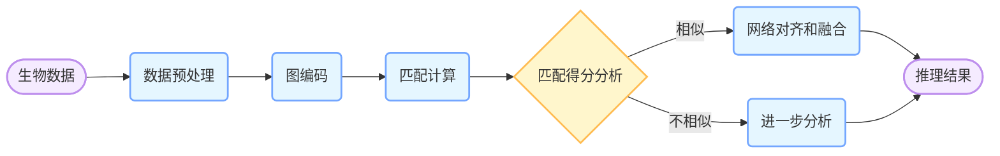

# 神经图匹配在生物信息网络推理中的精准应用研究

> 关键词：神经图匹配、生物信息网络推理、图神经网络、精准应用、图同构

> 摘要：本文聚焦于神经图匹配在生物信息网络推理中的精准应用。首先介绍了相关背景，包括研究目的、预期读者、文档结构和术语表。详细阐述了神经图匹配和生物信息网络推理的核心概念及其联系，给出了原理和架构的文本示意图与Mermaid流程图。深入讲解了核心算法原理，并用Python代码进行了详细阐述。同时，给出了相关数学模型和公式，并举例说明。通过项目实战，展示了代码的实际案例及详细解释。探讨了神经图匹配在生物信息网络推理中的实际应用场景，推荐了学习资源、开发工具框架和相关论文著作。最后总结了未来发展趋势与挑战，提供了常见问题解答和扩展阅读参考资料，旨在为该领域的研究和应用提供全面且深入的指导。

## 1. 背景介绍 
### 1.1 目的和范围
生物信息网络推理是理解生物系统复杂机制的关键环节。传统的推理方法在处理生物信息网络的复杂性和动态性时存在一定的局限性。神经图匹配作为一种新兴的技术，能够更有效地处理图结构数据，为生物信息网络推理提供了新的思路和方法。本文的目的在于深入研究神经图匹配在生物信息网络推理中的精准应用，探索其在生物信息处理中的潜力和优势。

研究范围涵盖了神经图匹配的核心概念、算法原理、数学模型，以及在生物信息网络推理中的实际应用。同时，通过项目实战展示了如何将神经图匹配技术应用于具体的生物信息网络推理任务，并分析其效果和性能。

### 1.2 预期读者
本文预期读者包括生物信息学领域的研究人员、计算机科学专业的程序员和研究人员、对生物信息网络推理和图神经网络感兴趣的爱好者。对于生物信息学研究人员，本文可以为他们提供新的技术手段和方法，帮助他们更好地理解生物信息网络的结构和功能。对于计算机科学专业的人员，本文可以让他们了解生物信息学领域的应用需求，拓展其技术应用范围。对于爱好者，本文可以作为一个入门指南，引导他们了解神经图匹配和生物信息网络推理的相关知识。

### 1.3 文档结构概述
本文共分为十个部分。第一部分为背景介绍，包括研究目的、预期读者、文档结构和术语表。第二部分详细阐述了神经图匹配和生物信息网络推理的核心概念及其联系，并给出了原理和架构的文本示意图与Mermaid流程图。第三部分讲解了核心算法原理，并用Python代码进行了详细阐述。第四部分给出了相关数学模型和公式，并举例说明。第五部分通过项目实战，展示了代码的实际案例及详细解释。第六部分探讨了神经图匹配在生物信息网络推理中的实际应用场景。第七部分推荐了学习资源、开发工具框架和相关论文著作。第八部分总结了未来发展趋势与挑战。第九部分提供了常见问题解答。第十部分为扩展阅读和参考资料。

### 1.4 术语表
#### 1.4.1 核心术语定义
- **神经图匹配**：是一种基于图神经网络的技术，用于寻找两个或多个图之间的最佳匹配关系。通过学习图的结构和节点特征，神经图匹配能够在图之间建立对应关系，判断图的相似性。
- **生物信息网络推理**：是指从生物数据中推断生物信息网络的结构和功能的过程。生物信息网络包括基因调控网络、蛋白质相互作用网络等，推理过程旨在揭示生物分子之间的相互关系和生物系统的运行机制。
- **图神经网络（GNN）**：是一类专门处理图结构数据的神经网络。它能够通过消息传递机制学习图中节点和边的特征，对图进行表示和分类等操作。
- **图同构**：如果两个图的节点和边之间存在一一对应的关系，并且保持边的连接关系不变，则称这两个图是同构的。神经图匹配在一定程度上可以用于判断图是否同构。

#### 1.4.2 相关概念解释
- **生物数据**：包括基因表达数据、蛋白质序列数据、代谢物浓度数据等。这些数据是生物信息网络推理的基础，通过对生物数据的分析和处理，可以构建生物信息网络。
- **消息传递机制**：是图神经网络中的一种重要机制。在消息传递过程中，节点通过与相邻节点交换信息来更新自己的特征。这种机制使得图神经网络能够捕捉图的局部和全局结构信息。
- **匹配得分**：在神经图匹配中，用于衡量两个图之间匹配程度的指标。匹配得分越高，表示两个图越相似，匹配关系越好。

#### 1.4.3 缩略词列表
- **GNN**：Graph Neural Network，图神经网络
- **RNA**：Ribonucleic Acid，核糖核酸
- **DNA**：Deoxyribonucleic Acid，脱氧核糖核酸

## 2. 核心概念与联系 

### 神经图匹配的核心概念
神经图匹配的核心思想是利用图神经网络学习图的结构和节点特征，从而找到图之间的最佳匹配关系。图可以表示为 $G=(V, E)$，其中 $V$ 是节点集合，$E$ 是边集合。每个节点 $v_i \in V$ 有自己的特征向量 $x_i$，边 $e_{ij} \in E$ 表示节点 $v_i$ 和 $v_j$ 之间的连接关系。

图神经网络通过消息传递机制对图进行编码。具体来说，节点 $v_i$ 在第 $k$ 层的特征 $h_i^k$ 可以通过以下公式更新：

$$h_i^k = \text{AGGREGATE}^k(\{h_j^{k - 1} : v_j \in \mathcal{N}(v_i)\}) + \text{UPDATE}^k(h_i^{k - 1}, \text{AGGREGATE}^k(\{h_j^{k - 1} : v_j \in \mathcal{N}(v_i)\}))$$

其中，$\mathcal{N}(v_i)$ 是节点 $v_i$ 的邻居节点集合，$\text{AGGREGATE}^k$ 是聚合函数，用于聚合邻居节点的特征，$\text{UPDATE}^k$ 是更新函数，用于更新节点的特征。

在神经图匹配中，我们通常会对两个图 $G_1$ 和 $G_2$ 进行编码，得到它们的图表示 $H_1$ 和 $H_2$。然后，通过计算匹配得分 $S$ 来衡量两个图的匹配程度。匹配得分可以通过多种方式计算，例如使用点积、余弦相似度等。

### 生物信息网络推理的核心概念
生物信息网络推理的目标是从生物数据中推断生物信息网络的结构和功能。生物信息网络可以用图来表示，其中节点表示生物分子（如基因、蛋白质等），边表示生物分子之间的相互作用（如基因调控、蛋白质相互作用等）。

常见的生物信息网络推理方法包括基于统计学的方法、基于机器学习的方法和基于深度学习的方法。基于统计学的方法通过分析生物数据的统计特征来推断网络结构，例如相关性分析、互信息分析等。基于机器学习的方法则利用机器学习算法（如决策树、支持向量机等）对生物数据进行建模和分类，从而推断网络结构。基于深度学习的方法，特别是图神经网络，能够更有效地处理图结构数据，为生物信息网络推理提供了新的途径。

### 核心概念的联系
神经图匹配与生物信息网络推理之间存在着密切的联系。在生物信息网络推理中，我们常常需要比较不同生物信息网络的相似性，判断它们是否具有相同的结构和功能。神经图匹配可以用于解决这个问题，通过计算不同生物信息网络之间的匹配得分，我们可以判断它们的相似程度。

此外，神经图匹配还可以用于生物信息网络的对齐和融合。在生物研究中，我们可能会从不同的实验条件或数据源中得到多个生物信息网络。通过神经图匹配，我们可以将这些网络进行对齐，找到它们之间的对应关系，从而实现网络的融合，得到更全面和准确的生物信息网络。

### 原理和架构的文本示意图
神经图匹配在生物信息网络推理中的应用原理可以概括为以下几个步骤：
1. **数据预处理**：将生物数据转换为图结构数据，包括节点特征和边信息。
2. **图编码**：使用图神经网络对生物信息网络进行编码，得到图的表示。
3. **匹配计算**：计算不同生物信息网络之间的匹配得分。
4. **推理和分析**：根据匹配得分进行生物信息网络的推理和分析，如判断网络的相似性、进行网络对齐和融合等。

### Mermaid流程图


## 3. 核心算法原理 & 具体操作步骤 

### 核心算法原理
神经图匹配的核心算法通常基于图神经网络和匹配算法。下面我们将详细介绍一种基于图卷积网络（GCN）的神经图匹配算法。

#### 图卷积网络（GCN）
图卷积网络是一种常用的图神经网络，它通过对图的邻接矩阵和节点特征进行卷积操作来更新节点的特征。给定一个图 $G=(V, E)$，其邻接矩阵为 $A$，节点特征矩阵为 $X$，则 GCN 的第 $k$ 层的输出 $H^k$ 可以通过以下公式计算：

$$H^k = \sigma(\tilde{D}^{-\frac{1}{2}}\tilde{A}\tilde{D}^{-\frac{1}{2}}H^{k - 1}W^k)$$

其中，$\tilde{A} = A + I$ 是添加自环后的邻接矩阵，$I$ 是单位矩阵，$\tilde{D}$ 是 $\tilde{A}$ 的度矩阵，$W^k$ 是第 $k$ 层的可学习权重矩阵，$\sigma$ 是激活函数（如 ReLU）。

#### 匹配算法
在得到两个图 $G_1$ 和 $G_2$ 的图表示 $H_1$ 和 $H_2$ 后，我们可以使用匈牙利算法来找到两个图之间的最佳匹配。匈牙利算法是一种用于解决二分图最大权匹配问题的算法，它可以在多项式时间内找到最优解。

具体来说，我们首先计算两个图的节点之间的匹配得分矩阵 $S$，其中 $S_{ij}$ 表示图 $G_1$ 的第 $i$ 个节点和图 $G_2$ 的第 $j$ 个节点之间的匹配得分。然后，使用匈牙利算法在 $S$ 中找到最大权匹配，得到两个图的节点之间的对应关系。

### 具体操作步骤
#### 步骤 1：数据准备
首先，我们需要将生物数据转换为图结构数据。假设我们有基因表达数据，我们可以将每个基因看作一个节点，基因之间的相关性可以作为边的权重。以下是一个简单的 Python 代码示例，用于生成图的邻接矩阵和节点特征矩阵：

```python
import numpy as np

# 假设我们有 5 个基因的表达数据
gene_expression_data = np.random.rand(5, 10)  # 5 个基因，每个基因有 10 个样本的表达值

# 计算基因之间的相关性矩阵
correlation_matrix = np.corrcoef(gene_expression_data)

# 邻接矩阵
adjacency_matrix = np.abs(correlation_matrix) > 0.5  # 相关性大于 0.5 的基因之间有边连接

# 节点特征矩阵
node_features = gene_expression_data.mean(axis=1).reshape(-1, 1)  # 使用基因表达的平均值作为节点特征
```

#### 步骤 2：图编码
使用图卷积网络对图进行编码。以下是一个使用 PyTorch 实现的简单 GCN 模型：

```python
import torch
import torch.nn as nn
import torch.nn.functional as F

class GCNLayer(nn.Module):
    def __init__(self, in_features, out_features):
        super(GCNLayer, self).__init__()
        self.weight = nn.Parameter(torch.FloatTensor(in_features, out_features))
        nn.init.xavier_uniform_(self.weight)

    def forward(self, adj, features):
        support = torch.mm(features, self.weight)
        output = torch.spmm(adj, support)
        return output

class GCN(nn.Module):
    def __init__(self, nfeat, nhid, nclass):
        super(GCN, self).__init__()
        self.gc1 = GCNLayer(nfeat, nhid)
        self.gc2 = GCNLayer(nhid, nclass)

    def forward(self, adj, features):
        x = F.relu(self.gc1(adj, features))
        x = self.gc2(adj, x)
        return x

# 初始化 GCN 模型
nfeat = node_features.shape[1]
nhid = 16
nclass = 8
model = GCN(nfeat, nhid, nclass)

# 将邻接矩阵和节点特征矩阵转换为 PyTorch 张量
adj = torch.FloatTensor(adjacency_matrix)
features = torch.FloatTensor(node_features)

# 进行图编码
graph_representation = model(adj, features)
```

#### 步骤 3：匹配计算
计算两个图的节点之间的匹配得分矩阵，并使用匈牙利算法找到最佳匹配。以下是一个使用 `scipy` 库实现的示例：

```python
from scipy.optimize import linear_sum_assignment

# 假设我们有另一个图的表示
graph_representation_2 = torch.FloatTensor(np.random.rand(5, 8))

# 计算匹配得分矩阵
score_matrix = torch.mm(graph_representation, graph_representation_2.t())

# 使用匈牙利算法找到最佳匹配
row_indices, col_indices = linear_sum_assignment(-score_matrix.detach().numpy())

# 打印匹配结果
for i, j in zip(row_indices, col_indices):
    print(f"图 1 的节点 {i} 与图 2 的节点 {j} 匹配，匹配得分: {score_matrix[i, j].item()}")
```

## 4. 数学模型和公式 & 详细讲解 & 举例说明 

### 图卷积网络的数学模型
图卷积网络（GCN）的核心公式为：

$$H^k = \sigma(\tilde{D}^{-\frac{1}{2}}\tilde{A}\tilde{D}^{-\frac{1}{2}}H^{k - 1}W^k)$$

其中，$\tilde{A} = A + I$ 是添加自环后的邻接矩阵，$I$ 是单位矩阵，$\tilde{D}$ 是 $\tilde{A}$ 的度矩阵，$W^k$ 是第 $k$ 层的可学习权重矩阵，$\sigma$ 是激活函数（如 ReLU）。

详细讲解：
- **邻接矩阵 $A$**：表示图中节点之间的连接关系。如果节点 $i$ 和节点 $j$ 之间有边连接，则 $A_{ij} = 1$，否则 $A_{ij} = 0$。
- **度矩阵 $D$**：是一个对角矩阵，$D_{ii}$ 表示节点 $i$ 的度，即与节点 $i$ 相连的边的数量。
- **添加自环**：在邻接矩阵 $A$ 中添加自环是为了让节点在卷积过程中能够考虑自身的特征。
- **归一化**：$\tilde{D}^{-\frac{1}{2}}\tilde{A}\tilde{D}^{-\frac{1}{2}}$ 是对邻接矩阵进行归一化处理，目的是解决不同节点度差异带来的影响。
- **可学习权重矩阵 $W^k$**：用于学习节点特征的变换，使得 GCN 能够适应不同的任务。
- **激活函数 $\sigma$**：引入非线性，增强模型的表达能力。

举例说明：
假设我们有一个简单的图，包含 3 个节点，其邻接矩阵 $A$ 为：

$$A = \begin{bmatrix}
0 & 1 & 1 \\
1 & 0 & 1 \\
1 & 1 & 0
\end{bmatrix}$$

添加自环后，$\tilde{A} = A + I$ 为：

$$\tilde{A} = \begin{bmatrix}
1 & 1 & 1 \\
1 & 1 & 1 \\
1 & 1 & 1
\end{bmatrix}$$

$\tilde{A}$ 的度矩阵 $\tilde{D}$ 为：

$$\tilde{D} = \begin{bmatrix}
3 & 0 & 0 \\
0 & 3 & 0 \\
0 & 0 & 3
\end{bmatrix}$$

则 $\tilde{D}^{-\frac{1}{2}}\tilde{A}\tilde{D}^{-\frac{1}{2}}$ 为：

$$\tilde{D}^{-\frac{1}{2}}\tilde{A}\tilde{D}^{-\frac{1}{2}} = \begin{bmatrix}
\frac{1}{\sqrt{3}} & 0 & 0 \\
0 & \frac{1}{\sqrt{3}} & 0 \\
0 & 0 & \frac{1}{\sqrt{3}}
\end{bmatrix}
\begin{bmatrix}
1 & 1 & 1 \\
1 & 1 & 1 \\
1 & 1 & 1
\end{bmatrix}
\begin{bmatrix}
\frac{1}{\sqrt{3}} & 0 & 0 \\
0 & \frac{1}{\sqrt{3}} & 0 \\
0 & 0 & \frac{1}{\sqrt{3}}
\end{bmatrix}
= \begin{bmatrix}
\frac{1}{3} & \frac{1}{3} & \frac{1}{3} \\
\frac{1}{3} & \frac{1}{3} & \frac{1}{3} \\
\frac{1}{3} & \frac{1}{3} & \frac{1}{3}
\end{bmatrix}$$

假设节点特征矩阵 $H^0$ 为：

$$H^0 = \begin{bmatrix}
1 \\
2 \\
3
\end{bmatrix}$$

可学习权重矩阵 $W^1$ 为：

$$W^1 = \begin{bmatrix}
0.1 \\
\end{bmatrix}$$

则 $H^1 = \sigma(\tilde{D}^{-\frac{1}{2}}\tilde{A}\tilde{D}^{-\frac{1}{2}}H^0W^1)$ 为：

$$\tilde{D}^{-\frac{1}{2}}\tilde{A}\tilde{D}^{-\frac{1}{2}}H^0 = \begin{bmatrix}
\frac{1}{3} & \frac{1}{3} & \frac{1}{3} \\
\frac{1}{3} & \frac{1}{3} & \frac{1}{3} \\
\frac{1}{3} & \frac{1}{3} & \frac{1}{3}
\end{bmatrix}
\begin{bmatrix}
1 \\
2 \\
3
\end{bmatrix}
= \begin{bmatrix}
2 \\
2 \\
2
\end{bmatrix}$$

$$\tilde{D}^{-\frac{1}{2}}\tilde{A}\tilde{D}^{-\frac{1}{2}}H^0W^1 = \begin{bmatrix}
2 \\
2 \\
2
\end{bmatrix}
\begin{bmatrix}
0.1
\end{bmatrix}
= \begin{bmatrix}
0.2 \\
0.2 \\
0.2
\end{bmatrix}$$

如果使用 ReLU 激活函数 $\sigma(x) = \max(0, x)$，则 $H^1 = \begin{bmatrix}
0.2 \\
0.2 \\
0.2
\end{bmatrix}$

### 匹配得分的数学模型
匹配得分矩阵 $S$ 通常通过计算两个图的节点表示之间的相似度来得到。常用的相似度计算方法包括点积和余弦相似度。

#### 点积相似度
点积相似度的计算公式为：

$$S_{ij} = h_{i}^T h_{j}'$$

其中，$h_i$ 是图 $G_1$ 的第 $i$ 个节点的表示，$h_j'$ 是图 $G_2$ 的第 $j$ 个节点的表示。

#### 余弦相似度
余弦相似度的计算公式为：

$$S_{ij} = \frac{h_{i}^T h_{j}'}{\|h_i\| \|h_j'\|}$$

其中，$\|h_i\|$ 和 $\|h_j'\|$ 分别是 $h_i$ 和 $h_j'$ 的 L2 范数。

详细讲解：
- **点积相似度**：点积相似度衡量了两个向量的方向和长度的综合影响。如果两个向量的方向相同且长度较长，则点积相似度较大。
- **余弦相似度**：余弦相似度只考虑两个向量的方向，不考虑长度。它的值在 -1 到 1 之间，值越接近 1 表示两个向量越相似。

举例说明：
假设图 $G_1$ 的一个节点表示 $h_1 = \begin{bmatrix}
1 \\
2
\end{bmatrix}$，图 $G_2$ 的一个节点表示 $h_2 = \begin{bmatrix}
2 \\
1
\end{bmatrix}$。

- **点积相似度**：$S_{12} = h_1^T h_2 = \begin{bmatrix}
1 & 2
\end{bmatrix}
\begin{bmatrix}
2 \\
1
\end{bmatrix}
= 1\times2 + 2\times1 = 4$

- **余弦相似度**：$\|h_1\| = \sqrt{1^2 + 2^2} = \sqrt{5}$，$\|h_2\| = \sqrt{2^2 + 1^2} = \sqrt{5}$

$S_{12} = \frac{h_1^T h_2}{\|h_1\| \|h_2\|} = \frac{4}{\sqrt{5} \times \sqrt{5}} = \frac{4}{5} = 0.8$

## 5. 项目实战：代码实际案例和详细解释说明 

### 5.1  开发环境搭建
#### 操作系统
本项目可以在 Windows、Linux 或 macOS 操作系统上进行开发。建议使用 Linux 系统，因为它在科学计算和深度学习领域有更好的支持。

#### Python 环境
我们使用 Python 作为开发语言，建议使用 Python 3.7 及以上版本。可以使用 Anaconda 来管理 Python 环境，以下是创建虚拟环境的命令：

```bash
conda create -n bio_graph_matching python=3.8
conda activate bio_graph_matching
```

#### 依赖库安装
本项目需要安装以下依赖库：
- `torch`：用于构建和训练图神经网络。
- `numpy`：用于数值计算。
- `scipy`：用于实现匈牙利算法。

可以使用以下命令安装这些库：

```bash
pip install torch numpy scipy
```

### 5.2  源代码详细实现和代码解读
#### 数据生成
我们使用合成的生物数据来演示神经图匹配在生物信息网络推理中的应用。以下是生成数据的代码：

```python
import numpy as np

# 生成基因表达数据
num_genes = 10
num_samples = 20
gene_expression_data_1 = np.random.rand(num_genes, num_samples)
gene_expression_data_2 = np.random.rand(num_genes, num_samples)

# 计算相关性矩阵
correlation_matrix_1 = np.corrcoef(gene_expression_data_1)
correlation_matrix_2 = np.corrcoef(gene_expression_data_2)

# 邻接矩阵
adjacency_matrix_1 = np.abs(correlation_matrix_1) > 0.5
adjacency_matrix_2 = np.abs(correlation_matrix_2) > 0.5

# 节点特征矩阵
node_features_1 = gene_expression_data_1.mean(axis=1).reshape(-1, 1)
node_features_2 = gene_expression_data_2.mean(axis=1).reshape(-1, 1)
```

代码解读：
- 首先，我们生成了两个基因表达数据集 `gene_expression_data_1` 和 `gene_expression_data_2`，每个数据集包含 10 个基因和 20 个样本的表达值。
- 然后，计算了两个数据集的相关性矩阵 `correlation_matrix_1` 和 `correlation_matrix_2`。
- 接着，根据相关性矩阵生成邻接矩阵 `adjacency_matrix_1` 和 `adjacency_matrix_2`，相关性大于 0.5 的基因之间有边连接。
- 最后，使用基因表达的平均值作为节点特征，得到节点特征矩阵 `node_features_1` 和 `node_features_2`。

#### 图卷积网络模型定义
以下是使用 PyTorch 定义的图卷积网络模型：

```python
import torch
import torch.nn as nn
import torch.nn.functional as F

class GCNLayer(nn.Module):
    def __init__(self, in_features, out_features):
        super(GCNLayer, self).__init__()
        self.weight = nn.Parameter(torch.FloatTensor(in_features, out_features))
        nn.init.xavier_uniform_(self.weight)

    def forward(self, adj, features):
        support = torch.mm(features, self.weight)
        output = torch.spmm(adj, support)
        return output

class GCN(nn.Module):
    def __init__(self, nfeat, nhid, nclass):
        super(GCN, self).__init__()
        self.gc1 = GCNLayer(nfeat, nhid)
        self.gc2 = GCNLayer(nhid, nclass)

    def forward(self, adj, features):
        x = F.relu(self.gc1(adj, features))
        x = self.gc2(adj, x)
        return x
```

代码解读：
- `GCNLayer` 类定义了一个图卷积层，包含一个可学习的权重矩阵 `weight`，并使用 `xavier_uniform_` 初始化。
- `forward` 方法实现了图卷积的计算过程，首先将节点特征与权重矩阵相乘，然后与邻接矩阵进行稀疏矩阵乘法。
- `GCN` 类定义了一个两层的图卷积网络，包含两个 `GCNLayer` 层，中间使用 ReLU 激活函数。

#### 图编码和匹配计算
以下是对两个图进行编码和匹配计算的代码：

```python
# 初始化 GCN 模型
nfeat = node_features_1.shape[1]
nhid = 16
nclass = 8
model = GCN(nfeat, nhid, nclass)

# 将邻接矩阵和节点特征矩阵转换为 PyTorch 张量
adj_1 = torch.FloatTensor(adjacency_matrix_1)
features_1 = torch.FloatTensor(node_features_1)
adj_2 = torch.FloatTensor(adjacency_matrix_2)
features_2 = torch.FloatTensor(node_features_2)

# 进行图编码
graph_representation_1 = model(adj_1, features_1)
graph_representation_2 = model(adj_2, features_2)

# 计算匹配得分矩阵
score_matrix = torch.mm(graph_representation_1, graph_representation_2.t())

# 使用匈牙利算法找到最佳匹配
from scipy.optimize import linear_sum_assignment
row_indices, col_indices = linear_sum_assignment(-score_matrix.detach().numpy())

# 打印匹配结果
for i, j in zip(row_indices, col_indices):
    print(f"图 1 的节点 {i} 与图 2 的节点 {j} 匹配，匹配得分: {score_matrix[i, j].item()}")
```

代码解读：
- 首先，初始化了一个 GCN 模型，设置输入特征维度、隐藏层维度和输出维度。
- 然后，将邻接矩阵和节点特征矩阵转换为 PyTorch 张量，并使用 GCN 模型对两个图进行编码，得到图表示 `graph_representation_1` 和 `graph_representation_2`。
- 接着，计算两个图的节点之间的匹配得分矩阵 `score_matrix`。
- 最后，使用匈牙利算法在得分矩阵中找到最大权匹配，并打印匹配结果。

### 5.3  代码解读与分析
#### 数据处理部分
数据处理部分主要是将生物数据转换为图结构数据，包括计算相关性矩阵、生成邻接矩阵和节点特征矩阵。这种处理方式可以将生物数据的复杂关系以图的形式表示出来，便于后续的图神经网络处理。

#### 图卷积网络部分
图卷积网络通过消息传递机制学习图的结构和节点特征。在本项目中，我们使用了两层的 GCN 模型，能够有效地捕捉图的局部和全局信息。ReLU 激活函数的使用引入了非线性，增强了模型的表达能力。

#### 匹配计算部分
匹配计算部分使用匈牙利算法在匹配得分矩阵中找到最大权匹配。匈牙利算法是一种高效的算法，能够在多项式时间内找到最优解。通过匹配得分矩阵，我们可以判断两个图的节点之间的匹配程度，从而实现生物信息网络的对齐和比较。

## 6. 实际应用场景 
### 基因调控网络比较
在生物研究中，不同的实验条件或疾病状态下，基因调控网络可能会发生变化。通过神经图匹配，我们可以比较不同基因调控网络的相似性，找出在不同条件下发生变化的基因和调控关系。例如，在癌症研究中，比较正常细胞和癌细胞的基因调控网络，可以发现与癌症发生发展相关的关键基因和信号通路。

### 蛋白质相互作用网络对齐
蛋白质相互作用网络描述了蛋白质之间的物理相互作用关系。不同物种的蛋白质相互作用网络可能存在相似性和差异性。通过神经图匹配，我们可以将不同物种的蛋白质相互作用网络进行对齐，找到保守的蛋白质相互作用模块和功能区域。这有助于理解蛋白质的进化和功能保守性。

### 代谢网络分析
代谢网络描述了生物体内代谢物之间的化学反应关系。在不同的生理状态或疾病状态下，代谢网络的结构和功能可能会发生变化。通过神经图匹配，我们可以比较不同代谢网络的相似性，分析代谢途径的变化和代谢物的通量。这对于理解生物代谢机制和疾病的代谢特征具有重要意义。

### 药物靶点预测
药物靶点预测是生物信息学中的一个重要任务。通过神经图匹配，我们可以将药物分子的化学结构和生物信息网络进行匹配，预测药物可能的靶点。例如，将药物分子的化学图与蛋白质相互作用网络进行匹配，找到与药物分子相互作用的蛋白质，从而确定药物的潜在靶点。

## 7. 工具和资源推荐
### 7.1 学习资源推荐
#### 7.1.1 书籍推荐
- 《图神经网络：基础、前沿与应用》：本书全面介绍了图神经网络的基本概念、算法原理和应用场景，对于深入理解神经图匹配和生物信息网络推理具有重要的参考价值。
- 《生物信息学：序列与基因组分析》：这本书涵盖了生物信息学的各个方面，包括生物数据处理、序列分析、基因调控网络推理等内容，是生物信息学领域的经典教材。
- 《深度学习》：深度学习是神经图匹配的重要基础，这本书详细介绍了深度学习的基本原理、算法和应用，对于理解图神经网络和神经图匹配的算法原理有很大帮助。

#### 7.1.2 在线课程
- Coursera 上的“Graph Neural Networks for Machine Learning”：该课程由知名教授授课，系统地介绍了图神经网络的理论和实践，包括图卷积网络、图注意力网络等内容。
- edX 上的“Bioinformatics: Data Analysis and Interpretation”：该课程聚焦于生物信息学的数据处理和分析方法，对于学习生物信息网络推理有很大帮助。
- B 站上的一些图神经网络和生物信息学相关的教程视频，这些视频通常由行业专家或爱好者分享，内容丰富且易于理解。

#### 7.1.3 技术博客和网站
- Medium 上的图神经网络和生物信息学相关的博客文章，这些文章通常分享了最新的研究成果和实践经验。
- 图神经网络研究社区（https://graphneural.network/）：该网站汇集了图神经网络领域的最新研究动态、开源代码和数据集，是学习图神经网络的重要资源。
- 生物信息学在线社区（https://www.biostars.org/）：该社区是生物信息学领域的交流平台，用户可以在上面提问、分享经验和获取最新的研究信息。

### 7.2 开发工具框架推荐
#### 7.2.1 IDE和编辑器
- PyCharm：是一款专业的 Python 集成开发环境，具有强大的代码编辑、调试和项目管理功能，适合开发图神经网络和生物信息学相关的项目。
- Jupyter Notebook：是一种交互式的开发环境，支持 Python 代码的编写、运行和可视化展示，非常适合进行数据探索和模型实验。
- Visual Studio Code：是一款轻量级的代码编辑器，支持多种编程语言和插件扩展，具有丰富的代码编辑和调试功能。

#### 7.2.2 调试和性能分析工具
- PyTorch Profiler：是 PyTorch 自带的性能分析工具，可以帮助我们分析模型的运行时间、内存使用情况等，优化模型的性能。
- TensorBoard：是 TensorFlow 提供的可视化工具，也可以与 PyTorch 结合使用。它可以用于可视化模型的训练过程、损失曲线、模型结构等，帮助我们理解模型的性能和训练情况。
- cProfile：是 Python 标准库中的性能分析工具，可以帮助我们分析 Python 代码的运行时间和函数调用情况，找出代码中的性能瓶颈。

#### 7.2.3 相关框架和库
- PyTorch Geometric：是一个基于 PyTorch 的图神经网络框架，提供了丰富的图神经网络模型和数据处理工具，方便我们开发图神经网络相关的应用。
- DGL（Deep Graph Library）：是另一个流行的图神经网络框架，支持多种深度学习框架（如 PyTorch、TensorFlow 等），具有高效的图计算和模型训练能力。
- NetworkX：是一个用于创建、操作和研究复杂网络的 Python 库，提供了丰富的图算法和数据结构，可用于生物信息网络的构建和分析。

### 7.3 相关论文著作推荐
#### 7.3.1 经典论文
- “Semi-Supervised Classification with Graph Convolutional Networks”：该论文提出了图卷积网络（GCN）的基本模型，为图神经网络的发展奠定了基础。
- “Graph Attention Networks”：该论文提出了图注意力网络（GAT），通过引入注意力机制，提高了图神经网络的表达能力。
- “Neural Graph Matching Networks for Learning the Similarity of Graph Structured Objects”：该论文介绍了神经图匹配网络的基本原理和算法，为神经图匹配技术的发展提供了重要的参考。

#### 7.3.2 最新研究成果
- 近年来，在神经图匹配和生物信息网络推理领域有许多新的研究成果。可以通过学术搜索引擎（如 Google Scholar、Semantic Scholar 等）搜索相关的最新论文，了解该领域的前沿动态。

#### 7.3.3 应用案例分析
- 一些研究论文会详细介绍神经图匹配在生物信息网络推理中的应用案例，如基因调控网络分析、蛋白质相互作用网络对齐等。这些案例分析可以帮助我们更好地理解神经图匹配技术的实际应用和效果。

## 8. 总结：未来发展趋势与挑战
### 未来发展趋势
#### 多模态数据融合
生物信息数据具有多模态的特点，包括基因表达数据、蛋白质结构数据、代谢物浓度数据等。未来的研究将更加注重多模态数据的融合，将不同类型的数据整合到图结构中，通过神经图匹配进行更全面和准确的生物信息网络推理。

#### 可解释性增强
目前的神经图匹配模型大多是黑盒模型，缺乏可解释性。未来的研究将致力于提高模型的可解释性，例如通过可视化技术展示模型的决策过程，解释模型为什么做出这样的匹配决策。这对于生物研究人员理解模型的结果和应用具有重要意义。

#### 与其他技术的结合
神经图匹配将与其他技术（如深度学习、机器学习、人工智能等）进一步结合，开发出更强大的生物信息网络推理方法。例如，结合强化学习可以实现自适应的图匹配策略，提高匹配的效率和准确性。

#### 大规模生物信息网络分析
随着生物数据的不断积累，生物信息网络的规模越来越大。未来的研究将致力于开发能够处理大规模生物信息网络的神经图匹配算法，提高算法的可扩展性和效率。

### 挑战
#### 数据质量和噪声问题
生物数据通常存在噪声和不完整性，这会影响神经图匹配的准确性和可靠性。如何处理数据质量和噪声问题，提高模型对噪声数据的鲁棒性，是未来需要解决的一个重要挑战。

#### 计算资源需求
神经图匹配模型通常需要大量的计算资源来训练和运行。特别是对于大规模生物信息网络，计算资源的需求更加显著。如何优化模型的计算效率，降低计算资源的需求，是一个亟待解决的问题。

#### 模型评估标准
目前，对于神经图匹配在生物信息网络推理中的评估标准还不够完善。如何建立科学合理的评估标准，准确评估模型的性能和效果，是未来研究的一个重要方向。

#### 生物知识的融合
生物信息网络推理需要结合丰富的生物知识。如何将生物知识有效地融入到神经图匹配模型中，提高模型的生物学合理性和解释性，是一个具有挑战性的问题。

## 9. 附录：常见问题与解答
### 问题 1：神经图匹配和传统图匹配方法有什么区别？
神经图匹配是基于图神经网络的方法，它能够自动学习图的结构和节点特征，具有更强的表达能力和适应性。传统图匹配方法通常基于手工特征和启发式算法，对于复杂的图结构和大规模数据的处理能力有限。神经图匹配可以通过端到端的训练优化匹配结果，而传统方法往往需要人工设计特征和规则。

### 问题 2：在生物信息网络推理中，如何选择合适的节点特征和边信息？
节点特征和边信息的选择取决于具体的生物问题和数据类型。常见的节点特征包括基因表达值、蛋白质序列特征等，边信息可以是基因之间的相关性、蛋白质之间的相互作用强度等。在选择节点特征和边信息时，需要考虑数据的可获取性、相关性和生物学意义。可以通过实验和分析来评估不同特征和信息的效果，选择最适合的组合。

### 问题 3：神经图匹配模型的训练时间和计算资源需求如何？
神经图匹配模型的训练时间和计算资源需求取决于模型的复杂度、数据的规模和硬件条件。一般来说，图神经网络模型的训练需要较长的时间和较多的计算资源，特别是对于大规模生物信息网络。可以通过优化模型结构、使用并行计算和分布式训练等方法来减少训练时间和计算资源需求。

### 问题 4：如何评估神经图匹配在生物信息网络推理中的性能？
可以从多个方面评估神经图匹配在生物信息网络推理中的性能，包括匹配的准确性、召回率、F1 值等。此外，还可以考虑模型的生物学合理性和可解释性，例如匹配结果是否符合生物学知识和实验结果。可以使用真实的生物数据和已知的生物信息网络作为基准，比较模型的预测结果和真实情况，评估模型的性能。

### 问题 5：神经图匹配在生物信息网络推理中的应用有哪些局限性？
神经图匹配在生物信息网络推理中的应用存在一些局限性。例如，模型的可解释性较差，难以理解模型为什么做出这样的匹配决策。此外，生物数据的噪声和不完整性会影响模型的准确性和可靠性。模型的训练和运行需要大量的计算资源，对于一些小型实验室和研究机构来说可能存在一定的困难。

## 10. 扩展阅读 & 参考资料
### 扩展阅读
- 可以进一步阅读图神经网络和生物信息学领域的最新研究论文，了解该领域的前沿动态和技术发展趋势。
- 关注相关的学术会议和研讨会，如 NeurIPS、ICML、RECOMB 等，获取最新的研究成果和行业信息。
- 参与开源项目和社区讨论，与其他研究者和开发者交流经验和想法，共同推动神经图匹配在生物信息网络推理中的应用和发展。

### 参考资料
- Kipf, T. N., & Welling, M. (2016). Semi-Supervised Classification with Graph Convolutional Networks. arXiv preprint arXiv:1609.02907.
- Veličković, P., Cucurull, G., Casanova, A., Romero, A., Liò, P., & Bengio, Y. (2017). Graph Attention Networks. arXiv preprint arXiv:1710.10903.
- Zhang, D., & Berg, T. L. (2018). Neural Graph Matching Networks for Learning the Similarity of Graph Structured Objects. arXiv preprint arXiv:1803.03467.
- Leskovec, J., Rajaraman, A., & Ullman, J. D. (2014). Mining of Massive Datasets. Cambridge University Press.
- Pevzner, P. A. (2000). Computational Molecular Biology: An Algorithmic Approach. The MIT Press.