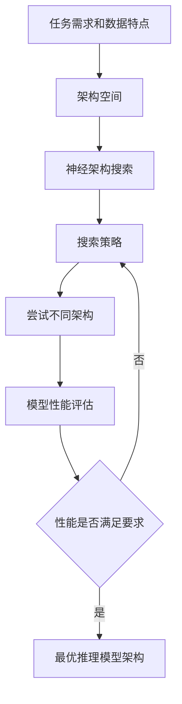

# 神经架构搜索在推理模型自动设计中的应用

> 关键词：神经架构搜索、推理模型、自动设计、深度学习、模型优化

> 摘要：本文围绕神经架构搜索在推理模型自动设计中的应用展开深入探讨。首先介绍了神经架构搜索和推理模型自动设计的背景知识，包括目的、预期读者、文档结构等内容。接着详细阐述了核心概念及其联系，通过文本示意图和 Mermaid 流程图直观展示。然后深入讲解核心算法原理，用 Python 代码进行具体操作步骤的演示。同时给出相关数学模型和公式，并举例说明。通过项目实战，展示了开发环境搭建、源代码实现与解读。分析了神经架构搜索在不同实际应用场景中的作用。推荐了学习资源、开发工具框架以及相关论文著作。最后总结未来发展趋势与挑战，给出常见问题解答和参考资料，旨在为读者全面呈现神经架构搜索在推理模型自动设计中的关键作用和应用方法。

## 1. 背景介绍 
### 1.1 目的和范围
随着深度学习的快速发展，模型的复杂度不断增加，手动设计推理模型架构变得越来越困难且耗时。神经架构搜索（Neural Architecture Search，NAS）作为一种自动化的方法，旨在自动发现最优的神经网络架构，提高推理模型的性能和效率。本文的目的在于深入探讨神经架构搜索在推理模型自动设计中的应用，涵盖从基本概念到具体算法实现，再到实际应用场景的全面内容。范围包括对神经架构搜索的核心算法原理、数学模型、项目实战案例的详细分析，以及相关工具和资源的推荐。

### 1.2 预期读者
本文预期读者包括对深度学习、人工智能领域感兴趣的研究人员、工程师、学生等。对于希望深入了解神经架构搜索技术，掌握推理模型自动设计方法的专业人士，以及想要学习相关理论和实践知识的初学者都具有一定的参考价值。

### 1.3 文档结构概述
本文将按照以下结构展开：首先介绍背景知识，包括目的、预期读者和文档结构概述；接着阐述神经架构搜索和推理模型自动设计的核心概念及其联系；然后详细讲解核心算法原理和具体操作步骤，给出相关数学模型和公式并举例说明；通过项目实战展示代码实现和详细解释；分析实际应用场景；推荐相关的工具和资源；最后总结未来发展趋势与挑战，提供常见问题解答和参考资料。

### 1.4 术语表
#### 1.4.1 核心术语定义
- **神经架构搜索（Neural Architecture Search，NAS）**：一种自动化的方法，通过搜索算法在架构空间中寻找最优的神经网络架构。
- **推理模型**：用于对输入数据进行预测或分类的深度学习模型。
- **自动设计**：利用算法自动生成模型架构，减少人工设计的工作量和主观性。
- **架构空间**：所有可能的神经网络架构的集合。
- **搜索策略**：用于在架构空间中搜索最优架构的方法。

#### 1.4.2 相关概念解释
- **深度学习**：一种基于人工神经网络的机器学习方法，通过多层神经元的组合来学习数据的特征和模式。
- **神经网络架构**：指神经网络的结构，包括层数、每层的神经元数量、连接方式等。
- **模型性能**：通常用准确率、召回率、F1 值等指标来衡量模型在任务上的表现。
- **模型效率**：包括模型的计算复杂度、内存占用等方面的指标。

#### 1.4.3 缩略词列表
- **NAS**：Neural Architecture Search（神经架构搜索）
- **CNN**：Convolutional Neural Network（卷积神经网络）
- **RNN**：Recurrent Neural Network（循环神经网络）
- **MLP**：Multi - Layer Perceptron（多层感知机）

## 2. 核心概念与联系 

### 2.1 神经架构搜索的核心概念
神经架构搜索的核心目标是在给定的架构空间中找到最优的神经网络架构。架构空间定义了所有可能的神经网络结构，搜索策略则用于在这个空间中进行探索。常见的搜索策略包括强化学习、进化算法、基于梯度的方法等。

#### 2.1.1 架构空间
架构空间可以是一个离散的空间，例如所有可能的卷积神经网络架构的集合。在这个空间中，每个架构可以用一组参数来表示，如层数、卷积核大小、通道数等。例如，一个简单的卷积神经网络架构可以表示为一个包含多个卷积层和全连接层的序列，每个层的参数可以是固定的几个取值。

#### 2.1.2 搜索策略
- **强化学习**：将架构搜索问题看作一个强化学习问题，通过智能体在架构空间中进行探索，根据奖励信号来调整搜索方向。智能体的动作是选择一个新的架构，奖励信号可以是模型在验证集上的性能。
- **进化算法**：模拟生物进化的过程，通过选择、交叉和变异等操作来不断优化架构种群。每个架构可以看作一个个体，种群中的个体通过竞争和合作来进化。
- **基于梯度的方法**：通过计算架构参数的梯度，直接在架构空间中进行优化。这种方法通常需要将架构参数表示为连续的变量，以便使用梯度下降等优化算法。

### 2.2 推理模型自动设计的核心概念
推理模型自动设计的目标是根据任务需求和数据特点，自动生成最优的推理模型架构。这需要考虑模型的性能、效率、可解释性等多个方面的因素。

#### 2.2.1 任务需求
不同的任务对模型的要求不同，例如图像分类任务通常需要模型具有较高的准确率，而实时目标检测任务则需要模型具有较低的延迟。因此，在自动设计推理模型时，需要根据具体的任务需求来选择合适的架构和参数。

#### 2.2.2 数据特点
数据的特点也会影响模型的设计。例如，图像数据通常具有空间相关性，因此适合使用卷积神经网络；而序列数据则更适合使用循环神经网络。此外，数据的规模、分布等也会影响模型的复杂度和性能。

### 2.3 核心概念的联系
神经架构搜索是实现推理模型自动设计的关键技术。通过神经架构搜索，可以在架构空间中找到满足任务需求和数据特点的最优推理模型架构。具体来说，神经架构搜索的搜索策略可以根据推理模型的性能反馈来调整搜索方向，从而不断优化模型架构。

### 2.4 文本示意图
神经架构搜索和推理模型自动设计的关系可以用以下文本示意图表示：

推理模型自动设计的任务需求和数据特点决定了架构空间的范围和搜索目标。神经架构搜索在这个架构空间中进行搜索，通过搜索策略不断尝试不同的架构，并根据模型的性能反馈来调整搜索方向。最终找到的最优架构即为自动设计的推理模型架构。

### 2.5 Mermaid 流程图


## 3. 核心算法原理 & 具体操作步骤 

### 3.1 基于强化学习的神经架构搜索算法原理
基于强化学习的神经架构搜索将架构搜索问题看作一个马尔可夫决策过程（Markov Decision Process，MDP）。在这个过程中，智能体（agent）在每个时间步选择一个动作（即选择一个新的架构），并根据环境的反馈（即模型的性能）获得一个奖励。智能体的目标是最大化长期累积奖励。

#### 3.1.1 马尔可夫决策过程定义
- **状态（State）**：表示当前的搜索状态，通常可以用已经探索过的架构信息来表示。
- **动作（Action）**：表示智能体在当前状态下可以选择的操作，即选择一个新的架构。
- **奖励（Reward）**：表示智能体执行动作后获得的反馈，通常是模型在验证集上的性能指标，如准确率、损失值等。
- **转移概率（Transition Probability）**：表示在当前状态下执行动作后转移到下一个状态的概率。

#### 3.1.2 策略网络
智能体的决策过程由一个策略网络（policy network）来实现。策略网络是一个神经网络，输入是当前状态，输出是动作的概率分布。智能体根据这个概率分布来选择动作。

#### 3.1.3 训练过程
策略网络的训练过程通常使用基于梯度的优化算法，如随机梯度下降（Stochastic Gradient Descent，SGD）或其变种。训练的目标是最大化智能体获得的长期累积奖励。

### 3.2 具体操作步骤

#### 3.2.1 初始化
- 定义架构空间，确定所有可能的架构表示和参数范围。
- 初始化策略网络的参数。
- 初始化环境，准备训练数据和验证数据。

#### 3.2.2 搜索过程
- 智能体根据当前状态和策略网络选择一个动作（即选择一个新的架构）。
- 根据选择的架构构建推理模型，并在训练数据上进行训练。
- 在验证数据上评估模型的性能，得到奖励。
- 根据奖励更新策略网络的参数，以提高智能体选择更优架构的概率。

#### 3.2.3 终止条件
搜索过程可以根据以下条件终止：
- 达到最大搜索步数。
- 模型的性能达到预设的阈值。

### 3.3 Python 源代码实现
```python
import torch
import torch.nn as nn
import torch.optim as optim
import numpy as np

# 定义架构空间
ARCH_SPACE = {
    'num_layers': [2, 3, 4],
    'hidden_size': [64, 128, 256]
}

# 定义策略网络
class PolicyNetwork(nn.Module):
    def __init__(self):
        super(PolicyNetwork, self).__init__()
        self.fc1 = nn.Linear(2, 16)
        self.fc2 = nn.Linear(16, len(ARCH_SPACE['num_layers']) * len(ARCH_SPACE['hidden_size']))
        self.softmax = nn.Softmax(dim=0)

    def forward(self, x):
        x = torch.relu(self.fc1(x))
        x = self.fc2(x)
        x = self.softmax(x)
        return x

# 定义推理模型
class InferenceModel(nn.Module):
    def __init__(self, num_layers, hidden_size):
        super(InferenceModel, self).__init__()
        layers = []
        for i in range(num_layers):
            if i == 0:
                layers.append(nn.Linear(10, hidden_size))
            else:
                layers.append(nn.Linear(hidden_size, hidden_size))
            layers.append(nn.ReLU())
        layers.append(nn.Linear(hidden_size, 1))
        self.model = nn.Sequential(*layers)

    def forward(self, x):
        return self.model(x)

# 训练推理模型
def train_model(model, train_data, train_labels, num_epochs=10, lr=0.001):
    criterion = nn.MSELoss()
    optimizer = optim.Adam(model.parameters(), lr=lr)
    for epoch in range(num_epochs):
        outputs = model(train_data)
        loss = criterion(outputs, train_labels)
        optimizer.zero_grad()
        loss.backward()
        optimizer.step()
    return loss.item()

# 评估推理模型
def evaluate_model(model, val_data, val_labels):
    with torch.no_grad():
        outputs = model(val_data)
        criterion = nn.MSELoss()
        loss = criterion(outputs, val_labels)
        return -loss.item()  # 奖励为负损失

# 神经架构搜索
def nas():
    policy_network = PolicyNetwork()
    optimizer = optim.Adam(policy_network.parameters(), lr=0.001)
    num_steps = 10
    for step in range(num_steps):
        # 选择动作
        state = torch.tensor([0.5, 0.5])
        action_probs = policy_network(state)
        action_index = np.random.choice(len(action_probs), p=action_probs.detach().numpy())
        num_layers_index = action_index // len(ARCH_SPACE['hidden_size'])
        hidden_size_index = action_index % len(ARCH_SPACE['hidden_size'])
        num_layers = ARCH_SPACE['num_layers'][num_layers_index]
        hidden_size = ARCH_SPACE['hidden_size'][hidden_size_index]

        # 构建推理模型
        model = InferenceModel(num_layers, hidden_size)

        # 生成训练数据和验证数据
        train_data = torch.randn(100, 10)
        train_labels = torch.randn(100, 1)
        val_data = torch.randn(20, 10)
        val_labels = torch.randn(20, 1)

        # 训练和评估模型
        train_model(model, train_data, train_labels)
        reward = evaluate_model(model, val_data, val_labels)

        # 更新策略网络
        log_prob = torch.log(action_probs[action_index])
        loss = -log_prob * reward
        optimizer.zero_grad()
        loss.backward()
        optimizer.step()

        print(f'Step {step}: Reward = {reward}')

if __name__ == '__main__':
    nas()
```

## 4. 数学模型和公式 & 详细讲解 & 举例说明 

### 4.1 马尔可夫决策过程的数学模型
马尔可夫决策过程可以用一个五元组 $<S, A, P, R, \gamma>$ 来表示，其中：
- $S$ 是状态空间，表示所有可能的状态集合。
- $A$ 是动作空间，表示所有可能的动作集合。
- $P: S \times A \times S \to [0, 1]$ 是转移概率函数，表示在状态 $s \in S$ 执行动作 $a \in A$ 后转移到状态 $s' \in S$ 的概率，即 $P(s'|s, a)$。
- $R: S \times A \to \mathbb{R}$ 是奖励函数，表示在状态 $s \in S$ 执行动作 $a \in A$ 后获得的奖励，即 $R(s, a)$。
- $\gamma \in [0, 1]$ 是折扣因子，用于权衡即时奖励和未来奖励的重要性。

### 4.2 策略网络的目标函数
策略网络的目标是最大化长期累积奖励，通常用期望回报来表示。期望回报可以定义为：
$$J(\theta) = \mathbb{E}_{\tau \sim \pi_{\theta}} \left[ \sum_{t=0}^{T} \gamma^t R(s_t, a_t) \right]$$
其中，$\theta$ 是策略网络的参数，$\pi_{\theta}$ 是由策略网络参数化的策略，$\tau = (s_0, a_0, s_1, a_1, \cdots, s_T, a_T)$ 是一个轨迹，$s_t$ 是时间步 $t$ 的状态，$a_t$ 是时间步 $t$ 的动作，$R(s_t, a_t)$ 是时间步 $t$ 的奖励。

### 4.3 基于梯度的优化
为了最大化期望回报 $J(\theta)$，可以使用基于梯度的优化算法。策略梯度定理表明，期望回报的梯度可以表示为：
$$\nabla_{\theta} J(\theta) = \mathbb{E}_{\tau \sim \pi_{\theta}} \left[ \sum_{t=0}^{T} \nabla_{\theta} \log \pi_{\theta}(a_t|s_t) \sum_{k=t}^{T} \gamma^{k - t} R(s_k, a_k) \right]$$
其中，$\pi_{\theta}(a_t|s_t)$ 是在状态 $s_t$ 下选择动作 $a_t$ 的概率。

### 4.4 举例说明
假设我们有一个简单的架构空间，只有两个参数：层数 $n$ 和隐藏单元数 $h$。状态空间 $S$ 可以表示为已经探索过的架构信息，动作空间 $A$ 可以表示为所有可能的 $(n, h)$ 组合。转移概率 $P(s'|s, a)$ 可以简化为确定性的转移，即选择一个动作后直接转移到对应的新状态。奖励函数 $R(s, a)$ 可以是模型在验证集上的准确率。

在训练过程中，策略网络根据当前状态 $s$ 输出动作的概率分布 $\pi_{\theta}(a|s)$。智能体根据这个概率分布选择一个动作 $a$，构建对应的推理模型并进行训练和评估，得到奖励 $R(s, a)$。然后根据策略梯度公式更新策略网络的参数 $\theta$，以提高选择更优架构的概率。

## 5. 项目实战：代码实际案例和详细解释说明 

### 5.1  开发环境搭建
#### 5.1.1 安装 Python
首先需要安装 Python 环境，建议使用 Python 3.6 及以上版本。可以从 Python 官方网站（https://www.python.org/downloads/） 下载并安装。

#### 5.1.2 安装深度学习框架
本文使用 PyTorch 作为深度学习框架，可以使用以下命令安装：
```sh
pip install torch torchvision
```

#### 5.1.3 安装其他依赖库
还需要安装一些其他的依赖库，如 NumPy、Matplotlib 等，可以使用以下命令安装：
```sh
pip install numpy matplotlib
```

### 5.2  源代码详细实现和代码解读
#### 5.2.1 架构空间定义
```python
ARCH_SPACE = {
    'num_layers': [2, 3, 4],
    'hidden_size': [64, 128, 256]
}
```
这里定义了一个简单的架构空间，包含两个参数：层数和隐藏单元数。每个参数都有几个可能的取值。

#### 5.2.2 策略网络定义
```python
class PolicyNetwork(nn.Module):
    def __init__(self):
        super(PolicyNetwork, self).__init__()
        self.fc1 = nn.Linear(2, 16)
        self.fc2 = nn.Linear(16, len(ARCH_SPACE['num_layers']) * len(ARCH_SPACE['hidden_size']))
        self.softmax = nn.Softmax(dim=0)

    def forward(self, x):
        x = torch.relu(self.fc1(x))
        x = self.fc2(x)
        x = self.softmax(x)
        return x
```
策略网络是一个简单的全连接神经网络，输入是一个二维向量，输出是所有可能动作的概率分布。

#### 5.2.3 推理模型定义
```python
class InferenceModel(nn.Module):
    def __init__(self, num_layers, hidden_size):
        super(InferenceModel, self).__init__()
        layers = []
        for i in range(num_layers):
            if i == 0:
                layers.append(nn.Linear(10, hidden_size))
            else:
                layers.append(nn.Linear(hidden_size, hidden_size))
            layers.append(nn.ReLU())
        layers.append(nn.Linear(hidden_size, 1))
        self.model = nn.Sequential(*layers)

    def forward(self, x):
        return self.model(x)
```
推理模型是一个多层感知机，根据选择的层数和隐藏单元数动态构建。

#### 5.2.4 训练和评估函数
```python
def train_model(model, train_data, train_labels, num_epochs=10, lr=0.001):
    criterion = nn.MSELoss()
    optimizer = optim.Adam(model.parameters(), lr=lr)
    for epoch in range(num_epochs):
        outputs = model(train_data)
        loss = criterion(outputs, train_labels)
        optimizer.zero_grad()
        loss.backward()
        optimizer.step()
    return loss.item()

def evaluate_model(model, val_data, val_labels):
    with torch.no_grad():
        outputs = model(val_data)
        criterion = nn.MSELoss()
        loss = criterion(outputs, val_labels)
        return -loss.item()  # 奖励为负损失
```
`train_model` 函数用于训练推理模型，`evaluate_model` 函数用于评估模型的性能，奖励为负损失。

#### 5.2.5 神经架构搜索主函数
```python
def nas():
    policy_network = PolicyNetwork()
    optimizer = optim.Adam(policy_network.parameters(), lr=0.001)
    num_steps = 10
    for step in range(num_steps):
        # 选择动作
        state = torch.tensor([0.5, 0.5])
        action_probs = policy_network(state)
        action_index = np.random.choice(len(action_probs), p=action_probs.detach().numpy())
        num_layers_index = action_index // len(ARCH_SPACE['hidden_size'])
        hidden_size_index = action_index % len(ARCH_SPACE['hidden_size'])
        num_layers = ARCH_SPACE['num_layers'][num_layers_index]
        hidden_size = ARCH_SPACE['hidden_size'][hidden_size_index]

        # 构建推理模型
        model = InferenceModel(num_layers, hidden_size)

        # 生成训练数据和验证数据
        train_data = torch.randn(100, 10)
        train_labels = torch.randn(100, 1)
        val_data = torch.randn(20, 10)
        val_labels = torch.randn(20, 1)

        # 训练和评估模型
        train_model(model, train_data, train_labels)
        reward = evaluate_model(model, val_data, val_labels)

        # 更新策略网络
        log_prob = torch.log(action_probs[action_index])
        loss = -log_prob * reward
        optimizer.zero_grad()
        loss.backward()
        optimizer.step()

        print(f'Step {step}: Reward = {reward}')
```
在 `nas` 函数中，首先初始化策略网络和优化器。然后进行多个搜索步骤，在每个步骤中，选择一个动作，构建推理模型，训练和评估模型，根据奖励更新策略网络的参数。

### 5.3  代码解读与分析
#### 5.3.1 策略网络的作用
策略网络的作用是根据当前状态输出动作的概率分布，智能体根据这个概率分布来选择动作。通过不断更新策略网络的参数，可以使智能体更倾向于选择能够获得更高奖励的动作。

#### 5.3.2 奖励的计算
奖励的计算是神经架构搜索的关键环节。在这个例子中，奖励定义为负损失，即模型在验证集上的损失越小，奖励越大。这样可以促使智能体选择性能更好的架构。

#### 5.3.3 策略网络的更新
策略网络的更新使用基于梯度的优化算法，通过计算策略梯度来更新网络的参数。策略梯度的计算基于策略梯度定理，根据选择动作的对数概率和获得的奖励来计算梯度。

## 6. 实际应用场景 
### 6.1 图像分类
在图像分类任务中，神经架构搜索可以自动设计出更高效、更准确的卷积神经网络架构。例如，在 ImageNet 图像分类竞赛中，通过神经架构搜索得到的架构在准确率和计算效率上都有显著提升。传统的手动设计卷积神经网络需要大量的专业知识和经验，而神经架构搜索可以在更广泛的架构空间中进行搜索，发现一些人类难以想到的架构组合。

### 6.2 目标检测
目标检测任务需要模型能够准确地定位和分类图像中的目标。神经架构搜索可以用于设计适合目标检测任务的网络架构，例如在 Faster R - CNN、YOLO 等目标检测算法中，通过搜索不同的特征提取网络和检测头架构，可以提高目标检测的精度和速度。

### 6.3 自然语言处理
在自然语言处理任务中，如文本分类、机器翻译、问答系统等，神经架构搜索可以自动设计出更适合处理序列数据的循环神经网络或Transformer 架构。例如，在机器翻译任务中，通过搜索不同的注意力机制和网络层数，可以提高翻译的质量和效率。

### 6.4 自动驾驶
自动驾驶系统需要处理大量的传感器数据，包括图像、雷达、激光雷达等。神经架构搜索可以用于设计适合自动驾驶任务的多模态融合模型架构，提高自动驾驶系统的感知和决策能力。例如，通过搜索不同的传感器融合方式和特征提取网络，可以提高目标检测和环境感知的准确性。

### 6.5 医疗影像诊断
在医疗影像诊断任务中，如X光、CT、MRI 等图像的疾病诊断，神经架构搜索可以自动设计出更适合医疗影像数据特点的卷积神经网络架构。医疗影像数据通常具有高分辨率、多通道等特点，传统的手动设计模型可能无法充分利用这些数据的信息。通过神经架构搜索，可以发现更有效的特征提取和分类架构，提高疾病诊断的准确率。

## 7. 工具和资源推荐
### 7.1 学习资源推荐
#### 7.1.1 书籍推荐
- 《深度学习》（Deep Learning）：由 Ian Goodfellow、Yoshua Bengio 和 Aaron Courville 所著，是深度学习领域的经典教材，涵盖了神经网络、优化算法、卷积神经网络、循环神经网络等多个方面的内容。
- 《动手学深度学习》（Dive into Deep Learning）：由 Aston Zhang、Zack C. Lipton、Mu Li 和 Alexander J. Smola 所著，提供了丰富的代码示例和实践指导，适合初学者快速上手深度学习。
- 《强化学习：原理与Python实现》：介绍了强化学习的基本原理和算法，包括马尔可夫决策过程、策略梯度算法等，对于理解神经架构搜索中的强化学习方法有很大帮助。

#### 7.1.2 在线课程
- Coursera 上的《深度学习专项课程》（Deep Learning Specialization）：由 Andrew Ng 教授授课，包括神经网络和深度学习、改善深层神经网络、结构化机器学习项目、卷积神经网络、序列模型等多个课程，全面介绍了深度学习的理论和实践。
- edX 上的《强化学习基础》（Fundamentals of Reinforcement Learning）：系统地介绍了强化学习的基本概念、算法和应用，对于理解神经架构搜索中的强化学习算法有很大帮助。
- 哔哩哔哩（B 站）上有很多关于深度学习和神经架构搜索的教学视频，如李宏毅的机器学习课程，讲解生动易懂，适合初学者学习。

#### 7.1.3 技术博客和网站
- Medium：是一个技术博客平台，上面有很多关于深度学习、神经架构搜索的最新研究成果和实践经验分享。
- arXiv：是一个预印本服务器，提供了大量的学术论文，包括神经架构搜索领域的最新研究进展。
- Towards Data Science：是一个专注于数据科学和机器学习的博客网站，有很多关于深度学习和神经架构搜索的优质文章。

### 7.2 开发工具框架推荐
#### 7.2.1 IDE和编辑器
- PyCharm：是一款专门为 Python 开发设计的集成开发环境（IDE），具有代码自动补全、调试、版本控制等功能，适合开发深度学习项目。
- Jupyter Notebook：是一个交互式的开发环境，可以在浏览器中编写和运行代码，同时可以添加文本说明和可视化结果，适合进行实验和数据分析。
- Visual Studio Code：是一个轻量级的代码编辑器，支持多种编程语言和插件扩展，对于深度学习开发也有很好的支持。

#### 7.2.2 调试和性能分析工具
- TensorBoard：是 TensorFlow 提供的一个可视化工具，可以用于可视化模型的训练过程、损失曲线、准确率曲线等，帮助调试和优化模型。
- PyTorch Profiler：是 PyTorch 提供的性能分析工具，可以分析模型的计算时间、内存占用等性能指标，帮助优化模型的性能。
- NVIDIA Nsight Systems：是 NVIDIA 提供的性能分析工具，可以对 GPU 加速的深度学习模型进行性能分析，帮助优化 GPU 利用率。

#### 7.2.3 相关框架和库
- PyTorch：是一个开源的深度学习框架，具有动态计算图、易于使用等特点，适合进行深度学习模型的开发和训练。
- TensorFlow：是另一个广泛使用的开源深度学习框架，具有强大的分布式训练和部署能力，适合大规模深度学习项目的开发。
- NASLib：是一个用于神经架构搜索的开源库，提供了多种搜索策略和架构空间的实现，方便开发者进行神经架构搜索的实验和研究。

### 7.3 相关论文著作推荐
#### 7.3.1 经典论文
- 《Neural Architecture Search with Reinforcement Learning》：首次提出了基于强化学习的神经架构搜索方法，为神经架构搜索领域的发展奠定了基础。
- 《Efficient Neural Architecture Search via Parameter Sharing》：提出了基于参数共享的高效神经架构搜索方法，大大减少了搜索的计算成本。
- 《ProxylessNAS: Direct Neural Architecture Search on Target Task and Hardware》：提出了直接在目标任务和硬件上进行神经架构搜索的方法，提高了搜索得到的架构在实际应用中的性能。

#### 7.3.2 最新研究成果
- 每年的国际机器学习会议（ICML）、神经信息处理系统大会（NeurIPS）、计算机视觉与模式识别会议（CVPR）等顶级学术会议上都会有很多关于神经架构搜索的最新研究成果发表。
- 在 arXiv 预印本服务器上可以及时获取到神经架构搜索领域的最新研究论文。

#### 7.3.3 应用案例分析
- 一些工业界的研究报告和技术博客会分享神经架构搜索在实际应用中的案例分析，如 Google、Facebook 等公司在图像识别、自然语言处理等领域的应用案例，可以从中学习到神经架构搜索在实际项目中的应用经验和技巧。

## 8. 总结：未来发展趋势与挑战
### 8.1 未来发展趋势
#### 8.1.1 更高效的搜索算法
未来的神经架构搜索算法将更加注重效率的提升，通过引入新的搜索策略和优化方法，减少搜索的计算成本和时间。例如，基于元学习的方法可以利用先前的搜索经验来加速新的搜索过程。

#### 8.1.2 与硬件的深度融合
随着硬件技术的不断发展，神经架构搜索将更加注重与硬件的深度融合。通过考虑硬件的特性和限制，如计算资源、内存带宽等，设计出更适合硬件平台的高效推理模型架构。

#### 8.1.3 多模态和跨领域应用
未来的神经架构搜索将不仅仅局限于单一模态的数据和任务，而是会向多模态和跨领域应用发展。例如，在自动驾驶、医疗影像诊断等领域，需要处理多种类型的数据，神经架构搜索可以用于设计多模态融合的模型架构。

#### 8.1.4 可解释性和可泛化性的提升
目前的神经架构搜索方法主要关注模型的性能，而对模型的可解释性和可泛化性关注较少。未来的研究将更加注重提高搜索得到的模型的可解释性和可泛化性，使模型在不同的数据集和任务上都能有较好的表现。

### 8.2 挑战
#### 8.2.1 计算资源的限制
神经架构搜索通常需要大量的计算资源，尤其是在大规模的架构空间中进行搜索时。如何在有限的计算资源下进行高效的搜索是一个亟待解决的问题。

#### 8.2.2 搜索空间的设计
搜索空间的设计对神经架构搜索的性能有很大的影响。如何设计一个合理的搜索空间，既能够包含足够多的有潜力的架构，又不会过于庞大，是一个挑战。

#### 8.2.3 模型的可解释性
深度学习模型通常被认为是“黑盒”模型，缺乏可解释性。神经架构搜索得到的模型也面临同样的问题。如何提高模型的可解释性，使人们能够理解模型的决策过程，是一个重要的研究方向。

#### 8.2.4 泛化能力的提升
神经架构搜索得到的模型在训练集上可能有很好的性能，但在测试集或实际应用中可能表现不佳。如何提高模型的泛化能力，使模型在不同的数据集和任务上都能有较好的表现，是一个需要解决的问题。

## 9. 附录：常见问题与解答
### 9.1 神经架构搜索和手动设计模型有什么区别？
神经架构搜索是一种自动化的方法，通过算法在架构空间中搜索最优的神经网络架构，减少了人工设计的工作量和主观性。而手动设计模型需要开发者具备丰富的专业知识和经验，通过试错的方式来选择合适的架构和参数。神经架构搜索可以在更广泛的架构空间中进行搜索，有可能发现一些人类难以想到的架构组合，从而提高模型的性能。

### 9.2 神经架构搜索的计算成本高吗？
神经架构搜索通常需要大量的计算资源，尤其是在大规模的架构空间中进行搜索时。搜索过程中需要训练和评估大量的模型，这会消耗大量的计算时间和内存。不过，近年来的研究提出了一些高效的搜索算法，如基于参数共享的方法，可以大大减少搜索的计算成本。

### 9.3 如何选择合适的搜索策略？
选择合适的搜索策略需要考虑多个因素，如架构空间的大小、计算资源的限制、任务的特点等。如果架构空间较小，可以使用穷举搜索或随机搜索等简单的方法；如果架构空间较大，可以使用强化学习、进化算法等更复杂的搜索策略。此外，还可以根据任务的特点选择合适的搜索策略，例如对于需要快速收敛的任务，可以选择基于梯度的搜索方法。

### 9.4 神经架构搜索得到的模型一定比手动设计的模型好吗？
不一定。神经架构搜索得到的模型在某些情况下可能比手动设计的模型好，但在其他情况下可能不如手动设计的模型。这取决于搜索空间的设计、搜索策略的选择、数据集的特点等多个因素。神经架构搜索只是一种辅助工具，不能完全替代人类的专业知识和经验。在实际应用中，可以结合手动设计和神经架构搜索的方法，来设计出更好的模型。

## 10. 扩展阅读 & 参考资料
### 10.1 扩展阅读
- 《深度学习实战》：提供了更多深度学习项目的实战案例，包括图像分类、目标检测、自然语言处理等任务，有助于深入理解深度学习的应用。
- 《人工智能：现代方法》：全面介绍了人工智能的基本概念、算法和应用，对于了解人工智能的整体框架和发展趋势有很大帮助。

### 10.2 参考资料
- Goodfellow, I., Bengio, Y., & Courville, A. (2016). Deep Learning. MIT Press.
- Zhang, A., Lipton, Z. C., Li, M., & Smola, A. J. (2020). Dive into Deep Learning.
- Zoph, B., & Le, Q. V. (2016). Neural Architecture Search with Reinforcement Learning. arXiv preprint arXiv:1611.01578.
- Pham, H., Guan, M. Y., Zoph, B., Le, Q. V., & Dean, J. (2018). Efficient Neural Architecture Search via Parameter Sharing. arXiv preprint arXiv:1802.03268.
- Cai, H., Zhu, L., & Han, S. (2018). ProxylessNAS: Direct Neural Architecture Search on Target Task and Hardware. arXiv preprint arXiv:1812.00332.