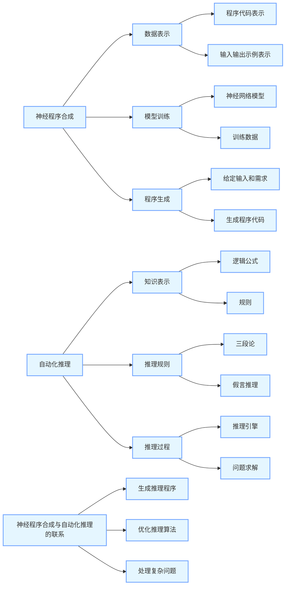

# 神经程序合成在自动化推理中的探索

> 关键词：神经程序合成、自动化推理、深度学习、程序生成、逻辑推理

> 摘要：本文深入探讨了神经程序合成在自动化推理领域的应用。首先介绍了神经程序合成和自动化推理的背景知识，明确了研究目的和范围。接着详细阐述了核心概念及其联系，包括神经程序合成的原理和架构。通过Python代码讲解了核心算法原理和具体操作步骤，并给出了相关的数学模型和公式。在项目实战部分，提供了代码实际案例及详细解释。分析了神经程序合成在自动化推理中的实际应用场景，推荐了学习、开发工具及相关论文著作。最后总结了未来发展趋势与挑战，解答了常见问题并提供了扩展阅读和参考资料，旨在为相关领域的研究和实践提供全面的指导。

## 1. 背景介绍 
### 1.1 目的和范围
随着人工智能技术的不断发展，自动化推理成为解决复杂问题的关键手段之一。神经程序合成作为一种新兴技术，旨在利用神经网络自动生成满足特定需求的程序。本研究的目的在于探索神经程序合成在自动化推理中的应用，通过将程序合成与推理任务相结合，提高推理的效率和准确性。研究范围涵盖了神经程序合成的基本原理、算法实现、数学模型，以及在不同自动化推理场景中的应用案例。

### 1.2 预期读者
本文预期读者包括人工智能、计算机科学领域的研究人员、工程师和学生。对于对自动化推理和神经程序合成感兴趣的初学者，本文可以作为入门教程，帮助他们了解相关概念和技术。对于有一定经验的专业人士，本文提供了深入的技术分析和实际应用案例，可作为进一步研究和实践的参考。

### 1.3 文档结构概述
本文共分为十个部分。第一部分介绍了研究的背景，包括目的、范围、预期读者和文档结构概述。第二部分阐述了神经程序合成和自动化推理的核心概念及其联系。第三部分详细讲解了核心算法原理和具体操作步骤，并给出了Python代码示例。第四部分介绍了相关的数学模型和公式，并进行了详细讲解和举例说明。第五部分通过项目实战，展示了代码的实际案例和详细解释。第六部分分析了神经程序合成在自动化推理中的实际应用场景。第七部分推荐了学习资源、开发工具和相关论文著作。第八部分总结了未来发展趋势与挑战。第九部分解答了常见问题。第十部分提供了扩展阅读和参考资料。

### 1.4 术语表
#### 1.4.1 核心术语定义
- **神经程序合成**：利用神经网络自动生成满足特定功能需求的程序的技术。
- **自动化推理**：通过计算机程序自动进行逻辑推理和问题求解的过程。
- **深度学习**：一类基于人工神经网络的机器学习技术，通过多层神经网络学习数据的特征和模式。
- **程序生成**：根据给定的规范或需求，自动生成计算机程序的过程。
- **逻辑推理**：依据逻辑规则从已知前提推导出结论的过程。

#### 1.4.2 相关概念解释
- **神经网络**：由大量神经元组成的计算模型，能够自动学习数据的特征和模式。常见的神经网络包括卷积神经网络（CNN）、循环神经网络（RNN）和长短时记忆网络（LSTM）等。
- **生成式模型**：用于生成新数据的模型，如生成对抗网络（GAN）和变分自编码器（VAE）。在神经程序合成中，生成式模型可以用于生成程序代码。
- **推理引擎**：自动化推理系统的核心组件，负责根据逻辑规则和已知事实进行推理。常见的推理引擎包括Drools、Jena等。

#### 1.4.3 缩略词列表
- **CNN**：Convolutional Neural Network（卷积神经网络）
- **RNN**：Recurrent Neural Network（循环神经网络）
- **LSTM**：Long Short-Term Memory（长短时记忆网络）
- **GAN**：Generative Adversarial Network（生成对抗网络）
- **VAE**：Variational Autoencoder（变分自编码器）

## 2. 核心概念与联系 
### 2.1 神经程序合成原理
神经程序合成的核心思想是利用神经网络学习程序的语法和语义信息，从而自动生成满足特定需求的程序。其基本原理可以分为以下几个步骤：
1. **数据表示**：将程序代码和相关的输入输出示例表示为神经网络可以处理的形式，如向量、矩阵等。
2. **模型训练**：使用大量的程序代码和输入输出示例作为训练数据，训练神经网络模型。训练过程中，模型学习程序的语法和语义规则，以及输入输出之间的映射关系。
3. **程序生成**：在训练好的模型基础上，根据给定的输入和需求，生成满足条件的程序代码。

### 2.2 自动化推理原理
自动化推理是指通过计算机程序自动进行逻辑推理和问题求解的过程。其基本原理可以分为以下几个步骤：
1. **知识表示**：将领域知识和问题描述表示为逻辑公式或规则，如一阶逻辑、谓词逻辑等。
2. **推理规则**：定义一组推理规则，如三段论、假言推理等，用于从已知前提推导出结论。
3. **推理过程**：根据知识表示和推理规则，使用推理引擎进行推理，得到问题的解。

### 2.3 神经程序合成与自动化推理的联系
神经程序合成和自动化推理之间存在着密切的联系。一方面，神经程序合成可以为自动化推理提供有效的程序生成工具，帮助自动化推理系统生成复杂的推理程序。另一方面，自动化推理可以为神经程序合成提供逻辑约束和验证机制，确保生成的程序符合逻辑规则和问题需求。具体来说，神经程序合成可以用于以下几个方面来支持自动化推理：
1. **生成推理程序**：根据自动化推理的需求，生成用于逻辑推理的程序代码，如定理证明程序、知识图谱推理程序等。
2. **优化推理算法**：通过神经程序合成优化自动化推理算法，提高推理的效率和准确性。
3. **处理复杂问题**：对于一些复杂的推理问题，神经程序合成可以生成具有复杂逻辑结构的程序，帮助自动化推理系统解决问题。

### 2.4 核心概念架构的文本示意图
```plaintext
神经程序合成
|-- 数据表示
|   |-- 程序代码表示
|   |-- 输入输出示例表示
|-- 模型训练
|   |-- 神经网络模型
|   |-- 训练数据
|-- 程序生成
|   |-- 给定输入和需求
|   |-- 生成程序代码

自动化推理
|-- 知识表示
|   |-- 逻辑公式
|   |-- 规则
|-- 推理规则
|   |-- 三段论
|   |-- 假言推理
|-- 推理过程
|   |-- 推理引擎
|   |-- 问题求解

神经程序合成与自动化推理的联系
|-- 生成推理程序
|-- 优化推理算法
|-- 处理复杂问题
```

### 2.5 Mermaid流程图


## 3. 核心算法原理 & 具体操作步骤 
### 3.1 核心算法原理
神经程序合成的核心算法通常基于深度学习模型，如循环神经网络（RNN）、长短时记忆网络（LSTM）或生成对抗网络（GAN）等。下面以LSTM为例，介绍神经程序合成的核心算法原理。

LSTM是一种特殊的RNN，能够有效处理序列数据中的长距离依赖问题。在神经程序合成中，LSTM可以用于学习程序代码的语法和语义信息，从而生成新的程序代码。具体来说，LSTM的工作原理如下：
1. **输入层**：将程序代码和输入输出示例表示为向量序列，作为LSTM的输入。
2. **隐藏层**：LSTM的隐藏层包含多个LSTM单元，每个单元包含输入门、遗忘门和输出门。这些门控机制可以控制信息的流动，从而处理长距离依赖问题。
3. **输出层**：LSTM的输出层将隐藏层的输出转换为程序代码的概率分布，根据概率分布生成新的程序代码。

### 3.2 具体操作步骤
下面是使用Python和PyTorch实现基于LSTM的神经程序合成的具体操作步骤：

#### 3.2.1 数据预处理
首先，我们需要将程序代码和输入输出示例进行预处理，将其转换为LSTM可以处理的向量序列。以下是一个简单的数据预处理示例：
```python
import torch
from torch.utils.data import Dataset, DataLoader

# 定义数据集类
class ProgramDataset(Dataset):
    def __init__(self, programs, inputs, outputs):
        self.programs = programs
        self.inputs = inputs
        self.outputs = outputs
    
    def __len__(self):
        return len(self.programs)
    
    def __getitem__(self, idx):
        program = self.programs[idx]
        input_data = self.inputs[idx]
        output_data = self.outputs[idx]
        # 这里需要将程序、输入和输出转换为向量表示
        # 例如，可以使用词嵌入将程序代码转换为向量序列
        return program, input_data, output_data

# 示例数据
programs = ["print('Hello, World!')", "x = 1; y = 2; print(x + y)"]
inputs = [None, None]
outputs = [None, None]

# 创建数据集和数据加载器
dataset = ProgramDataset(programs, inputs, outputs)
dataloader = DataLoader(dataset, batch_size=1, shuffle=True)
```

#### 3.2.2 定义LSTM模型
接下来，我们定义一个基于LSTM的神经程序合成模型：
```python
import torch.nn as nn

class ProgramSynthesisModel(nn.Module):
    def __init__(self, input_size, hidden_size, output_size):
        super(ProgramSynthesisModel, self).__init__()
        self.lstm = nn.LSTM(input_size, hidden_size, batch_first=True)
        self.fc = nn.Linear(hidden_size, output_size)
    
    def forward(self, x):
        out, _ = self.lstm(x)
        out = self.fc(out[:, -1, :])
        return out

# 模型参数
input_size = 100  # 输入向量的维度
hidden_size = 200  # 隐藏层的维度
output_size = 1000  # 输出向量的维度

# 创建模型
model = ProgramSynthesisModel(input_size, hidden_size, output_size)
```

#### 3.2.3 训练模型
然后，我们使用数据集对模型进行训练：
```python
import torch.optim as optim

# 定义损失函数和优化器
criterion = nn.CrossEntropyLoss()
optimizer = optim.Adam(model.parameters(), lr=0.001)

# 训练模型
num_epochs = 10
for epoch in range(num_epochs):
    for program, input_data, output_data in dataloader:
        # 这里需要将程序、输入和输出转换为模型可以处理的张量
        # 例如，可以使用词嵌入将程序代码转换为张量
        optimizer.zero_grad()
        outputs = model(input_data)
        loss = criterion(outputs, output_data)
        loss.backward()
        optimizer.step()
    print(f'Epoch {epoch+1}/{num_epochs}, Loss: {loss.item()}')
```

#### 3.2.4 生成程序
最后，我们可以使用训练好的模型生成新的程序代码：
```python
# 生成程序
input_data = torch.randn(1, 1, input_size)  # 示例输入
with torch.no_grad():
    output = model(input_data)
    # 根据输出的概率分布生成程序代码
    # 例如，可以使用贪心搜索或束搜索生成程序代码
    program = generate_program(output)
    print(program)
```

## 4. 数学模型和公式 & 详细讲解 & 举例说明 
### 4.1 数学模型
在神经程序合成中，我们可以使用概率模型来描述程序生成的过程。假设我们有一个输入 $x$ 和一个程序 $p$，我们的目标是计算在给定输入 $x$ 的情况下生成程序 $p$ 的概率 $P(p|x)$。

根据贝叶斯定理，我们可以将 $P(p|x)$ 表示为：
$$P(p|x)=\frac{P(x|p)P(p)}{P(x)}$$
其中，$P(x|p)$ 表示在给定程序 $p$ 的情况下生成输入 $x$ 的概率，$P(p)$ 表示程序 $p$ 的先验概率，$P(x)$ 表示输入 $x$ 的概率。

在实际应用中，我们通常使用神经网络来近似计算 $P(p|x)$。例如，我们可以使用一个LSTM模型来计算 $P(p|x)$，其中LSTM的输入是输入 $x$，输出是程序 $p$ 的概率分布。

### 4.2 公式详细讲解
#### 4.2.1 LSTM单元的计算公式
LSTM单元包含输入门 $i_t$、遗忘门 $f_t$、输出门 $o_t$ 和细胞状态 $C_t$。其计算公式如下：
- 输入门：
$$i_t=\sigma(W_{ii}x_t + W_{hi}h_{t-1}+b_i)$$
- 遗忘门：
$$f_t=\sigma(W_{if}x_t + W_{hf}h_{t-1}+b_f)$$
- 细胞状态更新：
$$\tilde{C}_t=\tanh(W_{ic}x_t + W_{hc}h_{t-1}+b_c)$$
$$C_t=f_t\odot C_{t-1}+i_t\odot\tilde{C}_t$$
- 输出门：
$$o_t=\sigma(W_{io}x_t + W_{ho}h_{t-1}+b_o)$$
$$h_t=o_t\odot\tanh(C_t)$$
其中，$x_t$ 是输入向量，$h_{t-1}$ 是上一时刻的隐藏状态，$W_{ii}$、$W_{hi}$、$W_{if}$、$W_{hf}$、$W_{ic}$、$W_{hc}$、$W_{io}$、$W_{ho}$ 是权重矩阵，$b_i$、$b_f$、$b_c$、$b_o$ 是偏置向量，$\sigma$ 是 sigmoid 函数，$\tanh$ 是双曲正切函数，$\odot$ 表示逐元素相乘。

#### 4.2.2 交叉熵损失函数
在训练神经程序合成模型时，我们通常使用交叉熵损失函数来衡量模型预测的概率分布与真实概率分布之间的差异。交叉熵损失函数的计算公式如下：
$$L=-\sum_{i=1}^{n}y_i\log(p_i)$$
其中，$y_i$ 是真实概率分布，$p_i$ 是模型预测的概率分布，$n$ 是类别数。

### 4.3 举例说明
假设我们有一个简单的程序合成任务，输入是一个整数 $x$，输出是 $x$ 的平方。我们可以使用一个简单的LSTM模型来完成这个任务。

#### 4.3.1 数据表示
我们可以将输入 $x$ 表示为一个向量，例如 $[x]$。程序代码可以使用词嵌入将其转换为向量序列。

#### 4.3.2 模型训练
我们可以使用上述的LSTM单元计算公式和交叉熵损失函数来训练模型。假设我们有以下训练数据：
| 输入 $x$ | 程序 $p$ |
| ---- | ---- |
| 2 | `print(2 * 2)` |
| 3 | `print(3 * 3)` |
| 4 | `print(4 * 4)` |

我们可以将输入 $x$ 和程序 $p$ 转换为向量序列，然后使用这些数据来训练LSTM模型。

#### 4.3.3 程序生成
在训练好的模型基础上，我们可以输入一个新的整数 $x$，例如 $5$，然后根据模型输出的概率分布生成程序代码，例如 `print(5 * 5)`。

## 5. 项目实战：代码实际案例和详细解释说明 
### 5.1 开发环境搭建
#### 5.1.1 安装Python
首先，我们需要安装Python。建议使用Python 3.6及以上版本。可以从Python官方网站（https://www.python.org/downloads/）下载并安装Python。

#### 5.1.2 安装PyTorch
PyTorch是一个开源的深度学习框架，我们可以使用它来实现神经程序合成模型。可以根据自己的操作系统和CUDA版本，从PyTorch官方网站（https://pytorch.org/get-started/locally/）选择合适的安装方式。例如，如果你使用的是CPU版本的PyTorch，可以使用以下命令进行安装：
```sh
pip install torch torchvision
```

#### 5.1.3 安装其他依赖库
除了PyTorch，我们还需要安装一些其他的依赖库，如numpy、tqdm等。可以使用以下命令进行安装：
```sh
pip install numpy tqdm
```

### 5.2 源代码详细实现和代码解读
#### 5.2.1 数据准备
我们使用一个简单的数据集，包含一些输入输出示例和对应的程序代码。以下是数据准备的代码：
```python
import torch
from torch.utils.data import Dataset, DataLoader

# 示例数据
programs = ["print(2 * 2)", "print(3 * 3)", "print(4 * 4)"]
inputs = [[2], [3], [4]]
outputs = [[4], [9], [16]]

# 定义数据集类
class ProgramDataset(Dataset):
    def __init__(self, programs, inputs, outputs):
        self.programs = programs
        self.inputs = inputs
        self.outputs = outputs
    
    def __len__(self):
        return len(self.programs)
    
    def __getitem__(self, idx):
        program = self.programs[idx]
        input_data = torch.tensor(self.inputs[idx], dtype=torch.float32)
        output_data = torch.tensor(self.outputs[idx], dtype=torch.float32)
        return program, input_data, output_data

# 创建数据集和数据加载器
dataset = ProgramDataset(programs, inputs, outputs)
dataloader = DataLoader(dataset, batch_size=1, shuffle=True)
```
代码解读：
- 我们定义了一个 `ProgramDataset` 类，继承自 `torch.utils.data.Dataset`，用于封装数据集。
- `__init__` 方法初始化数据集，接收程序代码、输入和输出作为参数。
- `__len__` 方法返回数据集的长度。
- `__getitem__` 方法根据索引返回程序代码、输入和输出，并将输入和输出转换为PyTorch张量。
- 最后，我们创建了数据集和数据加载器，用于批量加载数据。

#### 5.2.2 定义模型
我们使用一个简单的LSTM模型来实现神经程序合成。以下是模型定义的代码：
```python
import torch.nn as nn

class ProgramSynthesisModel(nn.Module):
    def __init__(self, input_size, hidden_size, output_size):
        super(ProgramSynthesisModel, self).__init__()
        self.lstm = nn.LSTM(input_size, hidden_size, batch_first=True)
        self.fc = nn.Linear(hidden_size, output_size)
    
    def forward(self, x):
        x = x.unsqueeze(1)  # 添加一个维度以满足LSTM的输入要求
        out, _ = self.lstm(x)
        out = self.fc(out[:, -1, :])
        return out

# 模型参数
input_size = 1
hidden_size = 10
output_size = 1

# 创建模型
model = ProgramSynthesisModel(input_size, hidden_size, output_size)
```
代码解读：
- 我们定义了一个 `ProgramSynthesisModel` 类，继承自 `torch.nn.Module`，用于定义模型。
- `__init__` 方法初始化模型，包含一个LSTM层和一个全连接层。
- `forward` 方法定义了模型的前向传播过程，将输入通过LSTM层和全连接层得到输出。
- 最后，我们创建了模型实例。

#### 5.2.3 训练模型
以下是模型训练的代码：
```python
import torch.optim as optim
from tqdm import tqdm

# 定义损失函数和优化器
criterion = nn.MSELoss()
optimizer = optim.Adam(model.parameters(), lr=0.001)

# 训练模型
num_epochs = 100
for epoch in tqdm(range(num_epochs)):
    for program, input_data, output_data in dataloader:
        optimizer.zero_grad()
        outputs = model(input_data)
        loss = criterion(outputs, output_data)
        loss.backward()
        optimizer.step()
    if (epoch + 1) % 10 == 0:
        print(f'Epoch {epoch+1}/{num_epochs}, Loss: {loss.item()}')
```
代码解读：
- 我们使用均方误差损失函数（`nn.MSELoss`）和Adam优化器来训练模型。
- 在每个epoch中，我们遍历数据集，计算模型的输出和损失，并进行反向传播和参数更新。
- 每10个epoch打印一次损失值。

#### 5.2.4 生成程序
以下是生成程序的代码：
```python
# 生成程序
input_data = torch.tensor([[5]], dtype=torch.float32)
with torch.no_grad():
    output = model(input_data)
    print(f'Input: 5, Output: {output.item()}')
```
代码解读：
- 我们输入一个新的整数 $5$，使用训练好的模型生成输出。
- 使用 `torch.no_grad()` 上下文管理器禁用梯度计算，以提高计算效率。
- 最后打印输入和输出。

### 5.3 代码解读与分析
#### 5.3.1 数据处理
在数据处理部分，我们将输入和输出转换为PyTorch张量，以便模型可以处理。同时，我们使用 `DataLoader` 批量加载数据，提高训练效率。

#### 5.3.2 模型设计
在模型设计部分，我们使用了一个简单的LSTM模型，包含一个LSTM层和一个全连接层。LSTM层用于学习输入序列的特征，全连接层用于将特征映射到输出空间。

#### 5.3.3 训练过程
在训练过程中，我们使用均方误差损失函数来衡量模型的输出和真实输出之间的差异，并使用Adam优化器进行参数更新。通过多次迭代训练，模型逐渐学习到输入和输出之间的映射关系。

#### 5.3.4 程序生成
在程序生成部分，我们输入一个新的输入，使用训练好的模型生成输出。由于我们的模型是一个简单的回归模型，输出是一个数值。在实际应用中，我们可以根据输出的概率分布生成程序代码。

## 6. 实际应用场景 
### 6.1 定理证明
在数学和逻辑领域，定理证明是一个重要的任务。神经程序合成可以用于生成定理证明程序，帮助数学家和逻辑学家自动证明定理。例如，我们可以使用神经程序合成生成一个程序，该程序可以根据给定的公理和推理规则，自动推导出定理的证明过程。

### 6.2 知识图谱推理
知识图谱是一种用于表示和存储知识的图结构。神经程序合成可以用于生成知识图谱推理程序，帮助知识图谱系统自动进行推理和问答。例如，我们可以使用神经程序合成生成一个程序，该程序可以根据知识图谱中的实体和关系，自动回答用户的问题。

### 6.3 智能编程助手
在软件开发领域，神经程序合成可以用于开发智能编程助手。智能编程助手可以根据用户的需求和输入，自动生成程序代码。例如，当用户输入一个功能需求时，智能编程助手可以使用神经程序合成生成满足该需求的程序代码。

### 6.4 自动化测试用例生成
在软件测试领域，自动化测试用例生成是一个重要的任务。神经程序合成可以用于生成自动化测试用例，帮助测试人员自动生成测试用例。例如，我们可以使用神经程序合成生成一个程序，该程序可以根据软件的功能需求和输入输出规范，自动生成测试用例。

## 7. 工具和资源推荐
### 7.1 学习资源推荐
#### 7.1.1 书籍推荐
- 《深度学习》（Deep Learning）：由Ian Goodfellow、Yoshua Bengio和Aaron Courville所著，是深度学习领域的经典教材，涵盖了深度学习的基本原理、算法和应用。
- 《Python深度学习》（Deep Learning with Python）：由Francois Chollet所著，以Python和Keras为工具，介绍了深度学习的实践方法和应用案例。
- 《人工智能：一种现代的方法》（Artificial Intelligence: A Modern Approach）：由Stuart Russell和Peter Norvig所著，是人工智能领域的经典教材，涵盖了人工智能的各个方面，包括自动化推理和机器学习。

#### 7.1.2 在线课程
- Coursera上的“深度学习专项课程”（Deep Learning Specialization）：由Andrew Ng教授授课，包括深度学习基础、卷积神经网络、循环神经网络等内容。
- edX上的“人工智能导论”（Introduction to Artificial Intelligence）：由麻省理工学院（MIT）提供，介绍了人工智能的基本概念、算法和应用。
- Udemy上的“Python for Data Science and Machine Learning Bootcamp”：介绍了Python在数据科学和机器学习中的应用，包括数据处理、可视化、机器学习算法等内容。

#### 7.1.3 技术博客和网站
- Medium：是一个技术博客平台，有很多关于深度学习、人工智能和神经程序合成的文章。
- Towards Data Science：是一个专注于数据科学和机器学习的技术博客，有很多高质量的文章和教程。
- ArXiv：是一个预印本平台，有很多关于深度学习和人工智能的最新研究成果。

### 7.2 开发工具框架推荐
#### 7.2.1 IDE和编辑器
- PyCharm：是一个专业的Python集成开发环境（IDE），提供了代码编辑、调试、版本控制等功能。
- Jupyter Notebook：是一个交互式的笔记本环境，适合进行数据分析和模型训练。
- Visual Studio Code：是一个轻量级的代码编辑器，支持多种编程语言和插件，适合进行快速开发和调试。

#### 7.2.2 调试和性能分析工具
- PyTorch Profiler：是PyTorch提供的性能分析工具，可以帮助我们分析模型的训练和推理性能。
- TensorBoard：是TensorFlow提供的可视化工具，可以帮助我们可视化模型的训练过程和性能指标。
- cProfile：是Python内置的性能分析工具，可以帮助我们分析Python代码的性能瓶颈。

#### 7.2.3 相关框架和库
- PyTorch：是一个开源的深度学习框架，提供了丰富的神经网络层和优化算法，适合进行神经程序合成的研究和开发。
- TensorFlow：是另一个开源的深度学习框架，具有广泛的应用和丰富的工具集。
- NLTK：是一个自然语言处理工具包，提供了丰富的文本处理和分析功能，适合进行程序代码的处理和分析。

### 7.3 相关论文著作推荐
#### 7.3.1 经典论文
- “Neural Program Synthesis: A Survey”：对神经程序合成的研究进行了全面的综述，介绍了神经程序合成的基本概念、算法和应用。
- “Learning to Program with a Neural Programmer-Interpreter”：提出了一种基于神经程序员-解释器的神经程序合成方法，通过将程序合成问题转化为序列生成问题，利用神经网络进行程序生成。
- “Generating Programs by Learning from Examples”：提出了一种基于示例学习的神经程序合成方法，通过学习大量的程序示例，生成满足特定需求的程序代码。

#### 7.3.2 最新研究成果
- 在ArXiv上搜索“Neural Program Synthesis”和“Automated Reasoning”，可以找到很多关于神经程序合成和自动化推理的最新研究成果。
- 参加相关的学术会议，如NeurIPS、ICML、AAAI等，了解最新的研究动态和技术进展。

#### 7.3.3 应用案例分析
- 一些开源项目和研究论文中提供了神经程序合成在自动化推理中的应用案例，如定理证明、知识图谱推理等。可以通过阅读这些案例，了解神经程序合成的实际应用场景和效果。

## 8. 总结：未来发展趋势与挑战
### 8.1 未来发展趋势
#### 8.1.1 与强化学习的结合
未来，神经程序合成可能会与强化学习相结合，通过强化学习的方法优化程序生成过程，提高程序的质量和效率。例如，我们可以使用强化学习来训练神经程序合成模型，使其能够在不同的环境中生成最优的程序代码。

#### 8.1.2 多模态信息的利用
除了程序代码和输入输出示例，未来的神经程序合成可能会利用更多的多模态信息，如图像、语音等，来生成更加复杂和智能的程序。例如，我们可以使用图像识别技术识别用户的手势或表情，然后根据这些信息生成相应的程序代码。

#### 8.1.3 跨领域应用
神经程序合成在自动化推理中的应用可能会扩展到更多的领域，如医疗、金融、交通等。例如，在医疗领域，神经程序合成可以用于生成医疗诊断程序，帮助医生进行疾病诊断和治疗方案制定。

### 8.2 挑战
#### 8.2.1 数据稀缺性
神经程序合成需要大量的程序代码和输入输出示例作为训练数据。然而，在某些领域，如科学研究和工程设计，高质量的程序代码和输入输出示例往往比较稀缺，这给神经程序合成的训练带来了挑战。

#### 8.2.2 程序可解释性
神经程序合成生成的程序往往是黑盒模型，难以解释其生成过程和决策依据。在一些对安全性和可靠性要求较高的领域，如医疗和金融，程序的可解释性是一个重要的问题。

#### 8.2.3 计算资源需求
神经程序合成通常需要大量的计算资源来训练和运行模型。在实际应用中，如何在有限的计算资源下提高模型的性能和效率是一个挑战。

## 9. 附录：常见问题与解答
### 9.1 神经程序合成和传统程序合成有什么区别？
传统程序合成通常基于规则和逻辑推理，需要人工定义规则和约束条件，然后通过搜索算法生成满足条件的程序代码。而神经程序合成利用神经网络自动学习程序的语法和语义信息，通过训练数据生成程序代码，不需要人工定义复杂的规则和约束条件。

### 9.2 神经程序合成生成的程序代码质量如何保证？
神经程序合成生成的程序代码质量可以通过以下几种方式保证：
- 使用高质量的训练数据：训练数据的质量直接影响模型的性能和生成程序的质量。因此，需要收集和整理高质量的程序代码和输入输出示例作为训练数据。
- 引入逻辑约束：在程序生成过程中，可以引入逻辑约束和验证机制，确保生成的程序符合逻辑规则和问题需求。
- 进行人工评估和优化：生成的程序代码可以经过人工评估和优化，去除错误和不合理的部分，提高程序的质量。

### 9.3 神经程序合成在实际应用中存在哪些局限性？
神经程序合成在实际应用中存在以下局限性：
- 数据依赖：神经程序合成需要大量的训练数据，数据的质量和数量直接影响模型的性能和生成程序的质量。在某些领域，如科学研究和工程设计，高质量的训练数据往往比较稀缺。
- 可解释性差：神经程序合成生成的程序往往是黑盒模型，难以解释其生成过程和决策依据。在一些对安全性和可靠性要求较高的领域，如医疗和金融，程序的可解释性是一个重要的问题。
- 计算资源需求大：神经程序合成通常需要大量的计算资源来训练和运行模型。在实际应用中，如何在有限的计算资源下提高模型的性能和效率是一个挑战。

## 10. 扩展阅读 & 参考资料
### 10.1 扩展阅读
- 《神经网络与深度学习》（Neural Networks and Deep Learning）：由Michael Nielsen所著，以通俗易懂的方式介绍了神经网络和深度学习的基本原理和算法。
- 《深度学习实战》（Deep Learning in Practice）：由Aurélien Géron所著，通过实际案例介绍了深度学习的应用和实践方法。
- 《人工智能算法（卷3）：深度学习和神经网络》（Artificial Intelligence Algorithms, Volume 3: Deep Learning and Neural Networks）：由Jason Brownlee所著，介绍了深度学习和神经网络的算法和应用。

### 10.2 参考资料
- Goodfellow, I., Bengio, Y., & Courville, A. (2016). Deep Learning. MIT Press.
- Chollet, F. (2018). Deep Learning with Python. Manning Publications.
- Russell, S. J., & Norvig, P. (2020). Artificial Intelligence: A Modern Approach. Pearson.
- Graves, A., Wayne, G., & Danihelka, I. (2014). Neural Turing Machines. arXiv preprint arXiv:1410.5401.
- Reed, S., & De Freitas, N. (2015). Neural Programmer-Interpreters. arXiv preprint arXiv:1511.06279.
- Parisotto, E., Singh, R. K., & Salakhutdinov, R. (2016). Neural Program Synthesis with Priority Queue Training. arXiv preprint arXiv:1606.01781.