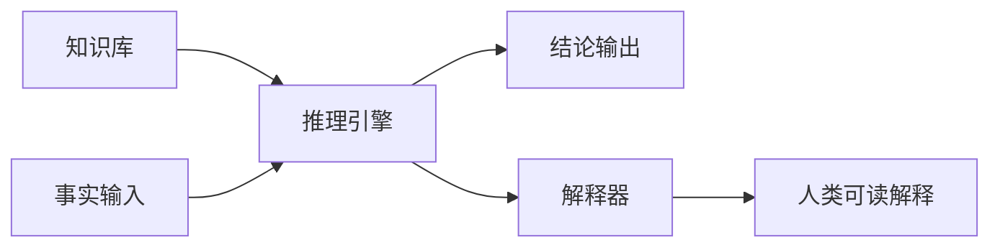
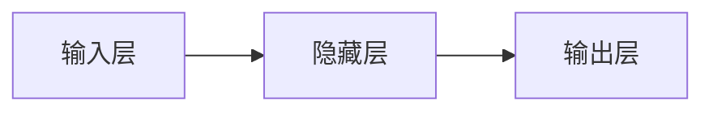
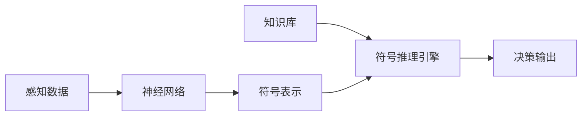

# 神经符号AI：结合符号推理与神经网络的AI Agent

> 关键词：神经符号AI、符号推理、神经网络、AI Agent、知识表示、深度学习

> 摘要：本文围绕神经符号AI这一前沿领域展开，探讨了将符号推理与神经网络相结合构建AI Agent的相关技术。首先介绍了神经符号AI的背景，包括其目的、预期读者、文档结构和术语表。接着阐述了核心概念与联系，分析了符号推理和神经网络的原理及架构，并通过Mermaid流程图展示其交互关系。详细讲解了核心算法原理和具体操作步骤，运用Python代码进行阐述。同时给出了相关的数学模型和公式，并举例说明。通过项目实战，展示了代码的实际案例和详细解释。探讨了神经符号AI的实际应用场景，推荐了学习资源、开发工具框架和相关论文著作。最后总结了未来发展趋势与挑战，解答了常见问题，并提供了扩展阅读和参考资料，旨在为读者全面深入地了解神经符号AI提供有价值的信息。

## 1. 背景介绍 
### 1.1 目的和范围
神经符号AI旨在将传统的符号推理方法与现代的神经网络技术相结合，以构建更强大、更智能的AI Agent。传统的符号推理系统具有强大的逻辑推理能力和知识表示能力，能够处理复杂的语义信息，但在处理不确定、模糊和大规模数据时存在一定的局限性。而神经网络在处理图像、语音等感知任务方面表现出色，但缺乏显式的知识表示和逻辑推理能力。神经符号AI的目的就是融合两者的优势，使AI Agent既能像人类一样进行逻辑推理，又能从大量数据中学习模式和特征。

本文的范围涵盖了神经符号AI的核心概念、算法原理、数学模型、实际应用案例等方面。我们将详细探讨如何将符号推理与神经网络集成，以及这种集成在不同领域的应用潜力。

### 1.2 预期读者
本文的预期读者包括计算机科学、人工智能、机器学习等领域的研究人员、工程师和学生。对于对AI技术发展感兴趣，希望深入了解神经符号AI这一新兴领域的专业人士，本文将提供系统的知识和实践指导。同时，对于想要将AI技术应用到实际业务中的企业人员，也可以从本文中了解神经符号AI的应用场景和潜在价值。

### 1.3 文档结构概述
本文将按照以下结构进行组织：
1. 背景介绍：阐述神经符号AI的目的、预期读者和文档结构。
2. 核心概念与联系：介绍符号推理和神经网络的核心概念，以及它们之间的联系和交互方式。
3. 核心算法原理 & 具体操作步骤：详细讲解神经符号AI的核心算法，并用Python代码实现。
4. 数学模型和公式 & 详细讲解 & 举例说明：给出神经符号AI的数学模型和公式，并通过具体例子进行解释。
5. 项目实战：代码实际案例和详细解释说明：通过一个实际项目，展示神经符号AI的开发过程和应用效果。
6. 实际应用场景：探讨神经符号AI在不同领域的应用场景。
7. 工具和资源推荐：推荐学习神经符号AI的相关资源、开发工具和论文著作。
8. 总结：未来发展趋势与挑战：总结神经符号AI的发展趋势和面临的挑战。
9. 附录：常见问题与解答：解答读者在学习和应用神经符号AI过程中常见的问题。
10. 扩展阅读 & 参考资料：提供相关的扩展阅读材料和参考资料。

### 1.4 术语表
#### 1.4.1 核心术语定义
- **神经符号AI（Neural-Symbolic AI）**：将神经网络和符号推理相结合的人工智能范式，旨在融合两者的优势，实现更强大的智能。
- **符号推理（Symbolic Reasoning）**：基于符号逻辑和规则进行推理的方法，能够处理明确的知识和语义信息。
- **神经网络（Neural Network）**：一种模仿人类神经系统的计算模型，通过大量的神经元之间的连接来学习数据的模式和特征。
- **AI Agent**：能够感知环境、做出决策并采取行动的智能实体。
- **知识表示（Knowledge Representation）**：将知识以某种形式表示出来，以便计算机能够处理和利用。

#### 1.4.2 相关概念解释
- **符号系统**：使用符号和规则来表示和处理知识的系统，如专家系统、逻辑编程等。
- **深度学习**：神经网络的一个分支，通过多层神经网络来学习数据的复杂特征。
- **感知与推理的融合**：将神经网络的感知能力和符号推理的逻辑能力相结合，实现更全面的智能。

#### 1.4.3 缩略词列表
- **AI**：Artificial Intelligence（人工智能）
- **NN**：Neural Network（神经网络）
- **SR**：Symbolic Reasoning（符号推理）

## 2. 核心概念与联系 
### 符号推理的原理和架构
符号推理是基于符号逻辑和规则进行推理的方法。它使用符号来表示知识和概念，通过逻辑规则来进行推理和演绎。符号推理系统通常包括知识库、推理引擎和解释器。

知识库是符号推理系统的核心，它存储了大量的知识和规则。这些知识可以是领域专家的经验知识，也可以是通过数据挖掘和机器学习得到的知识。推理引擎根据知识库中的规则和事实，进行推理和演绎，得出新的结论。解释器则负责将推理过程和结果以人类可理解的方式呈现出来。

以下是符号推理系统的一个简单架构示意图：


### 神经网络的原理和架构
神经网络是一种模仿人类神经系统的计算模型。它由大量的神经元组成，这些神经元之间通过连接相互传递信息。神经网络通过学习数据的模式和特征，来进行分类、预测等任务。

神经网络通常包括输入层、隐藏层和输出层。输入层接收外部数据，隐藏层对输入数据进行处理和变换，输出层输出最终的结果。神经网络的学习过程是通过调整神经元之间的连接权重来实现的。

以下是一个简单的三层神经网络的架构示意图：


### 神经符号AI的核心联系
神经符号AI的核心在于将符号推理和神经网络相结合。具体来说，有以下几种结合方式：
1. **神经网络为符号推理提供感知能力**：神经网络可以用于处理图像、语音等感知数据，将这些数据转换为符号表示，为符号推理系统提供输入。
2. **符号推理为神经网络提供知识指导**：符号推理系统可以将领域知识和规则融入到神经网络的训练和推理过程中，提高神经网络的性能和可解释性。
3. **混合架构**：将符号推理模块和神经网络模块集成在一起，构建一个混合的AI Agent，实现感知与推理的协同工作。

以下是神经符号AI的一个概念性架构示意图：


## 3. 核心算法原理 & 具体操作步骤 
### 核心算法原理
神经符号AI的核心算法主要包括以下几个方面：
1. **符号化过程**：将神经网络的输出转换为符号表示。这可以通过定义映射函数来实现，将神经网络的连续输出映射到离散的符号空间。
2. **符号推理**：使用符号推理引擎对符号表示进行推理和演绎。常见的符号推理方法包括逻辑编程、规则推理等。
3. **知识注入**：将符号推理系统中的知识和规则注入到神经网络的训练过程中。这可以通过在损失函数中加入正则化项来实现，使得神经网络的输出符合符号推理的规则。

### 具体操作步骤
以下是一个使用Python实现简单神经符号AI的示例代码：
```python
import numpy as np
import torch
import torch.nn as nn

# 定义一个简单的神经网络
class SimpleNN(nn.Module):
    def __init__(self, input_size, hidden_size, output_size):
        super(SimpleNN, self).__init__()
        self.fc1 = nn.Linear(input_size, hidden_size)
        self.relu = nn.ReLU()
        self.fc2 = nn.Linear(hidden_size, output_size)

    def forward(self, x):
        out = self.fc1(x)
        out = self.relu(out)
        out = self.fc2(out)
        return out

# 符号化函数
def symbolize(output):
    # 简单的符号化方法，将输出转换为离散的符号
    if output > 0.5:
        return 'A'
    else:
        return 'B'

# 符号推理规则
def symbolic_reasoning(symbol):
    if symbol == 'A':
        return 'Result1'
    else:
        return 'Result2'

# 训练神经网络
input_size = 10
hidden_size = 20
output_size = 1
model = SimpleNN(input_size, hidden_size, output_size)
criterion = nn.MSELoss()
optimizer = torch.optim.Adam(model.parameters(), lr=0.001)

# 模拟训练数据
num_samples = 100
inputs = torch.randn(num_samples, input_size)
targets = torch.randn(num_samples, output_size)

# 训练循环
num_epochs = 100
for epoch in range(num_epochs):
    outputs = model(inputs)
    loss = criterion(outputs, targets)
    optimizer.zero_grad()
    loss.backward()
    optimizer.step()
    if (epoch+1) % 10 == 0:
        print(f'Epoch [{epoch+1}/{num_epochs}], Loss: {loss.item():.4f}')

# 测试神经网络
test_input = torch.randn(1, input_size)
output = model(test_input)
symbol = symbolize(output.item())
result = symbolic_reasoning(symbol)
print(f'Test input: {test_input}')
print(f'Output: {output.item()}')
print(f'Symbol: {symbol}')
print(f'Result: {result}')
```
### 代码解释
1. **定义神经网络**：使用PyTorch定义了一个简单的两层神经网络。
2. **符号化函数**：将神经网络的输出转换为离散的符号。
3. **符号推理规则**：根据符号进行推理，得出最终的结果。
4. **训练神经网络**：使用随机生成的数据进行训练，优化神经网络的参数。
5. **测试神经网络**：输入一个测试数据，经过神经网络、符号化和符号推理，得出最终的结果。

## 4. 数学模型和公式 & 详细讲解 & 举例说明 
### 符号化过程的数学模型
符号化过程可以看作是一个映射函数 $f: \mathbb{R}^n \to \mathcal{S}$，其中 $\mathbb{R}^n$ 是神经网络的输出空间，$\mathcal{S}$ 是符号空间。例如，对于一个二分类问题，符号空间 $\mathcal{S} = \{A, B\}$，映射函数可以定义为：
$$
f(x) = 
\begin{cases}
A, & \text{if } x > 0.5 \\
B, & \text{otherwise}
\end{cases}
$$

### 符号推理的数学模型
符号推理可以使用逻辑规则来表示。例如，对于一个简单的规则：如果符号是 $A$，则结果是 $Result1$；如果符号是 $B$，则结果是 $Result2$。可以用逻辑表达式表示为：
$$
(A \to Result1) \land (B \to Result2)
$$

### 知识注入的数学模型
知识注入可以通过在损失函数中加入正则化项来实现。假设神经网络的损失函数为 $L_{nn}$，符号推理的规则可以表示为一个约束条件 $C$，则加入知识注入后的损失函数为：
$$
L = L_{nn} + \lambda \cdot R(C)
$$
其中 $\lambda$ 是正则化系数，$R(C)$ 是约束条件 $C$ 的惩罚项。例如，如果符号推理规则要求神经网络的输出必须满足某种逻辑关系，可以定义 $R(C)$ 为违反该逻辑关系的程度。

### 举例说明
假设我们有一个简单的神经符号AI系统，用于判断一个数字是否大于 5。神经网络的输入是一个实数，输出是一个概率值，表示该数字大于 5 的概率。符号化函数将概率值转换为符号 $\{Yes, No\}$，符号推理规则根据符号输出最终的判断结果。

神经网络的输出 $x$ 是一个概率值，符号化函数为：
$$
f(x) = 
\begin{cases}
Yes, & \text{if } x > 0.5 \\
No, & \text{otherwise}
\end{cases}
$$
符号推理规则为：
$$
(Yes \to \text{大于 5}) \land (No \to \text{小于等于 5})
$$
如果神经网络的输出 $x = 0.8$，则符号化后的符号为 $Yes$，根据符号推理规则，最终的判断结果是“大于 5”。

## 5. 项目实战：代码实际案例和详细解释说明 
### 5.1  开发环境搭建
为了实现神经符号AI项目，我们需要搭建以下开发环境：
1. **Python**：建议使用Python 3.7及以上版本。
2. **深度学习框架**：推荐使用PyTorch或TensorFlow。
3. **其他依赖库**：如NumPy、Matplotlib等。

可以使用以下命令安装所需的库：
```sh
pip install torch numpy matplotlib
```

### 5.2  源代码详细实现和代码解读
我们以一个图像分类任务为例，展示神经符号AI的实际应用。在这个任务中，我们使用神经网络对图像进行分类，然后将分类结果进行符号化，最后使用符号推理规则进行进一步的推理。

```python
import torch
import torch.nn as nn
import torch.optim as optim
from torchvision import datasets, transforms
from torch.utils.data import DataLoader

# 定义神经网络
class ImageClassifier(nn.Module):
    def __init__(self):
        super(ImageClassifier, self).__init__()
        self.conv1 = nn.Conv2d(3, 16, kernel_size=3, padding=1)
        self.relu1 = nn.ReLU()
        self.pool1 = nn.MaxPool2d(2, 2)
        self.conv2 = nn.Conv2d(16, 32, kernel_size=3, padding=1)
        self.relu2 = nn.ReLU()
        self.pool2 = nn.MaxPool2d(2, 2)
        self.fc1 = nn.Linear(32 * 8 * 8, 128)
        self.relu3 = nn.ReLU()
        self.fc2 = nn.Linear(128, 10)

    def forward(self, x):
        x = self.pool1(self.relu1(self.conv1(x)))
        x = self.pool2(self.relu2(self.conv2(x)))
        x = x.view(-1, 32 * 8 * 8)
        x = self.relu3(self.fc1(x))
        x = self.fc2(x)
        return x

# 符号化函数
def symbolize(output):
    _, predicted = torch.max(output.data, 1)
    symbols = ['airplane', 'automobile', 'bird', 'cat', 'deer', 'dog', 'frog', 'horse', 'ship', 'truck']
    return symbols[predicted.item()]

# 符号推理规则
def symbolic_reasoning(symbol):
    if symbol in ['airplane', 'ship', 'truck']:
        return 'Vehicle'
    else:
        return 'Animal'

# 数据预处理
transform = transforms.Compose([
    transforms.ToTensor(),
    transforms.Normalize((0.5, 0.5, 0.5), (0.5, 0.5, 0.5))
])

# 加载数据集
trainset = datasets.CIFAR10(root='./data', train=True, download=True, transform=transform)
trainloader = DataLoader(trainset, batch_size=32, shuffle=True)

testset = datasets.CIFAR10(root='./data', train=False, download=True, transform=transform)
testloader = DataLoader(testset, batch_size=1, shuffle=False)

# 初始化模型、损失函数和优化器
model = ImageClassifier()
criterion = nn.CrossEntropyLoss()
optimizer = optim.SGD(model.parameters(), lr=0.001, momentum=0.9)

# 训练模型
num_epochs = 10
for epoch in range(num_epochs):
    running_loss = 0.0
    for i, data in enumerate(trainloader, 0):
        inputs, labels = data
        optimizer.zero_grad()
        outputs = model(inputs)
        loss = criterion(outputs, labels)
        loss.backward()
        optimizer.step()
        running_loss += loss.item()
    print(f'Epoch {epoch + 1}, Loss: {running_loss / len(trainloader)}')

# 测试模型
correct = 0
total = 0
with torch.no_grad():
    for data in testloader:
        images, _ = data
        outputs = model(images)
        symbol = symbolize(outputs)
        result = symbolic_reasoning(symbol)
        print(f'Image classified as: {symbol}, Final result: {result}')
```
### 5.3  代码解读与分析
1. **定义神经网络**：使用PyTorch定义了一个简单的卷积神经网络，用于图像分类。
2. **符号化函数**：将神经网络的输出转换为对应的类别符号。
3. **符号推理规则**：根据类别符号进行进一步的推理，判断是“Vehicle”还是“Animal”。
4. **数据预处理**：对图像数据进行归一化处理。
5. **加载数据集**：使用CIFAR-10数据集进行训练和测试。
6. **训练模型**：使用交叉熵损失函数和随机梯度下降优化器训练神经网络。
7. **测试模型**：对测试集中的图像进行分类，并进行符号推理，输出最终结果。

## 6. 实际应用场景 
### 自然语言处理
在自然语言处理中，神经符号AI可以用于语义理解、问答系统和文本生成等任务。例如，在问答系统中，神经网络可以用于对问题进行语义分析和特征提取，将问题转换为符号表示。符号推理系统可以根据知识库中的知识和规则，对符号表示进行推理和演绎，得出问题的答案。

### 计算机视觉
在计算机视觉中，神经符号AI可以用于目标检测、图像分类和场景理解等任务。例如，在目标检测中，神经网络可以用于检测图像中的目标物体，将目标物体的位置和类别信息转换为符号表示。符号推理系统可以根据这些符号表示，进行场景理解和推理，例如判断目标物体之间的关系和行为。

### 机器人领域
在机器人领域，神经符号AI可以用于机器人的决策和规划。神经网络可以用于机器人的感知任务，如视觉、听觉等，将感知数据转换为符号表示。符号推理系统可以根据这些符号表示，进行决策和规划，例如确定机器人的行动路径和任务。

### 医疗领域
在医疗领域，神经符号AI可以用于疾病诊断、治疗方案推荐等任务。神经网络可以用于对医疗数据进行分析和预测，如医学图像、病历等，将分析结果转换为符号表示。符号推理系统可以根据医学知识和规则，对符号表示进行推理和演绎，为医生提供诊断建议和治疗方案。

## 7. 工具和资源推荐
### 7.1 学习资源推荐
#### 7.1.1 书籍推荐
- 《Artificial Intelligence: A Modern Approach》：这是一本经典的人工智能教材，涵盖了符号推理、神经网络等多个方面的内容。
- 《Deep Learning》：由Ian Goodfellow、Yoshua Bengio和Aaron Courville编写，是深度学习领域的权威书籍。
- 《Neural-Symbolic Cognitive Reasoning》：专门介绍神经符号AI的书籍，深入探讨了符号推理与神经网络的结合。

#### 7.1.2 在线课程
- Coursera上的“Artificial Intelligence”课程：由斯坦福大学的Sebastian Thrun教授讲授，全面介绍了人工智能的基础知识和技术。
- edX上的“Deep Learning Specialization”课程：由Andrew Ng教授讲授，是深度学习领域的经典课程。
- Udemy上的“Neural Networks and Deep Learning”课程：提供了丰富的实践案例和代码实现。

#### 7.1.3 技术博客和网站
- Medium上的“Towards Data Science”：发布了大量关于人工智能、机器学习的技术文章和案例分析。
- arXiv.org：一个预印本平台，提供了最新的人工智能研究论文。
- AI Trends：关注人工智能技术的发展趋势和应用案例。

### 7.2 开发工具框架推荐
#### 7.2.1 IDE和编辑器
- PyCharm：一个专业的Python集成开发环境，提供了丰富的代码编辑、调试和部署功能。
- Jupyter Notebook：一个交互式的开发环境，适合进行数据分析和模型实验。
- Visual Studio Code：一个轻量级的代码编辑器，支持多种编程语言和插件。

#### 7.2.2 调试和性能分析工具
- TensorBoard：TensorFlow的可视化工具，用于监控模型的训练过程和性能指标。
- PyTorch Profiler：PyTorch的性能分析工具，用于分析模型的运行时间和内存使用情况。
- Nsight Systems：NVIDIA的性能分析工具，用于优化深度学习模型在GPU上的性能。

#### 7.2.3 相关框架和库
- PyTorch：一个开源的深度学习框架，提供了丰富的神经网络模型和工具。
- TensorFlow：Google开发的深度学习框架，广泛应用于工业界和学术界。
- PyKE：一个Python实现的知识工程工具包，用于符号推理和知识表示。

### 7.3 相关论文著作推荐
#### 7.3.1 经典论文
- “Neural-Symbolic Learning and Reasoning: Contributions and Challenges”：该论文全面介绍了神经符号AI的发展历程、贡献和挑战。
- “Combining Neural Networks and Symbolic Reasoning for Natural Language Processing”：探讨了如何将神经网络和符号推理相结合，应用于自然语言处理任务。
- “Logic Tensor Networks: Deep Learning and Logical Reasoning from Data and Knowledge”：提出了逻辑张量网络的概念，用于融合深度学习和逻辑推理。

#### 7.3.2 最新研究成果
- 关注arXiv.org上的最新论文，特别是关于神经符号AI、知识图谱和深度学习的研究。
- 参加人工智能领域的顶级会议，如NeurIPS、ICML、ACL等，了解最新的研究动态。

#### 7.3.3 应用案例分析
- 研究一些实际应用案例，如医疗诊断、金融风险评估等，了解神经符号AI在不同领域的应用效果和挑战。
- 阅读相关的行业报告和白皮书，了解企业在实际应用中采用神经符号AI的经验和教训。

## 8. 总结：未来发展趋势与挑战
### 未来发展趋势
1. **更紧密的融合**：未来，神经符号AI将实现符号推理和神经网络更紧密的融合，进一步提高AI Agent的智能水平和性能。
2. **可解释性增强**：随着对AI可解释性的需求不断增加，神经符号AI将更加注重解释性，使得AI的决策过程和结果更加透明和可理解。
3. **跨领域应用**：神经符号AI将在更多领域得到应用，如智能交通、智能家居、金融科技等，推动各行业的智能化升级。
4. **知识驱动的学习**：结合符号推理的知识表示和推理能力，神经网络将能够进行更高效的知识驱动学习，减少对大量数据的依赖。

### 挑战
1. **理论基础不完善**：目前，神经符号AI的理论基础还不够完善，缺乏统一的数学模型和算法框架。
2. **计算复杂度高**：将符号推理和神经网络相结合，会增加计算复杂度，导致训练和推理时间较长。
3. **数据和知识的融合**：如何有效地将数据和知识进行融合，是神经符号AI面临的一个重要挑战。
4. **可扩展性问题**：在处理大规模数据和复杂任务时，神经符号AI的可扩展性还需要进一步提高。

## 9. 附录：常见问题与解答
### 问题1：神经符号AI与传统AI和深度学习有什么区别？
答：传统AI主要基于符号推理，具有强大的逻辑推理能力和知识表示能力，但在处理不确定和大规模数据时存在局限性。深度学习是神经网络的一个分支，通过多层神经网络学习数据的特征，但缺乏显式的知识表示和逻辑推理能力。神经符号AI则是将两者相结合，融合了它们的优势，既能进行逻辑推理，又能从数据中学习模式和特征。

### 问题2：神经符号AI的可解释性如何？
答：神经符号AI在一定程度上提高了AI的可解释性。符号推理部分可以提供明确的推理过程和规则，使得AI的决策结果更容易理解。同时，通过将神经网络的输出转换为符号表示，也可以为神经网络的决策提供一定的解释。

### 问题3：如何选择合适的符号推理方法和神经网络模型？
答：选择合适的符号推理方法和神经网络模型需要考虑具体的应用场景和任务需求。对于需要处理复杂逻辑和知识的任务，可以选择逻辑编程、规则推理等符号推理方法；对于处理图像、语音等感知数据的任务，可以选择卷积神经网络、循环神经网络等神经网络模型。同时，还需要考虑模型的复杂度、计算资源和数据量等因素。

### 问题4：神经符号AI的训练过程有什么特点？
答：神经符号AI的训练过程通常包括神经网络的训练和符号推理系统的训练。在训练过程中，需要考虑如何将符号推理的知识和规则融入到神经网络的训练中，以及如何协调两者的训练过程。常见的方法包括在损失函数中加入正则化项、使用强化学习等。

## 10. 扩展阅读 & 参考资料
### 扩展阅读
- 《Knowledge Representation and Reasoning》：深入介绍了知识表示和推理的理论和方法。
- 《Probabilistic Graphical Models: Principles and Techniques》：介绍了概率图模型的原理和技术，可用于处理不确定知识和推理。
- 《Machine Learning: A Probabilistic Perspective》：从概率的角度介绍了机器学习的基本原理和算法。

### 参考资料
- 相关的学术论文和研究报告，可在IEEE Xplore、ACM Digital Library等数据库中查找。
- 开源项目和代码库，如GitHub上的神经符号AI相关项目。
- 行业报告和白皮书，如Gartner、Forrester等机构发布的关于人工智能的报告。