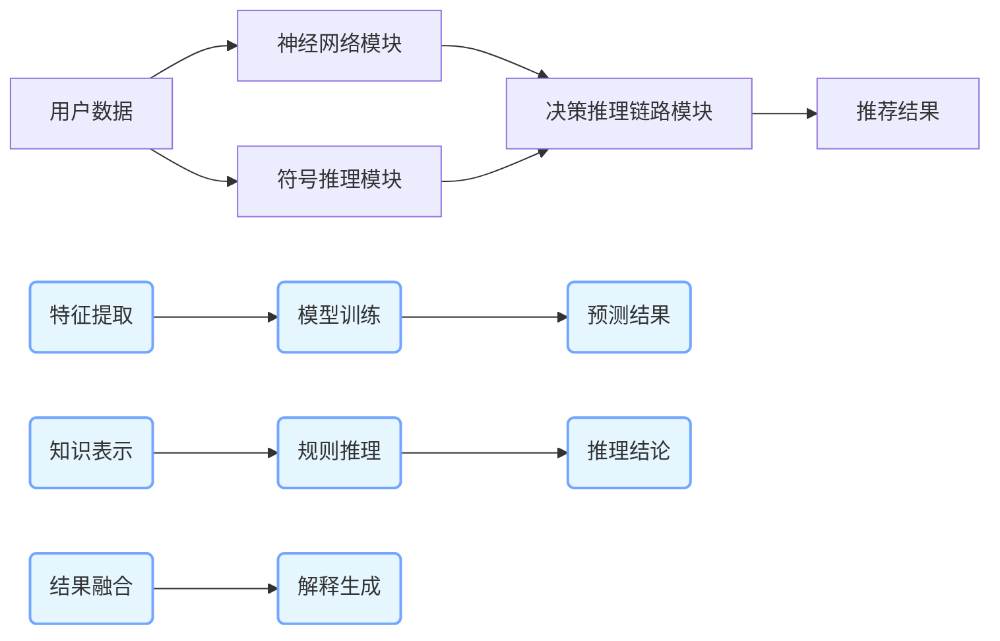

# 神经符号整合的可解释推荐系统决策推理链路

> 关键词：神经符号整合、可解释推荐系统、决策推理链路、深度学习、符号推理

> 摘要：本文聚焦于神经符号整合的可解释推荐系统决策推理链路，深入探讨了该领域的核心概念、算法原理、数学模型等内容。首先介绍了相关背景知识，包括目的范围、预期读者等。接着详细阐述了神经符号整合及可解释推荐系统的核心概念与联系，给出了相应的架构示意图和流程图。通过Python源代码详细讲解了核心算法原理及具体操作步骤，并对数学模型和公式进行了详细推导与举例说明。在项目实战部分，给出了开发环境搭建、源代码实现及代码解读。还探讨了实际应用场景，推荐了相关工具和资源。最后总结了未来发展趋势与挑战，提供了常见问题解答和扩展阅读参考资料，旨在为该领域的研究和实践提供全面且深入的指导。

## 1. 背景介绍 
### 1.1 目的和范围
随着互联网的快速发展，推荐系统在电子商务、社交媒体、在线视频等众多领域得到了广泛应用。然而，大多数传统推荐系统是基于深度学习的黑盒模型，虽然在推荐准确性上取得了不错的效果，但缺乏可解释性，这使得用户难以理解推荐结果的来源和依据，降低了用户对推荐系统的信任度。神经符号整合的可解释推荐系统旨在结合神经网络强大的学习能力和符号推理的可解释性，为用户提供既准确又可解释的推荐结果。

本文的范围涵盖了神经符号整合的可解释推荐系统决策推理链路的各个方面，包括核心概念、算法原理、数学模型、项目实战、应用场景等，旨在全面深入地介绍该领域的相关知识和技术。

### 1.2 预期读者
本文预期读者包括对推荐系统、人工智能、机器学习等领域感兴趣的研究人员、工程师、学生等。对于希望了解可解释推荐系统技术原理和实现方法的初学者，本文提供了详细的基础知识和逐步的讲解；对于有一定经验的专业人士，本文的深入分析和前沿探讨也能为其研究和实践提供有价值的参考。

### 1.3 文档结构概述
本文按照以下结构进行组织：
- 背景介绍：介绍本文的目的、范围、预期读者和文档结构概述，以及相关术语的定义和解释。
- 核心概念与联系：阐述神经符号整合和可解释推荐系统的核心概念，给出原理和架构的文本示意图及Mermaid流程图。
- 核心算法原理 & 具体操作步骤：使用Python源代码详细讲解核心算法原理和具体操作步骤。
- 数学模型和公式 & 详细讲解 & 举例说明：推导相关数学模型和公式，并进行详细讲解和举例。
- 项目实战：代码实际案例和详细解释说明，包括开发环境搭建、源代码实现和代码解读。
- 实际应用场景：探讨神经符号整合的可解释推荐系统的实际应用场景。
- 工具和资源推荐：推荐相关的学习资源、开发工具框架和论文著作。
- 总结：未来发展趋势与挑战：总结该领域的未来发展趋势和面临的挑战。
- 附录：常见问题与解答：提供常见问题的解答。
- 扩展阅读 & 参考资料：提供扩展阅读的建议和参考资料列表。

### 1.4 术语表
#### 1.4.1 核心术语定义
- **神经符号整合**：将神经网络的学习能力与符号推理的可解释性相结合的一种技术方法，旨在充分发挥两者的优势，实现更智能、可解释的系统。
- **可解释推荐系统**：能够为用户解释推荐结果的来源和依据的推荐系统，提高用户对推荐结果的信任度和理解程度。
- **决策推理链路**：推荐系统在做出推荐决策过程中所遵循的一系列推理步骤和逻辑关系，反映了推荐结果的生成过程。

#### 1.4.2 相关概念解释
- **神经网络**：一种模仿人类神经系统的计算模型，由大量的神经元组成，通过对数据的学习和训练来提取特征和模式。
- **符号推理**：基于符号逻辑和规则进行推理的方法，具有明确的语义和可解释性，能够对知识进行形式化表示和推理。
- **推荐系统**：根据用户的历史行为、偏好等信息，为用户推荐可能感兴趣的物品或内容的系统。

#### 1.4.3 缩略词列表
- **AI**：Artificial Intelligence，人工智能
- **ML**：Machine Learning，机器学习
- **DL**：Deep Learning，深度学习

## 2. 核心概念与联系 

### 核心概念原理
神经符号整合的可解释推荐系统结合了神经网络和符号推理的优势。神经网络具有强大的学习能力，能够从大量的数据中自动提取特征和模式，对用户的行为和偏好进行建模。例如，在电商推荐系统中，神经网络可以学习用户的浏览历史、购买记录等数据，预测用户可能感兴趣的商品。

符号推理则基于符号逻辑和规则，能够对知识进行形式化表示和推理，具有明确的语义和可解释性。在推荐系统中，符号推理可以利用领域知识和用户的显式偏好，如用户对某些品牌、类别、属性的偏好，进行推理和决策。例如，如果用户明确表示喜欢某个品牌的电子产品，符号推理可以根据这个偏好，筛选出该品牌的相关产品进行推荐。

可解释推荐系统的决策推理链路则是将神经网络的学习结果和符号推理的结论相结合，形成一个完整的推理过程，为用户提供可解释的推荐结果。例如，推荐系统可以解释推荐某个商品是因为用户的历史行为显示对该类商品有兴趣（神经网络的学习结果），并且该商品符合用户对品牌的偏好（符号推理的结论）。

### 架构的文本示意图
```plaintext
用户数据（历史行为、偏好等）
|
|-- 神经网络模块
|   |-- 特征提取
|   |-- 模型训练
|   |-- 预测结果
|
|-- 符号推理模块
|   |-- 知识表示
|   |-- 规则推理
|   |-- 推理结论
|
|-- 决策推理链路模块
|   |-- 结果融合
|   |-- 解释生成
|   |-- 推荐结果
```

### Mermaid 流程图


## 3. 核心算法原理 & 具体操作步骤 

### 核心算法原理
神经符号整合的可解释推荐系统的核心算法主要包括神经网络部分的训练算法和符号推理部分的推理算法，以及决策推理链路部分的结果融合算法。

#### 神经网络部分
我们可以使用深度学习中的多层感知机（MLP）作为示例。多层感知机是一种前馈神经网络，由输入层、隐藏层和输出层组成。其基本原理是通过对输入数据进行线性变换和非线性激活，逐步提取数据的特征和模式。

以下是一个简单的Python代码示例，使用PyTorch实现一个多层感知机：
```python
import torch
import torch.nn as nn
import torch.optim as optim

# 定义多层感知机模型
class MLP(nn.Module):
    def __init__(self, input_size, hidden_size, output_size):
        super(MLP, self).__init__()
        self.fc1 = nn.Linear(input_size, hidden_size)
        self.relu = nn.ReLU()
        self.fc2 = nn.Linear(hidden_size, output_size)

    def forward(self, x):
        out = self.fc1(x)
        out = self.relu(out)
        out = self.fc2(out)
        return out

# 初始化模型
input_size = 10
hidden_size = 20
output_size = 5
model = MLP(input_size, hidden_size, output_size)

# 定义损失函数和优化器
criterion = nn.MSELoss()
optimizer = optim.Adam(model.parameters(), lr=0.001)

# 模拟训练数据
num_samples = 100
x_train = torch.randn(num_samples, input_size)
y_train = torch.randn(num_samples, output_size)

# 训练模型
num_epochs = 100
for epoch in range(num_epochs):
    # 前向传播
    outputs = model(x_train)
    loss = criterion(outputs, y_train)

    # 反向传播和优化
    optimizer.zero_grad()
    loss.backward()
    optimizer.step()

    if (epoch+1) % 10 == 0:
        print(f'Epoch [{epoch+1}/{num_epochs}], Loss: {loss.item():.4f}')
```

#### 符号推理部分
符号推理通常基于规则引擎实现。规则引擎是一种基于规则的系统，它根据预先定义的规则对输入的事实进行推理和决策。以下是一个简单的Python代码示例，实现一个基于规则的符号推理系统：
```python
# 定义规则和事实
rules = [
    {
        "condition": lambda x: x["category"] == "electronics" and x["brand"] == "Apple",
        "action": lambda x: f"推荐 {x['name']} 因为它是苹果品牌的电子产品"
    }
]

# 模拟用户数据
user_data = {
    "category": "electronics",
    "brand": "Apple",
    "name": "iPhone 14"
}

# 符号推理过程
for rule in rules:
    if rule["condition"](user_data):
        result = rule["action"](user_data)
        print(result)
```

#### 决策推理链路部分
决策推理链路部分的主要任务是将神经网络的预测结果和符号推理的结论进行融合，并生成可解释的推荐结果。以下是一个简单的示例代码：
```python
# 假设神经网络的预测结果是一个分数
nn_score = 0.8

# 符号推理的结论是一个推荐理由
symbolic_reason = "推荐 iPhone 14 因为它是苹果品牌的电子产品"

# 融合结果并生成推荐信息
recommendation = f"基于神经网络预测分数 {nn_score} 和符号推理结论：{symbolic_reason}"
print(recommendation)
```

### 具体操作步骤
1. **数据预处理**：对用户数据进行清洗、特征提取和归一化等预处理操作，以便输入到神经网络中进行训练。
2. **神经网络训练**：使用预处理后的数据对神经网络进行训练，调整模型的参数，使其能够准确地预测用户的偏好。
3. **符号推理规则定义**：根据领域知识和用户的显式偏好，定义符号推理的规则和知识表示。
4. **符号推理执行**：将用户数据输入到符号推理系统中，根据规则进行推理，得出推理结论。
5. **结果融合与解释生成**：将神经网络的预测结果和符号推理的结论进行融合，生成可解释的推荐结果。
6. **推荐结果输出**：将最终的推荐结果呈现给用户。

## 4. 数学模型和公式 & 详细讲解 & 举例说明 

### 神经网络部分
#### 线性变换
在多层感知机中，每一层的线性变换可以表示为：
$$
z^{(l)} = W^{(l)}a^{(l - 1)} + b^{(l)}
$$
其中，$z^{(l)}$ 是第 $l$ 层的线性组合结果，$W^{(l)}$ 是第 $l$ 层的权重矩阵，$a^{(l - 1)}$ 是第 $l - 1$ 层的输出，$b^{(l)}$ 是第 $l$ 层的偏置向量。

#### 非线性激活
常用的非线性激活函数有ReLU（Rectified Linear Unit），其定义为：
$$
a^{(l)} = \max(0, z^{(l)})
$$
其中，$a^{(l)}$ 是第 $l$ 层的输出。

#### 损失函数
对于回归问题，常用的损失函数是均方误差（MSE），其定义为：
$$
L = \frac{1}{n}\sum_{i = 1}^{n}(y_i - \hat{y}_i)^2
$$
其中，$n$ 是样本数量，$y_i$ 是真实标签，$\hat{y}_i$ 是预测标签。

#### 举例说明
假设我们有一个输入向量 $x = [1, 2, 3]$，第一层的权重矩阵 $W^{(1)} = \begin{bmatrix} 0.1 & 0.2 & 0.3 \\ 0.4 & 0.5 & 0.6 \end{bmatrix}$，偏置向量 $b^{(1)} = [0.1, 0.2]$，则第一层的线性组合结果为：
$$
z^{(1)} = W^{(1)}x + b^{(1)} = \begin{bmatrix} 0.1 & 0.2 & 0.3 \\ 0.4 & 0.5 & 0.6 \end{bmatrix} \begin{bmatrix} 1 \\ 2 \\ 3 \end{bmatrix} + \begin{bmatrix} 0.1 \\ 0.2 \end{bmatrix} = \begin{bmatrix} 1.4 \\ 3.5 \end{bmatrix}
$$
经过ReLU激活函数后，第一层的输出为：
$$
a^{(1)} = \max(0, z^{(1)}) = \begin{bmatrix} 1.4 \\ 3.5 \end{bmatrix}
$$

### 符号推理部分
符号推理通常基于逻辑规则进行，例如，我们可以定义一个规则：如果用户喜欢苹果品牌的电子产品，那么推荐苹果品牌的手机。可以用逻辑表达式表示为：
$$
\text{喜欢苹果电子产品} \land \text{存在苹果手机} \Rightarrow \text{推荐苹果手机}
$$
其中，$\land$ 表示逻辑与，$\Rightarrow$ 表示逻辑蕴含。

### 决策推理链路部分
决策推理链路部分的结果融合可以采用加权平均的方法，例如：
$$
\text{最终分数} = \alpha \times \text{神经网络分数} + (1 - \alpha) \times \text{符号推理分数}
$$
其中，$\alpha$ 是权重系数，取值范围为 $[0, 1]$。

## 5. 项目实战：代码实际案例和详细解释说明 

### 5.1  开发环境搭建
#### 安装Python
首先，确保你已经安装了Python 3.x版本。可以从Python官方网站（https://www.python.org/downloads/）下载并安装。

#### 安装依赖库
我们需要安装一些常用的Python库，如PyTorch、NumPy等。可以使用以下命令进行安装：
```sh
pip install torch numpy
```

### 5.2  源代码详细实现和代码解读
以下是一个完整的神经符号整合的可解释推荐系统的代码示例：
```python
import torch
import torch.nn as nn
import torch.optim as optim
import numpy as np

# 定义多层感知机模型
class MLP(nn.Module):
    def __init__(self, input_size, hidden_size, output_size):
        super(MLP, self).__init__()
        self.fc1 = nn.Linear(input_size, hidden_size)
        self.relu = nn.ReLU()
        self.fc2 = nn.Linear(hidden_size, output_size)

    def forward(self, x):
        out = self.fc1(x)
        out = self.relu(out)
        out = self.fc2(out)
        return out

# 定义规则和事实
rules = [
    {
        "condition": lambda x: x["category"] == "electronics" and x["brand"] == "Apple",
        "action": lambda x: f"推荐 {x['name']} 因为它是苹果品牌的电子产品"
    }
]

# 模拟用户数据
num_samples = 100
input_size = 10
x_train = torch.randn(num_samples, input_size)
y_train = torch.randn(num_samples, 1)

# 初始化模型
hidden_size = 20
output_size = 1
model = MLP(input_size, hidden_size, output_size)

# 定义损失函数和优化器
criterion = nn.MSELoss()
optimizer = optim.Adam(model.parameters(), lr=0.001)

# 训练模型
num_epochs = 100
for epoch in range(num_epochs):
    # 前向传播
    outputs = model(x_train)
    loss = criterion(outputs, y_train)

    # 反向传播和优化
    optimizer.zero_grad()
    loss.backward()
    optimizer.step()

    if (epoch+1) % 10 == 0:
        print(f'Epoch [{epoch+1}/{num_epochs}], Loss: {loss.item():.4f}')

# 模拟用户数据
user_data = {
    "category": "electronics",
    "brand": "Apple",
    "name": "iPhone 14"
}

# 符号推理过程
symbolic_result = None
for rule in rules:
    if rule["condition"](user_data):
        symbolic_result = rule["action"](user_data)

# 神经网络预测
test_input = torch.randn(1, input_size)
nn_output = model(test_input)
nn_score = nn_output.item()

# 融合结果并生成推荐信息
if symbolic_result:
    recommendation = f"基于神经网络预测分数 {nn_score} 和符号推理结论：{symbolic_result}"
else:
    recommendation = f"基于神经网络预测分数 {nn_score}"

print(recommendation)
```

### 5.3  代码解读与分析
1. **神经网络部分**：定义了一个多层感知机模型 `MLP`，并使用随机生成的数据进行训练。训练过程中，使用均方误差损失函数和Adam优化器进行参数更新。
2. **符号推理部分**：定义了一个规则列表 `rules`，并根据用户数据进行推理。如果用户数据满足某个规则的条件，则执行相应的动作。
3. **决策推理链路部分**：将神经网络的预测分数和符号推理的结论进行融合，生成最终的推荐信息。

## 6. 实际应用场景 
### 电子商务
在电子商务平台中，神经符号整合的可解释推荐系统可以为用户提供更个性化、可解释的商品推荐。例如，当用户浏览电子产品时，系统可以根据用户的历史购买记录（神经网络学习）和用户对品牌的偏好（符号推理），推荐符合用户需求的电子产品，并解释推荐的理由，如“推荐这款苹果手机是因为您之前购买过苹果产品，且该手机在性能和口碑上都很不错”。

### 在线视频
在在线视频平台中，可解释推荐系统可以根据用户的观看历史、收藏记录等（神经网络学习），结合视频的类型、标签等信息（符号推理），为用户推荐感兴趣的视频。例如，“推荐这部科幻电影是因为您经常观看科幻类视频，且该电影的评分较高”。

### 社交媒体
在社交媒体平台中，推荐系统可以根据用户的社交关系、兴趣爱好等（神经网络学习），结合用户关注的话题、人物等信息（符号推理），为用户推荐相关的内容和好友。例如，“推荐您关注这个用户是因为你们有共同的兴趣爱好，且该用户在相关领域有较高的影响力”。

## 7. 工具和资源推荐
### 7.1 学习资源推荐
#### 7.1.1 书籍推荐
- 《深度学习》（Deep Learning）：由Ian Goodfellow、Yoshua Bengio和Aaron Courville合著，是深度学习领域的经典教材，涵盖了神经网络、优化算法、卷积神经网络等方面的内容。
- 《Python机器学习》（Python Machine Learning）：由Sebastian Raschka和Vahid Mirjalili合著，介绍了使用Python进行机器学习的方法和技术，包括数据预处理、模型选择、评估等内容。

#### 7.1.2 在线课程
- Coursera上的“深度学习专项课程”（Deep Learning Specialization）：由Andrew Ng教授授课，包括神经网络和深度学习、改善深层神经网络、结构化机器学习项目等多个课程。
- edX上的“人工智能导论”（Introduction to Artificial Intelligence）：介绍了人工智能的基本概念、算法和应用，包括搜索算法、知识表示、机器学习等内容。

#### 7.1.3 技术博客和网站
- Medium：有很多关于人工智能、机器学习、深度学习的技术博客，如Towards Data Science、The AI Blog等。
- arXiv：提供了大量的学术论文，涵盖了人工智能、机器学习等领域的最新研究成果。

### 7.2 开发工具框架推荐
#### 7.2.1 IDE和编辑器
- PyCharm：是一款专门为Python开发设计的集成开发环境，提供了代码编辑、调试、版本控制等功能。
- Visual Studio Code：是一款轻量级的代码编辑器，支持多种编程语言，有丰富的插件可以扩展功能。

#### 7.2.2 调试和性能分析工具
- PyTorch Profiler：是PyTorch提供的性能分析工具，可以帮助开发者分析模型的性能瓶颈，优化代码。
- TensorBoard：是TensorFlow提供的可视化工具，可以用于可视化训练过程、模型结构等信息。

#### 7.2.3 相关框架和库
- PyTorch：是一个开源的深度学习框架，提供了丰富的神经网络层和优化算法，支持GPU加速。
- scikit-learn：是一个用于机器学习的Python库，提供了多种机器学习算法和工具，如分类、回归、聚类等。

### 7.3 相关论文著作推荐
#### 7.3.1 经典论文
- “Deep Neural Networks for YouTube Recommendations”：介绍了YouTube使用深度学习进行推荐系统的方法和技术。
- “Neural Symbolic Machines: Learning Semantic Parsers on Freebase with Weak Supervision”：探讨了神经符号整合的方法和应用。

#### 7.3.2 最新研究成果
- 可以关注顶级学术会议如NeurIPS、ICML、ACL等的最新论文，了解神经符号整合和可解释推荐系统领域的最新研究进展。

#### 7.3.3 应用案例分析
- 一些知名公司如亚马逊、Netflix等会发表关于他们推荐系统的技术文章和案例分析，可以参考这些内容了解实际应用中的经验和方法。

## 8. 总结：未来发展趋势与挑战
### 未来发展趋势
- **更深度的神经符号融合**：未来的研究可能会探索更深度的神经符号融合方法，使神经网络和符号推理能够更好地相互协作，充分发挥两者的优势。
- **多模态融合**：结合图像、文本、音频等多模态信息，提供更全面、个性化的推荐服务。例如，在电影推荐中，不仅考虑用户的文本评论和历史观看记录，还结合电影的海报、预告片等图像和音频信息进行推荐。
- **可解释性的提升**：进一步提高推荐系统的可解释性，使解释更加直观、易懂，满足用户对推荐结果透明度的需求。例如，使用可视化技术展示推荐的决策推理链路。

### 挑战
- **数据质量和多样性**：神经符号整合的可解释推荐系统需要大量高质量、多样化的数据进行训练和推理。然而，实际应用中数据可能存在噪声、缺失值等问题，影响系统的性能。
- **计算资源和效率**：深度学习模型的训练和推理通常需要大量的计算资源，而符号推理也需要进行复杂的逻辑运算。如何在有限的计算资源下提高系统的效率是一个挑战。
- **知识表示和推理的复杂性**：符号推理需要对领域知识进行准确的表示和推理，然而知识的表示和推理往往是复杂的，需要解决知识的获取、更新和推理的效率等问题。

## 9. 附录：常见问题与解答
### 问题1：神经符号整合的可解释推荐系统与传统推荐系统有什么区别？
传统推荐系统大多是基于深度学习的黑盒模型，虽然在推荐准确性上有一定优势，但缺乏可解释性。而神经符号整合的可解释推荐系统结合了神经网络的学习能力和符号推理的可解释性，能够为用户提供既准确又可解释的推荐结果。

### 问题2：如何评估神经符号整合的可解释推荐系统的性能？
可以从多个方面评估系统的性能，如推荐准确性（如准确率、召回率、F1值等）、可解释性（如解释的清晰度、合理性等）、用户满意度（通过用户调查等方式）等。

### 问题3：在实际应用中，如何选择合适的神经网络模型和符号推理规则？
选择合适的神经网络模型需要考虑数据的特点、问题的复杂度等因素。例如，如果数据具有序列特征，可以选择循环神经网络（RNN）或长短期记忆网络（LSTM）；如果数据具有空间特征，可以选择卷积神经网络（CNN）。选择符号推理规则需要根据领域知识和用户的需求进行定义，确保规则的合理性和有效性。

## 10. 扩展阅读 & 参考资料
### 扩展阅读
- 《人工智能：一种现代的方法》（Artificial Intelligence: A Modern Approach）：全面介绍了人工智能的基本概念、算法和应用，是人工智能领域的经典教材。
- 《推荐系统实践》：详细介绍了推荐系统的原理、算法和实现方法，包括协同过滤、矩阵分解、深度学习等内容。

### 参考资料
- Goodfellow, I., Bengio, Y., & Courville, A. (2016). Deep Learning. MIT Press.
- Raschka, S., & Mirjalili, V. (2017). Python Machine Learning. Packt Publishing.
- Covington, P., Adams, J., & Sargin, E. (2016). Deep Neural Networks for YouTube Recommendations. Proceedings of the 10th ACM Conference on Recommender Systems.