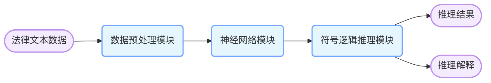

# 神经符号整合的可解释法律推理系统

> 关键词：神经符号整合、可解释性、法律推理系统、人工智能、符号逻辑、神经网络

> 摘要：本文聚焦于神经符号整合的可解释法律推理系统。在人工智能快速发展的当下，将神经网络与符号逻辑相结合应用于法律推理领域具有重要意义。文章详细介绍了该系统的背景，包括目的、预期读者、文档结构和相关术语。深入阐述了核心概念，给出了原理和架构的文本示意图与 Mermaid 流程图。对核心算法原理进行了讲解，并使用 Python 代码详细说明操作步骤。同时，介绍了相关的数学模型和公式，并举例说明。通过项目实战，展示了开发环境搭建、源代码实现与解读。探讨了该系统的实际应用场景，推荐了学习资源、开发工具框架和相关论文著作。最后，总结了未来发展趋势与挑战，解答了常见问题，并提供了扩展阅读和参考资料。

## 1. 背景介绍 
### 1.1 目的和范围
随着人工智能技术的不断发展，将其应用于法律领域成为研究热点。法律推理是法律实践中的核心环节，传统的法律推理方法在处理复杂法律文本和大规模案例时面临挑战。神经符号整合的可解释法律推理系统旨在结合神经网络强大的学习能力和符号逻辑的可解释性，为法律推理提供更高效、准确且可解释的解决方案。

本系统的范围涵盖了从法律文本的理解、知识表示到推理过程的实现。通过对法律条文、案例等数据的处理，系统能够进行法律推理，并对推理结果给出合理的解释，辅助法律从业者做出更科学的决策。

### 1.2 预期读者
本文的预期读者包括法律领域的专业人士，如律师、法官、法律研究人员等，他们可以通过该系统提升法律推理的效率和准确性；人工智能领域的研究人员和开发者，他们可以从神经符号整合的角度获取新的研究思路和开发方法；以及对法律与人工智能交叉领域感兴趣的学生和爱好者，为他们了解该领域提供全面的知识。

### 1.3 文档结构概述
本文首先介绍系统的背景信息，让读者了解系统的目的、适用人群和文档结构。接着阐述核心概念与联系，包括神经符号整合的原理和架构。然后详细讲解核心算法原理和具体操作步骤，使用 Python 代码进行说明。之后介绍数学模型和公式，并举例说明。通过项目实战，展示系统的实际开发过程。探讨系统的实际应用场景，推荐相关的学习资源、开发工具框架和论文著作。最后总结未来发展趋势与挑战，解答常见问题，并提供扩展阅读和参考资料。

### 1.4 术语表
#### 1.4.1 核心术语定义
- **神经符号整合**：将神经网络和符号逻辑相结合的技术，利用神经网络的学习能力处理数据，利用符号逻辑进行知识表示和推理，以实现更强大和可解释的智能系统。
- **可解释法律推理**：在法律推理过程中，能够对推理结果给出合理的解释，让用户理解推理的依据和过程。
- **法律推理系统**：基于法律知识和推理规则，对法律问题进行分析和推理的系统。

#### 1.4.2 相关概念解释
- **神经网络**：一种模仿人类神经系统的计算模型，由大量的神经元组成，通过对数据的学习来提取特征和模式。
- **符号逻辑**：使用符号来表示概念和关系，通过逻辑规则进行推理的方法，具有明确的语义和可解释性。
- **知识表示**：将法律知识以计算机能够理解和处理的方式进行表示，如规则、本体等。

#### 1.4.3 缩略词列表
- **AI**：Artificial Intelligence，人工智能
- **NN**：Neural Network，神经网络
- **SL**：Symbolic Logic，符号逻辑

## 2. 核心概念与联系 

### 核心概念原理
神经符号整合的可解释法律推理系统结合了神经网络和符号逻辑的优势。神经网络具有强大的学习能力，能够从大量的法律文本数据中学习到语义信息和模式。例如，通过对大量的法律条文和案例进行训练，神经网络可以理解法律概念之间的关系和文本的含义。

符号逻辑则提供了明确的知识表示和推理机制。法律知识可以用符号规则进行表示，如“如果 A 成立，且 B 成立，那么 C 成立”。符号逻辑推理可以根据这些规则进行精确的推理，并且推理过程具有可解释性。

在系统中，神经网络用于对法律文本进行处理和特征提取，将文本转换为数值表示。符号逻辑则基于这些数值表示和预定义的法律规则进行推理。两者相互协作，神经网络为符号逻辑提供数据支持，符号逻辑为神经网络的推理结果提供解释和验证。

### 架构的文本示意图
以下是神经符号整合的可解释法律推理系统的架构文本描述：

系统主要由三个部分组成：数据预处理模块、神经网络模块和符号逻辑推理模块。

数据预处理模块负责对法律文本数据进行清洗、分词、标注等操作，将原始的法律文本转换为适合神经网络处理的格式。

神经网络模块接收预处理后的数据，通过训练好的神经网络模型对法律文本进行特征提取和语义理解。该模块输出的特征向量将作为符号逻辑推理模块的输入。

符号逻辑推理模块根据预定义的法律规则和神经网络输出的特征向量进行推理。推理过程中，系统会记录推理步骤和依据，以便对推理结果进行解释。

### Mermaid 流程图


该流程图展示了系统的主要流程。从法律文本数据输入开始，经过数据预处理、神经网络处理和符号逻辑推理，最终输出推理结果和推理解释。

## 3. 核心算法原理 & 具体操作步骤 

### 核心算法原理
本系统的核心算法主要包括神经网络的文本处理算法和符号逻辑的推理算法。

#### 神经网络文本处理算法
我们使用预训练的语言模型，如 BERT（Bidirectional Encoder Representations from Transformers）来处理法律文本。BERT 是一种基于 Transformer 架构的预训练语言模型，能够学习到文本的上下文信息。

具体来说，BERT 模型由多个 Transformer 层组成，每个 Transformer 层包含多头自注意力机制和前馈神经网络。多头自注意力机制允许模型在处理每个词时考虑到文本中其他词的信息，从而捕捉到文本的语义关系。

#### 符号逻辑推理算法
符号逻辑推理基于一阶逻辑。一阶逻辑是一种形式化的逻辑系统，使用谓词、变量和量词来表示知识和进行推理。在法律推理中，我们可以将法律规则表示为一阶逻辑公式，例如：

$$\forall x (LegalCase(x) \land Evidence(y) \land Related(x, y) \to Guilty(x))$$

这个公式表示对于所有的法律案例 $x$ 和证据 $y$，如果 $y$ 与 $x$ 相关，那么 $x$ 是有罪的。

### 具体操作步骤
以下是使用 Python 实现核心算法的具体步骤：

#### 安装必要的库
```python
!pip install transformers
```

#### 加载预训练的 BERT 模型
```python
from transformers import BertTokenizer, BertModel

# 加载预训练的 BERT 模型和分词器
tokenizer = BertTokenizer.from_pretrained('bert-base-uncased')
model = BertModel.from_pretrained('bert-base-uncased')

# 示例法律文本
legal_text = "The defendant is accused of theft according to the law."

# 对文本进行分词
inputs = tokenizer(legal_text, return_tensors='pt')

# 使用 BERT 模型进行特征提取
outputs = model(**inputs)

# 获取最后一层的隐藏状态
last_hidden_state = outputs.last_hidden_state
```

#### 符号逻辑推理示例
```python
import sympy as sp

# 定义变量和谓词
x, y = sp.symbols('x y')
LegalCase = sp.Function('LegalCase')
Evidence = sp.Function('Evidence')
Related = sp.Function('Related')
Guilty = sp.Function('Guilty')

# 定义法律规则
rule = sp.ForAll(x, sp.Implies(sp.And(LegalCase(x), Evidence(y), Related(x, y)), Guilty(x)))

# 假设存在一个法律案例和相关证据
case = LegalCase('case1')
evidence = Evidence('evidence1')
relation = Related('case1', 'evidence1')

# 进行推理
if sp.simplify(sp.subs(rule, {x: 'case1', y: 'evidence1'})):
    print("The defendant is guilty.")
else:
    print("The defendant is not guilty.")
```

## 4. 数学模型和公式 & 详细讲解 & 举例说明 

### 神经网络的数学模型
#### BERT 模型的数学原理
BERT 模型基于 Transformer 架构，其核心是多头自注意力机制。多头自注意力机制的计算公式如下：

$$\text{MultiHead}(Q, K, V) = \text{Concat}(\text{head}_1, \cdots, \text{head}_h)W^O$$

其中，$\text{head}_i = \text{Attention}(QW_i^Q, KW_i^K, VW_i^V)$，$\text{Attention}(Q, K, V) = \text{softmax}(\frac{QK^T}{\sqrt{d_k}})V$。

$Q$、$K$、$V$ 分别是查询矩阵、键矩阵和值矩阵，$W_i^Q$、$W_i^K$、$W_i^V$ 是可学习的投影矩阵，$d_k$ 是键向量的维度，$W^O$ 是输出投影矩阵。

#### 举例说明
假设我们有一个长度为 $n$ 的输入序列，每个词的嵌入维度为 $d$。查询矩阵 $Q$、键矩阵 $K$ 和值矩阵 $V$ 的形状分别为 $[n, d]$。通过多头自注意力机制，模型可以计算出每个词与其他词之间的注意力分数，从而捕捉到文本的语义关系。

### 符号逻辑的数学模型
#### 一阶逻辑公式
一阶逻辑使用谓词、变量和量词来表示知识。常见的逻辑连接词包括 $\land$（合取）、$\lor$（析取）、$\neg$（否定）和 $\to$（蕴含）。

例如，法律规则“如果一个人是成年人，并且他违反了法律，那么他应该受到惩罚”可以表示为：

$$\forall x (Adult(x) \land ViolateLaw(x) \to BePunished(x))$$

#### 推理规则
在一阶逻辑中，常见的推理规则包括假言推理（Modus Ponens）：

如果 $A \to B$ 为真，且 $A$ 为真，那么 $B$ 为真。

#### 举例说明
假设我们有以下法律规则和事实：

规则：$\forall x (Theft(x) \to Guilty(x))$（如果有人犯了盗窃罪，那么他是有罪的）

事实：$Theft(\text{defendant})$（被告犯了盗窃罪）

根据假言推理，我们可以得出结论：$Guilty(\text{defendant})$（被告是有罪的）。

## 5. 项目实战：代码实际案例和详细解释说明 

### 5.1  开发环境搭建
#### 安装 Python
首先，确保你已经安装了 Python 3.7 或更高版本。可以从 Python 官方网站（https://www.python.org/downloads/）下载并安装。

#### 创建虚拟环境
为了避免不同项目之间的依赖冲突，建议使用虚拟环境。在命令行中执行以下命令创建并激活虚拟环境：

```bash
# 创建虚拟环境
python -m venv legal_reasoning_env

# 激活虚拟环境（Windows）
legal_reasoning_env\Scripts\activate

# 激活虚拟环境（Linux/Mac）
source legal_reasoning_env/bin/activate
```

#### 安装必要的库
在虚拟环境中安装项目所需的库：

```bash
pip install transformers sympy pandas numpy
```

### 5.2  源代码详细实现和代码解读
以下是一个完整的神经符号整合的可解释法律推理系统的源代码示例：

```python
import pandas as pd
import numpy as np
from transformers import BertTokenizer, BertModel
import sympy as sp

# 加载预训练的 BERT 模型和分词器
tokenizer = BertTokenizer.from_pretrained('bert-base-uncased')
model = BertModel.from_pretrained('bert-base-uncased')

# 定义法律规则和事实
# 规则：如果被告有盗窃行为，那么被告有罪
x = sp.symbols('x')
Theft = sp.Function('Theft')
Guilty = sp.Function('Guilty')
rule = sp.Implies(Theft(x), Guilty(x))

# 示例法律文本数据
data = {
    'case_id': [1],
    'description': ["The defendant stole a valuable item."]
}
df = pd.DataFrame(data)

# 文本特征提取
def extract_features(text):
    inputs = tokenizer(text, return_tensors='pt')
    outputs = model(**inputs)
    last_hidden_state = outputs.last_hidden_state
    # 取 [CLS] 标记的特征向量
    cls_feature = last_hidden_state[:, 0, :].detach().numpy()
    return cls_feature

# 对每个案例进行特征提取
df['features'] = df['description'].apply(extract_features)

# 法律推理
def legal_reasoning(features):
    # 假设特征向量的某个维度表示是否有盗窃行为
    has_theft = features[0][0][0] > 0  # 简单示例，实际需要更复杂的判断
    if has_theft:
        conclusion = sp.subs(rule, {x: 'defendant'})
        if sp.simplify(conclusion):
            return "The defendant is guilty."
        else:
            return "The defendant is not guilty."
    else:
        return "The defendant is not guilty."

# 进行推理并添加到数据框中
df['reasoning_result'] = df['features'].apply(legal_reasoning)

print(df)
```

### 5.3  代码解读与分析
#### 数据加载和预处理
使用 `pandas` 库加载示例法律文本数据，并存储在数据框中。

#### 文本特征提取
定义 `extract_features` 函数，使用预训练的 BERT 模型对法律文本进行特征提取。取 `[CLS]` 标记的特征向量作为文本的表示。

#### 法律规则定义
使用 `sympy` 库定义法律规则，如“如果被告有盗窃行为，那么被告有罪”。

#### 法律推理
定义 `legal_reasoning` 函数，根据特征向量判断是否有盗窃行为，并使用符号逻辑进行推理。将推理结果添加到数据框中。

#### 代码分析
该代码示例展示了神经符号整合的基本流程。通过神经网络提取文本特征，然后使用符号逻辑进行推理。在实际应用中，需要更复杂的特征判断和规则定义，以提高推理的准确性。

## 6. 实际应用场景 
### 法律案件分析
在法律案件分析中，神经符号整合的可解释法律推理系统可以帮助律师和法官快速分析案件的事实和法律依据。系统可以对案件描述进行文本处理，提取关键信息，并根据法律规则进行推理。例如，在刑事案件中，系统可以判断被告是否构成犯罪，以及应受到何种处罚。

### 法律知识检索
该系统可以用于法律知识检索。用户可以输入法律问题，系统通过对问题进行理解和推理，从法律知识库中检索相关的法律条文和案例。同时，系统可以对检索结果进行解释，让用户了解为什么这些结果是相关的。

### 法律教育
在法律教育领域，该系统可以作为教学工具。学生可以通过系统进行法律推理练习，系统可以对学生的推理过程进行解释和指导，帮助学生更好地理解法律知识和推理方法。

### 智能法律助手
智能法律助手可以集成神经符号整合的可解释法律推理系统，为用户提供实时的法律咨询服务。用户可以向智能法律助手提出法律问题，助手可以根据系统的推理结果为用户提供准确的建议和解释。

## 7. 工具和资源推荐
### 7.1 学习资源推荐
#### 7.1.1 书籍推荐
- 《人工智能：一种现代方法》（Artificial Intelligence: A Modern Approach）：全面介绍了人工智能的各个领域，包括神经网络和符号逻辑。
- 《法律人工智能：前沿问题与应用展望》：专注于法律与人工智能的交叉领域，介绍了法律推理系统的相关知识。
- 《深度学习》（Deep Learning）：深入讲解了深度学习的原理和应用，包括神经网络的相关知识。

#### 7.1.2 在线课程
- Coursera 上的“人工智能基础”课程：介绍了人工智能的基本概念和方法。
- edX 上的“深度学习专项课程”：系统学习深度学习的理论和实践。
- 中国大学 MOOC 上的“法律人工智能”课程：专门讲解法律与人工智能的结合。

#### 7.1.3 技术博客和网站
- Medium 上的 AI 相关博客：有很多关于神经网络和符号逻辑的技术文章。
- 开源中国：提供了丰富的技术资源和社区讨论。
- AI 研习社：专注于人工智能领域的知识分享和交流。

### 7.2 开发工具框架推荐
#### 7.2.1 IDE和编辑器
- PyCharm：功能强大的 Python 集成开发环境，支持代码调试、自动补全、版本控制等功能。
- Visual Studio Code：轻量级的代码编辑器，具有丰富的插件生态系统，适合快速开发。

#### 7.2.2 调试和性能分析工具
- TensorBoard：用于可视化深度学习模型的训练过程和性能指标。
- Py-Spy：可以对 Python 代码进行性能分析，找出性能瓶颈。

#### 7.2.3 相关框架和库
- Transformers：提供了预训练的语言模型，如 BERT、GPT 等，方便进行自然语言处理任务。
- SymPy：用于符号计算和逻辑推理，支持一阶逻辑的表示和推理。
- Pandas：用于数据处理和分析，方便对法律文本数据进行清洗和整理。

### 7.3 相关论文著作推荐
#### 7.3.1 经典论文
- “Attention Is All You Need”：介绍了 Transformer 架构，为预训练语言模型的发展奠定了基础。
- “Neuro-Symbolic AI: The Third Wave”：探讨了神经符号整合的发展趋势和挑战。

#### 7.3.2 最新研究成果
- 每年的人工智能和法律领域的学术会议（如 ICAIL）上的论文，展示了该领域的最新研究成果。
- arXiv 上的相关论文，及时了解前沿研究动态。

#### 7.3.3 应用案例分析
- 一些实际应用案例的研究报告，如某些法律推理系统在实际法律工作中的应用效果分析，有助于了解系统的实际应用情况。

## 8. 总结：未来发展趋势与挑战
### 未来发展趋势
#### 更强大的模型融合
未来，神经符号整合的可解释法律推理系统将不断改进模型融合方法，使神经网络和符号逻辑更加紧密地结合。例如，通过端到端的训练方法，让神经网络和符号逻辑模块相互学习和优化，提高系统的整体性能。

#### 多模态数据处理
除了文本数据，法律领域还涉及到图像、音频等多模态数据。未来的系统将能够处理多模态数据，例如通过分析监控视频中的图像信息和证人的音频陈述，进行更全面的法律推理。

#### 个性化推理服务
随着用户需求的多样化，系统将提供个性化的推理服务。根据用户的身份、需求和历史记录，为用户提供定制化的法律推理结果和解释，提高用户体验。

### 挑战
#### 数据质量和标注问题
法律数据的质量和标注是系统性能的关键。法律文本往往具有专业性和复杂性，数据标注需要专业的法律知识。目前，高质量的标注数据相对较少，这给系统的训练带来了挑战。

#### 可解释性的进一步提升
虽然神经符号整合已经提高了系统的可解释性，但在某些复杂情况下，推理过程的解释仍然不够清晰。如何进一步提升系统的可解释性，让用户更好地理解推理依据，是未来需要解决的问题。

#### 法律规则的动态更新
法律规则是不断变化和更新的。系统需要能够及时适应法律规则的变化，对知识库进行更新和维护。这需要建立有效的规则更新机制和知识管理系统。

## 9. 附录：常见问题与解答
### 问题 1：神经符号整合的可解释法律推理系统与传统法律推理方法有什么区别？
传统法律推理方法主要依赖于人工的逻辑分析和经验判断，处理复杂法律文本和大规模案例时效率较低。而神经符号整合的可解释法律推理系统结合了神经网络的学习能力和符号逻辑的可解释性，能够自动处理大量法律数据，并对推理结果给出合理的解释，提高了推理的效率和准确性。

### 问题 2：系统的可解释性是如何实现的？
系统的可解释性主要通过符号逻辑推理来实现。在推理过程中，系统会记录使用的法律规则和推理步骤，根据这些信息可以对推理结果进行解释。同时，神经网络提取的特征也可以作为解释的依据，说明系统是如何理解法律文本的。

### 问题 3：如何保证系统的推理结果的准确性？
保证系统推理结果的准确性需要从多个方面入手。首先，需要使用高质量的法律数据进行训练，提高神经网络的学习能力。其次，法律规则的定义需要准确和完整，避免出现逻辑错误。此外，还需要对系统进行不断的测试和优化，及时发现和纠正推理中的错误。

### 问题 4：系统可以应用于哪些具体的法律领域？
系统可以应用于多个法律领域，如刑事法律、民事法律、商业法律等。在刑事法律中，可以用于犯罪判断和量刑建议；在民事法律中，可以用于合同纠纷、侵权纠纷的分析；在商业法律中，可以用于企业合规审查等。

## 10. 扩展阅读 & 参考资料
### 扩展阅读
- 《人工智能与法律的对话》：进一步探讨了人工智能在法律领域的应用和挑战。
- 《法律推理的方法与原理》：详细介绍了法律推理的各种方法和理论。

### 参考资料
- [Transformers 官方文档](https://huggingface.co/docs/transformers/index)
- [SymPy 官方文档](https://docs.sympy.org/latest/index.html)
- [Pandas 官方文档](https://pandas.pydata.org/docs/)
- [ICAIL 会议论文集](https://icail.acm.org/)