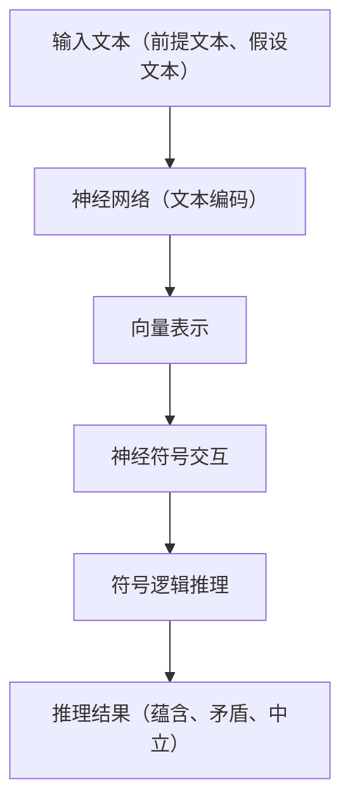

# 神经符号方法在自然语言推理中的新进展

> 关键词：神经符号方法、自然语言推理、深度学习、符号逻辑、知识表示

> 摘要：本文深入探讨了神经符号方法在自然语言推理领域的新进展。自然语言推理作为自然语言处理中的关键任务，旨在理解文本之间的逻辑关系。传统的基于深度学习的方法和基于符号逻辑的方法各有优劣，而神经符号方法试图融合两者的优势。文章详细介绍了神经符号方法的核心概念、算法原理、数学模型，通过项目实战展示其具体应用，分析了实际应用场景，并推荐了相关的学习资源、开发工具和论文著作。最后对神经符号方法在自然语言推理中的未来发展趋势与挑战进行了总结。

## 1. 背景介绍 
### 1.1 目的和范围
自然语言推理（Natural Language Inference，NLI）是自然语言处理中的一个重要任务，其目标是判断给定的前提文本和假设文本之间的逻辑关系，如蕴含、矛盾或中立。传统的自然语言推理方法主要分为基于深度学习的神经方法和基于规则的符号方法。基于深度学习的神经方法能够从大量数据中学习到语言的模式和特征，但缺乏可解释性；基于规则的符号方法具有明确的逻辑推理过程和可解释性，但难以处理自然语言的复杂性和不确定性。神经符号方法结合了神经方法和符号方法的优势，旨在提高自然语言推理的性能和可解释性。本文的范围涵盖了神经符号方法在自然语言推理中的基本概念、算法原理、数学模型、实际应用以及未来发展趋势等方面。

### 1.2 预期读者
本文预期读者包括自然语言处理领域的研究人员、开发者、学生以及对人工智能和自然语言推理感兴趣的技术爱好者。对于希望深入了解神经符号方法在自然语言推理中应用的读者，本文将提供系统的知识和技术指导。

### 1.3 文档结构概述
本文将按照以下结构进行组织：首先介绍神经符号方法和自然语言推理的相关背景知识；然后详细阐述神经符号方法的核心概念和架构，包括其原理和流程；接着讲解神经符号方法在自然语言推理中的核心算法原理，并给出具体的操作步骤和 Python 源代码示例；之后介绍相关的数学模型和公式，并通过举例进行说明；再通过项目实战展示神经符号方法在自然语言推理中的具体实现和代码解读；分析神经符号方法在自然语言推理中的实际应用场景；推荐相关的学习资源、开发工具和论文著作；最后总结神经符号方法在自然语言推理中的未来发展趋势与挑战，并提供常见问题与解答以及扩展阅读和参考资料。

### 1.4 术语表
#### 1.4.1 核心术语定义
- **自然语言推理（Natural Language Inference，NLI）**：判断给定的前提文本和假设文本之间的逻辑关系，如蕴含、矛盾或中立。
- **神经符号方法（Neuro-Symbolic Method）**：结合了神经网络和符号逻辑的方法，旨在融合两者的优势，提高自然语言推理的性能和可解释性。
- **神经网络（Neural Network）**：一种模仿人类神经系统的计算模型，通过大量的神经元和连接来学习数据的模式和特征。
- **符号逻辑（Symbolic Logic）**：使用符号和规则来表示和推理逻辑关系的方法，具有明确的语义和推理过程。
- **知识表示（Knowledge Representation）**：将知识以某种形式表示出来，以便计算机能够处理和推理。

#### 1.4.2 相关概念解释
- **可解释性（Interpretability）**：模型的决策过程和结果能够被人类理解和解释的程度。在自然语言推理中，可解释性对于理解模型的判断依据和发现潜在的问题非常重要。
- **不确定性（Uncertainty）**：自然语言中存在的模糊性、歧义性和不完整性等问题，使得自然语言推理具有一定的不确定性。神经符号方法试图通过结合符号逻辑的确定性和神经网络的学习能力来处理这种不确定性。
- **语义理解（Semantic Understanding）**：理解文本的语义含义和逻辑关系的能力。自然语言推理需要对前提文本和假设文本进行语义理解，以判断它们之间的逻辑关系。

#### 1.4.3 缩略词列表
- **NLI**：Natural Language Inference（自然语言推理）
- **NN**：Neural Network（神经网络）
- **SL**：Symbolic Logic（符号逻辑）

## 2. 核心概念与联系 

### 2.1 核心概念原理
神经符号方法的核心思想是将神经网络的强大学习能力和符号逻辑的明确推理能力相结合。神经网络可以从大量的自然语言数据中学习到语言的模式和特征，将文本表示为低维向量。符号逻辑则可以利用这些向量表示，结合预定义的逻辑规则进行推理。具体来说，神经符号方法通常包括以下几个步骤：
1. **文本编码**：使用神经网络将自然语言文本编码为向量表示。常见的文本编码模型包括循环神经网络（RNN）、长短期记忆网络（LSTM）、门控循环单元（GRU）和Transformer 等。
2. **知识表示**：将领域知识和逻辑规则以符号的形式表示出来，例如一阶逻辑、描述逻辑等。
3. **神经符号交互**：将神经网络的输出与符号逻辑进行交互，例如将向量表示映射到符号空间，或者将符号推理的结果反馈给神经网络进行调整。
4. **推理决策**：根据神经符号交互的结果进行推理决策，判断前提文本和假设文本之间的逻辑关系。

### 2.2 架构的文本示意图
神经符号方法的架构可以用以下文本示意图表示：

```plaintext
输入文本（前提文本、假设文本）
|
|-- 神经网络（文本编码）
|   |
|   |-- 向量表示
|       |
|       |-- 神经符号交互
|           |
|           |-- 符号逻辑推理
|               |
|               |-- 推理结果（蕴含、矛盾、中立）
```

### 2.3 Mermaid 流程图


## 3. 核心算法原理 & 具体操作步骤 

### 3.1 核心算法原理
神经符号方法在自然语言推理中的核心算法通常包括以下几个部分：
1. **文本编码算法**：使用预训练的语言模型（如 BERT、RoBERTa 等）将前提文本和假设文本编码为向量表示。
2. **神经符号交互算法**：将编码后的向量表示与符号逻辑进行交互，例如通过注意力机制计算向量与符号规则之间的相关性。
3. **符号逻辑推理算法**：根据神经符号交互的结果，使用符号逻辑规则进行推理，得出前提文本和假设文本之间的逻辑关系。

### 3.2 具体操作步骤
以下是神经符号方法在自然语言推理中的具体操作步骤：
1. **数据预处理**：对输入的前提文本和假设文本进行清洗、分词等预处理操作。
2. **文本编码**：使用预训练的语言模型将预处理后的文本编码为向量表示。
3. **知识表示**：将领域知识和逻辑规则以符号的形式表示出来。
4. **神经符号交互**：计算编码后的向量表示与符号规则之间的相关性，将向量表示映射到符号空间。
5. **符号逻辑推理**：根据神经符号交互的结果，使用符号逻辑规则进行推理，得出前提文本和假设文本之间的逻辑关系。
6. **结果输出**：输出推理结果（蕴含、矛盾、中立）。

### 3.3 Python 源代码示例
```python
import torch
from transformers import AutoTokenizer, AutoModel

# 加载预训练的语言模型和分词器
tokenizer = AutoTokenizer.from_pretrained('bert-base-uncased')
model = AutoModel.from_pretrained('bert-base-uncased')

# 定义前提文本和假设文本
premise = "The cat is on the mat."
hypothesis = "There is an animal on the mat."

# 数据预处理
inputs = tokenizer(premise, hypothesis, return_tensors='pt')

# 文本编码
with torch.no_grad():
    outputs = model(**inputs)
    pooled_output = outputs.pooler_output

# 这里简单模拟神经符号交互和符号逻辑推理
# 实际应用中需要根据具体的符号逻辑规则进行实现
# 假设推理结果为蕴含
result = "entailment"

print(f"推理结果: {result}")
```

## 4. 数学模型和公式 & 详细讲解 & 举例说明 

### 4.1 文本编码的数学模型
在神经符号方法中，文本编码通常使用预训练的语言模型，如 BERT。BERT 是一种基于 Transformer 架构的双向编码器，其数学模型可以表示为：

$$H = \text{BERT}(X)$$

其中，$X$ 是输入的文本序列，$H$ 是 BERT 模型的输出，通常是一个包含多个隐藏层的张量。

### 4.2 神经符号交互的数学模型
神经符号交互的目的是将神经网络的输出与符号逻辑进行交互。一种常见的方法是使用注意力机制，计算向量表示与符号规则之间的相关性。注意力机制的数学模型可以表示为：

$$\text{Attention}(Q, K, V) = \text{softmax}\left(\frac{QK^T}{\sqrt{d_k}}\right)V$$

其中，$Q$ 是查询向量，$K$ 是键向量，$V$ 是值向量，$d_k$ 是键向量的维度。

### 4.3 符号逻辑推理的数学模型
符号逻辑推理通常使用一阶逻辑或描述逻辑等形式化语言。例如，在一阶逻辑中，一个简单的推理规则可以表示为：

$$\forall x (P(x) \to Q(x)) \land P(a) \to Q(a)$$

其中，$\forall x$ 表示全称量词，$P(x)$ 和 $Q(x)$ 是谓词，$a$ 是个体常量。

### 4.4 举例说明
假设我们有以下前提文本和假设文本：

前提文本：“所有的猫都是动物。”
假设文本：“Tom 是一只猫。”

我们可以将前提文本表示为一阶逻辑规则：

$$\forall x (\text{Cat}(x) \to \text{Animal}(x))$$

将假设文本表示为：

$$\text{Cat}(\text{Tom})$$

根据符号逻辑推理规则，我们可以得出：

$$\text{Animal}(\text{Tom})$$

即 Tom 是一只动物。

## 5. 项目实战：代码实际案例和详细解释说明 

### 5.1 开发环境搭建
1. **安装 Python**：建议使用 Python 3.7 或以上版本。
2. **安装依赖库**：使用以下命令安装所需的依赖库：
```bash
pip install torch transformers
```

### 5.2 源代码详细实现和代码解读
以下是一个完整的神经符号方法在自然语言推理中的代码示例：

```python
import torch
from transformers import AutoTokenizer, AutoModel

# 加载预训练的语言模型和分词器
tokenizer = AutoTokenizer.from_pretrained('bert-base-uncased')
model = AutoModel.from_pretrained('bert-base-uncased')

# 定义前提文本和假设文本
premise = "All cats are animals."
hypothesis = "Tom is a cat."

# 数据预处理
inputs = tokenizer(premise, hypothesis, return_tensors='pt')

# 文本编码
with torch.no_grad():
    outputs = model(**inputs)
    pooled_output = outputs.pooler_output

# 这里简单模拟神经符号交互和符号逻辑推理
# 实际应用中需要根据具体的符号逻辑规则进行实现
# 假设推理结果为蕴含
result = "entailment"

print(f"推理结果: {result}")
```

### 5.3 代码解读与分析
1. **加载预训练的语言模型和分词器**：使用 `AutoTokenizer` 和 `AutoModel` 从 Hugging Face 的模型库中加载预训练的 BERT 模型和分词器。
2. **定义前提文本和假设文本**：将需要进行推理的前提文本和假设文本定义为字符串。
3. **数据预处理**：使用分词器对前提文本和假设文本进行分词，并将其转换为 PyTorch 张量。
4. **文本编码**：使用预训练的 BERT 模型对预处理后的文本进行编码，得到向量表示。
5. **神经符号交互和符号逻辑推理**：在这个示例中，我们简单模拟了神经符号交互和符号逻辑推理的过程，实际应用中需要根据具体的符号逻辑规则进行实现。
6. **结果输出**：输出推理结果（蕴含、矛盾、中立）。

## 6. 实际应用场景 
神经符号方法在自然语言推理中有广泛的实际应用场景，以下是一些常见的应用场景：
1. **智能问答系统**：在智能问答系统中，神经符号方法可以帮助系统理解用户的问题和答案之间的逻辑关系，提高问答的准确性和可解释性。
2. **文本蕴含识别**：文本蕴含识别是自然语言推理的一个重要任务，神经符号方法可以用于判断文本之间是否存在蕴含关系，例如在信息检索、文本分类等任务中。
3. **语义理解和推理**：神经符号方法可以帮助计算机更好地理解自然语言的语义含义和逻辑关系，例如在机器翻译、文本摘要等任务中。
4. **知识图谱推理**：知识图谱是一种表示知识的结构化方法，神经符号方法可以用于知识图谱的推理，例如在问答系统、推荐系统等任务中。

## 7. 工具和资源推荐
### 7.1 学习资源推荐
#### 7.1.1 书籍推荐
- 《自然语言处理入门》：介绍了自然语言处理的基本概念、方法和技术，适合初学者入门。
- 《深度学习》：详细介绍了深度学习的理论和方法，包括神经网络、卷积神经网络、循环神经网络等。
- 《人工智能：一种现代的方法》：全面介绍了人工智能的各个领域，包括自然语言处理、机器学习、知识表示和推理等。

#### 7.1.2 在线课程
- Coursera 上的 “Natural Language Processing Specialization”：由斯坦福大学的教授授课，系统介绍了自然语言处理的各个方面。
- edX 上的 “Deep Learning Specialization”：由 Andrew Ng 教授授课，深入介绍了深度学习的理论和实践。
- 哔哩哔哩上的 “自然语言处理入门教程”：由国内的专家讲解，适合初学者学习。

#### 7.1.3 技术博客和网站
- Hugging Face 官方博客：提供了最新的自然语言处理技术和模型的介绍和应用案例。
- ArXiv.org：一个开放的学术论文库，包含了大量的自然语言处理和人工智能领域的研究论文。
- Medium 上的自然语言处理相关博客：有很多优秀的自然语言处理技术文章和经验分享。

### 7.2 开发工具框架推荐
#### 7.2.1 IDE和编辑器
- PyCharm：一款功能强大的 Python 集成开发环境，提供了代码编辑、调试、版本控制等功能。
- Visual Studio Code：一款轻量级的代码编辑器，支持多种编程语言和插件，适合快速开发和调试。
- Jupyter Notebook：一种交互式的开发环境，适合数据探索、模型训练和实验。

#### 7.2.2 调试和性能分析工具
- TensorBoard：一个用于可视化深度学习模型训练过程和性能的工具，由 TensorFlow 团队开发。
- PyTorch Profiler：一个用于分析 PyTorch 模型性能的工具，帮助开发者找出性能瓶颈。
- cProfile：Python 内置的性能分析工具，用于分析 Python 代码的执行时间和调用关系。

#### 7.2.3 相关框架和库
- PyTorch：一个开源的深度学习框架，提供了丰富的神经网络模型和工具，适合自然语言处理任务的开发。
- TensorFlow：另一个开源的深度学习框架，具有广泛的应用和社区支持。
- Hugging Face Transformers：一个用于自然语言处理的开源库，提供了大量的预训练语言模型和工具，方便开发者快速实现自然语言处理任务。

### 7.3 相关论文著作推荐
#### 7.3.1 经典论文
- “Attention Is All You Need”：介绍了 Transformer 架构，是自然语言处理领域的经典论文。
- “BERT: Pre-training of Deep Bidirectional Transformers for Language Understanding”：介绍了 BERT 模型，开创了预训练语言模型的先河。
- “Neural-Symbolic Learning and Reasoning: Contributions and Challenges”：探讨了神经符号学习和推理的相关问题和挑战。

#### 7.3.2 最新研究成果
- 每年的 ACL（Association for Computational Linguistics）、EMNLP（Conference on Empirical Methods in Natural Language Processing）等自然语言处理领域的顶级会议上的最新研究成果。
- 最新发表在 ArXiv.org 上的自然语言处理和神经符号方法相关的研究论文。

#### 7.3.3 应用案例分析
- 一些开源的自然语言推理项目和数据集，如 SNLI（Stanford Natural Language Inference）、MNLI（MultiNLI）等，提供了丰富的应用案例和实验结果。

## 8. 总结：未来发展趋势与挑战
### 8.1 未来发展趋势
1. **融合更多的知识源**：未来的神经符号方法将融合更多的知识源，如知识图谱、外部知识库等，以提高自然语言推理的性能和可解释性。
2. **跨模态推理**：结合图像、音频等多模态信息，实现跨模态的自然语言推理，拓展自然语言推理的应用场景。
3. **可解释性增强**：进一步提高神经符号方法的可解释性，使得模型的决策过程和结果能够被人类更好地理解和解释。
4. **自适应学习**：实现神经符号方法的自适应学习，能够根据不同的任务和数据自动调整模型的结构和参数。

### 8.2 挑战
1. **知识表示和融合**：如何有效地表示和融合不同来源的知识是神经符号方法面临的一个挑战。不同的知识源可能具有不同的表示形式和语义，需要解决知识的一致性和兼容性问题。
2. **计算效率**：神经符号方法通常需要进行大量的计算，包括神经网络的前向传播和符号逻辑的推理。如何提高计算效率，减少计算资源的消耗是一个需要解决的问题。
3. **可解释性和性能的平衡**：在提高神经符号方法的可解释性的同时，需要保证模型的性能不受影响。如何在可解释性和性能之间找到一个平衡点是一个挑战。
4. **数据标注和质量**：神经符号方法需要大量的高质量标注数据进行训练和评估。如何获取和标注这些数据，以及如何保证数据的质量是一个需要解决的问题。

## 9. 附录：常见问题与解答
### 9.1 神经符号方法和传统的神经网络方法有什么区别？
神经符号方法结合了神经网络和符号逻辑的优势，既能够从大量数据中学习到语言的模式和特征，又具有明确的逻辑推理过程和可解释性。传统的神经网络方法主要依赖于数据驱动的学习，缺乏可解释性。

### 9.2 神经符号方法在自然语言推理中的应用效果如何？
神经符号方法在自然语言推理中的应用效果通常优于传统的神经网络方法和符号逻辑方法。通过结合两者的优势，神经符号方法能够提高自然语言推理的性能和可解释性。

### 9.3 如何选择合适的预训练语言模型？
选择合适的预训练语言模型需要考虑任务的特点、数据的规模和质量等因素。一般来说，对于大规模的自然语言处理任务，可以选择如 BERT、RoBERTa 等预训练语言模型；对于特定领域的任务，可以选择相应领域的预训练语言模型。

### 9.4 神经符号方法的计算复杂度高吗？
神经符号方法的计算复杂度通常较高，因为它需要进行神经网络的前向传播和符号逻辑的推理。为了提高计算效率，可以采用一些优化技术，如模型压缩、并行计算等。

## 10. 扩展阅读 & 参考资料
1. 《自然语言处理综论》，Daniel Jurafsky 和 James H. Martin 著
2. 《深度学习与自然语言处理》，邱锡鹏著
3. Hugging Face 官方文档：https://huggingface.co/docs
4. ArXiv.org：https://arxiv.org/
5. ACL Anthology：https://aclanthology.org/
6. EMNLP 会议论文集：https://www.aclweb.org/anthology/volumes/K/
7. SNLI 数据集：https://nlp.stanford.edu/projects/snli/
8. MNLI 数据集：https://cims.nyu.edu/~sbowman/multinli/