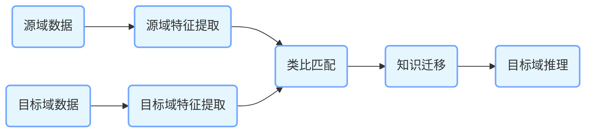

# 神经类比转移学习在跨域推理中的效果研究

> 关键词：神经类比转移学习、跨域推理、机器学习、深度学习、知识迁移

> 摘要：本文旨在深入研究神经类比转移学习在跨域推理中的效果。首先介绍了相关研究的背景，包括目的、预期读者、文档结构和术语表。接着阐述了神经类比转移学习和跨域推理的核心概念及它们之间的联系，通过文本示意图和Mermaid流程图进行了清晰展示。详细讲解了核心算法原理，并给出Python源代码实现。探讨了相关的数学模型和公式，结合实际例子进行说明。通过项目实战，从开发环境搭建、源代码实现和代码解读等方面进行了详细分析。分析了神经类比转移学习在跨域推理中的实际应用场景。推荐了相关的学习资源、开发工具框架和论文著作。最后总结了未来发展趋势与挑战，解答了常见问题，并提供了扩展阅读和参考资料。

## 1. 背景介绍 
### 1.1 目的和范围
随着人工智能技术的不断发展，跨域推理成为了一个重要的研究方向。在不同的领域中，数据的特征和分布往往存在差异，传统的机器学习方法在处理跨域问题时面临着诸多挑战。神经类比转移学习作为一种新兴的技术，旨在通过类比的方式将源域的知识迁移到目标域，从而提高跨域推理的效果。本文的目的是深入研究神经类比转移学习在跨域推理中的效果，通过理论分析、实验验证和实际应用案例，探讨其优势和局限性。研究范围涵盖了神经类比转移学习的核心概念、算法原理、数学模型，以及在不同领域的实际应用。

### 1.2 预期读者
本文主要面向人工智能、机器学习、深度学习等领域的研究人员、工程师和学生。对于希望了解神经类比转移学习在跨域推理中的应用和效果的专业人士，本文提供了全面的理论和实践指导。同时，对于对跨域推理和知识迁移感兴趣的初学者，也可以通过本文初步了解相关的概念和技术。

### 1.3 文档结构概述
本文共分为十个部分。第一部分为背景介绍，阐述了研究的目的、范围、预期读者和文档结构。第二部分介绍了神经类比转移学习和跨域推理的核心概念，以及它们之间的联系，并通过文本示意图和Mermaid流程图进行了可视化展示。第三部分详细讲解了核心算法原理，并给出了Python源代码实现。第四部分探讨了相关的数学模型和公式，结合实际例子进行了详细说明。第五部分通过项目实战，从开发环境搭建、源代码实现和代码解读等方面进行了深入分析。第六部分分析了神经类比转移学习在跨域推理中的实际应用场景。第七部分推荐了相关的学习资源、开发工具框架和论文著作。第八部分总结了未来发展趋势与挑战。第九部分解答了常见问题。第十部分提供了扩展阅读和参考资料。

### 1.4 术语表
#### 1.4.1 核心术语定义
- **神经类比转移学习**：是一种基于神经网络的转移学习方法，通过类比的方式将源域的知识迁移到目标域，以提高目标域的学习效果。
- **跨域推理**：指在不同的领域之间进行推理和决策，需要克服领域之间的数据差异和知识隔阂。
- **源域**：是指已经拥有大量数据和知识的领域，作为知识迁移的来源。
- **目标域**：是指需要应用源域知识进行学习和推理的领域，通常数据较少或缺乏标注。

#### 1.4.2 相关概念解释
- **转移学习**：是机器学习中的一个重要概念，旨在利用已有的知识和经验来加速新任务的学习。转移学习可以在不同的领域、任务和数据之间进行知识迁移。
- **类比学习**：是一种基于类比推理的学习方法，通过寻找不同事物之间的相似性，将已知的知识和经验应用到新的情境中。
- **神经网络**：是一种模仿人类神经系统的计算模型，由大量的神经元组成，可以自动学习数据中的特征和模式。

#### 1.4.3 缩略词列表
- **TL**：Transfer Learning（转移学习）
- **NATL**：Neural Analogical Transfer Learning（神经类比转移学习）
- **ML**：Machine Learning（机器学习）
- **DL**：Deep Learning（深度学习）

## 2. 核心概念与联系 

### 核心概念原理
#### 神经类比转移学习
神经类比转移学习是在传统转移学习的基础上，引入了类比推理的思想。其核心原理是通过神经网络学习源域和目标域之间的类比关系，将源域中已经学习到的知识和模式，以类比的方式迁移到目标域中。具体来说，神经类比转移学习首先通过神经网络对源域数据进行特征提取和表示学习，得到源域的特征表示。然后，在目标域中寻找与源域特征表示相似的特征，通过类比映射将源域的知识和模式应用到目标域中。

#### 跨域推理
跨域推理是指在不同的领域之间进行推理和决策。在实际应用中，不同领域的数据往往具有不同的特征和分布，传统的推理方法在处理跨域问题时效果不佳。跨域推理需要解决领域之间的数据差异和知识隔阂，通过迁移学习等方法将源域的知识应用到目标域中，从而提高目标域的推理能力。

### 架构的文本示意图
神经类比转移学习在跨域推理中的架构可以描述如下：

源域数据经过神经网络的特征提取层，得到源域的特征表示。同时，目标域数据也经过相同或相似的特征提取层，得到目标域的特征表示。然后，通过类比匹配模块，寻找源域和目标域特征表示之间的相似性。根据类比匹配的结果，将源域的知识和模式通过迁移模块迁移到目标域中。最后，在目标域中使用迁移后的知识进行推理和决策。

### Mermaid流程图


这个流程图展示了神经类比转移学习在跨域推理中的主要流程。首先，分别对源域和目标域数据进行特征提取。然后，通过类比匹配模块找到源域和目标域特征之间的相似性。接着，根据匹配结果进行知识迁移。最后，在目标域中使用迁移后的知识进行推理。

## 3. 核心算法原理 & 具体操作步骤 

### 核心算法原理
神经类比转移学习在跨域推理中的核心算法主要包括以下几个步骤：

#### 1. 特征提取
使用神经网络对源域和目标域数据进行特征提取。常用的神经网络包括卷积神经网络（CNN）、循环神经网络（RNN）等。以CNN为例，其基本原理是通过卷积层、池化层和全连接层对数据进行特征提取和表示学习。

#### 2. 类比匹配
在得到源域和目标域的特征表示后，需要寻找它们之间的相似性。常用的类比匹配方法包括欧氏距离、余弦相似度等。假设源域特征表示为 $x_s$，目标域特征表示为 $x_t$，则余弦相似度可以表示为：

$$\text{CosineSimilarity}(x_s, x_t) = \frac{x_s \cdot x_t}{\|x_s\| \|x_t\|}$$

#### 3. 知识迁移
根据类比匹配的结果，将源域的知识和模式迁移到目标域中。一种常见的方法是通过微调神经网络的参数。在源域上预训练的神经网络，在目标域上进行微调，使得神经网络能够适应目标域的数据分布。

### 具体操作步骤及Python源代码实现

```python
import torch
import torch.nn as nn
import torch.optim as optim
from torch.utils.data import DataLoader, Dataset

# 定义一个简单的神经网络模型
class SimpleNet(nn.Module):
    def __init__(self, input_size, hidden_size, output_size):
        super(SimpleNet, self).__init__()
        self.fc1 = nn.Linear(input_size, hidden_size)
        self.relu = nn.ReLU()
        self.fc2 = nn.Linear(hidden_size, output_size)

    def forward(self, x):
        out = self.fc1(x)
        out = self.relu(out)
        out = self.fc2(out)
        return out

# 定义源域和目标域数据集
class SourceDataset(Dataset):
    def __init__(self, data, labels):
        self.data = data
        self.labels = labels

    def __len__(self):
        return len(self.data)

    def __getitem__(self, idx):
        return self.data[idx], self.labels[idx]

class TargetDataset(Dataset):
    def __init__(self, data, labels):
        self.data = data
        self.labels = labels

    def __len__(self):
        return len(self.data)

    def __getitem__(self, idx):
        return self.data[idx], self.labels[idx]

# 训练源域模型
def train_source_model(model, source_dataloader, criterion, optimizer, epochs):
    model.train()
    for epoch in range(epochs):
        running_loss = 0.0
        for inputs, labels in source_dataloader:
            optimizer.zero_grad()
            outputs = model(inputs)
            loss = criterion(outputs, labels)
            loss.backward()
            optimizer.step()
            running_loss += loss.item()
        print(f'Epoch {epoch+1}, Loss: {running_loss/len(source_dataloader)}')

# 微调目标域模型
def fine_tune_target_model(model, target_dataloader, criterion, optimizer, epochs):
    model.train()
    for epoch in range(epochs):
        running_loss = 0.0
        for inputs, labels in target_dataloader:
            optimizer.zero_grad()
            outputs = model(inputs)
            loss = criterion(outputs, labels)
            loss.backward()
            optimizer.step()
            running_loss += loss.item()
        print(f'Epoch {epoch+1}, Loss: {running_loss/len(target_dataloader)}')

# 主函数
if __name__ == '__main__':
    # 生成一些示例数据
    input_size = 10
    hidden_size = 20
    output_size = 2
    source_data = torch.randn(100, input_size)
    source_labels = torch.randint(0, output_size, (100,))
    target_data = torch.randn(50, input_size)
    target_labels = torch.randint(0, output_size, (50,))

    # 创建数据集和数据加载器
    source_dataset = SourceDataset(source_data, source_labels)
    source_dataloader = DataLoader(source_dataset, batch_size=10, shuffle=True)
    target_dataset = TargetDataset(target_data, target_labels)
    target_dataloader = DataLoader(target_dataset, batch_size=10, shuffle=True)

    # 初始化模型
    model = SimpleNet(input_size, hidden_size, output_size)

    # 定义损失函数和优化器
    criterion = nn.CrossEntropyLoss()
    optimizer = optim.Adam(model.parameters(), lr=0.001)

    # 训练源域模型
    train_source_model(model, source_dataloader, criterion, optimizer, epochs=10)

    # 微调目标域模型
    fine_tune_target_model(model, target_dataloader, criterion, optimizer, epochs=5)
```

### 代码解释
1. **模型定义**：定义了一个简单的全连接神经网络 `SimpleNet`，包含一个输入层、一个隐藏层和一个输出层。
2. **数据集定义**：定义了源域和目标域的数据集类 `SourceDataset` 和 `TargetDataset`，用于封装数据和标签。
3. **训练函数**：`train_source_model` 函数用于在源域上训练模型，`fine_tune_target_model` 函数用于在目标域上微调模型。
4. **主函数**：生成示例数据，创建数据集和数据加载器，初始化模型，定义损失函数和优化器，先在源域上训练模型，然后在目标域上微调模型。

## 4. 数学模型和公式 & 详细讲解 & 举例说明 

### 特征提取阶段
在特征提取阶段，我们使用神经网络对数据进行特征表示。假设输入数据为 $x \in \mathbb{R}^n$，神经网络的参数为 $\theta$，则通过神经网络得到的特征表示为 $f(x; \theta) \in \mathbb{R}^m$，其中 $m$ 是特征的维度。

以一个简单的全连接层为例，其数学模型可以表示为：

$$y = Wx + b$$

其中 $W \in \mathbb{R}^{m \times n}$ 是权重矩阵，$b \in \mathbb{R}^m$ 是偏置向量。

### 类比匹配阶段
在类比匹配阶段，我们使用余弦相似度来衡量源域和目标域特征表示之间的相似性。假设源域特征表示为 $x_s \in \mathbb{R}^m$，目标域特征表示为 $x_t \in \mathbb{R}^m$，则余弦相似度的计算公式为：

$$\text{CosineSimilarity}(x_s, x_t) = \frac{x_s \cdot x_t}{\|x_s\| \|x_t\|}$$

其中 $x_s \cdot x_t$ 是向量的点积，$\|x_s\|$ 和 $\|x_t\|$ 分别是向量的范数。

### 知识迁移阶段
在知识迁移阶段，我们通过微调神经网络的参数来将源域的知识迁移到目标域中。假设神经网络的损失函数为 $L(\theta; D)$，其中 $\theta$ 是神经网络的参数，$D$ 是数据集。在源域上训练的目标是最小化源域的损失函数：

$$\min_{\theta} L(\theta; D_s)$$

其中 $D_s$ 是源域数据集。在目标域上微调的目标是最小化目标域的损失函数：

$$\min_{\theta} L(\theta; D_t)$$

其中 $D_t$ 是目标域数据集。

### 举例说明
假设我们有一个源域数据集 $D_s$，包含 100 个样本，每个样本的特征维度为 10。目标域数据集 $D_t$ 包含 50 个样本，特征维度也为 10。我们使用一个简单的全连接神经网络进行特征提取，隐藏层的维度为 20，输出层的维度为 2。

首先，在源域上训练神经网络，使用交叉熵损失函数和 Adam 优化器。训练 10 个 epoch 后，得到在源域上训练好的模型。

然后，在目标域上微调模型，同样使用交叉熵损失函数和 Adam 优化器。微调 5 个 epoch 后，模型可以更好地适应目标域的数据分布。

通过这种方式，我们将源域的知识迁移到了目标域中，提高了目标域的推理能力。

## 5. 项目实战：代码实际案例和详细解释说明 

### 5.1  开发环境搭建
#### 操作系统
可以选择 Linux（如 Ubuntu）、Windows 或 macOS 作为开发环境的操作系统。

#### Python 环境
安装 Python 3.7 或以上版本。可以使用 Anaconda 来管理 Python 环境，它可以方便地创建和管理虚拟环境。

#### 深度学习框架
使用 PyTorch 作为深度学习框架。可以通过以下命令安装 PyTorch：

```bash
pip install torch torchvision
```

#### 其他依赖库
安装一些常用的依赖库，如 NumPy、Matplotlib 等：

```bash
pip install numpy matplotlib
```

### 5.2  源代码详细实现和代码解读
我们将使用一个简单的图像分类任务作为项目实战的案例，展示神经类比转移学习在跨域推理中的应用。

```python
import torch
import torch.nn as nn
import torch.optim as optim
from torchvision import datasets, transforms
from torch.utils.data import DataLoader

# 定义一个简单的卷积神经网络模型
class SimpleCNN(nn.Module):
    def __init__(self):
        super(SimpleCNN, self).__init__()
        self.conv1 = nn.Conv2d(3, 16, kernel_size=3, padding=1)
        self.relu1 = nn.ReLU()
        self.pool1 = nn.MaxPool2d(2)
        self.conv2 = nn.Conv2d(16, 32, kernel_size=3, padding=1)
        self.relu2 = nn.ReLU()
        self.pool2 = nn.MaxPool2d(2)
        self.fc1 = nn.Linear(32 * 8 * 8, 128)
        self.relu3 = nn.ReLU()
        self.fc2 = nn.Linear(128, 10)

    def forward(self, x):
        x = self.pool1(self.relu1(self.conv1(x)))
        x = self.pool2(self.relu2(self.conv2(x)))
        x = x.view(-1, 32 * 8 * 8)
        x = self.relu3(self.fc1(x))
        x = self.fc2(x)
        return x

# 数据预处理
transform = transforms.Compose([
    transforms.Resize((32, 32)),
    transforms.ToTensor(),
    transforms.Normalize((0.5, 0.5, 0.5), (0.5, 0.5, 0.5))
])

# 加载源域数据集（CIFAR-10）
source_dataset = datasets.CIFAR10(root='./data', train=True,
                                  download=True, transform=transform)
source_dataloader = DataLoader(source_dataset, batch_size=32, shuffle=True)

# 加载目标域数据集（假设是一个类似的图像分类数据集）
target_dataset = datasets.CIFAR10(root='./data', train=False,
                                  download=True, transform=transform)
target_dataloader = DataLoader(target_dataset, batch_size=32, shuffle=True)

# 初始化模型
model = SimpleCNN()

# 定义损失函数和优化器
criterion = nn.CrossEntropyLoss()
optimizer = optim.Adam(model.parameters(), lr=0.001)

# 训练源域模型
def train_source_model(model, source_dataloader, criterion, optimizer, epochs):
    model.train()
    for epoch in range(epochs):
        running_loss = 0.0
        for inputs, labels in source_dataloader:
            optimizer.zero_grad()
            outputs = model(inputs)
            loss = criterion(outputs, labels)
            loss.backward()
            optimizer.step()
            running_loss += loss.item()
        print(f'Epoch {epoch+1}, Loss: {running_loss/len(source_dataloader)}')

# 微调目标域模型
def fine_tune_target_model(model, target_dataloader, criterion, optimizer, epochs):
    model.train()
    for epoch in range(epochs):
        running_loss = 0.0
        for inputs, labels in target_dataloader:
            optimizer.zero_grad()
            outputs = model(inputs)
            loss = criterion(outputs, labels)
            loss.backward()
            optimizer.step()
            running_loss += loss.item()
        print(f'Epoch {epoch+1}, Loss: {running_loss/len(target_dataloader)}')

# 主函数
if __name__ == '__main__':
    # 训练源域模型
    train_source_model(model, source_dataloader, criterion, optimizer, epochs=10)

    # 微调目标域模型
    fine_tune_target_model(model, target_dataloader, criterion, optimizer, epochs=5)
```

### 代码解读
1. **模型定义**：定义了一个简单的卷积神经网络 `SimpleCNN`，包含两个卷积层、两个池化层和两个全连接层。
2. **数据预处理**：使用 `transforms.Compose` 定义了数据预处理的步骤，包括图像缩放、转换为张量和归一化。
3. **数据集加载**：使用 `torchvision.datasets.CIFAR10` 加载源域和目标域数据集，并使用 `DataLoader` 创建数据加载器。
4. **训练函数**：`train_source_model` 函数用于在源域上训练模型，`fine_tune_target_model` 函数用于在目标域上微调模型。
5. **主函数**：先在源域上训练模型，然后在目标域上微调模型。

### 5.3  代码解读与分析
#### 模型结构分析
`SimpleCNN` 模型通过卷积层提取图像的特征，池化层对特征进行下采样，减少数据的维度。全连接层将提取的特征映射到分类结果。

#### 训练过程分析
在源域上训练模型时，模型学习到了源域数据的特征和模式。在目标域上微调模型时，通过调整模型的参数，使模型能够更好地适应目标域的数据分布。

#### 性能评估
可以在目标域的测试集上评估模型的性能，计算准确率、召回率等指标，以验证神经类比转移学习在跨域推理中的效果。

## 6. 实际应用场景 
### 医疗领域
在医疗领域，不同地区的医疗数据可能存在差异。例如，不同医院的设备、诊断标准和患者群体可能不同。神经类比转移学习可以将在一个地区或医院积累的医疗知识和经验迁移到其他地区或医院，提高疾病诊断和治疗的准确性。例如，将在大城市三甲医院训练好的疾病诊断模型迁移到基层医院，帮助基层医生更好地诊断疾病。

### 金融领域
在金融领域，不同市场的金融数据和交易规则也存在差异。神经类比转移学习可以将在成熟市场上学习到的投资策略和风险评估模型迁移到新兴市场，帮助投资者更好地进行投资决策。例如，将在欧美市场训练好的股票预测模型迁移到亚洲市场，提高股票预测的准确性。

### 自然语言处理领域
在自然语言处理领域，不同领域的文本数据具有不同的语言风格和语义特征。神经类比转移学习可以将在一个领域（如新闻领域）训练好的语言模型迁移到其他领域（如医疗领域、法律领域），提高文本分类、情感分析等任务的性能。例如，将在新闻文本上训练好的情感分析模型迁移到医疗评论文本上，对患者的满意度进行分析。

### 图像识别领域
在图像识别领域，不同场景的图像数据也存在差异。例如，不同的光照条件、拍摄角度和图像分辨率会影响图像的特征。神经类比转移学习可以将在一个场景（如室内场景）训练好的图像识别模型迁移到其他场景（如室外场景），提高图像识别的准确率。例如，将在室内监控图像上训练好的目标检测模型迁移到室外街道图像上，检测行人、车辆等目标。

## 7. 工具和资源推荐
### 7.1 学习资源推荐
#### 7.1.1 书籍推荐
- 《深度学习》（Deep Learning）：由 Ian Goodfellow、Yoshua Bengio 和 Aaron Courville 合著，是深度学习领域的经典教材，全面介绍了深度学习的基本概念、算法和应用。
- 《Python 深度学习》（Deep Learning with Python）：由 Francois Chollet 所著，以 Keras 为主要框架，介绍了深度学习的实践方法和应用案例。
- 《机器学习》（Machine Learning）：由 Tom Mitchell 所著，是机器学习领域的经典教材，系统介绍了机器学习的基本概念、算法和理论。

#### 7.1.2 在线课程
- Coursera 上的“深度学习专项课程”（Deep Learning Specialization）：由 Andrew Ng 教授授课，包括五门课程，涵盖了深度学习的基础知识、卷积神经网络、循环神经网络等内容。
- edX 上的“人工智能基础”（Foundations of Artificial Intelligence）：由 UC Berkeley 教授授课，介绍了人工智能的基本概念、算法和应用。
- 哔哩哔哩上的“李宏毅机器学习课程”：由台湾大学李宏毅教授授课，课程内容生动有趣，适合初学者学习。

#### 7.1.3 技术博客和网站
- Medium：是一个技术博客平台，有很多关于深度学习、机器学习的优秀文章。
- arXiv：是一个预印本平台，提供了大量的学术论文，涵盖了人工智能、机器学习等领域的最新研究成果。
- Kaggle：是一个数据科学竞赛平台，提供了丰富的数据集和代码示例，适合学习和实践。

### 7.2 开发工具框架推荐
#### 7.2.1 IDE和编辑器
- PyCharm：是一款专门为 Python 开发设计的集成开发环境，具有代码自动补全、调试、版本控制等功能。
- Jupyter Notebook：是一个交互式的开发环境，适合进行数据探索、模型训练和可视化。
- Visual Studio Code：是一款轻量级的代码编辑器，支持多种编程语言，有丰富的插件和扩展。

#### 7.2.2 调试和性能分析工具
- PyTorch Profiler：是 PyTorch 提供的性能分析工具，可以帮助用户分析模型的运行时间、内存使用等情况。
- TensorBoard：是 TensorFlow 提供的可视化工具，也可以用于 PyTorch 模型的可视化和调试。
- cProfile：是 Python 自带的性能分析工具，可以帮助用户分析代码的运行时间和函数调用情况。

#### 7.2.3 相关框架和库
- PyTorch：是一个开源的深度学习框架，具有动态图、自动求导等特点，广泛应用于学术界和工业界。
- TensorFlow：是另一个开源的深度学习框架，具有强大的分布式训练和部署能力。
- Scikit-learn：是一个开源的机器学习库，提供了丰富的机器学习算法和工具，适合初学者学习和实践。

### 7.3 相关论文著作推荐
#### 7.3.1 经典论文
- “Learning Transferable Features with Deep Adaptation Networks”：提出了深度适应网络（DAN），用于解决跨域分类问题。
- “Domain-Adversarial Training of Neural Networks”：提出了域对抗训练（DANN）方法，通过对抗训练的方式实现跨域学习。
- “Unsupervised Domain Adaptation by Backpropagation”：提出了无监督域适应的反向传播方法，通过最小化源域和目标域的特征分布差异来实现知识迁移。

#### 7.3.2 最新研究成果
- 关注 arXiv 上关于神经类比转移学习和跨域推理的最新论文，了解该领域的最新研究动态。
- 参加国际学术会议，如 NeurIPS、ICML、CVPR 等，获取最新的研究成果和技术趋势。

#### 7.3.3 应用案例分析
- 可以在 Kaggle 上查找关于跨域推理和转移学习的应用案例，学习他人的实践经验和代码实现。
- 关注工业界的技术博客和开源项目，了解神经类比转移学习在实际应用中的案例和解决方案。

## 8. 总结：未来发展趋势与挑战
### 未来发展趋势
#### 更复杂的类比机制
未来的神经类比转移学习可能会引入更复杂的类比机制，不仅仅局限于特征层面的类比，还会考虑语义、结构等层面的类比。例如，通过知识图谱等技术，实现更深入的知识类比和迁移。

#### 多源多目标跨域学习
目前的研究主要集中在单源单目标的跨域学习，未来可能会发展为多源多目标的跨域学习。即从多个源域中获取知识，并将其迁移到多个目标域中，提高知识的复用性和泛化能力。

#### 与其他技术的融合
神经类比转移学习可能会与其他技术，如强化学习、元学习等进行融合。例如，通过强化学习来优化知识迁移的过程，通过元学习来快速适应新的目标域。

### 挑战
#### 领域差异的处理
不同领域之间的差异可能非常大，如何有效地处理这些差异是神经类比转移学习面临的一个挑战。例如，如何在不同的数据分布、特征空间和语义表示之间找到有效的类比关系。

#### 知识迁移的有效性
如何确保从源域迁移到目标域的知识是有效的，不会引入负面迁移，是一个需要解决的问题。需要设计更有效的迁移策略和评估指标，来衡量知识迁移的效果。

#### 可解释性
神经类比转移学习通常使用神经网络等黑盒模型，其决策过程难以解释。在一些对可解释性要求较高的领域，如医疗、金融等，如何提高模型的可解释性是一个重要的挑战。

## 9. 附录：常见问题与解答
### 问题 1：神经类比转移学习和传统转移学习有什么区别？
神经类比转移学习在传统转移学习的基础上，引入了类比推理的思想。传统转移学习主要通过共享模型参数、特征表示等方式进行知识迁移，而神经类比转移学习通过寻找源域和目标域之间的类比关系，将源域的知识以类比的方式迁移到目标域中。

### 问题 2：如何选择合适的类比匹配方法？
选择合适的类比匹配方法需要考虑数据的特点和任务的需求。常见的类比匹配方法包括欧氏距离、余弦相似度等。如果数据是高维向量，且关注向量的方向而不是长度，余弦相似度可能更合适；如果关注向量之间的实际距离，欧氏距离可能更合适。

### 问题 3：神经类比转移学习在实际应用中可能会遇到哪些问题？
在实际应用中，神经类比转移学习可能会遇到领域差异大、数据量不足、负面迁移等问题。领域差异大可能导致难以找到有效的类比关系，数据量不足可能影响模型的训练效果，负面迁移可能会降低目标域的性能。

### 问题 4：如何评估神经类比转移学习在跨域推理中的效果？
可以使用准确率、召回率、F1 值等指标来评估神经类比转移学习在跨域推理中的效果。同时，还可以通过对比实验，比较使用神经类比转移学习和不使用该方法的模型性能，来评估其效果。

## 10. 扩展阅读 & 参考资料
### 扩展阅读
- 阅读更多关于类比推理、知识图谱、元学习等方面的书籍和论文，深入了解相关领域的知识。
- 关注工业界的技术博客和开源项目，了解神经类比转移学习在实际应用中的最新进展。

### 参考资料
- Goodfellow, I., Bengio, Y., & Courville, A. (2016). Deep Learning. MIT Press.
- Chollet, F. (2017). Deep Learning with Python. Manning Publications.
- Mitchell, T. M. (1997). Machine Learning. McGraw-Hill.
- Ganin, Y., & Lempitsky, V. (2015). Unsupervised Domain Adaptation by Backpropagation. arXiv preprint arXiv:1504.07818.
- Long, M., Cao, Y., Wang, J., & Jordan, M. I. (2015). Learning Transferable Features with Deep Adaptation Networks. Proceedings of the 32nd International Conference on Machine Learning (ICML-15).