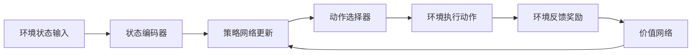

# 神经规划器在多步骤推理策略生成中的应用

> 关键词：神经规划器、多步骤推理、策略生成、人工智能、深度学习

> 摘要：本文深入探讨了神经规划器在多步骤推理策略生成中的应用。首先介绍了研究的背景、目的、预期读者和文档结构，明确了相关术语。接着阐述了神经规划器及多步骤推理策略生成的核心概念与联系，给出了原理和架构的文本示意图与 Mermaid 流程图。详细讲解了核心算法原理并通过 Python 代码进行说明，同时给出了数学模型和公式及具体举例。通过项目实战展示了代码的实际应用，包括开发环境搭建、源代码实现与解读。分析了神经规划器在不同场景下的实际应用，推荐了学习、开发相关的工具和资源，最后总结了未来发展趋势与挑战，解答了常见问题并提供了扩展阅读和参考资料。

## 1. 背景介绍 
### 1.1 目的和范围
在当今复杂的人工智能和自动化系统中，多步骤推理策略生成是一项关键任务。它涉及到在多个连续的决策步骤中，根据当前的状态和目标，生成一系列最优的动作序列。神经规划器作为一种基于神经网络的规划方法，具有强大的学习和泛化能力，能够处理复杂的环境和任务。本文的目的是深入研究神经规划器在多步骤推理策略生成中的应用，探讨其原理、算法、实际应用场景以及未来发展趋势。

本文的范围涵盖了神经规划器的基本概念、核心算法原理、数学模型、实际项目案例、应用场景分析以及相关的工具和资源推荐。通过对这些方面的详细阐述，读者将能够全面了解神经规划器在多步骤推理策略生成中的应用，并具备将其应用到实际项目中的能力。

### 1.2 预期读者
本文的预期读者包括人工智能、机器学习、机器人技术等领域的研究人员、工程师和开发者。对于对多步骤推理和规划问题感兴趣的初学者，本文也提供了丰富的基础知识和详细的解释，有助于他们快速入门。此外，从事自动化系统设计、决策支持系统开发等相关工作的专业人士也可以从本文中获取有价值的信息。

### 1.3 文档结构概述
本文将按照以下结构进行组织：
1. **背景介绍**：介绍研究的目的、范围、预期读者和文档结构，明确相关术语。
2. **核心概念与联系**：阐述神经规划器和多步骤推理策略生成的核心概念，给出原理和架构的文本示意图与 Mermaid 流程图。
3. **核心算法原理 & 具体操作步骤**：详细讲解神经规划器的核心算法原理，并通过 Python 代码进行说明。
4. **数学模型和公式 & 详细讲解 & 举例说明**：给出神经规划器的数学模型和公式，并进行详细讲解和举例说明。
5. **项目实战：代码实际案例和详细解释说明**：通过实际项目案例，展示神经规划器在多步骤推理策略生成中的应用，包括开发环境搭建、源代码实现与解读。
6. **实际应用场景**：分析神经规划器在不同领域的实际应用场景。
7. **工具和资源推荐**：推荐学习、开发神经规划器相关的工具和资源，包括书籍、在线课程、技术博客、IDE、调试工具、相关框架和库以及论文著作。
8. **总结：未来发展趋势与挑战**：总结神经规划器在多步骤推理策略生成中的应用现状，分析未来发展趋势和面临的挑战。
9. **附录：常见问题与解答**：解答读者在学习和应用神经规划器过程中常见的问题。
10. **扩展阅读 & 参考资料**：提供相关的扩展阅读材料和参考资料，方便读者进一步深入学习。

### 1.4 术语表
#### 1.4.1 核心术语定义
- **神经规划器（Neural Planner）**：一种基于神经网络的规划方法，通过学习环境和任务的特征，生成最优的动作序列。
- **多步骤推理（Multi-step Reasoning）**：在多个连续的决策步骤中，根据当前的状态和目标，进行推理和决策，生成一系列动作序列。
- **策略生成（Policy Generation）**：根据环境和任务的要求，生成最优的动作策略。
- **状态（State）**：描述环境和系统当前情况的一组变量。
- **动作（Action）**：系统在某个状态下可以执行的操作。
- **奖励（Reward）**：系统执行某个动作后获得的反馈，用于评估动作的好坏。

#### 1.4.2 相关概念解释
- **强化学习（Reinforcement Learning）**：一种通过智能体与环境进行交互，根据环境反馈的奖励信号来学习最优策略的机器学习方法。神经规划器可以结合强化学习的思想，通过学习奖励信号来生成最优的动作序列。
- **深度学习（Deep Learning）**：一种基于神经网络的机器学习方法，通过多层神经网络来学习数据的特征和模式。神经规划器通常使用深度学习模型来学习环境和任务的特征。
- **搜索算法（Search Algorithm）**：一种用于在状态空间中搜索最优路径的算法，如 A* 算法、Dijkstra 算法等。神经规划器可以结合搜索算法，在状态空间中搜索最优的动作序列。

#### 1.4.3 缩略词列表
- **RL**：Reinforcement Learning，强化学习
- **DL**：Deep Learning，深度学习
- **MDP**：Markov Decision Process，马尔可夫决策过程

## 2. 核心概念与联系 

### 2.1 神经规划器的原理
神经规划器的核心思想是利用神经网络的强大学习能力，学习环境和任务的特征，从而生成最优的动作序列。具体来说，神经规划器通常包含以下几个部分：
1. **状态编码器（State Encoder）**：将环境的状态信息编码为神经网络可以处理的向量表示。
2. **策略网络（Policy Network）**：根据编码后的状态信息，生成动作的概率分布。
3. **价值网络（Value Network）**：评估当前状态的价值，用于指导策略网络的学习。

### 2.2 多步骤推理策略生成的原理
多步骤推理策略生成的目标是在多个连续的决策步骤中，根据当前的状态和目标，生成一系列最优的动作序列。这通常涉及到对环境的建模、对未来状态的预测以及对动作的评估和选择。具体来说，多步骤推理策略生成可以分为以下几个步骤：
1. **环境建模**：对环境进行建模，包括状态空间、动作空间和奖励函数的定义。
2. **状态预测**：根据当前的状态和动作，预测未来的状态。
3. **动作评估**：根据未来的状态和目标，评估每个动作的价值。
4. **动作选择**：选择价值最高的动作作为当前步骤的决策。

### 2.3 神经规划器与多步骤推理策略生成的联系
神经规划器可以用于多步骤推理策略生成。通过学习环境和任务的特征，神经规划器可以生成最优的动作序列，从而实现多步骤推理。具体来说，神经规划器可以通过以下方式应用于多步骤推理策略生成：
1. **状态编码**：神经规划器的状态编码器可以将环境的状态信息编码为神经网络可以处理的向量表示，从而为多步骤推理提供输入。
2. **策略生成**：神经规划器的策略网络可以根据编码后的状态信息，生成动作的概率分布，从而为多步骤推理提供决策依据。
3. **价值评估**：神经规划器的价值网络可以评估当前状态的价值，从而为多步骤推理提供反馈，指导策略网络的学习。

### 2.4 原理和架构的文本示意图
神经规划器在多步骤推理策略生成中的原理和架构可以用以下文本示意图表示：

```plaintext
+-------------------+
|   环境状态输入    |
+-------------------+
         |
         v
+-------------------+
|  状态编码器 (SE)  |
+-------------------+
         |
         v
+-------------------+
|  策略网络 (PN)    |
+-------------------+
         |
         v
+-------------------+
|  动作选择器 (AS)  |
+-------------------+
         |
         v
+-------------------+
|   环境执行动作    |
+-------------------+
         |
         v
+-------------------+
|  环境反馈奖励    |
+-------------------+
         |
         v
+-------------------+
|  价值网络 (VN)    |
+-------------------+
         |
         v
+-------------------+
|  策略网络更新    |
+-------------------+
```

### 2.5 Mermaid 流程图


## 3. 核心算法原理 & 具体操作步骤 

### 3.1 核心算法原理
神经规划器在多步骤推理策略生成中常用的算法是基于强化学习的算法，如深度 Q 网络（Deep Q-Network，DQN）、异步优势演员 - 评论家（Asynchronous Advantage Actor-Critic，A3C）等。下面以 DQN 为例，介绍其核心算法原理。

DQN 的核心思想是通过神经网络来近似 Q 函数，Q 函数表示在某个状态下执行某个动作的预期累积奖励。具体来说，DQN 包含以下几个部分：
1. **Q 网络（Q-Network）**：一个神经网络，用于近似 Q 函数。
2. **目标网络（Target Network）**：一个与 Q 网络结构相同的神经网络，用于稳定训练过程。
3. **经验回放（Experience Replay）**：一种用于存储和采样经验的机制，用于提高训练效率和稳定性。

DQN 的训练过程如下：
1. 初始化 Q 网络和目标网络的参数。
2. 从环境中获取初始状态 $s_0$。
3. 在每个时间步 $t$：
    - 根据 Q 网络选择动作 $a_t$。
    - 执行动作 $a_t$，从环境中获取下一个状态 $s_{t+1}$ 和奖励 $r_t$。
    - 将经验 $(s_t, a_t, r_t, s_{t+1})$ 存储到经验回放缓冲区中。
    - 从经验回放缓冲区中随机采样一批经验 $(s_i, a_i, r_i, s_{i+1})$。
    - 计算目标 Q 值 $y_i = r_i + \gamma \max_{a'} Q_{\text{target}}(s_{i+1}, a')$，其中 $\gamma$ 是折扣因子。
    - 计算 Q 网络的损失 $L = \frac{1}{N} \sum_{i=1}^{N} (Q(s_i, a_i) - y_i)^2$。
    - 使用梯度下降法更新 Q 网络的参数。
    - 定期更新目标网络的参数，使其与 Q 网络的参数相同。

### 3.2 具体操作步骤

#### 3.2.1 环境初始化
首先，我们需要初始化环境。这里以 OpenAI Gym 中的 CartPole 环境为例：

```python
import gym

# 创建 CartPole 环境
env = gym.make('CartPole-v1')
```

#### 3.2.2 定义 Q 网络和目标网络
接下来，我们定义 Q 网络和目标网络。这里使用 PyTorch 来实现：

```python
import torch
import torch.nn as nn

class QNetwork(nn.Module):
    def __init__(self, input_dim, output_dim):
        super(QNetwork, self).__init__()
        self.fc1 = nn.Linear(input_dim, 64)
        self.fc2 = nn.Linear(64, 64)
        self.fc3 = nn.Linear(64, output_dim)

    def forward(self, x):
        x = torch.relu(self.fc1(x))
        x = torch.relu(self.fc2(x))
        x = self.fc3(x)
        return x

# 获取环境的状态维度和动作维度
input_dim = env.observation_space.shape[0]
output_dim = env.action_space.n

# 初始化 Q 网络和目标网络
q_network = QNetwork(input_dim, output_dim)
target_network = QNetwork(input_dim, output_dim)
target_network.load_state_dict(q_network.state_dict())
```

#### 3.2.3 定义经验回放缓冲区
我们使用一个简单的列表来实现经验回放缓冲区：

```python
import random

class ReplayBuffer:
    def __init__(self, capacity):
        self.capacity = capacity
        self.buffer = []
        self.position = 0

    def push(self, state, action, reward, next_state, done):
        if len(self.buffer) < self.capacity:
            self.buffer.append(None)
        self.buffer[self.position] = (state, action, reward, next_state, done)
        self.position = (self.position + 1) % self.capacity

    def sample(self, batch_size):
        batch = random.sample(self.buffer, batch_size)
        state, action, reward, next_state, done = map(np.stack, zip(*batch))
        return state, action, reward, next_state, done

    def __len__(self):
        return len(self.buffer)

# 初始化经验回放缓冲区
replay_buffer = ReplayBuffer(capacity=10000)
```

#### 3.2.4 定义训练循环
最后，我们定义训练循环：

```python
import numpy as np
import torch.optim as optim

# 定义超参数
gamma = 0.99
batch_size = 32
learning_rate = 0.001
target_update_freq = 100

# 定义优化器
optimizer = optim.Adam(q_network.parameters(), lr=learning_rate)

# 训练循环
num_episodes = 1000
for episode in range(num_episodes):
    state = env.reset()
    done = False
    total_reward = 0

    while not done:
        # 将状态转换为张量
        state_tensor = torch.FloatTensor(state).unsqueeze(0)

        # 根据 Q 网络选择动作
        q_values = q_network(state_tensor)
        action = torch.argmax(q_values).item()

        # 执行动作
        next_state, reward, done, _ = env.step(action)

        # 将经验存储到经验回放缓冲区中
        replay_buffer.push(state, action, reward, next_state, done)

        # 更新状态
        state = next_state
        total_reward += reward

        # 如果经验回放缓冲区中的经验数量足够，进行训练
        if len(replay_buffer) >= batch_size:
            # 从经验回放缓冲区中采样一批经验
            states, actions, rewards, next_states, dones = replay_buffer.sample(batch_size)

            # 将数据转换为张量
            states_tensor = torch.FloatTensor(states)
            actions_tensor = torch.LongTensor(actions).unsqueeze(1)
            rewards_tensor = torch.FloatTensor(rewards).unsqueeze(1)
            next_states_tensor = torch.FloatTensor(next_states)
            dones_tensor = torch.FloatTensor(dones).unsqueeze(1)

            # 计算目标 Q 值
            next_q_values = target_network(next_states_tensor)
            max_next_q_values = torch.max(next_q_values, dim=1, keepdim=True)[0]
            target_q_values = rewards_tensor + gamma * max_next_q_values * (1 - dones_tensor)

            # 计算 Q 网络的输出
            q_values = q_network(states_tensor)
            q_values = q_values.gather(1, actions_tensor)

            # 计算损失
            loss = nn.MSELoss()(q_values, target_q_values)

            # 反向传播并更新参数
            optimizer.zero_grad()
            loss.backward()
            optimizer.step()

    # 定期更新目标网络的参数
    if episode % target_update_freq == 0:
        target_network.load_state_dict(q_network.state_dict())

    print(f'Episode {episode}: Total Reward = {total_reward}')
```

## 4. 数学模型和公式 & 详细讲解 & 举例说明 

### 4.1 马尔可夫决策过程（MDP）
多步骤推理策略生成问题可以用马尔可夫决策过程（MDP）来建模。MDP 是一个五元组 $(S, A, P, R, \gamma)$，其中：
- $S$ 是状态空间，表示环境的所有可能状态。
- $A$ 是动作空间，表示智能体可以执行的所有可能动作。
- $P(s'|s, a)$ 是状态转移概率，表示在状态 $s$ 下执行动作 $a$ 后转移到状态 $s'$ 的概率。
- $R(s, a, s')$ 是奖励函数，表示在状态 $s$ 下执行动作 $a$ 并转移到状态 $s'$ 后获得的奖励。
- $\gamma \in [0, 1]$ 是折扣因子，表示未来奖励的重要性。

### 4.2 价值函数
在 MDP 中，有两个重要的价值函数：
- **状态价值函数 $V^{\pi}(s)$**：表示在策略 $\pi$ 下，从状态 $s$ 开始的预期累积奖励：
$$V^{\pi}(s) = \mathbb{E}_{\pi} \left[ \sum_{t=0}^{\infty} \gamma^t R(s_t, a_t, s_{t+1}) \big| s_0 = s \right]$$
- **动作价值函数 $Q^{\pi}(s, a)$**：表示在策略 $\pi$ 下，从状态 $s$ 执行动作 $a$ 开始的预期累积奖励：
$$Q^{\pi}(s, a) = \mathbb{E}_{\pi} \left[ \sum_{t=0}^{\infty} \gamma^t R(s_t, a_t, s_{t+1}) \big| s_0 = s, a_0 = a \right]$$

### 4.3 最优价值函数和最优策略
最优状态价值函数 $V^*(s)$ 和最优动作价值函数 $Q^*(s, a)$ 定义如下：
- $$V^*(s) = \max_{\pi} V^{\pi}(s)$$
- $$Q^*(s, a) = \max_{\pi} Q^{\pi}(s, a)$$

最优策略 $\pi^*$ 是使得 $V^{\pi}(s)$ 或 $Q^{\pi}(s, a)$ 达到最大值的策略。

### 4.4 Bellman 方程
价值函数满足 Bellman 方程：
- **状态价值函数的 Bellman 方程**：
$$V^{\pi}(s) = \sum_{a \in A} \pi(a|s) \sum_{s' \in S} P(s'|s, a) \left[ R(s, a, s') + \gamma V^{\pi}(s') \right]$$
- **动作价值函数的 Bellman 方程**：
$$Q^{\pi}(s, a) = \sum_{s' \in S} P(s'|s, a) \left[ R(s, a, s') + \gamma \sum_{a' \in A} \pi(a'|s') Q^{\pi}(s', a') \right]$$

最优价值函数满足 Bellman 最优性方程：
- **最优状态价值函数的 Bellman 最优性方程**：
$$V^*(s) = \max_{a \in A} \sum_{s' \in S} P(s'|s, a) \left[ R(s, a, s') + \gamma V^*(s') \right]$$
- **最优动作价值函数的 Bellman 最优性方程**：
$$Q^*(s, a) = \sum_{s' \in S} P(s'|s, a) \left[ R(s, a, s') + \gamma \max_{a' \in A} Q^*(s', a') \right]$$

### 4.5 举例说明
考虑一个简单的 MDP，状态空间 $S = \{s_1, s_2\}$，动作空间 $A = \{a_1, a_2\}$，状态转移概率和奖励函数如下：
- $P(s_1|s_1, a_1) = 0.8, P(s_2|s_1, a_1) = 0.2, R(s_1, a_1, s_1) = 1, R(s_1, a_1, s_2) = -1$
- $P(s_1|s_1, a_2) = 0.2, P(s_2|s_1, a_2) = 0.8, R(s_1, a_2, s_1) = -1, R(s_1, a_2, s_2) = 1$
- $P(s_2|s_2, a_1) = 0.9, P(s_1|s_2, a_1) = 0.1, R(s_2, a_1, s_2) = 2, R(s_2, a_1, s_1) = -2$
- $P(s_2|s_2, a_2) = 0.1, P(s_1|s_2, a_2) = 0.9, R(s_2, a_2, s_2) = -2, R(s_2, a_2, s_1) = 2$

假设折扣因子 $\gamma = 0.9$，我们可以通过求解 Bellman 最优性方程来计算最优价值函数和最优策略。

首先，根据最优动作价值函数的 Bellman 最优性方程：
- 对于状态 $s_1$：
  - $Q^*(s_1, a_1) = 0.8 \times (1 + 0.9 \max\{Q^*(s_1, a_1), Q^*(s_1, a_2)\}) + 0.2 \times (-1 + 0.9 \max\{Q^*(s_2, a_1), Q^*(s_2, a_2)\})$
  - $Q^*(s_1, a_2) = 0.2 \times (-1 + 0.9 \max\{Q^*(s_1, a_1), Q^*(s_1, a_2)\}) + 0.8 \times (1 + 0.9 \max\{Q^*(s_2, a_1), Q^*(s_2, a_2)\})$
- 对于状态 $s_2$：
  - $Q^*(s_2, a_1) = 0.9 \times (2 + 0.9 \max\{Q^*(s_2, a_1), Q^*(s_2, a_2)\}) + 0.1 \times (-2 + 0.9 \max\{Q^*(s_1, a_1), Q^*(s_1, a_2)\})$
  - $Q^*(s_2, a_2) = 0.1 \times (-2 + 0.9 \max\{Q^*(s_2, a_1), Q^*(s_2, a_2)\}) + 0.9 \times (2 + 0.9 \max\{Q^*(s_1, a_1), Q^*(s_1, a_2)\})$

我们可以使用迭代的方法来求解这些方程，直到收敛。最终得到最优动作价值函数 $Q^*(s, a)$，然后根据 $Q^*(s, a)$ 选择最优动作：
$$\pi^*(s) = \arg \max_{a \in A} Q^*(s, a)$$

## 5. 项目实战：代码实际案例和详细解释说明 

### 5.1  开发环境搭建
#### 5.1.1 安装 Python
首先，确保你已经安装了 Python 3.6 或更高版本。你可以从 Python 官方网站（https://www.python.org/downloads/）下载并安装 Python。

#### 5.1.2 创建虚拟环境
为了避免不同项目之间的依赖冲突，建议使用虚拟环境。可以使用 `venv` 模块来创建虚拟环境：

```bash
python -m venv myenv
```

激活虚拟环境：
- 在 Windows 上：
```bash
myenv\Scripts\activate
```
- 在 Linux 或 macOS 上：
```bash
source myenv/bin/activate
```

#### 5.1.3 安装依赖库
在虚拟环境中，安装项目所需的依赖库：

```bash
pip install gym torch numpy
```

### 5.2  源代码详细实现和代码解读
#### 5.2.1 完整代码
```python
import gym
import torch
import torch.nn as nn
import torch.optim as optim
import numpy as np
import random

# 定义 Q 网络
class QNetwork(nn.Module):
    def __init__(self, input_dim, output_dim):
        super(QNetwork, self).__init__()
        self.fc1 = nn.Linear(input_dim, 64)
        self.fc2 = nn.Linear(64, 64)
        self.fc3 = nn.Linear(64, output_dim)

    def forward(self, x):
        x = torch.relu(self.fc1(x))
        x = torch.relu(self.fc2(x))
        x = self.fc3(x)
        return x

# 定义经验回放缓冲区
class ReplayBuffer:
    def __init__(self, capacity):
        self.capacity = capacity
        self.buffer = []
        self.position = 0

    def push(self, state, action, reward, next_state, done):
        if len(self.buffer) < self.capacity:
            self.buffer.append(None)
        self.buffer[self.position] = (state, action, reward, next_state, done)
        self.position = (self.position + 1) % self.capacity

    def sample(self, batch_size):
        batch = random.sample(self.buffer, batch_size)
        state, action, reward, next_state, done = map(np.stack, zip(*batch))
        return state, action, reward, next_state, done

    def __len__(self):
        return len(self.buffer)

# 训练函数
def train(env, q_network, target_network, replay_buffer, optimizer, gamma, batch_size, target_update_freq, num_episodes):
    for episode in range(num_episodes):
        state = env.reset()
        done = False
        total_reward = 0

        while not done:
            # 将状态转换为张量
            state_tensor = torch.FloatTensor(state).unsqueeze(0)

            # 根据 Q 网络选择动作
            q_values = q_network(state_tensor)
            action = torch.argmax(q_values).item()

            # 执行动作
            next_state, reward, done, _ = env.step(action)

            # 将经验存储到经验回放缓冲区中
            replay_buffer.push(state, action, reward, next_state, done)

            # 更新状态
            state = next_state
            total_reward += reward

            # 如果经验回放缓冲区中的经验数量足够，进行训练
            if len(replay_buffer) >= batch_size:
                # 从经验回放缓冲区中采样一批经验
                states, actions, rewards, next_states, dones = replay_buffer.sample(batch_size)

                # 将数据转换为张量
                states_tensor = torch.FloatTensor(states)
                actions_tensor = torch.LongTensor(actions).unsqueeze(1)
                rewards_tensor = torch.FloatTensor(rewards).unsqueeze(1)
                next_states_tensor = torch.FloatTensor(next_states)
                dones_tensor = torch.FloatTensor(dones).unsqueeze(1)

                # 计算目标 Q 值
                next_q_values = target_network(next_states_tensor)
                max_next_q_values = torch.max(next_q_values, dim=1, keepdim=True)[0]
                target_q_values = rewards_tensor + gamma * max_next_q_values * (1 - dones_tensor)

                # 计算 Q 网络的输出
                q_values = q_network(states_tensor)
                q_values = q_values.gather(1, actions_tensor)

                # 计算损失
                loss = nn.MSELoss()(q_values, target_q_values)

                # 反向传播并更新参数
                optimizer.zero_grad()
                loss.backward()
                optimizer.step()

        # 定期更新目标网络的参数
        if episode % target_update_freq == 0:
            target_network.load_state_dict(q_network.state_dict())

        print(f'Episode {episode}: Total Reward = {total_reward}')

# 主函数
if __name__ == "__main__":
    # 创建 CartPole 环境
    env = gym.make('CartPole-v1')

    # 获取环境的状态维度和动作维度
    input_dim = env.observation_space.shape[0]
    output_dim = env.action_space.n

    # 初始化 Q 网络和目标网络
    q_network = QNetwork(input_dim, output_dim)
    target_network = QNetwork(input_dim, output_dim)
    target_network.load_state_dict(q_network.state_dict())

    # 初始化经验回放缓冲区
    replay_buffer = ReplayBuffer(capacity=10000)

    # 定义超参数
    gamma = 0.99
    batch_size = 32
    learning_rate = 0.001
    target_update_freq = 100
    num_episodes = 1000

    # 定义优化器
    optimizer = optim.Adam(q_network.parameters(), lr=learning_rate)

    # 训练
    train(env, q_network, target_network, replay_buffer, optimizer, gamma, batch_size, target_update_freq, num_episodes)

    # 关闭环境
    env.close()
```

#### 5.2.2 代码解读
1. **Q 网络定义**：`QNetwork` 类定义了一个简单的三层全连接神经网络，用于近似 Q 函数。
2. **经验回放缓冲区定义**：`ReplayBuffer` 类实现了经验回放机制，用于存储和采样经验。
3. **训练函数**：`train` 函数实现了 DQN 的训练过程，包括环境交互、经验存储、经验采样、损失计算和参数更新等步骤。
4. **主函数**：在主函数中，我们创建了环境、初始化了 Q 网络和目标网络、经验回放缓冲区，定义了超参数和优化器，然后调用 `train` 函数进行训练。

### 5.3  代码解读与分析
#### 5.3.1 网络结构分析
`QNetwork` 是一个简单的三层全连接神经网络，输入层的维度是环境的状态维度，输出层的维度是环境的动作维度。中间层使用 ReLU 激活函数，增加了网络的非线性表达能力。

#### 5.3.2 经验回放机制分析
经验回放机制的作用是打破数据之间的相关性，提高训练的稳定性和效率。通过将经验存储在缓冲区中，并随机采样进行训练，可以避免连续的经验数据对训练造成的偏差。

#### 5.3.3 目标网络分析
目标网络的作用是稳定训练过程。在训练过程中，我们定期更新目标网络的参数，使其与 Q 网络的参数相同。这样可以避免目标 Q 值的频繁变化，提高训练的稳定性。

#### 5.3.4 超参数分析
- `gamma`：折扣因子，控制未来奖励的重要性。`gamma` 越接近 1，智能体越注重未来的奖励；`gamma` 越接近 0，智能体越注重当前的奖励。
- `batch_size`：每次训练时采样的经验数量。较大的 `batch_size` 可以提高训练的稳定性，但会增加计算成本。
- `learning_rate`：学习率，控制参数更新的步长。较大的 `learning_rate` 可以加快训练速度，但可能会导致训练不稳定；较小的 `learning_rate` 可以提高训练的稳定性，但会减慢训练速度。
- `target_update_freq`：目标网络更新的频率。较小的 `target_update_freq` 可以使目标网络更及时地反映 Q 网络的变化，但会增加训练的不稳定性；较大的 `target_update_freq` 可以提高训练的稳定性，但会使目标网络更新不及时。

## 6. 实际应用场景 
### 6.1 机器人导航
在机器人导航中，机器人需要在复杂的环境中找到一条从起点到终点的最优路径。神经规划器可以根据机器人当前的位置、环境信息和目标位置，生成一系列的动作序列，如前进、后退、转弯等，引导机器人到达目标位置。通过多步骤推理，神经规划器可以考虑到环境中的障碍物、动态变化等因素，生成更加合理和有效的导航策略。

### 6.2 游戏智能体
在游戏中，智能体需要根据游戏的状态和规则，做出最优的决策。神经规划器可以学习游戏的规则和策略，通过多步骤推理生成一系列的动作序列，如攻击、防御、移动等，使智能体在游戏中取得更好的成绩。例如，在围棋、象棋等棋类游戏中，神经规划器可以通过对棋局的分析和推理，选择最优的落子位置。

### 6.3 自动驾驶
在自动驾驶中，车辆需要在复杂的交通环境中安全、高效地行驶。神经规划器可以根据车辆当前的位置、速度、周围车辆和行人的信息以及目的地，生成一系列的驾驶动作，如加速、减速、转弯等。通过多步骤推理，神经规划器可以预测未来的交通状况，提前做出决策，避免交通事故的发生。

### 6.4 资源分配
在资源分配问题中，需要根据不同的任务和资源的情况，合理地分配资源。神经规划器可以根据任务的优先级、资源的可用性和需求等信息，通过多步骤推理生成最优的资源分配策略。例如，在云计算中，神经规划器可以根据用户的请求和服务器的负载情况，合理地分配计算资源，提高资源的利用率。

### 6.5 医疗诊断
在医疗诊断中，医生需要根据患者的症状、检查结果等信息，做出准确的诊断和治疗方案。神经规划器可以学习大量的医学知识和病例数据，通过多步骤推理对患者的病情进行分析和诊断，为医生提供辅助决策。例如，在癌症诊断中，神经规划器可以根据患者的影像学检查结果、基因检测结果等信息，预测癌症的类型和分期，为治疗方案的制定提供参考。

## 7. 工具和资源推荐
### 7.1 学习资源推荐
#### 7.1.1 书籍推荐
- 《Reinforcement Learning: An Introduction》：这是一本关于强化学习的经典书籍，详细介绍了强化学习的基本概念、算法和应用。对于理解神经规划器的核心思想和算法原理非常有帮助。
- 《Deep Learning》：由 Ian Goodfellow、Yoshua Bengio 和 Aaron Courville 合著的深度学习领域的权威书籍，涵盖了深度学习的各个方面，包括神经网络的原理、训练方法和应用。
- 《Artificial Intelligence: A Modern Approach》：这是一本关于人工智能的综合性教材，介绍了人工智能的各个领域，包括搜索算法、规划算法、机器学习等。对于了解多步骤推理和规划问题的基本原理和方法非常有帮助。

#### 7.1.2 在线课程
- Coursera 上的《Reinforcement Learning Specialization》：由 University of Alberta 提供的强化学习专项课程，包括多个课程模块，从基础的强化学习概念到高级的算法和应用，适合不同水平的学习者。
- edX 上的《Deep Learning Fundamentals》：由 Microsoft 提供的深度学习基础课程，介绍了深度学习的基本概念、神经网络的结构和训练方法，为学习神经规划器提供了必要的基础知识。
- Udemy 上的《Artificial Intelligence A-Z™: Learn How To Build An AI》：这是一门综合性的人工智能课程，涵盖了机器学习、深度学习、强化学习等多个领域，通过实际项目案例帮助学习者掌握人工智能的应用。

#### 7.1.3 技术博客和网站
- OpenAI Blog（https://openai.com/blog/）：OpenAI 发布的最新研究成果和技术文章，涵盖了人工智能的各个领域，包括强化学习、深度学习等。
- DeepMind Blog（https://deepmind.com/blog/）：DeepMind 发布的最新研究成果和技术文章，在人工智能领域具有很高的影响力。
- Towards Data Science（https://towardsdatascience.com/）：一个专注于数据科学和人工智能的技术博客，有大量关于强化学习、深度学习等方面的文章和教程。

### 7.2 开发工具框架推荐
#### 7.2.1 IDE和编辑器
- PyCharm：一款专门为 Python 开发设计的集成开发环境（IDE），具有强大的代码编辑、调试和项目管理功能，适合开发神经规划器相关的项目。
- Jupyter Notebook：一个交互式的开发环境，支持 Python、R 等多种编程语言，非常适合进行数据探索、模型训练和可视化。在开发神经规划器的过程中，可以使用 Jupyter Notebook 进行代码调试和实验。
- Visual Studio Code：一款轻量级的代码编辑器，具有丰富的插件和扩展功能，支持多种编程语言。可以通过安装 Python 相关的插件，将其打造成一个强大的 Python 开发环境。

#### 7.2.2 调试和性能分析工具
- TensorBoard：TensorFlow 提供的一个可视化工具，可以用于监控模型的训练过程、可视化模型的结构和性能指标。在开发神经规划器时，可以使用 TensorBoard 来监控 Q 网络的训练损失、奖励曲线等指标，帮助调试和优化模型。
- PyTorch Profiler：PyTorch 提供的一个性能分析工具，可以用于分析模型的运行时间、内存使用情况等性能指标。通过使用 PyTorch Profiler，可以找出模型中的性能瓶颈，进行优化和改进。
- cProfile：Python 标准库中的一个性能分析工具，可以用于分析 Python 代码的运行时间和函数调用情况。在开发神经规划器的过程中，可以使用 cProfile 来分析代码的性能，找出性能瓶颈。

#### 7.2.3 相关框架和库
- PyTorch：一个开源的深度学习框架，具有动态图机制和丰富的神经网络层和优化器，非常适合开发神经规划器。PyTorch 提供了简洁易用的 API，方便用户快速搭建和训练神经网络模型。
- TensorFlow：另一个流行的开源深度学习框架，具有强大的分布式训练和部署能力。TensorFlow 提供了丰富的工具和库，如 TensorFlow Probability、TensorFlow Agents 等，可以用于开发神经规划器和强化学习算法。
- Gym：OpenAI 开发的一个开源的强化学习环境库，提供了多种不同类型的环境，如游戏、机器人导航等。在开发神经规划器时，可以使用 Gym 来测试和验证算法的性能。

### 7.3 相关论文著作推荐
#### 7.3.1 经典论文
- "Human-level control through deep reinforcement learning"：由 DeepMind 团队发表的论文，介绍了深度 Q 网络（DQN）算法，首次将深度学习和强化学习相结合，在 Atari 游戏中取得了人类水平的表现。
- "Asynchronous Methods for Deep Reinforcement Learning"：由 DeepMind 团队发表的论文，介绍了异步优势演员 - 评论家（A3C）算法，通过异步训练的方式提高了强化学习的训练效率。
- "Mastering the Game of Go without Human Knowledge"：由 DeepMind 团队发表的论文，介绍了 AlphaGo Zero 算法，通过自我对弈的方式在围棋游戏中取得了超越人类的表现。

#### 7.3.2 最新研究成果
- 关注顶级人工智能会议，如 NeurIPS（Conference on Neural Information Processing Systems）、ICML（International Conference on Machine Learning）、AAAI（Association for the Advancement of Artificial Intelligence）等，这些会议上会发布很多关于神经规划器和强化学习的最新研究成果。
- 关注知名学术期刊，如 Journal of Artificial Intelligence Research（JAIR）、Artificial Intelligence 等，这些期刊上会发表一些高质量的研究论文。

#### 7.3.3 应用案例分析
- 一些实际应用案例的研究报告和论文可以帮助我们了解神经规划器在不同领域的应用情况和实际效果。例如，在机器人导航、自动驾驶等领域的相关研究论文，可以为我们提供实际应用的参考和借鉴。

## 8. 总结：未来发展趋势与挑战
### 8.1 未来发展趋势
#### 8.1.1 与其他技术的融合
神经规划器将与其他技术，如计算机视觉、自然语言处理等进行更深入的融合。例如，在机器人导航中，结合计算机视觉技术可以让机器人更好地感知环境；在医疗诊断中，结合自然语言处理技术可以让神经规划器更好地理解患者的症状描述。

#### 8.1.2 多智能体协作
未来的应用场景中，可能会涉及多个智能体的协作。神经规划器需要能够处理多智能体之间的交互和协作问题，生成更加协调和高效的策略。例如，在自动驾驶中，多辆车辆之间需要进行协作，避免碰撞和拥堵。

#### 8.1.3 可解释性和可靠性
随着神经规划器在越来越多的关键领域得到应用，其可解释性和可靠性变得越来越重要。未来的研究将致力于提高神经规划器的可解释性，让用户能够理解其决策过程和依据；同时，提高神经规划器的可靠性，确保其在复杂环境下能够稳定运行。

#### 8.1.4 强化学习与规划的结合
强化学习和传统的规划算法各有优缺点，未来的研究将致力于将两者结合起来，充分发挥它们的优势。例如，在复杂的环境中，可以先使用传统的规划算法生成一个大致的策略，然后使用强化学习进行优化和调整。

### 8.2 挑战
#### 8.2.1 数据和计算资源需求
神经规划器通常需要大量的数据和计算资源来进行训练。在实际应用中，获取足够的高质量数据和强大的计算资源可能是一个挑战。特别是在一些实时性要求较高的场景中，如何在有限的计算资源下快速生成有效的策略是一个需要解决的问题。

#### 8.2.2 环境的不确定性
实际环境中存在很多不确定性因素，如传感器噪声、环境变化等。神经规划器需要能够处理这些不确定性，生成鲁棒的策略。目前的研究在处理不确定性方面还存在一定的局限性，需要进一步探索有效的方法。

#### 8.2.3 道德和伦理问题
随着神经规划器在越来越多的关键领域得到应用，道德和伦理问题也变得越来越突出。例如，在自动驾驶中，当面临不可避免的碰撞时，神经规划器应该如何做出决策？这些问题需要我们从道德和伦理的角度进行深入思考和探讨。

#### 8.2.4 算法的可扩展性
随着问题的规模和复杂度的增加，神经规划器的算法需要具备良好的可扩展性。目前的一些算法在处理大规模问题时可能会遇到性能瓶颈，需要开发更加高效和可扩展的算法。

## 9. 附录：常见问题与解答
### 9.1 神经规划器与传统规划算法有什么区别？
传统规划算法通常基于规则和模型，需要对环境和任务进行精确的建模。而神经规划器基于神经网络，通过学习数据来生成策略，具有更强的泛化能力和适应性。传统规划算法在处理复杂环境和不确定性时可能会遇到困难，而神经规划器可以通过学习来处理这些问题。

### 9.2 神经规划器的训练时间通常需要多长？
神经规划器的训练时间取决于多个因素，如环境的复杂度、网络的规模、数据的数量和质量等。在简单的环境中，训练时间可能只需要几分钟到几小时；而在复杂的环境中，训练时间可能需要几天甚至几周。可以通过优化算法、增加计算资源等方式来缩短训练时间。

### 9.3 如何评估神经规划器的性能？
可以使用多种指标来评估神经规划器的性能，如平均奖励、成功率、策略的稳定性等。平均奖励表示智能体在一段时间内获得的平均奖励，反映了策略的优劣；成功率表示智能体在多次试验中完成任务的比例，反映了策略的有效性；策略的稳定性表示智能体在不同试验中的表现是否一致，反映了策略的可靠性。

### 9.4 神经规划器在实际应用中可能会遇到哪些问题？
神经规划器在实际应用中可能会遇到以下问题：
- 数据不足：获取足够的高质量数据可能是一个挑战，特别是在一些新的