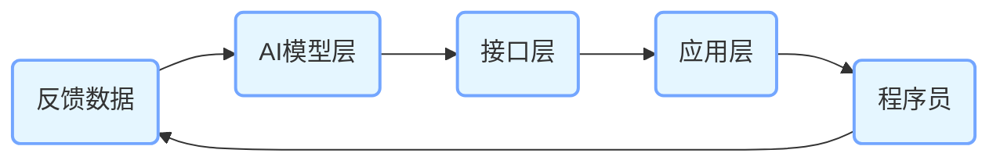

# 程序员与AI的协作：创新与挑战

> 关键词：程序员、AI、协作、创新、挑战、代码生成、智能辅助

> 摘要：本文深入探讨了程序员与AI协作这一前沿话题。随着AI技术的迅猛发展，其在编程领域的应用日益广泛，与程序员的协作模式也不断创新。文章首先介绍了相关背景，包括目的范围、预期读者等内容；接着阐述了核心概念与联系，明晰了程序员和AI在协作中的角色和关系；通过具体的Python代码讲解了核心算法原理及操作步骤，并给出了相应的数学模型和公式；结合项目实战，详细说明了开发环境搭建、源代码实现与解读；分析了实际应用场景；推荐了学习资源、开发工具框架以及相关论文著作；最后总结了未来发展趋势与挑战，还提供了常见问题解答和扩展阅读参考资料，旨在全面剖析程序员与AI协作过程中的创新点与面临的挑战，为相关从业者提供有价值的参考。

## 1. 背景介绍 
### 1.1 目的和范围
在当今数字化时代，人工智能（AI）技术正以前所未有的速度发展和渗透到各个领域，编程领域也不例外。本文章的目的在于全面深入地探讨程序员与AI之间的协作关系，分析这种协作带来的创新机遇以及可能面临的挑战。范围涵盖了从基本概念和原理的阐述，到具体算法、数学模型的讲解，再到项目实战案例的分析，以及对未来发展趋势的展望等多个方面，力求为读者呈现一个系统、全面的关于程序员与AI协作的知识体系。

### 1.2 预期读者
本文预期读者主要包括广大程序员群体，无论是新手程序员希望了解如何借助AI提升自身编程能力，还是有经验的程序员寻求与AI更高效的协作模式；同时也面向对人工智能在编程领域应用感兴趣的研究人员、学者，他们可以从本文中获取相关的理论和实践依据；此外，对科技发展趋势关注的管理人员、行业从业者等也能从本文中了解到程序员与AI协作的现状和未来走向，为决策和战略规划提供参考。

### 1.3 文档结构概述
本文将按照以下结构展开：首先介绍背景信息，让读者对文章的目的、范围、预期读者和文档结构有一个初步的了解；接着阐述核心概念与联系，明确程序员与AI协作的基本概念和相互关系；然后详细讲解核心算法原理和具体操作步骤，并给出相应的数学模型和公式；通过项目实战案例，展示代码实现和详细解读；分析实际应用场景，探讨这种协作在不同领域的应用方式；推荐相关的学习资源、开发工具框架和论文著作；最后总结未来发展趋势与挑战，提供常见问题解答和扩展阅读参考资料，帮助读者全面、深入地理解程序员与AI的协作。

### 1.4 术语表
#### 1.4.1 核心术语定义
- **程序员**：指从事程序开发、维护的专业人员，他们具备扎实的计算机知识和编程技能，能够使用各种编程语言编写代码来实现特定的功能和任务。
- **人工智能（AI）**：是一门研究如何使计算机系统能够模拟人类智能的学科和技术领域，包括机器学习、深度学习、自然语言处理等多个分支，旨在让计算机具备感知、理解、学习、推理和决策等能力。
- **代码生成**：指利用AI技术自动生成计算机代码的过程，通过输入特定的需求描述或问题定义，AI系统可以生成相应的代码片段或完整的程序。
- **智能辅助**：指AI为程序员提供的辅助功能，如代码自动补全、错误检测与修复、性能优化建议等，帮助程序员提高编程效率和代码质量。

#### 1.4.2 相关概念解释
- **机器学习**：是AI的一个重要分支，它通过让计算机从大量的数据中学习模式和规律，从而实现对未知数据的预测和分类等任务。在编程领域，机器学习算法可以用于分析代码模式、预测代码缺陷等。
- **深度学习**：是一种基于人工神经网络的机器学习方法，它通过构建多层的神经网络模型，自动学习数据的深层特征和表示。在图像识别、自然语言处理等领域取得了显著的成果，也在编程辅助方面有广泛的应用。
- **自然语言处理（NLP）**：是AI的一个领域，主要研究如何让计算机理解和处理人类语言。在程序员与AI的协作中，NLP技术可以实现将自然语言描述的需求转化为代码，或者对代码进行自然语言解释等功能。

#### 1.4.3 缩略词列表
- **AI**：Artificial Intelligence（人工智能）
- **ML**：Machine Learning（机器学习）
- **DL**：Deep Learning（深度学习）
- **NLP**：Natural Language Processing（自然语言处理）

## 2. 核心概念与联系 

### 核心概念原理
程序员与AI的协作是基于双方的优势互补。程序员拥有丰富的专业知识、领域经验和创造性思维，能够理解复杂的业务需求，设计出合理的软件架构和算法。而AI则具有强大的数据处理能力、模式识别能力和快速学习能力。在协作过程中，AI可以通过对大量代码数据的学习，掌握代码的语法规则、编程模式和常见的算法实现，从而为程序员提供智能辅助。例如，当程序员编写代码时，AI可以根据上下文自动补全代码，减少重复劳动；可以对代码进行静态分析，检测潜在的错误和漏洞；还可以根据需求描述生成初始的代码框架，为程序员提供一个起点。

### 架构的文本示意图
程序员与AI的协作架构可以分为以下几个层次：
1. **数据层**：包含大量的代码数据、编程文档、需求描述等，这些数据是AI学习和训练的基础。
2. **AI模型层**：基于数据层的数据，训练各种AI模型，如语言模型、代码生成模型、代码分析模型等。
3. **接口层**：提供与程序员交互的接口，如集成开发环境（IDE）插件、命令行工具等，让程序员可以方便地使用AI的功能。
4. **应用层**：程序员在开发过程中，通过接口层调用AI的功能，实现代码生成、智能辅助等操作。

### Mermaid流程图


## 3. 核心算法原理 & 具体操作步骤 

### 核心算法原理
在程序员与AI的协作中，常用的核心算法包括语言模型和代码生成算法。以基于Transformer架构的语言模型为例，其原理是通过多头自注意力机制来捕捉输入序列中不同位置之间的依赖关系。Transformer模型由编码器和解码器组成，编码器将输入的序列转换为一系列的特征表示，解码器根据这些特征表示生成输出序列。

### Python源代码详细阐述
以下是一个简单的基于Transformer的代码生成示例，使用Hugging Face的`transformers`库：
```python
from transformers import AutoTokenizer, AutoModelForCausalLM

# 加载预训练的代码生成模型和分词器
tokenizer = AutoTokenizer.from_pretrained("gpt2")
model = AutoModelForCausalLM.from_pretrained("gpt2")

# 定义输入的需求描述
input_text = "编写一个Python函数，用于计算两个数的和"

# 对输入进行分词
input_ids = tokenizer.encode(input_text, return_tensors="pt")

# 生成代码
output = model.generate(input_ids, max_length=100, num_return_sequences=1)

# 解码生成的代码
generated_code = tokenizer.decode(output[0], skip_special_tokens=True)

print(generated_code)
```
### 具体操作步骤
1. **安装依赖库**：使用`pip install transformers`安装Hugging Face的`transformers`库。
2. **加载模型和分词器**：选择合适的预训练模型和对应的分词器，这里使用`gpt2`。
3. **准备输入**：将需求描述转换为模型可以接受的输入格式，即使用分词器进行分词。
4. **生成代码**：调用模型的`generate`方法，设置生成的最大长度和返回的序列数量。
5. **解码输出**：使用分词器将模型生成的输出序列解码为文本格式。

## 4. 数学模型和公式 & 详细讲解 & 举例说明 

### 数学模型
Transformer模型的核心是多头自注意力机制，其数学模型可以表示为：
$$
\text{Attention}(Q, K, V) = \text{softmax}(\frac{QK^T}{\sqrt{d_k}})V
$$
其中，$Q$ 是查询矩阵，$K$ 是键矩阵，$V$ 是值矩阵，$d_k$ 是键的维度。

### 详细讲解
- **查询（Query）**：表示当前位置需要关注的信息。
- **键（Key）**：用于与查询进行匹配，计算相似度。
- **值（Value）**：根据相似度加权求和，得到最终的输出。

### 举例说明
假设我们有一个输入序列 $x = [x_1, x_2, x_3]$，经过线性变换得到查询矩阵 $Q$、键矩阵 $K$ 和值矩阵 $V$。计算注意力分数时，首先计算 $QK^T$，得到一个相似度矩阵，然后除以 $\sqrt{d_k}$ 进行缩放，再通过softmax函数将相似度分数转换为概率分布，最后与值矩阵 $V$ 相乘，得到每个位置的输出。

例如，对于一个简单的二维向量 $x_1 = [1, 2]$，$x_2 = [3, 4]$，$x_3 = [5, 6]$，假设 $d_k = 2$，经过线性变换得到 $Q_1 = [0.1, 0.2]$，$K_1 = [0.3, 0.4]$，$V_1 = [0.5, 0.6]$，$Q_2 = [0.7, 0.8]$，$K_2 = [0.9, 1.0]$，$V_2 = [1.1, 1.2]$，$Q_3 = [1.3, 1.4]$，$K_3 = [1.5, 1.6]$，$V_3 = [1.7, 1.8]$。

计算 $Q_1K_1^T = 0.1\times0.3 + 0.2\times0.4 = 0.11$，$Q_1K_2^T = 0.1\times0.9 + 0.2\times1.0 = 0.29$，$Q_1K_3^T = 0.1\times1.5 + 0.2\times1.6 = 0.47$。

然后除以 $\sqrt{d_k} = \sqrt{2}$，得到缩放后的分数，再通过softmax函数得到概率分布，最后与值矩阵相乘得到最终的输出。

## 5. 项目实战：代码实际案例和详细解释说明 

### 5.1  开发环境搭建
1. **安装Python**：确保系统中安装了Python 3.x版本，可以从Python官方网站下载并安装。
2. **安装开发工具**：推荐使用PyCharm作为集成开发环境（IDE），可以从JetBrains官方网站下载并安装。
3. **安装依赖库**：在项目目录下，使用`pip install -r requirements.txt`安装项目所需的依赖库，例如`transformers`、`torch`等。

### 5.2  源代码详细实现和代码解读
以下是一个更完整的代码生成项目示例，用于根据用户输入的需求生成Python代码：
```python
import torch
from transformers import AutoTokenizer, AutoModelForCausalLM

# 加载预训练的代码生成模型和分词器
tokenizer = AutoTokenizer.from_pretrained("gpt2")
model = AutoModelForCausalLM.from_pretrained("gpt2")

def generate_code(input_text):
    # 对输入进行分词
    input_ids = tokenizer.encode(input_text, return_tensors="pt")
    
    # 生成代码
    output = model.generate(input_ids, max_length=200, num_return_sequences=1)
    
    # 解码生成的代码
    generated_code = tokenizer.decode(output[0], skip_special_tokens=True)
    
    return generated_code

if __name__ == "__main__":
    while True:
        input_text = input("请输入需求描述（输入q退出）：")
        if input_text.lower() == "q":
            break
        code = generate_code(input_text)
        print("生成的代码：")
        print(code)
```
### 代码解读
1. **导入必要的库**：导入`torch`、`AutoTokenizer`和`AutoModelForCausalLM`库，用于模型的加载和代码生成。
2. **加载模型和分词器**：使用`AutoTokenizer.from_pretrained`和`AutoModelForCausalLM.from_pretrained`方法加载预训练的模型和分词器。
3. **定义生成代码的函数**：`generate_code`函数接受用户输入的需求描述，对其进行分词，调用模型的`generate`方法生成代码，最后解码输出。
4. **主程序**：使用一个无限循环，不断接收用户输入的需求描述，调用`generate_code`函数生成代码并输出，直到用户输入`q`退出。

### 5.3  代码解读与分析
- **优点**：该代码实现了一个简单的代码生成功能，用户可以通过输入需求描述快速获得相应的代码。使用预训练的模型可以减少训练时间和资源消耗。
- **缺点**：生成的代码质量可能不高，需要程序员进行进一步的修改和优化。模型对复杂需求的理解能力有限，可能无法生成准确的代码。

## 6. 实际应用场景 
### 快速原型开发
在项目的初期阶段，程序员可以利用AI的代码生成功能快速搭建一个原型系统。通过输入简单的需求描述，AI可以生成初始的代码框架，程序员可以在此基础上进行进一步的开发和完善，大大缩短了开发周期。

### 代码补全和纠错
在编写代码的过程中，AI可以实时提供代码补全建议，根据上下文预测程序员可能要输入的代码片段，提高编程效率。同时，AI还可以对代码进行静态分析，检测潜在的错误和漏洞，帮助程序员及时发现和修复问题。

### 代码优化
AI可以分析代码的性能瓶颈，提供优化建议。例如，通过对代码的复杂度分析，建议使用更高效的算法或数据结构；通过对内存使用情况的分析，提出减少内存占用的优化方案。

### 知识获取和学习
对于新手程序员来说，AI可以作为一个智能学习助手，解释代码的功能和原理，提供相关的学习资源和参考资料。同时，AI还可以通过分析大量的代码数据，总结编程模式和最佳实践，帮助新手程序员快速提升编程能力。

## 7. 工具和资源推荐
### 7.1 学习资源推荐
#### 7.1.1 书籍推荐
- 《Python深度学习》：详细介绍了Python在深度学习领域的应用，包括神经网络的原理、训练和优化等内容。
- 《人工智能：一种现代的方法》：全面介绍了人工智能的基本概念、算法和应用，是人工智能领域的经典教材。
- 《代码大全》：讲解了软件开发的最佳实践和编程技巧，对于提高程序员的编程水平有很大帮助。

#### 7.1.2 在线课程
- Coursera上的“深度学习专项课程”：由深度学习领域的知名学者授课，内容涵盖深度学习的各个方面。
- edX上的“人工智能基础”：介绍了人工智能的基本概念、算法和应用，适合初学者学习。
- 哔哩哔哩（B 站）上的“Python编程入门”：一系列免费的Python编程教程，适合新手快速入门。

#### 7.1.3 技术博客和网站
- Medium：有很多关于人工智能、编程等领域的技术文章，作者来自世界各地，内容丰富多样。
- 博客园：国内知名的技术博客平台，有很多程序员分享的经验和技术文章。
- 开源中国：提供了大量的开源项目和技术资讯，对于了解行业动态和学习开源技术有很大帮助。

### 7.2 开发工具框架推荐
#### 7.2.1 IDE和编辑器
- PyCharm：功能强大的Python集成开发环境，提供了代码编辑、调试、版本控制等一系列功能。
- Visual Studio Code：轻量级的代码编辑器，支持多种编程语言，有丰富的插件扩展功能。
- Sublime Text：简洁高效的文本编辑器，适合快速编写代码。

#### 7.2.2 调试和性能分析工具
- PySnooper：可以自动记录Python代码的执行过程，方便调试和查找问题。
- cProfile：Python内置的性能分析工具，可以分析代码的执行时间和函数调用关系。
- Memory Profiler：用于分析Python代码的内存使用情况，帮助优化内存占用。

#### 7.2.3 相关框架和库
- TensorFlow：开源的深度学习框架，提供了丰富的工具和接口，用于构建和训练深度学习模型。
- PyTorch：另一个流行的深度学习框架，具有动态图和简洁的API，适合快速开发和研究。
- Scikit-learn：用于机器学习的Python库，提供了各种机器学习算法和工具，方便进行数据处理和模型训练。

### 7.3 相关论文著作推荐
#### 7.3.1 经典论文
- “Attention Is All You Need”：介绍了Transformer架构，是自然语言处理领域的经典论文。
- “ImageNet Classification with Deep Convolutional Neural Networks”：提出了AlexNet模型，开创了深度学习在图像识别领域的先河。
- “Generative Adversarial Networks”：介绍了生成对抗网络（GAN）的原理和应用，是生成式模型领域的重要论文。

#### 7.3.2 最新研究成果
- 在ArXiv.org上可以搜索到最新的人工智能和编程领域的研究论文，了解最新的技术进展和研究方向。
- 各大顶级学术会议，如NeurIPS、ICML、CVPR等，会发表很多高质量的研究成果。

#### 7.3.3 应用案例分析
- 《AI在软件开发中的应用案例集》：收集了大量AI在软件开发中的实际应用案例，包括代码生成、智能辅助、缺陷检测等方面的案例分析。
- 一些知名科技公司的技术博客，如Google AI Blog、Microsoft Research Blog等，会分享他们在AI应用方面的实践经验和案例。

## 8. 总结：未来发展趋势与挑战
### 未来发展趋势
- **更智能的代码生成**：随着AI技术的不断发展，代码生成的质量和准确性将不断提高。AI将能够更好地理解复杂的需求描述，生成更加高效、健壮的代码。
- **深度融合的协作模式**：程序员与AI将实现更深度的融合，AI将不仅仅是提供辅助功能，还将参与到软件设计、架构规划等更高层次的任务中。
- **跨领域的应用拓展**：程序员与AI的协作将不仅仅局限于软件开发领域，还将拓展到其他领域，如医疗、金融、教育等，为各行业的数字化转型提供支持。

### 挑战
- **数据隐私和安全问题**：AI的训练需要大量的数据，这些数据可能包含敏感信息，如何确保数据的隐私和安全是一个重要的挑战。
- **AI的可解释性**：目前很多AI模型是黑盒模型，其决策过程难以解释。在编程领域，程序员需要理解AI生成的代码和给出的建议，因此提高AI的可解释性是一个亟待解决的问题。
- **就业结构调整**：AI的广泛应用可能会导致编程领域的就业结构发生调整，一些重复性、规律性的编程工作可能会被AI取代，程序员需要不断提升自己的技能，适应新的就业需求。

## 9. 附录：常见问题与解答
### 1. AI生成的代码可以直接使用吗？
一般来说，AI生成的代码不能直接使用。虽然AI可以生成基本的代码框架，但代码的质量和准确性可能不高，需要程序员进行进一步的修改和优化，确保代码符合业务需求和编程规范。

### 2. 程序员会被AI取代吗？
短期内，程序员不会被AI取代。虽然AI可以完成一些重复性、规律性的编程工作，但程序员的创造性思维、领域知识和问题解决能力是AI无法替代的。程序员与AI的协作将是未来的发展趋势，程序员可以借助AI的力量提高工作效率和代码质量。

### 3. 如何选择适合的AI模型和工具？
选择适合的AI模型和工具需要考虑多个因素，如项目需求、数据规模、性能要求等。可以参考相关的技术文档、学术论文和行业经验，进行实验和比较，选择最适合的模型和工具。

### 4. 如何提高AI生成代码的质量？
可以通过以下方法提高AI生成代码的质量：提供更详细、准确的需求描述；使用经过优化和微调的AI模型；对生成的代码进行人工审查和修改；不断积累和优化训练数据。

## 10. 扩展阅读 & 参考资料
### 扩展阅读
- 《人类简史：从动物到上帝》：探讨了人类的发展历程和未来走向，对于理解AI对人类社会的影响有一定的启发。
- 《未来简史：从智人到神人》：进一步思考了未来人类与科技的关系，包括AI、生物技术等对人类社会的变革。
- 《AI 3.0》：介绍了人工智能的发展阶段和面临的挑战，以及未来的发展方向。

### 参考资料
- Hugging Face官方文档：https://huggingface.co/docs/transformers/index
- TensorFlow官方文档：https://www.tensorflow.org/api_docs
- PyTorch官方文档：https://pytorch.org/docs/stable/index.html
- Scikit-learn官方文档：https://scikit-learn.org/stable/documentation.html