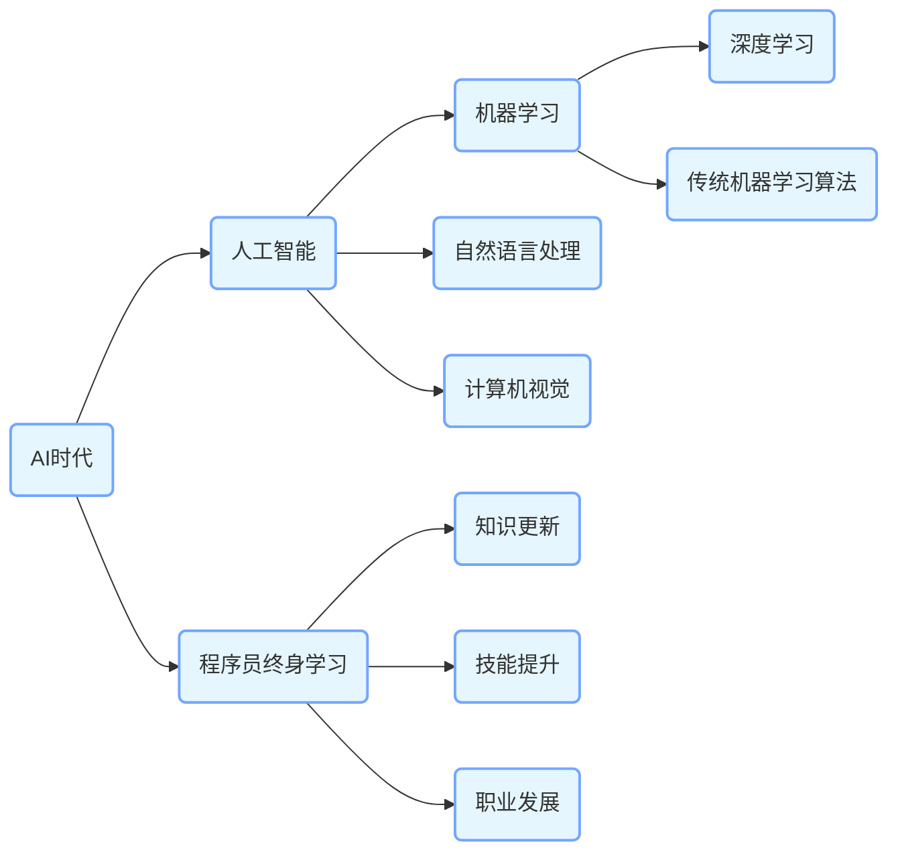

# 程序员在AI时代的终身学习策略

> 关键词：程序员、AI时代、终身学习、学习策略、技术发展

> 摘要：随着AI时代的到来，技术的快速迭代对程序员的能力提出了更高要求，终身学习成为程序员保持竞争力的关键。本文围绕程序员在AI时代的终身学习策略展开，深入探讨背景知识、核心概念、算法原理、数学模型等内容，并结合项目实战、实际应用场景，推荐相关工具和资源，最后总结未来发展趋势与挑战，解答常见问题，为程序员的终身学习提供全面且系统的指导。

## 1. 背景介绍 
### 1.1 目的和范围
在AI时代，人工智能技术如机器学习、深度学习等正以前所未有的速度发展和应用。这不仅改变了软件行业的格局，也对程序员的技能和知识储备提出了新的挑战。本文的目的在于为程序员提供一套全面且具有可操作性的终身学习策略，帮助他们在快速变化的技术环境中保持竞争力，不断提升自己的技术水平和创新能力。范围涵盖了从基础概念到实际应用，从理论知识到实践操作的多个方面，旨在为程序员的终身学习提供全方位的支持。

### 1.2 预期读者
本文主要面向广大程序员群体，包括初入职场的新手程序员、有一定经验的中级程序员以及资深的高级程序员。无论你是专注于传统软件开发领域，还是已经涉足人工智能相关领域，都能从本文中获得有价值的学习策略和指导。同时，对于那些对AI技术感兴趣，希望转行成为程序员的人员，本文也能提供一个系统的学习路径和思路。

### 1.3 文档结构概述
本文将按照以下结构展开：首先介绍背景知识，包括目的、预期读者和文档结构概述等内容；接着阐述核心概念与联系，帮助读者建立起对相关技术的基本认识；然后详细讲解核心算法原理和具体操作步骤，通过Python代码进行演示；再介绍数学模型和公式，并举例说明其应用；随后通过项目实战展示代码的实际应用和详细解释；之后探讨实际应用场景，让读者了解技术的实际用途；接着推荐相关的工具和资源，包括学习资源、开发工具框架和相关论文著作等；最后总结未来发展趋势与挑战，解答常见问题，并提供扩展阅读和参考资料。

### 1.4 术语表
#### 1.4.1 核心术语定义
- **AI（Artificial Intelligence）**：即人工智能，是指让计算机系统能够模拟人类智能的技术和方法，包括机器学习、深度学习、自然语言处理等多个领域。
- **机器学习（Machine Learning）**：是AI的一个重要分支，它让计算机通过数据和算法来学习模式和规律，从而实现预测和决策等功能。
- **深度学习（Deep Learning）**：是机器学习的一个子领域，基于神经网络模型，通过多层神经元的学习来处理复杂的数据和任务，如图像识别、语音识别等。
- **终身学习（Lifelong Learning）**：指个人在整个职业生涯中不断学习和更新知识技能，以适应不断变化的环境和需求。

#### 1.4.2 相关概念解释
- **技术栈**：指程序员在开发过程中所使用的一系列技术和工具的组合，包括编程语言、框架、数据库等。
- **数据科学**：涉及数据的采集、存储、分析和可视化等多个环节，旨在从数据中提取有价值的信息和知识。
- **算法复杂度**：用于衡量算法执行效率的指标，包括时间复杂度和空间复杂度。

#### 1.4.3 缩略词列表
- **ML**：Machine Learning（机器学习）
- **DL**：Deep Learning（深度学习）
- **NLP**：Natural Language Processing（自然语言处理）

## 2. 核心概念与联系 

### 2.1 AI时代的技术变革
在AI时代，人工智能技术正逐渐渗透到各个行业和领域，改变着人们的生活和工作方式。从智能语音助手到自动驾驶汽车，从医疗诊断到金融风险评估，AI技术的应用无处不在。这种技术变革对程序员的能力提出了新的要求，他们不仅需要掌握传统的软件开发技能，还需要了解和掌握人工智能相关的知识和技术。

### 2.2 程序员终身学习的必要性
随着技术的快速发展，程序员原有的知识和技能可能会很快过时。如果不进行终身学习，他们将难以适应新的技术和业务需求，从而面临被市场淘汰的风险。此外，终身学习还可以帮助程序员提升自己的竞争力，获得更好的职业发展机会。

### 2.3 核心概念的联系
人工智能、机器学习、深度学习等核心概念之间存在着密切的联系。机器学习是人工智能的一个重要实现方式，而深度学习则是机器学习的一个强大工具。程序员在学习这些技术时，需要理解它们之间的关系，建立起完整的知识体系。

### 2.4 文本示意图
```plaintext
AI时代
|
|-- 人工智能
|   |-- 机器学习
|   |   |-- 深度学习
|   |   |-- 传统机器学习算法
|   |
|   |-- 自然语言处理
|   |-- 计算机视觉
|
|-- 程序员终身学习
|   |-- 知识更新
|   |-- 技能提升
|   |-- 职业发展
```

### 2.5 Mermaid流程图


## 3. 核心算法原理 & 具体操作步骤 

### 3.1 机器学习算法原理
#### 3.1.1 线性回归算法
线性回归是一种基本的机器学习算法，用于建立自变量和因变量之间的线性关系。其基本原理是通过最小化预测值与真实值之间的误差来确定模型的参数。

```python
import numpy as np
from sklearn.linear_model import LinearRegression

# 生成一些示例数据
X = np.array([1, 2, 3, 4, 5]).reshape(-1, 1)
y = np.array([2, 4, 6, 8, 10])

# 创建线性回归模型
model = LinearRegression()

# 训练模型
model.fit(X, y)

# 进行预测
new_X = np.array([6]).reshape(-1, 1)
prediction = model.predict(new_X)

print("预测值:", prediction)
```

#### 3.1.2 具体操作步骤
1. **数据准备**：收集和整理相关的数据，并将其分为训练集和测试集。
2. **模型选择**：根据问题的类型和数据的特点选择合适的机器学习模型。
3. **模型训练**：使用训练集对模型进行训练，调整模型的参数。
4. **模型评估**：使用测试集对训练好的模型进行评估，检查模型的性能。
5. **模型优化**：根据评估结果对模型进行优化，提高模型的性能。

### 3.2 深度学习算法原理
#### 3.2.1 神经网络模型
神经网络是深度学习的核心模型，由输入层、隐藏层和输出层组成。每个神经元接收输入信号，经过激活函数处理后输出信号。

```python
import tensorflow as tf
from tensorflow.keras import layers

# 构建一个简单的神经网络模型
model = tf.keras.Sequential([
    layers.Dense(64, activation='relu', input_shape=(784,)),
    layers.Dense(10, activation='softmax')
])

# 编译模型
model.compile(optimizer='adam',
              loss='sparse_categorical_crossentropy',
              metrics=['accuracy'])

# 加载数据
mnist = tf.keras.datasets.mnist
(x_train, y_train), (x_test, y_test) = mnist.load_data()

# 数据预处理
x_train, x_test = x_train / 255.0, x_test / 255.0
x_train = x_train.reshape(-1, 784)
x_test = x_test.reshape(-1, 784)

# 训练模型
model.fit(x_train, y_train, epochs=5)

# 评估模型
test_loss, test_acc = model.evaluate(x_test, y_test)
print("测试准确率:", test_acc)
```

#### 3.2.2 具体操作步骤
1. **数据预处理**：对数据进行清洗、归一化等处理，使其适合神经网络的输入。
2. **模型构建**：根据问题的类型和数据的特点构建合适的神经网络模型。
3. **模型编译**：选择合适的优化器、损失函数和评估指标。
4. **模型训练**：使用训练集对模型进行训练，调整模型的参数。
5. **模型评估**：使用测试集对训练好的模型进行评估，检查模型的性能。
6. **模型优化**：根据评估结果对模型进行优化，提高模型的性能。

## 4. 数学模型和公式 & 详细讲解 & 举例说明 

### 4.1 线性回归的数学模型和公式
线性回归的数学模型可以表示为：
$$y = \theta_0 + \theta_1x_1 + \theta_2x_2 + \cdots + \theta_nx_n + \epsilon$$
其中，$y$ 是因变量，$x_1, x_2, \cdots, x_n$ 是自变量，$\theta_0, \theta_1, \cdots, \theta_n$ 是模型的参数，$\epsilon$ 是误差项。

为了确定模型的参数，我们通常使用最小二乘法，即最小化预测值与真实值之间的平方误差：
$$J(\theta) = \frac{1}{2m}\sum_{i=1}^{m}(h_{\theta}(x^{(i)}) - y^{(i)})^2$$
其中，$m$ 是样本数量，$h_{\theta}(x^{(i)})$ 是第 $i$ 个样本的预测值，$y^{(i)}$ 是第 $i$ 个样本的真实值。

### 4.2 举例说明
假设我们有以下数据集：
| $x$ | $y$ |
| --- | --- |
| 1 | 2 |
| 2 | 4 |
| 3 | 6 |
| 4 | 8 |
| 5 | 10 |

我们可以使用线性回归模型来拟合这些数据。首先，我们需要计算模型的参数 $\theta_0$ 和 $\theta_1$。根据最小二乘法的公式，我们可以得到：
$$\theta_1 = \frac{\sum_{i=1}^{m}(x^{(i)} - \bar{x})(y^{(i)} - \bar{y})}{\sum_{i=1}^{m}(x^{(i)} - \bar{x})^2}$$
$$\theta_0 = \bar{y} - \theta_1\bar{x}$$
其中，$\bar{x}$ 和 $\bar{y}$ 分别是 $x$ 和 $y$ 的均值。

计算可得：
$$\bar{x} = \frac{1 + 2 + 3 + 4 + 5}{5} = 3$$
$$\bar{y} = \frac{2 + 4 + 6 + 8 + 10}{5} = 6$$
$$\sum_{i=1}^{5}(x^{(i)} - \bar{x})(y^{(i)} - \bar{y}) = (1 - 3)(2 - 6) + (2 - 3)(4 - 6) + (3 - 3)(6 - 6) + (4 - 3)(8 - 6) + (5 - 3)(10 - 6) = 20$$
$$\sum_{i=1}^{5}(x^{(i)} - \bar{x})^2 = (1 - 3)^2 + (2 - 3)^2 + (3 - 3)^2 + (4 - 3)^2 + (5 - 3)^2 = 10$$

因此，$\theta_1 = \frac{20}{10} = 2$，$\theta_0 = 6 - 2 \times 3 = 0$。

所以，线性回归模型为 $y = 2x$。

### 4.3 神经网络的数学模型和公式
神经网络的数学模型可以表示为：
$$z^{[l]} = W^{[l]}a^{[l-1]} + b^{[l]}$$
$$a^{[l]} = g(z^{[l]})$$
其中，$z^{[l]}$ 是第 $l$ 层的线性组合，$W^{[l]}$ 是第 $l$ 层的权重矩阵，$a^{[l-1]}$ 是第 $l-1$ 层的输出，$b^{[l]}$ 是第 $l$ 层的偏置向量，$a^{[l]}$ 是第 $l$ 层的输出，$g$ 是激活函数。

常用的激活函数包括 sigmoid 函数、ReLU 函数等。

### 4.4 举例说明
假设我们有一个简单的神经网络，包含一个输入层、一个隐藏层和一个输出层。输入层有 2 个神经元，隐藏层有 3 个神经元，输出层有 1 个神经元。

输入层的输入为 $x = [x_1, x_2]$，隐藏层的权重矩阵为 $W^{[1]} = \begin{bmatrix} 0.1 & 0.2 \\ 0.3 & 0.4 \\ 0.5 & 0.6 \end{bmatrix}$，偏置向量为 $b^{[1]} = [0.1, 0.2, 0.3]$，激活函数为 ReLU 函数。

则隐藏层的线性组合为：
$$z^{[1]} = W^{[1]}x + b^{[1]} = \begin{bmatrix} 0.1 & 0.2 \\ 0.3 & 0.4 \\ 0.5 & 0.6 \end{bmatrix} \begin{bmatrix} x_1 \\ x_2 \end{bmatrix} + \begin{bmatrix} 0.1 \\ 0.2 \\ 0.3 \end{bmatrix}$$

隐藏层的输出为：
$$a^{[1]} = g(z^{[1]}) = \begin{bmatrix} \max(0, z_1^{[1]}) \\ \max(0, z_2^{[1]}) \\ \max(0, z_3^{[1]}) \end{bmatrix}$$

输出层的权重矩阵为 $W^{[2]} = [0.7, 0.8, 0.9]$，偏置向量为 $b^{[2]} = [0.4]$，激活函数为 sigmoid 函数。

则输出层的线性组合为：
$$z^{[2]} = W^{[2]}a^{[1]} + b^{[2]} = [0.7, 0.8, 0.9] \begin{bmatrix} a_1^{[1]} \\ a_2^{[1]} \\ a_3^{[1]} \end{bmatrix} + 0.4$$

输出层的输出为：
$$a^{[2]} = g(z^{[2]}) = \frac{1}{1 + e^{-z^{[2]}}}$$

## 5. 项目实战：代码实际案例和详细解释说明 

### 5.1  开发环境搭建
#### 5.1.1 安装Python
首先，我们需要安装Python编程语言。可以从Python官方网站（https://www.python.org/downloads/） 下载适合自己操作系统的Python安装包，并按照安装向导进行安装。

#### 5.1.2 安装相关库
我们需要安装一些常用的Python库，如NumPy、Pandas、Scikit-learn、TensorFlow等。可以使用以下命令进行安装：
```sh
pip install numpy pandas scikit-learn tensorflow
```

### 5.2  源代码详细实现和代码解读
#### 5.2.1 项目概述
我们将实现一个简单的手写数字识别项目，使用MNIST数据集。MNIST数据集包含60000个训练样本和10000个测试样本，每个样本是一个28x28的手写数字图像。

#### 5.2.2 代码实现
```python
import tensorflow as tf
from tensorflow.keras import layers
import matplotlib.pyplot as plt

# 加载数据
mnist = tf.keras.datasets.mnist
(x_train, y_train), (x_test, y_test) = mnist.load_data()

# 数据预处理
x_train, x_test = x_train / 255.0, x_test / 255.0

# 构建模型
model = tf.keras.Sequential([
    layers.Flatten(input_shape=(28, 28)),
    layers.Dense(128, activation='relu'),
    layers.Dropout(0.2),
    layers.Dense(10, activation='softmax')
])

# 编译模型
model.compile(optimizer='adam',
              loss='sparse_categorical_crossentropy',
              metrics=['accuracy'])

# 训练模型
history = model.fit(x_train, y_train, epochs=5, validation_data=(x_test, y_test))

# 评估模型
test_loss, test_acc = model.evaluate(x_test, y_test)
print("测试准确率:", test_acc)

# 绘制训练过程曲线
plt.plot(history.history['accuracy'])
plt.plot(history.history['val_accuracy'])
plt.title('Model accuracy')
plt.ylabel('Accuracy')
plt.xlabel('Epoch')
plt.legend(['Train', 'Test'], loc='upper left')
plt.show()

plt.plot(history.history['loss'])
plt.plot(history.history['val_loss'])
plt.title('Model loss')
plt.ylabel('Loss')
plt.xlabel('Epoch')
plt.legend(['Train', 'Test'], loc='upper left')
plt.show()
```

#### 5.2.3 代码解读
1. **数据加载**：使用 `tf.keras.datasets.mnist.load_data()` 加载MNIST数据集。
2. **数据预处理**：将图像数据的像素值归一化到0-1之间。
3. **模型构建**：使用 `tf.keras.Sequential()` 构建一个简单的神经网络模型，包含一个Flatten层、一个全连接层、一个Dropout层和一个输出层。
4. **模型编译**：选择 `adam` 优化器、`sparse_categorical_crossentropy` 损失函数和 `accuracy` 评估指标。
5. **模型训练**：使用 `model.fit()` 方法对模型进行训练，并记录训练过程中的准确率和损失值。
6. **模型评估**：使用 `model.evaluate()` 方法对训练好的模型进行评估，得到测试准确率和测试损失值。
7. **绘制训练过程曲线**：使用 `matplotlib` 库绘制训练过程中的准确率和损失值曲线，帮助我们观察模型的训练情况。

### 5.3  代码解读与分析
#### 5.3.1 模型结构分析
- **Flatten层**：将28x28的图像数据展平为一维向量，方便后续的全连接层处理。
- **Dense层**：全连接层，使用ReLU激活函数，增加模型的非线性能力。
- **Dropout层**：防止过拟合，随机丢弃一部分神经元。
- **输出层**：使用softmax激活函数，输出10个类别的概率分布。

#### 5.3.2 训练过程分析
通过观察训练过程中的准确率和损失值曲线，我们可以判断模型是否过拟合或欠拟合。如果训练准确率远高于测试准确率，可能存在过拟合问题；如果训练准确率和测试准确率都很低，可能存在欠拟合问题。

## 6. 实际应用场景 
### 6.1 软件开发领域
在软件开发中，AI技术可以用于自动化测试、代码生成、缺陷预测等方面。程序员可以学习AI相关技术，提高软件开发的效率和质量。

### 6.2 数据分析领域
AI技术在数据分析中有着广泛的应用，如数据挖掘、预测分析、异常检测等。程序员可以结合AI技术和数据分析技能，为企业提供更有价值的数据分析服务。

### 6.3 智能硬件领域
随着物联网和智能硬件的发展，AI技术可以用于实现智能设备的语音识别、图像识别、智能控制等功能。程序员可以参与智能硬件的开发，为用户提供更智能的产品体验。

### 6.4 金融领域
在金融领域，AI技术可以用于风险评估、信用评分、投资决策等方面。程序员可以开发相关的金融AI应用，帮助金融机构提高决策的准确性和效率。

### 6.5 医疗领域
AI技术在医疗领域的应用也越来越广泛，如疾病诊断、医学影像分析、药物研发等。程序员可以与医疗专业人员合作，开发医疗AI系统，为医疗行业带来创新和变革。

## 7. 工具和资源推荐
### 7.1 学习资源推荐
#### 7.1.1 书籍推荐
- 《Python机器学习》：全面介绍了机器学习的基本概念、算法和应用，使用Python语言进行实现。
- 《深度学习》：深度学习领域的经典著作，深入讲解了深度学习的理论和实践。
- 《人工智能：一种现代的方法》：系统介绍了人工智能的各个领域和方法，是人工智能领域的权威教材。

#### 7.1.2 在线课程
- Coursera上的“机器学习”课程：由斯坦福大学的Andrew Ng教授授课，是机器学习领域的经典课程。
- edX上的“深度学习”课程：由麻省理工学院等机构提供，深入讲解了深度学习的原理和应用。
- 网易云课堂上的“Python数据分析与挖掘实战”课程：结合实际案例，介绍了Python在数据分析和挖掘中的应用。

#### 7.1.3 技术博客和网站
- Medium：一个技术博客平台，有很多关于AI和编程的优质文章。
- Towards Data Science：专注于数据科学和机器学习领域的博客，提供了很多实用的技术文章和案例。
- Kaggle：一个数据科学竞赛平台，有很多开源的数据集和优秀的代码示例。

### 7.2 开发工具框架推荐
#### 7.2.1 IDE和编辑器
- PyCharm：一款专业的Python集成开发环境，提供了丰富的功能和插件，方便程序员进行开发和调试。
- Visual Studio Code：一款轻量级的代码编辑器，支持多种编程语言和插件，具有良好的扩展性。
- Jupyter Notebook：一个交互式的开发环境，适合进行数据分析和机器学习实验。

#### 7.2.2 调试和性能分析工具
- TensorBoard：TensorFlow提供的可视化工具，用于监控模型的训练过程和性能分析。
- Py-Spy：一个Python性能分析工具，可以帮助程序员找出代码中的性能瓶颈。
- PDB：Python自带的调试工具，用于调试Python代码。

#### 7.2.3 相关框架和库
- TensorFlow：一个开源的机器学习框架，广泛应用于深度学习领域。
- PyTorch：另一个流行的深度学习框架，具有动态图的优势，易于使用和调试。
- Scikit-learn：一个简单易用的机器学习库，提供了多种机器学习算法和工具。

### 7.3 相关论文著作推荐
#### 7.3.1 经典论文
- “ImageNet Classification with Deep Convolutional Neural Networks”：AlexNet的论文，开启了深度学习在计算机视觉领域的应用。
- “Attention Is All You Need”：Transformer模型的论文，提出了注意力机制，在自然语言处理领域取得了巨大成功。
- “Gradient-Based Learning Applied to Document Recognition”：LeNet的论文，是卷积神经网络的经典之作。

#### 7.3.2 最新研究成果
可以关注顶级学术会议和期刊，如NeurIPS、ICML、CVPR、ACL等，了解AI领域的最新研究成果。

#### 7.3.3 应用案例分析
可以参考一些实际应用案例，如Google的AlphaGo、OpenAI的GPT系列等，了解AI技术在实际场景中的应用和实现方法。

## 8. 总结：未来发展趋势与挑战
### 8.1 未来发展趋势
- **AI与其他技术的融合**：AI将与物联网、大数据、区块链等技术深度融合，创造出更多的创新应用。
- **自动化和智能化**：软件开发和数据分析等领域将越来越自动化和智能化，程序员需要掌握相关的AI技术来应对这种变化。
- **跨学科发展**：AI技术的发展需要跨学科的知识和技能，程序员需要与其他领域的专业人员合作，共同推动技术的进步。

### 8.2 挑战
- **技术更新换代快**：AI技术发展迅速，程序员需要不断学习和更新知识，以跟上技术的发展步伐。
- **数据隐私和安全问题**：AI技术的应用涉及大量的数据，数据隐私和安全问题成为一个重要的挑战。
- **人才竞争激烈**：随着AI技术的普及，对AI人才的需求也越来越大，程序员面临着激烈的人才竞争。

### 8.3 应对策略
- **持续学习**：保持终身学习的态度，不断学习新的知识和技能，提升自己的竞争力。
- **关注行业动态**：及时了解AI技术的发展趋势和应用场景，为自己的职业发展做好规划。
- **加强团队合作**：与其他领域的专业人员合作，共同解决复杂的问题，提升自己的跨学科能力。

## 9. 附录：常见问题与解答
### 9.1 如何选择适合自己的学习资源？
可以根据自己的学习目标和基础水平选择适合的学习资源。如果是初学者，可以选择一些入门级的书籍和在线课程；如果有一定的基础，可以选择一些深入的技术文章和研究论文。

### 9.2 学习AI技术需要具备哪些基础知识？
学习AI技术需要具备一定的数学基础，如线性代数、概率论、统计学等，同时还需要掌握一门编程语言，如Python。

### 9.3 如何避免在学习过程中感到迷茫？
可以制定一个学习计划，明确学习目标和步骤，同时多实践，通过实际项目来巩固所学的知识。遇到问题时，可以参考相关的学习资源或向他人请教。

### 9.4 如何提高自己的编程能力？
可以多做练习题，参与开源项目，阅读优秀的代码，不断总结经验，提高自己的编程水平。

## 10. 扩展阅读 & 参考资料
### 10.1 扩展阅读
- 《AI未来进行式》：介绍了AI技术的未来发展趋势和应用场景。
- 《生命3.0》：探讨了AI技术对人类社会和未来的影响。

### 10.2 参考资料
- 相关技术文档和官方网站，如TensorFlow官方文档、PyTorch官方文档等。
- 学术数据库，如IEEE Xplore、ACM Digital Library等。