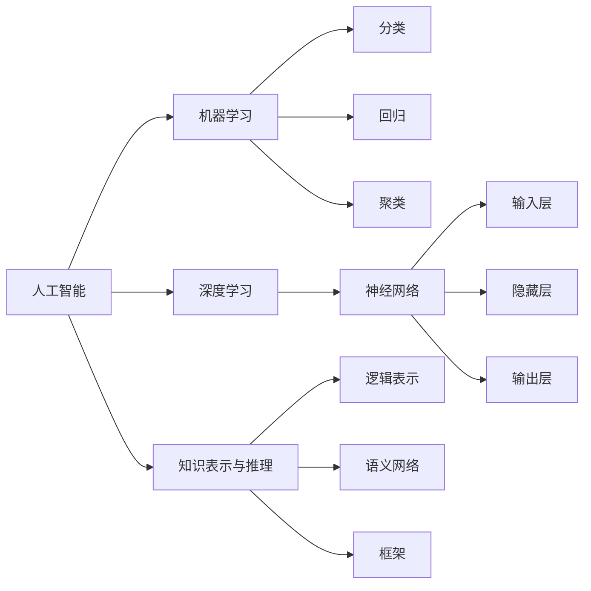

# 程序员在AI时代的角色转变与发展

> 关键词：程序员、AI时代、角色转变、发展趋势、人工智能、编程技能、职业规划

> 摘要：随着人工智能（AI）技术的飞速发展，整个科技行业正经历着前所未有的变革。在这个时代，程序员作为推动技术进步的核心力量，其角色也在发生着深刻的转变。本文旨在深入探讨程序员在AI时代面临的角色转变以及未来的发展方向。通过对AI技术原理、相关算法的分析，结合实际项目案例，阐述程序员如何适应新的技术环境，提升自身技能，以更好地在AI时代发挥作用。同时，为程序员提供学习资源、开发工具等方面的推荐，帮助他们更好地规划职业发展，应对未来的挑战。

## 1. 背景介绍 
### 1.1 目的和范围
在当今的数字化时代，人工智能已经成为各个领域的关键驱动力。从智能语音助手到自动驾驶汽车，从医疗诊断到金融风险预测，AI技术的应用无处不在。程序员作为软件和系统的开发者，其角色和职责在AI时代发生了巨大的变化。本文的目的在于全面分析程序员在AI时代的角色转变过程，探讨他们所面临的机遇和挑战，并为程序员提供实用的发展建议和策略。

本文的范围涵盖了AI技术的基本原理、程序员所需的新技能和知识体系、实际应用场景以及未来的发展趋势等方面。通过对这些内容的深入研究，帮助程序员更好地理解AI时代的需求，实现自身的职业发展。

### 1.2 预期读者
本文主要面向广大程序员群体，包括初级、中级和高级程序员。同时，也适合对AI技术和程序员职业发展感兴趣的技术爱好者、行业研究者以及相关教育工作者阅读。通过本文，读者可以了解AI时代程序员角色的变化，获取有关AI技术和职业发展的有用信息。

### 1.3 文档结构概述
本文将按照以下结构进行阐述：
1. **背景介绍**：介绍本文的目的、范围、预期读者以及文档结构概述，并对相关术语进行解释。
2. **核心概念与联系**：详细解释人工智能的核心概念和原理，包括机器学习、深度学习等，并通过文本示意图和Mermaid流程图展示其架构和联系。
3. **核心算法原理 & 具体操作步骤**：深入讲解AI中常用的核心算法，如神经网络算法，并使用Python源代码详细阐述其实现步骤。
4. **数学模型和公式 & 详细讲解 & 举例说明**：介绍AI中涉及的数学模型和公式，如梯度下降法的数学原理，并通过具体例子进行说明。
5. **项目实战：代码实际案例和详细解释说明**：通过一个实际的AI项目案例，介绍开发环境的搭建、源代码的实现和解读，以及对代码的分析。
6. **实际应用场景**：探讨AI技术在不同领域的实际应用场景，以及程序员在这些场景中的角色和作用。
7. **工具和资源推荐**：推荐学习AI技术的相关资源，包括书籍、在线课程、技术博客和网站等，以及开发工具和相关框架和库。
8. **总结：未来发展趋势与挑战**：总结程序员在AI时代的角色转变和发展趋势，分析他们面临的挑战，并提出应对策略。
9. **附录：常见问题与解答**：解答读者在阅读过程中可能遇到的常见问题。
10. **扩展阅读 & 参考资料**：提供相关的扩展阅读材料和参考资料，方便读者进一步深入研究。

### 1.4 术语表
#### 1.4.1 核心术语定义
- **人工智能（Artificial Intelligence，AI）**：指计算机系统能够执行通常需要人类智能才能完成的任务，如学习、推理、解决问题等。
- **机器学习（Machine Learning，ML）**：是人工智能的一个分支，致力于让计算机通过数据学习模式和规律，从而做出预测和决策。
- **深度学习（Deep Learning，DL）**：是机器学习的一个子领域，基于人工神经网络，通过多层神经网络模型自动学习数据的特征表示。
- **神经网络（Neural Network）**：是一种模仿人类神经系统的计算模型，由多个神经元组成，用于处理和分析复杂的数据。
- **算法（Algorithm）**：是解决特定问题的一系列明确的计算步骤。

#### 1.4.2 相关概念解释
- **数据挖掘（Data Mining）**：从大量数据中发现有价值信息和模式的过程，通常使用机器学习和统计分析方法。
- **自然语言处理（Natural Language Processing，NLP）**：研究如何让计算机理解、处理和生成人类语言的技术。
- **计算机视觉（Computer Vision）**：让计算机从图像或视频中提取信息和理解场景的技术。

#### 1.4.3 缩略词列表
- **AI**：Artificial Intelligence（人工智能）
- **ML**：Machine Learning（机器学习）
- **DL**：Deep Learning（深度学习）
- **NLP**：Natural Language Processing（自然语言处理）
- **CV**：Computer Vision（计算机视觉）

## 2. 核心概念与联系 
### 2.1 人工智能的核心概念
人工智能是一门综合性的学科，旨在让计算机模拟人类的智能行为。其核心概念包括机器学习、深度学习、知识表示与推理等。

#### 2.1.1 机器学习
机器学习是人工智能的重要组成部分，它通过让计算机从数据中学习模式和规律，从而实现预测和决策。机器学习的主要任务包括分类、回归、聚类等。分类任务是将数据分为不同的类别，回归任务是预测连续的数值，聚类任务是将相似的数据点归为一类。

#### 2.1.2 深度学习
深度学习是机器学习的一个子领域，基于人工神经网络。深度学习通过多层神经网络模型自动学习数据的特征表示，从而在图像识别、语音识别等领域取得了巨大的成功。深度学习的核心是神经网络的训练，通过不断调整网络的参数，使得网络能够更好地拟合数据。

#### 2.1.3 知识表示与推理
知识表示与推理是人工智能的另一个重要方面，它涉及如何将人类的知识表示为计算机能够理解的形式，并进行推理和决策。常见的知识表示方法包括逻辑表示、语义网络、框架等。

### 2.2 核心概念的联系
机器学习、深度学习和知识表示与推理之间存在着密切的联系。机器学习是实现人工智能的一种重要手段，深度学习是机器学习的一种强大工具，而知识表示与推理则为机器学习和深度学习提供了知识支持。

例如，在自然语言处理中，机器学习和深度学习可以用于文本分类、情感分析等任务，而知识表示与推理可以用于语义理解和知识问答。在计算机视觉中，深度学习可以用于图像识别和目标检测，而机器学习可以用于图像分类和聚类。

### 2.3 文本示意图和Mermaid流程图
#### 2.3.1 文本示意图
人工智能的核心概念可以用以下文本示意图表示：

人工智能
|-- 机器学习
|   |-- 分类
|   |-- 回归
|   |-- 聚类
|-- 深度学习
|   |-- 神经网络
|   |   |-- 输入层
|   |   |-- 隐藏层
|   |   |-- 输出层
|-- 知识表示与推理
|   |-- 逻辑表示
|   |-- 语义网络
|   |-- 框架

#### 2.3.2 Mermaid流程图


## 3. 核心算法原理 & 具体操作步骤 
### 3.1 神经网络算法原理
神经网络是深度学习的核心算法，它模仿人类神经系统的结构和功能。一个简单的神经网络由输入层、隐藏层和输出层组成。输入层接收输入数据，隐藏层对输入数据进行处理和变换，输出层输出最终的结果。

神经网络的训练过程是通过不断调整网络的参数（权重和偏置），使得网络的输出与真实标签之间的误差最小化。常用的训练算法是反向传播算法，它通过计算误差的梯度，然后根据梯度下降法更新网络的参数。

### 3.2 Python源代码实现
以下是一个使用Python和PyTorch库实现简单神经网络的示例代码：

```python
import torch
import torch.nn as nn
import torch.optim as optim

# 定义神经网络模型
class SimpleNet(nn.Module):
    def __init__(self):
        super(SimpleNet, self).__init__()
        self.fc1 = nn.Linear(10, 20)  # 输入层到隐藏层
        self.relu = nn.ReLU()
        self.fc2 = nn.Linear(20, 1)  # 隐藏层到输出层

    def forward(self, x):
        out = self.fc1(x)
        out = self.relu(out)
        out = self.fc2(out)
        return out

# 初始化模型、损失函数和优化器
model = SimpleNet()
criterion = nn.MSELoss()  # 均方误差损失函数
optimizer = optim.SGD(model.parameters(), lr=0.01)  # 随机梯度下降优化器

# 生成一些随机数据
inputs = torch.randn(100, 10)
labels = torch.randn(100, 1)

# 训练模型
for epoch in range(100):
    # 前向传播
    outputs = model(inputs)
    loss = criterion(outputs, labels)

    # 反向传播和优化
    optimizer.zero_grad()
    loss.backward()
    optimizer.step()

    if (epoch + 1) % 10 == 0:
        print(f'Epoch [{epoch + 1}/100], Loss: {loss.item():.4f}')
```

### 3.3 具体操作步骤
1. **定义神经网络模型**：继承`nn.Module`类，定义网络的结构和前向传播过程。
2. **初始化模型、损失函数和优化器**：选择合适的损失函数和优化器。
3. **生成训练数据**：准备输入数据和对应的标签。
4. **训练模型**：进行多次迭代，每次迭代包括前向传播、计算损失、反向传播和参数更新。
5. **评估模型**：在训练完成后，使用测试数据评估模型的性能。

## 4. 数学模型和公式 & 详细讲解 & 举例说明 
### 4.1 梯度下降法的数学原理
梯度下降法是一种常用的优化算法，用于寻找函数的最小值。假设我们有一个目标函数 $J(\theta)$，其中 $\theta$ 是模型的参数。梯度下降法的基本思想是沿着目标函数的负梯度方向更新参数，直到找到函数的最小值。

梯度下降法的更新公式为：

$$\theta_{t+1} = \theta_{t} - \alpha \nabla J(\theta_{t})$$

其中，$\theta_{t}$ 是第 $t$ 次迭代的参数值，$\alpha$ 是学习率，$\nabla J(\theta_{t})$ 是目标函数在 $\theta_{t}$ 处的梯度。

### 4.2 详细讲解
梯度下降法的核心是计算目标函数的梯度。梯度是一个向量，它的方向指向函数增长最快的方向，负梯度方向则指向函数下降最快的方向。因此，沿着负梯度方向更新参数可以使目标函数的值不断减小。

学习率 $\alpha$ 控制了每次更新的步长。如果学习率过大，可能会导致参数更新过大，跳过函数的最小值；如果学习率过小，可能会导致收敛速度过慢。

### 4.3 举例说明
假设我们有一个简单的目标函数 $J(\theta) = \theta^2$，我们的目标是找到 $\theta$ 的值，使得 $J(\theta)$ 最小。

首先，计算目标函数的梯度：

$$\nabla J(\theta) = 2\theta$$

然后，使用梯度下降法更新参数：

$$\theta_{t+1} = \theta_{t} - \alpha \cdot 2\theta_{t}$$

假设初始值 $\theta_0 = 1$，学习率 $\alpha = 0.1$，进行多次迭代：

- 第一次迭代：$\theta_1 = 1 - 0.1 \cdot 2 \cdot 1 = 0.8$
- 第二次迭代：$\theta_2 = 0.8 - 0.1 \cdot 2 \cdot 0.8 = 0.64$
- 第三次迭代：$\theta_3 = 0.64 - 0.1 \cdot 2 \cdot 0.64 = 0.512$

随着迭代次数的增加，$\theta$ 的值逐渐趋近于 0，即目标函数的最小值点。

## 5. 项目实战：代码实际案例和详细解释说明 
### 5.1  开发环境搭建
在进行AI项目开发之前，需要搭建相应的开发环境。以下是搭建基于Python和PyTorch的开发环境的步骤：

1. **安装Python**：从Python官方网站（https://www.python.org/downloads/）下载并安装Python 3.x版本。
2. **安装PyTorch**：根据自己的操作系统和CUDA版本，从PyTorch官方网站（https://pytorch.org/get-started/locally/）选择合适的安装命令进行安装。
3. **安装其他依赖库**：使用`pip`命令安装其他常用的依赖库，如`numpy`、`matplotlib`等。

### 5.2  源代码详细实现和代码解读
以下是一个使用PyTorch实现手写数字识别的项目示例：

```python
import torch
import torch.nn as nn
import torch.optim as optim
from torchvision import datasets, transforms
import matplotlib.pyplot as plt

# 定义数据预处理
transform = transforms.Compose([
    transforms.ToTensor(),
    transforms.Normalize((0.1307,), (0.3081,))
])

# 加载训练集和测试集
train_dataset = datasets.MNIST(root='./data', train=True,
                               download=True, transform=transform)
test_dataset = datasets.MNIST(root='./data', train=False,
                              download=True, transform=transform)

train_loader = torch.utils.data.DataLoader(train_dataset, batch_size=64, shuffle=True)
test_loader = torch.utils.data.DataLoader(test_dataset, batch_size=1000, shuffle=False)

# 定义神经网络模型
class Net(nn.Module):
    def __init__(self):
        super(Net, self).__init__()
        self.fc1 = nn.Linear(28 * 28, 128)
        self.relu = nn.ReLU()
        self.fc2 = nn.Linear(128, 10)

    def forward(self, x):
        x = x.view(-1, 28 * 28)
        x = self.fc1(x)
        x = self.relu(x)
        x = self.fc2(x)
        return x

# 初始化模型、损失函数和优化器
model = Net()
criterion = nn.CrossEntropyLoss()
optimizer = optim.SGD(model.parameters(), lr=0.01, momentum=0.5)

# 训练模型
def train(model, train_loader, criterion, optimizer, epoch):
    model.train()
    for batch_idx, (data, target) in enumerate(train_loader):
        optimizer.zero_grad()
        output = model(data)
        loss = criterion(output, target)
        loss.backward()
        optimizer.step()
        if batch_idx % 100 == 0:
            print(f'Train Epoch: {epoch} [{batch_idx * len(data)}/{len(train_loader.dataset)} '
                  f'({100. * batch_idx / len(train_loader):.0f}%)]\tLoss: {loss.item():.6f}')

# 测试模型
def test(model, test_loader, criterion):
    model.eval()
    test_loss = 0
    correct = 0
    with torch.no_grad():
        for data, target in test_loader:
            output = model(data)
            test_loss += criterion(output, target).item()
            pred = output.argmax(dim=1, keepdim=True)
            correct += pred.eq(target.view_as(pred)).sum().item()

    test_loss /= len(test_loader.dataset)
    print(f'\nTest set: Average loss: {test_loss:.4f}, Accuracy: {correct}/{len(test_loader.dataset)} '
          f'({100. * correct / len(test_loader.dataset):.0f}%)\n')

# 训练和测试模型
for epoch in range(1, 11):
    train(model, train_loader, criterion, optimizer, epoch)
    test(model, test_loader, criterion)

# 可视化测试结果
def visualize_results(model, test_loader):
    model.eval()
    dataiter = iter(test_loader)
    images, labels = dataiter.next()
    with torch.no_grad():
        outputs = model(images)
        _, predicted = torch.max(outputs, 1)

    fig = plt.figure(figsize=(10, 5))
    for i in range(10):
        ax = fig.add_subplot(2, 5, i + 1)
        ax.imshow(images[i].squeeze().numpy(), cmap='gray')
        ax.set_title(f'Pred: {predicted[i].item()}, True: {labels[i].item()}')
        ax.axis('off')
    plt.show()

visualize_results(model, test_loader)
```

### 5.3  代码解读与分析
1. **数据预处理**：使用`transforms.Compose`定义数据预处理步骤，包括将图像转换为张量和归一化处理。
2. **数据加载**：使用`torchvision.datasets.MNIST`加载手写数字数据集，并使用`torch.utils.data.DataLoader`创建数据加载器。
3. **定义神经网络模型**：定义一个简单的全连接神经网络，包括输入层、隐藏层和输出层。
4. **初始化模型、损失函数和优化器**：选择交叉熵损失函数和随机梯度下降优化器。
5. **训练模型**：定义训练函数，在每个训练周期中进行前向传播、计算损失、反向传播和参数更新。
6. **测试模型**：定义测试函数，在测试集上评估模型的性能。
7. **可视化测试结果**：选择一些测试样本，可视化模型的预测结果。

## 6. 实际应用场景 
### 6.1 医疗领域
在医疗领域，AI技术可以帮助医生进行疾病诊断、药物研发和医疗影像分析等。程序员可以开发基于AI的医疗诊断系统，通过分析患者的病历、影像数据等，辅助医生做出更准确的诊断。例如，使用深度学习算法对X光、CT等影像进行分析，检测疾病的早期迹象。

### 6.2 金融领域
在金融领域，AI技术可以用于风险评估、投资决策和欺诈检测等。程序员可以开发智能风险评估系统，通过分析客户的信用数据、交易记录等，预测客户的违约风险。同时，AI技术还可以用于量化投资，通过分析市场数据和新闻资讯，制定投资策略。

### 6.3 交通领域
在交通领域，AI技术可以推动自动驾驶汽车的发展。程序员可以参与自动驾驶系统的开发，包括传感器数据处理、环境感知、决策规划等模块的实现。此外，AI技术还可以用于交通流量预测和智能交通管理，提高交通效率。

### 6.4 教育领域
在教育领域，AI技术可以实现个性化学习和智能辅导。程序员可以开发智能教育平台，根据学生的学习情况和能力，提供个性化的学习内容和学习建议。同时，AI技术还可以用于自动批改作业和智能考试系统的开发。

## 7. 工具和资源推荐
### 7.1 学习资源推荐
#### 7.1.1 书籍推荐
- 《深度学习》（Deep Learning）：由Ian Goodfellow、Yoshua Bengio和Aaron Courville合著，是深度学习领域的经典教材。
- 《Python机器学习》（Python Machine Learning）：由Sebastian Raschka和Vahid Mirjalili合著，介绍了使用Python进行机器学习的方法和技术。
- 《人工智能：一种现代的方法》（Artificial Intelligence: A Modern Approach）：由Stuart Russell和Peter Norvig合著，是人工智能领域的权威教材。

#### 7.1.2 在线课程
- Coursera上的“机器学习”课程：由Andrew Ng教授授课，是机器学习领域的经典课程。
- edX上的“深度学习”课程：由MIT的教授授课，深入介绍了深度学习的原理和应用。
- 中国大学MOOC上的“人工智能基础”课程：由国内知名高校的教授授课，适合初学者入门。

#### 7.1.3 技术博客和网站
- Medium：一个技术博客平台，有很多关于AI技术的优秀文章。
- Towards Data Science：专注于数据科学和机器学习的技术博客。
- AI开源社区：提供AI技术的开源代码、教程和案例。

### 7.2 开发工具框架推荐
#### 7.2.1 IDE和编辑器
- PyCharm：一款专业的Python集成开发环境，提供代码编辑、调试、版本控制等功能。
- Jupyter Notebook：一个交互式的开发环境，适合进行数据探索和模型实验。
- Visual Studio Code：一款轻量级的代码编辑器，支持多种编程语言和插件。

#### 7.2.2 调试和性能分析工具
- TensorBoard：TensorFlow的可视化工具，用于可视化训练过程和模型性能。
- PyTorch Profiler：PyTorch的性能分析工具，用于分析模型的运行时间和内存使用情况。
- cProfile：Python的性能分析模块，用于分析Python代码的性能瓶颈。

#### 7.2.3 相关框架和库
- TensorFlow：一个开源的机器学习框架，由Google开发，广泛应用于深度学习领域。
- PyTorch：一个开源的深度学习框架，由Facebook开发，具有动态图和易于使用的特点。
- Scikit-learn：一个开源的机器学习库，提供了丰富的机器学习算法和工具。

### 7.3 相关论文著作推荐
#### 7.3.1 经典论文
- “ImageNet Classification with Deep Convolutional Neural Networks”：由Alex Krizhevsky等人发表，介绍了AlexNet模型，开启了深度学习在计算机视觉领域的革命。
- “Long Short-Term Memory”：由Sepp Hochreiter和Jürgen Schmidhuber发表，介绍了LSTM模型，解决了循环神经网络中的梯度消失问题。
- “Attention Is All You Need”：由Vaswani等人发表，介绍了Transformer模型，在自然语言处理领域取得了巨大的成功。

#### 7.3.2 最新研究成果
- 关注顶级学术会议，如NeurIPS（神经信息处理系统大会）、ICML（国际机器学习会议）、CVPR（计算机视觉与模式识别会议）等，了解AI领域的最新研究成果。
- 阅读相关的学术期刊，如Journal of Artificial Intelligence Research（JAIR）、Artificial Intelligence等。

#### 7.3.3 应用案例分析
- 研究AI技术在不同领域的应用案例，如医疗、金融、交通等，了解AI技术的实际应用效果和挑战。
- 参考开源项目和企业的技术博客，学习他们在AI项目中的实践经验和解决方案。

## 8. 总结：未来发展趋势与挑战
### 8.1 未来发展趋势
- **跨学科融合**：AI技术将与其他学科，如生物学、物理学、医学等进行深度融合，创造出更多的创新应用。
- **自动化和智能化**：越来越多的任务将实现自动化和智能化，程序员需要开发更加智能的系统和工具。
- **边缘计算和物联网**：随着边缘计算和物联网的发展，AI技术将在终端设备上得到更广泛的应用，程序员需要关注这些领域的技术发展。
- **伦理和法律问题**：AI技术的发展也带来了一系列的伦理和法律问题，程序员需要参与到相关的讨论和规范制定中。

### 8.2 挑战
- **技术更新换代快**：AI技术发展迅速，程序员需要不断学习和更新自己的知识和技能，以适应技术的变化。
- **数据隐私和安全**：AI技术的应用需要大量的数据，如何保护数据的隐私和安全是一个重要的挑战。
- **人才竞争激烈**：AI领域的人才需求旺盛，程序员面临着激烈的人才竞争，需要不断提升自己的竞争力。
- **伦理和道德问题**：AI技术的应用可能会带来一些伦理和道德问题，如算法歧视、失业等，程序员需要思考如何解决这些问题。

### 8.3 应对策略
- **持续学习**：保持学习的热情和积极性，不断学习新的技术和知识，参加培训和学术会议。
- **注重实践**：通过实际项目的实践，积累经验，提高自己的解决问题的能力。
- **加强团队合作**：AI项目通常需要跨学科的团队合作，程序员需要学会与不同领域的人员合作。
- **关注伦理和法律问题**：了解AI技术的伦理和法律问题，积极参与相关的讨论和规范制定。

## 9. 附录：常见问题与解答
### 9.1 如何选择适合自己的AI学习路线？
选择适合自己的AI学习路线需要考虑自己的基础和兴趣。如果是初学者，可以先学习Python编程和机器学习的基础知识，然后再深入学习深度学习等高级内容。如果有一定的编程基础，可以直接学习深度学习的相关知识。同时，可以参考一些优秀的学习资源和课程，制定自己的学习计划。

### 9.2 AI技术对程序员的编程技能有哪些要求？
AI技术对程序员的编程技能有一定的要求，主要包括Python编程、数据处理和分析、机器学习和深度学习框架的使用等。此外，程序员还需要具备良好的算法设计和优化能力，以及对数学知识的掌握。

### 9.3 如何解决AI项目中的数据隐私和安全问题？
解决AI项目中的数据隐私和安全问题需要从多个方面入手。首先，要对数据进行加密处理，确保数据在传输和存储过程中的安全性。其次，要建立严格的访问控制机制，限制数据的访问权限。此外，还需要遵守相关的法律法规，如《网络安全法》《数据保护法》等。

### 9.4 AI技术会导致程序员失业吗？
AI技术的发展不会导致程序员失业，而是会改变程序员的角色和职责。虽然一些重复性的编程任务可能会被自动化，但AI技术也会创造出更多的新的编程需求，如开发AI系统、优化算法等。因此，程序员需要不断提升自己的技能，适应技术的变化。

## 10. 扩展阅读 & 参考资料
### 10.1 扩展阅读
- 《奇点临近》（The Singularity Is Near）：由Ray Kurzweil著，探讨了人工智能和技术发展对人类社会的影响。
- 《生命3.0》（Life 3.0: Being Human in the Age of Artificial Intelligence）：由Max Tegmark著，思考了人工智能时代人类的未来。
- 《算法之美：指导工作与生活的算法》（Algorithms to Live By: The Computer Science of Human Decisions）：由Brian Christian和Tom Griffiths著，介绍了算法在生活中的应用。

### 10.2 参考资料
- 相关的学术论文和研究报告
- 开源项目的文档和代码
- 技术博客和论坛的讨论帖子
- 专业书籍和教材