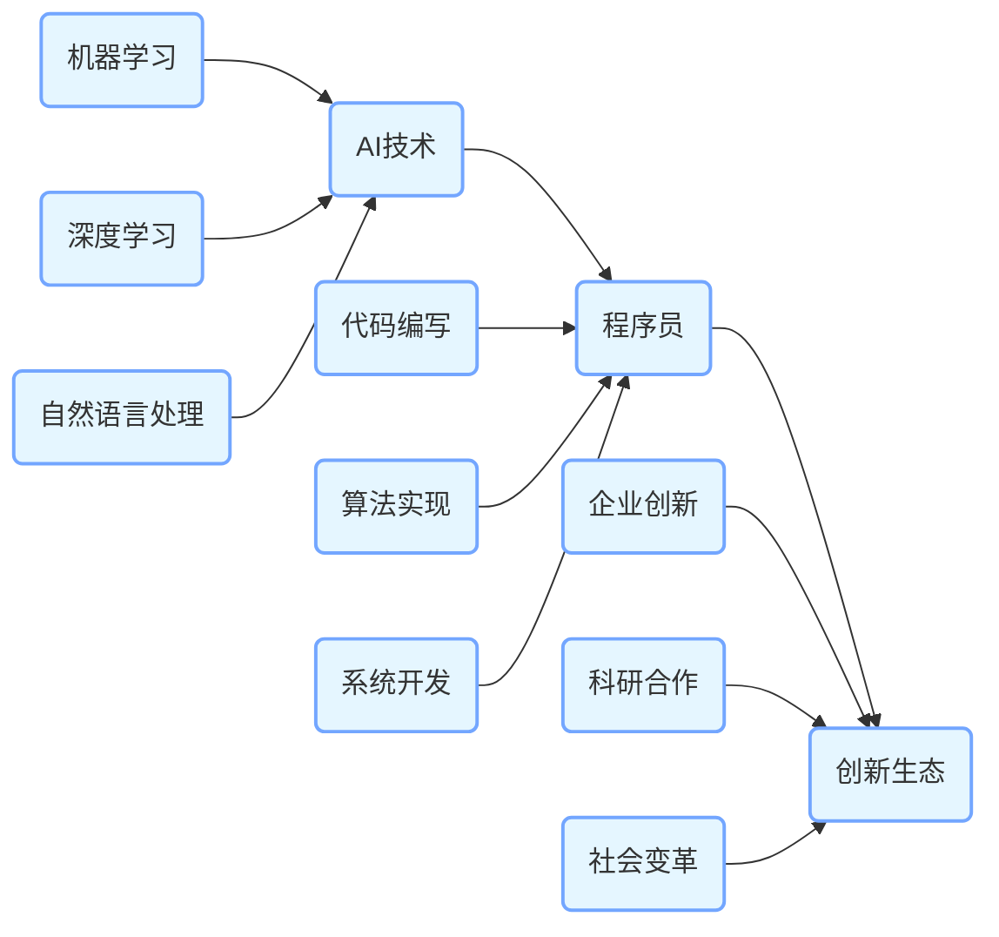

# 程序员在AI驱动的创新生态中的角色

> 关键词：程序员、AI驱动、创新生态、角色定位、技术融合、价值创造、未来发展

> 摘要：随着人工智能（AI）技术的飞速发展，其在各个领域的应用不断拓展，形成了独特的AI驱动的创新生态。在这个生态中，程序员扮演着至关重要的角色。本文深入探讨程序员在AI驱动的创新生态中的角色，从背景介绍出发，阐述相关核心概念与联系，分析核心算法原理及操作步骤，介绍数学模型和公式，通过项目实战展示程序员的具体工作，探讨实际应用场景，推荐相关工具和资源，总结未来发展趋势与挑战，解答常见问题并提供扩展阅读和参考资料，旨在全面呈现程序员在这一创新生态中的重要作用和价值。

## 1. 背景介绍 
### 1.1 目的和范围
本文章的目的在于全面且深入地剖析程序员在AI驱动的创新生态中所扮演的角色。随着AI技术的快速崛起和广泛应用，创新生态的格局正在发生深刻变化，程序员作为技术实现的关键力量，其角色和作用也日益重要。文章的范围涵盖了与AI和程序员相关的多个方面，包括技术原理、实际应用、未来趋势等，旨在为读者提供一个全面的视角来理解程序员在这一生态中的地位和价值。

### 1.2 预期读者
本文预期读者包括广大程序员群体，他们可以通过本文进一步明确自己在AI时代的角色定位和发展方向；也包括对AI技术和创新生态感兴趣的技术爱好者、研究者，帮助他们了解程序员在其中的关键作用；同时，对于企业管理者和决策者，本文可以为他们在人才战略和技术创新方面提供参考。

### 1.3 文档结构概述
本文将按照以下结构展开：首先介绍背景信息，包括目的、预期读者和文档结构概述等；接着阐述核心概念与联系，通过文本示意图和Mermaid流程图展示相关概念的关系；然后详细讲解核心算法原理及具体操作步骤，并结合Python源代码进行说明；之后介绍数学模型和公式，并举例说明；再通过项目实战展示代码实际案例和详细解释；探讨实际应用场景；推荐相关工具和资源；总结未来发展趋势与挑战；解答常见问题；最后提供扩展阅读和参考资料。

### 1.4 术语表
#### 1.4.1 核心术语定义
- **程序员**：是指从事程序开发、维护的专业人员，他们通过编写代码来实现各种软件和系统的功能。
- **AI（人工智能）**：是一门研究如何使计算机能够模拟人类智能的学科和技术领域，包括机器学习、深度学习、自然语言处理等多个方面。
- **创新生态**：是一个由多种创新主体（如企业、科研机构、开发者等）、创新资源（如技术、资金、人才等）和创新环境（如政策、文化等）相互作用、相互影响而形成的复杂系统，旨在促进创新和价值创造。

#### 1.4.2 相关概念解释
- **机器学习**：是AI的一个重要分支，它通过让计算机从数据中学习模式和规律，从而实现对未知数据的预测和决策。
- **深度学习**：是机器学习的一种特殊形式，它基于神经网络模型，通过多层神经元的复杂连接和计算，自动提取数据中的特征和模式，在图像识别、语音识别等领域取得了显著的成果。
- **自然语言处理**：是AI的另一个重要领域，它研究如何让计算机理解和处理人类语言，包括文本分类、机器翻译、问答系统等应用。

#### 1.4.3 缩略词列表
- **AI**：Artificial Intelligence（人工智能）
- **ML**：Machine Learning（机器学习）
- **DL**：Deep Learning（深度学习）
- **NLP**：Natural Language Processing（自然语言处理）

## 2. 核心概念与联系 
### 2.1 核心概念原理
在AI驱动的创新生态中，涉及到多个核心概念，包括AI技术、程序员和创新生态。AI技术是推动创新的关键驱动力，它通过不断的算法创新和模型优化，为各个领域带来了新的机遇和挑战。程序员则是将AI技术转化为实际应用的关键角色，他们通过编写代码实现AI算法和模型，开发出各种AI应用程序。创新生态则为AI技术的发展和应用提供了一个良好的环境，它促进了不同创新主体之间的合作与交流，加速了技术的迭代和创新。

### 2.2 架构的文本示意图
```plaintext
           AI技术
           ┌───────────────────────────────┐
           │  机器学习  │  深度学习  │  自然语言处理  │
           └───────────────────────────────┘
                   │
                   │  实现与应用
                   │
           程序员
           ┌───────────────────────────────┐
           │  代码编写  │  算法实现  │  系统开发  │
           └───────────────────────────────┘
                   │
                   │  融入与推动
                   │
           创新生态
           ┌───────────────────────────────┐
           │  企业创新  │  科研合作  │  社会变革  │
           └───────────────────────────────┘
```

### 2.3 Mermaid流程图


## 3. 核心算法原理 & 具体操作步骤 
### 3.1 核心算法原理
在AI领域，有许多核心算法，如决策树、神经网络、支持向量机等。这里以简单的线性回归算法为例进行讲解。线性回归是一种用于预测连续数值的机器学习算法，它的基本原理是通过找到一条最佳的直线来拟合数据点，使得数据点到直线的距离之和最小。

### 3.2 具体操作步骤
1. **数据准备**：收集和整理需要分析的数据，将其分为特征变量和目标变量。
2. **模型训练**：使用训练数据来训练线性回归模型，通过最小化损失函数来确定模型的参数。
3. **模型评估**：使用测试数据来评估模型的性能，常用的评估指标包括均方误差（MSE）、决定系数（R²）等。
4. **预测**：使用训练好的模型对新的数据进行预测。

### 3.3 Python源代码详细阐述
```python
import numpy as np
from sklearn.model_selection import train_test_split
from sklearn.linear_model import LinearRegression
from sklearn.metrics import mean_squared_error, r2_score

# 1. 数据准备
# 生成一些示例数据
np.random.seed(0)
X = np.random.rand(100, 1)
y = 2 * X + 1 + 0.5 * np.random.randn(100, 1)

# 划分训练集和测试集
X_train, X_test, y_train, y_test = train_test_split(X, y, test_size=0.2, random_state=42)

# 2. 模型训练
# 创建线性回归模型
model = LinearRegression()
# 训练模型
model.fit(X_train, y_train)

# 3. 模型评估
# 预测测试集
y_pred = model.predict(X_test)
# 计算均方误差
mse = mean_squared_error(y_test, y_pred)
# 计算决定系数
r2 = r2_score(y_test, y_pred)

print(f"均方误差: {mse}")
print(f"决定系数: {r2}")

# 4. 预测
new_X = np.array([[0.8]])
prediction = model.predict(new_X)
print(f"预测值: {prediction[0][0]}")
```
在上述代码中，首先生成了一些示例数据，然后将其划分为训练集和测试集。接着创建了一个线性回归模型，并使用训练集进行训练。训练完成后，使用测试集对模型进行评估，计算均方误差和决定系数。最后，使用训练好的模型对新的数据进行预测。

## 4. 数学模型和公式 & 详细讲解 & 举例说明 
### 4.1 线性回归的数学模型
线性回归的数学模型可以表示为：
$$y = \beta_0 + \beta_1x_1 + \beta_2x_2 + \cdots + \beta_nx_n + \epsilon$$
其中，$y$ 是目标变量，$x_1, x_2, \cdots, x_n$ 是特征变量，$\beta_0, \beta_1, \beta_2, \cdots, \beta_n$ 是模型的参数，$\epsilon$ 是误差项。

### 4.2 最小二乘法原理
线性回归模型的参数通常通过最小二乘法来估计。最小二乘法的目标是找到一组参数 $\beta_0, \beta_1, \beta_2, \cdots, \beta_n$，使得误差项的平方和最小。误差项的平方和可以表示为：
$$S(\beta) = \sum_{i=1}^{m}(y_i - \hat{y}_i)^2 = \sum_{i=1}^{m}(y_i - (\beta_0 + \beta_1x_{i1} + \beta_2x_{i2} + \cdots + \beta_nx_{in}))^2$$
其中，$m$ 是样本数量，$y_i$ 是第 $i$ 个样本的真实值，$\hat{y}_i$ 是第 $i$ 个样本的预测值。

### 4.3 求解参数
为了找到使得 $S(\beta)$ 最小的参数 $\beta$，可以对 $S(\beta)$ 求偏导数，并令其等于0。对于简单线性回归（只有一个特征变量），可以得到参数的计算公式：
$$\beta_1 = \frac{\sum_{i=1}^{m}(x_i - \bar{x})(y_i - \bar{y})}{\sum_{i=1}^{m}(x_i - \bar{x})^2}$$
$$\beta_0 = \bar{y} - \beta_1\bar{x}$$
其中，$\bar{x}$ 和 $\bar{y}$ 分别是 $x$ 和 $y$ 的均值。

### 4.4 举例说明
假设有以下数据集：
| $x$ | $y$ |
| --- | --- |
| 1 | 3 |
| 2 | 5 |
| 3 | 7 |
| 4 | 9 |

首先计算 $x$ 和 $y$ 的均值：
$$\bar{x} = \frac{1 + 2 + 3 + 4}{4} = 2.5$$
$$\bar{y} = \frac{3 + 5 + 7 + 9}{4} = 6$$

然后计算 $\beta_1$：
$$\sum_{i=1}^{4}(x_i - \bar{x})(y_i - \bar{y}) = (1 - 2.5)(3 - 6) + (2 - 2.5)(5 - 6) + (3 - 2.5)(7 - 6) + (4 - 2.5)(9 - 6) = 10$$
$$\sum_{i=1}^{4}(x_i - \bar{x})^2 = (1 - 2.5)^2 + (2 - 2.5)^2 + (3 - 2.5)^2 + (4 - 2.5)^2 = 5$$
$$\beta_1 = \frac{10}{5} = 2$$

最后计算 $\beta_0$：
$$\beta_0 = 6 - 2 \times 2.5 = 1$$

所以，线性回归模型为 $y = 1 + 2x$。

## 5. 项目实战：代码实际案例和详细解释说明 
### 5.1  开发环境搭建
#### 5.1.1 安装Python
首先需要安装Python，可以从Python官方网站（https://www.python.org/downloads/）下载适合自己操作系统的Python版本，并按照安装向导进行安装。

#### 5.1.2 安装必要的库
使用以下命令安装必要的库：
```sh
pip install numpy pandas scikit-learn matplotlib
```
其中，`numpy` 用于数值计算，`pandas` 用于数据处理，`scikit-learn` 用于机器学习，`matplotlib` 用于数据可视化。

### 5.2  源代码详细实现和代码解读
以下是一个使用Python实现的简单的鸢尾花分类项目：
```python
import numpy as np
import pandas as pd
from sklearn.datasets import load_iris
from sklearn.model_selection import train_test_split
from sklearn.tree import DecisionTreeClassifier
from sklearn.metrics import accuracy_score
import matplotlib.pyplot as plt

# 1. 加载数据集
iris = load_iris()
X = iris.data
y = iris.target

# 2. 划分训练集和测试集
X_train, X_test, y_train, y_test = train_test_split(X, y, test_size=0.2, random_state=42)

# 3. 创建决策树分类器
clf = DecisionTreeClassifier()

# 4. 训练模型
clf.fit(X_train, y_train)

# 5. 预测测试集
y_pred = clf.predict(X_test)

# 6. 计算准确率
accuracy = accuracy_score(y_test, y_pred)
print(f"准确率: {accuracy}")

# 7. 数据可视化
feature_names = iris.feature_names
target_names = iris.target_names

# 绘制特征重要性
importances = clf.feature_importances_
indices = np.argsort(importances)[::-1]

plt.figure()
plt.title("特征重要性")
plt.bar(range(X_train.shape[1]), importances[indices])
plt.xticks(range(X_train.shape[1]), [feature_names[i] for i in indices], rotation=90)
plt.show()
```
### 5.3  代码解读与分析
1. **加载数据集**：使用 `load_iris` 函数从 `sklearn` 库中加载鸢尾花数据集，将特征数据存储在 `X` 中，目标数据存储在 `y` 中。
2. **划分训练集和测试集**：使用 `train_test_split` 函数将数据集划分为训练集和测试集，测试集占总数据集的20%。
3. **创建决策树分类器**：使用 `DecisionTreeClassifier` 类创建一个决策树分类器。
4. **训练模型**：使用训练集数据对决策树分类器进行训练。
5. **预测测试集**：使用训练好的模型对测试集数据进行预测。
6. **计算准确率**：使用 `accuracy_score` 函数计算模型的准确率。
7. **数据可视化**：绘制特征重要性图，展示每个特征对分类结果的重要程度。

## 6. 实际应用场景 
### 6.1 医疗领域
在医疗领域，程序员可以利用AI技术开发各种医疗辅助诊断系统。例如，通过对医学影像（如X光、CT等）的分析，帮助医生更准确地检测疾病。程序员可以编写代码实现深度学习算法，对影像数据进行特征提取和分类，提高诊断的准确性和效率。此外，AI还可以用于药物研发，通过对大量的生物数据进行分析，预测药物的疗效和副作用，加速药物研发的进程。

### 6.2 金融领域
在金融领域，程序员可以开发风险评估模型和交易策略系统。通过对历史金融数据的分析，利用机器学习算法预测市场趋势和风险，帮助金融机构做出更明智的决策。例如，使用深度学习算法对股票价格进行预测，或者开发信用评分模型来评估借款人的信用风险。此外，AI还可以用于反欺诈检测，通过对交易数据的实时监测和分析，识别异常交易行为，保障金融安全。

### 6.3 交通领域
在交通领域，程序员可以参与自动驾驶技术的开发。通过编写代码实现传感器数据处理、路径规划、决策控制等功能，使车辆能够自动行驶。此外，AI还可以用于智能交通管理系统，通过对交通流量数据的分析，优化交通信号灯的控制，缓解交通拥堵。

### 6.4 教育领域
在教育领域，程序员可以开发智能教育系统。例如，使用自然语言处理技术开发智能辅导系统，能够根据学生的学习情况提供个性化的学习建议和辅导。此外，AI还可以用于教育评估，通过对学生的作业、考试等数据的分析，评估学生的学习效果和能力水平。

## 7. 工具和资源推荐
### 7.1 学习资源推荐
#### 7.1.1 书籍推荐
- 《Python机器学习》：这本书详细介绍了Python在机器学习领域的应用，包括各种机器学习算法的原理和实现。
- 《深度学习》：由深度学习领域的三位先驱Ian Goodfellow、Yoshua Bengio和Aaron Courville合著，是深度学习领域的经典教材。
- 《人工智能：一种现代的方法》：全面介绍了人工智能的各个方面，包括搜索算法、知识表示、机器学习等。

#### 7.1.2 在线课程
- Coursera上的《机器学习》课程：由Andrew Ng教授授课，是机器学习领域的经典课程。
- edX上的《深度学习》课程：由多位知名学者授课，深入介绍了深度学习的理论和实践。
- 中国大学MOOC上的《人工智能基础》课程：适合初学者学习人工智能的基础知识。

#### 7.1.3 技术博客和网站
- Medium：上面有很多关于AI和机器学习的优秀文章，涵盖了最新的研究成果和实践经验。
- Towards Data Science：专注于数据科学和机器学习领域的技术博客，提供了丰富的教程和案例。
- AI Stack Exchange：一个专门讨论AI问题的问答社区，可以在这里获取专业的解答和建议。

### 7.2 开发工具框架推荐
#### 7.2.1 IDE和编辑器
- PyCharm：一款专业的Python集成开发环境，提供了丰富的代码编辑、调试和项目管理功能。
- Jupyter Notebook：一个交互式的编程环境，适合进行数据分析和模型开发，能够实时展示代码的运行结果。
- Visual Studio Code：一款轻量级的代码编辑器，支持多种编程语言，并且有丰富的扩展插件。

#### 7.2.2 调试和性能分析工具
- TensorBoard：TensorFlow提供的可视化工具，用于监控和分析深度学习模型的训练过程和性能。
- PyTorch Profiler：PyTorch提供的性能分析工具，能够帮助开发者找出代码中的性能瓶颈。
- cProfile：Python标准库中的性能分析工具，可以分析Python代码的运行时间和函数调用情况。

#### 7.2.3 相关框架和库
- TensorFlow：Google开发的开源深度学习框架，具有强大的计算能力和丰富的工具集。
- PyTorch：Facebook开发的开源深度学习框架，以其动态图机制和易于使用的特点受到广泛关注。
- Scikit-learn：一个简单而高效的机器学习库，提供了各种机器学习算法和工具，适合初学者和快速开发。

### 7.3 相关论文著作推荐
#### 7.3.1 经典论文
- 《Gradient-Based Learning Applied to Document Recognition》：由Yann LeCun等人发表，介绍了卷积神经网络（CNN）在手写数字识别中的应用，是深度学习领域的经典论文。
- 《ImageNet Classification with Deep Convolutional Neural Networks》：由Alex Krizhevsky等人发表，提出了AlexNet模型，在ImageNet图像分类竞赛中取得了突破性的成绩，推动了深度学习在计算机视觉领域的发展。
- 《Attention Is All You Need》：由Vaswani等人发表，提出了Transformer模型，是自然语言处理领域的重要突破。

#### 7.3.2 最新研究成果
- 关注顶级学术会议如NeurIPS（神经信息处理系统大会）、ICML（国际机器学习会议）、CVPR（计算机视觉与模式识别会议）等的论文，这些会议收录了AI领域的最新研究成果。
- 一些知名学术期刊如Journal of Artificial Intelligence Research（JAIR）、Artificial Intelligence等也会发表高质量的研究论文。

#### 7.3.3 应用案例分析
- 可以参考一些知名企业的技术博客，如Google AI Blog、Facebook AI Research等，了解他们在AI应用方面的实践经验和案例分析。
- 一些行业报告和白皮书也会提供AI在不同领域的应用案例和趋势分析。

## 8. 总结：未来发展趋势与挑战
### 8.1 未来发展趋势
- **技术融合**：AI将与其他技术如物联网、区块链、5G等深度融合，创造出更多的创新应用场景。例如，物联网设备产生的大量数据可以为AI模型提供丰富的训练数据，而AI技术可以对这些数据进行分析和处理，实现智能决策和控制。
- **行业应用深化**：AI将在更多的行业得到广泛应用，并且应用的深度和广度将不断拓展。例如，在医疗领域，AI将不仅仅用于辅助诊断，还将在疾病预防、个性化医疗等方面发挥重要作用。
- **智能化升级**：随着AI技术的不断发展，各种产品和服务将向智能化方向升级。例如，智能家居设备将能够更好地理解用户的需求，提供更加个性化的服务。

### 8.2 挑战
- **数据隐私和安全**：AI的发展依赖于大量的数据，而这些数据的隐私和安全问题成为了一个重要的挑战。程序员需要在开发过程中采取有效的措施来保护用户的数据隐私和安全，防止数据泄露和滥用。
- **算法可解释性**：许多AI算法，尤其是深度学习算法，被认为是“黑箱”模型，其决策过程难以解释。这在一些关键领域如医疗、金融等应用时可能会带来问题，程序员需要研究和开发可解释的AI算法，提高算法的透明度和可信度。
- **人才短缺**：AI领域的快速发展导致了对相关人才的需求急剧增加，而目前人才短缺的问题比较严重。程序员需要不断学习和提升自己的技能，以适应AI时代的发展需求。

## 9. 附录：常见问题与解答
### 9.1 程序员如何快速学习AI技术？
程序员可以通过以下方式快速学习AI技术：
- 学习基础知识：掌握Python编程、线性代数、概率论等基础知识。
- 在线课程学习：选择一些优质的在线课程，如Coursera、edX上的相关课程。
- 实践项目：通过参与实际项目，将理论知识应用到实践中，加深对AI技术的理解。
- 阅读论文和书籍：阅读经典的论文和书籍，了解AI领域的最新研究成果和发展趋势。

### 9.2 AI技术对程序员的职业发展有哪些影响？
AI技术对程序员的职业发展带来了以下影响：
- 新的职业机会：AI技术的发展创造了许多新的职业机会，如AI工程师、机器学习工程师等。
- 技能要求提升：程序员需要掌握AI相关的知识和技能，如机器学习算法、深度学习框架等，以适应市场需求。
- 职业转型：一些传统程序员可以通过学习AI技术实现职业转型，进入更有前景的领域。

### 9.3 如何确保AI系统的公平性和公正性？
确保AI系统的公平性和公正性可以从以下几个方面入手：
- 数据处理：确保训练数据的多样性和代表性，避免数据偏差。
- 算法设计：设计公平的算法，避免算法对某些群体产生歧视。
- 模型评估：在模型评估阶段，使用公平性评估指标，对模型的公平性进行评估和优化。

## 10. 扩展阅读 & 参考资料
### 10.1 扩展阅读
- 《人类简史：从动物到上帝》：这本书从人类发展的角度探讨了技术对人类社会的影响，对于理解AI技术的发展和应用有一定的启发。
- 《生命3.0：人工智能时代人类的进化与重生》：探讨了AI技术对人类未来的影响，以及人类如何在AI时代实现可持续发展。

### 10.2 参考资料
- 相关学术论文和研究报告：可以从学术数据库如IEEE Xplore、ACM Digital Library等获取。
- 技术博客和网站：如Medium、Towards Data Science等。
- 官方文档和教程：如TensorFlow、PyTorch等框架的官方文档和教程。