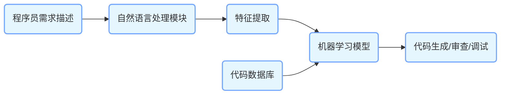

# 程序员如何利用AI工具提升效率

> 关键词：程序员、AI工具、效率提升、代码生成、智能调试

> 摘要：在当今快速发展的科技时代，AI工具正逐渐成为程序员提升工作效率的重要助力。本文深入探讨了程序员如何借助各种AI工具来优化工作流程，从核心概念和原理的阐述，到具体算法和操作步骤的讲解，再到项目实战案例的分析，全方位介绍了AI工具在编程领域的应用。同时，还推荐了相关的学习资源、开发工具和论文著作，最后对未来发展趋势与挑战进行了总结，旨在为程序员提供全面且实用的指导，帮助他们更好地利用AI工具提升自身效率。

## 1. 背景介绍 
### 1.1 目的和范围
随着软件开发行业的不断发展，程序员面临着日益增长的项目需求和紧迫的交付期限。如何在保证代码质量的前提下提高开发效率，成为了每个程序员关注的焦点。AI工具的出现为解决这一问题提供了新的途径。本文的目的在于详细介绍程序员可以利用的各类AI工具，探讨其工作原理、应用场景和使用方法，帮助程序员更好地理解和运用这些工具，提升编程效率。本文的范围涵盖了从代码生成、智能调试到项目管理等多个编程环节中涉及的AI工具，以及相关的学习资源和未来发展趋势。

### 1.2 预期读者
本文主要面向广大程序员群体，包括初级、中级和高级程序员。对于正在学习编程的新手来说，本文可以帮助他们了解AI工具在编程中的应用，为他们的学习和实践提供新的思路；对于有一定经验的程序员，本文可以作为参考，帮助他们深入了解和掌握更高级的AI工具，进一步提升工作效率；同时，对于对编程和AI技术感兴趣的其他专业人士，本文也可以作为了解这两个领域结合应用的一个窗口。

### 1.3 文档结构概述
本文将按照以下结构进行组织：首先介绍核心概念与联系，阐述AI工具在编程领域的基本原理和架构；接着详细讲解核心算法原理和具体操作步骤，并结合Python源代码进行说明；然后介绍相关的数学模型和公式，并举例说明；通过项目实战案例展示AI工具的实际应用和代码实现；探讨AI工具在不同场景下的实际应用；推荐学习资源、开发工具和相关论文著作；最后总结未来发展趋势与挑战，并提供常见问题解答和扩展阅读参考资料。

### 1.4 术语表
#### 1.4.1 核心术语定义
- **AI工具**：指利用人工智能技术开发的，能够辅助程序员完成编程相关任务的软件或平台。
- **代码生成**：通过AI算法自动生成符合特定需求的代码。
- **智能调试**：利用AI技术分析代码中的错误和异常，提供调试建议和解决方案。
- **自然语言处理（NLP）**：让计算机能够理解、处理和生成人类语言的技术。
- **机器学习（ML）**：一门多领域交叉学科，涉及概率论、统计学、逼近论、凸分析、算法复杂度理论等多门学科。它专门研究计算机怎样模拟或实现人类的学习行为，以获取新的知识或技能，重新组织已有的知识结构使之不断改善自身的性能。

#### 1.4.2 相关概念解释
- **AI编程助手**：一种基于AI技术的编程辅助工具，能够根据用户输入的自然语言描述生成代码、提供代码补全建议等。
- **代码审查工具**：利用AI技术对代码进行分析和审查，检查代码中的潜在问题、规范代码风格等。
- **自动化测试工具**：借助AI算法自动生成测试用例，对软件进行测试，提高测试效率和覆盖率。

#### 1.4.3 缩略词列表
- **NLP**：Natural Language Processing（自然语言处理）
- **ML**：Machine Learning（机器学习）
- **IDE**：Integrated Development Environment（集成开发环境）

## 2. 核心概念与联系 

### 核心概念原理
AI工具在编程领域的应用主要基于自然语言处理（NLP）和机器学习（ML）技术。自然语言处理使得计算机能够理解程序员用自然语言描述的需求，将其转化为计算机可以处理的形式；机器学习则通过对大量代码数据的学习和分析，训练出能够自动生成代码、进行代码审查和调试的模型。

例如，一个代码生成工具可能会使用预训练的语言模型，如GPT系列模型，这些模型在大规模的文本数据上进行训练，学习到了语言的模式和结构。当程序员输入自然语言描述的代码需求时，工具会将其输入到模型中，模型根据学习到的知识生成相应的代码。

### 架构示意图

这个流程图展示了AI工具在处理程序员需求时的基本架构。程序员输入自然语言描述的需求，经过自然语言处理模块进行处理和特征提取，然后将提取的特征输入到机器学习模型中。机器学习模型结合代码数据库中的知识，进行代码生成、审查或调试操作，最终输出结果。

## 3. 核心算法原理 & 具体操作步骤 

### 代码生成算法原理
代码生成的核心算法通常基于序列到序列（Seq2Seq）模型，如Transformer架构。Seq2Seq模型由编码器（Encoder）和解码器（Decoder）两部分组成。编码器将输入的自然语言描述编码为一个固定长度的向量表示，解码器则根据这个向量表示生成相应的代码序列。

以下是一个简单的基于Python和PyTorch实现的Seq2Seq模型示例：
```python
import torch
import torch.nn as nn

# 编码器
class Encoder(nn.Module):
    def __init__(self, input_dim, emb_dim, hid_dim, n_layers, dropout):
        super().__init__()
        self.hid_dim = hid_dim
        self.n_layers = n_layers
        self.embedding = nn.Embedding(input_dim, emb_dim)
        self.rnn = nn.LSTM(emb_dim, hid_dim, n_layers, dropout=dropout)
        self.dropout = nn.Dropout(dropout)

    def forward(self, src):
        embedded = self.dropout(self.embedding(src))
        outputs, (hidden, cell) = self.rnn(embedded)
        return hidden, cell

# 解码器
class Decoder(nn.Module):
    def __init__(self, output_dim, emb_dim, hid_dim, n_layers, dropout):
        super().__init__()
        self.output_dim = output_dim
        self.hid_dim = hid_dim
        self.n_layers = n_layers
        self.embedding = nn.Embedding(output_dim, emb_dim)
        self.rnn = nn.LSTM(emb_dim, hid_dim, n_layers, dropout=dropout)
        self.fc_out = nn.Linear(hid_dim, output_dim)
        self.dropout = nn.Dropout(dropout)

    def forward(self, input, hidden, cell):
        input = input.unsqueeze(0)
        embedded = self.dropout(self.embedding(input))
        output, (hidden, cell) = self.rnn(embedded, (hidden, cell))
        prediction = self.fc_out(output.squeeze(0))
        return prediction, hidden, cell

# Seq2Seq模型
class Seq2Seq(nn.Module):
    def __init__(self, encoder, decoder, device):
        super().__init__()
        self.encoder = encoder
        self.decoder = decoder
        self.device = device

    def forward(self, src, trg, teacher_forcing_ratio = 0.5):
        batch_size = trg.shape[1]
        trg_len = trg.shape[0]
        trg_vocab_size = self.decoder.output_dim
        outputs = torch.zeros(trg_len, batch_size, trg_vocab_size).to(self.device)
        hidden, cell = self.encoder(src)
        input = trg[0,:]
        for t in range(1, trg_len):
            output, hidden, cell = self.decoder(input, hidden, cell)
            outputs[t] = output
            teacher_force = torch.rand(1) < teacher_forcing_ratio
            top1 = output.argmax(1)
            input = trg[t] if teacher_force else top1
        return outputs
```

### 具体操作步骤
1. **数据准备**：收集大量的自然语言描述和对应的代码对，作为训练数据。对数据进行清洗、预处理，将其转换为模型可以接受的格式。
2. **模型训练**：使用准备好的数据对Seq2Seq模型进行训练。设置合适的超参数，如学习率、批次大小、训练轮数等。
3. **模型评估**：使用测试数据集对训练好的模型进行评估，计算准确率、损失值等指标，评估模型的性能。
4. **部署和使用**：将训练好的模型部署到相应的环境中，程序员可以输入自然语言描述，模型即可生成相应的代码。

## 4. 数学模型和公式 & 详细讲解 & 举例说明 

### 损失函数
在训练Seq2Seq模型时，常用的损失函数是交叉熵损失（Cross-Entropy Loss）。交叉熵损失用于衡量模型预测的概率分布与真实标签的概率分布之间的差异。

交叉熵损失的公式为：
$$
H(p,q) = - \sum_{i=1}^{n} p(i) \log(q(i))
$$
其中，$p(i)$ 是真实标签的概率分布，$q(i)$ 是模型预测的概率分布。

### 详细讲解
在代码生成任务中，真实标签是正确的代码序列，模型预测的是每个时间步的代码词的概率分布。交叉熵损失通过计算两者之间的差异，指导模型调整参数，使得预测的概率分布尽可能接近真实标签的概率分布。

### 举例说明
假设我们有一个简单的代码生成任务，目标是生成一个Python函数，函数的功能是计算两个数的和。真实的代码序列是 `def add(a, b): return a + b`，模型预测的概率分布在每个时间步给出不同代码词的概率。通过计算交叉熵损失，我们可以评估模型预测的准确性，并根据损失值调整模型的参数，使得模型在后续的训练中能够更准确地生成代码。

## 5. 项目实战：代码实际案例和详细解释说明 

### 5.1  开发环境搭建
1. **安装Python**：确保你的系统中安装了Python 3.x版本。可以从Python官方网站（https://www.python.org/downloads/）下载并安装。
2. **安装PyTorch**：根据你的系统环境和CUDA版本，选择合适的PyTorch安装命令。可以参考PyTorch官方网站（https://pytorch.org/get-started/locally/）进行安装。
3. **安装其他依赖库**：安装必要的依赖库，如 `numpy`、`torchtext` 等。可以使用 `pip` 命令进行安装：
```sh
pip install numpy torchtext
```

### 5.2  源代码详细实现和代码解读
以下是一个完整的代码生成项目的示例，包括数据处理、模型定义、训练和测试：
```python
import torch
import torch.nn as nn
import torch.optim as optim
from torchtext.legacy.datasets import Multi30k
from torchtext.legacy.data import Field, BucketIterator
import spacy
import random
import math
import time

# 加载分词器
spacy_en = spacy.load('en_core_web_sm')
spacy_de = spacy.load('de_core_news_sm')

# 定义分词函数
def tokenize_en(text):
    return [tok.text for tok in spacy_en.tokenizer(text)]

# 定义字段
SRC = Field(tokenize = tokenize_en, init_token = '<sos>', eos_token = '<eos>', lower = True)
TRG = Field(tokenize = tokenize_en, init_token = '<sos>', eos_token = '<eos>', lower = True)

# 加载数据集
train_data, valid_data, test_data = Multi30k.splits(exts = ('.en', '.en'), fields = (SRC, TRG))

# 构建词汇表
SRC.build_vocab(train_data, min_freq = 2)
TRG.build_vocab(train_data, min_freq = 2)

# 定义设备
device = torch.device('cuda' if torch.cuda.is_available() else 'cpu')

# 定义编码器
class Encoder(nn.Module):
    def __init__(self, input_dim, emb_dim, hid_dim, n_layers, dropout):
        super().__init__()
        self.hid_dim = hid_dim
        self.n_layers = n_layers
        self.embedding = nn.Embedding(input_dim, emb_dim)
        self.rnn = nn.LSTM(emb_dim, hid_dim, n_layers, dropout=dropout)
        self.dropout = nn.Dropout(dropout)

    def forward(self, src):
        embedded = self.dropout(self.embedding(src))
        outputs, (hidden, cell) = self.rnn(embedded)
        return hidden, cell

# 定义解码器
class Decoder(nn.Module):
    def __init__(self, output_dim, emb_dim, hid_dim, n_layers, dropout):
        super().__init__()
        self.output_dim = output_dim
        self.hid_dim = hid_dim
        self.n_layers = n_layers
        self.embedding = nn.Embedding(output_dim, emb_dim)
        self.rnn = nn.LSTM(emb_dim, hid_dim, n_layers, dropout=dropout)
        self.fc_out = nn.Linear(hid_dim, output_dim)
        self.dropout = nn.Dropout(dropout)

    def forward(self, input, hidden, cell):
        input = input.unsqueeze(0)
        embedded = self.dropout(self.embedding(input))
        output, (hidden, cell) = self.rnn(embedded, (hidden, cell))
        prediction = self.fc_out(output.squeeze(0))
        return prediction, hidden, cell

# 定义Seq2Seq模型
class Seq2Seq(nn.Module):
    def __init__(self, encoder, decoder, device):
        super().__init__()
        self.encoder = encoder
        self.decoder = decoder
        self.device = device

    def forward(self, src, trg, teacher_forcing_ratio = 0.5):
        batch_size = trg.shape[1]
        trg_len = trg.shape[0]
        trg_vocab_size = self.decoder.output_dim
        outputs = torch.zeros(trg_len, batch_size, trg_vocab_size).to(self.device)
        hidden, cell = self.encoder(src)
        input = trg[0,:]
        for t in range(1, trg_len):
            output, hidden, cell = self.decoder(input, hidden, cell)
            outputs[t] = output
            teacher_force = random.random() < teacher_forcing_ratio
            top1 = output.argmax(1)
            input = trg[t] if teacher_force else top1
        return outputs

# 初始化模型
INPUT_DIM = len(SRC.vocab)
OUTPUT_DIM = len(TRG.vocab)
ENC_EMB_DIM = 256
DEC_EMB_DIM = 256
HID_DIM = 512
N_LAYERS = 2
ENC_DROPOUT = 0.5
DEC_DROPOUT = 0.5

enc = Encoder(INPUT_DIM, ENC_EMB_DIM, HID_DIM, N_LAYERS, ENC_DROPOUT)
dec = Decoder(OUTPUT_DIM, DEC_EMB_DIM, HID_DIM, N_LAYERS, DEC_DROPOUT)

model = Seq2Seq(enc, dec, device).to(device)

# 定义优化器和损失函数
optimizer = optim.Adam(model.parameters())
criterion = nn.CrossEntropyLoss(ignore_index = TRG.vocab.stoi[TRG.pad_token])

# 训练函数
def train(model, iterator, optimizer, criterion, clip):
    model.train()
    epoch_loss = 0
    for i, batch in enumerate(iterator):
        src = batch.src
        trg = batch.trg
        optimizer.zero_grad()
        output = model(src, trg)
        output_dim = output.shape[-1]
        output = output[1:].view(-1, output_dim)
        trg = trg[1:].view(-1)
        loss = criterion(output, trg)
        loss.backward()
        torch.nn.utils.clip_grad_norm_(model.parameters(), clip)
        optimizer.step()
        epoch_loss += loss.item()
    return epoch_loss / len(iterator)

# 评估函数
def evaluate(model, iterator, criterion):
    model.eval()
    epoch_loss = 0
    with torch.no_grad():
        for i, batch in enumerate(iterator):
            src = batch.src
            trg = batch.trg
            output = model(src, trg, 0)
            output_dim = output.shape[-1]
            output = output[1:].view(-1, output_dim)
            trg = trg[1:].view(-1)
            loss = criterion(output, trg)
            epoch_loss += loss.item()
    return epoch_loss / len(iterator)

# 训练模型
N_EPOCHS = 10
CLIP = 1

best_valid_loss = float('inf')

for epoch in range(N_EPOCHS):
    start_time = time.time()
    train_loss = train(model, train_iterator, optimizer, criterion, CLIP)
    valid_loss = evaluate(model, valid_iterator, criterion)
    end_time = time.time()
    epoch_mins, epoch_secs = epoch_time(start_time, end_time)
    if valid_loss < best_valid_loss:
        best_valid_loss = valid_loss
        torch.save(model.state_dict(), 'tut1-model.pt')
    print(f'Epoch: {epoch+1:02} | Time: {epoch_mins}m {epoch_secs}s')
    print(f'\tTrain Loss: {train_loss:.3f} | Train PPL: {math.exp(train_loss):7.3f}')
    print(f'\t Val. Loss: {valid_loss:.3f} |  Val. PPL: {math.exp(valid_loss):7.3f}')

# 测试模型
model.load_state_dict(torch.load('tut1-model.pt'))
test_loss = evaluate(model, test_iterator, criterion)
print(f'| Test Loss: {test_loss:.3f} | Test PPL: {math.exp(test_loss):7.3f} |')
```

### 5.3  代码解读与分析
- **数据处理**：使用 `torchtext` 库加载数据集，并进行分词、构建词汇表等操作。
- **模型定义**：定义了编码器、解码器和Seq2Seq模型，使用LSTM作为循环神经网络。
- **训练和评估**：定义了训练函数和评估函数，使用交叉熵损失和Adam优化器进行训练和评估。
- **模型保存和加载**：在训练过程中，保存验证集损失最小的模型，训练结束后加载最佳模型进行测试。

## 6. 实际应用场景 
### 代码生成
AI工具可以根据程序员的自然语言描述自动生成代码，大大提高了代码编写的效率。例如，程序员只需要描述“写一个Python函数，用于计算两个数的乘积”，AI工具就可以生成相应的代码：
```python
def multiply(a, b):
    return a * b
```

### 智能调试
当代码出现错误时，AI工具可以分析错误信息和代码上下文，提供调试建议和解决方案。例如，当代码中出现 `NameError` 错误时，AI工具可以提示程序员检查变量名是否正确定义。

### 代码审查
AI工具可以对代码进行静态分析，检查代码中的潜在问题，如代码风格不规范、性能瓶颈等。例如，检查代码中是否存在未使用的变量、是否有冗余的代码等。

### 项目管理
AI工具可以帮助程序员进行项目管理，如任务分配、进度跟踪等。通过分析项目的需求和资源，AI工具可以合理分配任务，预测项目的完成时间。

## 7. 工具和资源推荐
### 7.1 学习资源推荐
#### 7.1.1 书籍推荐
- 《Python深度学习》：由Francois Chollet所著，详细介绍了Python和深度学习的基础知识和应用。
- 《机器学习》：周志华教授的经典著作，全面介绍了机器学习的基本概念、算法和应用。
- 《自然语言处理入门》：何晗所著，适合初学者了解自然语言处理的基本原理和方法。

#### 7.1.2 在线课程
- Coursera上的“深度学习专项课程”：由Andrew Ng教授主讲，系统地介绍了深度学习的各个方面。
- edX上的“自然语言处理基础”：提供了自然语言处理的基础知识和实践经验。
- 哔哩哔哩上的“Python编程从入门到实践”：适合初学者快速入门Python编程。

#### 7.1.3 技术博客和网站
- Medium：上面有很多关于AI和编程的技术文章，涵盖了最新的研究成果和实践经验。
- 掘金：国内知名的技术社区，有很多程序员分享的技术文章和项目经验。
- AI开源社区：提供了丰富的AI开源项目和技术资源。

### 7.2 开发工具框架推荐
#### 7.2.1 IDE和编辑器
- PyCharm：一款专业的Python集成开发环境，提供了丰富的代码编辑、调试和分析功能。
- Visual Studio Code：一款轻量级的代码编辑器，支持多种编程语言，并且有丰富的插件扩展功能。
- Jupyter Notebook：适合进行数据探索和模型实验，提供了交互式的编程环境。

#### 7.2.2 调试和性能分析工具
- PDB：Python自带的调试器，可以帮助程序员定位代码中的错误。
- Py-Spy：用于分析Python代码的性能瓶颈，找出耗时较长的代码段。
- TensorBoard：用于可视化深度学习模型的训练过程和性能指标。

#### 7.2.3 相关框架和库
- PyTorch：一个开源的深度学习框架，提供了丰富的深度学习模型和工具。
- TensorFlow：另一个广泛使用的深度学习框架，具有强大的分布式训练和部署能力。
- Hugging Face Transformers：提供了预训练的语言模型和相关工具，方便进行自然语言处理任务。

### 7.3 相关论文著作推荐
#### 7.3.1 经典论文
- “Attention Is All You Need”：提出了Transformer架构，为自然语言处理和深度学习带来了革命性的变化。
- “Generating Sequences With Recurrent Neural Networks”：介绍了循环神经网络在序列生成任务中的应用。
- “Neural Machine Translation by Jointly Learning to Align and Translate”：提出了注意力机制在机器翻译中的应用。

#### 7.3.2 最新研究成果
- 关注arXiv上的最新论文，了解AI在编程领域的最新研究进展。
- 参加相关的学术会议，如NeurIPS、ICML等，获取最新的研究成果和技术趋势。

#### 7.3.3 应用案例分析
- 阅读AI工具在编程领域的应用案例，了解实际项目中的经验和教训。
- 参考开源项目的文档和代码，学习其他开发者的实践经验。

## 8. 总结：未来发展趋势与挑战
### 未来发展趋势
- **更智能的代码生成**：AI工具将能够生成更复杂、更高效的代码，并且能够根据不同的编程风格和需求进行个性化的代码生成。
- **集成式开发环境**：AI工具将与集成开发环境（IDE）深度集成，为程序员提供更加无缝的编程体验。
- **跨语言和跨平台支持**：AI工具将支持更多的编程语言和平台，满足不同程序员的需求。
- **强化学习应用**：利用强化学习技术，让AI工具能够自动优化代码，提高代码的性能和质量。

### 挑战
- **数据隐私和安全**：AI工具需要大量的代码数据进行训练，如何保证数据的隐私和安全是一个重要的挑战。
- **模型可解释性**：深度学习模型通常是黑盒模型，难以解释其决策过程。在编程领域，需要提高模型的可解释性，让程序员能够理解和信任AI工具的输出。
- **技术门槛**：虽然AI工具可以帮助程序员提高效率，但程序员仍然需要具备一定的AI和机器学习知识，才能更好地使用这些工具。

## 9. 附录：常见问题与解答
### 问题1：AI工具生成的代码质量如何保证？
解答：AI工具生成的代码质量可以通过多种方式保证。首先，训练数据的质量非常重要，需要使用高质量、规范的代码数据进行训练。其次，可以结合代码审查工具对生成的代码进行检查和优化。此外，程序员在使用AI工具生成的代码时，也需要进行人工审查和测试，确保代码的正确性和性能。

### 问题2：AI工具是否会取代程序员？
解答：AI工具不会取代程序员，而是会成为程序员的重要助手。虽然AI工具可以自动生成代码、进行调试和审查，但编程不仅仅是代码的编写，还涉及到需求分析、系统设计、架构规划等多个方面。程序员的创造力、逻辑思维和问题解决能力是AI工具无法替代的。

### 问题3：如何选择适合自己的AI工具？
解答：选择适合自己的AI工具需要考虑多个因素。首先，要根据自己的编程需求和场景选择相应的工具，如代码生成工具、智能调试工具等。其次，要考虑工具的易用性、性能和社区支持等方面。可以参考其他程序员的使用经验和评价，选择口碑较好的工具。

## 10. 扩展阅读 & 参考资料
- 《人工智能：现代方法》
- 《深度学习实战》
- https://openai.com/
- https://pytorch.org/
- https://www.tensorflow.org/