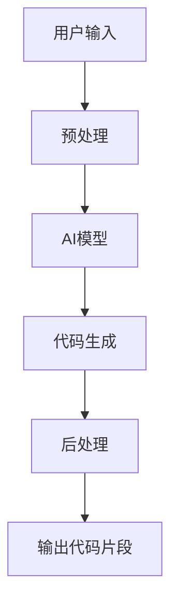

# 程序员如何利用AI进行代码片段生成

> 关键词：程序员、AI、代码片段生成、人工智能编程、代码辅助工具、机器学习、自动化编程

> 摘要：本文聚焦于程序员如何利用AI进行代码片段生成这一主题。随着人工智能技术的飞速发展，其在编程领域的应用日益广泛，代码片段生成成为提高程序员开发效率的重要手段。文章将深入探讨相关核心概念、算法原理、数学模型，通过项目实战展示具体的实现过程和代码解读，介绍实际应用场景，并推荐相关的工具和资源。最后对未来发展趋势与挑战进行总结，旨在为程序员提供全面、深入的指导，帮助他们更好地利用AI提升编程能力和工作效率。

## 1. 背景介绍 
### 1.1 目的和范围
随着软件开发的复杂度不断增加，程序员面临着越来越多的挑战，如代码编写效率低、重复劳动多等。AI技术的发展为解决这些问题提供了新的思路和方法。本文的目的是帮助程序员了解如何利用AI进行代码片段生成，提高编程效率和代码质量。范围涵盖了AI代码生成的核心概念、算法原理、实际应用以及相关工具和资源的介绍。

### 1.2 预期读者
本文主要面向广大程序员，包括初级、中级和高级开发者。对于对AI编程感兴趣的学生、研究人员以及想要提高编程效率的技术爱好者也具有参考价值。

### 1.3 文档结构概述
本文将按照以下结构进行阐述：首先介绍核心概念与联系，让读者对AI代码生成有初步的了解；接着深入探讨核心算法原理和具体操作步骤，并通过Python代码进行详细阐述；然后介绍相关的数学模型和公式，并举例说明；通过项目实战展示代码实际案例和详细解释；分析实际应用场景；推荐相关的工具和资源；最后总结未来发展趋势与挑战，并提供常见问题与解答以及扩展阅读和参考资料。

### 1.4 术语表
#### 1.4.1 核心术语定义
- **AI（Artificial Intelligence）**：人工智能，是指计算机系统能够执行通常需要人类智能才能完成的任务的技术。
- **代码片段生成**：利用AI技术自动生成特定功能的代码片段，帮助程序员减少手动编写代码的工作量。
- **机器学习（Machine Learning）**：人工智能的一个分支，通过让计算机从数据中学习模式和规律，从而实现预测和决策。
- **深度学习（Deep Learning）**：一种基于人工神经网络的机器学习方法，能够处理复杂的数据和任务。

#### 1.4.2 相关概念解释
- **自然语言处理（Natural Language Processing，NLP）**：研究如何让计算机理解和处理人类语言的技术，在AI代码生成中用于将自然语言描述转换为代码。
- **代码补全**：在程序员编写代码时，根据上下文自动提示可能的代码片段，帮助程序员快速完成代码编写。

#### 1.4.3 缩略词列表
- **NLP**：Natural Language Processing（自然语言处理）
- **ML**：Machine Learning（机器学习）
- **DL**：Deep Learning（深度学习）

## 2. 核心概念与联系 

### 核心概念原理
AI进行代码片段生成的核心原理是基于机器学习和深度学习技术。通过对大量的代码数据进行学习，模型可以掌握不同编程语言的语法、语义和常见的编程模式。当用户输入需求描述（如自然语言描述或部分代码）时，模型会根据学习到的知识生成相应的代码片段。

例如，一个基于深度学习的代码生成模型可能会使用循环神经网络（RNN）或其变体（如LSTM、GRU）来处理代码序列。这些网络可以捕捉代码中的上下文信息，从而生成更符合逻辑的代码。另外，Transformer架构也被广泛应用于代码生成任务中，它通过自注意力机制能够更好地处理长距离依赖关系。

### 架构的文本示意图
```plaintext
用户输入（自然语言描述或部分代码） -> 预处理（如分词、编码） -> AI模型（如基于深度学习的代码生成模型） -> 代码生成（根据模型预测结果生成代码片段） -> 后处理（如格式化、语法检查） -> 输出代码片段
```

### Mermaid流程图


## 3. 核心算法原理 & 具体操作步骤 

### 核心算法原理
这里以一个简单的基于循环神经网络（RNN）的代码生成模型为例进行讲解。RNN是一种能够处理序列数据的神经网络，它通过在每个时间步更新隐藏状态来捕捉序列中的上下文信息。

假设我们有一个代码序列 $x = [x_1, x_2, ..., x_T]$，其中 $x_t$ 表示第 $t$ 个时间步的输入（如一个代码标记）。RNN的隐藏状态更新公式为：

$h_t = \tanh(W_{hh}h_{t-1} + W_{xh}x_t + b_h)$

其中，$h_t$ 是第 $t$ 个时间步的隐藏状态，$W_{hh}$ 是隐藏状态到隐藏状态的权重矩阵，$W_{xh}$ 是输入到隐藏状态的权重矩阵，$b_h$ 是隐藏状态的偏置项。

在代码生成阶段，我们可以根据当前的隐藏状态 $h_t$ 预测下一个代码标记 $y_t$ 的概率分布：

$p(y_t|x_1, ..., x_t) = \text{softmax}(W_{hy}h_t + b_y)$

其中，$W_{hy}$ 是隐藏状态到输出的权重矩阵，$b_y$ 是输出的偏置项。

### Python源代码详细阐述
```python
import torch
import torch.nn as nn
import torch.optim as optim

# 定义RNN代码生成模型
class RNNCodeGenerator(nn.Module):
    def __init__(self, input_size, hidden_size, output_size):
        super(RNNCodeGenerator, self).__init__()
        self.hidden_size = hidden_size
        self.embedding = nn.Embedding(input_size, hidden_size)
        self.rnn = nn.RNN(hidden_size, hidden_size)
        self.fc = nn.Linear(hidden_size, output_size)

    def forward(self, input, hidden):
        embedded = self.embedding(input).view(1, 1, -1)
        output, hidden = self.rnn(embedded, hidden)
        output = self.fc(output.view(1, -1))
        return output, hidden

    def init_hidden(self):
        return torch.zeros(1, 1, self.hidden_size)

# 训练模型
def train(model, input_tensor, target_tensor, criterion, optimizer):
    hidden = model.init_hidden()
    model.zero_grad()
    loss = 0

    for i in range(input_tensor.size(0)):
        output, hidden = model(input_tensor[i], hidden)
        loss += criterion(output, target_tensor[i].unsqueeze(0))

    loss.backward()
    optimizer.step()

    return loss.item()

# 生成代码
def generate_code(model, input_text, char_to_idx, idx_to_char, max_length=100):
    with torch.no_grad():
        input_tensor = torch.tensor([char_to_idx[char] for char in input_text])
        hidden = model.init_hidden()

        output_text = input_text
        for _ in range(max_length):
            output, hidden = model(input_tensor[-1].unsqueeze(0), hidden)
            topv, topi = output.topk(1)
            next_char = idx_to_char[topi.item()]
            output_text += next_char
            input_tensor = torch.cat((input_tensor, torch.tensor([char_to_idx[next_char]])))

    return output_text

# 示例使用
input_size = 100  # 输入字符的数量
hidden_size = 128
output_size = 100  # 输出字符的数量

model = RNNCodeGenerator(input_size, hidden_size, output_size)
criterion = nn.CrossEntropyLoss()
optimizer = optim.Adam(model.parameters(), lr=0.001)

# 模拟训练数据
input_text = "def add(a, b):"
target_text = "    return a + b"

char_to_idx = {char: idx for idx, char in enumerate(set(input_text + target_text))}
idx_to_char = {idx: char for char, idx in char_to_idx.items()}

input_tensor = torch.tensor([char_to_idx[char] for char in input_text])
target_tensor = torch.tensor([char_to_idx[char] for char in target_text])

# 训练模型
for epoch in range(100):
    loss = train(model, input_tensor, target_tensor, criterion, optimizer)
    if epoch % 10 == 0:
        print(f'Epoch {epoch}, Loss: {loss}')

# 生成代码
generated_code = generate_code(model, input_text, char_to_idx, idx_to_char)
print(f'Generated Code: {generated_code}')
```

### 具体操作步骤
1. **数据准备**：收集大量的代码数据，并进行预处理，如分词、编码等。
2. **模型定义**：根据需求选择合适的模型架构，如RNN、LSTM、Transformer等，并定义模型的参数。
3. **模型训练**：使用准备好的数据对模型进行训练，调整模型的参数以最小化损失函数。
4. **代码生成**：在训练好的模型上输入需求描述或部分代码，生成相应的代码片段。
5. **后处理**：对生成的代码进行格式化、语法检查等后处理操作，确保代码的质量。

## 4. 数学模型和公式 & 详细讲解 & 举例说明 

### 数学模型
在AI代码生成中，常用的数学模型包括概率模型和深度学习模型。概率模型基于概率论的原理，通过计算不同代码标记的概率来生成代码。深度学习模型则通过神经网络学习代码的模式和规律。

### 公式讲解
#### 交叉熵损失函数
在训练代码生成模型时，常用交叉熵损失函数来衡量模型预测结果与真实标签之间的差异。交叉熵损失函数的公式为：

$$H(p, q) = -\sum_{i=1}^{n} p_i \log(q_i)$$

其中，$p$ 是真实标签的概率分布，$q$ 是模型预测的概率分布。

#### 梯度下降法
梯度下降法是一种常用的优化算法，用于更新模型的参数以最小化损失函数。梯度下降法的更新公式为：

$$\theta_{t+1} = \theta_t - \alpha \nabla L(\theta_t)$$

其中，$\theta_t$ 是第 $t$ 次迭代的模型参数，$\alpha$ 是学习率，$\nabla L(\theta_t)$ 是损失函数 $L$ 关于参数 $\theta_t$ 的梯度。

### 举例说明
假设我们有一个二分类问题，真实标签的概率分布为 $p = [0, 1]$，模型预测的概率分布为 $q = [0.2, 0.8]$。则交叉熵损失为：

$$H(p, q) = -(0 \log(0.2) + 1 \log(0.8)) \approx 0.223$$

在梯度下降法中，假设损失函数 $L(\theta) = \theta^2$，初始参数 $\theta_0 = 1$，学习率 $\alpha = 0.1$。则第一次迭代的参数更新为：

$$\theta_1 = \theta_0 - \alpha \nabla L(\theta_0) = 1 - 0.1 \times 2\theta_0 = 1 - 0.1 \times 2 \times 1 = 0.8$$

## 5. 项目实战：代码实际案例和详细解释说明 

### 5.1  开发环境搭建
- **操作系统**：可以选择Windows、Linux或macOS。
- **Python环境**：安装Python 3.6及以上版本。
- **深度学习框架**：安装PyTorch，可以使用以下命令进行安装：
```bash
pip install torch torchvision
```
- **代码编辑器**：推荐使用VS Code、PyCharm等。

### 5.2  源代码详细实现和代码解读
以下是一个使用Hugging Face的Transformers库进行代码生成的示例：

```python
from transformers import AutoTokenizer, AutoModelForCausalLM

# 加载预训练的代码生成模型和分词器
tokenizer = AutoTokenizer.from_pretrained("Salesforce/codegen-350M-mono")
model = AutoModelForCausalLM.from_pretrained("Salesforce/codegen-350M-mono")

# 输入需求描述
input_text = "def add(a, b):"

# 对输入进行编码
input_ids = tokenizer(input_text, return_tensors="pt").input_ids

# 生成代码
generated_ids = model.generate(input_ids, max_length=100, num_beams=5, no_repeat_ngram_size=2, early_stopping=True)

# 解码生成的代码
generated_code = tokenizer.decode(generated_ids[0], skip_special_tokens=True)

print(f'Generated Code: {generated_code}')
```

### 代码解读与分析
1. **加载模型和分词器**：使用 `AutoTokenizer` 和 `AutoModelForCausalLM` 从Hugging Face的模型库中加载预训练的代码生成模型和分词器。
2. **输入编码**：使用分词器对输入的需求描述进行编码，将其转换为模型可以处理的输入格式。
3. **代码生成**：使用模型的 `generate` 方法生成代码，设置了一些生成参数，如最大长度、束搜索的束数等。
4. **解码输出**：使用分词器对生成的代码进行解码，将其转换为人类可读的文本格式。

## 6. 实际应用场景 
- **快速原型开发**：在项目的初期阶段，程序员可以利用AI代码生成快速生成一些基本的代码框架，加速项目的启动。
- **代码补全**：在编写代码时，AI可以根据上下文自动补全代码，减少手动输入的工作量。
- **错误修复**：当代码出现错误时，AI可以分析错误信息并生成修复建议，帮助程序员快速解决问题。
- **代码优化**：AI可以分析现有代码，提出优化建议，提高代码的性能和可读性。
- **跨语言开发**：对于不熟悉的编程语言，AI可以根据需求生成相应的代码，帮助程序员快速上手。

## 7. 工具和资源推荐
### 7.1 学习资源推荐
#### 7.1.1 书籍推荐
- 《深度学习》（Deep Learning）：由Ian Goodfellow、Yoshua Bengio和Aaron Courville所著，是深度学习领域的经典教材。
- 《Python深度学习》（Deep Learning with Python）：由Francois Chollet所著，介绍了如何使用Python和Keras进行深度学习开发。
- 《自然语言处理入门》：帮助读者了解自然语言处理的基本概念和技术。

#### 7.1.2 在线课程
- Coursera上的“深度学习专项课程”（Deep Learning Specialization）：由Andrew Ng教授授课，全面介绍了深度学习的各个方面。
- edX上的“自然语言处理”（Natural Language Processing）：提供了自然语言处理的理论和实践知识。

#### 7.1.3 技术博客和网站
- Hugging Face博客：提供了关于深度学习和自然语言处理的最新研究成果和实践经验。
- Medium上的AI和编程相关博客：有许多优秀的技术文章和教程。

### 7.2 开发工具框架推荐
#### 7.2.1 IDE和编辑器
- VS Code：功能强大的代码编辑器，支持多种编程语言和插件。
- PyCharm：专门为Python开发设计的集成开发环境，提供了丰富的功能和工具。

#### 7.2.2 调试和性能分析工具
- Py-Spy：用于分析Python代码的性能瓶颈。
- PDB：Python的内置调试器，帮助程序员调试代码。

#### 7.2.3 相关框架和库
- PyTorch：一个开源的深度学习框架，广泛应用于代码生成等任务。
- Hugging Face Transformers：提供了丰富的预训练模型和工具，方便进行自然语言处理和代码生成。

### 7.3 相关论文著作推荐
#### 7.3.1 经典论文
- “Attention Is All You Need”：介绍了Transformer架构，对自然语言处理和代码生成产生了深远的影响。
- “Generating Code from Natural Language with Neural Attention”：研究了如何使用神经网络和注意力机制从自然语言生成代码。

#### 7.3.2 最新研究成果
- 关注顶级学术会议（如NeurIPS、ICML、ACL等）上的相关研究论文，了解AI代码生成的最新进展。

#### 7.3.3 应用案例分析
- 一些开源项目和技术博客会分享AI代码生成的应用案例，可以从中学习实际应用中的经验和技巧。

## 8. 总结：未来发展趋势与挑战
### 未来发展趋势
- **更强大的模型**：随着深度学习技术的不断发展，未来的代码生成模型将更加智能和强大，能够处理更复杂的编程任务。
- **与开发工具的深度集成**：AI代码生成工具将与现有的开发工具（如IDE、版本控制系统等）深度集成，提供更加无缝的开发体验。
- **跨领域应用**：AI代码生成不仅会在软件开发领域得到广泛应用，还将拓展到其他领域，如数据分析、科学计算等。

### 挑战
- **代码质量和安全性**：生成的代码可能存在质量问题和安全漏洞，需要进一步的验证和审查。
- **数据隐私和知识产权**：代码数据的隐私和知识产权问题需要得到妥善解决，以避免潜在的法律风险。
- **人类程序员的角色转变**：AI的发展可能会对人类程序员的角色产生影响，需要程序员不断学习和提升自己的技能。

## 9. 附录：常见问题与解答
### 问题1：AI生成的代码是否可以直接用于生产环境？
答：一般情况下，AI生成的代码需要经过人工审查和测试，确保其质量和安全性后才能用于生产环境。因为AI生成的代码可能存在逻辑错误、性能问题或安全漏洞。

### 问题2：如何选择适合的AI代码生成模型？
答：可以根据具体的需求和场景选择合适的模型。例如，如果需要处理大规模的代码数据，可以选择基于Transformer架构的模型；如果对模型的实时性要求较高，可以选择轻量级的模型。

### 问题3：AI代码生成是否会取代人类程序员？
答：AI代码生成不会取代人类程序员，而是作为一种辅助工具帮助程序员提高工作效率。人类程序员的创造力、逻辑思维和问题解决能力是AI无法替代的。

## 10. 扩展阅读 & 参考资料
- Hugging Face官方文档：https://huggingface.co/docs
- PyTorch官方文档：https://pytorch.org/docs/stable/
- 《人工智能：一种现代的方法》（Artificial Intelligence: A Modern Approach）
- 相关的学术论文和技术报告

通过以上内容，程序员可以全面了解如何利用AI进行代码片段生成，掌握相关的技术和方法，并在实际开发中应用，提高编程效率和代码质量。同时，也需要关注未来的发展趋势和挑战，不断学习和进步。