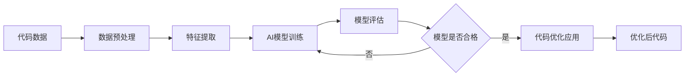

# 程序员如何利用AI进行智能代码优化

> 关键词：程序员、AI、智能代码优化、代码质量、性能提升

> 摘要：本文聚焦于程序员如何利用AI进行智能代码优化这一主题。首先介绍相关背景，包括目的范围、预期读者等，接着阐述核心概念与联系，详细讲解核心算法原理及操作步骤，通过数学模型和公式深入剖析，给出项目实战案例并进行解读分析，探讨实际应用场景，推荐相关工具和资源，最后总结未来发展趋势与挑战，解答常见问题并提供参考资料，旨在帮助程序员借助AI的力量有效提升代码质量和性能。

## 1. 背景介绍 
### 1.1 目的和范围
在当今软件开发领域，代码的质量和性能至关重要。随着软件系统的不断复杂和规模的不断扩大，手动进行代码优化变得越来越困难且耗时。AI技术的发展为代码优化带来了新的机遇。本文的目的在于全面探讨程序员如何利用AI进行智能代码优化，范围涵盖从核心概念、算法原理到实际项目应用等多个方面，旨在为程序员提供一套系统的利用AI优化代码的方法和思路。

### 1.2 预期读者
本文预期读者主要包括广大程序员，无论是初入职场的新手程序员，还是有一定经验的资深开发者，都能从本文中获取关于利用AI进行代码优化的有用信息。同时，对软件开发过程中的代码质量和性能提升感兴趣的软件工程师、软件架构师等相关人员也适合阅读本文。

### 1.3 文档结构概述
本文首先介绍背景信息，让读者了解利用AI进行智能代码优化的重要性和相关背景知识。接着阐述核心概念与联系，帮助读者理解AI在代码优化中的基本原理和架构。然后详细讲解核心算法原理及具体操作步骤，通过Python代码进行示例。再通过数学模型和公式进一步深入分析。之后给出项目实战案例，包括开发环境搭建、源代码实现和代码解读。随后探讨实际应用场景，推荐相关工具和资源。最后总结未来发展趋势与挑战，解答常见问题并提供参考资料。

### 1.4 术语表
#### 1.4.1 核心术语定义
- **AI（Artificial Intelligence）**：人工智能，是研究、开发用于模拟、延伸和扩展人的智能的理论、方法、技术及应用系统的一门新的技术科学。
- **代码优化**：对现有代码进行改进，以提高代码的性能、可读性、可维护性等方面的质量。
- **智能代码优化**：利用AI技术自动分析和改进代码，实现更高效、更精准的代码优化。

#### 1.4.2 相关概念解释
- **机器学习**：AI的一个重要分支，通过让计算机从数据中学习模式和规律，从而实现预测和决策等功能。在代码优化中，机器学习可以用于分析代码特征，预测代码性能等。
- **深度学习**：一种基于人工神经网络的机器学习方法，能够处理复杂的非线性关系。在代码优化中，深度学习可以用于对代码进行语义分析等。

#### 1.4.3 缩略词列表
- **ML（Machine Learning）**：机器学习
- **DL（Deep Learning）**：深度学习

## 2. 核心概念与联系 

### 核心概念原理
智能代码优化利用AI技术对代码进行分析和改进。其基本原理是通过对大量代码数据的学习，让AI模型掌握代码的结构、语义和性能之间的关系。例如，机器学习模型可以学习不同代码结构的执行效率，从而在面对新的代码时，能够预测哪些部分可能存在性能瓶颈，并提出优化建议。

深度学习模型可以对代码进行更深入的语义分析，理解代码的功能和逻辑，进而发现潜在的优化点。例如，通过对代码的抽象语法树进行分析，深度学习模型可以识别出重复的代码片段、低效的算法等。

### 架构示意图


### 核心概念联系
代码数据是整个智能代码优化的基础，通过数据预处理和特征提取，将代码数据转换为适合AI模型处理的形式。AI模型在训练过程中学习代码的特征和性能之间的关系，经过评估后，如果模型合格则可以应用于代码优化。优化后的代码又可以作为新的数据用于模型的进一步训练和改进，形成一个闭环的优化过程。

## 3. 核心算法原理 & 具体操作步骤 

### 核心算法原理
在智能代码优化中，常用的算法包括机器学习中的决策树、随机森林，以及深度学习中的循环神经网络（RNN）、长短时记忆网络（LSTM）等。下面以决策树算法为例进行详细阐述。

决策树是一种基于树结构进行决策的算法。在代码优化中，决策树可以根据代码的特征（如代码行数、循环嵌套层数等）对代码进行分类，判断代码是否存在性能问题，并给出相应的优化建议。

### 具体操作步骤及Python代码示例
#### 步骤1：数据收集
收集大量的代码数据，包括代码本身和对应的性能指标（如执行时间、内存占用等）。以下是一个简单的模拟数据收集示例：
```python
# 模拟代码数据和性能指标
code_data = [
    "for i in range(10): print(i)",
    "while True: pass",
    "def func(): return 1"
]
performance_metrics = [0.1, 100, 0.01]
```

#### 步骤2：数据预处理
对代码数据进行清洗和转换，提取有用的特征。例如，可以将代码转换为词向量表示，统计代码的行数、函数调用次数等特征。
```python
import re

def extract_features(code):
    lines = code.split('\n')
    line_count = len(lines)
    function_call_count = len(re.findall(r'\w+\(', code))
    return [line_count, function_call_count]

feature_data = [extract_features(code) for code in code_data]
```

#### 步骤3：模型训练
使用决策树算法对特征数据和性能指标进行训练。
```python
from sklearn.tree import DecisionTreeRegressor

model = DecisionTreeRegressor()
model.fit(feature_data, performance_metrics)
```

#### 步骤4：代码优化预测
对于新的代码，提取特征并使用训练好的模型进行性能预测，根据预测结果给出优化建议。
```python
new_code = "for j in range(20): print(j)"
new_features = extract_features(new_code)
predicted_performance = model.predict([new_features])
print(f"预测性能: {predicted_performance[0]}")
```

## 4. 数学模型和公式 & 详细讲解 & 举例说明 

### 决策树算法的数学模型
决策树算法的核心是构建一个决策树结构，通过对特征的划分来进行决策。决策树的每个内部节点对应一个特征的划分，每个分支对应一个划分的结果，每个叶节点对应一个预测值。

决策树的构建过程通常使用信息增益、基尼指数等指标来选择最优的划分特征。以信息增益为例，信息增益的计算公式为：
$$IG(D, A) = H(D) - \sum_{v \in Values(A)} \frac{|D^v|}{|D|} H(D^v)$$
其中，$IG(D, A)$ 表示特征 $A$ 对数据集 $D$ 的信息增益，$H(D)$ 表示数据集 $D$ 的熵，$Values(A)$ 表示特征 $A$ 的所有取值，$D^v$ 表示数据集 $D$ 中特征 $A$ 取值为 $v$ 的子集。

### 详细讲解
熵是衡量数据集不确定性的指标，其计算公式为：
$$H(D) = -\sum_{k = 1}^{|Y|} p_k \log_2 p_k$$
其中，$|Y|$ 表示数据集 $D$ 中类别标签的数量，$p_k$ 表示类别标签 $k$ 在数据集 $D$ 中出现的概率。

信息增益表示使用特征 $A$ 对数据集 $D$ 进行划分后，数据集不确定性的减少程度。信息增益越大，说明使用该特征进行划分的效果越好。

### 举例说明
假设有一个数据集 $D$ 包含 10 个样本，其中 6 个样本的类别标签为 0，4 个样本的类别标签为 1。则数据集 $D$ 的熵为：
$$H(D) = -\frac{6}{10} \log_2 \frac{6}{10} - \frac{4}{10} \log_2 \frac{4}{10} \approx 0.971$$
假设有一个特征 $A$，其取值为 0 和 1，其中取值为 0 的样本有 4 个，类别标签为 0 的有 3 个，类别标签为 1 的有 1 个；取值为 1 的样本有 6 个，类别标签为 0 的有 3 个，类别标签为 1 的有 3 个。则特征 $A$ 对数据集 $D$ 的信息增益为：
$$IG(D, A) = H(D) - \frac{4}{10} H(D^0) - \frac{6}{10} H(D^1)$$
其中，$H(D^0) = -\frac{3}{4} \log_2 \frac{3}{4} - \frac{1}{4} \log_2 \frac{1}{4} \approx 0.811$，$H(D^1) = -\frac{3}{6} \log_2 \frac{3}{6} - \frac{3}{6} \log_2 \frac{3}{6} = 1$。
则 $IG(D, A) = 0.971 - \frac{4}{10} \times 0.811 - \frac{6}{10} \times 1 \approx 0.146$。

## 5. 项目实战：代码实际案例和详细解释说明 

### 5.1  开发环境搭建
#### 编程语言和版本
选择Python 3.7及以上版本，Python具有丰富的机器学习和深度学习库，适合用于智能代码优化的开发。

#### 依赖库安装
安装必要的依赖库，如`scikit-learn`用于机器学习算法，`tensorflow`或`pytorch`用于深度学习算法，`numpy`和`pandas`用于数据处理。
```bash
pip install scikit-learn tensorflow numpy pandas
```

### 5.2  源代码详细实现和代码解读
以下是一个使用深度学习中的LSTM模型进行代码性能预测和优化的示例。

```python
import numpy as np
import tensorflow as tf
from tensorflow.keras.preprocessing.text import Tokenizer
from tensorflow.keras.preprocessing.sequence import pad_sequences
from tensorflow.keras.models import Sequential
from tensorflow.keras.layers import Embedding, LSTM, Dense

# 模拟代码数据和性能指标
code_data = [
    "for i in range(10): print(i)",
    "while True: pass",
    "def func(): return 1"
]
performance_metrics = [0.1, 100, 0.01]

# 数据预处理
tokenizer = Tokenizer()
tokenizer.fit_on_texts(code_data)
sequences = tokenizer.texts_to_sequences(code_data)
max_sequence_length = max([len(seq) for seq in sequences])
padded_sequences = pad_sequences(sequences, maxlen=max_sequence_length)

# 划分训练集和测试集
train_size = int(len(padded_sequences) * 0.8)
train_sequences = padded_sequences[:train_size]
train_labels = np.array(performance_metrics[:train_size])
test_sequences = padded_sequences[train_size:]
test_labels = np.array(performance_metrics[train_size:])

# 构建LSTM模型
model = Sequential()
model.add(Embedding(input_dim=len(tokenizer.word_index) + 1, output_dim=16, input_length=max_sequence_length))
model.add(LSTM(32))
model.add(Dense(1))

# 编译模型
model.compile(optimizer='adam', loss='mse')

# 训练模型
model.fit(train_sequences, train_labels, epochs=10, batch_size=1)

# 预测性能
predictions = model.predict(test_sequences)
print(f"预测性能: {predictions}")
```

### 5.3  代码解读与分析
- **数据预处理**：使用`Tokenizer`将代码文本转换为数字序列，然后使用`pad_sequences`将序列填充到相同的长度，以便于模型处理。
- **模型构建**：使用`Sequential`模型构建一个简单的LSTM模型，包含嵌入层、LSTM层和全连接层。
- **模型编译**：使用均方误差（MSE）作为损失函数，Adam优化器进行模型训练。
- **模型训练**：使用训练集数据对模型进行训练，训练10个epoch。
- **性能预测**：使用训练好的模型对测试集数据进行性能预测。

## 6. 实际应用场景 
### 软件开发过程中的代码审查
在软件开发过程中，程序员可以利用AI进行智能代码优化来辅助代码审查。AI模型可以快速分析代码，发现潜在的性能问题和代码质量问题，如代码重复、低效算法等，并给出优化建议，帮助程序员提高代码审查的效率和准确性。

### 大规模代码库的优化
对于大规模的代码库，手动进行代码优化是一项非常耗时和困难的任务。利用AI进行智能代码优化可以自动分析整个代码库，找出需要优化的部分，并提供优化方案，从而提高代码库的整体性能和可维护性。

### 自动化测试中的代码优化
在自动化测试过程中，AI可以分析测试用例的执行结果和相关代码，找出导致测试失败或性能瓶颈的代码部分，并进行优化。这样可以提高自动化测试的效率和质量，减少测试时间和成本。

## 7. 工具和资源推荐
### 7.1 学习资源推荐
#### 7.1.1 书籍推荐
- 《Python机器学习》：全面介绍了Python在机器学习领域的应用，包括各种机器学习算法的原理和实现。
- 《深度学习》：深度学习领域的经典著作，详细讲解了深度学习的基本原理、算法和应用。

#### 7.1.2 在线课程
- Coursera上的“机器学习”课程：由Andrew Ng教授授课，是机器学习领域的经典在线课程。
- edX上的“深度学习基础”课程：系统介绍了深度学习的基础知识和实践应用。

#### 7.1.3 技术博客和网站
- Medium：有许多关于AI和代码优化的技术博客文章，涵盖了最新的研究成果和实践经验。
- Towards Data Science：专注于数据科学和机器学习领域的技术博客，提供了丰富的学习资源和案例分析。

### 7.2 开发工具框架推荐
#### 7.2.1 IDE和编辑器
- PyCharm：功能强大的Python集成开发环境，支持代码调试、自动完成等功能，方便进行AI和代码优化开发。
- Visual Studio Code：轻量级的代码编辑器，具有丰富的插件生态系统，可用于各种编程语言的开发。

#### 7.2.2 调试和性能分析工具
- Pycharm的调试功能：可以帮助程序员快速定位代码中的问题。
- cProfile：Python自带的性能分析工具，可以分析代码的执行时间和函数调用次数，找出性能瓶颈。

#### 7.2.3 相关框架和库
- scikit-learn：简单易用的机器学习库，提供了各种机器学习算法的实现。
- TensorFlow：开源的深度学习框架，广泛应用于各种深度学习任务。

### 7.3 相关论文著作推荐
#### 7.3.1 经典论文
- “A Survey on Code Optimization Techniques”：对代码优化技术进行了全面的综述，介绍了各种代码优化的方法和策略。
- “Deep Learning for Code Optimization”：探讨了深度学习在代码优化中的应用，提出了一些基于深度学习的代码优化算法。

#### 7.3.2 最新研究成果
- 关注顶级学术会议如ICML（国际机器学习会议）、NeurIPS（神经信息处理系统大会）上关于AI和代码优化的最新研究成果。

#### 7.3.3 应用案例分析
- 一些开源项目的文档和报告中会有关于代码优化的应用案例分析，可以从中学习到实际的优化经验和方法。

## 8. 总结：未来发展趋势与挑战
### 未来发展趋势
- **更强大的AI模型**：随着AI技术的不断发展，未来将出现更强大的AI模型，能够更准确地分析和优化代码。例如，基于Transformer架构的模型可能会在代码优化中得到更广泛的应用。
- **与软件开发流程的深度融合**：AI代码优化将与软件开发的各个环节，如需求分析、设计、测试等深度融合，实现全流程的智能优化。
- **跨语言和跨平台的代码优化**：未来的AI代码优化工具将能够支持更多的编程语言和平台，实现更广泛的代码优化。

### 挑战
- **数据隐私和安全问题**：在收集和使用代码数据进行AI训练时，需要确保数据的隐私和安全，防止代码数据泄露。
- **模型的可解释性**：目前许多AI模型是黑盒模型，其决策过程难以解释。在代码优化中，需要提高模型的可解释性，以便程序员能够理解和信任优化建议。
- **技术的普及和应用成本**：AI技术的普及需要一定的技术门槛和成本，如何降低技术的应用成本，让更多的程序员能够受益于AI代码优化，是一个需要解决的问题。

## 9. 附录：常见问题与解答
### 问题1：AI代码优化是否会完全取代程序员的手动优化？
解答：不会。AI代码优化可以辅助程序员进行代码优化，发现一些潜在的问题和优化点，但程序员的经验和专业知识仍然是不可替代的。在一些复杂的业务场景和代码逻辑中，需要程序员进行深入的分析和决策。

### 问题2：如何选择适合的AI模型进行代码优化？
解答：选择适合的AI模型需要考虑代码的特点、优化的目标和数据的规模等因素。如果代码数据具有序列特征，可以选择LSTM、GRU等循环神经网络模型；如果数据规模较小，可以选择决策树、随机森林等传统机器学习模型。

### 问题3：AI代码优化是否会引入新的问题？
解答：有可能。AI模型的预测和优化建议是基于训练数据和算法的，可能存在一定的误差。在应用AI优化建议时，需要进行充分的测试和验证，确保不会引入新的问题。

## 10. 扩展阅读 & 参考资料
### 扩展阅读
- 《代码大全》：全面介绍了软件开发中的代码编写和优化技巧。
- 《Effective Python》：提供了Python编程的最佳实践和优化建议。

### 参考资料
- 相关学术论文和研究报告。
- 开源项目的文档和代码库。
- 官方技术文档和教程，如scikit-learn、TensorFlow的官方文档。