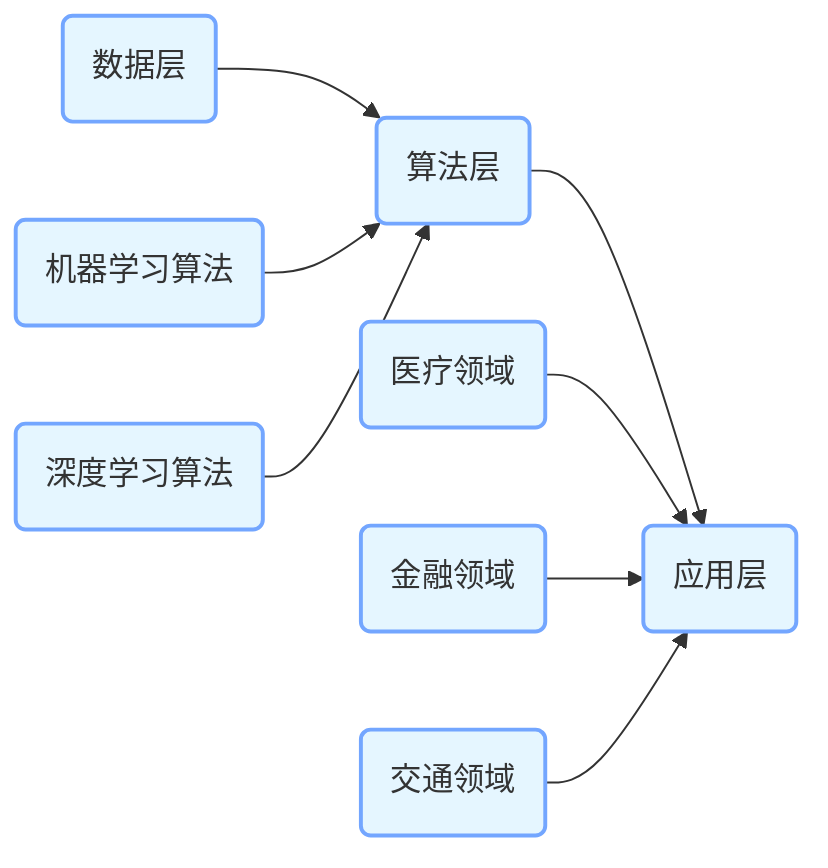

# 程序员如何在AI浪潮中找到新定位

> 关键词：程序员、AI浪潮、新定位、技能转型、职业发展

> 摘要：随着AI技术的迅猛发展，整个科技行业正经历着前所未有的变革。对于程序员而言，这既是挑战也是机遇。本文旨在深入探讨程序员在AI浪潮中如何找到新的定位。通过对AI背景的介绍，剖析核心概念与联系，阐述相关算法原理和数学模型，结合项目实战案例，分析实际应用场景，推荐学习工具和资源，最后总结未来发展趋势与挑战，为程序员在AI时代的职业发展提供全面而深入的指导，帮助他们在新的技术浪潮中实现自我提升和职业转型。

## 1. 背景介绍 
### 1.1 目的和范围
本文章的主要目的是为广大程序员在AI浪潮的大背景下，提供全面且具有实际指导意义的职业发展建议和方向。范围涵盖了从AI相关的基础概念、核心算法、数学模型，到项目实战应用，以及实际的应用场景分析，同时还包括学习资源、开发工具推荐等多个方面，旨在帮助程序员全面了解AI领域，并找到适合自己的新定位。

### 1.2 预期读者
本文预期读者主要为广大程序员群体，包括初级程序员、有一定经验的中级程序员以及寻求技术转型和突破的高级程序员。同时，对AI技术感兴趣，希望了解程序员在AI时代职业发展路径的相关人员也可以从中获取有价值的信息。

### 1.3 文档结构概述
本文将按照以下结构展开：首先介绍背景信息，包括目的、预期读者和文档结构概述以及相关术语表；接着深入讲解AI的核心概念与联系，通过文本示意图和Mermaid流程图进行直观展示；然后阐述核心算法原理并给出具体操作步骤，结合Python源代码详细说明；再介绍相关的数学模型和公式，并举例说明；通过项目实战案例，详细解释开发环境搭建、源代码实现和代码解读；分析实际应用场景；推荐相关的学习工具和资源；最后总结未来发展趋势与挑战，提供常见问题解答和扩展阅读参考资料。

### 1.4 术语表
#### 1.4.1 核心术语定义
- **AI（Artificial Intelligence）**：即人工智能，是研究、开发用于模拟、延伸和扩展人的智能的理论、方法、技术及应用系统的一门新的技术科学。
- **机器学习（Machine Learning）**：是一门多领域交叉学科，涉及概率论、统计学、逼近论、凸分析、算法复杂度理论等多门学科。它专门研究计算机怎样模拟或实现人类的学习行为，以获取新的知识或技能，重新组织已有的知识结构使之不断改善自身的性能。
- **深度学习（Deep Learning）**：是机器学习的一个分支领域，它是一种基于对数据进行表征学习的方法。深度学习通过构建具有很多层的神经网络模型，自动从大量数据中学习特征和模式。
- **神经网络（Neural Network）**：是一种模仿人类神经系统的计算模型，由大量的神经元组成，这些神经元通过相互连接形成复杂的网络结构，用于处理和分析数据。

#### 1.4.2 相关概念解释
- **数据挖掘（Data Mining）**：是指从大量的数据中通过算法搜索隐藏于其中信息的过程。数据挖掘通常与计算机科学有关，并通过统计、在线分析处理、情报检索、机器学习、专家系统（依靠过去的经验法则）和模式识别等诸多方法来实现上述目标。
- **自然语言处理（Natural Language Processing，NLP）**：是计算机科学领域与人工智能领域中的一个重要方向。它研究能实现人与计算机之间用自然语言进行有效通信的各种理论和方法。自然语言处理包括语法分析、语义分析、文本生成、机器翻译等多个方面。
- **计算机视觉（Computer Vision）**：是一门研究如何使机器“看”的科学，更进一步的说，就是指用摄影机和电脑代替人眼对目标进行识别、跟踪和测量等机器视觉，并进一步做图形处理，使电脑处理成为更适合人眼观察或传送给仪器检测的图像。

#### 1.4.3 缩略词列表
- **AI**：Artificial Intelligence（人工智能）
- **ML**：Machine Learning（机器学习）
- **DL**：Deep Learning（深度学习）
- **NLP**：Natural Language Processing（自然语言处理）
- **CV**：Computer Vision（计算机视觉）

## 2. 核心概念与联系 
### 核心概念原理
AI是一个广泛的领域，其核心概念包括机器学习、深度学习、神经网络等。机器学习是AI的重要实现方式，它通过对大量数据的学习和分析，让计算机自动发现数据中的规律和模式，从而实现预测和决策。深度学习则是机器学习的一个子集，它通过构建深层的神经网络模型，能够自动从原始数据中提取高级特征，在图像识别、语音识别等领域取得了巨大的成功。

神经网络是深度学习的基础，它由输入层、隐藏层和输出层组成。输入层接收原始数据，隐藏层对数据进行特征提取和转换，输出层给出最终的预测结果。神经网络通过不断调整神经元之间的连接权重，来优化模型的性能。

### 架构的文本示意图
AI的整体架构可以看作是一个分层的结构。最底层是数据层，提供各种类型的数据，包括图像、文本、音频等。中间层是算法层，包括机器学习算法、深度学习算法等。最上层是应用层，将AI技术应用于各个领域，如医疗、金融、交通等。

### Mermaid流程图


## 3. 核心算法原理 & 具体操作步骤 
### 核心算法原理
在AI领域，最常用的算法之一是神经网络算法。以简单的多层感知器（Multilayer Perceptron，MLP）为例，它是一种前馈神经网络，由输入层、一个或多个隐藏层和输出层组成。

MLP的工作原理是将输入数据从输入层传递到隐藏层，隐藏层中的神经元对输入数据进行加权求和，并通过激活函数进行非线性变换，然后将结果传递到下一层，直到输出层给出最终的预测结果。

### 具体操作步骤
1. **数据准备**：收集和整理相关的数据，并将其分为训练集、验证集和测试集。
2. **模型构建**：定义神经网络的结构，包括输入层、隐藏层和输出层的神经元数量，以及激活函数的选择。
3. **模型训练**：使用训练集对模型进行训练，通过优化算法（如随机梯度下降）不断调整模型的参数，使模型的预测结果与真实标签之间的误差最小化。
4. **模型评估**：使用验证集对训练好的模型进行评估，检查模型的性能指标（如准确率、召回率等）。
5. **模型优化**：根据评估结果，对模型进行调整和优化，如调整神经元数量、更换激活函数等。
6. **模型预测**：使用训练好的模型对测试集或新的数据进行预测。

### Python源代码详细阐述
```python
import numpy as np
from sklearn.neural_network import MLPClassifier
from sklearn.datasets import make_classification
from sklearn.model_selection import train_test_split

# 数据准备
X, y = make_classification(n_samples=1000, n_features=20, n_informative=10, n_classes=2, random_state=42)
X_train, X_test, y_train, y_test = train_test_split(X, y, test_size=0.2, random_state=42)

# 模型构建
model = MLPClassifier(hidden_layer_sizes=(100, 50), activation='relu', solver='adam', random_state=42)

# 模型训练
model.fit(X_train, y_train)

# 模型评估
accuracy = model.score(X_test, y_test)
print(f"模型准确率: {accuracy}")

# 模型预测
new_data = np.random.rand(1, 20)
prediction = model.predict(new_data)
print(f"预测结果: {prediction}")
```

## 4. 数学模型和公式 & 详细讲解 & 举例说明 
### 数学模型
神经网络的数学模型可以用以下公式表示：

设输入层有 $n$ 个神经元，隐藏层有 $m$ 个神经元，输出层有 $k$ 个神经元。输入向量为 $\mathbf{x} = [x_1, x_2, \cdots, x_n]^T$，隐藏层的加权输入为 $\mathbf{z}_h$，输出为 $\mathbf{a}_h$，输出层的加权输入为 $\mathbf{z}_o$，输出为 $\mathbf{a}_o$。

隐藏层的加权输入计算公式为：
$$\mathbf{z}_h = \mathbf{W}_h\mathbf{x} + \mathbf{b}_h$$
其中，$\mathbf{W}_h$ 是隐藏层的权重矩阵，$\mathbf{b}_h$ 是隐藏层的偏置向量。

隐藏层的输出计算公式为：
$$\mathbf{a}_h = f(\mathbf{z}_h)$$
其中，$f$ 是激活函数，常用的激活函数有Sigmoid函数、ReLU函数等。

输出层的加权输入计算公式为：
$$\mathbf{z}_o = \mathbf{W}_o\mathbf{a}_h + \mathbf{b}_o$$
其中，$\mathbf{W}_o$ 是输出层的权重矩阵，$\mathbf{b}_o$ 是输出层的偏置向量。

输出层的输出计算公式为：
$$\mathbf{a}_o = g(\mathbf{z}_o)$$
其中，$g$ 是输出层的激活函数，根据具体的任务选择不同的激活函数，如Softmax函数用于多分类任务。

### 详细讲解
- **权重矩阵**：权重矩阵 $\mathbf{W}$ 表示神经元之间的连接强度，它的元素 $w_{ij}$ 表示第 $i$ 个神经元到第 $j$ 个神经元的连接权重。权重矩阵的大小取决于连接的神经元数量。
- **偏置向量**：偏置向量 $\mathbf{b}$ 用于调整神经元的激活阈值，它的每个元素对应一个神经元的偏置值。
- **激活函数**：激活函数的作用是引入非线性因素，使神经网络能够学习到复杂的非线性关系。不同的激活函数具有不同的特点和适用场景。

### 举例说明
假设输入层有 2 个神经元，隐藏层有 3 个神经元，输出层有 1 个神经元。输入向量 $\mathbf{x} = [1, 2]^T$，隐藏层的权重矩阵 $\mathbf{W}_h = \begin{bmatrix}0.1 & 0.2\\ 0.3 & 0.4\\ 0.5 & 0.6\end{bmatrix}$，偏置向量 $\mathbf{b}_h = [0.1, 0.2, 0.3]^T$，激活函数为Sigmoid函数 $f(x) = \frac{1}{1 + e^{-x}}$。

首先计算隐藏层的加权输入：
$$\mathbf{z}_h = \mathbf{W}_h\mathbf{x} + \mathbf{b}_h = \begin{bmatrix}0.1 & 0.2\\ 0.3 & 0.4\\ 0.5 & 0.6\end{bmatrix}\begin{bmatrix}1\\ 2\end{bmatrix} + \begin{bmatrix}0.1\\ 0.2\\ 0.3\end{bmatrix} = \begin{bmatrix}0.1\times1 + 0.2\times2 + 0.1\\ 0.3\times1 + 0.4\times2 + 0.2\\ 0.5\times1 + 0.6\times2 + 0.3\end{bmatrix} = \begin{bmatrix}0.6\\ 1.3\\ 2\end{bmatrix}$$

然后计算隐藏层的输出：
$$\mathbf{a}_h = f(\mathbf{z}_h) = \begin{bmatrix}\frac{1}{1 + e^{-0.6}}\\ \frac{1}{1 + e^{-1.3}}\\ \frac{1}{1 + e^{-2}}\end{bmatrix} \approx \begin{bmatrix}0.6457\\ 0.7858\\ 0.8808\end{bmatrix}$$

假设输出层的权重矩阵 $\mathbf{W}_o = [0.1, 0.2, 0.3]$，偏置向量 $\mathbf{b}_o = [0.1]$，激活函数为线性函数 $g(x) = x$。

计算输出层的加权输入：
$$\mathbf{z}_o = \mathbf{W}_o\mathbf{a}_h + \mathbf{b}_o = [0.1, 0.2, 0.3]\begin{bmatrix}0.6457\\ 0.7858\\ 0.8808\end{bmatrix} + 0.1 = 0.1\times0.6457 + 0.2\times0.7858 + 0.3\times0.8808 + 0.1 \approx 0.609$$

输出层的输出为：
$$\mathbf{a}_o = g(\mathbf{z}_o) = 0.609$$

## 5. 项目实战：代码实际案例和详细解释说明 
### 5.1  开发环境搭建
- **安装Python**：建议安装Python 3.7及以上版本，可以从Python官方网站（https://www.python.org/downloads/）下载安装包进行安装。
- **安装开发工具**：推荐使用PyCharm或VS Code作为开发工具，它们提供了丰富的插件和功能，方便代码的编写和调试。
- **安装必要的库**：在命令行中使用以下命令安装必要的库：
```bash
pip install numpy pandas scikit-learn tensorflow keras matplotlib
```

### 5.2  源代码详细实现和代码解读
以下是一个基于TensorFlow和Keras实现的手写数字识别项目的源代码：

```python
import tensorflow as tf
from tensorflow import keras
import matplotlib.pyplot as plt

# 数据加载
mnist = keras.datasets.mnist
(train_images, train_labels), (test_images, test_labels) = mnist.load_data()

# 数据预处理
train_images = train_images / 255.0
test_images = test_images / 255.0

# 模型构建
model = keras.Sequential([
    keras.layers.Flatten(input_shape=(28, 28)),
    keras.layers.Dense(128, activation='relu'),
    keras.layers.Dense(10, activation='softmax')
])

# 模型编译
model.compile(optimizer='adam',
              loss='sparse_categorical_crossentropy',
              metrics=['accuracy'])

# 模型训练
model.fit(train_images, train_labels, epochs=10)

# 模型评估
test_loss, test_acc = model.evaluate(test_images, test_labels)
print(f"测试集准确率: {test_acc}")

# 模型预测
predictions = model.predict(test_images)

# 可视化预测结果
def plot_image(i, predictions_array, true_label, img):
    predictions_array, true_label, img = predictions_array, true_label[i], img[i]
    plt.grid(False)
    plt.xticks([])
    plt.yticks([])

    plt.imshow(img, cmap=plt.cm.binary)

    predicted_label = np.argmax(predictions_array)
    if predicted_label == true_label:
        color = 'blue'
    else:
        color = 'red'

    plt.xlabel(f"{predicted_label} {100*np.max(predictions_array):2.0f}% ({true_label})",
               color=color)

def plot_value_array(i, predictions_array, true_label):
    predictions_array, true_label = predictions_array, true_label[i]
    plt.grid(False)
    plt.xticks(range(10))
    plt.yticks([])
    thisplot = plt.bar(range(10), predictions_array, color="#777777")
    plt.ylim([0, 1])
    predicted_label = np.argmax(predictions_array)

    thisplot[predicted_label].set_color('red')
    thisplot[true_label].set_color('blue')

num_rows = 5
num_cols = 3
num_images = num_rows*num_cols
plt.figure(figsize=(2*2*num_cols, 2*num_rows))
for i in range(num_images):
    plt.subplot(num_rows, 2*num_cols, 2*i+1)
    plot_image(i, predictions[i], test_labels, test_images)
    plt.subplot(num_rows, 2*num_cols, 2*i+2)
    plot_value_array(i, predictions[i], test_labels)
plt.tight_layout()
plt.show()
```

### 5.3  代码解读与分析
1. **数据加载**：使用`keras.datasets.mnist.load_data()`函数加载MNIST手写数字数据集，将数据集分为训练集和测试集。
2. **数据预处理**：将图像数据的像素值归一化到0到1之间，有助于提高模型的训练效果。
3. **模型构建**：使用`keras.Sequential()`构建一个顺序模型，包含一个扁平化层、一个全连接层和一个输出层。扁平化层将二维的图像数据转换为一维向量，全连接层使用ReLU激活函数进行特征提取，输出层使用Softmax激活函数输出每个类别的概率。
4. **模型编译**：使用`model.compile()`函数编译模型，指定优化器、损失函数和评估指标。
5. **模型训练**：使用`model.fit()`函数对模型进行训练，指定训练数据、训练轮数等参数。
6. **模型评估**：使用`model.evaluate()`函数对模型在测试集上的性能进行评估，输出测试集的损失和准确率。
7. **模型预测**：使用`model.predict()`函数对测试集进行预测，得到每个样本的预测结果。
8. **可视化预测结果**：定义`plot_image()`和`plot_value_array()`函数，将预测结果可视化，方便观察模型的预测效果。

## 6. 实际应用场景 
### 医疗领域
- **疾病诊断**：AI技术可以通过分析医学影像（如X光、CT、MRI等）和临床数据，辅助医生进行疾病的早期诊断和预测。例如，利用深度学习算法对肺部CT图像进行分析，检测肺癌的早期病变。
- **药物研发**：AI可以加速药物研发的过程，通过对大量的生物数据和化学数据进行分析，预测药物的疗效和副作用，筛选出潜在的药物靶点。

### 金融领域
- **风险评估**：银行和金融机构可以利用AI技术对客户的信用风险进行评估，通过分析客户的信用记录、财务状况等多源数据，预测客户的违约概率。
- **投资决策**：AI可以分析市场数据和新闻资讯，为投资者提供投资建议和决策支持，帮助投资者优化投资组合。

### 交通领域
- **自动驾驶**：AI是自动驾驶技术的核心，通过传感器收集车辆周围的环境信息，利用机器学习和计算机视觉算法对这些信息进行处理和分析，实现车辆的自主导航和决策。
- **智能交通管理**：AI可以对交通流量进行实时监测和预测，优化交通信号灯的控制策略，提高交通效率，减少拥堵。

### 教育领域
- **个性化学习**：AI可以根据学生的学习情况和特点，为学生提供个性化的学习方案和学习资源，实现因材施教。
- **智能辅导**：利用自然语言处理技术，开发智能辅导系统，为学生提供实时的答疑和辅导。

## 7. 工具和资源推荐
### 7.1 学习资源推荐
#### 7.1.1 书籍推荐
- 《Python机器学习》：本书详细介绍了Python在机器学习领域的应用，包括机器学习的基本概念、算法原理和实际应用案例，适合初学者入门。
- 《深度学习》：由深度学习领域的三位先驱Ian Goodfellow、Yoshua Bengio和Aaron Courville撰写，是深度学习领域的经典教材，全面介绍了深度学习的理论和实践。
- 《人工智能：一种现代的方法》：本书是人工智能领域的权威著作，涵盖了人工智能的各个方面，包括搜索算法、知识表示、机器学习、自然语言处理等。

#### 7.1.2 在线课程
- Coursera上的《机器学习》课程：由斯坦福大学的Andrew Ng教授授课，是机器学习领域的经典课程，系统地介绍了机器学习的基本概念、算法和应用。
- edX上的《深度学习》课程：由微软和华盛顿大学联合推出，深入介绍了深度学习的原理和实践，包括神经网络、卷积神经网络、循环神经网络等。
- 中国大学MOOC上的《人工智能基础》课程：由国内多所高校的知名教授授课，适合国内学生学习人工智能的基础知识。

#### 7.1.3 技术博客和网站
- Medium：是一个技术博客平台，上面有很多关于AI、机器学习、深度学习等领域的优质文章，作者来自世界各地的技术专家和学者。
- Towards Data Science：专注于数据科学和机器学习领域的博客，提供了很多实用的技术教程和案例分析。
- AI开源社区：如GitHub上的相关仓库，提供了大量的开源代码和项目案例，方便开发者学习和参考。

### 7.2 开发工具框架推荐
#### 7.2.1 IDE和编辑器
- PyCharm：是一款专门为Python开发设计的集成开发环境，提供了丰富的代码编辑、调试、代码分析等功能，适合专业的Python开发者。
- VS Code：是一款轻量级的代码编辑器，支持多种编程语言，通过安装相关的插件可以实现Python开发的各种功能，具有良好的扩展性。

#### 7.2.2 调试和性能分析工具
- TensorBoard：是TensorFlow提供的可视化工具，可以帮助开发者监控模型的训练过程，分析模型的性能指标，如损失函数、准确率等。
- PyTorch Profiler：是PyTorch提供的性能分析工具，可以帮助开发者分析模型的性能瓶颈，优化模型的训练和推理速度。

#### 7.2.3 相关框架和库
- TensorFlow：是Google开发的开源深度学习框架，提供了丰富的API和工具，支持各种深度学习模型的开发和训练。
- PyTorch：是Facebook开发的开源深度学习框架，具有动态图的特点，适合快速迭代和实验，在学术界和工业界都有广泛的应用。
- Scikit-learn：是一个简单易用的机器学习库，提供了各种机器学习算法和工具，适合初学者快速上手和实现简单的机器学习任务。

### 7.3 相关论文著作推荐
#### 7.3.1 经典论文
- 《Gradient-based learning applied to document recognition》：由Yann LeCun等人发表，介绍了卷积神经网络（CNN）在手写数字识别中的应用，是CNN领域的经典论文。
- 《ImageNet Classification with Deep Convolutional Neural Networks》：由Alex Krizhevsky等人发表，提出了AlexNet模型，在ImageNet图像分类竞赛中取得了巨大的成功，开创了深度学习在计算机视觉领域的新纪元。
- 《Attention Is All You Need》：由Vaswani等人发表，提出了Transformer模型，在自然语言处理领域取得了广泛的应用和巨大的成功。

#### 7.3.2 最新研究成果
- 关注顶级学术会议（如NeurIPS、ICML、CVPR、ACL等）上的最新论文，了解AI领域的最新研究动态和技术趋势。
- 关注知名研究机构（如OpenAI、DeepMind等）的官方网站，获取他们的最新研究成果和技术报告。

#### 7.3.3 应用案例分析
- 《AI in Healthcare: Transforming Medicine Through Artificial Intelligence》：详细介绍了AI在医疗领域的应用案例和实践经验，包括疾病诊断、药物研发、医疗影像分析等方面。
- 《AI in Finance: The Future of Investment Banking and Asset Management》：分析了AI在金融领域的应用现状和发展趋势，包括风险评估、投资决策、交易策略等方面。

## 8. 总结：未来发展趋势与挑战
### 未来发展趋势
- **融合发展**：AI将与其他技术（如物联网、大数据、云计算等）深度融合，形成更加智能、高效的系统和解决方案。例如，物联网设备收集的大量数据可以为AI模型提供丰富的训练素材，而AI技术可以对这些数据进行分析和处理，实现对物联网设备的智能控制。
- **应用拓展**：AI的应用领域将不断拓展，从目前的医疗、金融、交通等领域向更多的传统行业渗透，如农业、制造业、教育等，推动各行业的数字化转型和智能化升级。
- **伦理和法律规范**：随着AI技术的广泛应用，伦理和法律问题将越来越受到关注。未来需要建立健全相关的伦理和法律规范，确保AI技术的安全、可靠和公平使用。

### 挑战
- **数据隐私和安全**：AI的发展依赖于大量的数据，而数据的隐私和安全问题是一个重要的挑战。如何保护用户的数据隐私，防止数据泄露和滥用，是需要解决的关键问题。
- **算法偏见**：AI算法可能存在偏见，导致不公平的决策和结果。例如，在招聘、贷款审批等领域，AI算法可能会对某些群体产生歧视。如何消除算法偏见，确保AI的公平性和公正性，是一个亟待解决的问题。
- **人才短缺**：AI领域的快速发展导致对相关人才的需求急剧增加，而目前AI人才的供给相对不足。如何培养更多的AI专业人才，提高程序员的AI技能水平，是推动AI技术发展的关键。

## 9. 附录：常见问题与解答
### 问题1：程序员学习AI需要具备哪些基础知识？
答：程序员学习AI需要具备一定的数学基础，包括线性代数、概率论、统计学等，这些知识是理解AI算法原理的基础。同时，还需要掌握一门编程语言，如Python，以及相关的机器学习和深度学习框架，如TensorFlow、PyTorch等。

### 问题2：如何选择适合自己的AI学习路径？
答：首先要明确自己的学习目标和兴趣方向，是想从事自然语言处理、计算机视觉还是其他领域。然后根据自己的基础和时间安排，选择合适的学习资源，如书籍、在线课程等。可以从基础的机器学习知识学起，逐步深入到深度学习等高级领域。

### 问题3：AI技术在实际应用中会遇到哪些问题？
答：AI技术在实际应用中可能会遇到数据质量问题、模型过拟合或欠拟合问题、计算资源不足问题等。此外，还可能会面临伦理和法律问题，如数据隐私、算法偏见等。

### 问题4：如何提高AI模型的性能？
答：可以从以下几个方面提高AI模型的性能：优化数据预处理过程，提高数据质量；选择合适的模型结构和算法；调整模型的超参数；增加训练数据的数量和多样性等。

## 10. 扩展阅读 & 参考资料
- 《AI未来简史》，李开复著
- 《智能时代》，吴军著
- 百度AI开放平台：https://ai.baidu.com/
- 阿里云AI平台：https://ai.aliyun.com/
- 《Neural Networks and Deep Learning》，Michael Nielsen著
- 《Pattern Recognition and Machine Learning》，Christopher Bishop著