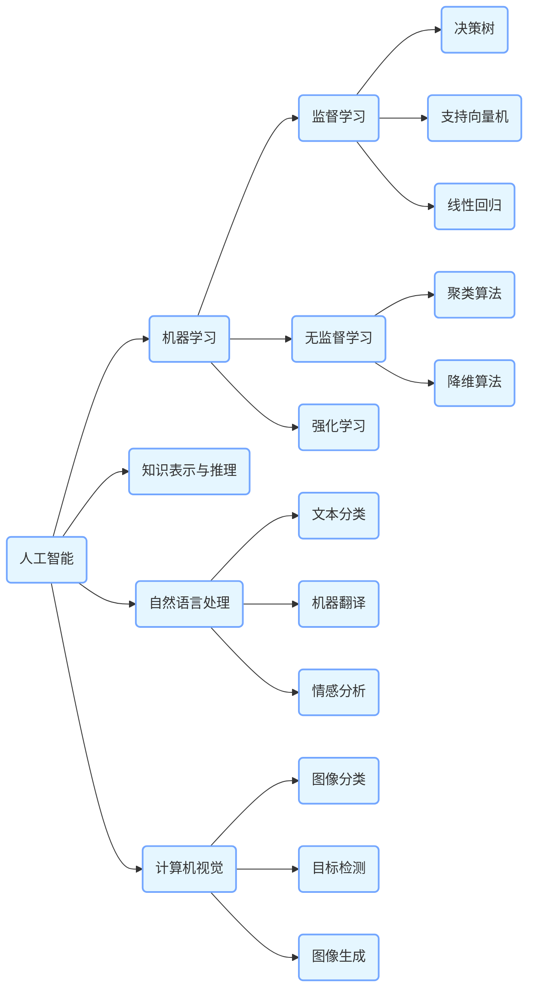

# 程序员如何在AI浪潮中生存与发展

> 关键词：程序员、AI浪潮、生存、发展、人工智能技术、职业转型、技能提升

> 摘要：随着人工智能（AI）技术的迅猛发展，整个科技行业正经历着深刻的变革，这对程序员群体产生了深远的影响。本文旨在探讨程序员在AI浪潮中如何实现生存与发展。首先介绍了文章的背景，包括目的、预期读者、文档结构和相关术语。接着阐述了AI与编程的核心概念及联系，详细讲解了AI相关的核心算法原理和具体操作步骤，包括使用Python代码示例。还介绍了相关的数学模型和公式，并通过实际案例进行说明。然后通过项目实战，从开发环境搭建到源代码实现和解读，展示了AI在实际编程中的应用。之后分析了AI在不同场景的实际应用，推荐了学习、开发工具和相关论文著作等资源。最后总结了未来发展趋势与挑战，提供常见问题解答和扩展阅读参考资料，帮助程序员更好地适应AI浪潮，提升自身竞争力，实现职业的可持续发展。

## 1. 背景介绍 
### 1.1 目的和范围
在当今时代，AI技术已经渗透到各个领域，从医疗、金融到交通、娱乐等。AI的发展给程序员带来了新的机遇，同时也带来了前所未有的挑战。本文的目的在于为广大程序员提供全面且实用的指导，帮助他们在AI浪潮中找到生存和发展的路径。范围涵盖了AI的核心概念、算法原理、实际应用案例，以及程序员在学习、工作中可能遇到的问题和应对策略。

### 1.2 预期读者
本文主要面向广大程序员群体，包括初级程序员、有一定经验的中级程序员以及寻求职业突破的高级程序员。同时，对于对AI技术感兴趣，希望了解如何在编程领域融入AI元素的技术爱好者也具有一定的参考价值。

### 1.3 文档结构概述
本文将按照以下结构进行阐述：首先介绍相关背景知识，包括目的、读者和文档结构等；接着讲解AI与编程的核心概念及联系，让读者对AI有更深入的理解；然后详细介绍AI的核心算法原理和具体操作步骤，结合Python代码进行说明；之后介绍相关的数学模型和公式，并举例说明；通过项目实战展示AI在编程中的应用；分析AI的实际应用场景；推荐学习、开发工具和相关论文著作等资源；总结未来发展趋势与挑战；提供常见问题解答和扩展阅读参考资料。

### 1.4 术语表
#### 1.4.1 核心术语定义
- **人工智能（AI）**：是指计算机系统能够执行通常需要人类智能才能完成的任务，如学习、推理、解决问题等。
- **机器学习（ML）**：是AI的一个子集，专注于让计算机通过数据学习模式和规律，而无需明确的编程指令。
- **深度学习（DL）**：是机器学习的一个分支，基于人工神经网络，特别是深度神经网络，能够处理复杂的模式识别和预测任务。
- **神经网络**：是一种模仿人类神经系统的计算模型，由大量的神经元组成，用于处理和分析数据。
- **自然语言处理（NLP）**：是AI的一个领域，专注于让计算机理解、处理和生成人类语言。

#### 1.4.2 相关概念解释
- **监督学习**：是机器学习的一种方法，其中训练数据包含输入和对应的输出标签，模型通过学习输入和输出之间的关系进行预测。
- **无监督学习**：训练数据中没有输出标签，模型通过发现数据中的模式和结构进行学习。
- **强化学习**：智能体通过与环境进行交互，根据环境的反馈（奖励或惩罚）来学习最优的行为策略。

#### 1.4.3 缩略词列表
- **AI**：Artificial Intelligence（人工智能）
- **ML**：Machine Learning（机器学习）
- **DL**：Deep Learning（深度学习）
- **NLP**：Natural Language Processing（自然语言处理）
- **CNN**：Convolutional Neural Network（卷积神经网络）
- **RNN**：Recurrent Neural Network（循环神经网络）

## 2. 核心概念与联系 

### 核心概念原理
#### 人工智能
人工智能的核心目标是使计算机能够模拟人类的智能行为。它涉及多个领域，包括机器学习、知识表示、推理和自然语言处理等。通过让计算机学习数据中的模式和规律，人工智能系统可以进行预测、分类和决策等任务。

#### 机器学习
机器学习是人工智能的重要实现手段。它基于数据驱动的方法，通过对大量数据的学习来构建模型。常见的机器学习算法包括决策树、支持向量机、朴素贝叶斯等。机器学习模型的训练过程通常包括数据预处理、特征提取、模型选择和训练、模型评估等步骤。

#### 深度学习
深度学习是机器学习的一个分支，它基于深度神经网络。深度神经网络由多个层次的神经元组成，能够自动学习数据中的复杂特征。深度学习在图像识别、语音识别和自然语言处理等领域取得了巨大的成功。例如，卷积神经网络（CNN）在图像分类任务中表现出色，循环神经网络（RNN）在处理序列数据，如文本和语音方面具有优势。

### 架构的文本示意图
```plaintext
人工智能
|-- 机器学习
|   |-- 监督学习
|   |   |-- 决策树
|   |   |-- 支持向量机
|   |   |-- 线性回归
|   |-- 无监督学习
|   |   |-- 聚类算法
|   |   |-- 降维算法
|   |-- 强化学习
|-- 知识表示与推理
|-- 自然语言处理
|   |-- 文本分类
|   |-- 机器翻译
|   |-- 情感分析
|-- 计算机视觉
|   |-- 图像分类
|   |-- 目标检测
|   |-- 图像生成
```

### Mermaid流程图


## 3. 核心算法原理 & 具体操作步骤 

### 线性回归算法原理
线性回归是一种简单而常用的监督学习算法，用于预测连续数值。其基本思想是通过找到一条直线（在二维空间中）或超平面（在多维空间中）来拟合数据点，使得数据点到该直线或超平面的距离之和最小。

线性回归的数学模型可以表示为：
$$y = \theta_0 + \theta_1x_1 + \theta_2x_2 + \cdots + \theta_nx_n + \epsilon$$
其中，$y$ 是目标变量，$x_1, x_2, \cdots, x_n$ 是特征变量，$\theta_0, \theta_1, \cdots, \theta_n$ 是模型的参数，$\epsilon$ 是误差项。

### Python代码实现线性回归
```python
import numpy as np
from sklearn.linear_model import LinearRegression
from sklearn.model_selection import train_test_split
from sklearn.metrics import mean_squared_error

# 生成一些示例数据
np.random.seed(0)
X = 2 * np.random.rand(100, 1)
y = 4 + 3 * X + np.random.randn(100, 1)

# 划分训练集和测试集
X_train, X_test, y_train, y_test = train_test_split(X, y, test_size=0.2, random_state=42)

# 创建线性回归模型
model = LinearRegression()

# 训练模型
model.fit(X_train, y_train)

# 进行预测
y_pred = model.predict(X_test)

# 计算均方误差
mse = mean_squared_error(y_test, y_pred)
print(f"均方误差: {mse}")

# 打印模型参数
print(f"截距: {model.intercept_}")
print(f"系数: {model.coef_}")
```

### 代码解释
1. **数据生成**：使用 `numpy` 生成一些随机数据作为示例。
2. **数据划分**：使用 `train_test_split` 函数将数据划分为训练集和测试集。
3. **模型创建**：创建一个 `LinearRegression` 模型对象。
4. **模型训练**：使用 `fit` 方法对模型进行训练。
5. **预测**：使用训练好的模型对测试集进行预测。
6. **评估**：使用 `mean_squared_error` 函数计算预测结果的均方误差。
7. **参数打印**：打印模型的截距和系数。

### 决策树算法原理
决策树是一种基于树结构进行决策的监督学习算法。它通过对特征空间进行划分，构建一个树状结构，每个内部节点表示一个特征上的测试，每个分支表示一个测试输出，每个叶节点表示一个类别或值。

决策树的构建过程通常基于信息增益、基尼不纯度等准则来选择最优的划分特征和划分点。

### Python代码实现决策树分类
```python
from sklearn.datasets import load_iris
from sklearn.tree import DecisionTreeClassifier
from sklearn.model_selection import train_test_split
from sklearn.metrics import accuracy_score

# 加载鸢尾花数据集
iris = load_iris()
X = iris.data
y = iris.target

# 划分训练集和测试集
X_train, X_test, y_train, y_test = train_test_split(X, y, test_size=0.2, random_state=42)

# 创建决策树分类器
model = DecisionTreeClassifier()

# 训练模型
model.fit(X_train, y_train)

# 进行预测
y_pred = model.predict(X_test)

# 计算准确率
accuracy = accuracy_score(y_test, y_pred)
print(f"准确率: {accuracy}")
```

### 代码解释
1. **数据加载**：使用 `load_iris` 函数加载鸢尾花数据集。
2. **数据划分**：使用 `train_test_split` 函数将数据划分为训练集和测试集。
3. **模型创建**：创建一个 `DecisionTreeClassifier` 模型对象。
4. **模型训练**：使用 `fit` 方法对模型进行训练。
5. **预测**：使用训练好的模型对测试集进行预测。
6. **评估**：使用 `accuracy_score` 函数计算预测结果的准确率。

## 4. 数学模型和公式 & 详细讲解 & 举例说明 

### 线性回归的数学模型和公式
线性回归的目标是找到最优的参数 $\theta = [\theta_0, \theta_1, \cdots, \theta_n]^T$ 使得预测值 $\hat{y}$ 与真实值 $y$ 之间的误差最小。常用的误差度量是均方误差（MSE）：
$$MSE = \frac{1}{m} \sum_{i=1}^{m} (y^{(i)} - \hat{y}^{(i)})^2$$
其中，$m$ 是样本数量，$y^{(i)}$ 是第 $i$ 个样本的真实值，$\hat{y}^{(i)}$ 是第 $i$ 个样本的预测值。

为了最小化均方误差，我们可以使用最小二乘法。对于简单线性回归（只有一个特征），参数 $\theta_0$ 和 $\theta_1$ 的最优解可以通过以下公式计算：
$$\theta_1 = \frac{\sum_{i=1}^{m} (x^{(i)} - \bar{x})(y^{(i)} - \bar{y})}{\sum_{i=1}^{m} (x^{(i)} - \bar{x})^2}$$
$$\theta_0 = \bar{y} - \theta_1\bar{x}$$
其中，$\bar{x}$ 和 $\bar{y}$ 分别是特征 $x$ 和目标变量 $y$ 的均值。

### 举例说明
假设有以下数据集：
| $x$ | $y$ |
| --- | --- |
| 1 | 3 |
| 2 | 5 |
| 3 | 7 |
| 4 | 9 |

首先计算均值：
$\bar{x} = \frac{1 + 2 + 3 + 4}{4} = 2.5$
$\bar{y} = \frac{3 + 5 + 7 + 9}{4} = 6$

然后计算 $\theta_1$：
$\sum_{i=1}^{4} (x^{(i)} - \bar{x})(y^{(i)} - \bar{y}) = (1 - 2.5)(3 - 6) + (2 - 2.5)(5 - 6) + (3 - 2.5)(7 - 6) + (4 - 2.5)(9 - 6) = 10$
$\sum_{i=1}^{4} (x^{(i)} - \bar{x})^2 = (1 - 2.5)^2 + (2 - 2.5)^2 + (3 - 2.5)^2 + (4 - 2.5)^2 = 5$
$\theta_1 = \frac{10}{5} = 2$

最后计算 $\theta_0$：
$\theta_0 = 6 - 2 \times 2.5 = 1$

所以，线性回归模型为 $y = 1 + 2x$。

### 逻辑回归的数学模型和公式
逻辑回归是一种用于分类问题的广义线性模型。它通过逻辑函数（也称为 sigmoid 函数）将线性回归的输出映射到 $[0, 1]$ 之间的概率值。

逻辑函数的定义为：
$$\sigma(z) = \frac{1}{1 + e^{-z}}$$
其中，$z = \theta_0 + \theta_1x_1 + \theta_2x_2 + \cdots + \theta_nx_n$ 是线性组合。

逻辑回归的预测概率可以表示为：
$$P(y = 1|x; \theta) = \sigma(z) = \frac{1}{1 + e^{-(\theta_0 + \theta_1x_1 + \theta_2x_2 + \cdots + \theta_nx_n)}}$$
$$P(y = 0|x; \theta) = 1 - P(y = 1|x; \theta)$$

逻辑回归的损失函数通常使用对数损失函数（也称为交叉熵损失函数）：
$$J(\theta) = -\frac{1}{m} \sum_{i=1}^{m} [y^{(i)} \log(P(y^{(i)} = 1|x^{(i)}; \theta)) + (1 - y^{(i)}) \log(1 - P(y^{(i)} = 1|x^{(i)}; \theta))]$$

### 举例说明
假设有一个二分类问题，特征 $x$ 只有一个，数据集如下：
| $x$ | $y$ |
| --- | --- |
| 1 | 0 |
| 2 | 0 |
| 3 | 1 |
| 4 | 1 |

我们可以使用逻辑回归模型来预测 $y$ 的值。首先，初始化参数 $\theta_0$ 和 $\theta_1$，然后使用梯度下降等优化算法来最小化损失函数 $J(\theta)$。经过训练后，得到最优的参数 $\theta_0$ 和 $\theta_1$，就可以计算出预测概率。

## 5. 项目实战：代码实际案例和详细解释说明 

### 5.1  开发环境搭建
#### 安装Python
首先，确保你已经安装了Python。可以从Python官方网站（https://www.python.org/downloads/） 下载适合你操作系统的Python版本。建议安装Python 3.6及以上版本。

#### 安装必要的库
使用 `pip` 包管理器安装一些常用的机器学习和数据处理库，如 `numpy`、`pandas`、`scikit-learn`、`matplotlib` 等。
```sh
pip install numpy pandas scikit-learn matplotlib
```

#### 选择开发工具
可以选择使用集成开发环境（IDE），如 PyCharm、Jupyter Notebook 等。PyCharm 提供了强大的代码编辑和调试功能，Jupyter Notebook 则适合进行交互式的数据探索和模型训练。

### 5.2  源代码详细实现和代码解读
#### 项目背景
我们将实现一个简单的手写数字识别项目，使用的数据集是 MNIST 数据集。MNIST 数据集包含 60000 个训练样本和 10000 个测试样本，每个样本是一个 28x28 像素的手写数字图像。

#### 代码实现
```python
import numpy as np
from sklearn.datasets import fetch_openml
from sklearn.model_selection import train_test_split
from sklearn.linear_model import LogisticRegression
from sklearn.metrics import accuracy_score
import matplotlib.pyplot as plt

# 加载 MNIST 数据集
mnist = fetch_openml('mnist_784', version=1)
X = mnist.data
y = mnist.target

# 数据预处理
X = X / 255.0  # 归一化处理

# 划分训练集和测试集
X_train, X_test, y_train, y_test = train_test_split(X, y, test_size=0.2, random_state=42)

# 创建逻辑回归模型
model = LogisticRegression(max_iter=1000)

# 训练模型
model.fit(X_train, y_train)

# 进行预测
y_pred = model.predict(X_test)

# 计算准确率
accuracy = accuracy_score(y_test, y_pred)
print(f"准确率: {accuracy}")

# 可视化一些预测结果
fig, axes = plt.subplots(2, 5, figsize=(10, 4))
axes = axes.flatten()
for i in range(10):
    axes[i].imshow(X_test.iloc[i].values.reshape(28, 28), cmap='gray')
    axes[i].set_title(f"预测: {y_pred[i]}")
    axes[i].axis('off')
plt.show()
```

#### 代码解读
1. **数据加载**：使用 `fetch_openml` 函数从 OpenML 平台加载 MNIST 数据集。
2. **数据预处理**：将图像数据进行归一化处理，将像素值从 0-255 缩放到 0-1 之间。
3. **数据划分**：使用 `train_test_split` 函数将数据集划分为训练集和测试集。
4. **模型创建**：创建一个 `LogisticRegression` 模型对象，设置最大迭代次数为 1000。
5. **模型训练**：使用 `fit` 方法对模型进行训练。
6. **预测**：使用训练好的模型对测试集进行预测。
7. **评估**：使用 `accuracy_score` 函数计算预测结果的准确率。
8. **可视化**：使用 `matplotlib` 库可视化一些预测结果。

### 5.3  代码解读与分析
#### 模型选择
在这个项目中，我们选择了逻辑回归模型。逻辑回归是一种简单而有效的分类模型，对于手写数字识别问题可以取得较好的效果。

#### 数据预处理
归一化处理是数据预处理中常用的方法，可以加快模型的训练速度，提高模型的稳定性。

#### 模型评估
准确率是分类问题中常用的评估指标，它表示预测正确的样本数占总样本数的比例。在实际应用中，还可以使用其他评估指标，如精确率、召回率、F1 值等。

#### 模型优化
如果模型的准确率不够高，可以尝试使用其他模型，如神经网络、支持向量机等，或者对数据进行更复杂的预处理，如特征工程等。

## 6. 实际应用场景 
### 医疗领域
AI在医疗领域有广泛的应用，如疾病诊断、医学影像分析、药物研发等。程序员可以开发基于AI的医疗诊断系统，通过对患者的症状、病历和医学影像等数据进行分析，辅助医生进行疾病诊断。例如，使用深度学习算法对X光、CT等医学影像进行分析，检测疾病的早期迹象。

### 金融领域
在金融领域，AI可以用于风险评估、信用评分、股票预测等。程序员可以开发智能投资系统，通过对市场数据、公司财务数据等进行分析，为投资者提供投资建议。还可以开发风险评估模型，对客户的信用风险进行评估，帮助金融机构做出决策。

### 交通领域
AI在交通领域的应用包括自动驾驶、智能交通系统等。程序员可以参与自动驾驶汽车的开发，编写控制算法，使汽车能够感知环境、做出决策和控制行驶。还可以开发智能交通系统，通过对交通流量、路况等数据进行分析，优化交通信号控制，提高交通效率。

### 教育领域
AI在教育领域的应用包括智能辅导系统、个性化学习等。程序员可以开发智能辅导系统，根据学生的学习情况和能力提供个性化的学习建议和辅导。还可以开发学习分析系统，对学生的学习行为和成绩进行分析，帮助教师了解学生的学习状况，调整教学策略。

### 娱乐领域
AI在娱乐领域的应用包括游戏开发、影视制作等。程序员可以开发基于AI的游戏，使游戏中的角色具有智能行为，能够与玩家进行互动。还可以使用AI技术进行影视特效制作，如虚拟角色的创建和动画生成等。

## 7. 工具和资源推荐
### 7.1 学习资源推荐
#### 7.1.1 书籍推荐
- 《Python机器学习》：这本书详细介绍了Python在机器学习中的应用，包括各种机器学习算法的原理和实现。
- 《深度学习》：由深度学习领域的三位权威专家编写，全面介绍了深度学习的理论和实践。
- 《人工智能：一种现代的方法》：是人工智能领域的经典教材，涵盖了人工智能的各个方面。

#### 7.1.2 在线课程
- Coursera 上的《机器学习》课程：由斯坦福大学的 Andrew Ng 教授授课，是学习机器学习的经典课程。
- edX 上的《深度学习》课程：由百度的吴恩达教授授课，深入介绍了深度学习的原理和应用。
- Kaggle 上的《机器学习微课程》：提供了一系列简短而实用的机器学习教程，适合初学者。

#### 7.1.3 技术博客和网站
- Medium：上面有很多关于AI和机器学习的技术文章，作者来自世界各地的技术专家。
- Towards Data Science：专注于数据科学和机器学习领域的技术博客，提供了很多实用的教程和案例。
- arXiv：是一个预印本平台，上面有很多最新的AI和机器学习研究论文。

### 7.2 开发工具框架推荐
#### 7.2.1 IDE和编辑器
- PyCharm：是一款专门为Python开发设计的集成开发环境，提供了强大的代码编辑、调试和项目管理功能。
- Jupyter Notebook：是一个交互式的开发环境，适合进行数据探索、模型训练和结果展示。
- Visual Studio Code：是一款轻量级的代码编辑器，支持多种编程语言和插件扩展。

#### 7.2.2 调试和性能分析工具
- TensorBoard：是 TensorFlow 提供的可视化工具，可以帮助用户监控模型的训练过程、查看模型的结构和性能指标。
- Py-Spy：是一个用于分析Python代码性能的工具，可以帮助用户找出代码中的性能瓶颈。
- cProfile：是 Python 标准库中的性能分析工具，可以帮助用户分析代码的运行时间和函数调用次数。

#### 7.2.3 相关框架和库
- TensorFlow：是一个开源的机器学习框架，由 Google 开发，广泛应用于深度学习领域。
- PyTorch：是一个开源的深度学习框架，由 Facebook 开发，具有动态图的特点，适合快速迭代和研究。
- Scikit-learn：是一个简单而高效的机器学习库，提供了各种机器学习算法和工具，适合初学者和快速开发。

### 7.3 相关论文著作推荐
#### 7.3.1 经典论文
- 《Gradient-Based Learning Applied to Document Recognition》：由 Yann LeCun 等人发表，介绍了卷积神经网络（CNN）在手写数字识别中的应用，是深度学习领域的经典论文。
- 《ImageNet Classification with Deep Convolutional Neural Networks》：由 Alex Krizhevsky 等人发表，介绍了 AlexNet 网络，在 ImageNet 图像分类竞赛中取得了巨大成功，推动了深度学习在计算机视觉领域的发展。
- 《Attention Is All You Need》：由 Google 团队发表，介绍了 Transformer 模型，在自然语言处理领域取得了重要突破。

#### 7.3.2 最新研究成果
- 关注顶级学术会议，如 NeurIPS、ICML、CVPR、ACL 等，这些会议上会发表很多最新的AI和机器学习研究成果。
- 关注知名学术期刊，如 Journal of Artificial Intelligence Research (JAIR)、Artificial Intelligence、Machine Learning 等，这些期刊上会发表高质量的研究论文。

#### 7.3.3 应用案例分析
- Kaggle 上有很多实际的数据分析和机器学习竞赛，通过参与这些竞赛可以学习到很多实际应用案例和解决问题的方法。
- GitHub 上有很多开源的AI项目，通过阅读这些项目的代码和文档可以了解到不同领域的AI应用案例。

## 8. 总结：未来发展趋势与挑战
### 未来发展趋势
#### 自动化编程
随着AI技术的发展，自动化编程工具将越来越强大。AI可以根据需求自动生成代码，提高编程效率。例如，一些智能代码补全工具已经可以根据上下文自动推荐代码片段。

#### 跨领域融合
AI将与其他领域进行更深入的融合，如生物、能源、环境等。程序员需要具备跨领域的知识和技能，才能开发出更有价值的应用。

#### 强化学习的应用拓展
强化学习在游戏、机器人控制等领域已经取得了很大的成功，未来将在更多领域得到应用，如自动驾驶、智能物流等。

#### 边缘计算与AI
边缘计算将AI算法部署到设备端，减少数据传输延迟，提高系统的实时性和隐私性。程序员需要掌握边缘计算和AI的相关技术，开发出适用于边缘设备的AI应用。

### 挑战
#### 技术更新换代快
AI技术发展迅速，新的算法和框架不断涌现。程序员需要不断学习和更新知识，才能跟上技术的发展。

#### 数据隐私和安全
AI应用需要大量的数据，数据的隐私和安全问题成为了一个重要的挑战。程序员需要开发出安全可靠的AI系统，保护用户的数据隐私。

#### 伦理和社会问题
AI的发展也带来了一些伦理和社会问题，如失业、算法偏见等。程序员需要在开发AI系统时考虑这些问题，确保AI的发展符合人类的利益。

#### 人才竞争激烈
随着AI的发展，对AI人才的需求越来越大，人才竞争也越来越激烈。程序员需要不断提升自己的技能和竞争力，才能在就业市场中脱颖而出。

## 9. 附录：常见问题与解答
### 问题1：我是一名初级程序员，如何开始学习AI？
解答：可以先学习Python编程语言，掌握基本的编程语法和数据处理知识。然后学习机器学习的基础知识，如线性回归、逻辑回归等算法。可以通过在线课程、书籍等资源进行学习，同时结合实践项目来巩固所学知识。

### 问题2：学习AI需要具备哪些数学基础？
解答：需要具备一定的线性代数、概率论与数理统计、微积分等数学基础。线性代数用于处理矩阵和向量运算，概率论与数理统计用于理解概率模型和数据分布，微积分用于优化算法。

### 问题3：AI会取代程序员吗？
解答：AI不会完全取代程序员，但会对程序员的工作产生影响。一些重复性的编程工作可能会被自动化工具取代，但程序员仍然需要负责设计、开发和维护复杂的AI系统，以及解决实际问题。程序员需要不断学习和提升自己的技能，适应AI时代的发展。

### 问题4：如何选择适合自己的AI框架？
解答：可以根据自己的需求和项目特点选择适合的AI框架。如果是初学者，可以选择简单易用的框架，如 Scikit-learn。如果是进行深度学习研究和开发，可以选择 TensorFlow 或 PyTorch。还可以考虑框架的社区支持、文档资源等因素。

### 问题5：如何提高AI模型的性能？
解答：可以从以下几个方面提高AI模型的性能：
- **数据方面**：收集更多的数据，进行数据清洗和预处理，增加数据的多样性。
- **模型方面**：选择合适的模型结构，进行模型调优，如调整超参数、使用正则化等。
- **特征工程方面**：提取更有价值的特征，进行特征选择和降维。

## 10. 扩展阅读 & 参考资料
### 扩展阅读
- 《AI 未来》：探讨了AI技术对社会、经济和人类生活的影响。
- 《智能时代》：介绍了AI在各个领域的应用和发展趋势。
- 《算法之美：指导工作与生活的算法》：从算法的角度探讨了如何优化生活和工作。

### 参考资料
- 《Python 数据分析实战》
- 《深度学习实战》
- 相关学术论文和技术报告

通过以上内容，程序员可以全面了解AI技术，掌握相关的算法和工具，在AI浪潮中找到自己的生存和发展路径，不断提升自己的竞争力，实现职业的可持续发展。 