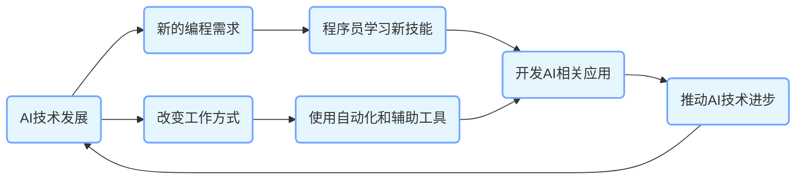

# 程序员的未来：AI时代的职业新常态

> 关键词：程序员、AI时代、职业新常态、技术变革、技能提升、职业转型、未来趋势

> 摘要：本文聚焦于AI时代下程序员的职业发展，深入探讨了这一时代背景给程序员带来的变化与挑战，以及由此形成的职业新常态。从背景介绍入手，阐述了研究的目的、范围、预期读者等内容；接着剖析了核心概念与联系，梳理了AI与程序员职业之间的内在关系；详细讲解了相关的核心算法原理及操作步骤，并通过数学模型和公式进行理论支撑；结合项目实战案例，深入解读代码实现与分析；探讨了实际应用场景，为程序员的工作提供了具体的参考；推荐了相关的工具和资源，助力程序员不断学习与成长；最后总结了未来发展趋势与挑战，还给出了常见问题解答及扩展阅读参考资料，旨在为程序员在AI时代的职业发展提供全面而深入的指导。

## 1. 背景介绍 
### 1.1 目的和范围
在当今数字化快速发展的时代，AI技术的崛起正在深刻地改变着各个行业，程序员作为技术领域的关键角色，其职业发展也面临着前所未有的变革。本文的目的在于全面深入地分析AI时代对程序员职业产生的影响，探讨在这一背景下程序员所面临的职业新常态，包括技能要求的变化、职业发展路径的调整等。范围涵盖了AI技术的基本原理、相关算法对编程工作的影响、实际项目中的应用案例，以及程序员未来可能面临的发展趋势和挑战等方面。

### 1.2 预期读者
本文预期读者主要包括广大程序员群体，无论是初入职场的新手，还是有一定经验的资深开发者，都能从本文中获取对未来职业发展有价值的信息和指导。同时，也适合相关技术领域的管理者、研究者，以及对AI和编程行业发展感兴趣的人士阅读，帮助他们了解程序员职业在AI时代的演变和发展趋势。

### 1.3 文档结构概述
本文将按照以下结构展开：首先介绍背景信息，包括目的、范围、预期读者等内容；接着阐述核心概念与联系，清晰地呈现AI与程序员职业之间的关系；详细讲解核心算法原理及具体操作步骤，通过Python代码进行示例；运用数学模型和公式对相关理论进行深入分析，并举例说明；结合实际项目案例，对代码实现和分析进行详细解读；探讨实际应用场景，展示AI在编程工作中的具体应用；推荐相关的学习资源、开发工具框架以及论文著作；总结未来发展趋势与挑战；提供常见问题解答及扩展阅读参考资料。

### 1.4 术语表
#### 1.4.1 核心术语定义
- **AI（Artificial Intelligence）**：即人工智能，是一门研究如何使计算机能够模拟人类智能的技术领域，包括机器学习、深度学习、自然语言处理等多个分支。
- **机器学习（Machine Learning）**：是AI的一个重要分支，它通过让计算机从数据中学习模式和规律，从而实现预测和决策等功能。
- **深度学习（Deep Learning）**：是机器学习的一种特殊形式，它基于神经网络模型，通过多层的神经元结构自动学习数据的特征表示。
- **程序员（Programmer）**：是指从事程序开发、维护和优化等工作的专业人员，他们使用各种编程语言和工具来实现软件系统的功能。

#### 1.4.2 相关概念解释
- **自动化编程**：利用AI技术自动生成代码的过程，通过对大量代码数据的学习，AI系统可以根据需求生成相应的代码片段或完整的程序。
- **智能辅助编程**：借助AI工具为程序员提供代码提示、错误检测、优化建议等辅助功能，帮助程序员提高编程效率和代码质量。
- **职业转型**：在AI时代，程序员可能需要从传统的编程领域转向与AI相关的领域，如机器学习工程师、数据科学家等，以适应技术发展的需求。

#### 1.4.3 缩略词列表
- **AI**：Artificial Intelligence（人工智能）
- **ML**：Machine Learning（机器学习）
- **DL**：Deep Learning（深度学习）
- **NLP**：Natural Language Processing（自然语言处理）

## 2. 核心概念与联系 
在AI时代，AI技术与程序员的职业发展密切相关，它们之间存在着复杂而又相互影响的关系。下面通过文本示意图和Mermaid流程图来详细阐述这些核心概念与联系。

### 文本示意图
AI技术为程序员的工作带来了诸多变革。一方面，AI的发展催生了新的编程需求，如开发AI相关的算法、模型和应用程序，这要求程序员具备新的技能和知识。另一方面，AI技术也在改变着程序员的工作方式，自动化编程和智能辅助编程工具的出现，使得程序员可以更加高效地完成任务。同时，程序员的工作也为AI技术的发展提供了支持，他们通过编写代码来实现AI算法和系统的功能，推动AI技术不断进步。

### Mermaid流程图

这个流程图展示了AI技术发展与程序员职业发展之间的循环关系。AI技术的发展产生了新的编程需求和改变了工作方式，促使程序员学习新技能和使用相关工具，进而开发出AI相关应用，这些应用又推动了AI技术的进一步发展，形成了一个不断循环的过程。

## 3. 核心算法原理 & 具体操作步骤 
在AI时代，与程序员密切相关的核心算法包括机器学习和深度学习算法。下面以简单的线性回归算法为例，详细讲解其原理和使用Python实现的具体操作步骤。

### 线性回归算法原理
线性回归是一种用于建立自变量和因变量之间线性关系的统计模型。其基本思想是通过找到一条最佳的直线，使得所有数据点到该直线的距离之和最小。在二维空间中，线性回归模型可以表示为：
$$y = \theta_0 + \theta_1x + \epsilon$$
其中，$y$ 是因变量，$x$ 是自变量，$\theta_0$ 和 $\theta_1$ 是模型的参数，$\epsilon$ 是误差项。

### 具体操作步骤及Python代码实现
#### 步骤1：导入必要的库
```python
import numpy as np
import matplotlib.pyplot as plt
from sklearn.linear_model import LinearRegression
```
#### 步骤2：准备数据
```python
# 生成一些示例数据
x = np.array([1, 2, 3, 4, 5]).reshape(-1, 1)
y = np.array([2, 4, 6, 8, 10])
```
#### 步骤3：创建线性回归模型并训练
```python
# 创建线性回归模型
model = LinearRegression()

# 训练模型
model.fit(x, y)
```
#### 步骤4：进行预测
```python
# 预测新的数据点
new_x = np.array([6]).reshape(-1, 1)
predicted_y = model.predict(new_x)
print("预测值:", predicted_y)
```
#### 步骤5：可视化结果
```python
# 绘制原始数据点
plt.scatter(x, y, color='blue', label='原始数据')

# 绘制拟合直线
plt.plot(x, model.predict(x), color='red', label='拟合直线')

# 绘制预测点
plt.scatter(new_x, predicted_y, color='green', label='预测点')

plt.xlabel('x')
plt.ylabel('y')
plt.title('线性回归示例')
plt.legend()
plt.show()
```
通过以上步骤，我们完成了一个简单的线性回归模型的训练和预测过程。这个例子展示了如何使用Python和Scikit-learn库来实现线性回归算法，在实际的编程工作中，程序员可以根据具体需求对模型进行调整和优化。

## 4. 数学模型和公式 & 详细讲解 & 举例说明 
### 线性回归的数学模型和公式
线性回归的目标是找到最佳的参数 $\theta_0$ 和 $\theta_1$，使得误差项 $\epsilon$ 的平方和最小。误差项的平方和可以表示为：
$$J(\theta_0, \theta_1) = \frac{1}{2m}\sum_{i=1}^{m}(y^{(i)} - (\theta_0 + \theta_1x^{(i)}))^2$$
其中，$m$ 是数据点的数量，$y^{(i)}$ 和 $x^{(i)}$ 分别是第 $i$ 个数据点的因变量和自变量。

为了找到使 $J(\theta_0, \theta_1)$ 最小的参数 $\theta_0$ 和 $\theta_1$，我们可以使用最小二乘法。最小二乘法的原理是对 $J(\theta_0, \theta_1)$ 分别求关于 $\theta_0$ 和 $\theta_1$ 的偏导数，并令其等于0，得到以下方程组：
$$\frac{\partial J(\theta_0, \theta_1)}{\partial \theta_0} = \frac{1}{m}\sum_{i=1}^{m}(y^{(i)} - (\theta_0 + \theta_1x^{(i)})) = 0$$
$$\frac{\partial J(\theta_0, \theta_1)}{\partial \theta_1} = \frac{1}{m}\sum_{i=1}^{m}(y^{(i)} - (\theta_0 + \theta_1x^{(i)}))x^{(i)} = 0$$
解这个方程组可以得到 $\theta_0$ 和 $\theta_1$ 的最优解。

### 详细讲解
最小二乘法的核心思想是通过最小化误差的平方和来找到最佳的拟合直线。误差的平方和越小，说明模型对数据的拟合效果越好。在实际计算中，我们可以使用矩阵运算来求解参数 $\theta_0$ 和 $\theta_1$，这样可以提高计算效率。

### 举例说明
假设我们有以下数据点：$(1, 2), (2, 4), (3, 6), (4, 8), (5, 10)$。我们可以使用最小二乘法来计算线性回归模型的参数。

首先，计算相关的统计量：
$$\bar{x} = \frac{1 + 2 + 3 + 4 + 5}{5} = 3$$
$$\bar{y} = \frac{2 + 4 + 6 + 8 + 10}{5} = 6$$
$$\sum_{i=1}^{5}(x^{(i)} - \bar{x})(y^{(i)} - \bar{y}) = (1 - 3)(2 - 6) + (2 - 3)(4 - 6) + (3 - 3)(6 - 6) + (4 - 3)(8 - 6) + (5 - 3)(10 - 6) = 20$$
$$\sum_{i=1}^{5}(x^{(i)} - \bar{x})^2 = (1 - 3)^2 + (2 - 3)^2 + (3 - 3)^2 + (4 - 3)^2 + (5 - 3)^2 = 10$$

然后，计算参数 $\theta_1$ 和 $\theta_0$：
$$\theta_1 = \frac{\sum_{i=1}^{5}(x^{(i)} - \bar{x})(y^{(i)} - \bar{y})}{\sum_{i=1}^{5}(x^{(i)} - \bar{x})^2} = \frac{20}{10} = 2$$
$$\theta_0 = \bar{y} - \theta_1\bar{x} = 6 - 2\times3 = 0$$

所以，线性回归模型为 $y = 2x$。这与我们之前使用Python代码实现的结果是一致的。

## 5. 项目实战：代码实际案例和详细解释说明 
### 5.1  开发环境搭建
在进行项目实战之前，我们需要搭建相应的开发环境。以下是搭建Python开发环境的步骤：

#### 步骤1：安装Python
访问Python官方网站（https://www.python.org/downloads/），根据自己的操作系统选择合适的Python版本进行下载和安装。安装过程中建议勾选“Add Python to PATH”选项，这样可以方便在命令行中使用Python。

#### 步骤2：安装必要的库
在安装好Python后，我们可以使用pip来安装项目所需的库。打开命令行工具，输入以下命令安装常用的库：
```sh
pip install numpy pandas matplotlib scikit-learn
```
这些库分别用于数值计算、数据处理、数据可视化和机器学习。

### 5.2  源代码详细实现和代码解读
我们以一个简单的房价预测项目为例，展示如何使用线性回归算法进行实际的预测任务。

#### 步骤1：导入必要的库
```python
import numpy as np
import pandas as pd
from sklearn.model_selection import train_test_split
from sklearn.linear_model import LinearRegression
from sklearn.metrics import mean_squared_error
import matplotlib.pyplot as plt
```
#### 步骤2：加载数据
```python
# 加载数据集
data = pd.read_csv('housing.csv')

# 提取特征和目标变量
X = data[['RM']].values  # RM表示平均房间数
y = data['MEDV'].values  # MEDV表示房价中位数
```
#### 步骤3：划分训练集和测试集
```python
# 划分训练集和测试集
X_train, X_test, y_train, y_test = train_test_split(X, y, test_size=0.2, random_state=42)
```
#### 步骤4：创建线性回归模型并训练
```python
# 创建线性回归模型
model = LinearRegression()

# 训练模型
model.fit(X_train, y_train)
```
#### 步骤5：进行预测并评估模型
```python
# 进行预测
y_pred = model.predict(X_test)

# 计算均方误差
mse = mean_squared_error(y_test, y_pred)
print("均方误差:", mse)
```
#### 步骤6：可视化结果
```python
# 绘制实际值和预测值的散点图
plt.scatter(X_test, y_test, color='blue', label='实际值')
plt.plot(X_test, y_pred, color='red', label='预测值')
plt.xlabel('平均房间数')
plt.ylabel('房价中位数')
plt.title('房价预测')
plt.legend()
plt.show()
```

### 5.3  代码解读与分析
- **数据加载**：使用`pandas`库的`read_csv`函数加载房价数据集，并提取特征`RM`（平均房间数）和目标变量`MEDV`（房价中位数）。
- **数据划分**：使用`sklearn`库的`train_test_split`函数将数据集划分为训练集和测试集，其中测试集占比为20%。
- **模型训练**：创建线性回归模型并使用训练集进行训练。
- **模型评估**：使用测试集进行预测，并计算均方误差（MSE）来评估模型的性能。均方误差越小，说明模型的预测效果越好。
- **结果可视化**：使用`matplotlib`库绘制实际值和预测值的散点图，直观地展示模型的预测效果。

通过这个项目实战，我们可以看到如何使用线性回归算法进行实际的预测任务，并且学会了如何评估模型的性能和可视化结果。

## 6. 实际应用场景 
在AI时代，程序员的工作涉及到众多实际应用场景，以下是一些常见的应用场景：

### 自然语言处理
自然语言处理是AI领域的一个重要分支，它涉及到文本的处理、理解和生成等任务。程序员在自然语言处理中的应用场景包括：
- **机器翻译**：开发机器翻译系统，实现不同语言之间的自动翻译。例如，谷歌翻译、百度翻译等。
- **智能客服**：构建智能客服系统，使用自然语言处理技术理解用户的问题并提供相应的回答。例如，淘宝、京东等电商平台的智能客服。
- **文本分类**：对文本进行分类，如新闻分类、垃圾邮件分类等。例如，电子邮件客户端的垃圾邮件过滤功能。

### 计算机视觉
计算机视觉是研究如何使计算机能够理解和处理图像和视频的技术。程序员在计算机视觉中的应用场景包括：
- **图像识别**：开发图像识别系统，识别图像中的物体、场景等。例如，人脸识别技术在安防、门禁系统中的应用。
- **目标检测**：检测图像或视频中的特定目标，如行人检测、车辆检测等。例如，自动驾驶汽车中的目标检测系统。
- **图像生成**：使用深度学习技术生成逼真的图像，如艺术绘画、虚拟场景等。例如，DALL - E 2等图像生成模型。

### 推荐系统
推荐系统是根据用户的历史行为和偏好，为用户推荐相关的商品、内容等。程序员在推荐系统中的应用场景包括：
- **电商推荐**：为电商平台的用户推荐商品，提高用户的购买转化率。例如，亚马逊、淘宝等电商平台的商品推荐功能。
- **内容推荐**：为新闻、视频、音乐等平台的用户推荐相关的内容，提高用户的粘性和活跃度。例如，今日头条、抖音等平台的内容推荐算法。

### 医疗领域
AI技术在医疗领域的应用越来越广泛，程序员在其中也发挥着重要作用。应用场景包括：
- **疾病诊断**：开发疾病诊断辅助系统，帮助医生更准确地诊断疾病。例如，通过分析医学影像（如X光、CT等）来检测疾病。
- **药物研发**：使用AI技术加速药物研发过程，预测药物的疗效和副作用。例如，通过模拟药物分子的结构和作用机制来筛选潜在的药物。

## 7. 工具和资源推荐
### 7.1 学习资源推荐
#### 7.1.1 书籍推荐
- 《Python机器学习》：本书详细介绍了Python在机器学习中的应用，包括各种机器学习算法的原理和实现，适合初学者入门。
- 《深度学习》：由深度学习领域的三位先驱Ian Goodfellow、Yoshua Bengio和Aaron Courville合著，是深度学习领域的经典教材，深入讲解了深度学习的理论和实践。
- 《人工智能：一种现代的方法》：全面介绍了人工智能的各个领域，包括搜索算法、知识表示、机器学习、自然语言处理等，是人工智能领域的权威著作。

#### 7.1.2 在线课程
- Coursera平台上的“机器学习”课程：由斯坦福大学的Andrew Ng教授授课，是机器学习领域的经典课程，讲解深入浅出，适合初学者。
- edX平台上的“深度学习专业课程”：由Facebook的Yoshua Bengio等知名学者授课，系统地介绍了深度学习的各个方面。
- 中国大学MOOC平台上的“人工智能基础”课程：由国内知名高校的教师授课，结合国内的教学实际，适合国内学生学习。

#### 7.1.3 技术博客和网站
- Medium：是一个技术博客平台，上面有很多关于AI、编程等领域的优质文章，作者来自世界各地。
- Towards Data Science：专注于数据科学和机器学习领域，提供了大量的技术文章和案例分析。
- 开源中国：是国内知名的开源技术社区，提供了丰富的技术文章、开源项目和技术交流平台。

### 7.2 开发工具框架推荐
#### 7.2.1 IDE和编辑器
- PyCharm：是一款专门为Python开发设计的集成开发环境（IDE），具有强大的代码编辑、调试和自动补全功能，适合Python开发者使用。
- Visual Studio Code：是一款轻量级的代码编辑器，支持多种编程语言，拥有丰富的插件生态系统，可以满足不同开发者的需求。
- Jupyter Notebook：是一个交互式的开发环境，适合数据科学和机器学习领域的开发和研究，支持Python、R等多种编程语言。

#### 7.2.2 调试和性能分析工具
- PDB：是Python自带的调试工具，可以帮助开发者在代码中设置断点、单步执行等，方便调试代码。
- cProfile：是Python的性能分析工具，可以分析代码的执行时间和函数调用次数，帮助开发者优化代码性能。
- TensorBoard：是TensorFlow的可视化工具，可以帮助开发者可视化训练过程、模型结构等，方便调试和优化深度学习模型。

#### 7.2.3 相关框架和库
- TensorFlow：是Google开发的开源深度学习框架，具有强大的计算能力和广泛的应用场景，支持CPU、GPU等多种计算设备。
- PyTorch：是Facebook开发的开源深度学习框架，具有动态图的特点，易于使用和调试，在学术界和工业界都有广泛的应用。
- Scikit-learn：是Python的机器学习库，提供了丰富的机器学习算法和工具，如分类、回归、聚类等，适合初学者和快速开发。

### 7.3 相关论文著作推荐
#### 7.3.1 经典论文
- “ImageNet Classification with Deep Convolutional Neural Networks”：由Alex Krizhevsky等人发表，介绍了AlexNet卷积神经网络，开创了深度学习在图像识别领域的先河。
- “Attention Is All You Need”：由Google的研究团队发表，提出了Transformer架构，在自然语言处理领域取得了巨大的成功。
- “Generative Adversarial Nets”：由Ian Goodfellow等人发表，提出了生成对抗网络（GAN）的概念，在图像生成、数据增强等领域有广泛的应用。

#### 7.3.2 最新研究成果
- 关注顶级学术会议，如NeurIPS（神经信息处理系统大会）、ICML（国际机器学习会议）、CVPR（计算机视觉与模式识别会议）等，这些会议上会发表很多最新的研究成果。
- 查阅相关的学术期刊，如Journal of Artificial Intelligence Research（JAIR）、Artificial Intelligence等，获取最新的学术论文。

#### 7.3.3 应用案例分析
- 研究一些知名公司的AI应用案例，如谷歌的搜索算法、亚马逊的推荐系统、特斯拉的自动驾驶技术等，了解AI技术在实际应用中的实现方法和效果。
- 关注一些开源项目的案例分析，如OpenAI的GPT系列、Hugging Face的Transformer库等，学习如何使用开源工具实现AI应用。

## 8. 总结：未来发展趋势与挑战
### 未来发展趋势
- **技能融合**：未来的程序员需要具备多种技能的融合，不仅要掌握传统的编程技术，还要熟悉AI、机器学习、数据分析等领域的知识。例如，开发一个智能电商系统，程序员需要同时具备前端开发、后端编程、机器学习算法实现等多种技能。
- **自动化编程普及**：随着AI技术的不断发展，自动化编程工具将越来越普及。这些工具可以根据需求自动生成代码，大大提高编程效率。程序员的工作重点将从编写代码转向需求分析、系统设计和代码优化等方面。
- **跨领域合作增多**：AI技术的应用涉及到多个领域，如医疗、金融、交通等。未来的程序员需要与不同领域的专业人员进行合作，共同开发出满足实际需求的AI应用。例如，程序员与医生合作开发医疗诊断辅助系统，与金融专家合作开发风险评估模型等。
- **个性化定制**：在AI时代，用户对软件的个性化需求越来越高。程序员需要开发出能够根据用户的行为和偏好进行个性化定制的软件系统。例如，推荐系统可以根据用户的浏览历史和购买记录为用户推荐个性化的商品和内容。

### 挑战
- **技术更新换代快**：AI技术发展迅速，新的算法、模型和框架不断涌现。程序员需要不断学习和更新自己的知识，以跟上技术发展的步伐。这对程序员的学习能力和时间管理能力提出了很高的要求。
- **数据安全和隐私问题**：AI应用需要大量的数据支持，而这些数据往往涉及到用户的隐私和安全。程序员在开发AI应用时，需要采取有效的措施来保护用户的数据安全和隐私。例如，使用加密技术对数据进行加密，采用访问控制机制来限制数据的访问权限等。
- **伦理和法律问题**：AI技术的发展也带来了一系列的伦理和法律问题，如算法偏见、人工智能的责任归属等。程序员需要了解相关的伦理和法律规范，在开发AI应用时遵循这些规范，避免出现伦理和法律纠纷。
- **就业竞争加剧**：随着AI技术的普及，越来越多的人开始学习编程和AI相关知识，就业竞争将越来越激烈。程序员需要不断提升自己的竞争力，如具备创新能力、解决复杂问题的能力等，才能在就业市场中脱颖而出。

## 9. 附录：常见问题与解答
### 问题1：在AI时代，传统程序员会失业吗？
答：在AI时代，传统程序员不会完全失业，但需要进行技能升级和转型。虽然自动化编程工具会取代一些重复性的编程工作，但程序员在系统设计、算法优化、需求分析等方面仍然发挥着重要作用。而且，AI技术的发展也会催生新的编程需求，如开发AI相关的算法、模型和应用程序等。

### 问题2：学习AI编程需要具备哪些基础知识？
答：学习AI编程需要具备一定的数学基础，如线性代数、概率论与数理统计等，这些知识是理解AI算法的基础。同时，还需要掌握一门编程语言，如Python，以及相关的机器学习和深度学习框架，如TensorFlow、PyTorch等。此外，了解数据处理和数据分析的方法也是很有必要的。

### 问题3：如何提高自己在AI时代的编程能力？
答：可以通过以下几种方式提高自己在AI时代的编程能力：
- 学习新的技术和知识，关注AI领域的最新发展动态。
- 参与开源项目，与其他开发者交流和学习。
- 实践项目，通过实际项目来锻炼自己的编程能力和解决问题的能力。
- 阅读相关的技术书籍和论文，深入理解AI算法的原理和实现方法。

### 问题4：AI编程和传统编程有什么区别？
答：AI编程和传统编程有以下一些区别：
- **目标不同**：传统编程主要是实现特定的功能和业务逻辑，而AI编程主要是让计算机从数据中学习模式和规律，实现预测和决策等功能。
- **编程方式不同**：传统编程通常是通过编写明确的指令来实现功能，而AI编程需要使用机器学习和深度学习算法，通过训练模型来实现功能。
- **数据依赖程度不同**：AI编程需要大量的数据来训练模型，而传统编程对数据的依赖程度相对较低。

## 10. 扩展阅读 & 参考资料
### 扩展阅读
- 《AI 3.0》：作者梅拉妮·米歇尔，探讨了AI技术的发展现状、挑战和未来趋势，对理解AI时代的发展有很大的帮助。
- 《生命3.0：人工智能时代的人类进化》：作者迈克斯·泰格马克，从哲学和科学的角度探讨了AI对人类社会的影响和未来人类的进化方向。

### 参考资料
- 相关学术论文和研究报告，如IEEE Transactions on Pattern Analysis and Machine Intelligence、ACM Transactions on Intelligent Systems and Technology等期刊上的论文。
- 开源项目的官方文档，如TensorFlow、PyTorch等框架的官方文档。
- 技术博客和论坛上的优质文章，如Stack Overflow、GitHub等平台上的相关内容。