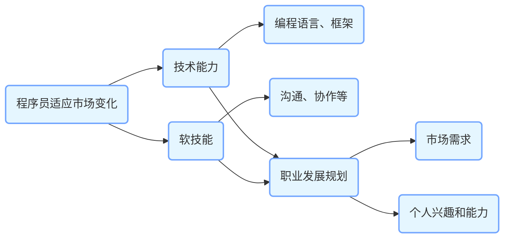

# 程序员的生存技能：适应不断变化的市场

> 关键词：程序员、生存技能、市场变化、技术更新、职业发展

> 摘要：在当今科技飞速发展的时代，软件行业的市场环境处于不断变化之中。对于程序员而言，能否适应这种变化直接关系到其职业的发展与生存。本文围绕程序员适应不断变化市场所需的生存技能展开探讨，深入分析背景知识、核心概念、算法原理、数学模型等内容，并结合项目实战和实际应用场景进行阐述。同时，推荐相关的工具和资源，最后对未来发展趋势与挑战进行总结，旨在为程序员提供全面且实用的指导，助力其在不断变化的市场中保持竞争力。

## 1. 背景介绍 
### 1.1 目的和范围
本文的目的在于帮助程序员了解并掌握适应不断变化市场的生存技能。范围涵盖了技术层面的知识更新、职业发展规划、软技能培养等多个方面，旨在为程序员提供全方位的指导，使其能够在市场变化中找到适合自己的发展路径，实现个人职业价值的最大化。

### 1.2 预期读者
本文预期读者主要为广大程序员群体，包括初入职场的新手程序员、有一定工作经验的中级程序员以及寻求职业突破的高级程序员。同时，也可供相关行业的管理者、招聘人员以及对软件行业感兴趣的人士参考。

### 1.3 文档结构概述
本文首先介绍相关背景知识，包括目的、预期读者和文档结构概述等内容。接着阐述核心概念与联系，通过文本示意图和 Mermaid 流程图清晰展示关键要素之间的关系。然后详细讲解核心算法原理和具体操作步骤，并结合数学模型和公式进行深入分析。之后通过项目实战展示代码实际案例并进行详细解释。再探讨实际应用场景，为程序员提供实践参考。随后推荐相关的工具和资源，包括学习资源、开发工具框架和相关论文著作等。最后总结未来发展趋势与挑战，并提供常见问题与解答以及扩展阅读和参考资料。

### 1.4 术语表
#### 1.4.1 核心术语定义
- **程序员**：指从事程序开发、维护的专业人员，通过编写代码来实现各种软件功能。
- **市场变化**：指软件行业在技术、需求、竞争等方面的动态变化，这些变化会影响程序员的职业发展和市场需求。
- **生存技能**：指程序员为了在不断变化的市场中保持竞争力和实现职业发展所需具备的各种能力，包括技术能力、软技能等。

#### 1.4.2 相关概念解释
- **技术更新**：随着科技的发展，新的编程语言、框架、工具等不断涌现，程序员需要不断学习和掌握这些新技术，以适应市场需求。
- **职业发展规划**：程序员根据自身的兴趣、能力和市场需求，制定的一系列职业目标和发展路径，以实现个人职业价值的最大化。
- **软技能**：除技术能力外，程序员还需要具备沟通能力、团队协作能力、问题解决能力等软技能，以更好地适应工作环境和市场变化。

#### 1.4.3 缩略词列表
- **IDE**：Integrated Development Environment，集成开发环境。
- **API**：Application Programming Interface，应用程序编程接口。
- **AI**：Artificial Intelligence，人工智能。
- **ML**：Machine Learning，机器学习。

## 2. 核心概念与联系 
### 核心概念原理
在程序员适应不断变化的市场这一主题中，涉及到多个核心概念，这些概念相互关联、相互影响。

- **技术能力**：是程序员的核心竞争力之一，包括掌握多种编程语言、框架和工具，以及具备解决复杂技术问题的能力。随着市场的变化，新的技术不断涌现，程序员需要不断学习和更新自己的技术知识，以满足市场需求。
- **软技能**：包括沟通能力、团队协作能力、问题解决能力、学习能力等。在工作中，程序员需要与不同角色的人员进行沟通和协作，因此良好的软技能能够提高工作效率和团队协作效果。同时，学习能力也是适应市场变化的关键，程序员需要不断学习新的知识和技能，以跟上技术发展的步伐。
- **职业发展规划**：是程序员在职业生涯中明确自己的目标和方向的重要手段。通过制定合理的职业发展规划，程序员可以有针对性地提升自己的能力，更好地适应市场变化。职业发展规划需要考虑市场需求、个人兴趣和能力等因素，以确保规划的可行性和有效性。

### 架构的文本示意图
```plaintext
            程序员适应市场变化
                |
        ------------------
        |                |
    技术能力           软技能
        |                |
    编程语言、框架    沟通、协作等
        |                |
        ------------------
                    |
              职业发展规划
              |         |
        市场需求     个人兴趣和能力
```

### Mermaid 流程图


## 3. 核心算法原理 & 具体操作步骤 
### 核心算法原理
在程序员适应市场变化的过程中，可以将其看作一个动态的优化问题。我们的目标是通过不断调整自己的技术能力、软技能和职业发展规划，以达到在市场中实现个人价值最大化的目的。可以使用一种类似梯度下降的算法思想来实现这一目标。

梯度下降算法的基本思想是通过不断地沿着目标函数的负梯度方向更新参数，以逐步逼近目标函数的最小值。在程序员适应市场变化的场景中，我们可以将个人价值看作目标函数，技术能力、软技能和职业发展规划等因素看作参数。通过不断地评估市场需求和个人能力的差距，调整这些参数，以逐步提高个人价值。

### 具体操作步骤
以下是使用 Python 代码实现的一个简化的模拟梯度下降算法，用于说明程序员适应市场变化的过程。

```python
import numpy as np

# 定义市场需求向量，这里假设市场需求有三个维度：技术能力、软技能、职业规划
market_demand = np.array([0.8, 0.7, 0.9])

# 初始化程序员的能力向量
programmer_ability = np.array([0.4, 0.5, 0.6])

# 学习率，控制每次调整的步长
learning_rate = 0.1

# 迭代次数
num_iterations = 100

# 模拟梯度下降过程
for i in range(num_iterations):
    # 计算当前能力与市场需求的差距
    error = market_demand - programmer_ability
    
    # 计算梯度，这里简单地将误差作为梯度
    gradient = error
    
    # 更新能力向量
    programmer_ability += learning_rate * gradient
    
    # 打印当前迭代的信息
    print(f'Iteration {i+1}: Programmer Ability = {programmer_ability}')
```

### 代码解释
1. **市场需求向量**：`market_demand` 表示市场对程序员技术能力、软技能和职业规划的需求程度，每个维度的值范围在 0 到 1 之间，值越大表示需求越高。
2. **程序员能力向量**：`programmer_ability` 表示程序员当前在技术能力、软技能和职业规划方面的能力水平，同样每个维度的值范围在 0 到 1 之间。
3. **学习率**：`learning_rate` 控制每次调整的步长，学习率过大可能导致无法收敛，学习率过小则会导致收敛速度过慢。
4. **迭代次数**：`num_iterations` 表示迭代的次数，通过多次迭代逐步调整程序员的能力向量，使其接近市场需求。
5. **梯度下降过程**：在每次迭代中，计算当前能力与市场需求的差距 `error`，并将其作为梯度 `gradient`。然后根据学习率更新程序员的能力向量 `programmer_ability`。

## 4. 数学模型和公式 & 详细讲解 & 举例说明 
### 数学模型
在上述的梯度下降算法中，我们可以用以下数学模型来描述程序员适应市场变化的过程。

设市场需求向量为 $\mathbf{d} = [d_1, d_2, d_3]^T$，程序员的能力向量为 $\mathbf{x} = [x_1, x_2, x_3]^T$，其中 $d_i$ 和 $x_i$ 分别表示市场需求和程序员能力在第 $i$ 个维度上的值（$i = 1, 2, 3$）。

我们的目标是最小化市场需求与程序员能力之间的误差，定义误差函数为：

$$
E(\mathbf{x}) = \frac{1}{2} \sum_{i=1}^{3} (d_i - x_i)^2
$$

这个误差函数表示市场需求与程序员能力在各个维度上的差距的平方和的一半。

### 梯度计算
为了使用梯度下降算法更新程序员的能力向量，我们需要计算误差函数 $E(\mathbf{x})$ 关于 $\mathbf{x}$ 的梯度。

根据求导法则，误差函数 $E(\mathbf{x})$ 关于 $x_i$ 的偏导数为：

$$
\frac{\partial E(\mathbf{x})}{\partial x_i} = -(d_i - x_i)
$$

因此，误差函数 $E(\mathbf{x})$ 的梯度为：

$$
\nabla E(\mathbf{x}) = \left[ \frac{\partial E(\mathbf{x})}{\partial x_1}, \frac{\partial E(\mathbf{x})}{\partial x_2}, \frac{\partial E(\mathbf{x})}{\partial x_3} \right]^T = -(\mathbf{d} - \mathbf{x})
$$

### 梯度下降更新公式
根据梯度下降算法，每次迭代时程序员的能力向量 $\mathbf{x}$ 的更新公式为：

$$
\mathbf{x}_{k+1} = \mathbf{x}_k + \alpha \nabla E(\mathbf{x}_k)
$$

其中，$\mathbf{x}_k$ 表示第 $k$ 次迭代时的能力向量，$\alpha$ 是学习率。

### 举例说明
假设市场需求向量 $\mathbf{d} = [0.8, 0.7, 0.9]^T$，程序员的初始能力向量 $\mathbf{x}_0 = [0.4, 0.5, 0.6]^T$，学习率 $\alpha = 0.1$。

- **第一次迭代**：
  - 计算误差：$\mathbf{e}_0 = \mathbf{d} - \mathbf{x}_0 = [0.8 - 0.4, 0.7 - 0.5, 0.9 - 0.6]^T = [0.4, 0.2, 0.3]^T$
  - 计算梯度：$\nabla E(\mathbf{x}_0) = -\mathbf{e}_0 = [-0.4, -0.2, -0.3]^T$
  - 更新能力向量：$\mathbf{x}_1 = \mathbf{x}_0 + \alpha \nabla E(\mathbf{x}_0) = [0.4, 0.5, 0.6]^T + 0.1 \times [-0.4, -0.2, -0.3]^T = [0.4 - 0.04, 0.5 - 0.02, 0.6 - 0.03]^T = [0.36, 0.48, 0.57]^T$

通过不断迭代，程序员的能力向量会逐渐接近市场需求向量。

## 5. 项目实战：代码实际案例和详细解释说明 
### 5.1  开发环境搭建
在进行项目实战之前，需要搭建相应的开发环境。以下是一些常见的开发环境搭建步骤：

- **操作系统**：可以选择 Windows、Linux 或 macOS 等操作系统，根据个人喜好和项目需求进行选择。
- **编程语言**：本项目将使用 Python 作为主要编程语言，需要安装 Python 解释器。可以从 Python 官方网站（https://www.python.org/downloads/） 下载并安装最新版本的 Python。
- **开发工具**：推荐使用 PyCharm 作为集成开发环境（IDE），它提供了丰富的功能和便捷的开发体验。可以从 PyCharm 官方网站（https://www.jetbrains.com/pycharm/download/） 下载并安装社区版或专业版。
- **相关库**：本项目将使用一些 Python 库，如 `numpy` 用于数值计算。可以使用以下命令安装所需的库：

```bash
pip install numpy
```

### 5.2  源代码详细实现和代码解读
以下是一个简单的 Python 项目示例，模拟程序员根据市场需求学习新技能的过程。

```python
import numpy as np

# 定义市场需求技能列表
market_demand_skills = {
    'Python': 0.8,
    'Java': 0.6,
    'JavaScript': 0.7,
    'Machine Learning': 0.9,
    'Data Science': 0.8
}

# 定义程序员初始技能列表
programmer_skills = {
    'Python': 0.4,
    'Java': 0.3,
    'JavaScript': 0.5,
    'Machine Learning': 0.2,
    'Data Science': 0.3
}

# 学习率
learning_rate = 0.1

# 迭代次数
num_iterations = 10

# 模拟学习过程
for i in range(num_iterations):
    print(f'Iteration {i+1}:')
    for skill in market_demand_skills:
        # 计算当前技能的差距
        error = market_demand_skills[skill] - programmer_skills[skill]
        
        # 更新技能水平
        programmer_skills[skill] += learning_rate * error
        
        # 打印当前技能的信息
        print(f'  {skill}: Current Level = {programmer_skills[skill]:.2f}, Target Level = {market_demand_skills[skill]}')
    print()
```

### 代码解读与分析
1. **市场需求技能列表**：`market_demand_skills` 是一个字典，存储了市场对不同技能的需求程度，每个技能对应一个 0 到 1 之间的值，表示需求的强度。
2. **程序员初始技能列表**：`programmer_skills` 是一个字典，存储了程序员当前在不同技能方面的水平，同样每个技能对应一个 0 到 1 之间的值。
3. **学习率**：`learning_rate` 控制每次学习的步长，决定了程序员技能提升的速度。
4. **迭代次数**：`num_iterations` 表示学习的迭代次数，通过多次迭代逐步提高程序员的技能水平。
5. **学习过程**：在每次迭代中，遍历市场需求技能列表，计算当前技能的差距 `error`，并根据学习率更新程序员的技能水平。最后打印当前技能的信息，包括当前水平和目标水平。

通过这个项目实战，我们可以看到程序员如何根据市场需求不断学习和提升自己的技能，以适应市场变化。

## 6. 实际应用场景 
### 技术转型
随着市场需求的变化，某些技术可能会逐渐过时，而新的技术则会不断涌现。程序员需要及时进行技术转型，学习新的编程语言、框架和工具，以适应市场的变化。例如，随着人工智能和机器学习的兴起，许多传统的程序员开始学习相关的技术，转型为人工智能工程师或数据科学家。

### 跨领域发展
在软件行业中，不同领域的需求也在不断变化。程序员可以考虑跨领域发展，将自己的技术能力应用到不同的行业中。例如，一个有多年 Web 开发经验的程序员可以尝试进入金融、医疗、教育等领域，开发相关的软件系统。

### 创业
对于一些有创新精神和商业头脑的程序员来说，创业也是一种适应市场变化的方式。通过发现市场中的痛点和机会，程序员可以开发出具有创新性的产品或服务，满足市场需求。例如，一些程序员创办了自己的软件公司，专注于开发移动应用、云计算平台等产品。

### 自由职业
自由职业也是一种越来越受欢迎的工作方式，程序员可以根据自己的技能和兴趣选择不同的项目进行工作。通过与不同的客户合作，程序员可以接触到不同的技术和业务需求，不断提升自己的能力。同时，自由职业也可以让程序员更好地平衡工作和生活，实现自我价值。

## 7. 工具和资源推荐
### 7.1 学习资源推荐
#### 7.1.1 书籍推荐
- 《Python 编程从入门到实践》：适合初学者学习 Python 编程语言，通过实际项目来掌握 Python 的基本语法和应用。
- 《Effective Java》：经典的 Java 编程书籍，深入讲解 Java 语言的特性和最佳实践，帮助程序员提高 Java 编程水平。
- 《JavaScript 高级程序设计》：全面介绍 JavaScript 语言的高级特性和应用，是学习 JavaScript 的必备书籍。
- 《机器学习》（周志华著）：被称为“西瓜书”，是机器学习领域的经典教材，系统地介绍了机器学习的基本概念、算法和应用。

#### 7.1.2 在线课程
- Coursera：提供了丰富的在线课程，包括计算机科学、数据科学、人工智能等多个领域的课程，许多课程由世界知名大学的教授授课。
- edX：与全球顶尖大学和机构合作，提供高质量的在线课程，课程内容涵盖了各个学科领域。
- 慕课网：专注于 IT 技能培训，提供了大量的编程课程，包括 Python、Java、JavaScript 等编程语言的课程，以及前端开发、后端开发、移动开发等方向的课程。

#### 7.1.3 技术博客和网站
- 博客园：国内知名的技术博客平台，汇聚了大量的程序员和技术专家，分享了许多关于编程、算法、系统架构等方面的技术文章。
- 开源中国：提供了丰富的开源项目信息和技术文章，是国内开源技术的重要交流平台。
- Medium：国外知名的技术博客平台，有许多优秀的技术文章和观点分享，涵盖了各个技术领域。

### 7.2 开发工具框架推荐
#### 7.2.1 IDE和编辑器
- PyCharm：专业的 Python 集成开发环境，提供了丰富的功能和便捷的开发体验，适合 Python 开发。
- IntelliJ IDEA：功能强大的 Java 集成开发环境，支持多种编程语言和框架，是 Java 开发的首选工具。
- Visual Studio Code：轻量级的代码编辑器，支持多种编程语言和插件扩展，具有丰富的社区资源，适合快速开发和调试。

#### 7.2.2 调试和性能分析工具
- PyCharm 调试器：集成在 PyCharm 中的调试工具，方便 Python 程序员进行代码调试和问题排查。
- VisualVM：Java 虚拟机的性能分析工具，可用于监控 Java 应用程序的性能指标，如 CPU 使用率、内存使用情况等。
- Chrome DevTools：浏览器自带的调试工具，可用于调试 Web 应用程序，包括 HTML、CSS、JavaScript 等代码的调试和性能分析。

#### 7.2.3 相关框架和库
- Django：Python 的 Web 开发框架，提供了高效的开发工具和丰富的功能，适合快速开发 Web 应用程序。
- Spring Boot：Java 的开发框架，简化了 Spring 应用的开发过程，提高了开发效率。
- React：JavaScript 的前端开发框架，用于构建用户界面，具有高效、灵活的特点。

### 7.3 相关论文著作推荐
#### 7.3.1 经典论文
- 《A Mathematical Theory of Communication》（Claude E. Shannon）：信息论的奠基之作，对通信领域和计算机科学产生了深远的影响。
- 《The Art of Computer Programming》（Donald E. Knuth）：计算机科学领域的经典著作，系统地介绍了计算机算法的设计和分析方法。
- 《Learning Representations by Back-propagating Errors》（David E. Rumelhart, Geoffrey E. Hinton, Ronald J. Williams）：反向传播算法的经典论文，为神经网络的发展奠定了基础。

#### 7.3.2 最新研究成果
- 可以通过学术数据库，如 IEEE Xplore、ACM Digital Library 等，查找关于人工智能、机器学习、区块链等领域的最新研究成果。
- 关注顶级学术会议，如 NeurIPS（神经信息处理系统大会）、ICML（国际机器学习会议）、CVPR（计算机视觉与模式识别会议）等，了解最新的研究动态和技术趋势。

#### 7.3.3 应用案例分析
- 《Lean Software Development: An Agile Toolkit》：介绍了精益软件开发的方法和实践，通过实际案例分析如何提高软件开发的效率和质量。
- 《Building Microservices》：讲解了微服务架构的设计和实现方法，通过实际案例分析如何构建可扩展、高可用的微服务系统。

## 8. 总结：未来发展趋势与挑战
### 未来发展趋势
- **人工智能与机器学习的融合**：人工智能和机器学习技术将继续发展，并与各个领域深度融合。程序员需要掌握相关的技术，开发出更加智能、高效的软件系统。
- **云计算与边缘计算的发展**：云计算和边缘计算技术将为软件开发带来新的机遇和挑战。程序员需要了解云计算和边缘计算的原理和应用，开发出适合云环境和边缘设备的软件。
- **物联网的普及**：物联网技术将实现万物互联，为软件开发带来广阔的市场空间。程序员需要掌握物联网相关的技术，开发出智能硬件设备和物联网应用程序。
- **低代码/无代码开发的兴起**：低代码/无代码开发平台将降低软件开发的门槛，使更多非专业程序员能够参与到软件开发中来。程序员需要关注这一趋势，学习如何使用低代码/无代码开发平台，提高开发效率。

### 挑战
- **技术更新换代快**：软件行业的技术更新换代非常快，程序员需要不断学习和掌握新的技术，以跟上技术发展的步伐。这对程序员的学习能力和时间管理能力提出了很高的要求。
- **竞争激烈**：随着软件行业的发展，程序员的数量不断增加，市场竞争日益激烈。程序员需要不断提升自己的能力，提高自己的竞争力，才能在市场中脱颖而出。
- **跨领域知识要求高**：未来的软件开发需要程序员具备跨领域的知识，如人工智能、机器学习、云计算、物联网等。这对程序员的知识储备和学习能力提出了更高的要求。
- **数据安全与隐私问题**：随着信息技术的发展，数据安全和隐私问题日益突出。程序员需要了解相关的法律法规和技术手段，确保软件系统的数据安全和用户隐私。

## 9. 附录：常见问题与解答
### 如何快速学习新的技术？
- **制定学习计划**：根据自己的目标和时间，制定合理的学习计划，明确学习的内容和进度。
- **寻找优质学习资源**：选择适合自己的学习资源，如书籍、在线课程、技术博客等，确保学习的质量。
- **实践项目**：通过实践项目来巩固所学的知识，提高自己的动手能力和解决问题的能力。
- **参与社区交流**：加入相关的技术社区，与其他程序员交流经验和心得，获取最新的技术信息和学习建议。

### 如何在市场变化中保持竞争力？
- **持续学习**：不断学习新的技术和知识，保持对市场变化的敏感度，及时调整自己的技能和知识结构。
- **提升软技能**：除了技术能力，还需要提升自己的软技能，如沟通能力、团队协作能力、问题解决能力等，以更好地适应工作环境和市场变化。
- **建立人脉关系**：建立广泛的人脉关系，与同行、客户、合作伙伴等保持良好的沟通和合作，获取更多的机会和资源。
- **关注行业动态**：关注行业的最新动态和发展趋势，了解市场需求和竞争情况，及时调整自己的职业发展规划。

### 如何选择适合自己的职业发展方向？
- **了解自己的兴趣和优势**：分析自己的兴趣和优势，选择与自己兴趣和优势相匹配的职业发展方向。
- **研究市场需求**：了解市场对不同职业的需求情况，选择有发展前景的职业方向。
- **考虑个人职业目标**：根据自己的职业目标，选择能够实现自己目标的职业发展方向。
- **尝试不同的领域**：在职业生涯的早期，可以尝试不同的领域和项目，了解自己的兴趣和能力所在，为选择适合自己的职业发展方向提供参考。

## 10. 扩展阅读 & 参考资料
### 扩展阅读
- 《软技能：代码之外的生存指南》：介绍了程序员在职业生涯中需要具备的软技能，如沟通技巧、职业规划、自我营销等。
- 《程序员修炼之道：从小工到专家》：讲述了程序员如何不断提升自己的能力，成为一名优秀的程序员。
- 《代码整洁之道》：强调了代码的可读性和可维护性，介绍了编写整洁代码的原则和方法。

### 参考资料
- 相关编程语言和框架的官方文档，如 Python 官方文档、Java 官方文档、Django 官方文档等。
- 技术论坛和社区的讨论帖子，如 Stack Overflow、Reddit 等。
- 行业报告和研究机构的分析文章，如 Gartner、IDC 等发布的报告。