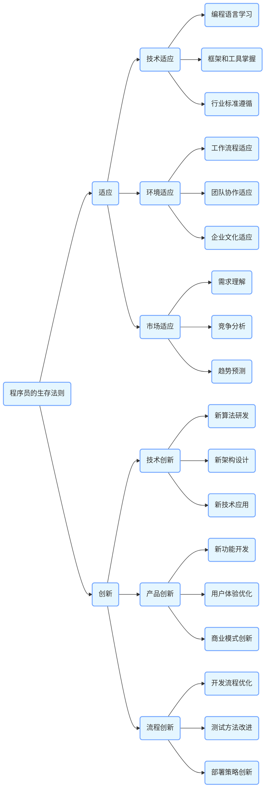

# 程序员的生存法则：适应与创新并重

> 关键词：程序员、生存法则、适应、创新、技术变革、职业发展、行业趋势

> 摘要：在快速发展的信息技术时代，程序员作为推动科技进步的重要力量，面临着不断变化的技术环境和市场需求。本文深入探讨了程序员的生存法则，强调适应与创新并重的重要性。通过对背景的介绍，阐述核心概念及联系，剖析核心算法原理与操作步骤，结合数学模型与公式，展示项目实战案例，分析实际应用场景，推荐相关工具和资源，总结未来发展趋势与挑战，解答常见问题等方面，为程序员在职业生涯中更好地适应变化、勇于创新提供全面且深入的指导，助力程序员实现可持续的职业发展。

## 1. 背景介绍 
### 1.1 目的和范围
在当今数字化的浪潮下，软件行业呈现出日新月异的发展态势。新的编程语言、开发框架、技术理念不断涌现，程序员需要在这样复杂多变的环境中找到自己的立足之地。本文的目的在于探讨程序员在职业生涯中应遵循的生存法则，聚焦于适应与创新这两个关键要素，旨在为广大程序员提供实用的指导和思考方向。范围涵盖了从技术层面的知识与技能，到职业发展的战略规划，以及对行业趋势的洞察等多个方面。

### 1.2 预期读者
本文主要面向广大程序员群体，无论是初入职场的新手，还是经验丰富的资深开发者，都能从中获取有价值的信息和启示。同时，对于软件行业的管理者、技术爱好者以及关注信息技术发展的人士，也具有一定的参考意义。

### 1.3 文档结构概述
本文将按照以下结构展开：首先介绍背景信息，包括目的、预期读者和文档结构概述；接着阐述核心概念与联系，通过文本示意图和 Mermaid 流程图展示适应与创新的原理和架构；然后深入剖析核心算法原理和具体操作步骤，并使用 Python 源代码进行详细阐述；再介绍相关的数学模型和公式，并举例说明；之后通过项目实战案例，详细讲解开发环境搭建、源代码实现和代码解读；分析实际应用场景；推荐相关的工具和资源；总结未来发展趋势与挑战；解答常见问题；最后提供扩展阅读和参考资料。

### 1.4 术语表
#### 1.4.1 核心术语定义
- **适应**：指程序员能够快速理解和掌握新的技术、方法、工作环境和市场需求，调整自己的知识结构和工作方式，以顺应行业的变化。
- **创新**：在编程领域，创新意味着提出新颖的解决方案、开发独特的软件产品、改进现有的技术和流程，为用户和市场带来新的价值。
- **技术变革**：指由于科学技术的发展和进步，导致软件行业在编程语言、开发工具、架构设计、应用场景等方面发生的重大变化。
- **职业发展**：程序员在职业生涯中，通过不断学习和积累经验，提升自己的技能和能力，实现职位晋升、薪资增长和个人价值的提升。

#### 1.4.2 相关概念解释
- **技术栈**：指程序员在开发过程中所使用的一系列技术和工具的组合，包括编程语言、框架、数据库、服务器等。
- **敏捷开发**：一种软件开发方法，强调快速响应变化、团队协作、客户参与和持续交付，以提高软件开发的效率和质量。
- **开源社区**：由全球各地的开发者组成的社区，他们通过共享源代码和技术知识，共同开发和维护开源软件项目。

#### 1.4.3 缩略词列表
- **AI**：Artificial Intelligence，人工智能
- **ML**：Machine Learning，机器学习
- **DL**：Deep Learning，深度学习
- **DevOps**：Development and Operations，开发与运维一体化
- **API**：Application Programming Interface，应用程序编程接口

## 2. 核心概念与联系 

### 适应与创新的原理
适应和创新是程序员在职业生涯中相辅相成的两个关键要素。适应是基础，它使程序员能够跟上技术发展的步伐，融入不断变化的工作环境。在快速变化的软件行业中，新的技术和标准不断涌现，程序员需要不断学习和更新自己的知识，以适应这些变化。例如，随着云计算技术的兴起，许多传统的软件开发模式逐渐向云原生架构转变，程序员需要学习和掌握相关的云服务和容器化技术，如 Docker 和 Kubernetes，才能在这个领域继续发展。

创新则是在适应的基础上，为程序员带来更高的竞争力和职业价值。创新不仅仅是创造全新的技术或产品，还包括对现有技术和方法的改进和优化。通过创新，程序员可以解决复杂的问题，提高软件开发的效率和质量，为企业和用户创造更大的价值。例如，在搜索引擎技术中，谷歌通过创新的 PageRank 算法，提高了搜索结果的准确性和相关性，从而在搜索引擎市场中占据了领先地位。

### 适应与创新的架构

以下是适应与创新的文本示意图：

```plaintext
                程序员的生存法则
                    ┌─────────────┐
                    │ 适应与创新 │
                    └─────────────┘
                          │
           ┌──────────────┴──────────────┐
           │ 适应                        │ 创新
           │ ┌───────────────────────┐   │ ┌───────────────────────┐
           │ │ 技术适应              │   │ │ 技术创新              │
           │ │ ┌───────────────────┐ │   │ │ ┌───────────────────┐ │
           │ │ │ 编程语言学习      │ │   │ │ │ 新算法研发        │ │
           │ │ │ 框架和工具掌握    │ │   │ │ │ 新架构设计        │ │
           │ │ │ 行业标准遵循      │ │   │ │ │ 新技术应用        │ │
           │ │ └───────────────────┘ │   │ │ └───────────────────┘ │
           │ │ 环境适应              │   │ │ 产品创新              │
           │ │ ┌───────────────────┐ │   │ │ ┌───────────────────┐ │
           │ │ │ 工作流程适应      │ │   │ │ │ 新功能开发        │ │
           │ │ │ 团队协作适应      │ │   │ │ │ 用户体验优化      │ │
           │ │ │ 企业文化适应      │ │   │ │ │ 商业模式创新      │ │
           │ │ └───────────────────┘ │   │ │ └───────────────────┘ │
           │ │ 市场适应              │   │ │ 流程创新              │
           │ │ ┌───────────────────┐ │   │ │ ┌───────────────────┐ │
           │ │ │ 需求理解          │ │   │ │ │ 开发流程优化      │ │
           │ │ │ 竞争分析          │ │   │ │ │ 测试方法改进      │ │
           │ │ │ 趋势预测          │ │   │ │ │ 部署策略创新      │ │
           │ │ └───────────────────┘ │   │ │ └───────────────────┘ │
           │ └───────────────────────┘   │ └───────────────────────┘
           └─────────────────────────────┘
```

### Mermaid 流程图



## 3. 核心算法原理 & 具体操作步骤 

### 适应算法原理与 Python 实现

适应可以看作是一个不断学习和调整的过程。我们可以用一个简单的算法来模拟这个过程，假设程序员需要学习新的编程语言，我们可以使用一个学习进度模型来表示。

```python
class LearningProgress:
    def __init__(self, total_knowledge_points, initial_progress=0, learning_rate=0.1):
        """
        初始化学习进度模型
        :param total_knowledge_points: 该编程语言的总知识点数量
        :param initial_progress: 初始学习进度
        :param learning_rate: 学习率，表示每次学习能够掌握的知识点比例
        """
        self.total_knowledge_points = total_knowledge_points
        self.progress = initial_progress
        self.learning_rate = learning_rate

    def learn(self):
        """
        进行一次学习操作，更新学习进度
        """
        new_progress = self.progress + self.learning_rate * self.total_knowledge_points
        if new_progress > self.total_knowledge_points:
            self.progress = self.total_knowledge_points
        else:
            self.progress = new_progress
        return self.progress

    def is_learned(self):
        """
        判断是否已经学完该编程语言
        :return: True 表示学完，False 表示未学完
        """
        return self.progress == self.total_knowledge_points


# 示例使用
total_points = 100
learning_progress = LearningProgress(total_points)

while not learning_progress.is_learned():
    current_progress = learning_progress.learn()
    print(f"当前学习进度: {current_progress}%")
```

### 创新算法原理与 Python 实现

创新可以看作是一个探索和尝试新事物的过程。我们可以使用一个简单的随机搜索算法来模拟创新的过程。假设我们要在一个二维平面上寻找一个最优解，我们可以随机生成一些点，然后评估这些点的价值，选择价值最大的点作为创新的结果。

```python
import random

def evaluate_point(x, y):
    """
    评估一个点的价值，这里使用一个简单的函数作为示例
    :param x: 点的 x 坐标
    :param y: 点的 y 坐标
    :return: 点的价值
    """
    return -(x - 2) ** 2 - (y - 3) ** 2

def random_search(num_trials):
    """
    随机搜索算法，进行多次随机尝试，找到价值最大的点
    :param num_trials: 尝试的次数
    :return: 价值最大的点的坐标和价值
    """
    best_x = None
    best_y = None
    best_value = float('-inf')

    for _ in range(num_trials):
        x = random.uniform(-10, 10)
        y = random.uniform(-10, 10)
        value = evaluate_point(x, y)

        if value > best_value:
            best_value = value
            best_x = x
            best_y = y

    return best_x, best_y, best_value


# 示例使用
num_trials = 100
best_x, best_y, best_value = random_search(num_trials)
print(f"最优解坐标: ({best_x}, {best_y})，价值: {best_value}")
```

### 具体操作步骤

#### 适应的操作步骤
1. **技术学习**：
    - 确定学习目标，选择要学习的新技术或编程语言。
    - 制定学习计划，合理安排学习时间和进度。
    - 寻找学习资源，如在线课程、书籍、文档等。
    - 实践项目，通过实际操作来巩固所学知识。

2. **环境适应**：
    - 了解工作流程和规范，熟悉公司的开发流程和代码规范。
    - 与团队成员建立良好的沟通和协作关系，了解团队文化和工作氛围。
    - 适应企业文化，认同公司的价值观和使命。

3. **市场适应**：
    - 深入理解用户需求，通过市场调研和用户反馈，了解用户的痛点和需求。
    - 分析竞争对手，了解竞争对手的产品和优势，找出差异化竞争的方向。
    - 关注行业趋势，及时了解行业的发展动态和新技术的应用，为产品的发展做好准备。

#### 创新的操作步骤
1. **问题定义**：
    - 发现问题，通过观察和分析，发现现有技术、产品或流程中存在的问题。
    - 明确问题的边界和目标，确定创新的方向和期望达到的效果。

2. **创意生成**：
    - 头脑风暴，组织团队成员进行头脑风暴，鼓励大家提出各种创意和想法。
    - 借鉴其他领域的经验，从不同的领域中寻找灵感和解决方案。

3. **方案评估**：
    - 对创意和想法进行评估，考虑其可行性、成本、效益等因素。
    - 选择最优方案，根据评估结果，选择最有潜力的方案进行进一步的开发和实现。

4. **实现与验证**：
    - 开发和实现创新方案，按照选定的方案进行开发和实现。
    - 验证创新方案的效果，通过测试和用户反馈，验证创新方案是否达到了预期的效果。

## 4. 数学模型和公式 & 详细讲解 & 举例说明 

### 适应的数学模型

适应过程可以用一个累积学习模型来表示。假设程序员在时间 $t$ 时的知识水平为 $K(t)$，每次学习能够增加的知识量为 $\Delta K$，学习的时间间隔为 $\Delta t$，则知识水平的变化可以用以下公式表示：

$$K(t + \Delta t) = K(t) + \Delta K$$

在实际应用中，$\Delta K$ 可能会受到多种因素的影响，如学习效率、学习资源等。我们可以将 $\Delta K$ 表示为：

$$\Delta K = \eta \times R$$

其中，$\eta$ 是学习效率，$R$ 是学习资源的丰富程度。

举例说明：假设程序员初始的知识水平为 $K(0) = 100$，学习效率 $\eta = 0.2$，学习资源的丰富程度 $R = 50$，时间间隔 $\Delta t = 1$，则在时间 $t = 1$ 时，知识水平为：

$$K(1) = K(0) + \eta \times R = 100 + 0.2 \times 50 = 110$$

### 创新的数学模型

创新过程可以用一个随机优化模型来表示。假设我们要在一个 $n$ 维空间中寻找一个最优解 $x^*$，目标函数为 $f(x)$，其中 $x = (x_1, x_2, \cdots, x_n)$ 是空间中的一个点。我们可以通过随机生成一些点 $x_i$，并计算它们的目标函数值 $f(x_i)$，然后选择目标函数值最大的点作为最优解。

随机搜索算法的伪代码如下：

```plaintext
初始化最优解 x* 和最优值 f* 为负无穷
重复以下步骤 num_trials 次：
    随机生成一个点 x
    计算目标函数值 f(x)
    如果 f(x) > f*：
        更新最优解 x* = x
        更新最优值 f* = f(x)
返回最优解 x* 和最优值 f*
```

数学公式可以表示为：

$$x^* = \arg \max_{x \in X} f(x)$$

其中，$X$ 是搜索空间。

举例说明：假设我们要在二维平面上寻找函数 $f(x, y) = -(x - 2)^2 - (y - 3)^2$ 的最大值。我们可以使用随机搜索算法，随机生成一些点 $(x, y)$，并计算它们的函数值 $f(x, y)$，然后选择函数值最大的点作为最优解。

```python
import random

def f(x, y):
    return -(x - 2) ** 2 - (y - 3) ** 2

num_trials = 100
best_x = None
best_y = None
best_value = float('-inf')

for _ in range(num_trials):
    x = random.uniform(-10, 10)
    y = random.uniform(-10, 10)
    value = f(x, y)

    if value > best_value:
        best_value = value
        best_x = x
        best_y = y

print(f"最优解坐标: ({best_x}, {best_y})，最大值: {best_value}")
```

## 5. 项目实战：代码实际案例和详细解释说明 

### 5.1  开发环境搭建

假设我们要开发一个简单的 Web 应用程序，使用 Python 的 Flask 框架。以下是开发环境搭建的步骤：

1. **安装 Python**：从 Python 官方网站（https://www.python.org/downloads/）下载并安装 Python 3.x 版本。

2. **创建虚拟环境**：打开命令行工具，进入项目目录，创建一个虚拟环境。

```bash
python -m venv myenv
```

3. **激活虚拟环境**：
    - 在 Windows 系统上：

```bash
myenv\Scripts\activate
```

    - 在 Linux 或 macOS 系统上：

```bash
source myenv/bin/activate
```

4. **安装 Flask**：在激活的虚拟环境中，使用 pip 安装 Flask。

```bash
pip install flask
```

### 5.2  源代码详细实现和代码解读

以下是一个简单的 Flask Web 应用程序的代码示例：

```python
from flask import Flask

# 创建 Flask 应用实例
app = Flask(__name__)

# 定义路由和视图函数
@app.route('/')
def index():
    return 'Hello, World!'

if __name__ == '__main__':
    # 启动应用程序
    app.run(debug=True)
```

代码解读：
1. **导入 Flask 模块**：`from flask import Flask` 导入 Flask 类，用于创建 Flask 应用实例。
2. **创建 Flask 应用实例**：`app = Flask(__name__)` 创建一个 Flask 应用实例，`__name__` 是 Python 中的一个内置变量，表示当前模块的名称。
3. **定义路由和视图函数**：`@app.route('/')` 是一个装饰器，用于定义路由，`/` 表示根路径。`def index():` 定义了一个视图函数，当用户访问根路径时，会执行该函数并返回 `'Hello, World!'`。
4. **启动应用程序**：`if __name__ == '__main__':` 确保应用程序在直接运行时才会启动。`app.run(debug=True)` 启动应用程序，并开启调试模式。

### 5.3  代码解读与分析

#### 适应方面
- **技术适应**：在这个项目中，我们使用了 Flask 框架，这就要求程序员适应 Flask 的开发模式和 API。例如，要了解如何定义路由、如何处理请求和响应等。
- **环境适应**：在开发过程中，我们使用了虚拟环境，这有助于隔离项目的依赖，适应不同的开发环境。同时，我们还需要适应 Flask 的调试模式，方便在开发过程中进行调试和错误排查。

#### 创新方面
- **功能创新**：可以在这个简单的 Web 应用程序的基础上，添加更多的功能，如用户认证、数据库操作、文件上传等，为用户提供更丰富的服务。
- **用户体验创新**：可以优化页面的布局和样式，提高用户体验。例如，使用 HTML、CSS 和 JavaScript 来美化页面，实现交互效果。

## 6. 实际应用场景 

### 互联网行业
在互联网行业，程序员需要不断适应技术的快速变化，如前端框架从 jQuery 到 React、Vue.js 的转变，后端语言从 PHP 到 Python、Go 的流行。同时，创新也是互联网企业保持竞争力的关键。例如，美团通过创新的团购模式和外卖业务，改变了人们的生活方式；字节跳动通过创新的短视频产品，如抖音和 TikTok，在全球范围内获得了巨大的成功。

### 金融行业
金融行业对安全性和稳定性要求极高，程序员需要适应严格的监管要求和行业标准。同时，随着金融科技的发展，创新也变得越来越重要。例如，支付宝通过创新的移动支付技术，改变了人们的支付方式；区块链技术在金融行业的应用，为金融交易提供了更安全、透明的解决方案。

### 医疗行业
在医疗行业，程序员需要适应医疗数据的特殊性和严格的隐私保护要求。创新在医疗行业也有着重要的应用，如人工智能在医学影像诊断中的应用，可以提高诊断的准确性和效率；远程医疗技术的发展，为患者提供了更便捷的医疗服务。

### 制造业
制造业正朝着智能化和自动化的方向发展，程序员需要适应工业互联网、物联网等新技术的应用。创新可以帮助制造业提高生产效率、降低成本。例如，通过智能制造系统的开发，实现生产过程的自动化和智能化；3D 打印技术的应用，为制造业带来了新的生产方式。

## 7. 工具和资源推荐
### 7.1 学习资源推荐
#### 7.1.1 书籍推荐
- 《Python 编程从入门到实践》：适合初学者学习 Python 编程，内容丰富，案例实用。
- 《Effective Java》：Java 开发者的经典读物，介绍了 Java 编程的最佳实践和技巧。
- 《算法导论》：经典的算法书籍，系统地介绍了各种算法的原理和实现。
- 《代码大全》：软件开发的百科全书，涵盖了软件开发的各个方面，包括需求分析、设计、编码、测试等。

#### 7.1.2 在线课程
- Coursera：提供了丰富的计算机科学和编程相关的在线课程，由全球知名大学和机构的教授授课。
- edX：与 Coursera 类似，也是一个优质的在线学习平台，提供了许多免费和付费的课程。
- Udemy：拥有大量的编程课程，涵盖了各种编程语言和技术领域，价格相对较为实惠。
- 慕课网：国内知名的在线学习平台，提供了许多适合初学者的编程课程，内容丰富，讲解详细。

#### 7.1.3 技术博客和网站
- 博客园：国内知名的技术博客平台，有许多程序员分享自己的技术经验和心得。
- 开源中国：提供了丰富的开源项目和技术资讯，是了解开源技术和行业动态的重要渠道。
- Stack Overflow：全球最大的程序员社区，程序员可以在这里提问、交流和解决技术问题。
- Medium：一个内容创作和分享平台，有许多技术专家分享自己的见解和经验。

### 7.2 开发工具框架推荐
#### 7.2.1 IDE和编辑器
- PyCharm：专业的 Python 集成开发环境，功能强大，适合 Python 开发。
- IntelliJ IDEA：优秀的 Java 集成开发环境，支持多种编程语言和框架。
- Visual Studio Code：轻量级的代码编辑器，支持多种编程语言和插件，非常适合快速开发和调试。
- Sublime Text：简洁高效的文本编辑器，具有丰富的插件生态系统，适合编写各种代码。

#### 7.2.2 调试和性能分析工具
- PDB：Python 自带的调试工具，方便在代码中进行调试和错误排查。
- VisualVM：Java 应用程序的性能分析工具，可以监控内存、线程、CPU 等资源的使用情况。
- Chrome DevTools：浏览器开发者工具，用于调试和优化 Web 应用程序的性能和功能。
- New Relic：一款全面的应用性能管理工具，支持多种编程语言和框架，可以帮助开发者实时监控和优化应用程序的性能。

#### 7.2.3 相关框架和库
- Flask：轻量级的 Python Web 框架，适合快速开发小型 Web 应用程序。
- Django：功能强大的 Python Web 框架，提供了丰富的功能和工具，适合开发大型 Web 应用程序。
- React：Facebook 开发的 JavaScript 库，用于构建用户界面，具有高效、灵活的特点。
- Vue.js：渐进式的 JavaScript 框架，易于学习和使用，适合构建现代化的 Web 应用程序。

### 7.3 相关论文著作推荐
#### 7.3.1 经典论文
- 《A Mathematical Theory of Communication》：香农的经典论文，奠定了信息论的基础。
- 《The Structure of Scientific Revolutions》：托马斯·库恩的著作，提出了科学革命的范式理论，对理解技术变革和创新有重要的启示。
- 《The Cathedral and the Bazaar》：埃里克·雷蒙德的论文，探讨了开源软件开发的模式和文化。

#### 7.3.2 最新研究成果
- 关注顶级学术会议和期刊，如 ACM SIGPLAN、IEEE Transactions on Software Engineering 等，了解最新的研究成果和技术趋势。
- 一些知名的研究机构和实验室，如 MIT CSAIL、斯坦福人工智能实验室等，也会发布一些前沿的研究成果。

#### 7.3.3 应用案例分析
- 《Lean Startup》：介绍了精益创业的方法和理念，通过实际案例分析了如何快速验证和迭代产品。
- 《The Innovator's Dilemma》：克莱顿·克里斯坦森的著作，探讨了创新者面临的困境和挑战，以及如何应对这些问题。
- 许多科技公司的官方博客和技术分享会，也会分享一些实际的应用案例和经验教训。

## 8. 总结：未来发展趋势与挑战

### 未来发展趋势

#### 人工智能与机器学习的广泛应用
人工智能和机器学习技术将在各个领域得到更广泛的应用，如自然语言处理、计算机视觉、智能医疗、自动驾驶等。程序员需要学习和掌握相关的技术，以适应这一发展趋势。

#### 云计算和边缘计算的发展
云计算和边缘计算技术将继续发展，为软件开发提供更强大的计算资源和更高效的服务。程序员需要了解云原生架构和边缘计算的原理，开发出更具弹性和扩展性的应用程序。

#### 物联网的普及
物联网技术将连接更多的设备和物品，形成一个庞大的网络。程序员需要开发出适合物联网环境的应用程序，处理海量的数据和复杂的通信协议。

#### 区块链技术的应用拓展
区块链技术将在金融、供应链、医疗等领域得到更广泛的应用。程序员需要学习和掌握区块链的原理和开发技术，为这些领域提供安全、可信的解决方案。

### 挑战

#### 技术更新换代快
软件行业的技术更新换代速度非常快，程序员需要不断学习和更新自己的知识，以跟上技术的发展。这对程序员的学习能力和适应能力提出了很高的要求。

#### 竞争激烈
随着软件行业的发展，程序员的数量不断增加，竞争也越来越激烈。程序员需要不断提升自己的技能和能力，提高自己的竞争力。

#### 安全和隐私问题
随着信息技术的发展，安全和隐私问题越来越受到关注。程序员需要在开发过程中重视安全和隐私问题，采取有效的措施来保护用户的数据和隐私。

#### 跨领域知识需求
未来的软件开发需要程序员具备跨领域的知识，如人工智能、物联网、金融、医疗等。程序员需要不断拓宽自己的知识面，以适应不同领域的需求。

## 9. 附录：常见问题与解答

### 问题 1：如何快速适应新的技术和工作环境？
- **解答**：首先，要保持积极的学习态度，主动了解新的技术和工作环境。可以通过阅读相关的文档和资料、参加培训课程、向同事请教等方式来快速学习。其次，要多实践，通过实际项目来巩固所学的知识，提高自己的技能。最后，要学会调整自己的心态，适应新的工作节奏和团队文化。

### 问题 2：如何培养创新能力？
- **解答**：培养创新能力需要从多个方面入手。首先，要保持好奇心和求知欲，关注行业的最新动态和趋势，不断学习新的知识和技能。其次，要勇于尝试新的事物，不要害怕失败，通过实践来积累经验。此外，还可以多参加头脑风暴和团队讨论，与他人交流和分享自己的想法，从不同的角度思考问题。

### 问题 3：在职业发展中，适应和创新哪个更重要？
- **解答**：适应和创新都非常重要，它们是相辅相成的关系。适应是基础，只有适应了技术的发展和工作环境的变化，才能在行业中立足。创新则是提升竞争力和职业价值的关键，通过创新可以为企业和用户创造更大的价值。在职业发展中，程序员需要在适应的基础上不断创新，才能实现可持续的发展。

### 问题 4：如何平衡工作和学习的时间？
- **解答**：平衡工作和学习的时间需要合理规划和安排。可以制定一个详细的时间表，将工作和学习的时间分配好。在工作时间内，要专注于工作，提高工作效率，避免拖延。在学习时间内，要选择适合自己的学习方式和资源，有针对性地进行学习。此外，还可以利用碎片化的时间进行学习，如在上下班的路上、午休时间等。

### 问题 5：如何选择适合自己的技术方向？
- **解答**：选择适合自己的技术方向需要考虑多个因素。首先，要了解自己的兴趣和特长，选择自己感兴趣且擅长的技术方向。其次，要关注行业的发展趋势和市场需求，选择有发展前景的技术方向。此外，还可以参考自己的职业规划和目标，选择与自己职业发展相符合的技术方向。

## 10. 扩展阅读 & 参考资料

### 扩展阅读
- 《浪潮之巅》：介绍了信息技术行业的发展历程和重要公司的兴衰，对理解行业趋势和技术变革有很大的帮助。
- 《软技能：代码之外的生存指南》：从程序员的职业发展、生活管理、人际关系等方面提供了实用的建议和技巧。
- 《黑客与画家》：探讨了黑客文化和编程的艺术，激发程序员的创新思维和创造力。

### 参考资料
- 各编程语言和框架的官方文档和教程。
- 相关的学术论文和研究报告。
- 行业资讯网站和博客，如 InfoQ、TechCrunch 等。