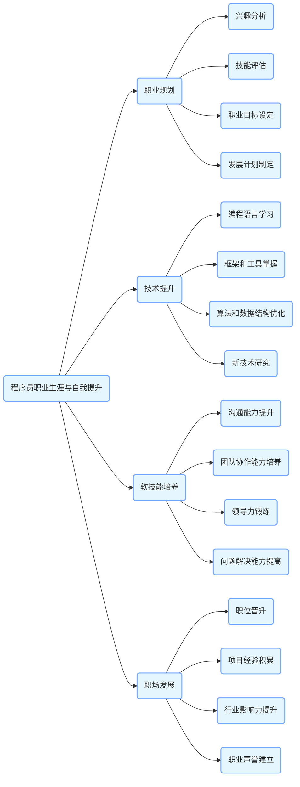

# 程序员的职业生涯与自我提升

> 关键词：程序员、职业生涯、自我提升、技术发展、职业规划

> 摘要：本文围绕程序员的职业生涯与自我提升展开深入探讨。首先介绍了相关背景信息，包括目的范围、预期读者等内容。接着阐述了程序员职业生涯涉及的核心概念及联系，详细讲解了相关核心算法原理和具体操作步骤，通过数学模型和公式进行进一步剖析。在项目实战部分，给出代码实际案例并做详细解释。还分析了程序员职业的实际应用场景，推荐了各类学习资源、开发工具框架以及相关论文著作。最后总结了未来发展趋势与挑战，解答常见问题并提供扩展阅读与参考资料，旨在为程序员的职业发展和自我提升提供全面且有价值的指导。

## 1. 背景介绍 
### 1.1 目的和范围
本文章的主要目的是为广大程序员群体提供一个全面且深入的职业发展与自我提升指南。随着信息技术的飞速发展，软件行业竞争日益激烈，程序员需要不断调整自己的职业规划，提升个人技能以适应市场变化。本文将涵盖程序员从初入职场到资深专家的整个职业生涯阶段，包括职业规划、技术提升、软技能培养、职场发展等多个方面的内容，旨在帮助程序员更好地了解自己的职业发展路径，掌握有效的自我提升方法，实现个人价值的最大化。

### 1.2 预期读者
本文预期读者主要是广大程序员群体，包括刚踏入编程领域的新手、有一定工作经验的中级程序员以及寻求职业突破的高级程序员。同时，对于计算机相关专业的学生、对编程职业感兴趣的人士以及关注软件行业发展的管理者也具有一定的参考价值。

### 1.3 文档结构概述
本文将按照以下结构进行组织：首先介绍相关背景信息，让读者对文章的目的、读者群体和结构有初步了解；接着阐述程序员职业生涯与自我提升涉及的核心概念及其联系，通过文本示意图和 Mermaid 流程图进行清晰展示；然后详细讲解核心算法原理和具体操作步骤，结合 Python 源代码进行深入剖析；再通过数学模型和公式进一步说明相关原理，并举例进行具体解释；在项目实战部分，给出实际代码案例并进行详细解读；分析程序员职业的实际应用场景；推荐各类学习资源、开发工具框架以及相关论文著作；最后总结未来发展趋势与挑战，解答常见问题并提供扩展阅读与参考资料。

### 1.4 术语表
#### 1.4.1 核心术语定义
- **程序员**：指从事程序开发、维护的专业人员，通过编写代码实现各种软件系统的功能。
- **职业生涯**：一个人在其职业生活中所经历的一系列职位、工作和职业发展阶段的总和。
- **自我提升**：个体为了提高自身的知识、技能、能力和素质等方面而进行的主动学习和发展活动。
- **技术栈**：指完成一项软件开发任务所需的一系列技术和工具的集合。
- **软技能**：相对于专业技术技能而言，包括沟通能力、团队协作能力、领导力、问题解决能力等非技术方面的能力。

#### 1.4.2 相关概念解释
- **职业规划**：个人根据自身的兴趣、能力和职业目标，对自己的职业生涯进行的规划和安排，包括确定职业方向、设定职业目标、制定发展计划等。
- **技术提升**：通过学习新的技术知识、掌握新的编程技巧和工具，提高自己的专业技术水平。
- **职业发展路径**：指程序员在职业生涯中可能经历的不同职位和阶段，如初级程序员、中级程序员、高级程序员、技术主管、架构师、CTO 等。

#### 1.4.3 缩略词列表
- **IDE**：Integrated Development Environment，集成开发环境。
- **API**：Application Programming Interface，应用程序编程接口。
- **SDK**：Software Development Kit，软件开发工具包。

## 2. 核心概念与联系 

### 核心概念原理
程序员的职业生涯与自我提升涉及多个核心概念，这些概念相互关联、相互影响。

- **职业规划**：是程序员职业生涯的蓝图，它基于个人的兴趣、技能、价值观和职业目标，帮助程序员确定自己的职业方向和发展路径。一个合理的职业规划可以使程序员在职业生涯中少走弯路，更有针对性地进行自我提升。
- **技术提升**：是程序员保持竞争力的关键。随着信息技术的快速发展，新的编程语言、框架和技术不断涌现，程序员需要不断学习和掌握新的技术知识，以适应市场的需求。技术提升不仅包括专业技术的学习，还包括解决问题的能力、算法设计能力等方面的提高。
- **软技能培养**：在现代软件开发中，软技能同样重要。良好的沟通能力可以使程序员更好地与团队成员、客户进行交流；团队协作能力可以提高项目的开发效率；领导力可以带领团队完成复杂的项目任务。软技能的培养可以帮助程序员在职业生涯中更好地发展，提升个人的综合竞争力。
- **职场发展**：包括职位晋升、项目经验积累、行业影响力提升等方面。职场发展是程序员职业生涯的重要目标之一，它与职业规划、技术提升和软技能培养密切相关。通过合理的职业规划、不断的技术提升和软技能培养，程序员可以获得更多的职场发展机会。

### 架构的文本示意图
```plaintext
程序员职业生涯与自我提升
├── 职业规划
│   ├── 兴趣分析
│   ├── 技能评估
│   ├── 职业目标设定
│   └── 发展计划制定
├── 技术提升
│   ├── 编程语言学习
│   ├── 框架和工具掌握
│   ├── 算法和数据结构优化
│   └── 新技术研究
├── 软技能培养
│   ├── 沟通能力提升
│   ├── 团队协作能力培养
│   ├── 领导力锻炼
│   └── 问题解决能力提高
└── 职场发展
    ├── 职位晋升
    ├── 项目经验积累
    ├── 行业影响力提升
    └── 职业声誉建立
```

### Mermaid 流程图


## 3. 核心算法原理 & 具体操作步骤 

### 职业规划算法原理与步骤
职业规划可以看作是一个多目标优化问题，需要综合考虑个人兴趣、技能、市场需求和职业目标等多个因素。以下是一个简化的职业规划算法的 Python 实现：

```python
# 定义个人兴趣、技能、市场需求和职业目标的权重
weights = {
    "interest": 0.3,
    "skill": 0.3,
    "market_demand": 0.2,
    "career_goal": 0.2
}

# 定义不同职业方向的评分
career_options = {
    "web_development": {
        "interest": 8,
        "skill": 7,
        "market_demand": 8,
        "career_goal": 7
    },
    "data_science": {
        "interest": 7,
        "skill": 6,
        "market_demand": 9,
        "career_goal": 6
    },
    "mobile_app_development": {
        "interest": 8,
        "skill": 7,
        "market_demand": 7,
        "career_goal": 7
    }
}

# 计算每个职业方向的综合得分
scores = {}
for career, details in career_options.items():
    score = (
        weights["interest"] * details["interest"] +
        weights["skill"] * details["skill"] +
        weights["market_demand"] * details["market_demand"] +
        weights["career_goal"] * details["career_goal"]
    )
    scores[career] = score

# 选择得分最高的职业方向
best_career = max(scores, key=scores.get)
print(f"推荐的职业方向是: {best_career}")
```

### 具体操作步骤
1. **兴趣分析**：通过自我评估、兴趣测试等方式，了解自己对不同技术领域和编程方向的兴趣程度。可以列出自己感兴趣的编程语言、项目类型和应用场景等。
2. **技能评估**：对自己现有的编程技能进行全面评估，包括编程语言掌握程度、算法和数据结构知识、项目开发经验等。可以使用在线编程测试、项目作品展示等方式进行评估。
3. **市场需求分析**：研究当前软件行业的发展趋势和市场需求，了解不同职业方向的就业前景和薪资水平。可以通过招聘网站、行业报告等渠道获取相关信息。
4. **职业目标设定**：根据自己的兴趣、技能和市场需求，设定明确的职业目标。职业目标可以分为短期目标（1 - 2 年）、中期目标（3 - 5 年）和长期目标（5 年以上）。
5. **发展计划制定**：根据职业目标，制定详细的发展计划。发展计划应包括学习计划、项目实践计划、技能提升计划等，确保自己能够逐步实现职业目标。

### 技术提升算法原理与步骤
技术提升可以看作是一个知识积累和技能训练的过程。以下是一个简单的技术提升算法的 Python 实现：

```python
# 定义初始技能水平
current_skill_level = 5

# 定义学习资源列表
learning_resources = [
    {"name": "在线课程", "difficulty": 3, "skill_increase": 2},
    {"name": "书籍", "difficulty": 4, "skill_increase": 3},
    {"name": "开源项目贡献", "difficulty": 5, "skill_increase": 4}
]

# 模拟学习过程
for resource in learning_resources:
    if current_skill_level >= resource["difficulty"]:
        current_skill_level += resource["skill_increase"]
        print(f"学习 {resource['name']} 后，技能水平提升到 {current_skill_level}")
    else:
        print(f"当前技能水平不足以学习 {resource['name']}")
```

### 具体操作步骤
1. **确定学习目标**：根据自己的职业规划和当前技术水平，确定需要学习的技术知识和技能。学习目标可以包括新的编程语言、框架、工具等。
2. **选择学习资源**：根据学习目标，选择合适的学习资源。学习资源可以包括在线课程、书籍、开源项目、技术博客等。
3. **制定学习计划**：根据学习资源的难度和自己的时间安排，制定详细的学习计划。学习计划应包括学习进度、学习方法、实践项目等。
4. **实践与应用**：在学习过程中，要注重实践与应用。可以通过完成实践项目、参与开源项目等方式，将所学的知识和技能应用到实际中，提高自己的编程能力。
5. **持续学习与更新**：技术在不断发展，程序员需要持续学习和更新自己的知识。可以关注行业动态、参加技术会议、阅读技术论文等方式，保持对新技术的敏感度。

### 软技能培养算法原理与步骤
软技能培养可以看作是一个行为习惯养成和人际交往能力提升的过程。以下是一个简单的软技能培养算法的 Python 实现：

```python
# 定义初始软技能水平
current_soft_skill_level = 5

# 定义软技能培养活动列表
soft_skill_activities = [
    {"name": "参加团队活动", "difficulty": 3, "skill_increase": 2},
    {"name": "进行演讲训练", "difficulty": 4, "skill_increase": 3},
    {"name": "参与项目管理", "difficulty": 5, "skill_increase": 4}
]

# 模拟软技能培养过程
for activity in soft_skill_activities:
    if current_soft_skill_level >= activity["difficulty"]:
        current_soft_skill_level += activity["skill_increase"]
        print(f"参加 {activity['name']} 后，软技能水平提升到 {current_soft_skill_level}")
    else:
        print(f"当前软技能水平不足以参加 {activity['name']}")
```

### 具体操作步骤
1. **自我评估**：对自己的软技能进行全面评估，了解自己在沟通能力、团队协作能力、领导力等方面的优势和不足。可以通过自我反思、同事评价等方式进行评估。
2. **设定目标**：根据自我评估的结果，设定明确的软技能提升目标。软技能提升目标可以分为短期目标（1 - 2 个月）、中期目标（3 - 6 个月）和长期目标（6 个月以上）。
3. **选择培养方法**：根据软技能提升目标，选择合适的培养方法。培养方法可以包括参加培训课程、阅读相关书籍、进行实践锻炼等。
4. **实践与反馈**：在软技能培养过程中，要注重实践与反馈。可以通过参与团队项目、与同事沟通交流等方式，将所学的软技能应用到实际中，并及时获取反馈，不断改进自己的软技能。
5. **持续改进**：软技能的提升是一个长期的过程，需要持续改进。可以定期对自己的软技能进行评估和总结，调整培养方法和目标，不断提高自己的软技能水平。

## 4. 数学模型和公式 & 详细讲解 & 举例说明 

### 职业规划数学模型
职业规划可以用一个加权求和的数学模型来表示。设个人兴趣、技能、市场需求和职业目标的权重分别为 $w_1, w_2, w_3, w_4$，且 $w_1 + w_2 + w_3 + w_4 = 1$。对于每个职业方向 $i$，其在兴趣、技能、市场需求和职业目标方面的得分分别为 $x_{i1}, x_{i2}, x_{i3}, x_{i4}$，则该职业方向的综合得分 $S_i$ 可以表示为：

$$S_i = w_1x_{i1} + w_2x_{i2} + w_3x_{i3} + w_4x_{i4}$$

选择综合得分最高的职业方向作为推荐的职业方向。

### 详细讲解
这个数学模型的核心思想是综合考虑多个因素对职业选择的影响。权重的设置反映了每个因素在职业选择中的重要程度。通过加权求和的方式，可以将不同因素的得分进行综合，得到一个全面的评价指标。

### 举例说明
假设个人兴趣、技能、市场需求和职业目标的权重分别为 $w_1 = 0.3, w_2 = 0.3, w_3 = 0.2, w_4 = 0.2$。有两个职业方向：Web 开发和数据科学，它们在各个因素上的得分如下表所示：

| 职业方向 | 兴趣得分 $x_{i1}$ | 技能得分 $x_{i2}$ | 市场需求得分 $x_{i3}$ | 职业目标得分 $x_{i4}$ |
| ---- | ---- | ---- | ---- | ---- |
| Web 开发 | 8 | 7 | 8 | 7 |
| 数据科学 | 7 | 6 | 9 | 6 |

则 Web 开发的综合得分 $S_1$ 为：

$$S_1 = 0.3\times8 + 0.3\times7 + 0.2\times8 + 0.2\times7 = 2.4 + 2.1 + 1.6 + 1.4 = 7.5$$

数据科学的综合得分 $S_2$ 为：

$$S_2 = 0.3\times7 + 0.3\times6 + 0.2\times9 + 0.2\times6 = 2.1 + 1.8 + 1.8 + 1.2 = 6.9$$

因为 $S_1 > S_2$，所以推荐的职业方向是 Web 开发。

### 技术提升数学模型
技术提升可以用一个累加的数学模型来表示。设初始技能水平为 $S_0$，学习第 $i$ 个学习资源后技能水平的提升量为 $\Delta S_i$，则学习 $n$ 个学习资源后技能水平 $S_n$ 可以表示为：

$$S_n = S_0 + \sum_{i = 1}^{n} \Delta S_i$$

### 详细讲解
这个数学模型的核心思想是技能水平的提升是一个逐步积累的过程。每次学习一个新的学习资源，技能水平就会相应地增加一定的量。通过累加这些提升量，可以得到最终的技能水平。

### 举例说明
假设初始技能水平 $S_0 = 5$，有三个学习资源，它们的技能提升量分别为 $\Delta S_1 = 2, \Delta S_2 = 3, \Delta S_3 = 4$。则学习这三个学习资源后技能水平 $S_3$ 为：

$$S_3 = 5 + 2 + 3 + 4 = 14$$

### 软技能培养数学模型
软技能培养也可以用一个累加的数学模型来表示。设初始软技能水平为 $S_0$，参加第 $i$ 个软技能培养活动后软技能水平的提升量为 $\Delta S_i$，则参加 $n$ 个软技能培养活动后软技能水平 $S_n$ 可以表示为：

$$S_n = S_0 + \sum_{i = 1}^{n} \Delta S_i$$

### 详细讲解
这个数学模型的核心思想与技术提升的数学模型类似，软技能水平的提升也是一个逐步积累的过程。每次参加一个新的软技能培养活动，软技能水平就会相应地增加一定的量。通过累加这些提升量，可以得到最终的软技能水平。

### 举例说明
假设初始软技能水平 $S_0 = 5$，有三个软技能培养活动，它们的软技能提升量分别为 $\Delta S_1 = 2, \Delta S_2 = 3, \Delta S_3 = 4$。则参加这三个软技能培养活动后软技能水平 $S_3$ 为：

$$S_3 = 5 + 2 + 3 + 4 = 14$$

## 5. 项目实战：代码实际案例和详细解释说明 

### 5.1  开发环境搭建
在这个项目实战中，我们将以一个简单的 Web 应用开发为例，介绍开发环境的搭建过程。我们将使用 Python 的 Flask 框架来开发 Web 应用。

#### 安装 Python
首先，需要安装 Python 环境。可以从 Python 官方网站（https://www.python.org/downloads/） 下载适合自己操作系统的 Python 安装包，并按照安装向导进行安装。

#### 安装 Flask
安装完 Python 后，可以使用 pip 工具来安装 Flask 框架。打开命令行终端，输入以下命令：

```sh
pip install flask
```

#### 安装开发工具
可以选择自己喜欢的开发工具，如 PyCharm、VS Code 等。这里以 VS Code 为例，从 VS Code 官方网站（https://code.visualstudio.com/） 下载并安装 VS Code。安装完成后，在 VS Code 中安装 Python 扩展，以便更好地进行 Python 开发。

### 5.2  源代码详细实现和代码解读
以下是一个简单的 Flask Web 应用的源代码：

```python
from flask import Flask

# 创建 Flask 应用实例
app = Flask(__name__)

# 定义路由和视图函数
@app.route('/')
def index():
    return 'Hello, World!'

# 启动应用
if __name__ == '__main__':
    app.run(debug=True)
```

### 代码解读
1. **导入 Flask 模块**：`from flask import Flask` 这行代码导入了 Flask 类，用于创建 Flask 应用实例。
2. **创建 Flask 应用实例**：`app = Flask(__name__)` 这行代码创建了一个 Flask 应用实例，`__name__` 是 Python 中的一个特殊变量，表示当前模块的名称。
3. **定义路由和视图函数**：`@app.route('/')` 是一个装饰器，用于定义路由。`/` 表示根路径。`def index():` 定义了一个视图函数，当用户访问根路径时，会执行这个函数。`return 'Hello, World!'` 返回一个字符串作为响应。
4. **启动应用**：`if __name__ == '__main__':` 这行代码确保应用只在直接运行脚本时启动。`app.run(debug=True)` 启动 Flask 应用，并开启调试模式。

### 5.3  代码解读与分析
这个简单的 Flask Web 应用展示了 Flask 框架的基本使用方法。通过定义路由和视图函数，可以处理用户的请求并返回相应的响应。调试模式可以帮助我们在开发过程中快速定位和解决问题。

在实际开发中，我们可以进一步扩展这个应用，例如添加更多的路由、处理表单数据、连接数据库等。以下是一个扩展后的示例：

```python
from flask import Flask, request

# 创建 Flask 应用实例
app = Flask(__name__)

# 定义路由和视图函数
@app.route('/')
def index():
    return 'Welcome to the Flask App!'

@app.route('/hello', methods=['GET', 'POST'])
def hello():
    if request.method == 'GET':
        return 'This is a GET request.'
    elif request.method == 'POST':
        name = request.form.get('name')
        if name:
            return f'Hello, {name}!'
        else:
            return 'Please provide a name.'

# 启动应用
if __name__ == '__main__':
    app.run(debug=True)
```

### 代码解读
1. **导入 request 模块**：`from flask import Flask, request` 导入了 `request` 模块，用于处理用户的请求数据。
2. **定义新的路由和视图函数**：`@app.route('/hello', methods=['GET', 'POST'])` 定义了一个新的路由 `/hello`，支持 GET 和 POST 请求。`if request.method == 'GET':` 判断请求方法是否为 GET，如果是则返回相应的信息。`elif request.method == 'POST':` 判断请求方法是否为 POST，如果是则获取表单数据中的 `name` 字段，并返回相应的问候信息。
3. **处理表单数据**：`name = request.form.get('name')` 获取表单数据中的 `name` 字段。如果存在则返回问候信息，否则提示用户提供姓名。

通过这个扩展后的示例，我们可以看到如何处理不同类型的请求和表单数据，进一步提升了应用的功能。

## 6. 实际应用场景 
### 软件开发
程序员在软件开发领域有着广泛的应用场景。他们可以参与各种类型的软件项目开发，如 Web 应用、移动应用、桌面应用、游戏开发等。在软件开发过程中，程序员需要负责需求分析、设计、编码、测试和维护等各个环节，确保软件系统的质量和性能。

### 数据分析与人工智能
随着大数据和人工智能技术的发展，程序员在数据分析和人工智能领域的需求也越来越大。他们可以使用 Python、R 等编程语言和相关的库和框架，进行数据挖掘、机器学习、深度学习等方面的开发和研究。例如，程序员可以开发智能推荐系统、图像识别系统、自然语言处理系统等。

### 云计算与大数据
云计算和大数据技术的兴起，为程序员带来了新的机遇和挑战。程序员可以参与云计算平台的开发和维护，如 Amazon Web Services（AWS）、Microsoft Azure、Google Cloud Platform（GCP）等。他们还可以进行大数据处理和分析，如使用 Hadoop、Spark 等框架处理海量数据。

### 金融科技
金融科技领域对程序员的需求也在不断增加。程序员可以参与金融交易系统、风险管理系统、支付系统等的开发和维护。他们需要具备扎实的编程技能和金融知识，确保金融系统的安全和稳定运行。

### 物联网
物联网技术的发展使得万物互联成为可能。程序员可以参与物联网设备的开发和管理，如智能家居、智能交通、工业物联网等。他们需要掌握嵌入式系统开发、传感器技术、通信协议等方面的知识，实现设备之间的互联互通和数据传输。

## 7. 工具和资源推荐
### 7.1 学习资源推荐
#### 7.1.1 书籍推荐
- 《Python 编程：从入门到实践》：适合初学者学习 Python 编程语言，通过实际项目案例帮助读者快速掌握 Python 编程的基本技巧。
- 《Effective Java》：经典的 Java 编程书籍，介绍了 Java 编程的最佳实践和设计模式，帮助读者提高 Java 编程水平。
- 《算法导论》：计算机科学领域的经典教材，详细介绍了各种算法和数据结构的原理和实现，是程序员提升算法能力的必备书籍。
- 《代码大全》：涵盖了软件开发的各个方面，包括代码设计、编程规范、调试技巧等，是程序员提高软件开发质量的重要参考书籍。
- 《人月神话》：探讨了软件开发项目管理中的问题和挑战，对程序员了解项目管理和团队协作有很大的帮助。

#### 7.1.2 在线课程
- Coursera：提供了丰富的计算机科学和编程相关的在线课程，如 Python 编程、数据结构与算法、机器学习等。课程由世界各地的知名大学和机构提供，质量有保障。
- edX：同样是一个优秀的在线学习平台，提供了众多与编程和计算机科学相关的课程。课程内容涵盖了从基础编程到高级技术的各个领域。
- Udemy：有大量的编程课程可供选择，课程价格相对较为亲民。其中不乏一些由行业专家录制的高质量课程，适合不同水平的程序员学习。
- 中国大学 MOOC：国内知名的在线学习平台，提供了许多国内高校的计算机科学和编程相关课程。课程内容结合了国内的教学特点和实际需求，对国内程序员有很大的帮助。

#### 7.1.3 技术博客和网站
- Medium：一个开放的技术博客平台，有许多知名的程序员和技术专家在上面分享自己的经验和见解。可以关注一些与编程和软件开发相关的主题，获取最新的技术动态和学习资源。
- Stack Overflow：全球最大的程序员社区之一，程序员可以在上面提问、回答问题、分享代码和经验。遇到编程问题时，Stack Overflow 是一个很好的求助和学习平台。
- GitHub：一个开源代码托管平台，上面有许多优秀的开源项目和代码库。可以通过学习和参与开源项目，提高自己的编程能力和技术水平。
- 阮一峰的网络日志：国内知名的技术博客，作者阮一峰在计算机科学和编程领域有很深的造诣。博客内容涵盖了 JavaScript、前端开发、网络协议等多个方面，对程序员有很大的启发和帮助。

### 7.2 开发工具框架推荐
#### 7.2.1 IDE和编辑器
- PyCharm：专门为 Python 开发设计的集成开发环境，具有强大的代码编辑、调试、代码分析等功能。适合 Python 开发人员使用。
- Visual Studio Code：一款轻量级的代码编辑器，支持多种编程语言和插件扩展。具有丰富的插件生态系统，可以根据自己的需求进行定制。
- IntelliJ IDEA：一款功能强大的 Java 集成开发环境，提供了智能代码提示、代码重构、调试等功能。是 Java 开发人员的首选工具之一。
- Eclipse：一个开源的集成开发环境，支持多种编程语言和开发领域。具有丰富的插件和扩展功能，广泛应用于 Java、C++、Python 等开发。

#### 7.2.2 调试和性能分析工具
- pdb：Python 自带的调试器，可以帮助程序员在代码中设置断点、单步执行、查看变量值等，方便调试 Python 代码。
- Chrome DevTools：一款强大的浏览器调试工具，可用于调试前端代码，包括 HTML、CSS、JavaScript 等。可以查看页面元素、调试 JavaScript 代码、分析性能等。
- VisualVM：一款 Java 性能分析工具，可以监控 Java 应用程序的内存使用、线程状态、CPU 性能等。帮助开发人员找出性能瓶颈和优化代码。
- Profiler：许多编程语言和开发工具都提供了性能分析功能，如 Python 的 cProfile 模块、Java 的 VisualVM 等。可以通过性能分析工具找出代码中的性能瓶颈，进行优化。

#### 7.2.3 相关框架和库
- Flask：一个轻量级的 Python Web 框架，适合快速开发小型 Web 应用。具有简单易用、灵活可扩展的特点。
- Django：一个功能强大的 Python Web 框架，提供了丰富的功能和工具，如数据库管理、用户认证、表单处理等。适合开发大型 Web 应用。
- React：一个用于构建用户界面的 JavaScript 库，由 Facebook 开发和维护。具有高效、灵活、可复用的特点，广泛应用于前端开发。
- TensorFlow：一个开源的机器学习框架，由 Google 开发和维护。提供了丰富的机器学习算法和工具，可用于开发各种机器学习模型。
- NumPy：一个 Python 科学计算库，提供了高效的多维数组对象和各种数学函数。是 Python 数据分析和科学计算的基础库之一。

### 7.3 相关论文著作推荐
#### 7.3.1 经典论文
- 《The Cathedral and the Bazaar》：探讨了开源软件开发的模式和理念，对理解开源社区和开源项目的发展有很大的帮助。
- 《A Mathematical Theory of Communication》：信息论的经典论文，由克劳德·香农（Claude Shannon）发表。该论文奠定了现代通信理论的基础，对计算机科学和信息技术的发展产生了深远的影响。
- 《RSA 公钥加密算法》：介绍了 RSA 公钥加密算法的原理和实现，是现代密码学的重要成果之一。该算法在信息安全领域有着广泛的应用。

#### 7.3.2 最新研究成果
- 可以关注顶级计算机科学会议和期刊的最新研究成果，如 ACM SIGPLAN、IEEE Transactions on Software Engineering 等。这些会议和期刊发表了许多关于编程语言、软件工程、人工智能等领域的最新研究成果。
- 还可以关注一些知名的研究机构和学者的最新研究动态，如 MIT 计算机科学与人工智能实验室（CSAIL）、斯坦福大学计算机科学系等。

#### 7.3.3 应用案例分析
- 《Lean Software Development: An Agile Toolkit》：介绍了精益软件开发的方法和实践，通过实际案例分析展示了如何提高软件开发的效率和质量。
- 《Building Microservices》：探讨了微服务架构的设计和实现，通过实际案例分析展示了微服务架构在软件开发中的应用和优势。

## 8. 总结：未来发展趋势与挑战
### 未来发展趋势
#### 人工智能与机器学习的融合
随着人工智能和机器学习技术的不断发展，它们将与编程更加紧密地融合。程序员需要掌握人工智能和机器学习的基本原理和算法，能够开发出智能的软件系统和应用。例如，智能推荐系统、图像识别系统、自然语言处理系统等将在各个领域得到广泛应用。

#### 云计算与边缘计算的发展
云计算和边缘计算技术的发展将改变软件开发和部署的模式。程序员需要了解云计算和边缘计算的架构和原理，能够开发出适应云计算和边缘计算环境的软件系统。例如，基于云平台的分布式应用、边缘计算设备上的智能应用等将成为未来的发展方向。

#### 物联网的普及
物联网技术的普及将带来大量的编程需求。程序员需要掌握嵌入式系统开发、传感器技术、通信协议等方面的知识，能够开发出物联网设备和应用。例如，智能家居、智能交通、工业物联网等领域将需要大量的程序员进行开发和维护。

#### 低代码/无代码开发的兴起
低代码/无代码开发平台的兴起将降低编程的门槛，使得更多非专业程序员也能够参与到软件开发中来。程序员需要适应这种变化，学习如何使用低代码/无代码开发平台，提高软件开发的效率和质量。

### 挑战
#### 技术更新换代快
信息技术的发展日新月异，新的编程语言、框架和技术不断涌现。程序员需要不断学习和更新自己的知识，以适应技术的变化。这对程序员的学习能力和学习动力提出了很高的要求。

#### 竞争压力大
随着软件行业的发展，程序员的数量不断增加，竞争也越来越激烈。程序员需要不断提升自己的技术水平和综合能力，以在竞争中脱颖而出。这对程序员的职业发展和自我提升带来了一定的压力。

#### 安全与隐私问题
随着信息技术的发展，安全与隐私问题越来越受到关注。程序员需要在开发过程中充分考虑安全与隐私问题，采取有效的措施保护用户的信息安全。这对程序员的安全意识和技术能力提出了更高的要求。

#### 团队协作与沟通
现代软件开发往往需要团队协作，程序员需要与不同背景的人员进行沟通和协作。良好的团队协作和沟通能力对于项目的成功至关重要。然而，团队协作和沟通能力的培养需要时间和经验的积累，这对程序员来说也是一个挑战。

## 9. 附录：常见问题与解答
### 问题 1：如何选择适合自己的编程语言？
解答：选择适合自己的编程语言需要考虑多个因素，如个人兴趣、职业规划、应用场景等。如果你对 Web 开发感兴趣，可以选择 Python、JavaScript 等；如果你对移动应用开发感兴趣，可以选择 Java、Kotlin、Swift 等；如果你对数据分析和人工智能感兴趣，可以选择 Python、R 等。此外，还可以参考市场需求和行业趋势，选择一些热门的编程语言进行学习。

### 问题 2：如何提高自己的编程能力？
解答：提高编程能力需要不断学习和实践。可以通过阅读优秀的代码、参与开源项目、完成实践项目等方式来提高自己的编程能力。同时，还可以学习算法和数据结构、设计模式等基础知识，提高自己的编程思维和解决问题的能力。此外，参加技术培训、阅读技术书籍和博客、与其他程序员交流等也有助于提高编程能力。

### 问题 3：如何进行职业规划？
解答：进行职业规划需要综合考虑个人兴趣、技能、市场需求和职业目标等因素。可以先对自己进行全面的评估，了解自己的优势和不足。然后根据市场需求和行业趋势，确定自己的职业方向和目标。接着制定详细的发展计划，包括学习计划、项目实践计划、技能提升计划等。在职业发展过程中，要不断调整和优化自己的职业规划，以适应市场的变化。

### 问题 4：如何培养软技能？
解答：培养软技能可以通过多种方式进行。可以参加培训课程，学习沟通技巧、团队协作技巧、领导力等方面的知识。还可以通过参与团队项目、与同事沟通交流等方式，将所学的软技能应用到实际中，并及时获取反馈，不断改进自己的软技能。此外，阅读相关书籍、进行自我反思等也有助于培养软技能。

### 问题 5：如何应对技术更新换代快的问题？
解答：应对技术更新换代快的问题，需要保持学习的热情和动力。可以关注行业动态、参加技术会议、阅读技术论文等方式，及时了解新技术的发展趋势。同时，要不断学习和掌握新的技术知识，提高自己的学习能力和适应能力。此外，还可以参与开源项目、与其他程序员交流等，拓宽自己的技术视野。

## 10. 扩展阅读 & 参考资料
### 扩展阅读
- 《程序员的职业素养》：这本书强调了程序员在职业生涯中应具备的职业素养和道德规范，对程序员的职业发展有很大的启示作用。
- 《软技能：代码之外的生存指南》：介绍了程序员在代码之外需要掌握的各种软技能，如沟通、学习、时间管理等，帮助程序员全面提升自己的能力。
- 《浪潮之巅》：讲述了信息技术产业的发展历程和兴衰变迁，让读者了解行业的发展趋势和规律，对程序员的职业规划有一定的参考价值。

### 参考资料
- Python 官方文档：https://docs.python.org/
- Flask 官方文档：https://flask.palletsprojects.com/
- React 官方文档：https://reactjs.org/
- TensorFlow 官方文档：https://www.tensorflow.org/
- ACM 官方网站：https://www.acm.org/
- IEEE 官方网站：https://www.ieee.org/