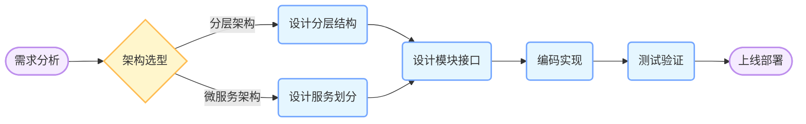

# 程序员的职业转型：从编码到架构

> 关键词：程序员、职业转型、编码、架构、技术能力、管理能力

> 摘要：本文围绕程序员从编码到架构的职业转型展开，深入探讨这一转型的背景、核心概念、算法原理、数学模型等多方面内容。详细介绍了转型过程中所需的技术和管理能力，通过项目实战案例展示转型后的实际操作，分析了在不同应用场景中的作用。同时推荐了相关的学习资源、开发工具和论文著作，最后对未来的发展趋势与挑战进行总结，并解答常见问题，为程序员的职业转型提供全面且深入的指导。

## 1. 背景介绍 
### 1.1 目的和范围
随着软件行业的不断发展，程序员的职业路径也在逐渐多元化。从编码到架构的转型是许多有追求的程序员的目标。本文的目的在于为广大程序员提供全面的指导，帮助他们了解从编码到架构转型的各个方面，包括所需的知识、技能、思维方式的转变等。范围涵盖了转型的理论基础、实践操作、应用场景以及未来发展趋势等多个维度，旨在为程序员的职业转型提供一站式的参考。

### 1.2 预期读者
本文主要面向有一定编程经验，渴望实现职业晋升，从单纯的编码工作向软件架构设计方向发展的程序员。同时，对于软件行业的管理者、技术爱好者以及正在学习编程的学生，也能从中获取有价值的信息，了解软件架构师的工作内容和职业发展路径。

### 1.3 文档结构概述
本文将按照以下结构展开：首先介绍核心概念与联系，帮助读者理解编码和架构的区别与联系；接着阐述核心算法原理和具体操作步骤，结合Python代码进行详细说明；然后讲解数学模型和公式，并举例说明其在架构设计中的应用；通过项目实战展示转型后的实际操作和代码实现；分析实际应用场景，让读者了解架构师的工作价值；推荐相关的工具和资源，助力读者学习和实践；总结未来发展趋势与挑战；最后在附录中解答常见问题，并提供扩展阅读和参考资料。

### 1.4 术语表
#### 1.4.1 核心术语定义
- **程序员**：从事程序开发、维护的专业人员，主要负责编写代码实现具体的功能。
- **软件架构师**：负责软件系统的整体设计，包括系统的结构、模块划分、接口定义、数据流向等，确保系统的可扩展性、可维护性和性能等方面的质量。
- **编码**：使用某种编程语言将软件需求转化为计算机可执行的代码的过程。
- **架构设计**：对软件系统进行高层次的规划和设计，确定系统的整体框架和各个组成部分之间的关系。

#### 1.4.2 相关概念解释
- **模块化设计**：将软件系统分解为多个独立的模块，每个模块具有特定的功能，模块之间通过接口进行交互。这样可以提高系统的可维护性和可扩展性。
- **分层架构**：将软件系统按照功能划分为不同的层次，如表示层、业务逻辑层、数据访问层等，各层之间具有明确的职责和依赖关系。分层架构可以提高系统的可维护性和可测试性。
- **微服务架构**：将一个大型的软件系统拆分为多个小型的、自治的服务，每个服务可以独立开发、部署和运行。微服务架构可以提高系统的灵活性和可扩展性。

#### 1.4.3 缩略词列表
- **API**：Application Programming Interface，应用程序编程接口，用于不同软件组件之间的通信。
- **MVC**：Model-View-Controller，模型-视图-控制器，一种常见的软件架构模式。
- **REST**：Representational State Transfer，表述性状态转移，一种用于设计网络应用程序的架构风格。

## 2. 核心概念与联系 

### 2.1 编码与架构的区别
编码主要关注于具体功能的实现，程序员需要根据需求文档和设计文档，使用编程语言编写代码，实现各种业务逻辑。编码工作注重细节，需要对编程语言和相关技术有深入的了解，能够处理各种具体的技术问题。

而架构设计则是从更高的层面来考虑软件系统的整体结构和性能。架构师需要对软件系统的需求有全面的理解，包括功能需求、性能需求、可维护性需求等，然后设计出一个合理的架构，确保系统能够满足这些需求。架构设计更注重系统的整体规划和布局，需要考虑系统的可扩展性、可维护性、性能、安全性等多个方面。

### 2.2 编码与架构的联系
编码是架构的具体实现，架构设计的好坏直接影响到编码的难度和质量。一个好的架构设计可以为编码提供清晰的指导，使得程序员能够更加高效地编写代码，并且保证代码的可维护性和可扩展性。

同时，编码过程中积累的经验也可以为架构设计提供参考。程序员在实际编码过程中会遇到各种问题，这些问题可以反馈给架构师，帮助架构师改进架构设计。

### 2.3 核心概念原理和架构的文本示意图
以下是一个简单的软件系统架构的文本示意图：

```plaintext
软件系统
├── 表示层
│   ├── 前端页面
│   ├── 接口服务
├── 业务逻辑层
│   ├── 业务处理模块
│   ├── 规则引擎
├── 数据访问层
│   ├── 数据库操作
│   ├── 缓存操作
├── 基础设施层
│   ├── 服务器
│   ├── 网络设备
│   ├── 存储设备
```

### 2.4 Mermaid 流程图


## 3. 核心算法原理 & 具体操作步骤 

### 3.1 架构设计中的算法原理
在架构设计中，有许多算法和技术可以帮助我们优化系统的性能和可扩展性。例如，负载均衡算法可以将请求均匀地分配到多个服务器上，提高系统的并发处理能力；缓存算法可以减少对数据库的访问，提高系统的响应速度。

下面以一个简单的缓存算法——最近最少使用（LRU）算法为例，介绍其原理和实现。

#### 3.1.1 LRU 算法原理
LRU 算法的基本思想是，当缓存空间满时，优先淘汰最近最少使用的数据。它通过一个双向链表和一个哈希表来实现，双向链表用于维护数据的访问顺序，哈希表用于快速查找数据。

### 3.2 Python 代码实现
```python
class DLinkedNode:
    def __init__(self, key=0, value=0):
        self.key = key
        self.value = value
        self.prev = None
        self.next = None

class LRUCache:
    def __init__(self, capacity: int):
        self.cache = {}
        self.size = 0
        self.capacity = capacity
        self.head = DLinkedNode()
        self.tail = DLinkedNode()
        self.head.next = self.tail
        self.tail.prev = self.head

    def _add_to_head(self, node):
        node.prev = self.head
        node.next = self.head.next
        self.head.next.prev = node
        self.head.next = node

    def _remove_node(self, node):
        node.prev.next = node.next
        node.next.prev = node.prev

    def _move_to_head(self, node):
        self._remove_node(node)
        self._add_to_head(node)

    def _remove_tail(self):
        node = self.tail.prev
        self._remove_node(node)
        return node

    def get(self, key: int) -> int:
        if key not in self.cache:
            return -1
        node = self.cache[key]
        self._move_to_head(node)
        return node.value

    def put(self, key: int, value: int) -> None:
        if key in self.cache:
            node = self.cache[key]
            node.value = value
            self._move_to_head(node)
        else:
            node = DLinkedNode(key, value)
            self.cache[key] = node
            self._add_to_head(node)
            self.size += 1
            if self.size > self.capacity:
                removed = self._remove_tail()
                self.cache.pop(removed.key)
                self.size -= 1
```

### 3.3 具体操作步骤
1. **需求分析**：明确系统的功能需求、性能需求、可维护性需求等。
2. **架构选型**：根据需求选择合适的架构模式，如分层架构、微服务架构等。
3. **模块设计**：将系统划分为多个模块，明确每个模块的功能和职责。
4. **接口设计**：设计模块之间的接口，确保模块之间的通信和协作。
5. **算法选择**：根据系统的性能需求，选择合适的算法和数据结构，如缓存算法、排序算法等。
6. **编码实现**：按照架构设计和模块划分，编写代码实现系统的各个功能。
7. **测试验证**：对系统进行测试，验证系统是否满足需求和设计要求。
8. **上线部署**：将系统部署到生产环境中，正式投入使用。

## 4. 数学模型和公式 & 详细讲解 & 举例说明 

### 4.1 复杂度分析
在架构设计中，复杂度分析是非常重要的，它可以帮助我们评估算法和系统的性能。常见的复杂度分析包括时间复杂度和空间复杂度。

#### 4.1.1 时间复杂度
时间复杂度表示算法执行所需的时间与输入规模之间的关系。常见的时间复杂度有 $O(1)$、$O(log n)$、$O(n)$、$O(n log n)$、$O(n^2)$ 等。

例如，对于一个简单的数组查找算法，其时间复杂度为 $O(n)$，因为在最坏情况下，需要遍历整个数组才能找到目标元素。

```python
def linear_search(arr, target):
    for i in range(len(arr)):
        if arr[i] == target:
            return i
    return -1
```

#### 4.1.2 空间复杂度
空间复杂度表示算法执行所需的额外空间与输入规模之间的关系。常见的空间复杂度有 $O(1)$、$O(n)$、$O(n^2)$ 等。

例如，对于一个简单的数组反转算法，其空间复杂度为 $O(1)$，因为只需要常数级的额外空间。

```python
def reverse_array(arr):
    left, right = 0, len(arr) - 1
    while left < right:
        arr[left], arr[right] = arr[right], arr[left]
        left += 1
        right -= 1
    return arr
```

### 4.2 性能指标
在架构设计中，还有一些其他的性能指标，如吞吐量、响应时间、并发用户数等。

#### 4.2.1 吞吐量
吞吐量表示系统在单位时间内能够处理的请求数量。计算公式为：

$$吞吐量 = \frac{请求数量}{处理时间}$$

例如，一个系统在 10 秒内处理了 100 个请求，则其吞吐量为 10 个请求/秒。

#### 4.2.2 响应时间
响应时间表示系统从接收到请求到返回响应所需的时间。响应时间越短，用户体验越好。

#### 4.2.3 并发用户数
并发用户数表示系统在同一时刻能够处理的用户请求数量。并发用户数越大，系统的并发处理能力越强。

### 4.3 举例说明
假设我们要设计一个简单的电商系统，需要考虑系统的性能指标。我们可以通过以下步骤进行分析：

1. **需求分析**：确定系统的功能需求和性能需求，如每天的订单数量、并发用户数等。
2. **架构设计**：选择合适的架构模式，如分层架构、微服务架构等，并设计系统的模块和接口。
3. **算法选择**：选择合适的算法和数据结构，如缓存算法、排序算法等，以提高系统的性能。
4. **性能测试**：使用性能测试工具对系统进行测试，收集系统的性能指标数据。
5. **优化调整**：根据性能测试结果，对系统进行优化调整，如增加服务器、优化算法等。

通过以上步骤，我们可以设计出一个性能良好的电商系统。

## 5. 项目实战：代码实际案例和详细解释说明 

### 5.1  开发环境搭建
#### 5.1.1 操作系统
选择合适的操作系统，如 Linux、Windows 等。这里我们以 Linux 为例，推荐使用 Ubuntu 18.04 或更高版本。

#### 5.1.2 编程语言和框架
选择合适的编程语言和框架，如 Python、Java、Spring Boot 等。这里我们以 Python 和 Flask 框架为例。

#### 5.1.3 数据库
选择合适的数据库，如 MySQL、PostgreSQL、MongoDB 等。这里我们以 MySQL 为例。

#### 5.1.4 安装步骤
1. **安装 Python**：可以从 Python 官方网站下载并安装 Python 3.7 或更高版本。
2. **安装 Flask**：使用 pip 命令安装 Flask 框架。
```bash
pip install flask
```
3. **安装 MySQL**：可以从 MySQL 官方网站下载并安装 MySQL 8.0 或更高版本。
4. **安装 MySQL 驱动**：使用 pip 命令安装 MySQL 驱动。
```bash
pip install mysql-connector-python
```

### 5.2  源代码详细实现和代码解读
#### 5.2.1 项目结构
```plaintext
project/
├── app.py
├── config.py
├── models.py
├── templates/
│   ├── index.html
├── static/
│   ├── css/
│   │   ├── style.css
│   ├── js/
│   │   ├── script.js
```

#### 5.2.2 代码实现
**config.py**
```python
import os

# 数据库配置
DB_HOST = os.getenv('DB_HOST', 'localhost')
DB_PORT = os.getenv('DB_PORT', '3306')
DB_USER = os.getenv('DB_USER', 'root')
DB_PASSWORD = os.getenv('DB_PASSWORD', 'password')
DB_NAME = os.getenv('DB_NAME', 'test')

# 数据库连接字符串
SQLALCHEMY_DATABASE_URI = f'mysql+mysqlconnector://{DB_USER}:{DB_PASSWORD}@{DB_HOST}:{DB_PORT}/{DB_NAME}'
SQLALCHEMY_TRACK_MODIFICATIONS = False
```

**models.py**
```python
from flask_sqlalchemy import SQLAlchemy

db = SQLAlchemy()

class User(db.Model):
    id = db.Column(db.Integer, primary_key=True)
    name = db.Column(db.String(50))
    email = db.Column(db.String(50), unique=True)

    def __repr__(self):
        return f'<User {self.name}>'
```

**app.py**
```python
from flask import Flask, render_template
from config import SQLALCHEMY_DATABASE_URI, SQLALCHEMY_TRACK_MODIFICATIONS
from models import db, User

app = Flask(__name__)
app.config['SQLALCHEMY_DATABASE_URI'] = SQLALCHEMY_DATABASE_URI
app.config['SQLALCHEMY_TRACK_MODIFICATIONS'] = SQLALCHEMY_TRACK_MODIFICATIONS

db.init_app(app)

@app.route('/')
def index():
    users = User.query.all()
    return render_template('index.html', users=users)

if __name__ == '__main__':
    with app.app_context():
        db.create_all()
    app.run(debug=True)
```

**templates/index.html**
```html
<!DOCTYPE html>
<html lang="en">
<head>
    <meta charset="UTF-8">
    <title>User List</title>
    <link rel="stylesheet" href="{{ url_for('static', filename='css/style.css') }}">
</head>
<body>
    <h1>User List</h1>
    <ul>
        
            <li>{{ user.name }} - {{ user.email }}</li>
        
    </ul>
    <script src="{{ url_for('static', filename='js/script.js') }}"></script>
</body>
</html>
```

#### 5.2.3 代码解读
- **config.py**：配置文件，用于存储数据库连接信息和其他配置项。
- **models.py**：定义数据库模型，使用 SQLAlchemy 框架进行数据库操作。
- **app.py**：主应用文件，创建 Flask 应用实例，初始化数据库，定义路由和视图函数。
- **templates/index.html**：模板文件，用于渲染用户列表页面。

### 5.3  代码解读与分析
#### 5.3.1 架构分析
该项目采用了分层架构，分为表示层、业务逻辑层和数据访问层。

- **表示层**：由 `app.py` 和 `templates/index.html` 组成，负责处理用户请求和渲染页面。
- **业务逻辑层**：在 `app.py` 中实现，负责处理业务逻辑，如查询用户列表。
- **数据访问层**：由 `models.py` 组成，负责与数据库进行交互，如查询、插入、更新和删除数据。

#### 5.3.2 性能分析
该项目的性能主要取决于数据库的性能和网络带宽。可以通过以下方式进行优化：

- **数据库优化**：使用索引、优化查询语句、分表分库等。
- **缓存优化**：使用缓存技术，如 Redis，减少对数据库的访问。
- **负载均衡**：使用负载均衡器，如 Nginx，将请求均匀地分配到多个服务器上。

## 6. 实际应用场景 
### 6.1 互联网应用
在互联网应用中，如电商平台、社交网络、在线游戏等，软件架构师需要设计出高并发、高可用、可扩展的架构。例如，电商平台需要处理大量的用户请求，包括商品浏览、下单、支付等，架构师需要设计出分布式架构，使用缓存、负载均衡等技术，提高系统的性能和可用性。

### 6.2 企业级应用
在企业级应用中，如企业资源规划（ERP）系统、客户关系管理（CRM）系统等，软件架构师需要设计出稳定、安全、可维护的架构。例如，ERP 系统需要管理企业的各个业务流程，包括采购、生产、销售等，架构师需要设计出分层架构，使用数据库事务、权限管理等技术，确保系统的稳定性和安全性。

### 6.3 移动应用
在移动应用中，如手机游戏、社交应用、办公应用等，软件架构师需要设计出轻量级、高性能、低功耗的架构。例如，手机游戏需要处理大量的图形渲染和用户交互，架构师需要设计出高效的图形渲染引擎和网络通信协议，提高游戏的性能和用户体验。

## 7. 工具和资源推荐
### 7.1 学习资源推荐
#### 7.1.1 书籍推荐
- 《软件架构设计：大型网站技术架构与业务架构融合之道》：本书从大型网站的技术架构和业务架构两个方面进行了深入的探讨，介绍了许多实用的架构设计原则和方法。
- 《架构探险：从实践中学习软件架构》：本书通过实际案例，详细介绍了软件架构的设计过程和方法，包括架构选型、模块设计、接口设计等。
- 《Python 核心编程》：本书是 Python 编程的经典教材，全面介绍了 Python 语言的基础知识和高级特性，适合初学者和有一定经验的程序员阅读。

#### 7.1.2 在线课程
- Coursera 上的《Software Architecture and Design》：该课程由宾夕法尼亚大学的教授授课，介绍了软件架构的基本概念、设计原则和方法。
- edX 上的《Introduction to Software Architecture》：该课程由卡内基梅隆大学的教授授课，介绍了软件架构的基础知识和实践经验。
- 慕课网上的《Python Flask 实战教程》：该课程详细介绍了 Python Flask 框架的使用方法，通过实际案例展示了如何使用 Flask 框架开发 Web 应用。

#### 7.1.3 技术博客和网站
- InfoQ：一个专注于软件开发和技术创新的网站，提供了许多关于软件架构、编程语言、开发工具等方面的文章和资讯。
- 开源中国：一个开源技术社区，提供了许多关于开源软件、技术文章、项目案例等方面的内容。
- 博客园：一个技术博客平台，有许多程序员和技术专家分享自己的技术经验和心得。

### 7.2 开发工具框架推荐
#### 7.2.1 IDE和编辑器
- PyCharm：一款专业的 Python IDE，提供了代码编辑、调试、版本控制等功能，适合 Python 开发。
- Visual Studio Code：一款轻量级的代码编辑器，支持多种编程语言，有丰富的插件和扩展，适合快速开发。
- IntelliJ IDEA：一款功能强大的 Java IDE，提供了代码编辑、调试、版本控制等功能，适合 Java 开发。

#### 7.2.2 调试和性能分析工具
- PyCharm Debugger：PyCharm 自带的调试工具，可以帮助开发者快速定位和解决代码中的问题。
- VisualVM：一款 Java 性能分析工具，可以帮助开发者分析 Java 应用的性能瓶颈和内存泄漏问题。
- New Relic：一款全栈应用性能监控工具，可以帮助开发者监控应用的性能、错误和安全问题。

#### 7.2.3 相关框架和库
- Flask：一个轻量级的 Python Web 框架，适合快速开发小型 Web 应用。
- Django：一个功能强大的 Python Web 框架，提供了许多内置的功能和工具，适合开发大型 Web 应用。
- Spring Boot：一个基于 Java 的开发框架，提供了快速搭建和开发 Java 应用的功能，适合企业级应用开发。

### 7.3 相关论文著作推荐
#### 7.3.1 经典论文
- 《A Rational Design Process: How and Why to Fake It》：该论文提出了一种理性的设计过程，强调了设计过程中的迭代和反馈。
- 《No Silver Bullet — Essence and Accidents of Software Engineering》：该论文指出了软件开发中的本质问题和偶然问题，认为没有一种万能的解决方案可以解决所有的软件问题。
- 《Design Patterns: Elements of Reusable Object-Oriented Software》：该论文介绍了设计模式的概念和分类，提供了许多实用的设计模式和实现方法。

#### 7.3.2 最新研究成果
- 《Microservices: A Definition of This New Architectural Term》：该论文介绍了微服务架构的概念和特点，分析了微服务架构的优缺点和适用场景。
- 《Containerization and the PaaS Landscape》：该论文介绍了容器化技术的概念和特点，分析了容器化技术在平台即服务（PaaS）领域的应用和发展趋势。
- 《Artificial Intelligence in Software Engineering》：该论文介绍了人工智能在软件工程中的应用和发展趋势，包括代码自动生成、缺陷预测、智能测试等方面。

#### 7.3.3 应用案例分析
- 《Case Studies in Software Architecture》：该著作通过实际案例，详细介绍了软件架构的设计过程和方法，包括架构选型、模块设计、接口设计等。
- 《Building Microservices: Designing Fine-Grained Systems》：该著作介绍了微服务架构的设计原则和方法，通过实际案例展示了如何使用微服务架构构建分布式系统。
- 《Scalable Internet Architectures》：该著作介绍了可扩展的互联网架构的设计原则和方法，通过实际案例展示了如何设计和实现高并发、高可用、可扩展的互联网应用。

## 8. 总结：未来发展趋势与挑战
### 8.1 未来发展趋势
#### 8.1.1 云原生架构
随着云计算技术的发展，云原生架构将成为未来软件架构的主流。云原生架构包括容器化、微服务、DevOps 等技术，可以提高系统的可扩展性、可维护性和弹性。

#### 8.1.2 人工智能与机器学习
人工智能和机器学习技术将越来越多地应用于软件架构设计中。例如，通过机器学习算法优化系统的性能和资源分配，使用人工智能技术进行代码自动生成和缺陷预测。

#### 8.1.3 区块链技术
区块链技术将在软件架构中发挥重要作用。例如，在分布式系统中使用区块链技术实现数据的安全共享和可信交互，在金融领域使用区块链技术实现去中心化的交易和结算。

### 8.2 挑战
#### 8.2.1 技术更新换代快
软件行业的技术更新换代非常快，程序员需要不断学习和掌握新的技术和知识，才能适应未来的发展需求。

#### 8.2.2 系统复杂度增加
随着软件系统的功能越来越复杂，系统的架构设计也变得越来越复杂。架构师需要具备更高的技术水平和管理能力，才能设计出高质量的架构。

#### 8.2.3 安全问题
随着互联网的发展，软件系统的安全问题越来越受到关注。架构师需要在架构设计中充分考虑安全因素，采取有效的安全措施，确保系统的安全性。

## 9. 附录：常见问题与解答
### 9.1 转型过程中最大的困难是什么？
转型过程中最大的困难是思维方式的转变。从编码到架构，需要从关注细节转变为关注整体，从关注实现转变为关注设计。这需要程序员具备更高的抽象思维能力和系统分析能力。

### 9.2 如何提升自己的架构设计能力？
可以通过以下方式提升自己的架构设计能力：
- 学习架构设计的理论知识，包括架构模式、设计原则、算法和数据结构等。
- 阅读优秀的架构设计案例，学习他人的设计思路和方法。
- 实践项目，通过实际项目锻炼自己的架构设计能力。
- 参加技术交流活动，与其他架构师交流经验和心得。

### 9.3 架构师需要具备哪些技能？
架构师需要具备以下技能：
- 技术能力：熟悉多种编程语言和开发框架，掌握数据库、网络、操作系统等基础知识。
- 设计能力：具备良好的架构设计能力，能够设计出高可用、可扩展、可维护的架构。
- 管理能力：具备一定的项目管理能力，能够协调团队成员的工作，确保项目的顺利进行。
- 沟通能力：具备良好的沟通能力，能够与不同角色的人员进行有效的沟通和协作。

## 10. 扩展阅读 & 参考资料
### 10.1 扩展阅读
- 《架构整洁之道》：本书介绍了软件架构的基本原则和方法，强调了架构的整洁性和可维护性。
- 《重构：改善既有代码的设计》：本书介绍了代码重构的原则和方法，帮助开发者提高代码的质量和可维护性。
- 《代码大全》：本书是软件开发的经典著作，全面介绍了软件开发的各个方面，包括需求分析、设计、编码、测试等。

### 10.2 参考资料
- 各编程语言和框架的官方文档。
- 各技术网站和论坛的相关文章和讨论。
- 相关的学术论文和研究报告。