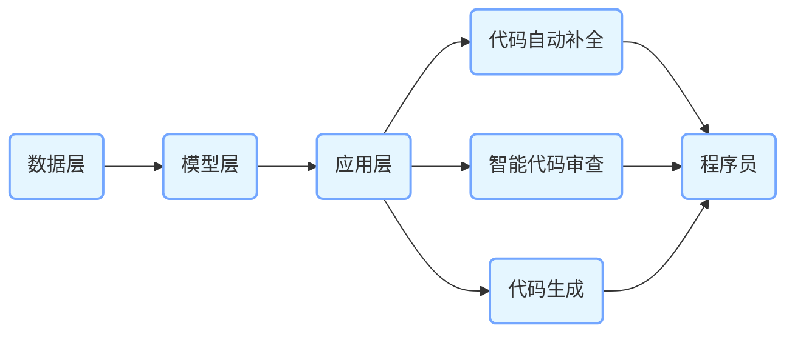

# 程序员的转型：如何拥抱AI工具

> 关键词：程序员转型、AI工具、编程效率、技术变革、职业发展、人工智能、代码辅助

> 摘要：随着人工智能技术的飞速发展，AI工具在编程领域的应用日益广泛，这对程序员的职业发展既带来了挑战，也带来了机遇。本文旨在探讨程序员如何实现向拥抱AI工具的转型，详细介绍了AI工具的核心概念、算法原理、数学模型，通过项目实战展示其应用，分析了实际应用场景，推荐了相关工具和资源，最后总结了未来发展趋势与挑战，为程序员的转型提供全面且深入的指导。

## 1. 背景介绍 
### 1.1 目的和范围
在当今数字化时代，人工智能技术的进步正在重塑各个行业，编程领域也不例外。AI工具如代码自动补全、智能代码审查、代码生成器等的出现，极大地改变了传统的编程方式。本文章的目的在于帮助程序员理解AI工具的原理和应用，掌握使用AI工具提升编程效率和质量的方法，探讨如何顺利实现向拥抱AI工具的转型。范围涵盖了AI工具的核心概念、算法原理、数学模型、实际应用案例以及相关的工具和资源推荐等方面。

### 1.2 预期读者
本文主要面向广大程序员群体，包括初级程序员、有一定经验的中级程序员以及寻求技术突破的高级程序员。同时，对于对编程和人工智能领域发展趋势感兴趣的相关从业者、研究人员也具有一定的参考价值。

### 1.3 文档结构概述
本文首先介绍背景信息，包括目的、预期读者和文档结构概述等。接着阐述AI工具的核心概念与联系，通过文本示意图和Mermaid流程图进行说明。然后详细讲解核心算法原理和具体操作步骤，并给出Python源代码示例。之后介绍数学模型和公式，并举例说明。通过项目实战展示AI工具的实际应用，包括开发环境搭建、源代码实现和代码解读。分析AI工具的实际应用场景，推荐相关的工具和资源。最后总结未来发展趋势与挑战，提供常见问题与解答以及扩展阅读和参考资料。

### 1.4 术语表
#### 1.4.1 核心术语定义
- **AI工具**：利用人工智能技术开发的、用于辅助编程的各类软件或平台，如代码自动补全工具、智能代码审查工具、代码生成器等。
- **机器学习**：一门多领域交叉学科，涉及概率论、统计学、逼近论、凸分析、算法复杂度理论等多门学科。它专门研究计算机怎样模拟或实现人类的学习行为，以获取新的知识或技能，重新组织已有的知识结构使之不断改善自身的性能。
- **深度学习**：机器学习的一个分支领域，它是一种基于对数据进行表征学习的方法。深度学习通过构建具有很多层的神经网络模型，自动从大量数据中学习特征和模式。

#### 1.4.2 相关概念解释
- **自然语言处理（NLP）**：是计算机科学与语言学的交叉领域，主要研究如何让计算机理解和处理人类语言。在编程领域，NLP技术可用于实现代码注释理解、自然语言到代码的转换等功能。
- **代码生成**：利用AI技术，根据用户提供的需求描述或部分代码片段，自动生成完整的代码。代码生成可以提高编程效率，减少重复性工作。

#### 1.4.3 缩略词列表
- **AI**：Artificial Intelligence（人工智能）
- **ML**：Machine Learning（机器学习）
- **DL**：Deep Learning（深度学习）
- **NLP**：Natural Language Processing（自然语言处理）

## 2. 核心概念与联系 
### 核心概念原理
AI工具在编程领域的应用基于多种人工智能技术，主要包括机器学习、深度学习和自然语言处理等。

机器学习是AI工具的基础，通过对大量代码数据的学习，模型可以发现代码中的模式和规律。例如，代码自动补全工具通过分析大量的代码片段，学习不同代码上下文之间的关联，从而在用户输入部分代码时，预测用户可能想要输入的后续代码。

深度学习是机器学习的一个重要分支，它通过构建深度神经网络模型，能够自动从大规模数据中学习复杂的特征和模式。在编程领域，深度学习模型可以用于代码生成、代码分类等任务。例如，利用深度学习模型可以根据用户的自然语言描述生成相应的代码。

自然语言处理技术则使得AI工具能够理解人类的自然语言。在编程中，用户可以使用自然语言描述需求，AI工具通过自然语言处理技术将其转换为可执行的代码。例如，用户输入“创建一个函数，用于计算两个数的和”，AI工具可以将其转换为相应的代码实现。

### 架构的文本示意图
AI工具在编程领域的应用架构主要包括数据层、模型层和应用层。

数据层：主要负责收集和整理编程相关的数据，包括代码库、代码注释、编程规范等。这些数据是AI工具进行学习和训练的基础。

模型层：利用机器学习和深度学习算法对数据层的数据进行训练，构建各种模型，如代码自动补全模型、代码生成模型等。

应用层：将训练好的模型集成到各种编程工具和平台中，为程序员提供具体的服务，如代码自动补全、智能代码审查、代码生成等。

### Mermaid流程图


## 3. 核心算法原理 & 具体操作步骤 
### 核心算法原理
以代码自动补全为例，其核心算法基于机器学习中的序列预测模型，如循环神经网络（RNN）及其变体长短期记忆网络（LSTM）、门控循环单元（GRU）等。

循环神经网络（RNN）是一种能够处理序列数据的神经网络，它通过在不同时间步之间传递隐藏状态，捕捉序列中的时间依赖关系。在代码自动补全中，RNN可以根据用户输入的代码前缀，预测下一个可能的代码令牌（如关键字、变量名等）。

长短期记忆网络（LSTM）和门控循环单元（GRU）是对RNN的改进，它们通过引入门控机制，解决了RNN在处理长序列时的梯度消失和梯度爆炸问题，能够更好地捕捉序列中的长距离依赖关系。

### Python源代码示例
以下是一个使用Python和PyTorch库实现简单代码自动补全的示例：

```python
import torch
import torch.nn as nn
import torch.optim as optim
from torch.utils.data import Dataset, DataLoader

# 定义数据集类
class CodeDataset(Dataset):
    def __init__(self, data):
        self.data = data

    def __len__(self):
        return len(self.data)

    def __getitem__(self, idx):
        input_seq = self.data[idx][:-1]
        target_seq = self.data[idx][1:]
        return torch.tensor(input_seq), torch.tensor(target_seq)

# 定义LSTM模型
class CodeAutoCompleteModel(nn.Module):
    def __init__(self, input_size, hidden_size, output_size):
        super(CodeAutoCompleteModel, self).__init__()
        self.lstm = nn.LSTM(input_size, hidden_size, batch_first=True)
        self.fc = nn.Linear(hidden_size, output_size)

    def forward(self, x):
        out, _ = self.lstm(x)
        out = self.fc(out)
        return out

# 训练模型
def train_model(model, dataloader, criterion, optimizer, epochs):
    model.train()
    for epoch in range(epochs):
        total_loss = 0
        for inputs, targets in dataloader:
            optimizer.zero_grad()
            outputs = model(inputs)
            loss = criterion(outputs.view(-1, outputs.size(-1)), targets.view(-1))
            loss.backward()
            optimizer.step()
            total_loss += loss.item()
        print(f'Epoch {epoch+1}/{epochs}, Loss: {total_loss/len(dataloader)}')

# 生成代码
def generate_code(model, input_seq, max_length=10):
    model.eval()
    input_tensor = torch.tensor(input_seq).unsqueeze(0)
    output_seq = []
    for _ in range(max_length):
        outputs = model(input_tensor)
        _, predicted = torch.max(outputs[:, -1, :], 1)
        output_seq.append(predicted.item())
        input_tensor = torch.cat((input_tensor, predicted.unsqueeze(0).unsqueeze(0)), dim=1)
    return output_seq

# 示例数据
data = [[1, 2, 3, 4, 5], [2, 3, 4, 5, 6], [3, 4, 5, 6, 7]]
dataset = CodeDataset(data)
dataloader = DataLoader(dataset, batch_size=1, shuffle=True)

# 模型参数
input_size = 1
hidden_size = 16
output_size = 10
model = CodeAutoCompleteModel(input_size, hidden_size, output_size)

# 定义损失函数和优化器
criterion = nn.CrossEntropyLoss()
optimizer = optim.Adam(model.parameters(), lr=0.001)

# 训练模型
train_model(model, dataloader, criterion, optimizer, epochs=10)

# 生成代码
input_seq = [1, 2]
generated_code = generate_code(model, input_seq)
print('Generated code:', generated_code)
```

### 具体操作步骤
1. **数据准备**：收集和整理代码数据，将代码转换为适合模型输入的格式，如将代码令牌化并转换为数字序列。
2. **模型定义**：选择合适的模型架构，如LSTM或GRU，定义模型的输入层、隐藏层和输出层。
3. **模型训练**：使用准备好的数据对模型进行训练，设置合适的损失函数和优化器，调整模型的参数。
4. **模型评估**：使用测试数据对训练好的模型进行评估，计算模型的准确率、损失等指标。
5. **代码生成**：使用训练好的模型进行代码生成，输入代码前缀，模型预测后续的代码令牌。

## 4. 数学模型和公式 & 详细讲解 & 举例说明 
### 数学模型
在代码自动补全中，使用的LSTM模型的数学模型可以表示为以下几个公式：

- **输入门**：
$$i_t = \sigma(W_{ii}x_t + W_{hi}h_{t-1} + b_i)$$
其中，$i_t$ 是输入门的输出，$x_t$ 是当前时间步的输入，$h_{t-1}$ 是上一个时间步的隐藏状态，$W_{ii}$ 和 $W_{hi}$ 是权重矩阵，$b_i$ 是偏置向量，$\sigma$ 是sigmoid函数。

- **遗忘门**：
$$f_t = \sigma(W_{if}x_t + W_{hf}h_{t-1} + b_f)$$
其中，$f_t$ 是遗忘门的输出，$W_{if}$ 和 $W_{hf}$ 是权重矩阵，$b_f$ 是偏置向量。

- **细胞状态更新**：
$$\tilde{C}_t = \tanh(W_{ic}x_t + W_{hc}h_{t-1} + b_c)$$
$$C_t = f_t \odot C_{t-1} + i_t \odot \tilde{C}_t$$
其中，$\tilde{C}_t$ 是候选细胞状态，$C_t$ 是当前时间步的细胞状态，$\odot$ 表示逐元素相乘，$W_{ic}$ 和 $W_{hc}$ 是权重矩阵，$b_c$ 是偏置向量。

- **输出门**：
$$o_t = \sigma(W_{io}x_t + W_{ho}h_{t-1} + b_o)$$
$$h_t = o_t \odot \tanh(C_t)$$
其中，$o_t$ 是输出门的输出，$h_t$ 是当前时间步的隐藏状态，$W_{io}$ 和 $W_{ho}$ 是权重矩阵，$b_o$ 是偏置向量。

### 详细讲解
输入门 $i_t$ 决定了当前输入 $x_t$ 有多少信息需要被加入到细胞状态 $C_t$ 中。遗忘门 $f_t$ 决定了上一个时间步的细胞状态 $C_{t-1}$ 有多少信息需要被遗忘。候选细胞状态 $\tilde{C}_t$ 是根据当前输入 $x_t$ 和上一个时间步的隐藏状态 $h_{t-1}$ 计算得到的。细胞状态 $C_t$ 是通过遗忘门 $f_t$ 和输入门 $i_t$ 对 $C_{t-1}$ 和 $\tilde{C}_t$ 进行更新得到的。输出门 $o_t$ 决定了当前细胞状态 $C_t$ 有多少信息需要被输出到隐藏状态 $h_t$ 中。

### 举例说明
假设我们有一个简单的代码序列 `[1, 2, 3, 4, 5]`，在某个时间步 $t$，输入 $x_t = 3$，上一个时间步的隐藏状态 $h_{t-1}$ 是一个向量。通过输入门、遗忘门、细胞状态更新和输出门的计算，得到当前时间步的隐藏状态 $h_t$ 和细胞状态 $C_t$。根据 $h_t$ 可以预测下一个可能的代码令牌。

## 5. 项目实战：代码实际案例和详细解释说明 
### 5.1  开发环境搭建
1. **安装Python**：从Python官方网站（https://www.python.org/downloads/）下载并安装Python 3.x版本。
2. **安装PyTorch**：根据自己的系统和CUDA版本，选择合适的安装方式。可以使用以下命令安装CPU版本的PyTorch：
```sh
pip install torch torchvision
```
3. **安装其他依赖库**：安装必要的依赖库，如 `numpy`、`matplotlib` 等：
```sh
pip install numpy matplotlib
```

### 5.2  源代码详细实现和代码解读
以下是一个使用AI工具实现代码生成的完整项目示例，我们将使用Hugging Face的Transformers库和GPT-2模型：

```python
from transformers import GPT2LMHeadModel, GPT2Tokenizer

# 加载预训练的GPT-2模型和分词器
tokenizer = GPT2Tokenizer.from_pretrained('gpt2')
model = GPT2LMHeadModel.from_pretrained('gpt2')

# 定义输入文本
input_text = "def add_numbers(a, b):"

# 将输入文本转换为模型输入的格式
input_ids = tokenizer.encode(input_text, return_tensors='pt')

# 生成代码
output = model.generate(input_ids, max_length=100, num_beams=5, no_repeat_ngram_size=2, early_stopping=True)

# 将生成的代码转换为文本
generated_code = tokenizer.decode(output[0], skip_special_tokens=True)

print('Generated code:')
print(generated_code)
```

### 代码解读与分析
1. **加载预训练模型和分词器**：使用 `GPT2Tokenizer.from_pretrained('gpt2')` 加载GPT-2的分词器，使用 `GPT2LMHeadModel.from_pretrained('gpt2')` 加载预训练的GPT-2模型。
2. **定义输入文本**：定义一个代码片段作为输入，如 `def add_numbers(a, b):`。
3. **将输入文本转换为模型输入的格式**：使用分词器将输入文本编码为模型可以接受的数字序列 `input_ids`。
4. **生成代码**：使用模型的 `generate` 方法生成代码，设置生成的最大长度、束搜索的束数、避免重复的n-gram大小等参数。
5. **将生成的代码转换为文本**：使用分词器将生成的数字序列解码为文本。

通过这个项目，我们可以看到如何使用预训练的语言模型生成代码。在实际应用中，可以根据具体需求调整模型和参数，以获得更好的代码生成效果。

## 6. 实际应用场景 
### 代码自动补全
在编写代码时，AI工具可以根据用户输入的代码前缀，自动预测并补全后续的代码。例如，在使用IDE（集成开发环境）时，当用户输入 `for` 关键字，AI工具可以自动补全 `for` 循环的基本结构，如 `for i in range(`。这可以大大提高编程效率，减少打字工作量。

### 智能代码审查
AI工具可以对代码进行静态分析，检查代码中的语法错误、潜在的逻辑错误、代码风格问题等。例如，AI工具可以检测到代码中未使用的变量、重复的代码片段、不符合编程规范的代码等，并给出相应的建议和修复方案。这可以帮助程序员提高代码质量，减少调试时间。

### 代码生成
根据用户的自然语言描述或部分代码片段，AI工具可以自动生成完整的代码。例如，用户输入“创建一个简单的Web服务器，监听8080端口”，AI工具可以生成相应的Python代码，如使用Flask或Django框架实现的Web服务器代码。这可以帮助程序员快速实现功能，提高开发效率。

### 智能调试
AI工具可以分析代码的执行过程和错误信息，帮助程序员快速定位和解决问题。例如，当代码出现异常时，AI工具可以分析异常堆栈信息，给出可能的错误原因和解决方案。这可以减少调试时间，提高开发效率。

## 7. 工具和资源推荐
### 7.1 学习资源推荐
#### 7.1.1 书籍推荐
- 《Python深度学习》：由Francois Chollet所著，这本书详细介绍了Python和深度学习的基础知识，以及如何使用Keras库进行深度学习模型的开发。
- 《深度学习》：由Ian Goodfellow、Yoshua Bengio和Aaron Courville所著，这本书是深度学习领域的经典教材，全面介绍了深度学习的理论和实践。
- 《人工智能：一种现代的方法》：由Stuart Russell和Peter Norvig所著，这本书是人工智能领域的权威教材，涵盖了人工智能的各个方面，包括机器学习、自然语言处理等。

#### 7.1.2 在线课程
- Coursera上的“深度学习专项课程”：由Andrew Ng教授授课，该课程包括多个关于深度学习的课程，如神经网络和深度学习、改善深层神经网络、结构化机器学习项目等。
- edX上的“人工智能导论”：由麻省理工学院（MIT）的教师授课，该课程介绍了人工智能的基本概念、算法和应用。
- 吴恩达的“机器学习”课程：在Coursera平台上，这是一门非常经典的机器学习入门课程，适合初学者学习。

#### 7.1.3 技术博客和网站
- Medium：上面有很多关于人工智能、机器学习和编程的技术博客文章，作者来自世界各地的技术专家和开发者。
- Towards Data Science：专注于数据科学和人工智能领域的技术博客，提供了很多高质量的文章和教程。
- GitHub Blog：GitHub官方博客，会分享很多关于开源项目、编程技术和软件开发的最新动态和经验。

### 7.2 开发工具框架推荐
#### 7.2.1 IDE和编辑器
- PyCharm：一款专门为Python开发设计的集成开发环境，具有强大的代码编辑、调试、代码分析等功能。
- Visual Studio Code：一款轻量级的代码编辑器，支持多种编程语言，通过安装各种插件可以扩展其功能，如代码自动补全、智能代码审查等。
- Jupyter Notebook：一种交互式的开发环境，适合进行数据分析、机器学习和深度学习的实验和开发。

#### 7.2.2 调试和性能分析工具
- Py-Spy：一个用于Python代码的性能分析工具，可以帮助开发者找出代码中的性能瓶颈。
- PDB：Python自带的调试器，可以帮助开发者在代码中设置断点、单步执行代码等，进行代码调试。
- TensorBoard：一个用于可视化深度学习模型训练过程的工具，可以帮助开发者监控模型的训练进度、损失函数的变化等。

#### 7.2.3 相关框架和库
- PyTorch：一个开源的深度学习框架，提供了丰富的工具和接口，方便开发者进行深度学习模型的开发和训练。
- TensorFlow：另一个广泛使用的开源深度学习框架，具有强大的分布式训练和部署能力。
- Hugging Face Transformers：一个用于自然语言处理的库，提供了很多预训练的语言模型，如GPT-2、BERT等，方便开发者进行自然语言处理任务的开发。

### 7.3 相关论文著作推荐
#### 7.3.1 经典论文
- “Attention Is All You Need”：介绍了Transformer架构，这是一种基于注意力机制的深度学习模型，在自然语言处理领域取得了巨大的成功。
- “ImageNet Classification with Deep Convolutional Neural Networks”：介绍了AlexNet模型，这是一种深度卷积神经网络，在图像分类任务中取得了突破性的成果。
- “Long Short-Term Memory”：介绍了长短期记忆网络（LSTM）的原理和应用，LSTM是一种能够处理序列数据的深度学习模型。

#### 7.3.2 最新研究成果
- 在arXiv.org上可以找到很多关于人工智能和机器学习的最新研究论文，这些论文涵盖了各个领域的最新技术和方法。
- 国际机器学习会议（ICML）、神经信息处理系统大会（NeurIPS）等学术会议上发表的论文，代表了人工智能和机器学习领域的最新研究成果。

#### 7.3.3 应用案例分析
- 《AI in Practice: How 50 Successful Companies Used Artificial Intelligence to Solve Problems》：这本书介绍了50家成功公司如何使用人工智能解决实际问题的案例，包括医疗、金融、交通等各个领域。
- 各大科技公司的官方博客，如Google AI Blog、Facebook AI Research等，会分享很多关于人工智能应用的案例和经验。

## 8. 总结：未来发展趋势与挑战
### 未来发展趋势
1. **更强大的代码生成能力**：未来的AI工具将能够生成更加复杂、高质量的代码，甚至可以根据用户的需求自动设计和实现整个软件系统。
2. **与开发流程的深度融合**：AI工具将不仅仅是辅助编程的工具，而是会深度融入到软件开发的整个流程中，如需求分析、设计、测试等阶段，提高软件开发的整体效率和质量。
3. **个性化的编程辅助**：AI工具将能够根据程序员的编程习惯和偏好，提供个性化的编程辅助服务，如个性化的代码自动补全、智能代码审查等。
4. **跨语言和跨平台的支持**：未来的AI工具将支持更多的编程语言和开发平台，方便程序员在不同的环境中使用。

### 挑战
1. **数据隐私和安全问题**：AI工具需要大量的代码数据进行训练，这些数据可能包含敏感信息，如商业机密、用户隐私等。如何保护数据的隐私和安全是一个重要的挑战。
2. **模型解释性问题**：深度学习模型通常是黑盒模型，难以解释其决策过程和结果。在编程领域，程序员需要了解AI工具生成的代码的原理和逻辑，以便进行调试和优化。因此，提高模型的解释性是一个重要的挑战。
3. **技术更新换代快**：人工智能技术发展迅速，新的算法和模型不断涌现。程序员需要不断学习和掌握新的技术，才能跟上技术的发展步伐。
4. **职业转型的压力**：AI工具的广泛应用可能会导致一些传统编程岗位的需求减少，程序员需要进行职业转型，学习新的技能和知识，以适应市场的需求。

## 9. 附录：常见问题与解答
### 问题1：AI工具会取代程序员吗？
答：目前来看，AI工具不会完全取代程序员。虽然AI工具可以提高编程效率和质量，但编程不仅仅是代码的编写，还包括需求分析、系统设计、架构规划、调试优化等多个环节，这些都需要程序员的专业知识和经验。AI工具更像是程序员的辅助工具，帮助程序员更好地完成工作。

### 问题2：如何选择适合自己的AI工具？
答：选择适合自己的AI工具需要考虑以下几个因素：
- **功能需求**：根据自己的编程需求，选择具有相应功能的AI工具，如代码自动补全、智能代码审查、代码生成等。
- **易用性**：选择操作简单、易于上手的AI工具，这样可以提高使用效率。
- **兼容性**：确保AI工具与自己使用的开发环境和编程语言兼容。
- **社区支持**：选择有活跃社区支持的AI工具，这样可以获取更多的帮助和资源。

### 问题3：使用AI工具生成的代码质量如何？
答：AI工具生成的代码质量取决于多个因素，如模型的训练数据、算法的复杂度、参数的设置等。一般来说，AI工具可以生成基本的代码框架和逻辑，但可能存在一些错误和不规范的地方，需要程序员进行进一步的审查和优化。

### 问题4：如何提高自己使用AI工具的能力？
答：可以通过以下几种方式提高自己使用AI工具的能力：
- **学习相关知识**：学习人工智能、机器学习、自然语言处理等相关知识，了解AI工具的原理和算法。
- **实践操作**：多使用AI工具进行编程实践，熟悉工具的功能和操作方法。
- **参考文档和教程**：阅读AI工具的官方文档和相关教程，了解工具的使用技巧和最佳实践。
- **参与社区交流**：参与AI工具的社区交流，与其他开发者分享经验和心得，学习他人的使用技巧。

## 10. 扩展阅读 & 参考资料
### 扩展阅读
- 《人工智能时代的编程革命》：探讨了人工智能技术对编程领域的影响和变革，以及程序员如何应对这些变化。
- 《代码未来：从计算机到人工智能》：介绍了计算机科学和人工智能的发展历程，以及未来的发展趋势。
- 《AI极简经济学》：从经济学的角度分析了人工智能技术的发展和应用，以及对社会和经济的影响。

### 参考资料
- 相关AI工具的官方文档和网站，如PyTorch官方文档（https://pytorch.org/docs/stable/index.html）、Hugging Face Transformers官方文档（https://huggingface.co/transformers/）等。
- 学术论文数据库，如IEEE Xplore、ACM Digital Library等，获取关于人工智能和编程领域的最新研究成果。
- 开源代码库，如GitHub、GitLab等，查看和学习其他开发者使用AI工具的代码示例。