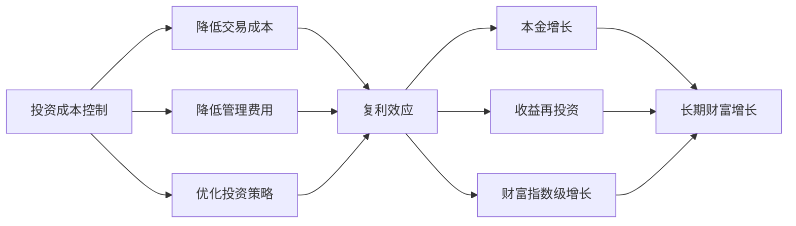

# 约翰·伯格的投资成本控制：复利效应的长期影响

> 关键词：约翰·伯格、投资成本控制、复利效应、长期投资、投资策略、成本影响、财富增长

> 摘要：本文深入探讨了约翰·伯格所倡导的投资成本控制理念以及复利效应在长期投资中的重要影响。首先介绍了约翰·伯格及其投资理念的背景，阐述了投资成本控制和复利效应的核心概念及相互联系。接着分析了相关的核心算法原理，通过数学模型和公式详细解释了成本对复利增长的影响。然后通过项目实战案例，展示了在实际投资中如何控制成本并利用复利效应。进一步探讨了其在不同实际应用场景中的体现，推荐了相关的学习工具、资源和论文著作。最后总结了未来投资领域在成本控制和复利利用方面的发展趋势与挑战，并对常见问题进行了解答。通过全面的分析，旨在帮助投资者更好地理解和运用这些理念实现财富的长期增长。

## 1. 背景介绍 
### 1.1 目的和范围
本文的目的在于深入剖析约翰·伯格的投资成本控制理念以及复利效应在长期投资中的作用。约翰·伯格作为投资界的传奇人物，他的低成本投资策略对投资者产生了深远的影响。我们将研究其理论的核心原理，分析成本控制与复利效应之间的内在联系，探讨如何在实际投资中应用这些理念以实现财富的长期稳健增长。范围涵盖了投资成本控制的各个方面，包括交易成本、管理费用等对投资回报的影响，以及复利效应在不同投资期限和市场环境下的表现。

### 1.2 预期读者
本文预期读者包括对投资领域感兴趣的初学者、有一定投资经验的投资者、金融从业者以及研究投资理论的学者。对于初学者，本文将帮助他们建立正确的投资理念，了解投资成本和复利效应的重要性；对于有经验的投资者，能提供新的视角和方法来优化投资策略；对于金融从业者，有助于他们更好地为客户提供投资建议；对于学者，则可作为研究投资理论的参考资料。

### 1.3 文档结构概述
本文首先介绍相关背景知识，包括目的、预期读者和文档结构。接着阐述投资成本控制和复利效应的核心概念及联系，通过文本示意图和 Mermaid 流程图进行直观展示。然后讲解核心算法原理和具体操作步骤，并用 Python 代码详细阐述。之后通过数学模型和公式深入分析成本对复利增长的影响，并举例说明。再通过项目实战案例，包括开发环境搭建、源代码实现和代码解读，展示实际应用。随后探讨实际应用场景，推荐相关工具和资源，包括学习资源、开发工具框架和论文著作。最后总结未来发展趋势与挑战，解答常见问题，并提供扩展阅读和参考资料。

### 1.4 术语表
#### 1.4.1 核心术语定义
- **投资成本控制**：指投资者在进行投资活动过程中，通过各种方法和策略来降低投资过程中产生的各类成本，包括交易成本、管理费用、税收等，以提高投资的实际回报率。
- **复利效应**：是指在每一个计息期后，将所生利息加入本金再计利息，逐期滚算，使得本金随着时间的推移呈指数级增长的一种现象。在投资中，复利效应意味着前期的投资收益会不断转化为新的本金，继续产生收益，从而实现财富的快速增长。
- **交易成本**：是指投资者在买卖证券、基金等金融资产时所支付的费用，如佣金、手续费等。
- **管理费用**：是指基金公司或投资管理机构为管理投资者的资产而收取的费用，通常按资产规模的一定比例收取。

#### 1.4.2 相关概念解释
- **长期投资**：一般指投资期限在一年以上的投资行为。长期投资可以平滑市场波动的影响，更充分地发挥复利效应，实现资产的稳健增长。
- **投资回报率**：是指通过投资而应返回的价值，即企业从一项投资活动中得到的经济回报。投资回报率通常用百分比表示，计算公式为：投资回报率 = （投资收益 - 投资成本） / 投资成本 × 100%。

#### 1.4.3 缩略词列表
- **ETF**：交易型开放式指数基金（Exchange Traded Fund），是一种在交易所上市交易的、基金份额可变的开放式基金。
- **IRA**：个人退休账户（Individual Retirement Account），是一种为个人提供退休储蓄的税收优惠账户。

## 2. 核心概念与联系 

### 投资成本控制的原理
投资成本控制的核心在于认识到成本对投资回报的侵蚀作用。在投资过程中，各种成本如交易成本、管理费用等会直接减少投资者的实际收益。例如，频繁的交易不仅会增加交易成本，还可能因为市场的不确定性而导致投资损失。管理费用虽然看似比例较小，但长期积累下来也会对投资回报产生显著影响。通过合理选择投资产品、优化交易策略等方式，可以有效降低投资成本，提高投资的净回报率。

### 复利效应的原理
复利效应的本质是利用时间的力量实现财富的增长。假设初始投资为 $P$，年利率为 $r$，投资期限为 $n$ 年，每年复利一次，则 $n$ 年后的本利和 $A$ 可以用公式 $A = P(1 + r)^n$ 表示。从这个公式可以看出，随着投资期限 $n$ 的增加，财富增长的速度会越来越快。这是因为每一年的收益都会加入到本金中，下一年的收益将基于更高的本金计算，形成了一种滚雪球式的增长。

### 两者的联系
投资成本控制与复利效应密切相关。降低投资成本可以提高投资的实际回报率，而更高的回报率在复利效应的作用下，会使财富增长的速度更快。例如，在相同的初始投资和投资期限下，一个投资成本较低的投资组合，由于其实际回报率较高，经过多年的复利增长后，最终的财富积累将远远超过投资成本较高的组合。因此，控制投资成本是充分发挥复利效应的关键因素之一。

### 文本示意图
```plaintext
投资成本控制
    |
    |--降低交易成本
    |--降低管理费用
    |--优化投资策略
    |
    v
复利效应
    |
    |--本金增长
    |--收益再投资
    |--财富指数级增长
    |
    v
长期财富增长
```

### Mermaid 流程图


## 3. 核心算法原理 & 具体操作步骤 

### 核心算法原理
我们可以通过 Python 代码来模拟投资成本控制和复利效应的过程。假设我们有一个初始投资金额，每年有一定的投资回报率，同时需要扣除一定的管理费用，经过若干年后计算最终的投资收益。

### 具体操作步骤
1. 定义初始投资金额、投资期限、年利率和管理费用率。
2. 每年计算投资收益，扣除管理费用后更新本金。
3. 重复步骤 2 直到达到投资期限。
4. 输出最终的投资收益和投资回报率。

### Python 源代码
```python
def investment_simulation(initial_investment, years, annual_return_rate, management_fee_rate):
    # 初始化本金
    principal = initial_investment
    for year in range(years):
        # 计算当年的收益
        annual_income = principal * annual_return_rate
        # 扣除管理费用
        management_fee = principal * management_fee_rate
        # 更新本金
        principal = principal + annual_income - management_fee
    # 计算最终的投资收益
    final_income = principal - initial_investment
    # 计算投资回报率
    return_rate = (principal / initial_investment - 1) * 100
    return principal, final_income, return_rate

# 示例参数
initial_investment = 10000  # 初始投资金额
years = 20  # 投资期限
annual_return_rate = 0.08  # 年利率
management_fee_rate = 0.01  # 管理费用率

# 进行模拟
principal, final_income, return_rate = investment_simulation(initial_investment, years, annual_return_rate, management_fee_rate)

# 输出结果
print(f"初始投资金额: {initial_investment} 元")
print(f"投资期限: {years} 年")
print(f"年利率: {annual_return_rate * 100}%")
print(f"管理费用率: {management_fee_rate * 100}%")
print(f"最终本金: {principal} 元")
print(f"最终投资收益: {final_income} 元")
print(f"投资回报率: {return_rate}%")
```

### 代码解释
1. `investment_simulation` 函数接受四个参数：初始投资金额、投资期限、年利率和管理费用率。
2. 在函数内部，使用 `for` 循环模拟每年的投资过程。
3. 每年计算投资收益和管理费用，更新本金。
4. 循环结束后，计算最终的投资收益和投资回报率。
5. 最后返回最终本金、最终投资收益和投资回报率。

## 4. 数学模型和公式 & 详细讲解 & 举例说明 

### 数学模型和公式
设初始投资金额为 $P$，年利率为 $r$，管理费用率为 $f$，投资期限为 $n$ 年，每年复利一次。则第 $i$ 年末的本金 $P_i$ 可以通过以下递推公式计算：

$P_0 = P$

$P_i = P_{i - 1}(1 + r - f)$，其中 $i = 1, 2, \cdots, n$

最终的本金 $P_n$ 可以表示为：

$P_n = P(1 + r - f)^n$

最终的投资收益 $I$ 为：

$I = P_n - P = P[(1 + r - f)^n - 1]$

投资回报率 $R$ 为：

$R = \frac{P_n - P}{P} \times 100\% = [(1 + r - f)^n - 1] \times 100\%$

### 详细讲解
- **初始投资金额 $P$**：是投资者开始投资时投入的资金。
- **年利率 $r$**：表示投资每年的预期收益率，反映了投资的盈利能力。
- **管理费用率 $f$**：是投资过程中每年需要支付的管理费用占本金的比例，会直接减少投资的实际收益。
- **投资期限 $n$**：是投资者进行投资的时间长度，投资期限越长，复利效应越明显。

### 举例说明
假设初始投资金额 $P = 10000$ 元，年利率 $r = 0.08$，管理费用率 $f = 0.01$，投资期限 $n = 20$ 年。

首先计算最终的本金 $P_n$：

$P_n = P(1 + r - f)^n = 10000\times(1 + 0.08 - 0.01)^{20} \approx 38696.84$（元）

然后计算最终的投资收益 $I$：

$I = P_n - P = 38696.84 - 10000 = 28696.84$（元）

最后计算投资回报率 $R$：

$R = [(1 + r - f)^n - 1] \times 100\% = [(1 + 0.08 - 0.01)^{20} - 1] \times 100\% \approx 286.97\%$

通过这个例子可以看出，在复利效应的作用下，即使扣除了一定的管理费用，长期投资仍然可以实现显著的财富增长。

## 5. 项目实战：代码实际案例和详细解释说明 

### 5.1  开发环境搭建
- **Python 安装**：从 Python 官方网站（https://www.python.org/downloads/）下载并安装 Python 3.x 版本。
- **开发工具**：可以选择使用 PyCharm、VS Code 等集成开发环境（IDE），或者使用 Jupyter Notebook 进行交互式开发。
- **依赖库安装**：本项目仅使用 Python 内置库，无需额外安装依赖库。

### 5.2  源代码详细实现和代码解读
```python
# 定义投资模拟函数
def investment_simulation(initial_investment, years, annual_return_rate, management_fee_rate):
    # 初始化本金
    principal = initial_investment
    # 用于记录每年的本金变化
    principal_history = [principal]
    for year in range(years):
        # 计算当年的收益
        annual_income = principal * annual_return_rate
        # 扣除管理费用
        management_fee = principal * management_fee_rate
        # 更新本金
        principal = principal + annual_income - management_fee
        # 记录当年的本金
        principal_history.append(principal)
    # 计算最终的投资收益
    final_income = principal - initial_investment
    # 计算投资回报率
    return_rate = (principal / initial_investment - 1) * 100
    return principal, final_income, return_rate, principal_history

# 示例参数
initial_investment = 10000  # 初始投资金额
years = 20  # 投资期限
annual_return_rate = 0.08  # 年利率
management_fee_rate = 0.01  # 管理费用率

# 进行模拟
principal, final_income, return_rate, principal_history = investment_simulation(initial_investment, years, annual_return_rate, management_fee_rate)

# 输出结果
print(f"初始投资金额: {initial_investment} 元")
print(f"投资期限: {years} 年")
print(f"年利率: {annual_return_rate * 100}%")
print(f"管理费用率: {management_fee_rate * 100}%")
print(f"最终本金: {principal} 元")
print(f"最终投资收益: {final_income} 元")
print(f"投资回报率: {return_rate}%")

# 绘制本金变化曲线
import matplotlib.pyplot as plt

years_list = list(range(years + 1))
plt.plot(years_list, principal_history)
plt.xlabel('年份')
plt.ylabel('本金（元）')
plt.title('投资本金变化曲线')
plt.grid(True)
plt.show()
```

### 5.3  代码解读与分析
- **函数定义**：`investment_simulation` 函数接受四个参数，返回最终本金、最终投资收益、投资回报率和每年的本金变化列表。
- **本金计算**：在循环中，每年计算投资收益和管理费用，更新本金，并记录下来。
- **结果输出**：输出初始投资金额、投资期限、年利率、管理费用率、最终本金、最终投资收益和投资回报率。
- **可视化**：使用 `matplotlib` 库绘制本金变化曲线，直观展示投资过程中本金的增长情况。

通过这个项目实战，我们可以更直观地看到投资成本控制和复利效应的影响。在相同的年利率下，降低管理费用率可以显著提高最终的投资收益和投资回报率。同时，随着投资期限的增加，复利效应会更加明显，本金的增长速度会越来越快。

## 6. 实际应用场景 

### 个人退休规划
在个人退休规划中，投资成本控制和复利效应起着至关重要的作用。通过长期投资低成本的指数基金或 ETF，可以降低管理费用和交易成本，充分发挥复利效应，实现退休资产的稳健增长。例如，一个年轻人从 25 岁开始每月投资 1000 元到一个年回报率为 8%、管理费用率为 0.1% 的指数基金中，到 65 岁退休时，他的退休资产将达到约 317 万元。如果管理费用率提高到 1%，退休资产将减少到约 223 万元。因此，在退休规划中，控制投资成本可以显著增加退休资产的积累。

### 教育储蓄
对于有子女教育需求的家庭，教育储蓄也是一个长期投资的过程。通过选择低成本的投资产品，如教育储蓄账户、债券基金等，并长期持有，可以利用复利效应实现教育资金的积累。例如，一个家庭从孩子出生开始每年投资 5000 元到一个年回报率为 6%、管理费用率为 0.2% 的教育储蓄账户中，到孩子 18 岁上大学时，账户余额将达到约 18 万元。如果管理费用率提高到 1%，账户余额将减少到约 16 万元。因此，在教育储蓄中，控制投资成本可以为孩子的教育提供更充足的资金支持。

### 基金投资
在基金投资中，投资者往往关注基金的业绩表现，但容易忽略基金的管理费用和交易成本。不同类型的基金管理费用率差异较大，主动管理型基金的管理费用率通常较高，而被动管理型基金（如指数基金）的管理费用率较低。通过选择低成本的基金产品，可以提高投资的实际回报率。例如，两个基金的年回报率均为 10%，但一个基金的管理费用率为 1.5%，另一个基金的管理费用率为 0.5%。经过 20 年的投资，前者的最终资产将比后者少约 26%。因此，在基金投资中，控制投资成本是提高投资收益的重要因素。

### 企业年金管理
企业年金是企业及其职工在依法参加基本养老保险的基础上，自主建立的补充养老保险制度。企业年金的管理涉及到投资运营，投资成本控制和复利效应同样重要。企业年金管理机构通过优化投资组合、选择低成本的投资产品，可以降低管理费用和交易成本，提高企业年金的投资回报率。例如，一个企业年金计划的初始规模为 1000 万元，年回报率为 7%，管理费用率为 0.3%。经过 30 年的投资，企业年金的规模将达到约 7612 万元。如果管理费用率提高到 1%，企业年金的规模将减少到约 5743 万元。因此，在企业年金管理中，控制投资成本可以为企业职工提供更充足的退休保障。

## 7. 工具和资源推荐
### 7.1 学习资源推荐
#### 7.1.1 书籍推荐
- 《漫步华尔街》（A Random Walk Down Wall Street）：作者是 Burton G. Malkiel，这本书介绍了各种投资理论和策略，强调了长期投资和低成本投资的重要性。
- 《聪明的投资者》（The Intelligent Investor）：作者是 Benjamin Graham，被誉为投资界的圣经，详细阐述了价值投资的理念和方法，对投资成本控制也有深入的探讨。
- 《约翰·伯格的投资50年》（John Bogle on Investing: The First 50 Years）：这本书收录了约翰·伯格的经典文章和演讲，全面介绍了他的投资理念和实践经验。

#### 7.1.2 在线课程
- Coursera 平台上的“投资学原理”（Principles of Investing）课程：由知名大学的教授授课，系统介绍了投资的基本原理和方法，包括投资成本控制和复利效应的内容。
- edX 平台上的“金融市场”（Financial Markets）课程：由耶鲁大学的教授授课，深入探讨了金融市场的运作机制和投资策略，对理解投资成本和复利效应有很大帮助。

#### 7.1.3 技术博客和网站
- 晨星网（Morningstar）：提供基金评级、投资分析等服务，有大量关于投资成本和复利效应的研究报告和文章。
- 雪球网（Xueqiu）：是一个投资者交流社区，有很多投资者分享自己的投资经验和心得，包括如何控制投资成本和利用复利效应。

### 7.2 开发工具框架推荐
#### 7.2.1 IDE和编辑器
- PyCharm：是一款专业的 Python 集成开发环境，具有强大的代码编辑、调试和自动补全功能，适合开发投资模拟程序。
- VS Code：是一款轻量级的代码编辑器，支持多种编程语言，有丰富的插件可以扩展功能，也可以用于开发投资相关的程序。

#### 7.2.2 调试和性能分析工具
- Py-Spy：是一个用于分析 Python 程序性能的工具，可以帮助开发者找出程序中的性能瓶颈，优化投资模拟程序的运行效率。
- PDB：是 Python 内置的调试器，可以帮助开发者调试投资模拟程序，查找代码中的错误。

#### 7.2.3 相关框架和库
- Pandas：是一个用于数据处理和分析的 Python 库，可以用于处理投资数据，如计算投资回报率、分析投资组合等。
- Matplotlib：是一个用于数据可视化的 Python 库，可以将投资模拟的结果以图表的形式展示出来，直观地展示投资成本控制和复利效应的影响。

### 7.3 相关论文著作推荐
#### 7.3.1 经典论文
- “The Cost of Active Investing” by William F. Sharpe：这篇论文分析了主动投资的成本，强调了低成本投资的优势。
- “Compound Interest: The Eighth Wonder of the World” by Albert Einstein（虽然这可能是一个传说，但复利效应的重要性得到了广泛认可）：探讨了复利效应在金融领域的应用和影响。

#### 7.3.2 最新研究成果
- 可以关注《金融研究》《经济研究》等学术期刊，了解关于投资成本控制和复利效应的最新研究成果。
- 各大高校和研究机构的经济金融研究中心也会发布相关的研究报告和论文。

#### 7.3.3 应用案例分析
- 可以参考一些金融机构的年度报告，了解它们在投资管理中如何控制成本和利用复利效应。
- 一些知名投资者的投资案例分析也可以提供宝贵的经验和启示。

## 8. 总结：未来发展趋势与挑战

### 未来发展趋势
- **低成本投资产品的普及**：随着投资者对投资成本的认识不断提高，低成本的投资产品如指数基金、ETF 等将越来越受到欢迎。未来，这些产品的规模有望继续扩大，市场份额将进一步提高。
- **数字化投资服务的发展**：随着金融科技的发展，数字化投资服务将更加普及。投资者可以通过在线平台方便地进行投资操作，获取投资信息和建议。数字化投资服务可以降低投资成本，提高投资效率，为投资者提供更好的投资体验。
- **个性化投资策略的兴起**：不同投资者的风险偏好、投资目标和投资期限各不相同，未来个性化投资策略将越来越受到重视。投资机构将根据投资者的具体情况，为其量身定制投资方案，实现投资成本控制和复利效应的最大化。

### 挑战
- **市场波动的影响**：市场波动是投资中不可避免的风险，它会影响投资回报率和复利效应的发挥。在市场波动较大的情况下，投资者可能会面临投资损失，需要更加谨慎地进行投资决策。
- **投资成本的隐性化**：除了明显的管理费用和交易成本外，投资成本还可能存在一些隐性的因素，如税收、市场冲击成本等。这些隐性成本难以准确计算和控制，给投资成本控制带来了一定的挑战。
- **投资者教育的不足**：虽然投资者对投资的关注度不断提高，但仍有很多投资者对投资成本控制和复利效应的认识不足。投资者教育的不足可能导致投资者做出错误的投资决策，影响投资收益。

## 9. 附录：常见问题与解答

### 1. 投资成本控制是不是只需要关注管理费用？
不是。投资成本控制不仅要关注管理费用，还要关注交易成本、税收等其他成本。交易成本包括佣金、手续费等，频繁的交易可能会导致较高的交易成本。税收也是影响投资收益的重要因素，不同的投资产品和投资方式可能会有不同的税收政策。因此，在投资成本控制中，需要综合考虑各种成本因素。

### 2. 复利效应是不是只适用于长期投资？
复利效应在长期投资中更为明显，但并不意味着只适用于长期投资。即使是短期投资，复利效应也会产生一定的影响。例如，在货币基金投资中，每天的收益会自动计入本金，实现复利增长。不过，由于短期投资的期限较短，复利效应的效果相对较小。

### 3. 如何选择低成本的投资产品？
可以从以下几个方面选择低成本的投资产品：
- **比较管理费用率**：不同投资产品的管理费用率差异较大，选择管理费用率较低的产品可以降低投资成本。
- **选择被动管理型产品**：被动管理型产品如指数基金、ETF 等，通常管理费用率较低，因为它们不需要进行主动的投资管理。
- **关注交易成本**：选择交易成本较低的投资产品，如一些免佣金的基金产品。

### 4. 投资成本控制和投资收益最大化之间有矛盾吗？
没有矛盾。投资成本控制的目的是通过降低各种成本，提高投资的实际回报率，从而实现投资收益的最大化。在投资过程中，合理控制投资成本可以减少不必要的损失，使投资收益更加稳定和可持续。因此，投资成本控制是实现投资收益最大化的重要手段之一。

## 10. 扩展阅读 & 参考资料
- [1] Malkiel, Burton G. A Random Walk Down Wall Street. W. W. Norton & Company, 2016.
- [2] Graham, Benjamin. The Intelligent Investor. HarperBusiness, 2003.
- [3] Bogle, John C. John Bogle on Investing: The First 50 Years. McGraw-Hill Education, 2005.
- [4] Sharpe, William F. “The Cost of Active Investing.” The Journal of Finance, vol. 43, no. 4, 1991, pp. 713–722.
- [5] Morningstar website: https://www.morningstar.com/
- [6] Xueqiu website: https://xueqiu.com/
- [7] Coursera website: https://www.coursera.org/
- [8] edX website: https://www.edx.org/