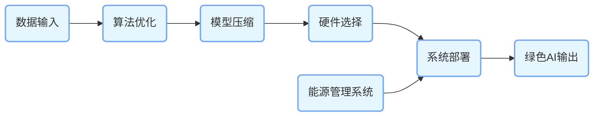

# 绿色AI:降低环境影响的计算策略

> 关键词：绿色AI、环境影响、计算策略、能耗优化、可持续发展

> 摘要：本文聚焦于绿色AI这一前沿领域，旨在探讨降低AI计算对环境影响的有效策略。首先介绍了绿色AI提出的背景，包括目的、预期读者、文档结构和相关术语。接着阐述了绿色AI的核心概念及联系，通过文本示意图和Mermaid流程图展示其原理和架构。详细讲解了核心算法原理和具体操作步骤，结合Python代码进行说明。深入分析了相关数学模型和公式，并举例解释。通过项目实战，展示了绿色AI在实际中的代码实现和应用。探讨了绿色AI的实际应用场景，推荐了学习资源、开发工具框架和相关论文著作。最后总结了绿色AI的未来发展趋势与挑战，提供了常见问题解答和扩展阅读参考资料，为推动AI的可持续发展提供全面的技术指导。

## 1. 背景介绍 
### 1.1 目的和范围
随着人工智能（AI）技术的飞速发展，其在各个领域的应用日益广泛。然而，AI计算过程中消耗的大量能源以及由此产生的环境影响也逐渐成为人们关注的焦点。本文章的目的在于深入探讨降低AI计算环境影响的策略，即绿色AI的相关技术和方法。范围涵盖了绿色AI的核心概念、算法原理、数学模型、实际应用案例以及未来发展趋势等方面，旨在为研究者、开发者和相关从业者提供全面的技术参考，以推动AI技术在可持续发展道路上的前进。

### 1.2 预期读者
本文预期读者主要包括以下几类人群：
- **AI研究者**：对人工智能技术有深入研究，关注技术的可持续发展，希望探索降低AI计算能耗和环境影响的新方法和新思路。
- **AI开发者**：负责AI系统的开发和实现，需要在实际项目中应用绿色AI策略，以优化系统性能和降低成本。
- **环保人士和政策制定者**：关注科技发展对环境的影响，希望通过了解绿色AI技术，推动相关政策的制定和实施，促进AI行业的可持续发展。
- **高校学生和初学者**：对人工智能和环境保护感兴趣，希望通过本文了解绿色AI的基本概念和技术，为未来的学习和研究打下基础。

### 1.3 文档结构概述
本文将按照以下结构进行组织：
- **核心概念与联系**：介绍绿色AI的核心概念、原理和架构，通过文本示意图和Mermaid流程图进行展示。
- **核心算法原理 & 具体操作步骤**：详细讲解绿色AI的核心算法原理，并使用Python代码阐述具体操作步骤。
- **数学模型和公式 & 详细讲解 & 举例说明**：分析绿色AI相关的数学模型和公式，通过具体例子进行解释。
- **项目实战：代码实际案例和详细解释说明**：通过实际项目案例，展示绿色AI在代码实现中的应用和效果。
- **实际应用场景**：探讨绿色AI在不同领域的实际应用场景和优势。
- **工具和资源推荐**：推荐学习绿色AI的相关资源、开发工具框架和论文著作。
- **总结：未来发展趋势与挑战**：总结绿色AI的发展现状，分析未来发展趋势和面临的挑战。
- **附录：常见问题与解答**：解答读者在学习和应用绿色AI过程中常见的问题。
- **扩展阅读 & 参考资料**：提供相关的扩展阅读资料和参考文献，方便读者进一步深入学习。

### 1.4 术语表
#### 1.4.1 核心术语定义
- **绿色AI**：指在人工智能的研发、部署和应用过程中，采用一系列技术和策略，降低计算能耗和环境影响，实现AI技术的可持续发展。
- **能耗优化**：通过调整算法、硬件架构和系统配置等方式，降低AI计算过程中的能源消耗。
- **可持续发展**：满足当代人的需求，又不损害后代人满足其需求的能力的发展模式，在AI领域体现为降低环境影响和资源消耗。

#### 1.4.2 相关概念解释
- **碳足迹**：指一个组织、产品或活动在其整个生命周期中产生的温室气体排放量，通常以二氧化碳当量（CO₂e）表示。在AI领域，碳足迹主要包括数据中心的电力消耗、硬件生产和运输等过程中产生的碳排放。
- **能效比**：指AI系统在完成特定任务时所消耗的能源与所取得的性能之间的比值。能效比越高，说明系统在相同能耗下能够取得更好的性能。

#### 1.4.3 缩略词列表
- **AI**：Artificial Intelligence，人工智能
- **ML**：Machine Learning，机器学习
- **DL**：Deep Learning，深度学习
- **GPU**：Graphics Processing Unit，图形处理单元
- **CPU**：Central Processing Unit，中央处理器

## 2. 核心概念与联系 
### 核心概念原理
绿色AI的核心原理在于通过优化AI计算过程中的各个环节，降低能源消耗和环境影响。这涉及到从算法设计、硬件选择到系统部署等多个层面的优化。

从算法层面来看，传统的AI算法在训练和推理过程中往往需要大量的计算资源，导致能源消耗过高。绿色AI采用了一些轻量级的算法和模型压缩技术，如剪枝、量化等，减少模型的参数数量和计算复杂度，从而降低能耗。

在硬件方面，选择能效比高的硬件设备是关键。例如，使用专门为AI计算设计的低功耗芯片，或者采用分布式计算架构，将计算任务分配到多个低功耗设备上进行处理，提高整体的能源利用效率。

系统部署层面，通过优化数据中心的布局和管理，采用智能的能源管理系统，实现对计算资源的动态分配和调度，避免资源的浪费。

### 架构示意图
以下是绿色AI的核心架构示意图：



这个流程图展示了绿色AI从数据输入到最终输出的整个过程。首先，对输入的数据进行算法优化，选择合适的轻量级算法。然后，对模型进行压缩，减少参数数量。接着，根据算法和模型的需求选择能效比高的硬件设备。在系统部署阶段，结合能源管理系统，实现对计算资源的动态分配和调度，最终得到绿色AI的输出。

## 3. 核心算法原理 & 具体操作步骤 
### 核心算法原理
在绿色AI中，模型压缩算法是降低计算能耗的重要手段之一。这里以剪枝算法为例，详细介绍其原理。

剪枝算法的核心思想是去除神经网络中对模型性能影响较小的连接或神经元，从而减少模型的参数数量和计算复杂度。在训练过程中，神经网络中的一些连接可能对最终的输出结果贡献不大，这些连接可以被安全地删除，而不会显著降低模型的性能。

具体来说，剪枝算法通常分为以下几个步骤：
1. **训练原始模型**：使用传统的训练方法，如随机梯度下降（SGD），对神经网络进行训练，得到一个初始的模型。
2. **评估连接重要性**：计算每个连接的重要性得分，常用的方法是基于连接的权重大小或梯度信息。权重较小的连接通常被认为对模型性能影响较小。
3. **剪枝操作**：根据连接的重要性得分，删除得分较低的连接。可以设置一个阈值，将权重小于该阈值的连接删除。
4. **微调模型**：对剪枝后的模型进行微调，以恢复因剪枝而损失的性能。

### Python代码实现
以下是一个简单的剪枝算法的Python代码示例：

```python
import torch
import torch.nn as nn
import torch.optim as optim

# 定义一个简单的神经网络模型
class SimpleNet(nn.Module):
    def __init__(self):
        super(SimpleNet, self).__init__()
        self.fc1 = nn.Linear(10, 20)
        self.fc2 = nn.Linear(20, 1)

    def forward(self, x):
        x = torch.relu(self.fc1(x))
        x = self.fc2(x)
        return x

# 训练原始模型
model = SimpleNet()
criterion = nn.MSELoss()
optimizer = optim.SGD(model.parameters(), lr=0.01)

# 模拟训练数据
inputs = torch.randn(100, 10)
labels = torch.randn(100, 1)

# 训练模型
for epoch in range(100):
    optimizer.zero_grad()
    outputs = model(inputs)
    loss = criterion(outputs, labels)
    loss.backward()
    optimizer.step()

# 评估连接重要性并进行剪枝
threshold = 0.1
for name, param in model.named_parameters():
    if 'weight' in name:
        mask = torch.abs(param.data) > threshold
        param.data *= mask.float()

# 微调模型
for epoch in range(50):
    optimizer.zero_grad()
    outputs = model(inputs)
    loss = criterion(outputs, labels)
    loss.backward()
    optimizer.step()

print("Pruned model trained successfully.")
```

### 代码解释
1. **定义模型**：定义了一个简单的两层全连接神经网络`SimpleNet`。
2. **训练原始模型**：使用随机梯度下降（SGD）优化器和均方误差损失函数（MSE）对模型进行训练。
3. **评估连接重要性并剪枝**：遍历模型的所有参数，对于权重参数，计算其绝对值，并将小于阈值的权重置为零。
4. **微调模型**：对剪枝后的模型进行微调，以恢复因剪枝而损失的性能。

通过这种方式，可以显著减少模型的参数数量，从而降低计算能耗。

## 4. 数学模型和公式 & 详细讲解 & 举例说明 
### 能耗模型
在绿色AI中，能耗模型是评估计算能耗的重要工具。一个简单的能耗模型可以表示为：

$$E = P \times t$$

其中，$E$ 表示能耗（单位：焦耳），$P$ 表示功率（单位：瓦特），$t$ 表示计算时间（单位：秒）。

功率 $P$ 可以进一步分解为多个部分，包括硬件设备的静态功率和动态功率。静态功率是指硬件设备在不进行计算时消耗的功率，动态功率是指在计算过程中消耗的功率。

### 模型压缩的数学原理
以量化为例，量化是一种将模型参数从高精度数据类型（如32位浮点数）转换为低精度数据类型（如8位整数）的技术。量化的数学原理可以表示为：

$$q = \text{round}\left(\frac{r}{S} + Z\right)$$

其中，$r$ 是原始的浮点数值，$S$ 是缩放因子，$Z$ 是零点，$q$ 是量化后的整数值。

在反量化过程中，将量化后的整数值转换回浮点数值：

$$r' = S \times (q - Z)$$

### 举例说明
假设一个神经网络模型的某个权重参数 $r = 0.5$，缩放因子 $S = 0.1$，零点 $Z = 0$。则量化后的整数值为：

$$q = \text{round}\left(\frac{0.5}{0.1} + 0\right) = 5$$

在反量化过程中，将量化后的整数值 $q = 5$ 转换回浮点数值：

$$r' = 0.1 \times (5 - 0) = 0.5$$

通过量化，可以将模型参数的存储空间和计算量减少4倍，从而显著降低计算能耗。

## 5. 项目实战：代码实际案例和详细解释说明 
### 5.1  开发环境搭建
在进行绿色AI项目实战之前，需要搭建相应的开发环境。以下是具体的步骤：

#### 安装Python
首先，确保你已经安装了Python 3.x版本。可以从Python官方网站（https://www.python.org/downloads/）下载并安装适合你操作系统的Python版本。

#### 安装深度学习框架
本文使用PyTorch作为深度学习框架。可以使用以下命令安装PyTorch：

```bash
pip install torch torchvision
```

#### 安装其他依赖库
还需要安装一些其他的依赖库，如`numpy`、`matplotlib`等。可以使用以下命令安装：

```bash
pip install numpy matplotlib
```

### 5.2  源代码详细实现和代码解读
以下是一个基于PyTorch的绿色AI项目实战代码示例，该示例使用剪枝算法对一个简单的卷积神经网络（CNN）进行优化：

```python
import torch
import torch.nn as nn
import torch.optim as optim
import torchvision
import torchvision.transforms as transforms

# 定义卷积神经网络模型
class SimpleCNN(nn.Module):
    def __init__(self):
        super(SimpleCNN, self).__init__()
        self.conv1 = nn.Conv2d(3, 6, 5)
        self.pool = nn.MaxPool2d(2, 2)
        self.conv2 = nn.Conv2d(6, 16, 5)
        self.fc1 = nn.Linear(16 * 5 * 5, 120)
        self.fc2 = nn.Linear(120, 84)
        self.fc3 = nn.Linear(84, 10)

    def forward(self, x):
        x = self.pool(torch.relu(self.conv1(x)))
        x = self.pool(torch.relu(self.conv2(x)))
        x = x.view(-1, 16 * 5 * 5)
        x = torch.relu(self.fc1(x))
        x = torch.relu(self.fc2(x))
        x = self.fc3(x)
        return x

# 数据加载和预处理
transform = transforms.Compose(
    [transforms.ToTensor(),
     transforms.Normalize((0.5, 0.5, 0.5), (0.5, 0.5, 0.5))])

trainset = torchvision.datasets.CIFAR10(root='./data', train=True,
                                        download=True, transform=transform)
trainloader = torch.utils.data.DataLoader(trainset, batch_size=4,
                                          shuffle=True, num_workers=2)

testset = torchvision.datasets.CIFAR10(root='./data', train=False,
                                       download=True, transform=transform)
testloader = torch.utils.data.DataLoader(testset, batch_size=4,
                                         shuffle=False, num_workers=2)

# 初始化模型、损失函数和优化器
model = SimpleCNN()
criterion = nn.CrossEntropyLoss()
optimizer = optim.SGD(model.parameters(), lr=0.001, momentum=0.9)

# 训练原始模型
for epoch in range(2):  # 训练2个epoch
    running_loss = 0.0
    for i, data in enumerate(trainloader, 0):
        inputs, labels = data
        optimizer.zero_grad()
        outputs = model(inputs)
        loss = criterion(outputs, labels)
        loss.backward()
        optimizer.step()

        running_loss += loss.item()
        if i % 2000 == 1999:    # 每2000个batch打印一次损失值
            print(f'[{epoch + 1}, {i + 1:5d}] loss: {running_loss / 2000:.3f}')
            running_loss = 0.0

print('Original model trained successfully.')

# 评估原始模型的准确率
correct = 0
total = 0
with torch.no_grad():
    for data in testloader:
        images, labels = data
        outputs = model(images)
        _, predicted = torch.max(outputs.data, 1)
        total += labels.size(0)
        correct += (predicted == labels).sum().item()

print(f'Accuracy of the original network on the 10000 test images: {100 * correct / total}%')

# 剪枝操作
threshold = 0.1
for name, param in model.named_parameters():
    if 'weight' in name:
        mask = torch.abs(param.data) > threshold
        param.data *= mask.float()

# 微调剪枝后的模型
for epoch in range(2):  # 微调2个epoch
    running_loss = 0.0
    for i, data in enumerate(trainloader, 0):
        inputs, labels = data
        optimizer.zero_grad()
        outputs = model(inputs)
        loss = criterion(outputs, labels)
        loss.backward()
        optimizer.step()

        running_loss += loss.item()
        if i % 2000 == 1999:    # 每2000个batch打印一次损失值
            print(f'[{epoch + 1}, {i + 1:5d}] loss: {running_loss / 2000:.3f}')
            running_loss = 0.0

print('Pruned model fine-tuned successfully.')

# 评估剪枝后模型的准确率
correct = 0
total = 0
with torch.no_grad():
    for data in testloader:
        images, labels = data
        outputs = model(images)
        _, predicted = torch.max(outputs.data, 1)
        total += labels.size(0)
        correct += (predicted == labels).sum().item()

print(f'Accuracy of the pruned network on the 10000 test images: {100 * correct / total}%')
```

### 5.3  代码解读与分析
1. **定义模型**：定义了一个简单的卷积神经网络`SimpleCNN`，包含两个卷积层和三个全连接层。
2. **数据加载和预处理**：使用`torchvision`库加载CIFAR-10数据集，并进行预处理，包括转换为张量和归一化。
3. **训练原始模型**：使用交叉熵损失函数和随机梯度下降（SGD）优化器对模型进行训练，训练2个epoch。
4. **评估原始模型的准确率**：在测试集上评估原始模型的准确率。
5. **剪枝操作**：遍历模型的所有参数，对于权重参数，计算其绝对值，并将小于阈值的权重置为零。
6. **微调剪枝后的模型**：对剪枝后的模型进行微调，训练2个epoch。
7. **评估剪枝后模型的准确率**：在测试集上评估剪枝后模型的准确率。

通过剪枝操作，可以显著减少模型的参数数量，从而降低计算能耗。同时，通过微调操作，可以在一定程度上恢复因剪枝而损失的性能。

## 6. 实际应用场景 
### 数据中心
数据中心是AI计算的主要场所，也是能源消耗的大户。绿色AI技术可以应用于数据中心的多个方面，如服务器硬件的优化、能源管理系统的改进等。通过采用能效比高的服务器芯片、智能的散热系统和动态的资源分配策略，可以显著降低数据中心的能耗。

### 智能交通
在智能交通领域，AI技术被广泛应用于自动驾驶、交通流量预测等方面。绿色AI可以帮助减少自动驾驶汽车的计算能耗，延长电池续航时间。同时，通过优化交通流量预测算法，减少车辆的拥堵和怠速时间，降低交通系统的整体能耗。

### 医疗保健
在医疗保健领域，AI技术可以用于疾病诊断、医学影像分析等方面。绿色AI可以帮助医院和医疗机构降低计算成本，提高医疗设备的能效。例如，采用轻量级的AI模型进行医学影像分析，可以在不影响诊断准确性的前提下，减少计算资源的消耗。

### 工业制造
在工业制造领域，AI技术可以用于质量检测、生产过程优化等方面。绿色AI可以帮助企业降低生产成本，提高生产效率。例如，通过优化质量检测算法，减少检测设备的能耗；通过预测性维护，降低设备的故障率和维修成本。

## 7. 工具和资源推荐
### 7.1 学习资源推荐
#### 7.1.1 书籍推荐
- 《绿色计算：原理与实践》：介绍了绿色计算的基本原理和方法，包括能耗优化、可持续发展等方面的内容。
- 《人工智能：一种现代方法》：经典的人工智能教材，涵盖了AI的各个领域，包括机器学习、深度学习等。
- 《深度学习》：由深度学习领域的三位权威专家撰写，详细介绍了深度学习的理论和实践。

#### 7.1.2 在线课程
- Coursera上的“Deep Learning Specialization”：由Andrew Ng教授授课，是深度学习领域的经典课程。
- edX上的“Artificial Intelligence”：介绍了人工智能的基本概念和技术，包括搜索算法、机器学习等。
- Udemy上的“Green AI: Sustainable Machine Learning”：专门介绍了绿色AI的相关技术和方法。

#### 7.1.3 技术博客和网站
- Medium上的“Towards Data Science”：是一个专注于数据科学和机器学习的技术博客，经常发布关于绿色AI的文章。
- AI开源社区GitHub：可以找到许多开源的绿色AI项目和代码。
- Google AI Blog：Google官方的AI博客，会发布一些关于绿色AI的研究成果和应用案例。

### 7.2 开发工具框架推荐
#### 7.2.1 IDE和编辑器
- PyCharm：是一款专门为Python开发设计的集成开发环境（IDE），具有强大的代码编辑、调试和项目管理功能。
- Jupyter Notebook：是一个交互式的开发环境，适合进行数据探索和模型实验。
- Visual Studio Code：是一款轻量级的代码编辑器，支持多种编程语言，具有丰富的插件生态系统。

#### 7.2.2 调试和性能分析工具
- PyTorch Profiler：是PyTorch官方提供的性能分析工具，可以帮助开发者分析模型的性能瓶颈和能耗情况。
- TensorBoard：是TensorFlow官方提供的可视化工具，可以用于监控模型的训练过程和性能指标。
- NVIDIA Nsight Systems：是一款专门为NVIDIA GPU设计的性能分析工具，可以帮助开发者优化GPU的使用效率。

#### 7.2.3 相关框架和库
- PyTorch：是一个开源的深度学习框架，具有灵活的模型定义和高效的计算能力，支持多种模型压缩和优化技术。
- TensorFlow：是另一个流行的深度学习框架，提供了丰富的工具和库，方便开发者进行模型训练和部署。
- OpenVINO：是英特尔开发的一款深度学习推理引擎，可以帮助开发者将深度学习模型部署到英特尔的硬件平台上，提高推理效率。

### 7.3 相关论文著作推荐
#### 7.3.1 经典论文
- “Deep Compression: Compressing Deep Neural Networks with Pruning, Trained Quantization and Huffman Coding”：介绍了一种深度压缩技术，通过剪枝、量化和霍夫曼编码等方法，显著减少了神经网络的参数数量和计算复杂度。
- “EfficientNet: Rethinking Model Scaling for Convolutional Neural Networks”：提出了一种高效的卷积神经网络架构，通过自动搜索模型的深度、宽度和分辨率，实现了在不同计算资源下的最优性能。

#### 7.3.2 最新研究成果
- 关注顶级学术会议如NeurIPS、ICML、CVPR等，这些会议会发布最新的绿色AI研究成果。
- 一些知名的学术期刊如Journal of Artificial Intelligence Research（JAIR）、Artificial Intelligence等也会发表相关的研究论文。

#### 7.3.3 应用案例分析
- 可以在IEEE Xplore、ACM Digital Library等学术数据库中搜索关于绿色AI应用案例的论文，了解绿色AI在不同领域的实际应用效果和经验。

## 8. 总结：未来发展趋势与挑战
### 未来发展趋势
- **技术创新**：随着人工智能技术的不断发展，未来将会出现更多的绿色AI技术和算法。例如，量子计算技术的发展可能会为AI计算带来新的突破，显著降低计算能耗。
- **产业融合**：绿色AI将与其他产业深度融合，推动各行业的可持续发展。例如，在智能电网领域，绿色AI可以帮助优化电力分配和调度，提高能源利用效率。
- **政策支持**：政府和相关机构将出台更多的政策和法规，鼓励企业和研究机构开展绿色AI研究和应用。例如，提供资金支持、税收优惠等政策措施。

### 挑战
- **技术难题**：目前绿色AI技术还存在一些技术难题，如模型压缩后性能损失的问题、能耗优化算法的复杂度等。需要进一步的研究和创新来解决这些问题。
- **成本压力**：采用绿色AI技术可能会增加企业的研发和部署成本。例如，使用能效比高的硬件设备可能会比传统设备更昂贵。需要在成本和效益之间找到平衡。
- **数据隐私和安全**：在绿色AI的应用过程中，需要处理大量的数据，数据隐私和安全问题成为一个重要的挑战。需要加强数据保护和安全措施，确保数据的合法性和安全性。

## 9. 附录：常见问题与解答
### 问题1：绿色AI与传统AI有什么区别？
绿色AI在传统AI的基础上，更加注重降低计算能耗和环境影响。传统AI在计算过程中往往消耗大量的能源，而绿色AI通过优化算法、硬件和系统部署等方式，实现了能源的高效利用和可持续发展。

### 问题2：绿色AI会影响模型的性能吗？
在一定程度上，绿色AI可能会对模型的性能产生影响。例如，模型压缩技术可能会导致模型的精度略有下降。但是，通过合理的优化和微调，可以在降低能耗的同时，尽量减少对模型性能的影响。

### 问题3：如何衡量绿色AI的效果？
可以通过多个指标来衡量绿色AI的效果，如能耗降低率、碳足迹减少量、能效比提高等。同时，还需要考虑模型的性能指标，如准确率、召回率等，确保在降低能耗的同时，不影响模型的实际应用效果。

### 问题4：绿色AI技术是否适用于所有的AI应用场景？
绿色AI技术适用于大多数AI应用场景，但在某些对性能要求极高的场景下，可能需要在能耗和性能之间进行权衡。例如，在一些实时性要求很高的自动驾驶场景中，可能需要优先保证模型的性能，而适当牺牲一些能耗优化。

## 10. 扩展阅读 & 参考资料
### 扩展阅读
- 《可持续计算：技术与应用》：深入介绍了可持续计算的相关技术和应用，包括绿色AI的最新进展。
- 《人工智能与可持续发展》：探讨了人工智能技术在可持续发展领域的应用和挑战。

### 参考资料
- [1] LeCun, Y., Bengio, Y., & Hinton, G. (2015). Deep learning. Nature, 521(7553), 436-444.
- [2] Han, S., Mao, H., & Dally, W. J. (2015). Deep compression: Compressing deep neural networks with pruning, trained quantization and huffman coding. arXiv preprint arXiv:1510.00149.
- [3] Tan, M., & Le, Q. V. (2019). EfficientNet: Rethinking model scaling for convolutional neural networks. In Proceedings of the IEEE/CVF international conference on computer vision (pp. 6105-6114).