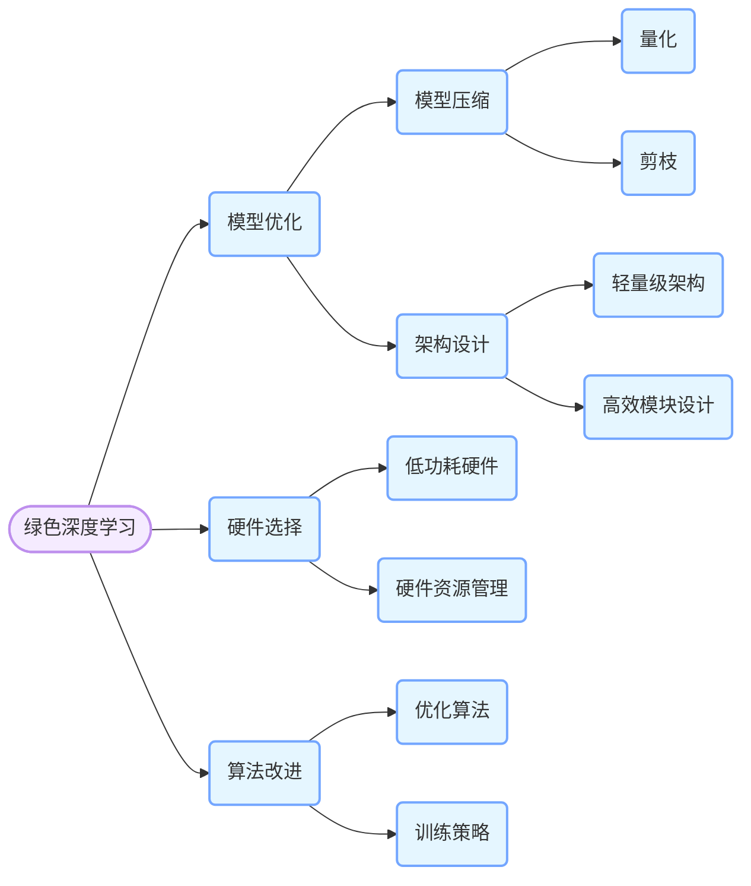

# 绿色深度学习:减少碳足迹的训练策略

> 关键词：绿色深度学习、碳足迹、训练策略、能源效率、模型优化

> 摘要：随着深度学习技术的飞速发展，其训练过程中消耗的大量能源和产生的高碳足迹问题日益凸显。本文旨在探讨绿色深度学习的概念，深入分析减少碳足迹的训练策略。首先介绍绿色深度学习的背景，包括其目的、预期读者和文档结构。接着阐述核心概念，如能源效率与深度学习的联系。详细讲解核心算法原理，通过 Python 代码示例说明如何在训练过程中优化能源消耗。介绍相关数学模型和公式，以量化碳足迹和能源消耗。通过项目实战展示减少碳足迹的具体实现方法。探讨绿色深度学习的实际应用场景，推荐相关的学习资源、开发工具和论文著作。最后总结未来发展趋势与挑战，并提供常见问题解答和扩展阅读参考资料。

## 1. 背景介绍 
### 1.1 目的和范围
深度学习在图像识别、自然语言处理、语音识别等众多领域取得了巨大成功。然而，深度学习模型的训练通常需要大量的计算资源，这导致了显著的能源消耗和碳排放。本文章的目的是研究和探讨如何通过有效的训练策略减少深度学习训练过程中的碳足迹，提高能源效率。范围涵盖了从核心概念的理解到实际应用场景的分析，以及相关工具和资源的推荐。

### 1.2 预期读者
本文预期读者包括深度学习研究者、人工智能工程师、数据科学家、对绿色计算感兴趣的开发者以及关注环境保护的技术爱好者。这些读者希望了解如何在深度学习训练中采取可持续的方法，减少对环境的影响。

### 1.3 文档结构概述
本文将按照以下结构进行组织：首先介绍绿色深度学习的核心概念和相关联系；接着详细讲解减少碳足迹的核心算法原理和具体操作步骤；介绍相关的数学模型和公式，并通过举例说明；通过项目实战展示具体的代码实现和分析；探讨绿色深度学习的实际应用场景；推荐相关的学习资源、开发工具和论文著作；总结未来发展趋势与挑战；提供常见问题解答和扩展阅读参考资料。

### 1.4 术语表
#### 1.4.1 核心术语定义
- **绿色深度学习**：指在深度学习训练和推理过程中，采用一系列策略和技术，以最小化能源消耗和碳排放，实现可持续发展的深度学习方法。
- **碳足迹**：指一个过程或活动在其整个生命周期中所产生的温室气体排放量，通常以二氧化碳当量（CO₂e）表示。
- **能源效率**：指在完成特定任务时，所消耗的能源与所取得的成果之间的比率。在深度学习中，能源效率通常指在训练或推理过程中，每单位计算资源所产生的有效模型性能。

#### 1.4.2 相关概念解释
- **模型压缩**：通过减少模型的参数数量、降低模型的复杂度等方法，来减小模型的存储空间和计算量，从而降低能源消耗。
- **量化**：将模型中的浮点数参数转换为低精度的整数或定点数，以减少存储和计算需求。
- **剪枝**：去除模型中对性能影响较小的连接或神经元，从而减少模型的复杂度和计算量。

#### 1.4.3 缩略词列表
- **GPU**：图形处理单元（Graphics Processing Unit），常用于加速深度学习训练。
- **CPU**：中央处理单元（Central Processing Unit）。
- **CO₂e**：二氧化碳当量（Carbon Dioxide Equivalent）。

## 2. 核心概念与联系 
### 2.1 绿色深度学习的核心概念
绿色深度学习的核心目标是在保证深度学习模型性能的前提下，尽可能减少训练和推理过程中的能源消耗和碳排放。这涉及到多个方面的技术和策略，包括模型优化、硬件选择、算法改进等。

### 2.2 能源效率与深度学习的联系
深度学习模型的训练和推理通常需要大量的计算资源，尤其是在使用 GPU 进行加速时。能源效率直接影响到模型训练的成本和对环境的影响。提高能源效率可以通过优化模型结构、减少不必要的计算、合理分配计算资源等方式实现。

### 2.3 文本示意图
以下是绿色深度学习中核心概念的文本示意图：

```plaintext
绿色深度学习
|-- 模型优化
|   |-- 模型压缩
|   |   |-- 量化
|   |   |-- 剪枝
|   |-- 架构设计
|       |-- 轻量级架构
|       |-- 高效模块设计
|-- 硬件选择
|   |-- 低功耗硬件
|   |-- 硬件资源管理
|-- 算法改进
|   |-- 优化算法
|   |-- 训练策略
```

### 2.4 Mermaid 流程图


## 3. 核心算法原理 & 具体操作步骤 
### 3.1 模型量化算法原理
模型量化是将模型中的浮点数参数转换为低精度的整数或定点数，以减少存储和计算需求。常见的量化方法包括 8 位整数量化和 4 位整数量化。

#### 3.1.1 量化原理
假设我们有一个浮点数参数 $x$，我们可以通过以下公式将其量化为整数 $q$：

$q = \text{round}(\frac{x}{s} + z)$

其中，$s$ 是缩放因子，$z$ 是零点偏移。在推理时，我们可以通过以下公式将量化后的整数 $q$ 反量化为浮点数 $\hat{x}$：

$\hat{x} = s(q - z)$

#### 3.1.2 Python 代码示例
```python
import numpy as np

# 随机生成一组浮点数参数
x = np.random.randn(10)

# 计算缩放因子和零点偏移
scale = np.max(np.abs(x)) / 127
zero_point = 0

# 量化
q = np.round(x / scale + zero_point).astype(np.int8)

# 反量化
x_hat = scale * (q - zero_point)

print("Original values:", x)
print("Quantized values:", q)
print("Dequantized values:", x_hat)
```

### 3.2 模型剪枝算法原理
模型剪枝是去除模型中对性能影响较小的连接或神经元，从而减少模型的复杂度和计算量。常见的剪枝方法包括基于幅度的剪枝和基于梯度的剪枝。

#### 3.2.1 基于幅度的剪枝原理
基于幅度的剪枝是根据参数的绝对值大小来决定是否剪枝。具体步骤如下：
1. 计算每个参数的绝对值。
2. 对绝对值进行排序。
3. 根据预设的剪枝比例，选择绝对值较小的参数进行剪枝。

#### 3.2.2 Python 代码示例
```python
import torch
import torch.nn as nn

# 定义一个简单的神经网络
class SimpleNet(nn.Module):
    def __init__(self):
        super(SimpleNet, self).__init__()
        self.fc1 = nn.Linear(10, 20)
        self.fc2 = nn.Linear(20, 1)

    def forward(self, x):
        x = torch.relu(self.fc1(x))
        x = self.fc2(x)
        return x

model = SimpleNet()

# 计算每个参数的绝对值
abs_params = []
for param in model.parameters():
    abs_params.extend(param.abs().flatten().tolist())

# 对绝对值进行排序
abs_params.sort()

# 预设剪枝比例
pruning_ratio = 0.2
num_pruned = int(len(abs_params) * pruning_ratio)
threshold = abs_params[num_pruned]

# 剪枝
for param in model.parameters():
    mask = torch.abs(param) > threshold
    param.data *= mask.float()

print("Model after pruning:", model)
```

### 3.3 具体操作步骤
#### 3.3.1 模型量化操作步骤
1. 选择合适的量化方法和量化位数。
2. 计算缩放因子和零点偏移。
3. 对模型参数进行量化。
4. 在推理时进行反量化。

#### 3.3.2 模型剪枝操作步骤
1. 定义剪枝策略（如基于幅度或基于梯度）。
2. 计算剪枝指标（如参数绝对值）。
3. 确定剪枝比例。
4. 根据剪枝指标和比例进行剪枝。

## 4. 数学模型和公式 & 详细讲解 & 举例说明 
### 4.1 能源消耗模型
深度学习训练过程中的能源消耗主要与计算量、硬件性能和训练时间有关。我们可以用以下公式来表示能源消耗 $E$：

$E = P \times t$

其中，$P$ 是硬件的功率，$t$ 是训练时间。

### 4.2 碳足迹计算模型
碳足迹 $CF$ 可以通过能源消耗 $E$ 和碳排放因子 $EF$ 来计算：

$CF = E \times EF$

碳排放因子 $EF$ 表示每单位能源消耗所产生的二氧化碳排放量，不同的能源来源具有不同的碳排放因子。

### 4.3 举例说明
假设我们使用一台功率为 $P = 500$ 瓦的 GPU 进行深度学习训练，训练时间为 $t = 10$ 小时。该地区的碳排放因子为 $EF = 0.5$ 千克 $CO₂e$ / 千瓦时。

首先，计算能源消耗 $E$：

$E = P \times t = 500 \text{ 瓦} \times 10 \text{ 小时} = 5000 \text{ 瓦时} = 5 \text{ 千瓦时}$

然后，计算碳足迹 $CF$：

$CF = E \times EF = 5 \text{ 千瓦时} \times 0.5 \text{ 千克 }CO₂e\text{ / 千瓦时} = 2.5 \text{ 千克 }CO₂e$

### 4.4 模型优化对能源消耗和碳足迹的影响
通过模型量化和剪枝等优化方法，可以减少计算量，从而降低能源消耗和碳足迹。假设经过模型优化后，计算量减少了 $50\%$，则能源消耗和碳足迹也将相应减少 $50\%$。

## 5. 项目实战：代码实际案例和详细解释说明 
### 5.1 开发环境搭建
#### 5.1.1 硬件环境
- 选择一台具有 GPU 的计算机，如 NVIDIA GPU。
- 确保计算机的硬件配置满足深度学习训练的要求。

#### 5.1.2 软件环境
- 安装 Python 3.x。
- 安装深度学习框架，如 PyTorch 或 TensorFlow。
- 安装必要的依赖库，如 NumPy、Matplotlib 等。

### 5.2 源代码详细实现和代码解读
#### 5.2.1 模型量化实现
```python
import torch
import torch.nn as nn
import torch.quantization

# 定义一个简单的神经网络
class SimpleNet(nn.Module):
    def __init__(self):
        super(SimpleNet, self).__init__()
        self.fc1 = nn.Linear(10, 20)
        self.fc2 = nn.Linear(20, 1)

    def forward(self, x):
        x = torch.relu(self.fc1(x))
        x = self.fc2(x)
        return x

# 创建模型实例
model = SimpleNet()

# 定义量化配置
quantization_config = torch.quantization.get_default_qconfig('fbgemm')

# 准备量化模型
model.qconfig = quantization_config
torch.quantization.prepare(model, inplace=True)

# 模拟训练过程
dummy_input = torch.randn(1, 10)
model(dummy_input)

# 完成量化
torch.quantization.convert(model, inplace=True)

print("Quantized model:", model)
```

#### 5.2.2 代码解读
- 定义了一个简单的神经网络 `SimpleNet`。
- 使用 `torch.quantization.get_default_qconfig` 获取默认的量化配置。
- 使用 `torch.quantization.prepare` 准备量化模型。
- 通过模拟训练过程，让模型收集统计信息。
- 使用 `torch.quantization.convert` 完成量化。

#### 5.2.3 模型剪枝实现
```python
import torch
import torch.nn as nn
import torch.nn.utils.prune as prune

# 定义一个简单的神经网络
class SimpleNet(nn.Module):
    def __init__(self):
        super(SimpleNet, self).__init__()
        self.fc1 = nn.Linear(10, 20)
        self.fc2 = nn.Linear(20, 1)

    def forward(self, x):
        x = torch.relu(self.fc1(x))
        x = self.fc2(x)
        return x

# 创建模型实例
model = SimpleNet()

# 对 fc1 层进行剪枝
prune.l1_unstructured(model.fc1, name='weight', amount=0.2)

print("Pruned model:", model)
```

#### 5.2.4 代码解读
- 定义了一个简单的神经网络 `SimpleNet`。
- 使用 `torch.nn.utils.prune.l1_unstructured` 对 `fc1` 层的权重进行基于 L1 范数的剪枝，剪枝比例为 $20\%$。

### 5.3 代码解读与分析
#### 5.3.1 模型量化代码分析
- 量化过程分为准备阶段和转换阶段。准备阶段主要是让模型收集统计信息，以便确定合适的缩放因子和零点偏移。转换阶段将模型参数从浮点数转换为低精度的整数。
- 使用 `fbgemm` 量化配置适用于 x86 架构的 CPU。对于不同的硬件平台，可以选择不同的量化配置。

#### 5.3.2 模型剪枝代码分析
- 基于 L1 范数的剪枝方法是根据参数的绝对值大小来决定是否剪枝。剪枝后，模型的参数数量会减少，但模型的结构仍然保持不变。
- 剪枝操作会在模型的权重上添加一个掩码，以屏蔽被剪枝的参数。

## 6. 实际应用场景 
### 6.1 边缘设备上的深度学习
在边缘设备（如智能手机、智能摄像头等）上运行深度学习模型时，能源消耗是一个关键问题。通过采用绿色深度学习策略，如模型量化和剪枝，可以减少模型的计算量和存储需求，从而降低能源消耗，延长设备的电池续航时间。

### 6.2 大规模数据中心的深度学习训练
大规模数据中心在进行深度学习训练时，消耗的能源巨大。采用绿色深度学习策略可以提高数据中心的能源效率，降低运营成本，同时减少对环境的影响。例如，通过优化模型架构和训练策略，减少不必要的计算，提高硬件资源的利用率。

### 6.3 实时应用中的深度学习
在实时应用（如自动驾驶、实时语音识别等）中，对模型的推理速度和能源效率有很高的要求。绿色深度学习策略可以帮助在保证实时性的前提下，减少能源消耗，提高系统的稳定性和可靠性。

## 7. 工具和资源推荐
### 7.1 学习资源推荐
#### 7.1.1 书籍推荐
- 《深度学习》（Deep Learning），作者：Ian Goodfellow、Yoshua Bengio 和 Aaron Courville。这本书是深度学习领域的经典教材，涵盖了深度学习的基本概念、算法和应用。
- 《动手学深度学习》（Dive into Deep Learning），作者：阿斯顿·张等。这本书提供了丰富的代码示例和实践指导，适合初学者快速上手深度学习。

#### 7.1.2 在线课程
- Coursera 上的《深度学习专项课程》（Deep Learning Specialization），由 Andrew Ng 教授授课。该课程系统地介绍了深度学习的各个方面，包括神经网络、卷积神经网络、循环神经网络等。
- edX 上的《强化学习基础》（Foundations of Reinforcement Learning），适合对强化学习感兴趣的读者。

#### 7.1.3 技术博客和网站
- Medium 上的 Towards Data Science 博客，有很多关于深度学习和人工智能的技术文章。
- 开源中国（OSChina），提供了丰富的技术资讯和开源项目。

### 7.2 开发工具框架推荐
#### 7.2.1 IDE和编辑器
- PyCharm：一款专业的 Python 集成开发环境，提供了丰富的代码编辑、调试和版本控制功能。
- Visual Studio Code：一款轻量级的代码编辑器，支持多种编程语言和插件扩展。

#### 7.2.2 调试和性能分析工具
- TensorBoard：TensorFlow 提供的可视化工具，可以用于监控模型训练过程、可视化模型结构和分析性能指标。
- PyTorch Profiler：PyTorch 提供的性能分析工具，可以帮助用户找出代码中的性能瓶颈。

#### 7.2.3 相关框架和库
- PyTorch：一个开源的深度学习框架，具有动态图特性，易于使用和调试。
- TensorFlow：一个广泛使用的深度学习框架，提供了丰富的工具和库，支持分布式训练。

### 7.3 相关论文著作推荐
#### 7.3.1 经典论文
- 《ImageNet Classification with Deep Convolutional Neural Networks》，作者：Alex Krizhevsky、Ilya Sutskever 和 Geoffrey E. Hinton。这篇论文提出了 AlexNet 模型，开启了深度学习在计算机视觉领域的热潮。
- 《Attention Is All You Need》，作者：Ashish Vaswani 等。这篇论文提出了 Transformer 模型，在自然语言处理领域取得了巨大成功。

#### 7.3.2 最新研究成果
- 关注 arXiv 预印本平台，搜索与绿色深度学习相关的最新研究论文。
- 参加国际机器学习会议（ICML）、神经信息处理系统大会（NeurIPS）等顶级学术会议，了解最新的研究动态。

#### 7.3.3 应用案例分析
- 阅读行业报告和案例分析，了解绿色深度学习在实际应用中的效果和经验。
- 参考开源项目的文档和代码，学习他人的实践经验。

## 8. 总结：未来发展趋势与挑战
### 8.1 未来发展趋势
- **更高效的模型架构设计**：未来将出现更多轻量级、高效的深度学习模型架构，以减少计算量和能源消耗。
- **硬件与算法的协同优化**：硬件制造商将与算法研究者合作，开发专门针对绿色深度学习的硬件设备和优化算法。
- **可持续的深度学习生态系统**：建立可持续的深度学习生态系统，包括数据中心的能源管理、模型的生命周期评估等。

### 8.2 挑战
- **模型性能与能源效率的平衡**：在减少能源消耗的同时，如何保证模型的性能不下降是一个挑战。
- **技术的普及和推广**：绿色深度学习技术需要得到更广泛的普及和推广，以实现大规模的应用。
- **标准和规范的制定**：需要制定相关的标准和规范，以评估和比较不同绿色深度学习方法的效果。

## 9. 附录：常见问题与解答
### 9.1 模型量化会影响模型性能吗？
模型量化通常会对模型性能产生一定的影响，但通过合理的量化方法和参数调整，可以将性能损失控制在可接受的范围内。在某些情况下，量化后的模型甚至可以提高推理速度。

### 9.2 模型剪枝后还能继续训练吗？
模型剪枝后可以继续训练。在剪枝过程中，会在模型的权重上添加一个掩码，屏蔽被剪枝的参数。在后续训练中，被剪枝的参数不会被更新，但模型的其他参数可以继续学习。

### 9.3 如何选择合适的绿色深度学习策略？
选择合适的绿色深度学习策略需要考虑多个因素，如模型的类型、应用场景、硬件平台等。一般来说，可以先从简单的策略开始尝试，如模型量化，然后根据实际效果进行调整。

## 10. 扩展阅读 & 参考资料
### 10.1 扩展阅读
- 《绿色计算：原理与实践》（Green Computing: Principles and Practices），深入介绍了绿色计算的相关理论和技术。
- 《人工智能与可持续发展》（Artificial Intelligence and Sustainable Development），探讨了人工智能在可持续发展中的应用和挑战。

### 10.2 参考资料
- 相关的学术论文和研究报告，如 IEEE 期刊、ACM 会议论文等。
- 开源项目的文档和代码，如 PyTorch、TensorFlow 的官方文档。