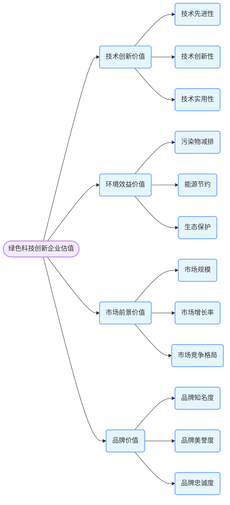

# 绿色科技创新企业的估值挑战与机遇

> 关键词：绿色科技创新企业、企业估值、估值挑战、估值机遇、可持续发展

> 摘要：本文聚焦于绿色科技创新企业的估值问题，深入探讨了这类企业在估值过程中所面临的挑战以及潜藏的机遇。通过对背景的介绍，明确了研究的目的、范围、预期读者和文档结构。详细阐述了与绿色科技创新企业估值相关的核心概念及其联系，并给出了直观的示意图和流程图。在核心算法原理和操作步骤部分，运用Python代码进行了分析。结合数学模型和公式，辅以实际例子加深理解。通过项目实战案例，从开发环境搭建到代码实现和解读，全面展示了估值的实践过程。同时，分析了绿色科技创新企业的实际应用场景，推荐了相关的学习资源、开发工具框架和论文著作。最后总结了未来发展趋势与挑战，提供了常见问题解答和扩展阅读参考资料，旨在为投资者、企业管理者等提供全面且深入的绿色科技创新企业估值知识。

## 1. 背景介绍 
### 1.1 目的和范围
本研究旨在全面剖析绿色科技创新企业在估值方面所面临的独特挑战以及蕴含的潜在机遇。随着全球对可持续发展的关注度不断提升，绿色科技创新企业在经济体系中的地位日益重要。然而，由于其自身的特点，如技术创新性、环境效益的量化困难等，使得传统的估值方法难以准确评估其价值。本研究将涵盖绿色科技创新企业的各个方面，包括技术研发、市场前景、环境影响等，以确定适合这类企业的估值方法和策略。

### 1.2 预期读者
本文的预期读者主要包括投资者、企业管理者、金融分析师、政策制定者以及对绿色科技领域感兴趣的研究人员。投资者可以通过本文了解绿色科技创新企业估值的复杂性和机遇，从而做出更明智的投资决策；企业管理者能够掌握如何提升企业估值的方法和途径；金融分析师可以借鉴本文的研究成果，改进估值模型；政策制定者可以根据研究结果制定有利于绿色科技创新企业发展的政策；研究人员则可以在本文的基础上开展更深入的学术研究。

### 1.3 文档结构概述
本文将按照以下结构展开：首先介绍绿色科技创新企业估值的背景信息，包括目的、范围、预期读者和文档结构概述；接着阐述与绿色科技创新企业估值相关的核心概念及其联系，并通过示意图和流程图进行直观展示；然后详细讲解核心算法原理和具体操作步骤，并用Python代码进行实现；再结合数学模型和公式，通过实际例子进行说明；之后通过项目实战案例，展示从开发环境搭建到代码实现和解读的全过程；分析绿色科技创新企业的实际应用场景；推荐相关的学习资源、开发工具框架和论文著作；最后总结未来发展趋势与挑战，提供常见问题解答和扩展阅读参考资料。

### 1.4 术语表
#### 1.4.1 核心术语定义
- **绿色科技创新企业**：指专注于开发和应用具有环保、可持续发展特点的新技术、新产品或新服务的企业。这些企业的创新活动旨在减少对环境的负面影响，提高资源利用效率，促进经济的绿色转型。
- **企业估值**：是指对企业的整体价值进行评估的过程。估值的目的是为了确定企业在特定时间点的市场价值，为投资者、企业管理者等提供决策依据。
- **可持续发展**：是指既满足当代人的需求，又不损害后代人满足其需求的能力的发展模式。在绿色科技创新企业中，可持续发展体现为企业的技术创新和经营活动符合环境保护和社会发展的要求。

#### 1.4.2 相关概念解释
- **环境效益**：指企业的生产经营活动对环境产生的积极影响，如减少污染物排放、节约能源、保护生态环境等。环境效益是绿色科技创新企业的重要价值体现之一。
- **技术创新**：指企业通过研发和应用新技术、新工艺、新方法等，提高生产效率、降低成本、提升产品质量和市场竞争力的过程。技术创新是绿色科技创新企业的核心竞争力。
- **市场前景**：指企业所处的市场环境和未来发展趋势。对于绿色科技创新企业来说，市场前景受到政策支持、消费者需求、技术发展等多种因素的影响。

#### 1.4.3 缩略词列表
- **ESG**：环境（Environmental）、社会（Social）和治理（Governance）的缩写，是衡量企业可持续发展表现的重要指标。
- **NPV**：净现值（Net Present Value）的缩写，是一种常用的投资决策方法，用于评估投资项目的盈利能力。
- **DCF**：现金流折现法（Discounted Cash Flow）的缩写，是一种常用的企业估值方法，通过预测企业未来的现金流并将其折现到当前时刻来确定企业的价值。

## 2. 核心概念与联系 

### 核心概念原理
绿色科技创新企业的估值涉及多个核心概念，这些概念相互关联，共同影响着企业的价值。

#### 技术创新价值
绿色科技创新企业的核心竞争力在于其技术创新能力。企业通过研发和应用新技术，能够提供更高效、更环保的产品或服务，从而获得竞争优势。技术创新价值可以从技术的先进性、创新性、实用性等方面进行评估。例如，一家研发新型太阳能电池技术的企业，其技术的转换效率、成本效益等指标将直接影响其技术创新价值。

#### 环境效益价值
环境效益是绿色科技创新企业的重要价值体现。企业的生产经营活动对环境产生的积极影响，如减少污染物排放、节约能源、保护生态环境等，能够为企业带来额外的价值。环境效益价值可以通过量化评估企业的环境绩效来确定。例如，一家污水处理企业通过采用先进的处理技术，减少了污水中的污染物排放，其环境效益价值可以通过计算减少的污染物处理成本和环境改善带来的社会效益来评估。

#### 市场前景价值
市场前景是影响绿色科技创新企业估值的重要因素之一。企业所处的市场环境和未来发展趋势将直接影响其盈利能力和发展潜力。市场前景价值可以从市场规模、市场增长率、市场竞争格局等方面进行评估。例如，随着全球对清洁能源的需求不断增加，一家专注于风力发电技术研发的企业，其市场前景价值将随着市场规模的扩大而增加。

#### 品牌价值
品牌价值是企业在市场中树立的良好形象和声誉所带来的价值。对于绿色科技创新企业来说，品牌价值尤为重要。一个具有良好品牌形象的企业，能够获得消费者的信任和认可，从而提高市场竞争力。品牌价值可以通过品牌知名度、品牌美誉度、品牌忠诚度等方面进行评估。例如，一家知名的绿色食品企业，其品牌价值将使其产品在市场上具有更高的售价和更广阔的市场份额。

### 架构的文本示意图
```plaintext
绿色科技创新企业估值
|-- 技术创新价值
|   |-- 技术先进性
|   |-- 技术创新性
|   |-- 技术实用性
|-- 环境效益价值
|   |-- 污染物减排
|   |-- 能源节约
|   |-- 生态保护
|-- 市场前景价值
|   |-- 市场规模
|   |-- 市场增长率
|   |-- 市场竞争格局
|-- 品牌价值
|   |-- 品牌知名度
|   |-- 品牌美誉度
|   |-- 品牌忠诚度
```

### Mermaid 流程图


## 3. 核心算法原理 & 具体操作步骤 

### 核心算法原理
在绿色科技创新企业的估值中，现金流折现法（DCF）是一种常用的方法。DCF法的基本原理是将企业未来的现金流折现到当前时刻，以确定企业的价值。具体来说，DCF法的步骤如下：

1. **预测未来现金流**：根据企业的历史财务数据、市场前景、技术创新等因素，预测企业未来的自由现金流。自由现金流是指企业在满足了所有运营成本和资本支出后剩余的现金流量。
2. **确定折现率**：折现率是将未来现金流折现到当前时刻的利率。折现率的确定需要考虑企业的风险水平、市场利率等因素。一般来说，绿色科技创新企业的风险较高，因此折现率也相对较高。
3. **计算净现值**：将预测的未来现金流按照折现率折现到当前时刻，然后求和得到企业的净现值。净现值是企业的价值减去初始投资后的余额。

### 具体操作步骤
以下是使用Python实现DCF法进行绿色科技创新企业估值的具体步骤：

```python
import numpy as np

# 步骤1：预测未来现金流
# 假设我们预测企业未来5年的自由现金流
cash_flows = [100, 120, 140, 160, 180]  # 单位：万元

# 步骤2：确定折现率
# 假设折现率为10%
discount_rate = 0.1

# 步骤3：计算净现值
npv = np.npv(discount_rate, [0] + cash_flows)
print(f"企业的净现值为: {npv} 万元")
```

### 代码解释
1. **预测未来现金流**：我们假设企业未来5年的自由现金流分别为100万元、120万元、140万元、160万元和180万元。这些数据可以根据企业的历史财务数据、市场前景、技术创新等因素进行预测。
2. **确定折现率**：我们假设折现率为10%。折现率的确定需要考虑企业的风险水平、市场利率等因素。一般来说，绿色科技创新企业的风险较高，因此折现率也相对较高。
3. **计算净现值**：使用`np.npv()`函数计算企业的净现值。`np.npv()`函数的第一个参数是折现率，第二个参数是现金流列表。需要注意的是，现金流列表的第一个元素应该为0，表示初始投资。

## 4. 数学模型和公式 & 详细讲解 & 举例说明 

### 数学模型和公式
DCF法的数学模型可以表示为：

$$NPV = \sum_{t=0}^{n} \frac{CF_t}{(1 + r)^t}$$

其中：
- $NPV$ 是企业的净现值
- $CF_t$ 是第 $t$ 年的自由现金流
- $r$ 是折现率
- $n$ 是预测的年数

### 详细讲解
1. **现金流预测**：$CF_t$ 表示第 $t$ 年的自由现金流。自由现金流是企业在满足了所有运营成本和资本支出后剩余的现金流量。现金流预测需要考虑企业的历史财务数据、市场前景、技术创新等因素。
2. **折现率**：$r$ 是折现率，用于将未来现金流折现到当前时刻。折现率的确定需要考虑企业的风险水平、市场利率等因素。一般来说，绿色科技创新企业的风险较高，因此折现率也相对较高。
3. **净现值计算**：将预测的未来现金流按照折现率折现到当前时刻，然后求和得到企业的净现值。净现值是企业的价值减去初始投资后的余额。

### 举例说明
假设一家绿色科技创新企业未来5年的自由现金流分别为100万元、120万元、140万元、160万元和180万元，折现率为10%。则该企业的净现值可以计算如下：

$$NPV = \frac{100}{(1 + 0.1)^1} + \frac{120}{(1 + 0.1)^2} + \frac{140}{(1 + 0.1)^3} + \frac{160}{(1 + 0.1)^4} + \frac{180}{(1 + 0.1)^5}$$

使用Python代码计算：

```python
import numpy as np

cash_flows = [100, 120, 140, 160, 180]
discount_rate = 0.1

npv = np.npv(discount_rate, [0] + cash_flows)
print(f"企业的净现值为: {npv} 万元")
```

运行上述代码，得到企业的净现值为：

```plaintext
企业的净现值为: 532.5947740939741 万元
```

## 5. 项目实战：代码实际案例和详细解释说明 

### 5.1  开发环境搭建
为了实现绿色科技创新企业的估值，我们需要搭建一个Python开发环境。以下是具体的搭建步骤：

1. **安装Python**：从Python官方网站（https://www.python.org/downloads/）下载并安装Python 3.x版本。
2. **安装必要的库**：使用`pip`命令安装必要的库，如`numpy`、`pandas`等。

```bash
pip install numpy pandas
```

### 5.2  源代码详细实现和代码解读
以下是一个完整的Python代码示例，用于实现绿色科技创新企业的估值：

```python
import numpy as np
import pandas as pd

# 步骤1：预测未来现金流
# 假设我们有一个包含未来10年自由现金流的CSV文件
data = pd.read_csv('cash_flows.csv')
cash_flows = data['cash_flow'].values

# 步骤2：确定折现率
# 假设折现率为12%
discount_rate = 0.12

# 步骤3：计算净现值
npv = np.npv(discount_rate, [0] + list(cash_flows))
print(f"企业的净现值为: {npv} 万元")

# 步骤4：敏感性分析
# 分析折现率变化对净现值的影响
discount_rates = np.linspace(0.1, 0.2, 11)
npvs = []
for rate in discount_rates:
    npv = np.npv(rate, [0] + list(cash_flows))
    npvs.append(npv)

# 绘制敏感性分析图
import matplotlib.pyplot as plt

plt.plot(discount_rates, npvs)
plt.xlabel('Discount Rate')
plt.ylabel('Net Present Value')
plt.title('Sensitivity Analysis of Discount Rate')
plt.show()
```

### 代码解读与分析
1. **预测未来现金流**：我们假设未来10年的自由现金流数据存储在一个CSV文件中，使用`pandas`库读取该文件，并提取现金流数据。
2. **确定折现率**：我们假设折现率为12%。折现率的确定需要考虑企业的风险水平、市场利率等因素。
3. **计算净现值**：使用`np.npv()`函数计算企业的净现值。
4. **敏感性分析**：为了分析折现率变化对净现值的影响，我们使用`np.linspace()`函数生成一系列折现率，并计算对应的净现值。最后，使用`matplotlib`库绘制敏感性分析图。

通过敏感性分析，我们可以直观地看到折现率变化对净现值的影响。如果折现率上升，净现值将下降；反之，如果折现率下降，净现值将上升。这有助于我们评估企业估值的风险。

## 6. 实际应用场景 
绿色科技创新企业的估值在多个实际应用场景中具有重要意义：

### 投资决策
投资者在决定是否投资绿色科技创新企业时，需要对企业的价值进行评估。准确的估值可以帮助投资者判断企业的投资回报率和风险水平，从而做出明智的投资决策。例如，一家风险投资公司在考虑投资一家研发新型电动汽车电池技术的企业时，通过对该企业的估值，可以确定是否值得投资以及投资的金额。

### 企业并购
在企业并购过程中，估值是确定交易价格的重要依据。对于绿色科技创新企业来说，其独特的技术和市场前景使得估值更加复杂。准确的估值可以帮助并购双方达成公平合理的交易价格，促进企业的资源整合和优化配置。例如，一家大型能源企业并购一家小型太阳能发电技术创新企业时，需要对目标企业进行估值，以确定并购的价格和方式。

### 企业融资
绿色科技创新企业在发展过程中需要大量的资金支持，融资是企业获取资金的重要途径。在融资过程中，企业需要向投资者展示其价值，以吸引投资。准确的估值可以帮助企业确定合理的融资规模和融资价格，提高融资的成功率。例如，一家绿色建筑材料研发企业在进行股权融资时，通过对企业的估值，可以向投资者展示企业的发展潜力和投资价值，从而吸引更多的投资者。

### 政策制定
政府在制定支持绿色科技创新企业发展的政策时，需要对企业的价值和发展前景进行评估。准确的估值可以帮助政府了解绿色科技创新企业的实际情况，制定更加针对性和有效性的政策。例如，政府在制定税收优惠政策、财政补贴政策时，需要考虑企业的估值和发展需求，以确保政策的实施能够促进企业的发展。

## 7. 工具和资源推荐
### 7.1 学习资源推荐
#### 7.1.1 书籍推荐
- 《企业估值：理论与实践》：本书系统介绍了企业估值的基本理论和方法，包括现金流折现法、相对估值法等，并结合实际案例进行了详细讲解。
- 《绿色金融与可持续发展》：该书探讨了绿色金融的概念、发展现状和趋势，以及绿色金融在支持绿色科技创新企业发展中的作用。
- 《科技创新与企业价值创造》：本书分析了科技创新对企业价值创造的影响，以及如何评估科技创新企业的价值。

#### 7.1.2 在线课程
- Coursera平台上的“企业估值与财务建模”课程：该课程由知名商学院教授授课，系统介绍了企业估值的方法和财务建模的技巧。
- edX平台上的“绿色金融与可持续投资”课程：该课程讲解了绿色金融的基本概念、政策法规和投资策略，以及如何评估绿色投资项目的价值。
- 中国大学MOOC平台上的“科技创新管理”课程：该课程介绍了科技创新的管理方法和策略，以及如何评估科技创新项目的价值和风险。

#### 7.1.3 技术博客和网站
- Seeking Alpha：该网站提供了大量的企业估值分析文章和研究报告，涵盖了各种行业和企业类型。
- GreenBiz：该网站专注于绿色科技和可持续发展领域的新闻和分析，提供了有关绿色科技创新企业的最新动态和估值信息。
- 36氪：该网站是国内知名的科技媒体，报道了大量的科技创新企业的动态和估值情况，对绿色科技创新企业也有较多的关注。

### 7.2 开发工具框架推荐
#### 7.2.1 IDE和编辑器
- PyCharm：是一款专业的Python集成开发环境，具有强大的代码编辑、调试和项目管理功能，适合用于开发绿色科技创新企业估值的Python代码。
- Jupyter Notebook：是一个交互式的开发环境，支持Python、R等多种编程语言，适合用于数据分析和模型验证。可以使用Jupyter Notebook进行绿色科技创新企业估值的数据处理和模型实现。
- Visual Studio Code：是一款轻量级的代码编辑器，具有丰富的插件和扩展功能，支持多种编程语言。可以使用Visual Studio Code进行绿色科技创新企业估值的代码开发和调试。

#### 7.2.2 调试和性能分析工具
- pdb：是Python自带的调试工具，可以帮助开发者在代码中设置断点、单步执行代码，从而定位和解决代码中的问题。在绿色科技创新企业估值的代码开发过程中，可以使用pdb进行调试。
- cProfile：是Python的性能分析工具，可以帮助开发者分析代码的执行时间和资源消耗情况，从而优化代码性能。在绿色科技创新企业估值的代码优化过程中，可以使用cProfile进行性能分析。
- Py-Spy：是一个跨平台的Python性能分析工具，可以实时监控Python程序的性能，并生成性能分析报告。在绿色科技创新企业估值的代码性能优化过程中，可以使用Py-Spy进行实时监控和分析。

#### 7.2.3 相关框架和库
- numpy：是Python的一个基础科学计算库，提供了高效的数组操作和数学函数，适合用于绿色科技创新企业估值中的数据处理和数值计算。
- pandas：是Python的一个数据分析库，提供了灵活的数据结构和数据处理工具，适合用于绿色科技创新企业估值中的数据清洗、整理和分析。
- scikit-learn：是Python的一个机器学习库，提供了丰富的机器学习算法和工具，适合用于绿色科技创新企业估值中的模型构建和预测。

### 7.3 相关论文著作推荐
#### 7.3.1 经典论文
- 《The Theory of Investment Value》：该论文由John Burr Williams撰写，提出了现金流折现法的基本理论，为企业估值提供了重要的理论基础。
- 《Valuation and Corporate Finance: A Practitioner's Guide》：该论文由Aswath Damodaran撰写，系统介绍了企业估值的方法和应用，是企业估值领域的经典之作。
- 《Green Finance and Sustainable Development》：该论文探讨了绿色金融的概念、发展现状和趋势，以及绿色金融在支持绿色科技创新企业发展中的作用。

#### 7.3.2 最新研究成果
- 《Valuation of Green Technology Innovation Firms: A Review and Future Research Directions》：该论文对绿色科技创新企业的估值方法进行了综述，并提出了未来的研究方向。
- 《The Impact of Environmental, Social, and Governance (ESG) Factors on Firm Value: Evidence from Green Technology Firms》：该论文研究了环境、社会和治理（ESG）因素对绿色科技创新企业价值的影响。
- 《Valuation of Renewable Energy Projects: A Real Options Approach》：该论文采用实物期权方法对可再生能源项目进行估值，为绿色科技创新企业的项目估值提供了新的思路。

#### 7.3.3 应用案例分析
- 《Case Study: Valuation of a Solar Power Technology Startup》：该案例分析了一家太阳能发电技术初创企业的估值过程和方法，为类似企业的估值提供了参考。
- 《Valuation of a Wind Energy Company: A Comparative Analysis》：该案例对一家风能企业的估值进行了比较分析，探讨了不同估值方法的优缺点。
- 《Case Study: Valuation of a Green Building Materials Manufacturer》：该案例分析了一家绿色建筑材料制造商的估值情况，包括企业的技术创新、市场前景和环境效益等方面。

## 8. 总结：未来发展趋势与挑战
### 未来发展趋势
- **政策支持力度加大**：随着全球对可持续发展的关注度不断提升，各国政府将加大对绿色科技创新企业的政策支持力度。政府可能会出台更多的税收优惠政策、财政补贴政策和绿色金融政策，以促进绿色科技创新企业的发展。
- **市场需求增长**：消费者对环保、可持续产品和服务的需求将不断增加，这将为绿色科技创新企业带来广阔的市场空间。例如，随着电动汽车市场的快速发展，对电池技术、充电桩技术等绿色科技创新的需求也将不断增加。
- **技术创新加速**：绿色科技创新企业将不断加大研发投入，推动技术创新的加速发展。例如，在可再生能源领域，太阳能、风能等技术将不断提高效率、降低成本；在环保领域，污水处理、垃圾处理等技术将不断创新。
- **估值方法不断完善**：随着绿色科技创新企业的不断发展，传统的估值方法将难以满足其估值需求。未来，将出现更多适合绿色科技创新企业的估值方法，如考虑环境效益、技术创新价值等因素的估值方法。

### 挑战
- **技术不确定性**：绿色科技创新企业的技术研发具有较高的不确定性，新技术的研发周期长、成本高，且可能面临技术失败的风险。这给企业的估值带来了较大的困难。
- **环境效益量化困难**：绿色科技创新企业的环境效益往往难以准确量化，如减少的污染物排放、节约的能源等。这使得在估值过程中难以准确评估企业的环境效益价值。
- **市场竞争激烈**：随着绿色科技创新市场的不断发展，市场竞争将日益激烈。企业需要不断提升自身的技术创新能力和市场竞争力，以在市场中立足。这也给企业的估值带来了一定的挑战。
- **政策风险**：绿色科技创新企业的发展在很大程度上依赖于政府的政策支持。政策的变化可能会对企业的发展产生重大影响，如税收优惠政策的取消、财政补贴的减少等。这增加了企业估值的风险。

## 9. 附录：常见问题与解答
### 问题1：绿色科技创新企业的估值与传统企业的估值有什么不同？
答：绿色科技创新企业的估值与传统企业的估值存在以下不同：
- **技术创新价值**：绿色科技创新企业的核心竞争力在于其技术创新能力，因此在估值时需要重点考虑技术创新价值。而传统企业的技术相对成熟，技术创新价值在估值中的比重相对较小。
- **环境效益价值**：绿色科技创新企业的生产经营活动对环境产生的积极影响是其重要价值体现之一，需要在估值中考虑环境效益价值。而传统企业的环境影响相对较小，环境效益价值在估值中的比重相对较低。
- **市场前景**：绿色科技创新企业所处的市场环境和未来发展趋势与传统企业有所不同，需要对其市场前景进行更深入的分析和评估。例如，绿色科技创新企业可能面临新兴市场的机会和挑战，市场前景的不确定性较大。

### 问题2：如何量化绿色科技创新企业的环境效益价值？
答：量化绿色科技创新企业的环境效益价值可以从以下几个方面入手：
- **污染物减排**：计算企业减少的污染物排放量，并根据污染物的处理成本和环境损害成本来评估其价值。例如，一家污水处理企业减少了污水中的化学需氧量（COD）排放，可以根据COD的处理成本和对水环境的影响来评估其环境效益价值。
- **能源节约**：计算企业节约的能源量，并根据能源的市场价格来评估其价值。例如，一家节能技术创新企业通过采用新技术，降低了企业的能源消耗，可以根据节约的能源量和能源价格来评估其环境效益价值。
- **生态保护**：评估企业对生态环境的保护和改善作用，并根据生态系统服务价值来评估其价值。例如，一家生态修复企业通过对受损生态系统的修复，提高了生态系统的服务功能，可以根据生态系统服务价值的提升来评估其环境效益价值。

### 问题3：在绿色科技创新企业的估值中，如何考虑技术创新的风险？
答：在绿色科技创新企业的估值中，考虑技术创新的风险可以从以下几个方面入手：
- **技术成熟度**：评估企业的技术是否成熟，是否已经经过了市场验证。技术成熟度越高，技术创新的风险越低。
- **研发进度**：了解企业的研发进度，评估研发项目的成功率。研发进度越快，研发项目的成功率越高，技术创新的风险越低。
- **竞争态势**：分析企业所处的竞争态势，评估竞争对手的技术实力和市场份额。如果竞争对手的技术实力较强，市场份额较大，企业的技术创新风险较高。
- **技术替代风险**：考虑企业的技术是否存在被替代的风险。如果存在技术替代风险，企业的技术创新价值可能会受到影响。

### 问题4：绿色科技创新企业的估值方法有哪些？
答：绿色科技创新企业的估值方法主要包括以下几种：
- **现金流折现法（DCF）**：通过预测企业未来的现金流，并将其折现到当前时刻来确定企业的价值。该方法适用于具有稳定现金流的企业。
- **相对估值法**：通过比较同行业类似企业的估值指标，如市盈率、市净率等，来确定企业的价值。该方法适用于市场上有较多可比企业的情况。
- **实物期权法**：考虑企业的技术创新和投资决策具有期权的特征，通过期权定价模型来评估企业的价值。该方法适用于具有较高不确定性和灵活性的项目。
- **综合估值法**：综合考虑企业的技术创新价值、环境效益价值、市场前景价值等因素，采用多种估值方法进行评估，并根据企业的实际情况进行调整。

## 10. 扩展阅读 & 参考资料
### 扩展阅读
- 《Sustainable Finance: The Future of Investing》：本书探讨了可持续金融的发展趋势和投资策略，为投资者提供了在绿色科技创新企业投资方面的指导。
- 《The Green Economy: Unleashing the Potential of Sustainability》：该书介绍了绿色经济的概念和发展模式，分析了绿色科技创新企业在绿色经济中的作用和机遇。
- 《Innovation and Entrepreneurship in the Green Technology Sector》：本书研究了绿色技术领域的创新和创业问题，探讨了绿色科技创新企业的发展路径和商业模式。

### 参考资料
- 相关行业报告：如《全球绿色科技产业发展报告》、《中国绿色金融发展报告》等，提供了绿色科技创新企业的行业数据和发展趋势。
- 企业财务报表：绿色科技创新企业的财务报表是了解企业财务状况和经营业绩的重要依据，可以用于估值分析。
- 学术论文数据库：如知网、万方、维普等，提供了大量关于绿色科技创新企业估值的学术研究成果。
- 政府政策文件：政府出台的相关政策文件，如《绿色产业指导目录》、《关于促进绿色金融发展的指导意见》等，对绿色科技创新企业的发展和估值具有重要影响。