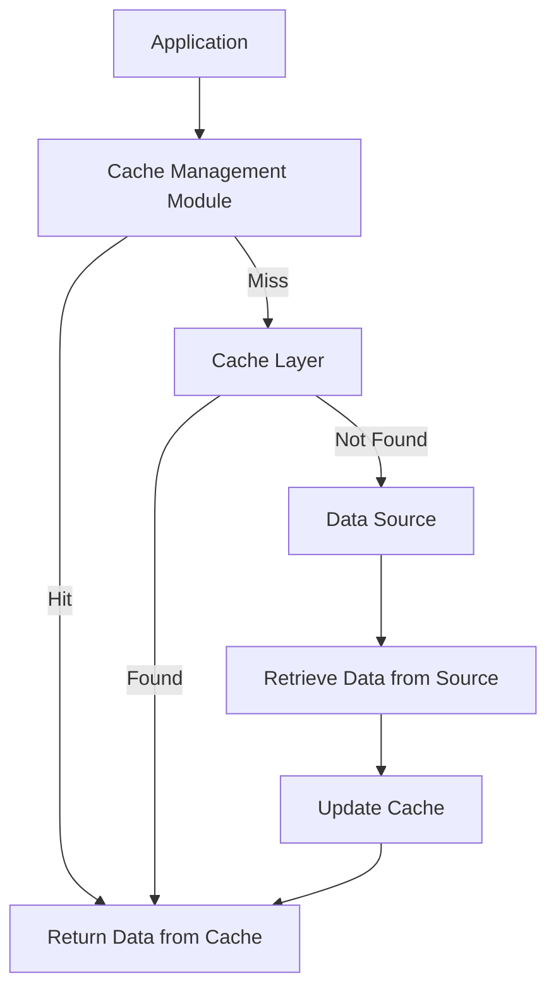

# 缓存策略的智能优化：命中率提升

> 关键词：缓存策略、智能优化、命中率、缓存算法、缓存架构

> 摘要：本文围绕缓存策略的智能优化以提升命中率展开。首先介绍了缓存相关的背景知识，包括目的、预期读者等内容。接着阐述了缓存的核心概念与联系，通过文本示意图和 Mermaid 流程图进行清晰展示。详细讲解了核心算法原理并给出 Python 源代码示例，还介绍了相关的数学模型和公式。通过项目实战部分，展示了缓存优化在实际开发中的具体实现和代码解读。探讨了缓存策略的实际应用场景，推荐了学习、开发等方面的工具和资源。最后总结了缓存策略未来的发展趋势与挑战，并提供常见问题解答和扩展阅读参考资料，旨在帮助读者全面深入地理解缓存策略的智能优化及命中率提升的相关知识。

## 1. 背景介绍 
### 1.1 目的和范围
在当今的计算机系统中，缓存作为一种重要的技术手段，被广泛应用于各个领域，如 Web 开发、数据库系统、操作系统等。缓存的主要目的是减少对慢速存储设备（如磁盘）的访问，提高系统的响应速度和性能。然而，缓存的效果很大程度上取决于缓存策略的优劣。一个好的缓存策略可以显著提高缓存的命中率，从而减少系统的延迟和资源消耗。

本文的范围主要涵盖缓存策略的智能优化方法，旨在探讨如何通过合理的算法和技术手段，提高缓存的命中率。我们将从缓存的基本概念出发，深入分析不同的缓存算法和优化策略，并通过实际的代码案例和应用场景进行详细说明。

### 1.2 预期读者
本文的预期读者包括软件开发人员、系统架构师、数据库管理员以及对计算机系统性能优化感兴趣的技术爱好者。无论你是初学者还是有一定经验的专业人士，都可以从本文中获取关于缓存策略优化的有用信息和技术思路。

### 1.3 文档结构概述
本文将按照以下结构进行组织：
1. **背景介绍**：介绍缓存策略优化的目的、预期读者和文档结构概述，以及相关术语的定义和解释。
2. **核心概念与联系**：阐述缓存的核心概念、原理和架构，通过文本示意图和 Mermaid 流程图进行展示。
3. **核心算法原理 & 具体操作步骤**：详细讲解常见的缓存算法原理，并使用 Python 源代码进行具体实现和说明。
4. **数学模型和公式 & 详细讲解 & 举例说明**：介绍缓存命中率的数学模型和相关公式，并通过具体例子进行详细讲解。
5. **项目实战：代码实际案例和详细解释说明**：通过一个实际的项目案例，展示缓存策略优化的具体实现过程和代码解读。
6. **实际应用场景**：探讨缓存策略在不同领域的实际应用场景和效果。
7. **工具和资源推荐**：推荐学习缓存相关知识的书籍、在线课程、技术博客和网站，以及开发工具、框架和相关论文著作。
8. **总结：未来发展趋势与挑战**：总结缓存策略的发展趋势和面临的挑战。
9. **附录：常见问题与解答**：解答关于缓存策略优化的常见问题。
10. **扩展阅读 & 参考资料**：提供相关的扩展阅读资源和参考资料。

### 1.4 术语表
#### 1.4.1 核心术语定义
- **缓存（Cache）**：一种高速数据存储区域，用于临时存储经常访问的数据，以减少对慢速存储设备的访问次数。
- **命中率（Hit Rate）**：缓存中命中（即找到所需数据）的次数与总访问次数的比值，是衡量缓存性能的重要指标。
- **缓存策略（Cache Policy）**：决定哪些数据应该被缓存，以及何时替换缓存中已有数据的规则和算法。
- **缓存淘汰算法（Cache Eviction Algorithm）**：当缓存空间满时，用于选择哪些数据应该被淘汰出缓存的算法。

#### 1.4.2 相关概念解释
- **局部性原理（Principle of Locality）**：计算机程序在执行过程中，倾向于访问最近使用过的数据和指令（时间局部性），以及相邻地址的数据和指令（空间局部性）。缓存正是基于局部性原理来提高性能的。
- **缓存击穿（Cache Breakdown）**：指在高并发场景下，某个热点 key 在缓存中过期，导致大量请求直接访问数据库，从而对数据库造成巨大压力的现象。
- **缓存穿透（Cache Penetration）**：指查询一个不存在的数据，由于缓存中没有该数据，每次请求都会直接访问数据库，导致数据库压力增大的现象。

#### 1.4.3 缩略词列表
- **LRU（Least Recently Used）**：最近最少使用算法，一种常见的缓存淘汰算法。
- **LFU（Least Frequently Used）**：最不经常使用算法，另一种常见的缓存淘汰算法。
- **FIFO（First In First Out）**：先进先出算法，一种简单的缓存淘汰算法。

## 2. 核心概念与联系 
### 缓存的基本原理
缓存的基本原理是利用局部性原理，将经常访问的数据存储在高速的缓存中，当需要访问这些数据时，首先从缓存中查找，如果找到则直接返回，避免了对慢速存储设备的访问，从而提高了系统的响应速度。

### 缓存的架构
一个典型的缓存架构通常包括以下几个部分：
- **缓存层（Cache Layer）**：用于存储缓存数据的高速存储区域，可以是内存、磁盘或其他高速存储设备。
- **缓存管理模块（Cache Management Module）**：负责缓存数据的读写、淘汰和更新等操作，根据缓存策略来管理缓存的行为。
- **数据源（Data Source）**：提供原始数据的存储设备，如数据库、文件系统等。

### 文本示意图
```plaintext
+---------------------+
|    Application      |
+---------------------+
           |
           v
+---------------------+
|   Cache Management  |
|       Module        |
+---------------------+
           |
           |------> Hit
           |
           |------> Miss
           |
           v
+---------------------+
|      Cache Layer    |
+---------------------+
           |
           |------> Found
           |
           |------> Not Found
           |
           v
+---------------------+
|     Data Source     |
+---------------------+
```

### Mermaid 流程图


## 3. 核心算法原理 & 具体操作步骤 
### 常见的缓存淘汰算法
#### LRU（Least Recently Used）算法
LRU 算法的核心思想是淘汰最近最少使用的数据。当缓存空间满时，将最近最少使用的数据从缓存中移除，以腾出空间存储新的数据。

**Python 代码实现**：
```python
from collections import OrderedDict

class LRUCache:
    def __init__(self, capacity: int):
        self.capacity = capacity
        self.cache = OrderedDict()

    def get(self, key: int) -> int:
        if key not in self.cache:
            return -1
        # 将访问的元素移动到字典末尾，表示最近使用
        self.cache.move_to_end(key)
        return self.cache[key]

    def put(self, key: int, value: int) -> None:
        if key in self.cache:
            # 如果 key 已经存在，先删除
            del self.cache[key]
        elif len(self.cache) == self.capacity:
            # 如果缓存已满，删除最旧的元素
            self.cache.popitem(last=False)
        # 添加新元素到字典末尾
        self.cache[key] = value
```

#### LFU（Least Frequently Used）算法
LFU 算法的核心思想是淘汰最不经常使用的数据。它会记录每个数据项的访问频率，当缓存空间满时，将访问频率最低的数据从缓存中移除。

**Python 代码实现**：
```python
import collections

class LFUCache:
    def __init__(self, capacity: int):
        self.capacity = capacity
        self.key_to_val = collections.defaultdict(int)
        self.key_to_freq = collections.defaultdict(int)
        self.freq_to_keys = collections.defaultdict(collections.OrderedDict)
        self.min_freq = 0

    def get(self, key: int) -> int:
        if key not in self.key_to_val:
            return -1
        self.increase_freq(key)
        return self.key_to_val[key]

    def put(self, key: int, value: int) -> None:
        if self.capacity <= 0:
            return

        if key in self.key_to_val:
            self.key_to_val[key] = value
            self.increase_freq(key)
        else:
            if len(self.key_to_val) == self.capacity:
                self.remove_min_freq_key()
            self.key_to_val[key] = value
            self.key_to_freq[key] = 1
            self.freq_to_keys[1][key] = 0
            self.min_freq = 1

    def increase_freq(self, key):
        freq = self.key_to_freq[key]
        self.key_to_freq[key] = freq + 1
        del self.freq_to_keys[freq][key]
        if not self.freq_to_keys[freq]:
            del self.freq_to_keys[freq]
        self.freq_to_keys[freq + 1][key] = 0
        if freq == self.min_freq and not self.freq_to_keys[freq]:
            self.min_freq += 1

    def remove_min_freq_key(self):
        key_list = self.freq_to_keys[self.min_freq]
        deleted_key = next(iter(key_list))
        del self.freq_to_keys[self.min_freq][deleted_key]
        if not self.freq_to_keys[self.min_freq]:
            del self.freq_to_keys[self.min_freq]
        del self.key_to_val[deleted_key]
        del self.key_to_freq[deleted_key]
```

#### FIFO（First In First Out）算法
FIFO 算法的核心思想是按照数据进入缓存的顺序，先进入缓存的数据先被淘汰。

**Python 代码实现**：
```python
from collections import deque

class FIFOCache:
    def __init__(self, capacity: int):
        self.capacity = capacity
        self.cache = {}
        self.queue = deque()

    def get(self, key: int) -> int:
        if key in self.cache:
            return self.cache[key]
        return -1

    def put(self, key: int, value: int) -> None:
        if key in self.cache:
            self.cache[key] = value
        else:
            if len(self.cache) == self.capacity:
                # 移除最先进入的元素
                oldest_key = self.queue.popleft()
                del self.cache[oldest_key]
            self.cache[key] = value
            self.queue.append(key)
```

### 具体操作步骤
1. **初始化缓存**：根据缓存容量和选择的缓存算法，初始化缓存结构。
2. **数据访问**：当有数据访问请求时，首先在缓存中查找该数据。
3. **命中处理**：如果数据在缓存中命中，根据缓存算法的规则进行相应的处理，如 LRU 算法将该数据移动到最近使用的位置。
4. **未命中处理**：如果数据在缓存中未命中，从数据源中获取该数据，并将其添加到缓存中。如果缓存已满，根据缓存算法的规则淘汰相应的数据。

## 4. 数学模型和公式 & 详细讲解 & 举例说明 
### 缓存命中率的数学模型
缓存命中率 $H$ 可以用以下公式表示：
$$H = \frac{N_h}{N_t}$$
其中，$N_h$ 表示缓存命中的次数，$N_t$ 表示总的访问次数。

缓存未命中率 $M$ 可以用以下公式表示：
$$M = 1 - H = \frac{N_m}{N_t}$$
其中，$N_m$ 表示缓存未命中的次数。

### 平均访问时间的数学模型
平均访问时间 $T_{avg}$ 可以用以下公式表示：
$$T_{avg} = H \times T_c + M \times T_s$$
其中，$T_c$ 表示缓存的访问时间，$T_s$ 表示数据源的访问时间。

### 举例说明
假设一个系统的缓存访问时间 $T_c = 10$ 纳秒，数据源的访问时间 $T_s = 1000$ 纳秒，总的访问次数 $N_t = 1000$ 次，缓存命中的次数 $N_h = 800$ 次。

1. **计算缓存命中率**：
$$H = \frac{N_h}{N_t} = \frac{800}{1000} = 0.8$$

2. **计算缓存未命中率**：
$$M = 1 - H = 1 - 0.8 = 0.2$$

3. **计算平均访问时间**：
$$T_{avg} = H \times T_c + M \times T_s = 0.8 \times 10 + 0.2 \times 1000 = 8 + 200 = 208$$ 纳秒

通过提高缓存命中率，可以显著降低平均访问时间，从而提高系统的性能。

## 5. 项目实战：代码实际案例和详细解释说明 
### 5.1  开发环境搭建
在这个项目实战中，我们将使用 Python 语言进行开发。以下是开发环境的搭建步骤：
1. **安装 Python**：从 Python 官方网站（https://www.python.org/downloads/）下载并安装 Python 3.x 版本。
2. **安装开发工具**：可以选择使用 PyCharm、VS Code 等集成开发环境（IDE），或者使用简单的文本编辑器如 Sublime Text。
3. **创建项目目录**：在本地创建一个项目目录，用于存放项目代码和相关文件。

### 5.2  源代码详细实现和代码解读
我们将实现一个简单的 Web 应用，使用缓存来提高性能。以下是具体的代码实现：

```python
from flask import Flask
from collections import OrderedDict

app = Flask(__name__)

# 初始化 LRU 缓存
cache = OrderedDict()
cache_capacity = 5

def get_from_cache(key):
    if key in cache:
        # 将访问的元素移动到字典末尾，表示最近使用
        cache.move_to_end(key)
        return cache[key]
    return None

def put_in_cache(key, value):
    if key in cache:
        # 如果 key 已经存在，先删除
        del cache[key]
    elif len(cache) == cache_capacity:
        # 如果缓存已满，删除最旧的元素
        cache.popitem(last=False)
    # 添加新元素到字典末尾
    cache[key] = value

@app.route('/get_data/<key>')
def get_data(key):
    data = get_from_cache(key)
    if data is not None:
        return f"Data from cache: {data}"
    else:
        # 模拟从数据源获取数据
        data = f"Data for key {key}"
        put_in_cache(key, data)
        return f"Data from source: {data}"

if __name__ == '__main__':
    app.run(debug=True)
```

### 5.3  代码解读与分析
1. **缓存初始化**：使用 `OrderedDict` 来实现 LRU 缓存，设置缓存容量为 5。
2. **`get_from_cache` 函数**：用于从缓存中获取数据，如果数据存在，则将其移动到字典末尾，表示最近使用。
3. **`put_in_cache` 函数**：用于将数据添加到缓存中，如果缓存已满，则删除最旧的元素。
4. **`/get_data/<key>` 路由**：处理数据获取请求，首先从缓存中查找数据，如果找到则直接返回，否则从数据源中获取数据，并将其添加到缓存中。

通过这个简单的示例，我们可以看到如何使用缓存来提高 Web 应用的性能。

## 6. 实际应用场景 
### Web 开发
在 Web 开发中，缓存策略被广泛应用于提高网站的响应速度和性能。例如，使用浏览器缓存可以减少对服务器的请求，使用服务器端缓存可以减少对数据库的访问。常见的缓存策略包括页面缓存、数据缓存、静态资源缓存等。

### 数据库系统
在数据库系统中，缓存策略可以用于提高数据的访问速度。例如，数据库管理系统（DBMS）通常会使用缓存来存储最近访问的数据页，以减少磁盘 I/O 操作。常见的缓存算法包括 LRU、LFU 等。

### 操作系统
在操作系统中，缓存策略也起着重要的作用。例如，操作系统会使用内存缓存来存储最近访问的文件和数据，以提高文件系统的性能。此外，CPU 缓存也是一种重要的缓存机制，用于提高 CPU 对内存的访问速度。

### 分布式系统
在分布式系统中，缓存策略可以用于减少节点之间的数据传输和提高系统的可扩展性。例如，使用分布式缓存系统（如 Redis、Memcached）可以将数据缓存在多个节点上，以提高系统的并发处理能力。

## 7. 工具和资源推荐
### 7.1 学习资源推荐
#### 7.1.1 书籍推荐
- 《计算机体系结构：量化研究方法》：本书详细介绍了计算机体系结构的相关知识，包括缓存技术的原理和应用。
- 《高性能 MySQL》：介绍了 MySQL 数据库的性能优化方法，包括缓存策略的使用。
- 《Python 核心编程》：适合初学者学习 Python 语言，为实现缓存算法提供基础。

#### 7.1.2 在线课程
- Coursera 上的“计算机体系结构”课程：由知名高校教授授课，深入讲解计算机体系结构的相关知识。
- edX 上的“数据库系统原理”课程：介绍数据库系统的基本原理和性能优化方法。
- 慕课网上的“Python 开发实战”课程：通过实际项目案例，学习 Python 语言的应用。

#### 7.1.3 技术博客和网站
- 阮一峰的网络日志：提供了丰富的技术文章，包括计算机科学、Web 开发等方面的内容。
- 开源中国：关注开源技术和行业动态，有很多关于缓存技术的分享和讨论。
- Stack Overflow：一个技术问答社区，可以在这里找到关于缓存策略的各种问题和解决方案。

### 7.2 开发工具框架推荐
#### 7.2.1 IDE和编辑器
- PyCharm：一款专业的 Python 集成开发环境，提供了丰富的功能和插件，方便开发和调试。
- VS Code：一款轻量级的代码编辑器，支持多种编程语言，有丰富的扩展插件。
- Sublime Text：一款简洁高效的文本编辑器，适合快速编写代码。

#### 7.2.2 调试和性能分析工具
- PDB：Python 自带的调试器，可以帮助开发者定位和解决代码中的问题。
- cProfile：Python 标准库中的性能分析工具，可以分析代码的执行时间和调用关系。
- Redis CLI：Redis 数据库的命令行工具，可以用于调试和管理 Redis 缓存。

#### 7.2.3 相关框架和库
- Flask：一个轻量级的 Python Web 框架，适合快速开发 Web 应用。
- Django：一个功能强大的 Python Web 框架，提供了丰富的功能和组件。
- Redis-py：Python 语言的 Redis 客户端库，方便与 Redis 缓存进行交互。

### 7.3 相关论文著作推荐
#### 7.3.1 经典论文
- "Cache Performance of Operating System Kernels"：研究了操作系统内核的缓存性能，提出了一些优化策略。
- "An Empirical Study of the LRU-K Page Replacement Algorithm"：对 LRU-K 缓存淘汰算法进行了实证研究，分析了其性能和应用场景。

#### 7.3.2 最新研究成果
- 关注 ACM SIGOPS、IEEE MICRO 等学术会议的论文，了解缓存技术的最新研究进展。

#### 7.3.3 应用案例分析
- 各大科技公司的技术博客，如 Google、Facebook、Amazon 等，会分享他们在缓存策略优化方面的实践经验和应用案例。

## 8. 总结：未来发展趋势与挑战
### 未来发展趋势
- **智能化缓存策略**：随着人工智能和机器学习技术的发展，未来的缓存策略将更加智能化。例如，通过机器学习算法预测数据的访问模式，动态调整缓存策略，以提高缓存命中率。
- **分布式缓存的发展**：随着分布式系统的广泛应用，分布式缓存将成为未来的发展趋势。分布式缓存可以将数据缓存在多个节点上，提高系统的并发处理能力和可扩展性。
- **与硬件的深度融合**：未来的缓存技术将与硬件更加紧密地结合。例如，通过硬件加速来提高缓存的访问速度，或者利用新型存储技术（如非易失性内存）来构建高性能的缓存系统。

### 挑战
- **缓存一致性问题**：在分布式系统中，缓存一致性是一个重要的挑战。由于数据可能被多个节点缓存，当数据发生更新时，需要保证各个节点的缓存数据一致。
- **缓存容量管理**：随着数据量的不断增长，缓存容量的管理变得越来越困难。如何合理地分配缓存空间，以提高缓存的利用率，是一个需要解决的问题。
- **安全和隐私问题**：缓存中存储了大量的敏感数据，如何保证缓存数据的安全和隐私，防止数据泄露和恶意攻击，是缓存技术面临的重要挑战。

## 9. 附录：常见问题与解答
### 1. 如何选择合适的缓存淘汰算法？
选择合适的缓存淘汰算法需要考虑多个因素，如数据的访问模式、缓存容量、系统性能要求等。一般来说，如果数据的访问具有时间局部性，LRU 算法是一个不错的选择；如果数据的访问频率差异较大，LFU 算法可能更合适；如果对缓存顺序有严格要求，可以选择 FIFO 算法。

### 2. 如何解决缓存击穿问题？
可以采用以下方法解决缓存击穿问题：
- **设置热点 key 永不过期**：对于热点 key，可以设置其永不过期，或者定期更新其过期时间。
- **使用互斥锁**：在缓存未命中时，使用互斥锁来保证只有一个请求可以访问数据库，避免大量请求同时访问数据库。

### 3. 如何解决缓存穿透问题？
可以采用以下方法解决缓存穿透问题：
- **布隆过滤器**：使用布隆过滤器来过滤掉不存在的 key，避免请求直接访问数据库。
- **缓存空值**：对于不存在的 key，也将其缓存起来，设置一个较短的过期时间，避免下次请求再次访问数据库。

## 10. 扩展阅读 & 参考资料
### 扩展阅读
- 《深入理解计算机系统》：深入介绍了计算机系统的底层原理，包括缓存技术的实现细节。
- 《数据密集型应用系统设计》：探讨了数据密集型应用系统的设计和优化方法，包括缓存策略的应用。

### 参考资料
- Python 官方文档：https://docs.python.org/3/
- Redis 官方文档：https://redis.io/documentation
- Flask 官方文档：https://flask.palletsprojects.com/