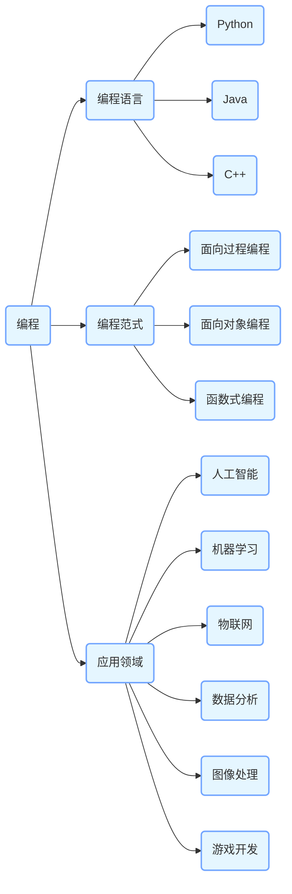

# 编程技能的未来：将如何融入日常生活

> 关键词：编程技能、未来趋势、日常生活、智能设备、自动化、数据处理、人机交互

> 摘要：本文旨在深入探讨编程技能在未来日常生活中的融入方式与影响。随着科技的飞速发展，编程技能不再仅仅是专业程序员的专属，而是逐渐渗透到人们生活的方方面面。通过对编程技能的核心概念、算法原理、数学模型以及实际应用场景等方面的详细分析，结合项目实战案例，阐述编程如何助力智能设备、自动化流程、数据处理等领域的发展。同时，为读者提供学习编程的工具和资源推荐，探讨编程技能未来的发展趋势与挑战，帮助读者全面了解编程技能在未来日常生活中的重要性和应用潜力。

## 1. 背景介绍 
### 1.1 目的和范围
本文章的目的是全面探讨编程技能在未来日常生活中的发展趋势和融入方式。范围涵盖了从基础的编程概念到高级的算法应用，从智能设备的日常使用到复杂的数据处理和自动化流程。通过对各个方面的深入分析，帮助读者理解编程技能将如何改变我们的生活方式，以及如何在日常生活中更好地利用编程技能。

### 1.2 预期读者
本文预期读者包括对科技发展趋势感兴趣的普通大众、想要了解编程技能应用领域的初学者、希望拓展技能的非专业编程人员以及关注未来生活方式变化的研究人员。

### 1.3 文档结构概述
本文将首先介绍编程技能的核心概念和相关联系，包括编程的基本原理和架构。接着详细讲解核心算法原理和具体操作步骤，并给出相应的 Python 源代码示例。然后介绍编程中涉及的数学模型和公式，并举例说明其应用。通过项目实战案例，展示编程技能在实际中的应用和代码实现。之后探讨编程技能在不同实际场景中的应用，推荐学习编程的工具和资源，总结未来发展趋势与挑战，提供常见问题解答，并列出扩展阅读和参考资料。

### 1.4 术语表
#### 1.4.1 核心术语定义
- **编程**：是指使用特定的程序设计语言，按照一定的规则和逻辑，编写指令序列，以实现特定功能的过程。
- **算法**：是解决特定问题的一系列明确的、有限的步骤。
- **数据结构**：是指相互之间存在一种或多种特定关系的数据元素的集合，用于组织和存储数据。
- **自动化**：是指在没有人工干预的情况下，系统自动执行任务的过程。
- **智能设备**：是指具备一定智能处理能力，能够感知环境、进行数据处理并做出相应反应的设备。

#### 1.4.2 相关概念解释
- **编程语言**：是用于编写计算机程序的语言，不同的编程语言具有不同的语法和特点，适用于不同的应用场景。例如，Python 语言简洁易读，适合数据处理和快速开发；Java 语言具有跨平台性，广泛应用于企业级开发。
- **编程范式**：是指编程的基本风格和方法，常见的编程范式包括面向过程编程、面向对象编程和函数式编程。面向过程编程强调将程序分解为一系列的步骤；面向对象编程强调将数据和操作封装在对象中；函数式编程强调将计算视为函数的求值。
- **开源软件**：是指源代码可以被公众获取、使用、修改和分发的软件。开源软件具有成本低、透明度高、社区支持丰富等优点。

#### 1.4.3 缩略词列表
- **AI**：Artificial Intelligence，人工智能
- **ML**：Machine Learning，机器学习
- **IoT**：Internet of Things，物联网
- **API**：Application Programming Interface，应用程序编程接口

## 2. 核心概念与联系 

### 编程的基本原理
编程的基本原理是通过编写一系列的指令，让计算机按照这些指令执行特定的任务。计算机的基本组成包括硬件和软件，硬件是计算机的物理设备，如 CPU、内存、硬盘等；软件是计算机运行的程序和数据。编程的过程就是将人类的需求转化为计算机能够理解的指令，这些指令通常以特定的编程语言编写。

### 编程的架构
编程的架构可以分为不同的层次，从底层的操作系统到上层的应用程序。操作系统负责管理计算机的硬件资源，为应用程序提供运行环境；应用程序则是实现具体功能的软件。在编程过程中，不同的层次之间通过接口进行交互，例如应用程序可以通过操作系统提供的 API 来访问硬件资源。

### 编程与其他领域的联系
编程与人工智能、机器学习、物联网等领域密切相关。人工智能和机器学习需要大量的编程来实现算法和模型的训练；物联网则需要编程来实现设备之间的通信和数据传输。同时，编程也可以应用于数据分析、图像处理、游戏开发等多个领域。

### 文本示意图
编程的核心概念与联系可以用以下文本示意图表示：

编程
|-- 编程语言
|   |-- Python
|   |-- Java
|   |-- C++
|-- 编程范式
|   |-- 面向过程编程
|   |-- 面向对象编程
|   |-- 函数式编程
|-- 应用领域
|   |-- 人工智能
|   |-- 机器学习
|   |-- 物联网
|   |-- 数据分析
|   |-- 图像处理
|   |-- 游戏开发

### Mermaid 流程图


## 3. 核心算法原理 & 具体操作步骤 

### 排序算法 - 冒泡排序
冒泡排序是一种简单的排序算法，其基本思想是通过多次比较相邻元素的大小，将较大的元素逐步交换到数组的末尾。

#### 算法原理
冒泡排序的基本步骤如下：
1. 比较相邻的元素。如果第一个比第二个大，就把它们交换位置。
2. 对每一对相邻元素作同样的工作，从开始第一对到结尾的最后一对。这步做完后，最后的元素会是最大的数。
3. 针对所有的元素重复以上的步骤，除了最后一个。
4. 持续每次对越来越少的元素重复上面的步骤，直到没有任何一对数字需要比较。

#### Python 源代码实现
```python
def bubble_sort(arr):
    n = len(arr)
    for i in range(n):
        for j in range(0, n - i - 1):
            if arr[j] > arr[j + 1]:
                arr[j], arr[j + 1] = arr[j + 1], arr[j]
    return arr

# 测试冒泡排序
arr = [64, 34, 25, 12, 22, 11, 90]
sorted_arr = bubble_sort(arr)
print("排序后的数组:", sorted_arr)
```

#### 具体操作步骤
1. 定义一个数组 `arr`，包含需要排序的元素。
2. 调用 `bubble_sort` 函数，传入数组 `arr`。
3. 在 `bubble_sort` 函数内部，通过两层循环遍历数组，比较相邻元素的大小并交换位置。
4. 最终返回排序好的数组。

### 搜索算法 - 二分搜索
二分搜索是一种高效的搜索算法，适用于有序数组。其基本思想是通过不断将搜索区间缩小一半，直到找到目标元素或确定目标元素不存在。

#### 算法原理
二分搜索的基本步骤如下：
1. 确定搜索区间的起始位置 `left` 和结束位置 `right`。
2. 计算中间位置 `mid`。
3. 比较中间元素与目标元素的大小：
    - 如果中间元素等于目标元素，则返回中间位置。
    - 如果中间元素大于目标元素，则在左半部分继续搜索。
    - 如果中间元素小于目标元素，则在右半部分继续搜索。
4. 重复步骤 2 和 3，直到找到目标元素或搜索区间为空。

#### Python 源代码实现
```python
def binary_search(arr, target):
    left, right = 0, len(arr) - 1
    while left <= right:
        mid = (left + right) // 2
        if arr[mid] == target:
            return mid
        elif arr[mid] < target:
            left = mid + 1
        else:
            right = mid - 1
    return -1

# 测试二分搜索
arr = [1, 2, 3, 4, 5, 6, 7, 8, 9]
target = 5
result = binary_search(arr, target)
if result != -1:
    print(f"目标元素 {target} 在数组中的位置是 {result}")
else:
    print(f"目标元素 {target} 不在数组中")
```

#### 具体操作步骤
1. 定义一个有序数组 `arr` 和目标元素 `target`。
2. 调用 `binary_search` 函数，传入数组 `arr` 和目标元素 `target`。
3. 在 `binary_search` 函数内部，通过循环不断缩小搜索区间，直到找到目标元素或搜索区间为空。
4. 根据返回结果判断目标元素是否存在于数组中。

## 4. 数学模型和公式 & 详细讲解 & 举例说明 

### 时间复杂度和空间复杂度
时间复杂度和空间复杂度是衡量算法效率的重要指标。

#### 时间复杂度
时间复杂度是指算法执行所需的时间与输入规模之间的关系。通常用大 O 符号表示。例如，冒泡排序的时间复杂度为 $O(n^2)$，二分搜索的时间复杂度为 $O(\log n)$。

**详细讲解**：
- $O(1)$：表示算法的执行时间与输入规模无关，是常数时间复杂度。例如，访问数组中的某个元素。
- $O(n)$：表示算法的执行时间与输入规模成正比，是线性时间复杂度。例如，遍历数组中的所有元素。
- $O(n^2)$：表示算法的执行时间与输入规模的平方成正比，是平方时间复杂度。例如，冒泡排序。
- $O(\log n)$：表示算法的执行时间与输入规模的对数成正比，是对数时间复杂度。例如，二分搜索。

**举例说明**：
假设有一个数组 `arr`，长度为 `n`。
```python
# O(1) 时间复杂度
element = arr[0]

# O(n) 时间复杂度
for i in range(n):
    print(arr[i])

# O(n^2) 时间复杂度
for i in range(n):
    for j in range(n):
        print(arr[i] + arr[j])
```

#### 空间复杂度
空间复杂度是指算法执行所需的额外存储空间与输入规模之间的关系。同样用大 O 符号表示。例如，冒泡排序的空间复杂度为 $O(1)$，因为只需要常数级的额外存储空间。

**详细讲解**：
- $O(1)$：表示算法的额外存储空间与输入规模无关，是常数空间复杂度。例如，冒泡排序。
- $O(n)$：表示算法的额外存储空间与输入规模成正比，是线性空间复杂度。例如，创建一个与输入数组长度相同的新数组。
- $O(n^2)$：表示算法的额外存储空间与输入规模的平方成正比，是平方空间复杂度。例如，创建一个二维数组。

**举例说明**：
```python
# O(1) 空间复杂度
def bubble_sort(arr):
    n = len(arr)
    for i in range(n):
        for j in range(0, n - i - 1):
            if arr[j] > arr[j + 1]:
                arr[j], arr[j + 1] = arr[j + 1], arr[j]
    return arr

# O(n) 空间复杂度
new_arr = [0] * len(arr)

# O(n^2) 空间复杂度
matrix = [[0] * n for _ in range(n)]
```

### 概率模型 - 贝叶斯定理
贝叶斯定理是概率论中的一个重要定理，用于计算在已知某些条件下的概率。

#### 数学公式
贝叶斯定理的公式为：
$$P(A|B) = \frac{P(B|A)P(A)}{P(B)}$$
其中，$P(A|B)$ 表示在事件 $B$ 发生的条件下事件 $A$ 发生的概率，$P(B|A)$ 表示在事件 $A$ 发生的条件下事件 $B$ 发生的概率，$P(A)$ 表示事件 $A$ 发生的概率，$P(B)$ 表示事件 $B$ 发生的概率。

#### 详细讲解
贝叶斯定理的核心思想是通过先验概率和条件概率来计算后验概率。先验概率是在没有任何额外信息的情况下事件发生的概率，条件概率是在已知某些条件下事件发生的概率，后验概率是在考虑了新的信息后事件发生的概率。

#### 举例说明
假设有一个疾病检测的场景，某种疾病的发病率为 $P(A) = 0.01$，检测的准确率为 $P(B|A) = 0.95$（即患病的人检测为阳性的概率），检测的误报率为 $P(B|\neg A) = 0.05$（即未患病的人检测为阳性的概率）。现在一个人检测结果为阳性，求他真正患病的概率 $P(A|B)$。

首先计算 $P(B)$：
$$P(B) = P(B|A)P(A) + P(B|\neg A)P(\neg A)$$
其中，$P(\neg A) = 1 - P(A) = 0.99$。
$$P(B) = 0.95 \times 0.01 + 0.05 \times 0.99 = 0.059$$

然后根据贝叶斯定理计算 $P(A|B)$：
$$P(A|B) = \frac{P(B|A)P(A)}{P(B)} = \frac{0.95 \times 0.01}{0.059} \approx 0.161$$

这意味着在检测结果为阳性的情况下，真正患病的概率约为 0.161。

## 5. 项目实战：代码实际案例和详细解释说明 

### 5.1  开发环境搭建
#### 选择编程语言
本项目选择 Python 作为开发语言，因为 Python 语言简洁易读，具有丰富的库和工具，适合快速开发和数据处理。

#### 安装 Python
可以从 Python 官方网站（https://www.python.org/downloads/） 下载并安装 Python。安装完成后，可以在命令行中输入 `python --version` 来验证安装是否成功。

#### 安装开发工具
推荐使用 PyCharm 作为开发工具，它是一款功能强大的 Python 集成开发环境（IDE），提供了代码编辑、调试、自动完成等功能。可以从 JetBrains 官方网站（https://www.jetbrains.com/pycharm/download/） 下载并安装 PyCharm。

### 5.2  源代码详细实现和代码解读
#### 项目需求
实现一个简单的学生成绩管理系统，包括添加学生信息、查询学生成绩、修改学生成绩和删除学生信息等功能。

#### 源代码实现
```python
# 定义学生类
class Student:
    def __init__(self, id, name, score):
        self.id = id
        self.name = name
        self.score = score

    def __str__(self):
        return f"学号: {self.id}, 姓名: {self.name}, 成绩: {self.score}"

# 定义学生成绩管理系统类
class StudentGradeManagementSystem:
    def __init__(self):
        self.students = []

    # 添加学生信息
    def add_student(self, id, name, score):
        student = Student(id, name, score)
        self.students.append(student)
        print("学生信息添加成功！")

    # 查询学生成绩
    def query_student(self, id):
        for student in self.students:
            if student.id == id:
                print(student)
                return
        print("未找到该学生信息！")

    # 修改学生成绩
    def modify_student_score(self, id, new_score):
        for student in self.students:
            if student.id == id:
                student.score = new_score
                print("学生成绩修改成功！")
                return
        print("未找到该学生信息！")

    # 删除学生信息
    def delete_student(self, id):
        for student in self.students:
            if student.id == id:
                self.students.remove(student)
                print("学生信息删除成功！")
                return
        print("未找到该学生信息！")

    # 显示所有学生信息
    def show_all_students(self):
        if len(self.students) == 0:
            print("暂无学生信息！")
        else:
            for student in self.students:
                print(student)

# 主程序
if __name__ == "__main__":
    system = StudentGradeManagementSystem()
    while True:
        print("\n学生成绩管理系统")
        print("1. 添加学生信息")
        print("2. 查询学生成绩")
        print("3. 修改学生成绩")
        print("4. 删除学生信息")
        print("5. 显示所有学生信息")
        print("6. 退出系统")
        choice = input("请输入你的选择: ")
        if choice == "1":
            id = input("请输入学号: ")
            name = input("请输入姓名: ")
            score = float(input("请输入成绩: "))
            system.add_student(id, name, score)
        elif choice == "2":
            id = input("请输入要查询的学号: ")
            system.query_student(id)
        elif choice == "3":
            id = input("请输入要修改成绩的学号: ")
            new_score = float(input("请输入新的成绩: "))
            system.modify_student_score(id, new_score)
        elif choice == "4":
            id = input("请输入要删除的学号: ")
            system.delete_student(id)
        elif choice == "5":
            system.show_all_students()
        elif choice == "6":
            print("退出系统，再见！")
            break
        else:
            print("输入无效，请重新输入！")
```

#### 代码解读
1. **学生类（`Student`）**：定义了学生的基本信息，包括学号、姓名和成绩。`__init__` 方法用于初始化学生对象，`__str__` 方法用于返回学生信息的字符串表示。
2. **学生成绩管理系统类（`StudentGradeManagementSystem`）**：
    - `__init__` 方法：初始化一个空的学生列表。
    - `add_student` 方法：创建一个新的学生对象，并将其添加到学生列表中。
    - `query_student` 方法：根据学号查找学生信息，并打印出来。
    - `modify_student_score` 方法：根据学号查找学生信息，并修改其成绩。
    - `delete_student` 方法：根据学号查找学生信息，并从学生列表中删除。
    - `show_all_students` 方法：显示所有学生的信息。
3. **主程序**：创建一个学生成绩管理系统对象，并通过一个循环不断接收用户的输入，根据用户的选择调用相应的方法。

### 5.3  代码解读与分析
#### 优点
- **面向对象编程**：使用类和对象来组织代码，提高了代码的可维护性和可扩展性。
- **用户交互友好**：通过菜单的方式提供了清晰的用户界面，方便用户操作。
- **错误处理**：对用户输入进行了简单的验证，避免了无效输入导致的错误。

#### 缺点
- **数据存储**：目前学生信息只存储在内存中，程序退出后数据会丢失。可以考虑将数据存储在文件或数据库中。
- **性能问题**：在查询、修改和删除学生信息时，需要遍历整个学生列表，时间复杂度为 $O(n)$。可以考虑使用更高效的数据结构，如字典，来提高查询效率。

## 6. 实际应用场景 

### 智能家居
编程技能在智能家居领域有着广泛的应用。通过编写程序，可以实现对智能设备的远程控制、自动化场景设置和数据监测等功能。例如，使用 Python 编写一个智能家居控制系统，通过与智能插座、智能灯泡、智能门锁等设备的 API 进行交互，实现对这些设备的开关控制、亮度调节和状态查询等操作。同时，可以设置自动化场景，如定时开关灯、人来灯亮人走灯灭等，提高生活的便利性和舒适度。

### 健康管理
编程技能可以用于开发健康管理应用程序。通过收集用户的健康数据，如心率、血压、运动步数等，使用数据分析和机器学习算法对这些数据进行处理和分析，为用户提供个性化的健康建议和预警。例如，开发一个运动健康应用，使用 Python 编写后端程序，接收用户的运动数据，分析用户的运动习惯和健康状况，为用户制定合理的运动计划，并在用户的健康指标出现异常时及时发出提醒。

### 教育领域
编程技能在教育领域的应用越来越广泛。一方面，编程教育已经成为学校教育的重要组成部分，通过编程课程可以培养学生的逻辑思维能力和创新能力。另一方面，编程可以用于开发教育辅助工具，如在线学习平台、智能教学系统等。例如，使用 Python 编写一个在线学习平台，实现课程管理、学生管理、作业提交和批改等功能，提高教育教学的效率和质量。

### 金融领域
编程技能在金融领域的应用也非常重要。金融机构可以使用编程来开发交易系统、风险管理系统和数据分析工具等。例如，使用 Python 编写一个量化交易系统，通过对金融市场数据的分析和建模，自动执行交易策略，提高交易效率和收益。同时，编程可以用于风险评估和管理，通过对金融数据的挖掘和分析，识别潜在的风险因素，并采取相应的措施进行防范。

### 交通出行
编程技能可以用于优化交通出行。例如，开发智能交通系统，通过对交通流量、路况信息等数据的实时监测和分析，调整交通信号灯的时间，优化交通路线规划，提高交通效率，减少拥堵。同时，编程还可以用于自动驾驶技术的开发，通过编写算法实现车辆的自动感知、决策和控制，提高交通安全和出行便利性。

## 7. 工具和资源推荐
### 7.1 学习资源推荐
#### 7.1.1 书籍推荐
- 《Python 编程：从入门到实践》：适合初学者学习 Python 编程，内容丰富，案例实用。
- 《算法导论》：经典的算法书籍，全面介绍了各种算法的原理和实现。
- 《人工智能：一种现代的方法》：系统介绍了人工智能的基本概念、算法和应用。

#### 7.1.2 在线课程
- Coursera 上的“Python for Everybody”：由密歇根大学教授开设的 Python 课程，适合初学者。
- edX 上的“Introduction to Artificial Intelligence”：麻省理工学院开设的人工智能入门课程。
- 中国大学 MOOC 上的“数据结构与算法”：国内高校开设的优质课程，讲解详细。

#### 7.1.3 技术博客和网站
- 博客园：国内知名的技术博客平台，有很多编程相关的技术文章。
- 开源中国：提供开源技术资讯、开源项目推荐等内容。
- Stack Overflow：全球最大的技术问答社区，遇到编程问题可以在这里查找答案。

### 7.2 开发工具框架推荐
#### 7.2.1 IDE和编辑器
- PyCharm：功能强大的 Python 集成开发环境，适合专业开发。
- Visual Studio Code：轻量级的代码编辑器，支持多种编程语言，有丰富的插件。
- Jupyter Notebook：交互式的编程环境，适合数据探索和分析。

#### 7.2.2 调试和性能分析工具
- pdb：Python 自带的调试工具，可以在代码中设置断点，逐步执行代码。
- cProfile：Python 自带的性能分析工具，可以统计代码的执行时间和函数调用次数。
- Py-Spy：用于分析 Python 程序性能的工具，支持实时性能监控。

#### 7.2.3 相关框架和库
- Django：Python 的 Web 开发框架，适合快速开发大型 Web 应用。
- Flask：轻量级的 Python Web 开发框架，适合小型项目和快速原型开发。
- NumPy：Python 的科学计算库，提供了高效的数组操作和数学函数。
- Pandas：Python 的数据分析库，用于数据处理和分析。
- Scikit-learn：Python 的机器学习库，提供了各种机器学习算法和工具。

### 7.3 相关论文著作推荐
#### 7.3.1 经典论文
- “A Mathematical Theory of Communication”：香农的经典论文，奠定了信息论的基础。
- “Learning Representations by Back-propagating Errors”：介绍了反向传播算法，是神经网络发展的重要里程碑。
- “The PageRank Citation Ranking: Bringing Order to the Web”：介绍了 PageRank 算法，是搜索引擎排名的重要算法。

#### 7.3.2 最新研究成果
- 关注顶级学术会议，如 NeurIPS（神经信息处理系统大会）、ICML（国际机器学习会议）、CVPR（计算机视觉与模式识别会议）等，这些会议上的论文代表了该领域的最新研究成果。
- 查阅相关学术期刊，如 Journal of Artificial Intelligence Research（JAIR）、Artificial Intelligence 等。

#### 7.3.3 应用案例分析
- 一些科技公司的技术博客会分享他们在实际项目中的应用案例和经验，如 Google AI Blog、Facebook AI Research 等。
- 开源项目的文档和社区论坛也可以找到很多实际应用案例，如 TensorFlow、PyTorch 等。

## 8. 总结：未来发展趋势与挑战

### 未来发展趋势
#### 编程技能的普及化
随着科技的发展和教育的普及，编程技能将不再是专业程序员的专属，而是成为一种基本的生活技能。越来越多的人将学习编程，以更好地适应数字化时代的生活和工作。

#### 与其他领域的深度融合
编程将与人工智能、机器学习、物联网、大数据等领域深度融合，创造出更多的创新应用和解决方案。例如，智能家居、智能医疗、智能交通等领域将得到进一步的发展。

#### 自动化和智能化编程
未来的编程工具和环境将更加自动化和智能化，能够自动完成一些繁琐的编程任务，如代码生成、调试和优化等。同时，人工智能技术也将应用于编程过程中，帮助程序员更好地理解和处理代码。

#### 低代码和无代码开发
低代码和无代码开发平台将越来越受到关注，这些平台允许非专业程序员通过可视化的界面和简单的操作来创建应用程序，降低了编程的门槛，提高了开发效率。

### 挑战
#### 技术更新换代快
编程领域的技术更新换代非常快，新的编程语言、框架和工具不断涌现。程序员需要不断学习和更新知识，以跟上技术的发展。

#### 安全和隐私问题
随着编程技能在各个领域的广泛应用，安全和隐私问题也日益突出。例如，智能家居设备的安全漏洞可能导致用户的隐私泄露，金融交易系统的安全问题可能导致资金损失。因此，需要加强编程过程中的安全和隐私保护。

#### 人才短缺
虽然编程技能的普及化趋势在加强，但仍然面临着人才短缺的问题。特别是在一些新兴领域，如人工智能、机器学习等，对专业人才的需求非常大。需要加强编程教育和人才培养，以满足市场的需求。

#### 伦理和法律问题
编程技术的发展也带来了一些伦理和法律问题，如算法歧视、数据滥用等。需要建立相应的伦理和法律框架，规范编程技术的应用。

## 9. 附录：常见问题与解答

### 编程难学吗？
编程的难度因人而异。对于有一定逻辑思维能力和学习能力的人来说，掌握基本的编程技能并不难。但要成为一名优秀的程序员，需要不断学习和实践，积累经验。

### 学习编程需要具备哪些基础知识？
学习编程需要具备一定的数学基础，如逻辑运算、代数、概率统计等。同时，也需要具备一定的英语基础，因为很多编程资料和文档都是英文的。

### 如何选择适合自己的编程语言？
选择适合自己的编程语言需要考虑自己的学习目标和应用场景。如果是初学者，建议选择 Python 语言，因为它简洁易读，适合快速入门。如果是从事 Web 开发，可以选择 JavaScript、Java 等语言；如果是从事数据处理和分析，可以选择 Python、R 等语言。

### 编程需要学习哪些方面的知识？
编程需要学习编程语言的语法、数据结构、算法、编程范式等基础知识。同时，还需要学习相关的开发工具和框架，以及数据库、网络等方面的知识。

### 如何提高编程能力？
提高编程能力需要不断学习和实践。可以通过阅读优秀的代码、参加开源项目、解决实际问题等方式来提高自己的编程水平。同时，也可以参加编程竞赛和培训课程，与其他程序员交流和学习。

## 10. 扩展阅读 & 参考资料

### 扩展阅读
- 《代码大全》：全面介绍了软件开发的各个方面，包括编程实践、代码设计、项目管理等。
- 《人月神话》：探讨了软件开发中的管理问题，提出了很多经典的观点和理论。
- 《黑客与画家》：从黑客和画家的角度探讨了编程的艺术和创新。

### 参考资料
- Python 官方文档：https://docs.python.org/
- MDN Web Docs：https://developer.mozilla.org/
- arXiv 预印本平台：https://arxiv.org/