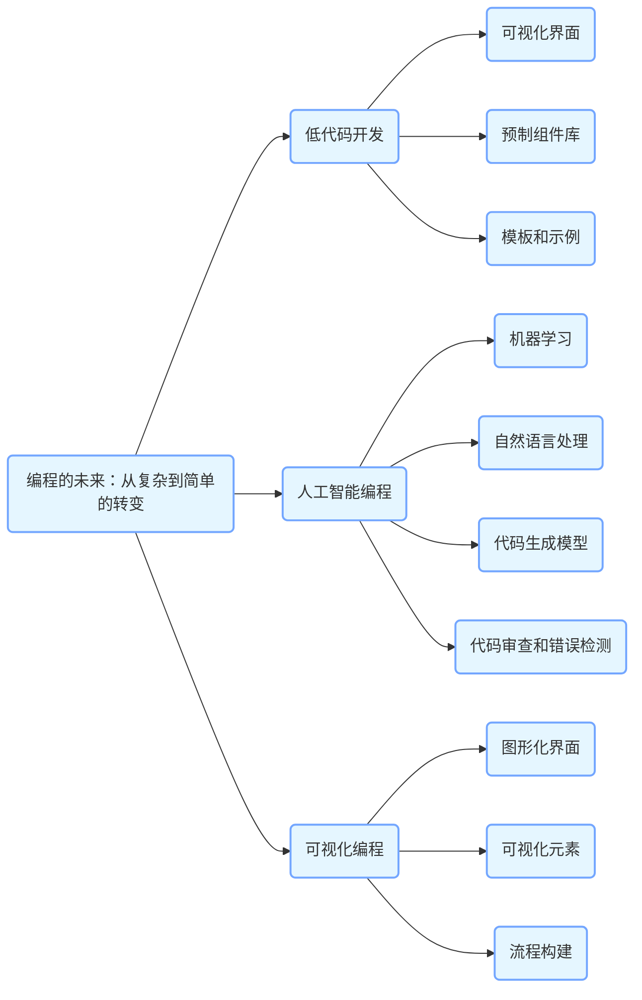

# 编程的未来：从复杂到简单的转变

> 关键词：编程未来、复杂性、简单性、低代码开发、人工智能编程、可视化编程

> 摘要：本文深入探讨了编程领域从复杂到简单转变的趋势。随着技术的不断发展，编程正逐渐摆脱传统的复杂模式，向更加简单、高效和易于使用的方向发展。文章介绍了这一转变的背景，阐述了相关核心概念及其联系，剖析了实现这一转变的核心算法原理与具体操作步骤，通过数学模型和公式进行理论支持，并结合项目实战案例进行详细解释。同时，探讨了编程简单化在不同领域的实际应用场景，推荐了相关的学习资源、开发工具和论文著作。最后总结了编程未来发展的趋势与挑战，为读者全面呈现编程领域这一重要转变的全貌。

## 1. 背景介绍 
### 1.1 目的和范围
本文章的目的在于全面分析编程领域从复杂到简单转变的趋势，深入探讨这一转变的原因、实现方式以及对未来编程发展的影响。范围涵盖了编程发展的历史回顾、当前技术推动下的转变现状、相关核心技术的原理与应用，以及未来发展的趋势和挑战等方面。通过对这些内容的研究，旨在为程序员、技术爱好者以及关注编程发展的人士提供一个全面且深入的视角，帮助他们更好地理解编程未来的发展方向。

### 1.2 预期读者
本文的预期读者包括但不限于以下几类人群：
- 程序员和软件开发者：帮助他们了解编程领域的最新趋势，为其技术发展提供方向指引，以便更好地适应未来编程的变化。
- 技术管理者和决策者：使他们能够把握编程发展的大势，在项目规划、团队建设和技术选型等方面做出更明智的决策。
- 计算机科学相关专业的学生：为他们提供一个前瞻性的学习视角，激发他们对编程技术的兴趣，引导他们关注编程领域的创新和发展。
- 对技术发展感兴趣的普通读者：让他们能够了解编程领域的变革，感受技术进步对社会和生活的影响。

### 1.3 文档结构概述
本文将按照以下结构进行阐述：
- 核心概念与联系：介绍编程从复杂到简单转变过程中涉及的核心概念，如低代码开发、人工智能编程、可视化编程等，并分析它们之间的联系。
- 核心算法原理 & 具体操作步骤：深入剖析实现编程简单化的核心算法原理，通过 Python 源代码详细阐述具体操作步骤。
- 数学模型和公式 & 详细讲解 & 举例说明：运用数学模型和公式对编程简单化的原理进行理论支持，并通过具体例子进行说明。
- 项目实战：代码实际案例和详细解释说明：通过实际项目案例，展示编程简单化在实际开发中的应用，包括开发环境搭建、源代码实现和代码解读。
- 实际应用场景：探讨编程简单化在不同领域的实际应用场景，如企业数字化转型、教育领域、物联网等。
- 工具和资源推荐：推荐相关的学习资源、开发工具框架和论文著作，帮助读者进一步深入学习和研究。
- 总结：未来发展趋势与挑战：总结编程未来发展的趋势，分析可能面临的挑战。
- 附录：常见问题与解答：解答读者在阅读过程中可能遇到的常见问题。
- 扩展阅读 & 参考资料：提供相关的扩展阅读材料和参考资料，方便读者进一步深入研究。

### 1.4 术语表
#### 1.4.1 核心术语定义
- **低代码开发**：一种通过少量代码或无需编写大量代码，利用可视化界面和预制组件来快速开发应用程序的方法。
- **人工智能编程**：利用人工智能技术辅助编程，如自动代码生成、代码优化、错误检测等。
- **可视化编程**：通过图形化界面和可视化元素来创建程序，而不是传统的文本代码编写方式。
- **代码复用**：在不同的项目或模块中重复使用已有的代码，以提高开发效率和代码质量。

#### 1.4.2 相关概念解释
- **无代码开发**：是低代码开发的进一步延伸，完全不需要编写代码，通过拖放组件和配置参数即可创建应用程序。
- **自动化测试**：利用工具自动执行测试用例，验证软件的功能和性能，减少人工测试的工作量。
- **云计算**：通过互联网提供计算资源，如服务器、存储、软件等，用户可以按需使用，降低开发和运营成本。

#### 1.4.3 缩略词列表
- **AI**：Artificial Intelligence，人工智能
- **ML**：Machine Learning，机器学习
- **DevOps**：Development and Operations，开发与运维一体化
- **CI/CD**：Continuous Integration/Continuous Deployment，持续集成/持续部署

## 2. 核心概念与联系 

### 2.1 核心概念原理

#### 2.1.1 低代码开发
低代码开发的核心原理是通过提供可视化的开发环境和预制的组件库，减少开发者手动编写代码的工作量。开发者可以通过拖放组件、配置参数等方式快速构建应用程序的界面和功能。低代码平台通常会提供一系列的模板和示例，帮助开发者快速上手。例如，在一个企业级的低代码开发平台中，开发者可以直接选择一个客户关系管理（CRM）系统的模板，然后根据企业的需求对其进行定制化配置，而不需要从头开始编写大量的代码。

#### 2.1.2 人工智能编程
人工智能编程利用机器学习、自然语言处理等技术来辅助编程。例如，通过训练一个代码生成模型，输入相关的需求描述，模型可以自动生成相应的代码。另外，人工智能还可以用于代码审查和错误检测，通过分析代码的结构和语义，发现潜在的错误和优化点。例如，一些智能代码编辑器可以实时检测代码中的语法错误和潜在的逻辑错误，并给出相应的提示和建议。

#### 2.1.3 可视化编程
可视化编程通过图形化的界面和可视化元素来表示程序的逻辑和结构。开发者可以通过连接图形化的组件来构建程序的流程，而不需要编写传统的文本代码。例如，在一个流程图式的可视化编程环境中，开发者可以通过拖拽不同的图形组件（如开始、结束、判断、循环等）来构建一个程序的执行流程，系统会自动将这些图形化的表示转换为相应的代码。

### 2.2 架构的文本示意图
```plaintext
编程的未来：从复杂到简单的转变
|-- 低代码开发
|   |-- 可视化界面
|   |-- 预制组件库
|   |-- 模板和示例
|-- 人工智能编程
|   |-- 机器学习
|   |-- 自然语言处理
|   |-- 代码生成模型
|   |-- 代码审查和错误检测
|-- 可视化编程
|   |-- 图形化界面
|   |-- 可视化元素
|   |-- 流程构建
```

### 2.3 Mermaid 流程图


## 3. 核心算法原理 & 具体操作步骤 

### 3.1 低代码开发的算法原理与操作步骤

#### 3.1.1 算法原理
低代码开发的核心算法主要涉及组件管理、配置解析和代码生成。组件管理算法负责维护预制组件库，包括组件的添加、删除、修改和查询。配置解析算法将用户在可视化界面上的配置信息解析为可执行的代码逻辑。代码生成算法根据解析后的配置信息和组件信息，生成最终的应用程序代码。

#### 3.1.2 Python 源代码实现
```python
# 组件类
class Component:
    def __init__(self, name, properties):
        self.name = name
        self.properties = properties

    def generate_code(self):
        # 简单示例，根据组件属性生成代码
        code = f"// 创建 {self.name} 组件\n"
        for prop, value in self.properties.items():
            code += f"// 设置 {prop} 属性为 {value}\n"
        return code

# 组件管理类
class ComponentManager:
    def __init__(self):
        self.components = []

    def add_component(self, component):
        self.components.append(component)

    def get_component(self, name):
        for component in self.components:
            if component.name == name:
                return component
        return None

# 配置解析类
class ConfigurationParser:
    def __init__(self, config):
        self.config = config

    def parse(self):
        # 简单示例，解析配置信息
        component_name = self.config.get('component_name')
        properties = self.config.get('properties', {})
        return component_name, properties

# 代码生成类
class CodeGenerator:
    def __init__(self, component_manager):
        self.component_manager = component_manager

    def generate(self, config):
        parser = ConfigurationParser(config)
        component_name, properties = parser.parse()
        component = self.component_manager.get_component(component_name)
        if component:
            component.properties = properties
            return component.generate_code()
        else:
            return "组件未找到"

# 示例使用
if __name__ == "__main__":
    # 初始化组件管理
    component_manager = ComponentManager()
    button_component = Component("Button", {})
    component_manager.add_component(button_component)

    # 配置信息
    config = {
        "component_name": "Button",
        "properties": {
            "text": "Click me",
            "color": "blue"
        }
    }

    # 代码生成
    code_generator = CodeGenerator(component_manager)
    code = code_generator.generate(config)
    print(code)
```

### 3.2 人工智能编程的算法原理与操作步骤

#### 3.2.1 算法原理
人工智能编程主要基于机器学习和自然语言处理算法。在代码生成方面，通常使用序列到序列（Seq2Seq）模型，如基于注意力机制的 Transformer 模型。该模型通过学习大量的代码数据，将输入的需求描述转换为相应的代码序列。在代码审查和错误检测方面，使用代码分析算法，如静态代码分析和动态代码分析，结合机器学习模型对代码进行分类和预测。

#### 3.2.2 Python 源代码实现
```python
import torch
import torch.nn as nn
import torch.optim as optim
from torch.utils.data import Dataset, DataLoader

# 简单的 Seq2Seq 模型示例
class Seq2Seq(nn.Module):
    def __init__(self, input_size, hidden_size, output_size):
        super(Seq2Seq, self).__init__()
        self.encoder = nn.LSTM(input_size, hidden_size)
        self.decoder = nn.LSTM(hidden_size, hidden_size)
        self.fc = nn.Linear(hidden_size, output_size)

    def forward(self, input):
        encoder_output, encoder_hidden = self.encoder(input)
        decoder_output, decoder_hidden = self.decoder(encoder_output)
        output = self.fc(decoder_output)
        return output

# 示例数据集
class CodeDataset(Dataset):
    def __init__(self, inputs, outputs):
        self.inputs = inputs
        self.outputs = outputs

    def __len__(self):
        return len(self.inputs)

    def __getitem__(self, idx):
        return self.inputs[idx], self.outputs[idx]

# 训练模型
def train_model(model, dataloader, criterion, optimizer, epochs):
    for epoch in range(epochs):
        for inputs, outputs in dataloader:
            optimizer.zero_grad()
            outputs_pred = model(inputs)
            loss = criterion(outputs_pred, outputs)
            loss.backward()
            optimizer.step()
        print(f"Epoch {epoch + 1}/{epochs}, Loss: {loss.item()}")

# 示例使用
if __name__ == "__main__":
    # 定义模型参数
    input_size = 10
    hidden_size = 20
    output_size = 10
    model = Seq2Seq(input_size, hidden_size, output_size)

    # 定义数据集
    inputs = torch.randn(100, 1, input_size)
    outputs = torch.randn(100, 1, output_size)
    dataset = CodeDataset(inputs, outputs)
    dataloader = DataLoader(dataset, batch_size=10)

    # 定义损失函数和优化器
    criterion = nn.MSELoss()
    optimizer = optim.Adam(model.parameters(), lr=0.001)

    # 训练模型
    train_model(model, dataloader, criterion, optimizer, epochs=10)
```

### 3.3 可视化编程的算法原理与操作步骤

#### 3.3.1 算法原理
可视化编程的算法主要涉及图形元素的识别、布局分析和代码转换。图形元素识别算法通过图像处理技术识别可视化界面中的图形组件。布局分析算法分析图形组件之间的关系和布局结构。代码转换算法将图形化的表示转换为相应的代码。

#### 3.3.2 Python 源代码实现
```python
import cv2
import numpy as np

# 简单的图形元素识别示例
def recognize_elements(image):
    gray = cv2.cvtColor(image, cv2.COLOR_BGR2GRAY)
    _, binary = cv2.threshold(gray, 127, 255, cv2.THRESH_BINARY)
    contours, _ = cv2.findContours(binary, cv2.RETR_TREE, cv2.CHAIN_APPROX_SIMPLE)
    elements = []
    for contour in contours:
        x, y, w, h = cv2.boundingRect(contour)
        elements.append((x, y, w, h))
    return elements

# 示例使用
if __name__ == "__main__":
    # 读取图像
    image = cv2.imread('visual_programming_image.png')

    # 识别图形元素
    elements = recognize_elements(image)
    for element in elements:
        x, y, w, h = element
        cv2.rectangle(image, (x, y), (x + w, y + h), (0, 255, 0), 2)

    # 显示结果
    cv2.imshow('Elements', image)
    cv2.waitKey(0)
    cv2.destroyAllWindows()
```

## 4. 数学模型和公式 & 详细讲解 & 举例说明 

### 4.1 低代码开发的数学模型

#### 4.1.1 组件选择模型
在低代码开发中，组件选择可以用概率模型来描述。假设存在 $n$ 个组件 $C = \{c_1, c_2, \cdots, c_n\}$，用户根据需求选择组件的概率可以表示为 $P(c_i|d)$，其中 $d$ 表示用户的需求描述。根据贝叶斯定理，有：

$$P(c_i|d) = \frac{P(d|c_i)P(c_i)}{\sum_{j = 1}^{n}P(d|c_j)P(c_j)}$$

其中，$P(d|c_i)$ 表示在选择组件 $c_i$ 的情况下满足需求 $d$ 的概率，$P(c_i)$ 表示组件 $c_i$ 被选择的先验概率。

#### 4.1.2 举例说明
假设在一个低代码开发平台中有三个组件：按钮组件 $c_1$、文本框组件 $c_2$ 和下拉框组件 $c_3$。用户的需求是创建一个登录界面。根据历史数据，$P(c_1) = 0.3$，$P(c_2) = 0.4$，$P(c_3) = 0.3$。在选择按钮组件的情况下满足登录界面需求的概率 $P(d|c_1) = 0.8$，选择文本框组件的情况下满足需求的概率 $P(d|c_2) = 0.9$，选择下拉框组件的情况下满足需求的概率 $P(d|c_3) = 0.2$。

则根据贝叶斯定理计算选择按钮组件的概率为：

$$P(c_1|d) = \frac{0.8 \times 0.3}{0.8 \times 0.3 + 0.9 \times 0.4 + 0.2 \times 0.3} = \frac{0.24}{0.24 + 0.36 + 0.06} = \frac{0.24}{0.66} \approx 0.36$$

同理，可以计算出选择文本框组件和下拉框组件的概率。

### 4.2 人工智能编程的数学模型

#### 4.2.1 Seq2Seq 模型的损失函数
在人工智能编程的代码生成中，常用的 Seq2Seq 模型使用交叉熵损失函数。假设模型的输出为 $\hat{y} = (\hat{y}_1, \hat{y}_2, \cdots, \hat{y}_T)$，真实标签为 $y = (y_1, y_2, \cdots, y_T)$，则交叉熵损失函数可以表示为：

$$L = -\frac{1}{T} \sum_{t = 1}^{T} \sum_{k = 1}^{V} y_{t,k} \log(\hat{y}_{t,k})$$

其中，$T$ 表示序列的长度，$V$ 表示词汇表的大小，$y_{t,k}$ 表示真实标签在时间步 $t$ 上第 $k$ 个词汇的概率（通常为 0 或 1），$\hat{y}_{t,k}$ 表示模型输出在时间步 $t$ 上第 $k$ 个词汇的概率。

#### 4.2.2 举例说明
假设词汇表大小 $V = 5$，序列长度 $T = 3$，真实标签 $y = [(1, 0, 0, 0, 0), (0, 1, 0, 0, 0), (0, 0, 1, 0, 0)]$，模型输出 $\hat{y} = [(0.8, 0.1, 0.05, 0.03, 0.02), (0.1, 0.7, 0.1, 0.05, 0.05), (0.05, 0.1, 0.8, 0.03, 0.02)]$。

则损失函数为：

$$L = -\frac{1}{3} \left( \log(0.8) + \log(0.7) + \log(0.8) \right) \approx 0.26$$

### 4.3 可视化编程的数学模型

#### 4.3.1 图形元素布局模型
在可视化编程中，图形元素的布局可以用图论模型来描述。假设存在 $m$ 个图形元素 $E = \{e_1, e_2, \cdots, e_m\}$，元素之间的关系可以用邻接矩阵 $A = (a_{ij})_{m \times m}$ 表示，其中 $a_{ij}$ 表示元素 $e_i$ 和 $e_j$ 之间的关系强度。

布局的优化目标可以是最小化元素之间的重叠和最大化元素之间的间距。可以用以下目标函数表示：

$$\min \sum_{i = 1}^{m} \sum_{j = i + 1}^{m} o_{ij} - \alpha \sum_{i = 1}^{m} \sum_{j = i + 1}^{m} d_{ij}$$

其中，$o_{ij}$ 表示元素 $e_i$ 和 $e_j$ 之间的重叠面积，$d_{ij}$ 表示元素 $e_i$ 和 $e_j$ 之间的间距，$\alpha$ 是一个权重系数。

#### 4.3.2 举例说明
假设有三个图形元素 $e_1$、$e_2$ 和 $e_3$，它们的重叠面积矩阵 $O = \begin{bmatrix} 0 & 10 & 5 \\ 10 & 0 & 3 \\ 5 & 3 & 0 \end{bmatrix}$，间距矩阵 $D = \begin{bmatrix} 0 & 20 & 30 \\ 20 & 0 & 40 \\ 30 & 40 & 0 \end{bmatrix}$，权重系数 $\alpha = 0.5$。

则目标函数的值为：

$$\min (10 + 5 + 3) - 0.5 \times (20 + 30 + 40) = 18 - 45 = -27$$

## 5. 项目实战：代码实际案例和详细解释说明 

### 5.1  开发环境搭建

#### 5.1.1 低代码开发环境搭建
- **选择低代码开发平台**：可以选择国内的简道云、宜搭等，或者国外的 OutSystems、Mendix 等。以简道云为例，注册并登录简道云账号，进入开发者中心。
- **安装必要的插件**：根据项目需求，安装相关的插件，如数据可视化插件、流程审批插件等。
- **配置数据源**：如果项目需要连接数据库或其他数据源，配置相应的数据源信息，如数据库地址、用户名、密码等。

#### 5.1.2 人工智能编程环境搭建
- **安装 Python**：从 Python 官方网站下载并安装 Python 3.x 版本。
- **安装深度学习框架**：如 PyTorch 或 TensorFlow。以 PyTorch 为例，可以使用以下命令安装：
```bash
pip install torch torchvision
```
- **安装相关库**：如 NumPy、Pandas 等，用于数据处理和分析。
```bash
pip install numpy pandas
```

#### 5.1.3 可视化编程环境搭建
- **选择可视化编程工具**：如 Scratch、Blockly 等。以 Scratch 为例，访问 Scratch 官方网站，注册并登录账号，即可开始使用。
- **安装图形处理库**：如果需要进行图形元素识别和处理，安装 OpenCV 库。
```bash
pip install opencv-python
```

### 5.2  源代码详细实现和代码解读

#### 5.2.1 低代码开发案例：创建一个简单的任务管理系统
- **创建应用**：在简道云开发者中心创建一个新的应用，命名为“任务管理系统”。
- **设计表单**：创建任务表单，包含任务名称、任务描述、任务负责人、任务截止日期等字段。
- **设计流程**：创建任务审批流程，包括任务提交、任务审核、任务执行、任务完成等环节。
- **配置报表**：创建任务统计报表，如任务数量统计、任务完成率统计等。

#### 5.2.2 人工智能编程案例：代码生成
```python
import torch
import torch.nn as nn
import torch.optim as optim
from torch.utils.data import Dataset, DataLoader

# 定义 Seq2Seq 模型
class Seq2Seq(nn.Module):
    def __init__(self, input_size, hidden_size, output_size):
        super(Seq2Seq, self).__init__()
        self.encoder = nn.LSTM(input_size, hidden_size)
        self.decoder = nn.LSTM(hidden_size, hidden_size)
        self.fc = nn.Linear(hidden_size, output_size)

    def forward(self, input):
        encoder_output, encoder_hidden = self.encoder(input)
        decoder_output, decoder_hidden = self.decoder(encoder_output)
        output = self.fc(decoder_output)
        return output

# 定义数据集
class CodeDataset(Dataset):
    def __init__(self, inputs, outputs):
        self.inputs = inputs
        self.outputs = outputs

    def __len__(self):
        return len(self.inputs)

    def __getitem__(self, idx):
        return self.inputs[idx], self.outputs[idx]

# 训练模型
def train_model(model, dataloader, criterion, optimizer, epochs):
    for epoch in range(epochs):
        for inputs, outputs in dataloader:
            optimizer.zero_grad()
            outputs_pred = model(inputs)
            loss = criterion(outputs_pred, outputs)
            loss.backward()
            optimizer.step()
        print(f"Epoch {epoch + 1}/{epochs}, Loss: {loss.item()}")

# 示例使用
if __name__ == "__main__":
    # 定义模型参数
    input_size = 10
    hidden_size = 20
    output_size = 10
    model = Seq2Seq(input_size, hidden_size, output_size)

    # 定义数据集
    inputs = torch.randn(100, 1, input_size)
    outputs = torch.randn(100, 1, output_size)
    dataset = CodeDataset(inputs, outputs)
    dataloader = DataLoader(dataset, batch_size=10)

    # 定义损失函数和优化器
    criterion = nn.MSELoss()
    optimizer = optim.Adam(model.parameters(), lr=0.001)

    # 训练模型
    train_model(model, dataloader, criterion, optimizer, epochs=10)
```
**代码解读**：
- `Seq2Seq` 类定义了一个简单的 Seq2Seq 模型，包含编码器、解码器和全连接层。
- `CodeDataset` 类定义了一个数据集类，用于存储输入和输出数据。
- `train_model` 函数用于训练模型，通过迭代数据集，计算损失并更新模型参数。

#### 5.2.3 可视化编程案例：创建一个简单的动画
- **打开 Scratch**：访问 Scratch 官方网站，登录账号后打开创作界面。
- **选择角色**：从角色库中选择一个角色，如小猫。
- **编写脚本**：通过拖拽积木块的方式编写脚本，实现小猫的移动、旋转等动画效果。例如，使用“当绿旗被点击”、“移动 10 步”、“右转 15 度”等积木块。

### 5.3  代码解读与分析

#### 5.3.1 低代码开发
低代码开发通过可视化界面和预制组件，大大减少了开发者的代码编写工作量。以任务管理系统为例，开发者只需要通过简单的配置和拖拽操作，就可以快速创建一个完整的应用程序。这种方式提高了开发效率，降低了开发门槛，使得非专业的开发者也能够参与到应用开发中来。

#### 5.3.2 人工智能编程
人工智能编程利用机器学习模型实现代码生成等功能。在代码生成案例中，Seq2Seq 模型通过学习大量的代码数据，尝试将输入的需求描述转换为相应的代码序列。然而，目前的人工智能编程还存在一些局限性，如生成的代码质量不高、对复杂需求的理解能力有限等。

#### 5.3.3 可视化编程
可视化编程通过图形化的界面和积木块式的编程方式，使得编程变得更加直观和简单。以 Scratch 动画为例，用户只需要拖拽积木块就可以实现动画效果，无需编写复杂的代码。这种方式适合初学者和儿童学习编程，激发他们对编程的兴趣。

## 6. 实际应用场景 

### 6.1 企业数字化转型
在企业数字化转型过程中，低代码开发和人工智能编程发挥着重要作用。企业可以利用低代码开发平台快速搭建业务应用系统，如客户关系管理系统、供应链管理系统等，提高企业的运营效率。人工智能编程可以用于企业数据分析、预测和决策支持，帮助企业更好地了解市场和客户需求，做出更明智的决策。

### 6.2 教育领域
在教育领域，可视化编程和低代码开发为学生提供了一种简单易懂的编程学习方式。Scratch 等可视化编程工具可以让儿童和初学者轻松入门编程，培养他们的逻辑思维和创造力。低代码开发平台可以用于高校的实践教学，让学生通过实际项目开发，提高他们的应用开发能力。

### 6.3 物联网领域
在物联网领域，低代码开发可以用于快速搭建物联网应用平台，实现设备的连接、数据采集和分析。人工智能编程可以用于物联网设备的智能控制和预测性维护，提高物联网系统的可靠性和效率。

### 6.4 医疗领域
在医疗领域，低代码开发可以用于开发医疗信息系统，如电子病历系统、医疗排班系统等，提高医疗服务的效率和质量。人工智能编程可以用于医学影像分析、疾病诊断和预测等，辅助医生做出更准确的诊断和治疗决策。

## 7. 工具和资源推荐

### 7.1 学习资源推荐

#### 7.1.1 书籍推荐
- 《Python 深度学习》：介绍了使用 Python 和深度学习框架进行深度学习开发的基础知识和实践技巧。
- 《低代码开发实战》：详细介绍了低代码开发的原理、方法和实践案例。
- 《可视化编程基础》：讲解了可视化编程的基本概念和编程技巧。

#### 7.1.2 在线课程
- Coursera 上的“人工智能基础”课程：介绍了人工智能的基本概念、算法和应用。
- edX 上的“Python 编程入门”课程：帮助初学者快速掌握 Python 编程基础。
- 阿里云开发者社区的“低代码开发实践”课程：提供了低代码开发的实践指导和案例分析。

#### 7.1.3 技术博客和网站
- Medium：有许多关于编程、人工智能和低代码开发的技术文章和经验分享。
- 开源中国：提供了丰富的开源项目和技术文章，涵盖了编程的各个领域。
- 思否：一个技术交流社区，有很多开发者分享的编程经验和技巧。

### 7.2 开发工具框架推荐

#### 7.2.1 IDE和编辑器
- PyCharm：一款专业的 Python 集成开发环境，提供了丰富的代码编辑、调试和分析功能。
- Visual Studio Code：一款轻量级的代码编辑器，支持多种编程语言，有丰富的插件扩展。
- OutSystems Studio：一款专业的低代码开发集成开发环境，提供了可视化的开发界面和丰富的组件库。

#### 7.2.2 调试和性能分析工具
- Py-Spy：一个用于 Python 代码性能分析的工具，可以帮助开发者找出代码中的性能瓶颈。
- Chrome DevTools：一款强大的浏览器调试工具，可以用于调试前端代码和分析性能。
- Mendix Performance Analyzer：一款用于 Mendix 低代码平台的性能分析工具，帮助开发者优化应用程序的性能。

#### 7.2.3 相关框架和库
- PyTorch：一个开源的深度学习框架，提供了丰富的深度学习模型和工具。
- Django：一个高级的 Python Web 框架，用于快速开发 Web 应用程序。
- Blockly：一个开源的可视化编程框架，可以用于创建自定义的可视化编程环境。

### 7.3 相关论文著作推荐

#### 7.3.1 经典论文
- “Attention Is All You Need”：介绍了 Transformer 模型，是自然语言处理领域的经典论文。
- “Generative Adversarial Nets”：提出了生成对抗网络（GAN）的概念，在图像生成等领域有广泛应用。
- “A Mathematical Theory of Communication”：香农的经典论文，奠定了信息论的基础。

#### 7.3.2 最新研究成果
- 每年的 NeurIPS、ICML、CVPR 等学术会议上的相关论文，展示了人工智能领域的最新研究成果。
- 各大顶级期刊上关于低代码开发、可视化编程等领域的研究论文。

#### 7.3.3 应用案例分析
- 一些企业和研究机构发布的关于编程简单化应用的案例分析报告，如某企业使用低代码开发平台实现数字化转型的案例。

## 8. 总结：未来发展趋势与挑战

### 8.1 未来发展趋势

#### 8.1.1 编程门槛进一步降低
随着低代码开发、无代码开发和可视化编程技术的不断发展，编程门槛将进一步降低。更多非专业的开发者和业务人员将能够参与到应用开发中来，实现业务需求的快速响应和创新。

#### 8.1.2 人工智能与编程深度融合
人工智能将在编程领域发挥越来越重要的作用。除了代码生成、代码审查和错误检测外，人工智能还将用于自动测试、智能调试和优化等方面，提高编程的效率和质量。

#### 8.1.3 跨平台和跨语言编程更加便捷
未来的编程工具和平台将更加注重跨平台和跨语言的支持。开发者可以在不同的操作系统和设备上进行编程，并且可以方便地调用不同语言的库和框架，实现更加高效的开发。

#### 8.1.4 编程教育更加普及
编程将成为未来教育的重要组成部分。可视化编程和低代码开发将为编程教育提供更加简单易懂的学习方式，培养更多的编程人才。

### 8.2 挑战

#### 8.2.1 技术标准和规范缺乏
目前，低代码开发、人工智能编程等领域还缺乏统一的技术标准和规范。这导致不同平台和工具之间的兼容性和互操作性较差，增加了开发者的学习成本和开发难度。

#### 8.2.2 数据安全和隐私问题
随着编程简单化的发展，越来越多的应用程序将通过低代码开发平台和人工智能编程工具快速开发。这可能会带来数据安全和隐私问题，如数据泄露、恶意攻击等。

#### 8.2.3 人才培养和转型挑战
编程简单化的发展需要开发者具备新的技能和知识。传统的程序员需要进行技能转型，学习低代码开发、人工智能编程等新技术。同时，也需要培养更多既懂业务又懂技术的复合型人才。

#### 8.2.4 伦理和道德问题
人工智能编程的发展可能会带来一些伦理和道德问题，如代码生成的版权问题、人工智能决策的公正性问题等。需要建立相应的伦理和道德准则，规范编程技术的发展和应用。

## 9. 附录：常见问题与解答

### 9.1 低代码开发是否会取代传统编程？
低代码开发不会完全取代传统编程。低代码开发适合快速搭建一些简单的应用程序和业务系统，提高开发效率。但对于一些复杂的、对性能和安全性要求较高的应用程序，仍然需要传统编程来实现。

### 9.2 人工智能编程生成的代码质量如何保证？
目前，人工智能编程生成的代码质量还存在一定的局限性。为了保证代码质量，可以结合人工审查和测试，对生成的代码进行优化和验证。同时，不断改进人工智能编程模型，提高其对代码逻辑和语义的理解能力。

### 9.3 可视化编程是否只适合初学者？
可视化编程不仅适合初学者，也可以用于专业开发者的快速原型开发和特定领域的应用开发。可视化编程可以提高开发效率，减少代码编写的工作量，尤其在一些对图形化表示要求较高的领域，如游戏开发、动画制作等。

### 9.4 如何选择适合的低代码开发平台？
选择低代码开发平台时，需要考虑以下因素：平台的功能和特性是否满足项目需求、平台的易用性和学习成本、平台的性能和稳定性、平台的社区支持和生态系统等。可以根据项目的具体情况和自身的需求进行综合评估和选择。

## 10. 扩展阅读 & 参考资料

### 10.1 扩展阅读
- 《未来简史：从智人到神人》：探讨了技术发展对人类社会和未来的影响，包括编程技术的发展趋势。
- 《代码大全》：一本经典的编程实践指南，介绍了编程的各个方面的最佳实践和经验。
- 《人工智能时代：人类将何去何从》：分析了人工智能技术的发展对人类就业、社会结构等方面的影响。

### 10.2 参考资料
- 低代码开发平台官方文档，如简道云、OutSystems 等平台的官方文档。
- 深度学习框架官方文档，如 PyTorch、TensorFlow 等框架的官方文档。
- 学术期刊和会议论文，如 IEEE Transactions on Software Engineering、ACM SIGPLAN 等。