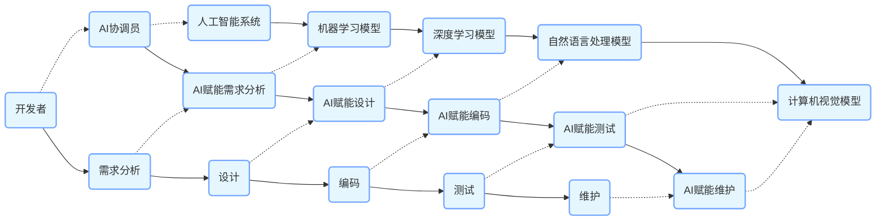

# 编程角色的未来：从开发者到AI协调员

> 关键词：编程角色、未来趋势、AI协调员、开发者转型、人工智能、软件开发、技术变革

> 摘要：本文深入探讨了编程角色在未来的演变趋势，即从传统的开发者向AI协调员转变。随着人工智能技术的飞速发展，软件开发领域正经历着深刻的变革，编程角色也面临着新的挑战和机遇。文章将详细阐述这一转变的背景、核心概念、算法原理、数学模型，通过项目实战案例展示实际应用，分析相关应用场景，推荐学习资源和开发工具，最后总结未来发展趋势与挑战，为从业者提供全面的参考和思考。

## 1. 背景介绍 
### 1.1 目的和范围
本文的目的在于深入研究编程角色在人工智能时代的演变趋势，分析从开发者到AI协调员转变的原因、过程和影响。范围涵盖了软件开发的各个环节，包括需求分析、设计、编码、测试、维护等，以及人工智能技术在这些环节中的应用。旨在帮助读者理解这一转变的本质，为从业者提供转型的思路和方法，同时也为关注软件开发行业发展的人士提供有价值的参考。

### 1.2 预期读者
本文预期读者包括软件开发从业者、计算机科学专业学生、技术管理者、对人工智能和软件开发行业发展感兴趣的人士等。对于软件开发从业者，本文可以帮助他们了解行业趋势，规划职业发展方向；对于计算机科学专业学生，本文可以为他们的学习和未来职业选择提供指导；对于技术管理者，本文可以为他们的团队管理和技术战略规划提供参考；对于对行业发展感兴趣的人士，本文可以帮助他们了解编程角色的未来演变，把握行业发展动态。

### 1.3 文档结构概述
本文将按照以下结构进行阐述：首先介绍背景信息，包括目的、预期读者和文档结构概述；接着讲解核心概念与联系，包括从开发者到AI协调员转变的相关概念和它们之间的关系；然后详细阐述核心算法原理和具体操作步骤，通过Python代码进行说明；再介绍数学模型和公式，并举例说明；之后通过项目实战展示代码实际案例和详细解释；分析实际应用场景；推荐相关的工具和资源；最后总结未来发展趋势与挑战，提供常见问题与解答和扩展阅读及参考资料。

### 1.4 术语表
#### 1.4.1 核心术语定义
- **开发者**：传统意义上的软件开发人员，主要负责编写代码、实现软件功能，包括前端开发者、后端开发者、全栈开发者等。
- **AI协调员**：在人工智能时代，负责协调人工智能技术与软件开发过程的专业人员，需要具备对人工智能技术的理解和应用能力，以及对软件开发流程的管理和协调能力。
- **人工智能（AI）**：研究、开发用于模拟、延伸和扩展人的智能的理论、方法、技术及应用系统的一门新的技术科学。
- **机器学习（ML）**：一门多领域交叉学科，涉及概率论、统计学、逼近论、凸分析、算法复杂度理论等多门学科。它专门研究计算机怎样模拟或实现人类的学习行为，以获取新的知识或技能，重新组织已有的知识结构使之不断改善自身的性能。
- **深度学习（DL）**：机器学习的一个分支领域，它是一种基于对数据进行表征学习的方法。深度学习通过构建具有很多层的神经网络模型，自动从大量数据中学习特征和模式。

#### 1.4.2 相关概念解释
- **软件开发流程**：指从软件项目的提出、需求分析、设计、编码、测试、维护到最终退役的整个过程。传统的软件开发流程包括瀑布模型、敏捷开发模型等。
- **AI赋能软件开发**：指将人工智能技术应用于软件开发的各个环节，如需求分析、代码生成、测试用例生成等，以提高软件开发的效率和质量。
- **人机协作**：指人类与人工智能系统之间的协作，通过合理分配任务和发挥各自的优势，实现更高效的工作。

#### 1.4.3 缩略词列表
- **AI**：Artificial Intelligence（人工智能）
- **ML**：Machine Learning（机器学习）
- **DL**：Deep Learning（深度学习）

## 2. 核心概念与联系 

### 从开发者到AI协调员的转变
在传统的软件开发中，开发者主要关注代码的实现和功能的完成。他们需要掌握多种编程语言和开发工具，具备良好的编程技巧和逻辑思维能力。然而，随着人工智能技术的快速发展，软件开发过程正逐渐发生变化。人工智能可以自动完成一些重复性的任务，如代码生成、测试用例生成等，这使得开发者的角色需要进行相应的调整。

AI协调员则需要在理解人工智能技术的基础上，将其与软件开发流程相结合。他们不仅要具备一定的编程能力，还要了解机器学习、深度学习等人工智能技术的原理和应用。AI协调员需要协调人工智能系统与人类开发者之间的工作，确保软件开发过程的高效进行。

### 核心概念原理和架构的文本示意图
```plaintext
开发者 -> 需求分析 -> 设计 -> 编码 -> 测试 -> 维护
    |                        |
    v                        v
AI协调员 -> AI赋能需求分析 -> AI赋能设计 -> AI赋能编码 -> AI赋能测试 -> AI赋能维护
    |                        |
    v                        v
人工智能系统 -> 机器学习模型 -> 深度学习模型 -> 自然语言处理模型 -> 计算机视觉模型
```

### Mermaid流程图


## 3. 核心算法原理 & 具体操作步骤 

### 机器学习在软件开发中的应用原理
机器学习在软件开发中的应用主要是通过对大量数据的学习，构建模型来预测和解决问题。例如，在代码生成方面，可以使用机器学习模型学习已有的代码模式，然后根据输入的需求生成相应的代码。

以下是一个简单的基于Python的机器学习代码生成示例，使用了一个简单的字符级循环神经网络（RNN）：

```python
import numpy as np
import tensorflow as tf
from tensorflow.keras.layers import LSTM, Dense
from tensorflow.keras.models import Sequential

# 示例代码数据
text = "def add(a, b): return a + b"
chars = sorted(list(set(text)))
char_indices = dict((c, i) for i, c in enumerate(chars))
indices_char = dict((i, c) for i, c in enumerate(chars))

# 准备训练数据
maxlen = 20
step = 3
sentences = []
next_chars = []
for i in range(0, len(text) - maxlen, step):
    sentences.append(text[i: i + maxlen])
    next_chars.append(text[i + maxlen])

x = np.zeros((len(sentences), maxlen, len(chars)), dtype=np.bool)
y = np.zeros((len(sentences), len(chars)), dtype=np.bool)
for i, sentence in enumerate(sentences):
    for t, char in enumerate(sentence):
        x[i, t, char_indices[char]] = 1
    y[i, char_indices[next_chars[i]]] = 1

# 构建模型
model = Sequential()
model.add(LSTM(128, input_shape=(maxlen, len(chars))))
model.add(Dense(len(chars), activation='softmax'))

model.compile(loss='categorical_crossentropy', optimizer='adam')

# 训练模型
model.fit(x, y, batch_size=128, epochs=60)

# 生成代码
def sample(preds, temperature=1.0):
    preds = np.asarray(preds).astype('float64')
    preds = np.log(preds) / temperature
    exp_preds = np.exp(preds)
    preds = exp_preds / np.sum(exp_preds)
    probas = np.random.multinomial(1, preds, 1)
    return np.argmax(probas)

start_index = np.random.randint(0, len(text) - maxlen - 1)
generated = ''
sentence = text[start_index: start_index + maxlen]
generated += sentence
for i in range(400):
    x_pred = np.zeros((1, maxlen, len(chars)))
    for t, char in enumerate(sentence):
        x_pred[0, t, char_indices[char]] = 1.

    preds = model.predict(x_pred, verbose=0)[0]
    next_index = sample(preds, 0.2)
    next_char = indices_char[next_index]

    generated += next_char
    sentence = sentence[1:] + next_char

print(generated)
```

### 具体操作步骤
1. **数据准备**：收集和整理与软件开发相关的数据，如代码、需求文档等。对数据进行预处理，包括清洗、标注、分词等操作。
2. **模型选择**：根据具体的任务和数据特点，选择合适的机器学习或深度学习模型，如决策树、神经网络、循环神经网络等。
3. **模型训练**：使用准备好的数据对模型进行训练，调整模型的参数，使其能够准确地预测和解决问题。
4. **模型评估**：使用测试数据对训练好的模型进行评估，计算模型的准确率、召回率、F1值等指标，评估模型的性能。
5. **模型应用**：将训练好的模型应用到实际的软件开发过程中，如代码生成、测试用例生成等。

## 4. 数学模型和公式 & 详细讲解 & 举例说明 

### 机器学习中的损失函数
在机器学习中，损失函数用于衡量模型预测结果与真实标签之间的差异。常见的损失函数包括均方误差（MSE）、交叉熵损失等。

#### 均方误差（MSE）
均方误差是回归问题中常用的损失函数，其公式为：
$$MSE = \frac{1}{n} \sum_{i=1}^{n} (y_i - \hat{y}_i)^2$$
其中，$n$ 是样本数量，$y_i$ 是真实标签，$\hat{y}_i$ 是模型的预测值。

**详细讲解**：均方误差通过计算每个样本的预测值与真实值之间的误差的平方，然后求平均值来衡量模型的性能。误差的平方可以确保所有误差都是非负的，并且较大的误差会被放大，从而使模型更加关注较大的误差。

**举例说明**：假设有一个回归模型，对三个样本的预测值分别为 $\hat{y}_1 = 2$，$\hat{y}_2 = 4$，$\hat{y}_3 = 6$，真实标签分别为 $y_1 = 1$，$y_2 = 3$，$y_3 = 5$。则均方误差为：
$$MSE = \frac{1}{3} \times [(2 - 1)^2 + (4 - 3)^2 + (6 - 5)^2] = \frac{1}{3} \times (1 + 1 + 1) = 1$$

#### 交叉熵损失
交叉熵损失是分类问题中常用的损失函数，对于二分类问题，其公式为：
$$H(p, q) = - \sum_{i=1}^{n} [y_i \log(\hat{y}_i) + (1 - y_i) \log(1 - \hat{y}_i)]$$
其中，$n$ 是样本数量，$y_i$ 是真实标签（取值为 0 或 1），$\hat{y}_i$ 是模型的预测概率。

**详细讲解**：交叉熵损失通过计算真实标签分布与预测概率分布之间的差异来衡量模型的性能。当真实标签为 1 时，模型的预测概率越接近 1，损失越小；当真实标签为 0 时，模型的预测概率越接近 0，损失越小。

**举例说明**：假设有一个二分类模型，对两个样本的预测概率分别为 $\hat{y}_1 = 0.8$，$\hat{y}_2 = 0.2$，真实标签分别为 $y_1 = 1$，$y_2 = 0$。则交叉熵损失为：
$$H(p, q) = - [1 \times \log(0.8) + (1 - 1) \times \log(1 - 0.8)] - [0 \times \log(0.2) + (1 - 0) \times \log(1 - 0.2)]$$
$$= - \log(0.8) - \log(0.8) \approx 0.446$$

### 梯度下降算法
梯度下降算法是一种常用的优化算法，用于最小化损失函数。其基本思想是沿着损失函数的负梯度方向更新模型的参数，直到找到损失函数的最小值。

梯度下降算法的更新公式为：
$$\theta_{t+1} = \theta_t - \alpha \nabla J(\theta_t)$$
其中，$\theta_t$ 是第 $t$ 次迭代时的模型参数，$\alpha$ 是学习率，$\nabla J(\theta_t)$ 是损失函数 $J(\theta)$ 在 $\theta_t$ 处的梯度。

**详细讲解**：梯度下降算法通过不断地更新模型的参数，使得损失函数的值逐渐减小。学习率 $\alpha$ 控制了每次更新的步长，过大的学习率可能导致模型无法收敛，过小的学习率会导致收敛速度过慢。

**举例说明**：假设有一个简单的线性回归模型 $y = \theta x$，损失函数为均方误差 $J(\theta) = \frac{1}{n} \sum_{i=1}^{n} (y_i - \theta x_i)^2$。则损失函数的梯度为：
$$\nabla J(\theta) = \frac{2}{n} \sum_{i=1}^{n} (\theta x_i - y_i) x_i$$
假设学习率 $\alpha = 0.1$，初始参数 $\theta_0 = 0$，样本数据为 $(x_1, y_1) = (1, 2)$，$(x_2, y_2) = (2, 4)$。则第一次迭代时的梯度为：
$$\nabla J(\theta_0) = \frac{2}{2} \times [(0 \times 1 - 2) \times 1 + (0 \times 2 - 4) \times 2] = -2 - 8 = -10$$
第一次迭代后的参数为：
$$\theta_1 = \theta_0 - \alpha \nabla J(\theta_0) = 0 - 0.1 \times (-10) = 1$$

## 5. 项目实战：代码实际案例和详细解释说明 

### 5.1  开发环境搭建
1. **安装Python**：从Python官方网站（https://www.python.org/downloads/）下载并安装Python 3.x版本。
2. **安装开发工具**：推荐使用PyCharm或Jupyter Notebook作为开发工具。可以从官方网站下载并安装。
3. **安装必要的库**：使用pip命令安装必要的库，如TensorFlow、NumPy、Pandas等。
```bash
pip install tensorflow numpy pandas
```

### 5.2  源代码详细实现和代码解读
以下是一个使用TensorFlow实现简单神经网络进行手写数字识别的项目实战案例：

```python
import tensorflow as tf
from tensorflow.keras.datasets import mnist
from tensorflow.keras.models import Sequential
from tensorflow.keras.layers import Dense, Flatten
from tensorflow.keras.utils import to_categorical

# 加载数据集
(train_images, train_labels), (test_images, test_labels) = mnist.load_data()

# 数据预处理
train_images = train_images / 255.0
test_images = test_images / 255.0

train_labels = to_categorical(train_labels)
test_labels = to_categorical(test_labels)

# 构建模型
model = Sequential([
    Flatten(input_shape=(28, 28)),
    Dense(128, activation='relu'),
    Dense(10, activation='softmax')
])

# 编译模型
model.compile(optimizer='adam',
              loss='categorical_crossentropy',
              metrics=['accuracy'])

# 训练模型
model.fit(train_images, train_labels, epochs=5, batch_size=32)

# 评估模型
test_loss, test_acc = model.evaluate(test_images, test_labels)
print(f"Test accuracy: {test_acc}")
```

### 5.3  代码解读与分析
1. **数据加载**：使用`mnist.load_data()`函数加载MNIST手写数字数据集，该数据集包含60000个训练样本和10000个测试样本。
2. **数据预处理**：将图像数据的像素值归一化到0-1之间，以提高模型的训练效果。将标签数据进行one-hot编码，将其转换为向量形式，方便模型进行分类。
3. **模型构建**：使用`Sequential`模型构建一个简单的神经网络，包含一个Flatten层、一个全连接层和一个输出层。Flatten层将二维的图像数据转换为一维向量，全连接层使用ReLU激活函数进行非线性变换，输出层使用softmax激活函数输出每个类别的概率。
4. **模型编译**：使用`adam`优化器、`categorical_crossentropy`损失函数和`accuracy`评估指标对模型进行编译。
5. **模型训练**：使用`fit`方法对模型进行训练，设置训练的轮数和批次大小。
6. **模型评估**：使用`evaluate`方法对模型进行评估，计算测试集上的损失和准确率。

## 6. 实际应用场景 

### 代码生成
AI协调员可以利用人工智能技术，如机器学习和自然语言处理，根据需求文档生成代码。例如，对于一些简单的增删改查功能，可以通过训练好的模型自动生成相应的代码，提高开发效率。

### 测试用例生成
通过分析代码结构和功能，使用人工智能技术生成测试用例。可以根据代码的输入输出关系、分支结构等信息，自动生成覆盖各种情况的测试用例，提高测试的覆盖率和效率。

### 需求分析
利用自然语言处理技术对需求文档进行分析，提取关键信息，理解用户需求。可以将需求文档转换为结构化的数据，为后续的设计和开发提供支持。

### 智能代码审查
通过机器学习模型对代码进行审查，检查代码的质量、风格和安全性。可以发现代码中的潜在问题，如内存泄漏、安全漏洞等，提高代码的质量和可靠性。

### 项目管理
利用人工智能技术对项目进度、资源分配等进行管理和预测。可以根据历史数据和当前项目状态，预测项目的完成时间、可能遇到的风险等，帮助项目管理者做出更明智的决策。

## 7. 工具和资源推荐
### 7.1 学习资源推荐
#### 7.1.1 书籍推荐
- 《Python机器学习》：介绍了Python在机器学习中的应用，包括各种机器学习算法的原理和实现。
- 《深度学习》：由深度学习领域的三位先驱Ian Goodfellow、Yoshua Bengio和Aaron Courville撰写，全面介绍了深度学习的理论和实践。
- 《人工智能：一种现代的方法》：经典的人工智能教材，涵盖了人工智能的各个领域，包括搜索算法、知识表示、机器学习等。

#### 7.1.2 在线课程
- Coursera上的“机器学习”课程：由斯坦福大学的Andrew Ng教授授课，是机器学习领域的经典课程。
- edX上的“深度学习微硕士”课程：提供了深度学习的系统学习路径，包括多个深度学习的核心课程。
- 吴恩达的“深度学习专项课程”：在Coursera上提供，包括深度学习的基础、卷积神经网络、循环神经网络等内容。

#### 7.1.3 技术博客和网站
- Medium：有很多关于人工智能、机器学习和软件开发的技术博客，作者来自世界各地的专业人士。
- Towards Data Science：专注于数据科学和机器学习领域的技术博客，提供了很多高质量的文章和教程。
- 开源中国：国内知名的开源技术社区，提供了很多关于软件开发和人工智能的技术文章和资讯。

### 7.2 开发工具框架推荐
#### 7.2.1 IDE和编辑器
- PyCharm：专业的Python集成开发环境，提供了丰富的功能，如代码编辑、调试、代码分析等。
- Jupyter Notebook：交互式的开发环境，适合进行数据探索、模型训练和实验。
- Visual Studio Code：轻量级的代码编辑器，支持多种编程语言和插件，具有良好的扩展性。

#### 7.2.2 调试和性能分析工具
- TensorBoard：TensorFlow的可视化工具，可以帮助用户可视化模型的训练过程、性能指标等。
- Py-Spy：Python的性能分析工具，可以分析Python代码的性能瓶颈，找出耗时的函数和代码段。
- cProfile：Python的内置性能分析模块，可以对Python程序进行性能分析，输出函数调用的时间和次数等信息。

#### 7.2.3 相关框架和库
- TensorFlow：开源的机器学习框架，提供了丰富的工具和接口，支持各种机器学习和深度学习任务。
- PyTorch：另一个流行的深度学习框架，具有动态图的优势，适合快速开发和实验。
- Scikit-learn：简单易用的机器学习库，提供了各种机器学习算法的实现，适合初学者和快速实验。

### 7.3 相关论文著作推荐
#### 7.3.1 经典论文
- “ImageNet Classification with Deep Convolutional Neural Networks”：AlexNet的论文，开启了深度学习在计算机视觉领域的热潮。
- “Long Short-Term Memory”：介绍了长短期记忆网络（LSTM）的论文，LSTM是一种常用的循环神经网络结构，用于处理序列数据。
- “Attention Is All You Need”：介绍了Transformer架构的论文，Transformer在自然语言处理领域取得了巨大的成功。

#### 7.3.2 最新研究成果
- arXiv：预印本平台，提供了很多关于人工智能、机器学习等领域的最新研究成果。
- NeurIPS（神经信息处理系统大会）：人工智能领域的顶级学术会议，每年都会发表很多高质量的研究论文。
- ICML（国际机器学习会议）：专注于机器学习领域的学术会议，展示了机器学习领域的最新研究进展。

#### 7.3.3 应用案例分析
- KDnuggets：提供了很多关于数据科学和机器学习的应用案例分析，包括金融、医疗、电商等领域。
- Kaggle：数据科学竞赛平台，上面有很多实际的数据集和竞赛项目，可以参考其他参赛者的解决方案和思路。

## 8. 总结：未来发展趋势与挑战

### 未来发展趋势
1. **AI与软件开发的深度融合**：人工智能技术将越来越深入地应用于软件开发的各个环节，从需求分析到代码生成、测试、维护等，实现软件开发的自动化和智能化。
2. **人机协作的常态化**：人类开发者与人工智能系统之间的协作将成为常态，AI协调员将在其中发挥重要作用，合理分配任务，发挥人类和人工智能的优势。
3. **低代码/无代码开发的普及**：随着人工智能技术的发展，低代码/无代码开发平台将越来越普及，使得非专业开发者也能够参与到软件开发中来，降低软件开发的门槛。
4. **跨领域融合**：编程角色将与其他领域，如数据分析、云计算、物联网等进行更深入的融合，要求从业者具备更广泛的知识和技能。

### 挑战
1. **技术更新换代快**：人工智能技术发展迅速，新的算法和模型不断涌现，从业者需要不断学习和更新知识，以跟上技术的发展步伐。
2. **数据隐私和安全问题**：人工智能系统需要大量的数据进行训练，如何保护数据的隐私和安全是一个重要的挑战。同时，人工智能系统本身也可能存在安全漏洞，需要加强安全防护。
3. **人才短缺**：目前，既懂人工智能技术又懂软件开发的复合型人才短缺，培养这样的人才需要一定的时间和资源。
4. **伦理和法律问题**：人工智能的应用可能会带来一些伦理和法律问题，如算法歧视、责任认定等，需要建立相应的伦理和法律框架来规范其发展。

## 9. 附录：常见问题与解答

### 1. 从开发者转型为AI协调员需要具备哪些技能？
需要具备一定的编程能力，了解机器学习、深度学习等人工智能技术的原理和应用，掌握软件开发流程和项目管理知识，具备良好的沟通和协调能力。

### 2. 人工智能技术在软件开发中会完全取代开发者吗？
不会。虽然人工智能技术可以自动完成一些重复性的任务，但软件开发过程中还需要人类的创造力、判断力和领域知识。人类开发者和人工智能系统将相互协作，共同完成软件开发任务。

### 3. 如何学习人工智能技术？
可以通过阅读相关书籍、在线课程、技术博客等进行学习。同时，要多进行实践，通过实际项目来提高自己的能力。

### 4. 低代码/无代码开发平台是否会取代传统的软件开发？
不会。低代码/无代码开发平台适合一些简单的应用开发，但对于复杂的、定制化的软件系统，仍然需要传统的软件开发方法。

## 10. 扩展阅读 & 参考资料
1. 《Python深度学习》，Francois Chollet著
2. 《机器学习实战》，Peter Harrington著
3. TensorFlow官方文档（https://www.tensorflow.org/）
4. PyTorch官方文档（https://pytorch.org/）
5. Scikit-learn官方文档（https://scikit-learn.org/）
6. arXiv（https://arxiv.org/）
7. NeurIPS会议论文集（https://neurips.cc/）
8. ICML会议论文集（https://icml.cc/）