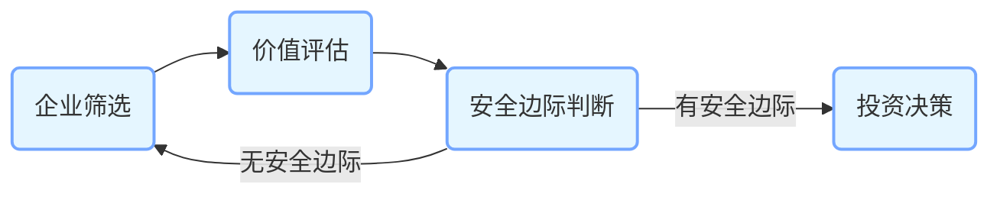

# 罗伯特·哈格斯特朗的成长型价值投资

> 关键词：罗伯特·哈格斯特朗、成长型价值投资、投资策略、股票估值、企业分析

> 摘要：本文深入探讨了罗伯特·哈格斯特朗所倡导的成长型价值投资理念。通过对其背景的介绍，详细阐述成长型价值投资的核心概念、算法原理、数学模型等内容。结合项目实战案例，分析其在实际投资中的应用场景，同时推荐相关的学习资源、开发工具框架及论文著作。最后总结该投资理念的未来发展趋势与挑战，并对常见问题进行解答，为投资者深入理解和运用成长型价值投资提供全面的参考。

## 1. 背景介绍 
### 1.1 目的和范围
本文旨在全面剖析罗伯特·哈格斯特朗的成长型价值投资理念，帮助投资者深入理解这一投资策略的核心要点和实际应用方法。范围涵盖成长型价值投资的理论基础、操作步骤、数学模型、实际案例以及未来发展等多个方面，为不同层次的投资者提供系统的知识和实践指导。

### 1.2 预期读者
本文预期读者包括对价值投资感兴趣的个人投资者、金融专业学生、投资机构从业者以及对金融市场有深入研究需求的人士。无论您是初涉投资领域的新手，还是经验丰富的专业投资者，都能从本文中获取有价值的信息和启发。

### 1.3 文档结构概述
本文将按照以下结构展开：首先介绍成长型价值投资的背景知识，包括相关术语和概念；接着阐述核心概念与联系，通过文本示意图和 Mermaid 流程图进行清晰展示；然后详细讲解核心算法原理和具体操作步骤，并给出 Python 源代码示例；随后介绍数学模型和公式，结合具体例子进行说明；通过项目实战案例，展示成长型价值投资在实际中的应用；分析实际应用场景；推荐相关的学习资源、开发工具框架和论文著作；最后总结未来发展趋势与挑战，解答常见问题，并提供扩展阅读和参考资料。

### 1.4 术语表
#### 1.4.1 核心术语定义
- **成长型价值投资**：是一种结合了成长投资和价值投资特点的投资策略，既关注企业的未来成长潜力，又注重企业的内在价值，旨在寻找被市场低估且具有高成长潜力的股票。
- **内在价值**：指企业在其存续期间所产生的未来现金流量的现值，是评估企业真实价值的重要指标。
- **安全边际**：投资者在购买股票时，股票价格低于其内在价值的幅度，安全边际越大，投资风险越低。

#### 1.4.2 相关概念解释
- **成长投资**：侧重于寻找具有高成长潜力的企业，通常关注企业的销售收入、利润等指标的增长速度。
- **价值投资**：强调以低于企业内在价值的价格购买股票，注重股票的估值和企业的基本面。

#### 1.4.3 缩略词列表
- **DCF**：Discounted Cash Flow，折现现金流，是一种计算企业内在价值的常用方法。
- **PE**：Price-to-Earnings Ratio，市盈率，是衡量股票估值的重要指标之一。

## 2. 核心概念与联系 

### 核心概念原理
成长型价值投资的核心在于寻找那些既具有良好成长前景又被市场低估的企业。与单纯的成长投资不同，成长型价值投资不仅仅关注企业的成长速度，还会考虑企业的估值水平，以确保投资具有足够的安全边际。与传统的价值投资相比，成长型价值投资更注重企业的未来发展潜力，而不仅仅是当前的资产价值。

企业的成长潜力可以通过多个方面来评估，如市场需求、行业竞争格局、企业的创新能力、管理团队的素质等。同时，企业的内在价值需要通过合理的估值方法来确定，常用的方法包括折现现金流法（DCF）、市盈率法（PE）等。

### 架构的文本示意图
成长型价值投资的架构可以概括为以下几个关键环节：
1. **企业筛选**：从众多企业中筛选出具有成长潜力的企业，这需要对行业和企业进行深入的研究和分析。
2. **价值评估**：运用合适的估值方法对筛选出的企业进行内在价值评估，确定其合理的股价范围。
3. **安全边际判断**：比较股票的市场价格与内在价值，判断是否存在足够的安全边际。
4. **投资决策**：在存在安全边际的情况下，做出投资决策，并进行投资组合的构建和管理。

### Mermaid 流程图


## 3. 核心算法原理 & 具体操作步骤 

### 核心算法原理
在成长型价值投资中，一个重要的算法是折现现金流法（DCF），用于计算企业的内在价值。DCF 法的基本原理是将企业未来的现金流量折现到当前时刻，以反映其真实的价值。

### Python 源代码示例
```python
import numpy as np

def dcf_valuation(cash_flows, discount_rate):
    """
    计算企业的折现现金流价值
    :param cash_flows: 未来各期的现金流量列表
    :param discount_rate: 折现率
    :return: 企业的内在价值
    """
    present_values = []
    for i, cf in enumerate(cash_flows):
        present_value = cf / (1 + discount_rate) ** (i + 1)
        present_values.append(present_value)
    return np.sum(present_values)

# 示例数据
cash_flows = [100, 120, 150, 180, 200]  # 未来 5 年的现金流量
discount_rate = 0.1  # 折现率为 10%

intrinsic_value = dcf_valuation(cash_flows, discount_rate)
print(f"企业的内在价值为: {intrinsic_value}")
```

### 具体操作步骤
1. **确定未来现金流量**：通过对企业的财务报表分析、行业研究和市场预测，估计企业未来各期的现金流量。这需要考虑企业的销售收入、成本、资本支出等因素。
2. **选择折现率**：折现率反映了投资者对投资风险的预期。一般来说，折现率可以参考市场利率、行业平均收益率等因素来确定。
3. **计算折现现金流**：将未来各期的现金流量按照选定的折现率折现到当前时刻，然后求和得到企业的内在价值。
4. **比较市场价格与内在价值**：将计算得到的内在价值与股票的市场价格进行比较，如果市场价格低于内在价值，且存在足够的安全边际，则可以考虑投资。

## 4. 数学模型和公式 & 详细讲解 & 举例说明 

### 数学模型和公式
- **折现现金流法（DCF）**：
  企业的内在价值 $V$ 可以表示为：
  $$V = \sum_{t=1}^{n} \frac{CF_t}{(1 + r)^t}$$
  其中，$CF_t$ 表示第 $t$ 期的现金流量，$r$ 表示折现率，$n$ 表示预测的期数。

- **市盈率法（PE）**：
  股票的合理价格 $P$ 可以通过市盈率和每股收益（EPS）来计算：
  $$P = PE \times EPS$$

### 详细讲解
- **折现现金流法（DCF）**：该方法的核心思想是将企业未来的现金流量折现到当前时刻，以反映其真实的价值。折现率 $r$ 考虑了货币的时间价值和投资风险，折现率越高，未来现金流量的现值越低。预测的期数 $n$ 通常根据企业的发展阶段和行业特点来确定。
- **市盈率法（PE）**：市盈率反映了市场对企业盈利的预期，是衡量股票估值的重要指标之一。每股收益（EPS）是企业净利润除以总股本得到的数值。通过比较股票的当前市盈率和行业平均市盈率，可以判断股票是否被低估或高估。

### 举例说明
- **折现现金流法（DCF）**：假设一家企业未来 5 年的现金流量分别为 100 万元、120 万元、150 万元、180 万元和 200 万元，折现率为 10%。则该企业的内在价值为：
  $$V = \frac{100}{(1 + 0.1)^1} + \frac{120}{(1 + 0.1)^2} + \frac{150}{(1 + 0.1)^3} + \frac{180}{(1 + 0.1)^4} + \frac{200}{(1 + 0.1)^5}$$
  计算可得：
  $$V \approx 90.91 + 99.17 + 112.70 + 122.94 + 124.18 = 549.90 \text{（万元）}$$
- **市盈率法（PE）**：假设某企业的每股收益为 2 元，行业平均市盈率为 15 倍。则该企业股票的合理价格为：
  $$P = 15 \times 2 = 30 \text{（元）}$$

## 5. 项目实战：代码实际案例和详细解释说明 

### 5.1  开发环境搭建
在进行成长型价值投资的项目实战时，我们可以使用 Python 语言进行数据处理和分析。以下是搭建开发环境的步骤：
1. **安装 Python**：从 Python 官方网站（https://www.python.org/downloads/）下载并安装 Python 3.x 版本。
2. **安装必要的库**：使用 `pip` 命令安装以下必要的库：
   - `pandas`：用于数据处理和分析。
   - `numpy`：用于数值计算。
   - `matplotlib`：用于数据可视化。

```bash
pip install pandas numpy matplotlib
```

### 5.2  源代码详细实现和代码解读
以下是一个简单的项目实战案例，通过计算多只股票的市盈率和内在价值，筛选出具有投资价值的股票。

```python
import pandas as pd
import numpy as np

# 定义股票数据
stocks = {
    '股票代码': ['000001', '000002', '000003'],
    '每股收益（EPS）': [2, 3, 1.5],
    '当前股价': [30, 40, 20],
    '行业平均市盈率': [15, 18, 12]
}

# 创建 DataFrame
df = pd.DataFrame(stocks)

# 计算合理股价
df['合理股价'] = df['每股收益（EPS）'] * df['行业平均市盈率']

# 计算安全边际
df['安全边际'] = (df['合理股价'] - df['当前股价']) / df['合理股价']

# 筛选出安全边际大于 20% 的股票
selected_stocks = df[df['安全边际'] > 0.2]

print("筛选出的具有投资价值的股票：")
print(selected_stocks)
```

### 代码解读与分析
1. **数据定义**：首先定义了一个包含多只股票信息的字典 `stocks`，包括股票代码、每股收益、当前股价和行业平均市盈率。
2. **创建 DataFrame**：使用 `pandas` 库的 `DataFrame` 函数将字典转换为数据框，方便进行数据处理和分析。
3. **计算合理股价**：根据市盈率法，通过每股收益和行业平均市盈率计算出每只股票的合理股价。
4. **计算安全边际**：用合理股价减去当前股价，再除以合理股价，得到每只股票的安全边际。
5. **筛选股票**：筛选出安全边际大于 20% 的股票，认为这些股票具有投资价值。

## 6. 实际应用场景 
### 个人投资者
对于个人投资者来说，成长型价值投资可以帮助他们在众多股票中筛选出具有投资潜力的股票，降低投资风险。个人投资者可以通过学习和运用成长型价值投资的方法，自主进行股票投资，实现资产的增值。

### 投资机构
投资机构可以将成长型价值投资作为一种重要的投资策略，应用于投资组合的构建和管理。通过深入研究企业的基本面和成长潜力，投资机构可以选择优质的股票进行投资，提高投资组合的收益率和稳定性。

### 企业并购
在企业并购过程中，成长型价值投资的理念可以帮助并购方评估目标企业的价值。通过分析目标企业的未来成长潜力和内在价值，并购方可以确定合理的并购价格，提高并购的成功率和效益。

## 7. 工具和资源推荐
### 7.1 学习资源推荐
#### 7.1.1 书籍推荐
- 《聪明的投资者》（本杰明·格雷厄姆著）：价值投资的经典著作，详细阐述了价值投资的理念和方法。
- 《巴菲特致股东的信》（沃伦·巴菲特著）：通过巴菲特的信件，深入了解他的投资思想和决策过程。
- 《怎样选择成长股》（菲利普·费雪著）：介绍了成长投资的方法和技巧，对成长型价值投资有重要的参考价值。

#### 7.1.2 在线课程
- Coursera 上的“投资学原理”课程：由知名教授授课，系统介绍投资学的基本原理和方法。
- edX 上的“价值投资分析”课程：深入讲解价值投资的理论和实践。

#### 7.1.3 技术博客和网站
- 雪球网：提供丰富的股票投资信息和交流平台，投资者可以在这里分享经验和观点。
- 东方财富网：提供全面的金融资讯和数据服务，有助于投资者进行市场分析和研究。

### 7.2 开发工具框架推荐
#### 7.2.1 IDE和编辑器
- PyCharm：一款专业的 Python 集成开发环境，提供丰富的功能和插件，方便进行 Python 代码的开发和调试。
- Jupyter Notebook：一个交互式的开发环境，适合进行数据探索和分析，支持 Python 等多种编程语言。

#### 7.2.2 调试和性能分析工具
- pdb：Python 内置的调试工具，可以帮助开发者定位和解决代码中的问题。
- cProfile：Python 标准库中的性能分析工具，用于分析代码的性能瓶颈。

#### 7.2.3 相关框架和库
- `pandas`：用于数据处理和分析，提供了丰富的数据结构和函数。
- `numpy`：用于数值计算，提供了高效的数组操作和数学函数。
- `scikit-learn`：用于机器学习和数据分析，提供了各种机器学习算法和工具。

### 7.3 相关论文著作推荐
#### 7.3.1 经典论文
- Fama, E. F., & French, K. R. (1992). The cross-section of expected stock returns. The Journal of Finance, 47(2), 427-465. 该论文提出了著名的 Fama-French 三因子模型，对股票收益率的横截面进行了深入研究。
- Sharpe, W. F. (1964). Capital asset prices: A theory of market equilibrium under conditions of risk. The Journal of Finance, 19(3), 425-442. 该论文提出了资本资产定价模型（CAPM），为资产定价和投资决策提供了重要的理论基础。

#### 7.3.2 最新研究成果
- 关注顶级金融学术期刊，如 The Journal of Finance、The Review of Financial Studies 等，了解成长型价值投资领域的最新研究动态。

#### 7.3.3 应用案例分析
- 研究一些知名投资机构的投资报告和案例分析，了解他们在成长型价值投资方面的实践经验和策略。

## 8. 总结：未来发展趋势与挑战
### 未来发展趋势
- **科技融合**：随着科技的不断发展，成长型价值投资将与人工智能、大数据等技术深度融合。通过利用这些技术，可以更高效地进行企业筛选、价值评估和投资决策，提高投资的准确性和效率。
- **全球投资**：经济全球化的趋势将促使成长型价值投资更加注重全球市场。投资者将有更多机会投资于不同国家和地区的优质企业，实现资产的全球配置。
- **社会责任投资**：越来越多的投资者开始关注企业的社会责任，成长型价值投资也将逐渐纳入社会责任因素。具有良好社会形象和可持续发展能力的企业将更受投资者青睐。

### 挑战
- **市场不确定性**：金融市场充满了不确定性，宏观经济环境、政策变化、行业竞争等因素都会影响企业的发展和股票价格。投资者需要不断提高自己的风险评估和应对能力。
- **数据质量和分析能力**：成长型价值投资需要大量的数据支持，数据的质量和准确性直接影响投资决策的正确性。同时，投资者需要具备较强的数据分析能力，才能从海量数据中提取有价值的信息。
- **竞争加剧**：随着成长型价值投资理念的普及，越来越多的投资者和投资机构参与其中，市场竞争将日益激烈。投资者需要不断创新和优化投资策略，才能在竞争中脱颖而出。

## 9. 附录：常见问题与解答
### 问题 1：成长型价值投资与传统价值投资有什么区别？
解答：传统价值投资更注重企业的当前资产价值和股息分配，强调以低于企业内在价值的价格购买股票。而成长型价值投资不仅关注企业的内在价值，还更注重企业的未来成长潜力，愿意为具有高成长潜力的企业支付一定的溢价。

### 问题 2：如何确定企业的未来现金流量？
解答：确定企业的未来现金流量需要综合考虑多个因素，包括企业的历史财务数据、行业发展趋势、市场需求、竞争格局等。可以通过分析企业的财务报表、进行行业研究和市场预测等方法来估计未来现金流量。

### 问题 3：折现率应该如何选择？
解答：折现率的选择需要考虑货币的时间价值和投资风险。一般来说，可以参考市场利率、行业平均收益率等因素来确定。对于风险较高的投资，折现率应该相应提高；对于风险较低的投资，折现率可以适当降低。

### 问题 4：安全边际的大小应该如何确定？
解答：安全边际的大小没有固定的标准，通常取决于投资者的风险偏好和投资策略。一般来说，安全边际越大，投资风险越低。投资者可以根据自己的情况，设定一个合理的安全边际阈值，如 20%、30% 等。

## 10. 扩展阅读 & 参考资料
- 格雷厄姆, B., & 多德, D. L. (2009). 证券分析. 海南出版社.
- 哈格斯特朗, R. G. (2019). 巴菲特的投资组合. 机械工业出版社.
- 金融时报、华尔街日报等金融媒体的相关报道和分析文章。
- 各大金融机构的研究报告和投资策略文档。