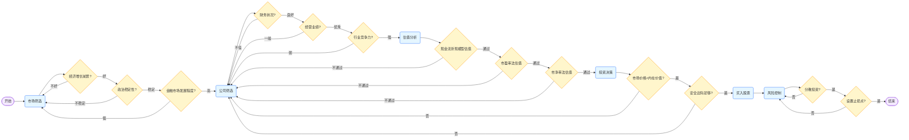

# 罗伯特哈格斯特朗的新兴市场价值投资

> 关键词：罗伯特哈格斯特朗、新兴市场、价值投资、投资策略、风险控制

> 摘要：本文围绕罗伯特哈格斯特朗的新兴市场价值投资展开深入探讨。首先介绍了相关背景，包括目的、预期读者等内容。接着阐述了核心概念与联系，分析价值投资在新兴市场的原理和架构。详细讲解了核心算法原理及具体操作步骤，并给出数学模型和公式加以说明。通过项目实战展示实际案例和代码实现，剖析代码含义。探讨了新兴市场价值投资的实际应用场景，推荐了相关的学习资源、开发工具框架以及论文著作。最后总结了未来发展趋势与挑战，提供常见问题解答和扩展阅读参考资料，旨在帮助读者全面理解和掌握罗伯特哈格斯特朗的新兴市场价值投资理念与方法。

## 1. 背景介绍 
### 1.1 目的和范围
本博客的目的在于深入研究罗伯特哈格斯特朗的新兴市场价值投资理论，为投资者、金融从业者以及对投资领域感兴趣的人士提供全面且深入的知识体系。范围涵盖新兴市场价值投资的基本概念、核心策略、算法原理、数学模型、实际应用场景以及相关工具资源等多个方面，力求从理论到实践，为读者呈现一个完整的投资知识框架。

### 1.2 预期读者
- **投资者**：包括个人投资者和机构投资者，希望通过了解新兴市场价值投资理论，优化投资组合，获取更高的投资回报。
- **金融从业者**：如基金经理、分析师等，需要深入研究新兴市场投资策略，提升专业能力和业务水平。
- **学生和学者**：对金融投资领域感兴趣的学生和从事相关研究的学者，希望通过学习相关理论，拓展学术视野，为进一步的研究打下基础。

### 1.3 文档结构概述
本文按照以下结构进行组织：首先介绍背景信息，包括目的、预期读者和文档结构概述等内容；接着阐述核心概念与联系，分析新兴市场价值投资的原理和架构；然后详细讲解核心算法原理及具体操作步骤，并给出数学模型和公式加以说明；通过项目实战展示实际案例和代码实现，剖析代码含义；探讨新兴市场价值投资的实际应用场景，推荐相关的学习资源、开发工具框架以及论文著作；最后总结未来发展趋势与挑战，提供常见问题解答和扩展阅读参考资料。

### 1.4 术语表
#### 1.4.1 核心术语定义
- **新兴市场**：指那些经济发展较快、市场潜力较大，但市场机制尚未完全成熟的国家和地区的金融市场。
- **价值投资**：一种基于公司内在价值进行投资的策略，投资者通过分析公司的财务状况、经营业绩等因素，寻找被市场低估的股票进行投资。
- **内在价值**：公司未来现金流的现值，是价值投资的核心概念之一。
- **安全边际**：指股票的市场价格低于其内在价值的部分，是价值投资的重要原则之一。

#### 1.4.2 相关概念解释
- **市场效率**：指市场价格反映所有可用信息的程度。在有效市场中，股票价格能够及时、准确地反映公司的内在价值；而在无效市场中，股票价格可能会偏离其内在价值，为价值投资者提供投资机会。
- **风险溢价**：指投资者因承担风险而要求的额外回报。在新兴市场中，由于市场波动较大、政治经济环境不稳定等因素，投资者通常要求更高的风险溢价。

#### 1.4.3 缩略词列表
- **PE**：市盈率（Price - Earnings Ratio），指股票价格与每股收益的比率，是衡量股票估值的常用指标之一。
- **PB**：市净率（Price - Book Ratio），指股票价格与每股净资产的比率，也是衡量股票估值的常用指标之一。
- **DCF**：现金流折现模型（Discounted Cash Flow Model），是一种通过预测公司未来现金流并将其折现到当前的估值方法。

## 2. 核心概念与联系 
### 2.1 新兴市场的特点
新兴市场通常具有以下特点：
- **高增长潜力**：新兴市场国家的经济增长速度通常较快，具有较大的市场潜力。例如，一些亚洲和非洲国家在过去几十年中经历了快速的经济增长，为投资者带来了丰厚的回报。
- **市场不成熟**：新兴市场的金融市场机制尚未完全成熟，市场监管不够完善，信息披露不够充分，这导致市场价格可能会偏离公司的内在价值，为价值投资者提供了更多的投资机会。
- **政治经济环境不稳定**：新兴市场国家的政治经济环境相对不稳定，可能会受到政治动荡、通货膨胀、汇率波动等因素的影响，增加了投资的风险。

### 2.2 价值投资的原理
价值投资的核心原理是寻找被市场低估的股票，即股票的市场价格低于其内在价值。投资者通过分析公司的财务状况、经营业绩、行业前景等因素，评估公司的内在价值，并在市场价格低于内在价值时买入股票，等待市场价格回归内在价值，从而获取投资回报。

### 2.3 新兴市场价值投资的架构
新兴市场价值投资的架构可以分为以下几个步骤：
1. **市场筛选**：从众多新兴市场中筛选出具有投资潜力的市场。投资者需要考虑市场的经济增长前景、政治稳定性、金融市场发展程度等因素。
2. **公司筛选**：在选定的新兴市场中筛选出具有投资价值的公司。投资者需要分析公司的财务状况、经营业绩、行业竞争力等因素，寻找被市场低估的公司。
3. **估值分析**：对筛选出的公司进行估值分析，确定其内在价值。常用的估值方法包括现金流折现模型、市盈率法、市净率法等。
4. **投资决策**：根据估值分析结果，做出投资决策。如果股票的市场价格低于其内在价值，且具有足够的安全边际，投资者可以考虑买入股票；如果股票的市场价格高于其内在价值，投资者可以考虑卖出股票或持币观望。
5. **风险控制**：在投资过程中，投资者需要采取有效的风险控制措施，降低投资风险。例如，通过分散投资、设置止损点等方式，降低单一股票或市场波动对投资组合的影响。

### 2.4 文本示意图
新兴市场价值投资的架构可以用以下文本示意图表示：

```plaintext
新兴市场价值投资
|-- 市场筛选
|   |-- 经济增长前景
|   |-- 政治稳定性
|   |-- 金融市场发展程度
|-- 公司筛选
|   |-- 财务状况
|   |-- 经营业绩
|   |-- 行业竞争力
|-- 估值分析
|   |-- 现金流折现模型
|   |-- 市盈率法
|   |-- 市净率法
|-- 投资决策
|   |-- 市场价格与内在价值比较
|   |-- 安全边际判断
|-- 风险控制
|   |-- 分散投资
|   |-- 设置止损点
```

### 2.5 Mermaid 流程图


## 3. 核心算法原理 & 具体操作步骤 
### 3.1 现金流折现模型（DCF）原理
现金流折现模型是一种基于公司未来现金流进行估值的方法。其基本原理是将公司未来的现金流按照一定的折现率折现到当前，得到公司的内在价值。

#### 3.1.1 公式
$$V = \sum_{t = 1}^{n}\frac{CF_t}{(1 + r)^t}+\frac{TV}{(1 + r)^n}$$

其中：
- $V$ 表示公司的内在价值
- $CF_t$ 表示第 $t$ 期的自由现金流
- $r$ 表示折现率
- $n$ 表示预测期数
- $TV$ 表示终值

#### 3.1.2 具体操作步骤
1. **预测未来现金流**：根据公司的历史财务数据、行业发展趋势等因素，预测公司未来的自由现金流。通常需要预测 5 - 10 年的现金流。
2. **确定折现率**：折现率反映了投资者对投资风险的预期。通常可以使用加权平均资本成本（WACC）作为折现率。
3. **计算终值**：终值表示预测期结束后公司的价值。常用的计算方法是使用永续增长模型，即假设公司在预测期结束后以一个固定的增长率持续增长。
4. **折现现金流**：将预测的未来现金流和终值按照折现率折现到当前，得到公司的内在价值。

### 3.2 Python 源代码实现
```python
import numpy as np

def dcf_valuation(cash_flows, discount_rate, growth_rate, terminal_year):
    """
    现金流折现模型估值
    :param cash_flows: 预测的未来现金流列表
    :param discount_rate: 折现率
    :param growth_rate: 终值的永续增长率
    :param terminal_year: 预测期数
    :return: 公司的内在价值
    """
    # 计算终值
    terminal_value = cash_flows[-1] * (1 + growth_rate) / (discount_rate - growth_rate)
    
    # 折现现金流
    discounted_cash_flows = []
    for i in range(terminal_year):
        discounted_cash_flows.append(cash_flows[i] / (1 + discount_rate) ** (i + 1))
    
    # 折现终值
    discounted_terminal_value = terminal_value / (1 + discount_rate) ** terminal_year
    
    # 计算内在价值
    intrinsic_value = sum(discounted_cash_flows) + discounted_terminal_value
    
    return intrinsic_value

# 示例数据
cash_flows = [100, 120, 140, 160, 180]
discount_rate = 0.1
growth_rate = 0.03
terminal_year = 5

# 计算内在价值
intrinsic_value = dcf_valuation(cash_flows, discount_rate, growth_rate, terminal_year)
print(f"公司的内在价值为: {intrinsic_value}")
```

### 3.3 代码解释
1. **函数定义**：`dcf_valuation` 函数接受四个参数：预测的未来现金流列表 `cash_flows`、折现率 `discount_rate`、终值的永续增长率 `growth_rate` 和预测期数 `terminal_year`。
2. **计算终值**：使用永续增长模型计算终值，公式为 $TV=\frac{CF_n\times(1 + g)}{r - g}$，其中 $CF_n$ 是预测期最后一年的现金流，$g$ 是永续增长率，$r$ 是折现率。
3. **折现现金流**：将预测的未来现金流按照折现率折现到当前，存储在 `discounted_cash_flows` 列表中。
4. **折现终值**：将终值按照折现率折现到当前。
5. **计算内在价值**：将折现后的现金流和终值相加，得到公司的内在价值。

## 4. 数学模型和公式 & 详细讲解 & 举例说明 
### 4.1 市盈率法（PE）
#### 4.1.1 公式
$$P = EPS\times PE$$

其中：
- $P$ 表示股票价格
- $EPS$ 表示每股收益
- $PE$ 表示市盈率

#### 4.1.2 详细讲解
市盈率法是一种相对估值方法，通过比较公司的市盈率与同行业其他公司的市盈率或市场平均市盈率，来评估公司的估值水平。如果公司的市盈率低于同行业平均水平或市场平均水平，说明公司的股票可能被低估；反之，则可能被高估。

#### 4.1.3 举例说明
假设某公司的每股收益为 $5$ 元，同行业平均市盈率为 $20$ 倍。则该公司的合理股票价格为：

$P = EPS\times PE=5\times20 = 100$（元）

如果该公司的股票市场价格为 $80$ 元，低于合理价格，说明该股票可能被低估，具有投资价值。

### 4.2 市净率法（PB）
#### 4.2.1 公式
$$P = BVPS\times PB$$

其中：
- $P$ 表示股票价格
- $BVPS$ 表示每股净资产
- $PB$ 表示市净率

#### 4.2.2 详细讲解
市净率法也是一种相对估值方法，通过比较公司的市净率与同行业其他公司的市净率或市场平均市净率，来评估公司的估值水平。市净率反映了市场对公司净资产的估值，一般来说，市净率越低，说明公司的股票越具有投资价值。

#### 4.2.3 举例说明
假设某公司的每股净资产为 $20$ 元，同行业平均市净率为 $1.5$ 倍。则该公司的合理股票价格为：

$P = BVPS\times PB=20\times1.5 = 30$（元）

如果该公司的股票市场价格为 $25$ 元，低于合理价格，说明该股票可能被低估，具有投资价值。

### 4.3 加权平均资本成本（WACC）
#### 4.3.1 公式
$$WACC = w_d\times r_d\times(1 - T)+w_e\times r_e$$

其中：
- $WACC$ 表示加权平均资本成本
- $w_d$ 表示债务资本占总资本的比重
- $r_d$ 表示债务资本成本
- $T$ 表示公司所得税税率
- $w_e$ 表示权益资本占总资本的比重
- $r_e$ 表示权益资本成本

#### 4.3.2 详细讲解
加权平均资本成本是公司各种资本来源的成本按照其在总资本中所占比重加权平均计算得到的成本。它反映了公司为了筹集资金所需要支付的平均成本，是公司投资决策的重要参考指标。

#### 4.3.3 举例说明
假设某公司的债务资本占总资本的比重为 $40\%$，债务资本成本为 $5\%$，公司所得税税率为 $25\%$；权益资本占总资本的比重为 $60\%$，权益资本成本为 $10\%$。则该公司的加权平均资本成本为：

$WACC = w_d\times r_d\times(1 - T)+w_e\times r_e$

$=0.4\times0.05\times(1 - 0.25)+0.6\times0.1$

$=0.015 + 0.06$

$=0.075$ 或 $7.5\%$

## 5. 项目实战：代码实际案例和详细解释说明 
### 5.1  开发环境搭建
#### 5.1.1 安装 Python
首先需要安装 Python 环境。可以从 Python 官方网站（https://www.python.org/downloads/） 下载适合自己操作系统的 Python 安装包，按照安装向导进行安装。

#### 5.1.2 安装必要的库
在进行新兴市场价值投资分析时，需要使用一些 Python 库，如 `pandas`、`numpy` 等。可以使用以下命令进行安装：

```sh
pip install pandas numpy
```

### 5.2  源代码详细实现和代码解读
#### 5.2.1 数据获取
假设我们要获取某新兴市场公司的财务数据，可以使用 `pandas` 库从 CSV 文件中读取数据。

```python
import pandas as pd

# 读取财务数据文件
data = pd.read_csv('financial_data.csv')

# 查看数据基本信息
print(data.info())

# 查看数据集行数和列数
rows, columns = data.shape

if rows < 1:
    print('数据集中没有数据，请检查文件路径或文件内容。')
else:
    print('数据集中有数据，可进行后续分析。')
```

#### 5.2.2 代码解读
- **导入库**：导入 `pandas` 库，用于数据处理和分析。
- **读取数据**：使用 `pd.read_csv` 函数从 CSV 文件中读取财务数据。
- **查看数据信息**：使用 `data.info()` 方法查看数据的基本信息，包括列名、数据类型、非空值数量等。
- **检查数据行数**：判断数据集中是否有数据，如果行数小于 1，则提示数据集中没有数据；否则，提示可以进行后续分析。

#### 5.2.3 数据预处理
在进行数据分析之前，需要对数据进行预处理，包括缺失值处理、异常值处理等。

```python
# 处理缺失值
data = data.dropna()

# 处理异常值（假设异常值为小于 0 的值）
data = data[data >= 0]

# 重置索引
data = data.reset_index(drop=True)

print('数据预处理完成。')
```

#### 5.2.4 代码解读
- **处理缺失值**：使用 `dropna()` 方法删除包含缺失值的行。
- **处理异常值**：筛选出大于等于 0 的数据，排除小于 0 的异常值。
- **重置索引**：使用 `reset_index(drop=True)` 方法重置索引，确保索引连续。

#### 5.2.5 估值分析
使用市盈率法和市净率法对公司进行估值分析。

```python
# 假设每股收益列名为 'EPS'，每股净资产列名为 'BVPS'，同行业平均市盈率为 20，同行业平均市净率为 1.5
pe_ratio = 20
pb_ratio = 1.5

# 计算市盈率法估值
data['PE_Value'] = data['EPS'] * pe_ratio

# 计算市净率法估值
data['PB_Value'] = data['BVPS'] * pb_ratio

# 查看估值结果
print(data[['EPS', 'BVPS', 'PE_Value', 'PB_Value']])
```

#### 5.2.6 代码解读
- **定义参数**：定义同行业平均市盈率 `pe_ratio` 和同行业平均市净率 `pb_ratio`。
- **计算市盈率法估值**：使用 `data['EPS'] * pe_ratio` 计算市盈率法估值，并将结果存储在 `PE_Value` 列中。
- **计算市净率法估值**：使用 `data['BVPS'] * pb_ratio` 计算市净率法估值，并将结果存储在 `PB_Value` 列中。
- **查看估值结果**：打印出每股收益、每股净资产、市盈率法估值和市净率法估值的结果。

### 5.3  代码解读与分析
#### 5.3.1 数据获取部分
通过 `pandas` 库的 `read_csv` 函数可以方便地从 CSV 文件中读取财务数据。在实际应用中，还可以使用其他数据源，如数据库、API 等。

#### 5.3.2 数据预处理部分
缺失值和异常值的处理是数据预处理的重要环节。缺失值可能会影响数据分析的结果，因此需要进行处理。异常值可能是由于数据录入错误、测量误差等原因导致的，也需要进行处理。

#### 5.3.3 估值分析部分
市盈率法和市净率法是常用的估值方法。通过比较公司的估值结果与市场价格，可以判断公司的股票是否被低估或高估。在实际应用中，还可以结合其他估值方法，如现金流折现模型等，进行综合估值分析。

## 6. 实际应用场景 
### 6.1 个人投资者
个人投资者可以利用新兴市场价值投资策略，寻找被低估的新兴市场股票，构建自己的投资组合。通过深入研究公司的基本面和行业前景，选择具有潜力的公司进行投资，获取长期的投资回报。例如，一些个人投资者通过关注新兴市场的科技、消费等行业，发现了一些具有成长潜力的公司，从而获得了较高的投资收益。

### 6.2 机构投资者
机构投资者如基金公司、保险公司等，可以将新兴市场价值投资作为资产配置的一部分。通过投资新兴市场股票，可以分散投资风险，提高投资组合的收益率。例如，一些大型基金公司会专门设立新兴市场投资基金，由专业的基金经理进行管理，投资于新兴市场的优质公司。

### 6.3 企业并购
在企业并购中，新兴市场价值投资策略可以帮助企业评估目标公司的价值。通过分析目标公司的财务状况、经营业绩等因素，确定其内在价值，为并购决策提供参考。例如，一家企业在并购新兴市场的一家公司时，会使用现金流折现模型等方法对目标公司进行估值，以确定合理的并购价格。

### 6.4 政府政策制定
政府在制定经济政策和产业政策时，可以参考新兴市场价值投资的理念。通过扶持新兴市场的发展，提高市场的效率和透明度，吸引更多的投资者参与新兴市场投资，促进经济的增长。例如，一些新兴市场国家会出台税收优惠政策、金融改革措施等，鼓励企业发展和吸引外资。

## 7. 工具和资源推荐
### 7.1 学习资源推荐
#### 7.1.1 书籍推荐
- 《聪明的投资者》（The Intelligent Investor）：作者是本杰明·格雷厄姆（Benjamin Graham），被誉为价值投资的经典之作。本书详细阐述了价值投资的理念和方法，对投资者具有很高的指导意义。
- 《巴菲特致股东的信》（Letters to Shareholders of Berkshire Hathaway）：作者是沃伦·巴菲特（Warren Buffett），收录了巴菲特多年来致股东的信。通过阅读这些信件，可以了解巴菲特的投资思想和决策过程。
- 《投资中最简单的事》：作者是邱国鹭，结合中国市场的实际情况，阐述了价值投资的理念和方法，具有很强的实用性。

#### 7.1.2 在线课程
- Coursera 上的《投资学原理》（Principles of Investing）：由宾夕法尼亚大学的教授授课，系统地介绍了投资学的基本原理和方法。
- edX 上的《金融市场》（Financial Markets）：由耶鲁大学的教授授课，讲解了金融市场的运行机制和投资策略。
- 中国大学 MOOC 上的《公司金融》：由国内知名高校的教授授课，介绍了公司金融的基本理论和方法，对理解价值投资有很大帮助。

#### 7.1.3 技术博客和网站
- Seeking Alpha：提供全球金融市场的分析和评论，包括新兴市场的投资机会和风险。
- Bloomberg：全球知名的金融资讯平台，提供实时的金融市场数据和分析。
- 雪球网：国内知名的投资交流社区，投资者可以在上面分享投资经验和观点。

### 7.2 开发工具框架推荐
#### 7.2.1 IDE和编辑器
- PyCharm：一款专业的 Python 集成开发环境，具有强大的代码编辑、调试和自动补全功能。
- Jupyter Notebook：一种交互式的开发环境，适合进行数据分析和模型验证。
- Visual Studio Code：一款轻量级的代码编辑器，支持多种编程语言，具有丰富的插件扩展功能。

#### 7.2.2 调试和性能分析工具
- pdb：Python 内置的调试器，可以帮助开发者逐行调试代码，查找问题。
- cProfile：Python 内置的性能分析工具，可以分析代码的运行时间和函数调用情况。
- Py-Spy：一个用于分析 Python 程序性能的工具，可以实时监控程序的 CPU 使用率和函数调用情况。

#### 7.2.3 相关框架和库
- pandas：用于数据处理和分析的 Python 库，提供了丰富的数据结构和数据操作方法。
- numpy：用于科学计算的 Python 库，提供了高效的数组操作和数学函数。
- scikit-learn：用于机器学习的 Python 库，提供了各种机器学习算法和工具。

### 7.3 相关论文著作推荐
#### 7.3.1 经典论文
- Eugene F. Fama, Kenneth R. French, “The Cross - Section of Expected Stock Returns”：提出了著名的 Fama - French 三因子模型，对股票收益率的影响因素进行了深入研究。
- Benjamin Graham, David Dodd, “Security Analysis”：价值投资的经典论文，奠定了价值投资的理论基础。

#### 7.3.2 最新研究成果
- 关注顶级金融学术期刊，如 the Journal of Finance、the Review of Financial Studies 等，获取新兴市场价值投资的最新研究成果。

#### 7.3.3 应用案例分析
- 可以参考一些专业的金融研究报告和案例分析书籍，了解新兴市场价值投资的实际应用案例和经验教训。

## 8. 总结：未来发展趋势与挑战
### 8.1 未来发展趋势
- **数字化和智能化**：随着科技的不断发展，新兴市场的金融市场也将越来越数字化和智能化。投资者可以利用大数据、人工智能等技术，更准确地分析市场信息和公司基本面，提高投资决策的效率和准确性。
- **可持续投资**：越来越多的投资者开始关注企业的社会责任和可持续发展，可持续投资将成为新兴市场价值投资的重要发展方向。投资者将更加注重企业的环境、社会和治理（ESG）表现，选择具有可持续发展潜力的公司进行投资。
- **区域一体化**：新兴市场国家之间的区域一体化进程将不断加快，如亚洲的区域全面经济伙伴关系协定（RCEP）等。区域一体化将促进新兴市场之间的贸易和投资合作，为投资者带来更多的投资机会。

### 8.2 挑战
- **政治经济风险**：新兴市场国家的政治经济环境相对不稳定，可能会受到政治动荡、通货膨胀、汇率波动等因素的影响，增加了投资的风险。投资者需要加强对政治经济风险的评估和管理，降低投资风险。
- **信息不对称**：新兴市场的金融市场机制尚未完全成熟，信息披露不够充分，投资者可能面临信息不对称的问题。这需要投资者加强对信息的收集和分析，提高自身的信息获取能力。
- **市场竞争加剧**：随着新兴市场的发展，越来越多的投资者将关注新兴市场，市场竞争将加剧。投资者需要不断提升自己的投资能力和竞争力，才能在市场中获得更好的投资回报。

## 9. 附录：常见问题与解答
### 9.1 新兴市场价值投资与成熟市场价值投资有什么区别？
新兴市场价值投资与成熟市场价值投资的主要区别在于市场环境和风险特征。新兴市场的经济增长速度较快，但市场机制尚未完全成熟，政治经济环境相对不稳定，信息披露不够充分，投资风险相对较高。而成熟市场的经济增长相对稳定，市场机制较为完善，政治经济环境相对稳定，信息披露较为充分，投资风险相对较低。

### 9.2 如何评估新兴市场的投资风险？
评估新兴市场的投资风险可以从以下几个方面入手：
- **政治风险**：关注新兴市场国家的政治稳定性、政策变化等因素。
- **经济风险**：分析新兴市场国家的经济增长前景、通货膨胀率、汇率波动等因素。
- **市场风险**：研究新兴市场的金融市场发展程度、市场流动性、估值水平等因素。
- **公司风险**：评估新兴市场公司的财务状况、经营业绩、治理结构等因素。

### 9.3 价值投资在新兴市场是否有效？
价值投资在新兴市场仍然有效。虽然新兴市场的市场环境和风险特征与成熟市场有所不同，但价值投资的核心原理是寻找被市场低估的股票，这在新兴市场同样适用。由于新兴市场的市场效率相对较低，股票价格可能会偏离其内在价值，为价值投资者提供了更多的投资机会。

### 9.4 如何选择新兴市场的投资标的？
选择新兴市场的投资标的可以从以下几个方面考虑：
- **行业前景**：选择具有发展潜力的行业，如科技、消费、医疗等。
- **公司基本面**：分析公司的财务状况、经营业绩、治理结构等因素，选择具有竞争优势和成长潜力的公司。
- **估值水平**：使用市盈率、市净率、现金流折现模型等方法，评估公司的估值水平，选择被低估的公司。
- **风险控制**：考虑公司的风险因素，如政治风险、经济风险、市场风险等，选择风险相对较低的公司。

## 10. 扩展阅读 & 参考资料
### 10.1 扩展阅读
- 《金融炼金术》（The Alchemy of Finance）：作者是乔治·索罗斯（George Soros），介绍了索罗斯的投资思想和哲学。
- 《穷查理宝典》（Poor Charlie's Almanack）：作者是查理·芒格（Charlie Munger），收录了芒格的演讲和文章，阐述了他的投资理念和人生智慧。
- 《黑天鹅》（The Black Swan）：作者是纳西姆·尼古拉斯·塔勒布（Nassim Nicholas Taleb），探讨了不可预测的重大事件对金融市场的影响。

### 10.2 参考资料
- 罗伯特·哈格斯特朗（Robert G. Hagstrom）的相关著作和研究报告。
- 金融学术期刊和研究机构发布的关于新兴市场价值投资的研究论文。
- 各大金融资讯平台和投资网站提供的新兴市场金融数据和分析报告。