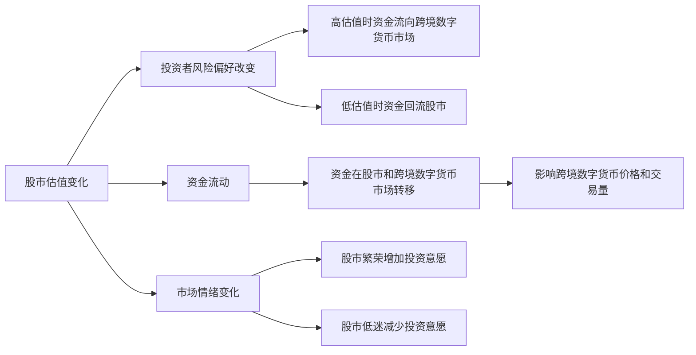

# 股市估值对跨境数字货币交易的影响

> 关键词：股市估值、跨境数字货币交易、金融市场、风险偏好、价格联动

> 摘要：本文旨在深入探讨股市估值对跨境数字货币交易的影响。通过对股市估值和跨境数字货币交易核心概念的阐述，分析两者之间的内在联系。运用相关算法原理、数学模型来解释影响机制，并结合实际案例进行验证。研究发现股市估值的变化会通过投资者风险偏好、资金流动等因素对跨境数字货币交易的价格、交易量等产生重要影响。了解这种影响有助于投资者更好地把握市场动态，合理配置资产，同时也为金融监管部门制定政策提供参考依据。

## 1. 背景介绍 
### 1.1 目的和范围
随着全球金融市场的不断发展和创新，股市和数字货币市场逐渐成为投资者关注的焦点。股市作为传统金融市场的重要组成部分，其估值水平反映了市场对上市公司未来盈利的预期和投资者的情绪。而跨境数字货币交易则是近年来新兴的金融领域，具有去中心化、匿名性和全球性等特点。本研究的目的在于深入探究股市估值与跨境数字货币交易之间的关系，明确股市估值的变化如何影响跨境数字货币交易的各个方面，如价格波动、交易量变化等。研究范围涵盖了全球主要股票市场的估值情况以及主要跨境数字货币的交易数据。

### 1.2 预期读者
本文预期读者包括金融投资者、金融分析师、金融监管部门工作人员、数字货币研究者以及对金融市场和数字货币感兴趣的人士。对于投资者而言，了解股市估值对跨境数字货币交易的影响有助于优化投资组合，降低风险，提高收益；金融分析师可以通过本文的研究方法和结论，对市场趋势进行更准确的预测；金融监管部门能够依据研究结果制定更有效的监管政策，维护金融市场的稳定；数字货币研究者可以在此基础上进一步拓展研究领域；而对金融市场和数字货币感兴趣的人士则可以通过本文初步了解两者之间的内在联系。

### 1.3 文档结构概述
本文首先介绍了研究的背景、目的、预期读者和文档结构，以及相关术语的定义和解释。接着阐述了股市估值和跨境数字货币交易的核心概念及其之间的联系，并通过示意图和流程图进行直观展示。然后详细讲解了核心算法原理和具体操作步骤，同时运用数学模型和公式对影响机制进行深入分析，并举例说明。之后通过项目实战，展示代码实际案例并进行详细解释。再探讨了股市估值对跨境数字货币交易影响的实际应用场景。随后推荐了相关的学习资源、开发工具框架和论文著作。最后总结了未来发展趋势与挑战，提供常见问题与解答，并列出扩展阅读和参考资料。

### 1.4 术语表
#### 1.4.1 核心术语定义
- **股市估值**：是指对股票市场中上市公司的价值进行评估的过程和结果。常用的估值方法包括市盈率（P/E）、市净率（P/B）、现金流折现法（DCF）等，通过这些方法可以判断股票市场整体或个别股票是被高估还是低估。
- **跨境数字货币交易**：指跨越不同国家或地区进行的数字货币买卖活动。数字货币是一种基于密码学技术的虚拟货币，如比特币、以太坊等，跨境数字货币交易打破了传统金融交易的地域限制，具有快速、便捷等特点。

#### 1.4.2 相关概念解释
- **风险偏好**：投资者在进行投资决策时对风险的承受意愿和能力。风险偏好高的投资者更倾向于投资高风险、高回报的资产，如数字货币；而风险偏好低的投资者则更倾向于投资低风险、稳定回报的资产，如债券。
- **资金流动**：资金在不同金融市场和资产之间的转移。当股市估值发生变化时，投资者会根据市场情况调整投资组合，导致资金在股市和数字货币市场之间流动。

#### 1.4.3 缩略词列表
- **P/E**：市盈率（Price-to-Earnings Ratio），是指股票价格除以每股收益的比率，用于衡量股票的相对估值水平。
- **P/B**：市净率（Price-to-Book Ratio），是指股票价格除以每股净资产的比率，反映了市场对公司净资产的估值。
- **DCF**：现金流折现法（Discounted Cash Flow），是一种通过预测公司未来现金流并将其折现到当前价值的估值方法。

## 2. 核心概念与联系 

### 股市估值的核心概念
股市估值是对股票市场中上市公司价值的评估，其目的是为投资者提供决策依据，判断股票是否具有投资价值。常见的估值方法有以下几种：
- **市盈率法（P/E）**：市盈率是股票价格与每股收益的比值。计算公式为：$P/E=\frac{股价}{每股收益}$。市盈率越高，表明市场对该股票的预期越高，但也可能意味着股票被高估；反之，市盈率越低，可能表示股票被低估。
- **市净率法（P/B）**：市净率是股票价格与每股净资产的比值。计算公式为：$P/B=\frac{股价}{每股净资产}$。市净率反映了市场对公司净资产的估值，一般来说，市净率较低的股票具有较高的安全边际。
- **现金流折现法（DCF）**：该方法通过预测公司未来的现金流，并将其折现到当前价值。计算公式为：$V=\sum_{t=1}^{n}\frac{CF_t}{(1+r)^t}$，其中$V$为公司的价值，$CF_t$为第$t$期的现金流，$r$为折现率，$n$为预测期数。

### 跨境数字货币交易的核心概念
跨境数字货币交易是指在不同国家或地区之间进行的数字货币买卖活动。数字货币是一种基于密码学技术的虚拟货币，具有去中心化、匿名性、全球性等特点。常见的数字货币有比特币、以太坊等。跨境数字货币交易的流程一般包括以下几个步骤：
1. **开户**：投资者在数字货币交易平台上注册账号，并完成身份验证。
2. **充值**：将法定货币或其他数字货币充值到交易平台的账户中。
3. **交易**：在交易平台上选择要交易的数字货币，输入交易数量和价格，完成买卖操作。
4. **提现**：将交易所得的数字货币或法定货币提现到自己的钱包或银行账户中。

### 两者之间的联系
股市估值与跨境数字货币交易之间存在着密切的联系，主要体现在以下几个方面：
- **投资者风险偏好**：当股市估值较高时，市场风险增加，投资者的风险偏好可能会发生变化。一些投资者可能会选择将资金从股市转移到风险相对较高的跨境数字货币市场，以寻求更高的回报；反之，当股市估值较低时，投资者可能会更倾向于投资股市，减少对跨境数字货币的投资。
- **资金流动**：股市估值的变化会导致资金在不同金融市场之间流动。当股市估值上升时，资金可能会从数字货币市场流向股市；当股市估值下降时，资金可能会从股市流向数字货币市场。这种资金流动会影响跨境数字货币的价格和交易量。
- **市场情绪**：股市的表现会影响投资者的市场情绪。当股市繁荣时，投资者的信心增强，可能会更愿意投资跨境数字货币；当股市低迷时，投资者的信心受挫，可能会减少对跨境数字货币的投资。

### 文本示意图
```plaintext
股市估值变化
    |
    |-- 影响投资者风险偏好
    |       |
    |       |-- 高估值时部分资金流向跨境数字货币市场
    |       |-- 低估值时资金回流股市
    |
    |-- 引发资金流动
    |       |
    |       |-- 资金在股市和跨境数字货币市场间转移
    |       |-- 影响跨境数字货币价格和交易量
    |
    |-- 改变市场情绪
            |
            |-- 股市繁荣增加对跨境数字货币投资意愿
            |-- 股市低迷减少对跨境数字货币投资意愿
```

### Mermaid 流程图


## 3. 核心算法原理 & 具体操作步骤 

### 核心算法原理
为了研究股市估值对跨境数字货币交易的影响，我们可以采用时间序列分析方法。时间序列分析是一种基于历史数据预测未来趋势的统计方法，常用的模型有自回归积分滑动平均模型（ARIMA）、广义自回归条件异方差模型（GARCH）等。

#### ARIMA 模型原理
ARIMA 模型是一种常用的时间序列预测模型，它结合了自回归（AR）、差分（I）和滑动平均（MA）三个部分。其一般形式为 ARIMA(p, d, q)，其中 p 表示自回归阶数，d 表示差分阶数，q 表示滑动平均阶数。ARIMA 模型的基本公式为：
$$\phi(B)(1 - B)^dY_t = \theta(B)\epsilon_t$$
其中，$\phi(B)$ 是自回归多项式，$\theta(B)$ 是滑动平均多项式，$Y_t$ 是时间序列数据，$\epsilon_t$ 是白噪声序列，$B$ 是滞后算子。

#### GARCH 模型原理
GARCH 模型是一种用于描述时间序列数据波动率的模型，它可以捕捉到时间序列数据的波动聚集性和异方差性。GARCH(p, q) 模型的基本公式为：
$$\sigma_t^2 = \omega + \sum_{i = 1}^{p}\alpha_i\epsilon_{t - i}^2 + \sum_{j = 1}^{q}\beta_j\sigma_{t - j}^2$$
其中，$\sigma_t^2$ 是条件方差，$\omega$ 是常数项，$\alpha_i$ 和 $\beta_j$ 是系数，$\epsilon_{t - i}^2$ 是滞后的残差平方，$\sigma_{t - j}^2$ 是滞后的条件方差。

### 具体操作步骤
#### 数据收集
收集全球主要股票市场的估值数据（如市盈率、市净率等）和主要跨境数字货币的交易数据（如价格、交易量等），数据的时间跨度可以根据研究需要确定，一般建议收集较长时间的数据以提高模型的准确性。

#### 数据预处理
对收集到的数据进行清洗和预处理，包括去除缺失值、异常值等。同时，对数据进行差分处理，使其达到平稳性要求。

#### 模型选择和参数估计
根据数据的特点和研究目的，选择合适的时间序列模型（如 ARIMA、GARCH 等）。使用最大似然估计等方法对模型的参数进行估计。

#### 模型检验
对估计好的模型进行检验，包括残差的独立性检验、异方差性检验等。如果模型不符合检验要求，则需要重新选择模型或调整参数。

#### 模型预测和分析
使用估计好的模型对未来的股市估值和跨境数字货币交易数据进行预测，并分析股市估值变化对跨境数字货币交易的影响。

### Python 源代码实现
```python
import pandas as pd
import numpy as np
from statsmodels.tsa.arima.model import ARIMA
from arch import arch_model
import matplotlib.pyplot as plt

# 数据收集和预处理
# 假设已经收集到了股市估值数据和跨境数字货币交易数据
# 这里使用示例数据进行演示
np.random.seed(0)
stock_valuation = pd.Series(np.random.randn(1000).cumsum(), index=pd.date_range('2020-01-01', periods=1000))
crypto_trading = pd.Series(np.random.randn(1000).cumsum(), index=pd.date_range('2020-01-01', periods=1000))

# 数据差分处理，使其达到平稳性要求
stock_valuation_diff = stock_valuation.diff().dropna()
crypto_trading_diff = crypto_trading.diff().dropna()

# ARIMA 模型拟合
arima_model_stock = ARIMA(stock_valuation_diff, order=(1, 0, 1))
arima_result_stock = arima_model_stock.fit()

arima_model_crypto = ARIMA(crypto_trading_diff, order=(1, 0, 1))
arima_result_crypto = arima_model_crypto.fit()

# GARCH 模型拟合
garch_model_stock = arch_model(stock_valuation_diff, p=1, q=1)
garch_result_stock = garch_model_stock.fit()

garch_model_crypto = arch_model(crypto_trading_diff, p=1, q=1)
garch_result_crypto = garch_model_crypto.fit()

# 模型预测
stock_valuation_forecast = arima_result_stock.get_forecast(steps=10)
crypto_trading_forecast = arima_result_crypto.get_forecast(steps=10)

# 可视化结果
plt.figure(figsize=(12, 6))
plt.subplot(2, 1, 1)
plt.plot(stock_valuation_diff, label='Stock Valuation Diff')
plt.plot(stock_valuation_forecast.predicted_mean, label='Stock Valuation Forecast')
plt.title('Stock Valuation Forecast')
plt.legend()

plt.subplot(2, 1, 2)
plt.plot(crypto_trading_diff, label='Crypto Trading Diff')
plt.plot(crypto_trading_forecast.predicted_mean, label='Crypto Trading Forecast')
plt.title('Crypto Trading Forecast')
plt.legend()

plt.show()
```

## 4. 数学模型和公式 & 详细讲解 & 举例说明 

### ARIMA 模型详细讲解
ARIMA 模型是一种用于时间序列分析的经典模型，它可以捕捉到时间序列数据的自相关性和趋势性。ARIMA(p, d, q) 模型的基本公式为：
$$\phi(B)(1 - B)^dY_t = \theta(B)\epsilon_t$$
其中，$\phi(B) = 1 - \phi_1B - \phi_2B^2 - \cdots - \phi_pB^p$ 是自回归多项式，$\theta(B) = 1 + \theta_1B + \theta_2B^2 + \cdots + \theta_qB^q$ 是滑动平均多项式，$Y_t$ 是时间序列数据，$\epsilon_t$ 是白噪声序列，$B$ 是滞后算子，满足 $BY_t = Y_{t - 1}$。

#### 自回归部分（AR）
自回归部分表示当前时刻的观测值与过去若干时刻的观测值之间的线性关系。例如，AR(1) 模型的形式为：
$$Y_t = \phi_1Y_{t - 1} + \epsilon_t$$
其中，$\phi_1$ 是自回归系数，表示 $Y_{t - 1}$ 对 $Y_t$ 的影响程度。

#### 差分部分（I）
差分部分用于消除时间序列数据的趋势性，使其达到平稳性要求。例如，一阶差分的公式为：
$$\Delta Y_t = Y_t - Y_{t - 1}$$
通过差分处理，可以将非平稳的时间序列转换为平稳的时间序列。

#### 滑动平均部分（MA）
滑动平均部分表示当前时刻的观测值与过去若干时刻的白噪声之间的线性关系。例如，MA(1) 模型的形式为：
$$Y_t = \epsilon_t + \theta_1\epsilon_{t - 1}$$
其中，$\theta_1$ 是滑动平均系数，表示 $\epsilon_{t - 1}$ 对 $Y_t$ 的影响程度。

### GARCH 模型详细讲解
GARCH 模型是一种用于描述时间序列数据波动率的模型，它可以捕捉到时间序列数据的波动聚集性和异方差性。GARCH(p, q) 模型的基本公式为：
$$\sigma_t^2 = \omega + \sum_{i = 1}^{p}\alpha_i\epsilon_{t - i}^2 + \sum_{j = 1}^{q}\beta_j\sigma_{t - j}^2$$
其中，$\sigma_t^2$ 是条件方差，$\omega$ 是常数项，$\alpha_i$ 和 $\beta_j$ 是系数，$\epsilon_{t - i}^2$ 是滞后的残差平方，$\sigma_{t - j}^2$ 是滞后的条件方差。

#### 条件方差的计算
条件方差 $\sigma_t^2$ 表示在时刻 $t$ 时，时间序列数据的波动率。它是由常数项 $\omega$、过去的残差平方 $\epsilon_{t - i}^2$ 和过去的条件方差 $\sigma_{t - j}^2$ 共同决定的。

#### 波动聚集性和异方差性
GARCH 模型可以捕捉到时间序列数据的波动聚集性和异方差性。波动聚集性是指时间序列数据的波动率在一段时间内呈现出聚集的现象，即大的波动后面往往跟着大的波动，小的波动后面往往跟着小的波动。异方差性是指时间序列数据的波动率不是恒定的，而是随时间变化的。

### 举例说明
假设我们有一组股市估值数据和跨境数字货币交易数据，我们可以使用 ARIMA 模型和 GARCH 模型来分析两者之间的关系。

#### 数据准备
```python
import pandas as pd
import numpy as np

# 生成示例数据
np.random.seed(0)
stock_valuation = pd.Series(np.random.randn(1000).cumsum(), index=pd.date_range('2020-01-01', periods=1000))
crypto_trading = pd.Series(np.random.randn(1000).cumsum(), index=pd.date_range('2020-01-01', periods=1000))
```

#### ARIMA 模型拟合
```python
from statsmodels.tsa.arima.model import ARIMA

# 差分处理
stock_valuation_diff = stock_valuation.diff().dropna()
crypto_trading_diff = crypto_trading.diff().dropna()

# 拟合 ARIMA 模型
arima_model_stock = ARIMA(stock_valuation_diff, order=(1, 0, 1))
arima_result_stock = arima_model_stock.fit()

arima_model_crypto = ARIMA(crypto_trading_diff, order=(1, 0, 1))
arima_result_crypto = arima_model_crypto.fit()

# 打印模型参数
print("Stock Valuation ARIMA Model Parameters:", arima_result_stock.params)
print("Crypto Trading ARIMA Model Parameters:", arima_result_crypto.params)
```

#### GARCH 模型拟合
```python
from arch import arch_model

# 拟合 GARCH 模型
garch_model_stock = arch_model(stock_valuation_diff, p=1, q=1)
garch_result_stock = garch_model_stock.fit()

garch_model_crypto = arch_model(crypto_trading_diff, p=1, q=1)
garch_result_crypto = garch_model_crypto.fit()

# 打印模型参数
print("Stock Valuation GARCH Model Parameters:", garch_result_stock.params)
print("Crypto Trading GARCH Model Parameters:", garch_result_crypto.params)
```

通过以上示例，我们可以看到如何使用 ARIMA 模型和 GARCH 模型来分析股市估值数据和跨境数字货币交易数据。通过模型的参数估计，我们可以了解两者之间的关系和波动特征。

## 5. 项目实战：代码实际案例和详细解释说明 

### 5.1  开发环境搭建
#### 安装 Python
首先，需要安装 Python 环境。可以从 Python 官方网站（https://www.python.org/downloads/） 下载适合自己操作系统的 Python 安装包，并按照安装向导进行安装。建议安装 Python 3.7 及以上版本。

#### 安装必要的库
在安装好 Python 后，需要安装一些必要的库，如 pandas、numpy、statsmodels、arch、matplotlib 等。可以使用以下命令进行安装：
```sh
pip install pandas numpy statsmodels arch matplotlib
```

### 5.2  源代码详细实现和代码解读
```python
import pandas as pd
import numpy as np
from statsmodels.tsa.arima.model import ARIMA
from arch import arch_model
import matplotlib.pyplot as plt

# 数据收集和预处理
# 这里使用示例数据进行演示，实际应用中需要收集真实数据
np.random.seed(0)
stock_valuation = pd.Series(np.random.randn(1000).cumsum(), index=pd.date_range('2020-01-01', periods=1000))
crypto_trading = pd.Series(np.random.randn(1000).cumsum(), index=pd.date_range('2020-01-01', periods=1000))

# 数据差分处理，使其达到平稳性要求
stock_valuation_diff = stock_valuation.diff().dropna()
crypto_trading_diff = crypto_trading.diff().dropna()

# ARIMA 模型拟合
arima_model_stock = ARIMA(stock_valuation_diff, order=(1, 0, 1))
arima_result_stock = arima_model_stock.fit()

arima_model_crypto = ARIMA(crypto_trading_diff, order=(1, 0, 1))
arima_result_crypto = arima_model_crypto.fit()

# GARCH 模型拟合
garch_model_stock = arch_model(stock_valuation_diff, p=1, q=1)
garch_result_stock = garch_model_stock.fit()

garch_model_crypto = arch_model(crypto_trading_diff, p=1, q=1)
garch_result_crypto = garch_model_crypto.fit()

# 模型预测
stock_valuation_forecast = arima_result_stock.get_forecast(steps=10)
crypto_trading_forecast = arima_result_crypto.get_forecast(steps=10)

# 可视化结果
plt.figure(figsize=(12, 6))
plt.subplot(2, 1, 1)
plt.plot(stock_valuation_diff, label='Stock Valuation Diff')
plt.plot(stock_valuation_forecast.predicted_mean, label='Stock Valuation Forecast')
plt.title('Stock Valuation Forecast')
plt.legend()

plt.subplot(2, 1, 2)
plt.plot(crypto_trading_diff, label='Crypto Trading Diff')
plt.plot(crypto_trading_forecast.predicted_mean, label='Crypto Trading Forecast')
plt.title('Crypto Trading Forecast')
plt.legend()

plt.show()
```

#### 代码解读
1. **数据收集和预处理**：使用 `np.random.randn()` 函数生成示例数据，模拟股市估值数据和跨境数字货币交易数据。然后使用 `diff()` 函数对数据进行差分处理，去除数据的趋势性，使其达到平稳性要求。
2. **ARIMA 模型拟合**：使用 `ARIMA()` 函数创建 ARIMA 模型，并使用 `fit()` 函数进行拟合。`order=(1, 0, 1)` 表示 ARIMA 模型的自回归阶数为 1，差分阶数为 0，滑动平均阶数为 1。
3. **GARCH 模型拟合**：使用 `arch_model()` 函数创建 GARCH 模型，并使用 `fit()` 函数进行拟合。`p=1` 和 `q=1` 表示 GARCH 模型的自回归阶数和滑动平均阶数均为 1。
4. **模型预测**：使用 `get_forecast()` 函数对未来 10 个时间步的数据进行预测。
5. **可视化结果**：使用 `matplotlib` 库将原始数据和预测数据进行可视化，方便观察模型的预测效果。

### 5.3  代码解读与分析
#### 模型选择和参数设置
在代码中，我们选择了 ARIMA(1, 0, 1) 和 GARCH(1, 1) 模型进行分析。ARIMA 模型的自回归阶数、差分阶数和滑动平均阶数的选择需要根据数据的特点和实际情况进行调整。GARCH 模型的自回归阶数和滑动平均阶数也需要根据数据的波动特征进行选择。

#### 数据平稳性处理
在进行时间序列分析之前，需要确保数据是平稳的。通过差分处理，可以去除数据的趋势性，使其达到平稳性要求。差分阶数的选择也需要根据数据的特点进行调整。

#### 模型预测和结果分析
通过模型预测，我们可以得到未来一段时间内股市估值和跨境数字货币交易数据的预测值。通过比较预测值和实际值，可以评估模型的预测效果。如果模型的预测效果不理想，可能需要重新选择模型或调整参数。

## 6. 实际应用场景 
### 投资者决策
对于投资者而言，了解股市估值对跨境数字货币交易的影响可以帮助他们更好地进行投资决策。当股市估值较高时，投资者可以适当增加对跨境数字货币的投资，以分散风险，获取更高的回报；当股市估值较低时，投资者可以减少对跨境数字货币的投资，增加对股市的投资。

### 金融机构风险管理
金融机构可以利用股市估值和跨境数字货币交易之间的关系，进行风险管理。例如，银行可以根据股市估值的变化，调整对跨境数字货币相关业务的风险敞口；保险公司可以开发与股市估值和跨境数字货币交易相关的保险产品，为投资者提供风险保障。

### 金融监管部门政策制定
金融监管部门可以根据股市估值对跨境数字货币交易的影响，制定相应的监管政策。例如，当股市估值过高，资金大量流向跨境数字货币市场时，监管部门可以加强对跨境数字货币交易的监管，防范金融风险；当股市估值过低，资金从跨境数字货币市场回流股市时，监管部门可以采取措施稳定股市，促进金融市场的健康发展。

### 企业战略规划
企业在进行战略规划时，也可以考虑股市估值和跨境数字货币交易的影响。例如，科技企业可以关注跨境数字货币市场的发展趋势，探索将数字货币技术应用于自身业务的可能性；金融企业可以根据股市估值的变化，调整自身的业务布局和投资策略。

## 7. 工具和资源推荐
### 7.1 学习资源推荐
#### 7.1.1 书籍推荐
- 《金融时间序列分析》（Analysis of Financial Time Series）：作者 Ruey S. Tsay，本书系统地介绍了金融时间序列分析的理论和方法，包括 ARIMA 模型、GARCH 模型等，是学习金融时间序列分析的经典教材。
- 《数字货币与区块链技术》：本书详细介绍了数字货币的基本概念、技术原理和应用场景，以及区块链技术的发展现状和未来趋势，对于了解跨境数字货币交易具有重要的参考价值。
- 《投资学》（Investments）：作者滋维·博迪（Zvi Bodie）等，本书是投资学领域的经典教材，涵盖了股票、债券、期货、期权等多种投资工具，以及投资组合理论、资本资产定价模型等投资理论，对于投资者了解金融市场和投资决策具有重要的指导意义。

#### 7.1.2 在线课程
- Coursera 平台上的“Financial Markets”课程：由耶鲁大学教授罗伯特·席勒（Robert Shiller）主讲，课程介绍了金融市场的基本概念、运行机制和投资策略，对于了解金融市场和投资决策具有重要的帮助。
- edX 平台上的“Blockchain and Cryptocurrency Technologies”课程：由麻省理工学院（MIT）教授讲授，课程介绍了区块链和数字货币的技术原理、应用场景和发展趋势，对于了解跨境数字货币交易具有重要的参考价值。
- 中国大学 MOOC 平台上的“金融时间序列分析”课程：由国内高校教授主讲，课程系统地介绍了金融时间序列分析的理论和方法，包括 ARIMA 模型、GARCH 模型等，对于学习金融时间序列分析具有重要的帮助。

#### 7.1.3 技术博客和网站
- Medium 上的金融和数字货币相关博客：Medium 上有很多金融和数字货币领域的专家和爱好者分享他们的观点和经验，通过阅读这些博客，可以了解到最新的市场动态和技术发展趋势。
- CoinDesk：是全球领先的数字货币新闻和信息平台，提供数字货币市场的最新消息、价格行情、技术分析等内容，对于了解跨境数字货币交易具有重要的参考价值。
- 雪球网：是国内知名的财经社区，提供股票、基金、债券等多种金融产品的行情信息、分析评论和投资策略，对于了解股市估值和金融市场具有重要的帮助。

### 7.2 开发工具框架推荐
#### 7.2.1 IDE和编辑器
- PyCharm：是一款专业的 Python 集成开发环境（IDE），具有代码编辑、调试、版本控制等功能，适合开发 Python 程序。
- Jupyter Notebook：是一种交互式的开发环境，支持 Python、R 等多种编程语言，适合进行数据分析和模型开发。
- Visual Studio Code：是一款轻量级的代码编辑器，支持多种编程语言和插件扩展，适合快速开发和调试程序。

#### 7.2.2 调试和性能分析工具
- PDB：是 Python 自带的调试工具，可以帮助开发者定位和解决程序中的错误。
- cProfile：是 Python 自带的性能分析工具，可以帮助开发者分析程序的性能瓶颈，优化程序的运行效率。
- Py-Spy：是一款用于分析 Python 程序性能的工具，可以实时监测程序的运行状态，找出性能瓶颈。

#### 7.2.3 相关框架和库
- Pandas：是一个用于数据处理和分析的 Python 库，提供了丰富的数据结构和数据操作方法，适合处理金融数据。
- Numpy：是一个用于科学计算的 Python 库，提供了高效的数组操作和数学函数，适合进行数值计算和模型开发。
- Statsmodels：是一个用于统计建模和数据分析的 Python 库，提供了多种统计模型和方法，包括 ARIMA 模型、GARCH 模型等。
- Arch：是一个用于金融时间序列分析的 Python 库，提供了 GARCH 模型等多种金融模型的实现。

### 7.3 相关论文著作推荐
#### 7.3.1 经典论文
- Fama, E. F. (1970). Efficient capital markets: A review of theory and empirical work. The Journal of Finance, 25(2), 383-417. 该论文提出了有效市场假说，对金融市场的研究产生了深远的影响。
- Engle, R. F. (1982). Autoregressive conditional heteroscedasticity with estimates of the variance of United Kingdom inflation. Econometrica: Journal of the Econometric Society, 987-1007. 该论文提出了自回归条件异方差（ARCH）模型，为金融时间序列分析中的波动率建模奠定了基础。
- Bollerslev, T. (1986). Generalized autoregressive conditional heteroskedasticity. Journal of econometrics, 31(3), 307-327. 该论文提出了广义自回归条件异方差（GARCH）模型，扩展了 ARCH 模型的应用范围。

#### 7.3.2 最新研究成果
- 关注顶级金融学术期刊，如 The Journal of Finance、The Review of Financial Studies、Journal of Financial Economics 等，这些期刊上发表了很多关于金融市场和数字货币的最新研究成果。
- 参加金融学术会议，如 American Finance Association (AFA) Annual Meeting、Western Finance Association (WFA) Annual Meeting 等，这些会议上会展示很多前沿的研究成果和学术观点。

#### 7.3.3 应用案例分析
- 一些知名金融机构和研究机构会发布关于股市估值和跨境数字货币交易的应用案例分析报告，如国际货币基金组织（IMF）、世界银行（World Bank）等。通过阅读这些报告，可以了解到实际应用中的经验和教训。
- 一些专业的金融咨询公司和智库也会发布相关的研究报告和案例分析，如麦肯锡（McKinsey & Company）、波士顿咨询集团（Boston Consulting Group）等。

## 8. 总结：未来发展趋势与挑战
### 未来发展趋势
#### 市场融合加深
随着全球金融市场的不断发展和创新，股市和跨境数字货币市场的融合将不断加深。投资者将更加注重资产的多元化配置，股市估值的变化对跨境数字货币交易的影响将更加明显。同时，金融机构也将开发更多的跨市场金融产品和服务，满足投资者的需求。

#### 技术创新推动
区块链、人工智能、大数据等技术的不断创新将推动跨境数字货币交易的发展。这些技术的应用将提高跨境数字货币交易的效率、安全性和透明度，降低交易成本。同时，也将为股市估值和跨境数字货币交易的研究提供更多的数据和分析工具。

#### 监管政策完善
随着跨境数字货币市场的不断发展，各国政府和金融监管部门将加强对跨境数字货币交易的监管。监管政策的完善将有助于防范金融风险，保护投资者的合法权益，促进跨境数字货币市场的健康发展。同时，也将为股市估值和跨境数字货币交易的研究提供更加规范的市场环境。

### 挑战
#### 市场不确定性增加
股市和跨境数字货币市场都具有较高的不确定性，市场价格波动较大。股市估值的变化受到宏观经济环境、政策法规、公司业绩等多种因素的影响，跨境数字货币交易则受到技术创新、市场需求、监管政策等因素的影响。这些不确定性增加了投资者的决策难度和风险。

#### 监管难度加大
跨境数字货币交易具有去中心化、匿名性和全球性等特点，给金融监管带来了很大的挑战。监管部门难以对跨境数字货币交易进行有效的监管，容易导致金融风险的积累和扩散。同时，不同国家和地区的监管政策存在差异，也增加了跨境监管的难度。

#### 技术安全问题
跨境数字货币交易依赖于区块链等技术，技术安全问题是其发展的重要挑战。区块链技术的安全性受到黑客攻击、共识机制漏洞等因素的影响，一旦发生技术安全事件，将导致投资者的资产损失和市场信心的下降。

## 9. 附录：常见问题与解答
### 1. 股市估值和跨境数字货币交易之间的关系是固定不变的吗？
不是。股市估值和跨境数字货币交易之间的关系受到多种因素的影响，如宏观经济环境、政策法规、市场情绪等。这些因素的变化会导致两者之间的关系发生变化，因此这种关系不是固定不变的。

### 2. 如何选择合适的时间序列模型来分析股市估值和跨境数字货币交易的关系？
选择合适的时间序列模型需要考虑数据的特点和研究目的。一般来说，可以先对数据进行平稳性检验，如果数据不平稳，则需要进行差分处理使其达到平稳性要求。然后可以根据数据的自相关性和偏自相关性分析，选择合适的自回归阶数、差分阶数和滑动平均阶数。常用的时间序列模型有 ARIMA 模型、GARCH 模型等，可以根据具体情况选择合适的模型。

### 3. 跨境数字货币交易存在哪些风险？
跨境数字货币交易存在多种风险，如市场风险、技术风险、监管风险等。市场风险是指由于市场价格波动导致的资产损失风险；技术风险是指由于区块链等技术的安全性问题导致的资产损失风险；监管风险是指由于监管政策的变化导致的交易受限或资产损失风险。

### 4. 如何降低跨境数字货币交易的风险？
降低跨境数字货币交易风险的方法包括：合理配置资产，避免过度投资；选择正规、安全的交易平台；关注市场动态和监管政策变化；加强技术安全防范，如设置强密码、使用多重身份验证等。

### 5. 股市估值对跨境数字货币交易的影响在不同国家和地区是否相同？
不同国家和地区的经济发展水平、政策法规、市场环境等存在差异，因此股市估值对跨境数字货币交易的影响也可能不同。例如，在一些金融市场较为发达的国家和地区，股市估值和跨境数字货币交易之间的联系可能更加紧密；而在一些金融市场相对落后的国家和地区，这种联系可能相对较弱。

## 10. 扩展阅读 & 参考资料
### 扩展阅读
- 《金融市场与金融机构基础》（Fundamentals of Financial Markets and Institutions）：作者弗兰克·J·法博齐（Frank J. Fabozzi）等，本书系统地介绍了金融市场和金融机构的基本概念、运行机制和业务操作，对于了解金融市场和投资决策具有重要的帮助。
- 《区块链：技术驱动金融》（Blockchain: The Technology Driving the Next Internet Revolution）：作者阿尔文德·纳拉亚南（Arvind Narayanan）等，本书详细介绍了区块链技术的基本原理、应用场景和发展趋势，对于了解跨境数字货币交易的技术基础具有重要的参考价值。
- 《货币金融学》（Money, Banking, and Financial Markets）：作者斯蒂芬·G·切凯蒂（Stephen G. Cecchetti）等，本书系统地介绍了货币、银行和金融市场的基本概念、运行机制和政策调控，对于了解金融市场的宏观背景和政策环境具有重要的帮助。

### 参考资料
- 国际货币基金组织（IMF）官方网站：https://www.imf.org/
- 世界银行（World Bank）官方网站：https://www.worldbank.org/
- 美国证券交易委员会（SEC）官方网站：https://www.sec.gov/
- 中国人民银行官方网站：https://www.pbc.gov.cn/
- 中国证券监督管理委员会（CSRC）官方网站：https://www.csrc.gov.cn/