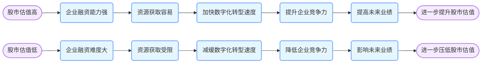

# 股市估值高低对企业数字化转型速度的影响

> 关键词：股市估值、企业数字化转型、转型速度、市场预期、资源配置

> 摘要：本文旨在深入探讨股市估值高低对企业数字化转型速度的影响。通过对相关理论和实际案例的研究，分析股市估值在企业数字化转型过程中所扮演的角色。首先介绍研究的背景、目的和范围，明确预期读者和文档结构。接着阐述核心概念及联系，包括股市估值和企业数字化转型的原理与架构。详细讲解核心算法原理和具体操作步骤，并运用数学模型和公式进行深入分析。通过项目实战案例展示股市估值与企业数字化转型速度之间的关系，探讨其实际应用场景。最后推荐相关工具和资源，总结未来发展趋势与挑战，解答常见问题并提供扩展阅读和参考资料，为理解和应对这一复杂关系提供全面的视角。

## 1. 背景介绍 
### 1.1 目的和范围
本研究的主要目的是全面剖析股市估值高低与企业数字化转型速度之间的内在联系。随着数字经济的迅猛发展，企业数字化转型已成为提升竞争力、实现可持续发展的关键战略。而股市作为企业融资和价值评估的重要场所，其对企业数字化转型的影响不容忽视。本研究将涵盖不同行业、不同规模的企业，通过理论分析、实证研究和案例探讨，深入挖掘股市估值对企业数字化转型速度的具体影响机制和效应。

### 1.2 预期读者
本文预期读者包括企业管理者、投资者、金融分析师、学术研究人员以及对企业数字化转型和股市动态感兴趣的相关人士。企业管理者可以从中了解股市估值对企业数字化转型决策和实施的影响，以便更好地制定战略规划；投资者能够通过理解这一关系，优化投资决策；金融分析师可将其作为分析企业价值和发展潜力的重要参考；学术研究人员则能在相关领域的理论和实证研究中获得新的思路和启示。

### 1.3 文档结构概述
本文将按照以下结构展开：首先介绍研究的背景信息，包括目的、范围、预期读者和文档结构概述，并对相关术语进行定义和解释。接着阐述股市估值和企业数字化转型的核心概念及联系，通过文本示意图和 Mermaid 流程图进行直观展示。然后详细讲解核心算法原理和具体操作步骤，运用 Python 源代码进行说明。随后引入数学模型和公式，结合实际例子进行深入分析。通过项目实战案例，介绍开发环境搭建、源代码实现和代码解读。探讨股市估值高低对企业数字化转型速度影响的实际应用场景。推荐相关的学习资源、开发工具框架和论文著作。总结未来发展趋势与挑战，解答常见问题并提供扩展阅读和参考资料。

### 1.4 术语表
#### 1.4.1 核心术语定义
- **股市估值**：指对企业在股票市场中的价值进行评估的过程和结果。通常通过各种估值方法，如市盈率（P/E）、市净率（P/B）、现金流折现法（DCF）等，来确定企业股票的合理价格范围，反映市场对企业未来盈利能力和发展前景的预期。
- **企业数字化转型**：企业利用数字技术对业务流程、商业模式、组织架构等进行全面变革和创新的过程。旨在提高企业的运营效率、降低成本、增强客户体验、开拓新市场，以适应数字经济时代的发展需求。
- **转型速度**：衡量企业数字化转型进程快慢的指标，通常通过对比转型前后的关键业务指标（如收入增长、成本降低、市场份额扩大等）在一定时间内的变化程度来评估。

#### 1.4.2 相关概念解释
- **市场预期**：投资者和市场参与者对企业未来业绩、发展前景和市场表现的预期。市场预期会影响股市估值，当市场对企业的预期乐观时，股市估值往往较高；反之则较低。
- **资源配置**：企业在数字化转型过程中，对人力、物力、财力等资源的分配和使用。股市估值高低会影响企业的融资能力和资源获取渠道，进而影响企业的资源配置决策和数字化转型的速度。

#### 1.4.3 缩略词列表
- **P/E**：市盈率（Price-to-Earnings Ratio）
- **P/B**：市净率（Price-to-Book Ratio）
- **DCF**：现金流折现法（Discounted Cash Flow）

## 2. 核心概念与联系 
### 2.1 股市估值原理
股市估值是一个复杂的过程，涉及多个因素和方法。常见的估值方法包括相对估值法和绝对估值法。相对估值法通过与同行业其他企业的估值指标进行比较，来确定目标企业的价值。例如，市盈率法是将企业的股价除以每股收益，得到市盈率倍数，再与同行业平均市盈率进行对比，判断企业估值的高低。绝对估值法是通过预测企业未来的现金流，并将其折现到当前时点，来计算企业的内在价值。现金流折现法（DCF）是绝对估值法的典型代表，其基本公式为：

$$V = \sum_{t=1}^{n} \frac{CF_t}{(1 + r)^t}$$

其中，$V$ 表示企业的内在价值，$CF_t$ 表示第 $t$ 期的现金流，$r$ 表示折现率，$n$ 表示预测期数。

### 2.2 企业数字化转型原理
企业数字化转型是一个系统性的工程，涉及多个层面的变革。从技术层面来看，企业需要引入和应用先进的数字技术，如大数据、人工智能、云计算、物联网等，来提升企业的信息化水平和数据处理能力。从业务层面来看，企业需要对业务流程进行优化和重构，实现业务的数字化和自动化，提高运营效率和客户满意度。从组织层面来看，企业需要调整组织架构和管理模式，培养和吸引数字化人才，营造创新的企业文化。

### 2.3 核心概念架构的文本示意图
股市估值与企业数字化转型之间存在着密切的联系。股市估值高低反映了市场对企业的预期和信心，而企业数字化转型的速度和效果又会影响企业的未来业绩和市场价值，进而影响股市估值。具体关系如下：

股市估值高 -> 企业融资能力强 -> 资源获取容易 -> 加快数字化转型速度 -> 提升企业竞争力 -> 提高未来业绩 -> 进一步提升股市估值

股市估值低 -> 企业融资难度大 -> 资源获取受限 -> 减缓数字化转型速度 -> 降低企业竞争力 -> 影响未来业绩 -> 进一步压低股市估值

### 2.4 Mermaid 流程图


## 3. 核心算法原理 & 具体操作步骤 
### 3.1 股市估值算法原理
#### 3.1.1 市盈率法
市盈率法是一种简单而常用的股市估值方法。其基本原理是将企业的股价除以每股收益，得到市盈率倍数，再与同行业平均市盈率进行比较，判断企业估值的高低。具体步骤如下：
1. 收集企业的财务报表，获取每股收益（EPS）数据。
2. 确定同行业平均市盈率（P/E_avg）。
3. 计算企业的合理股价（P）：
   $$P = EPS \times P/E_{avg}$$
4. 将计算得到的合理股价与当前股价进行比较，判断企业估值的高低。

#### 3.1.2 现金流折现法
现金流折现法是一种基于企业未来现金流的绝对估值方法。其基本原理是预测企业未来的现金流，并将其折现到当前时点，来计算企业的内在价值。具体步骤如下：
1. 预测企业未来的自由现金流（FCF）。
2. 确定折现率（r），通常采用加权平均资本成本（WACC）。
3. 计算企业的内在价值（V）：
   $$V = \sum_{t=1}^{n} \frac{FCF_t}{(1 + r)^t}$$
4. 将计算得到的内在价值与当前企业市值进行比较，判断企业估值的高低。

### 3.2 Python 源代码实现
```python
# 市盈率法
def pe_valuation(eps, pe_avg):
    """
    市盈率法计算企业合理股价
    :param eps: 每股收益
    :param pe_avg: 同行业平均市盈率
    :return: 合理股价
    """
    return eps * pe_avg

# 现金流折现法
def dcf_valuation(fcf_list, r):
    """
    现金流折现法计算企业内在价值
    :param fcf_list: 未来自由现金流列表
    :param r: 折现率
    :return: 内在价值
    """
    value = 0
    for t, fcf in enumerate(fcf_list, start=1):
        value += fcf / (1 + r) ** t
    return value

# 示例数据
eps = 2.0  # 每股收益
pe_avg = 15  # 同行业平均市盈率
fcf_list = [100, 120, 150, 180, 200]  # 未来自由现金流列表
r = 0.1  # 折现率

# 计算结果
pe_price = pe_valuation(eps, pe_avg)
dcf_value = dcf_valuation(fcf_list, r)

print(f"市盈率法计算的合理股价: {pe_price}")
print(f"现金流折现法计算的内在价值: {dcf_value}")
```

### 3.3 具体操作步骤
1. **数据收集**：收集企业的财务报表、行业数据等相关信息，包括每股收益、自由现金流、同行业平均市盈率、折现率等。
2. **算法选择**：根据企业的特点和数据情况，选择合适的估值方法，如市盈率法或现金流折现法。
3. **参数确定**：确定估值算法中的各项参数，如同行业平均市盈率、折现率等。
4. **计算估值**：使用选定的估值算法和确定的参数，计算企业的估值。
5. **结果分析**：将计算得到的估值与当前企业市值进行比较，判断企业估值的高低，并分析其对企业数字化转型速度的可能影响。

## 4. 数学模型和公式 & 详细讲解 & 举例说明 
### 4.1 股市估值数学模型
#### 4.1.1 市盈率模型
市盈率模型是基于企业的盈利水平来评估企业价值的模型。其基本公式为：

$$P = EPS \times P/E$$

其中，$P$ 表示企业的股价，$EPS$ 表示每股收益，$P/E$ 表示市盈率倍数。

该模型的核心思想是，企业的股价应该与其盈利水平成正比。市盈率倍数反映了市场对企业未来盈利增长的预期。当市场对企业的预期乐观时，市盈率倍数会较高；反之则较低。

#### 4.1.2 现金流折现模型
现金流折现模型是基于企业未来现金流来评估企业价值的模型。其基本公式为：

$$V = \sum_{t=1}^{n} \frac{FCF_t}{(1 + r)^t}$$

其中，$V$ 表示企业的内在价值，$FCF_t$ 表示第 $t$ 期的自由现金流，$r$ 表示折现率，$n$ 表示预测期数。

该模型的核心思想是，企业的价值等于其未来现金流的现值之和。折现率反映了投资者对投资风险的要求，风险越高，折现率越高。

### 4.2 企业数字化转型速度数学模型
企业数字化转型速度可以通过多种指标来衡量，如收入增长率、成本降低率、市场份额增长率等。为了简化模型，我们假设企业数字化转型速度（$S$）与企业投入的数字化转型资源（$R$）成正比，与转型难度（$D$）成反比。其数学模型可以表示为：

$$S = \frac{kR}{D}$$

其中，$k$ 为比例系数，反映了企业数字化转型资源的利用效率。

### 4.3 股市估值与企业数字化转型速度的关系模型
股市估值高低会影响企业的融资能力和资源获取渠道，进而影响企业投入的数字化转型资源。假设企业的融资能力（$F$）与股市估值（$V_{stock}$）成正比，企业投入的数字化转型资源（$R$）与融资能力（$F$）成正比。则股市估值与企业数字化转型速度的关系模型可以表示为：

$$S = \frac{k \times a \times V_{stock}}{D}$$

其中，$a$ 为比例系数，反映了股市估值对企业融资能力和资源获取的影响程度。

### 4.4 举例说明
假设某企业每股收益为 2 元，同行业平均市盈率为 15 倍，则根据市盈率模型计算的企业合理股价为：

$$P = EPS \times P/E = 2 \times 15 = 30 \text{ 元}$$

如果该企业当前股价为 35 元，则说明市场对该企业的预期较为乐观，股市估值较高。

假设该企业未来 5 年的自由现金流分别为 100 万元、120 万元、150 万元、180 万元、200 万元，折现率为 10%，则根据现金流折现模型计算的企业内在价值为：

$$V = \frac{100}{(1 + 0.1)^1} + \frac{120}{(1 + 0.1)^2} + \frac{150}{(1 + 0.1)^3} + \frac{180}{(1 + 0.1)^4} + \frac{200}{(1 + 0.1)^5} \approx 630.26 \text{ 万元}$$

如果该企业当前市值为 700 万元，则说明市场对该企业的预期较为乐观，股市估值较高。

假设该企业数字化转型难度为 5，比例系数 $k = 0.5$，$a = 0.2$，股市估值为 700 万元，则根据股市估值与企业数字化转型速度的关系模型计算的企业数字化转型速度为：

$$S = \frac{k \times a \times V_{stock}}{D} = \frac{0.5 \times 0.2 \times 700}{5} = 14$$

## 5. 项目实战：代码实际案例和详细解释说明 
### 5.1 开发环境搭建
#### 5.1.1 安装 Python
首先需要安装 Python 开发环境。可以从 Python 官方网站（https://www.python.org/downloads/）下载适合自己操作系统的 Python 安装包，并按照安装向导进行安装。

#### 5.1.2 安装必要的库
在本项目中，我们需要使用一些 Python 库来处理数据和进行计算。可以使用以下命令安装所需的库：

```sh
pip install pandas numpy matplotlib
```

### 5.2 源代码详细实现和代码解读
```python
import pandas as pd
import numpy as np
import matplotlib.pyplot as plt

# 读取企业财务数据
def read_financial_data(file_path):
    """
    读取企业财务数据
    :param file_path: 数据文件路径
    :return: 财务数据 DataFrame
    """
    data = pd.read_csv(file_path)
    return data

# 市盈率法计算企业合理股价
def pe_valuation(eps, pe_avg):
    """
    市盈率法计算企业合理股价
    :param eps: 每股收益
    :param pe_avg: 同行业平均市盈率
    :return: 合理股价
    """
    return eps * pe_avg

# 现金流折现法计算企业内在价值
def dcf_valuation(fcf_list, r):
    """
    现金流折现法计算企业内在价值
    :param fcf_list: 未来自由现金流列表
    :param r: 折现率
    :return: 内在价值
    """
    value = 0
    for t, fcf in enumerate(fcf_list, start=1):
        value += fcf / (1 + r) ** t
    return value

# 计算企业数字化转型速度
def calculate_transformation_speed(stock_value, transformation_difficulty, k=0.5, a=0.2):
    """
    计算企业数字化转型速度
    :param stock_value: 股市估值
    :param transformation_difficulty: 转型难度
    :param k: 比例系数
    :param a: 比例系数
    :return: 转型速度
    """
    return (k * a * stock_value) / transformation_difficulty

# 主函数
def main():
    # 读取财务数据
    file_path = 'financial_data.csv'
    data = read_financial_data(file_path)
    
    # 提取每股收益和同行业平均市盈率
    eps = data['EPS'].values[0]
    pe_avg = data['PE_avg'].values[0]
    
    # 提取未来自由现金流和折现率
    fcf_list = data['FCF'].values
    r = data['r'].values[0]
    
    # 提取转型难度
    transformation_difficulty = data['transformation_difficulty'].values[0]
    
    # 计算股市估值
    pe_price = pe_valuation(eps, pe_avg)
    dcf_value = dcf_valuation(fcf_list, r)
    
    # 计算企业数字化转型速度
    speed_pe = calculate_transformation_speed(pe_price, transformation_difficulty)
    speed_dcf = calculate_transformation_speed(dcf_value, transformation_difficulty)
    
    # 打印结果
    print(f"市盈率法计算的合理股价: {pe_price}")
    print(f"现金流折现法计算的内在价值: {dcf_value}")
    print(f"基于市盈率法估值的数字化转型速度: {speed_pe}")
    print(f"基于现金流折现法估值的数字化转型速度: {speed_dcf}")
    
    # 绘制图表
    labels = ['PE Valuation', 'DCF Valuation']
    speeds = [speed_pe, speed_dcf]
    
    plt.bar(labels, speeds)
    plt.xlabel('Valuation Method')
    plt.ylabel('Transformation Speed')
    plt.title('Digital Transformation Speed based on Different Valuation Methods')
    plt.show()

if __name__ == "__main__":
    main()
```

### 5.3 代码解读与分析
1. **读取财务数据**：使用 `read_financial_data` 函数读取企业的财务数据，包括每股收益、同行业平均市盈率、未来自由现金流、折现率和转型难度等。
2. **计算股市估值**：使用 `pe_valuation` 函数和 `dcf_valuation` 函数分别计算基于市盈率法和现金流折现法的股市估值。
3. **计算企业数字化转型速度**：使用 `calculate_transformation_speed` 函数计算基于不同股市估值的企业数字化转型速度。
4. **打印结果**：将计算得到的股市估值和企业数字化转型速度打印输出。
5. **绘制图表**：使用 `matplotlib` 库绘制柱状图，直观展示基于不同估值方法的企业数字化转型速度。

通过这个项目实战案例，我们可以清晰地看到股市估值高低对企业数字化转型速度的影响。不同的估值方法可能会得出不同的股市估值结果，进而影响企业数字化转型速度的计算。因此，在实际应用中，需要根据企业的具体情况选择合适的估值方法。

## 6. 实际应用场景 
### 6.1 企业战略决策
企业管理者在制定数字化转型战略时，需要考虑股市估值的影响。如果股市估值较高，企业可以利用良好的市场形象和融资能力，加大数字化转型的投入，加快转型速度，以提升企业的竞争力和市场价值。例如，一些科技巨头企业，由于其在股市上的高估值，能够吸引大量的资金和人才，从而快速推进数字化转型项目，实现业务的创新和升级。

如果股市估值较低，企业可能需要更加谨慎地进行数字化转型决策。一方面，企业需要评估自身的财务状况和转型能力，确保有足够的资源支持转型项目；另一方面，企业需要通过提升自身的业绩和市场形象，来提高股市估值，为数字化转型创造有利条件。

### 6.2 投资者决策
投资者在进行投资决策时，也需要关注企业的数字化转型情况和股市估值。对于处于数字化转型阶段的企业，如果其股市估值较低，但具有良好的转型前景和潜力，投资者可能会认为这是一个投资机会。因为随着企业数字化转型的推进和业绩的提升，股市估值有望上升，从而带来投资收益。

相反，如果企业的股市估值较高，但数字化转型进展缓慢或效果不佳，投资者可能会对企业的未来发展前景产生担忧，从而减少对该企业的投资。

### 6.3 政策制定
政府和监管部门在制定相关政策时，也可以考虑股市估值与企业数字化转型的关系。例如，政府可以出台一些扶持政策，鼓励企业进行数字化转型，提高企业的创新能力和竞争力。对于股市估值较低但具有数字化转型潜力的企业，政府可以提供一些资金支持或税收优惠，帮助企业加快转型速度。

同时，监管部门可以加强对股市的监管，规范企业的信息披露，提高股市估值的准确性和透明度，为企业数字化转型创造良好的市场环境。

## 7. 工具和资源推荐
### 7.1 学习资源推荐
#### 7.1.1 书籍推荐
- 《估值：难点、解决方案及相关案例》：本书全面介绍了各种估值方法和技术，包括相对估值法、绝对估值法、实物期权估值法等，并通过大量的案例分析，帮助读者掌握估值的实际应用。
- 《数字化转型：企业破局与重生之道》：深入探讨了企业数字化转型的理论、方法和实践，分析了数字化转型的挑战和机遇，为企业管理者提供了实用的指导和建议。
- 《金融市场与金融机构》：系统介绍了金融市场和金融机构的基本概念、运作机制和监管政策，帮助读者了解股市估值的宏观背景和金融环境。

#### 7.1.2 在线课程
- Coursera 上的 “Financial Markets” 课程：由耶鲁大学教授罗伯特·席勒（Robert Shiller）主讲，深入讲解了金融市场的基本原理、资产定价理论和风险管理方法，对理解股市估值有很大帮助。
- edX 上的 “Digital Transformation Strategy” 课程：由麻省理工学院（MIT）的教授团队授课，介绍了企业数字化转型的战略规划、技术应用和组织变革等方面的内容，为企业数字化转型提供了全面的指导。
- Udemy 上的 “Python for Finance: Investment Fundamentals & Data Analytics” 课程：通过实际案例，讲解了如何使用 Python 进行金融数据分析和投资决策，对股市估值和企业数字化转型的数据分析有一定的参考价值。

#### 7.1.3 技术博客和网站
- Seeking Alpha：提供了大量的股票分析、市场评论和投资策略等内容，是投资者和金融分析师获取股市信息和估值分析的重要来源。
- McKinsey Digital：麦肯锡公司的数字化转型博客，分享了关于企业数字化转型的最新研究成果、案例分析和行业趋势，为企业管理者和研究人员提供了有价值的参考。
- Towards Data Science：一个专注于数据科学和机器学习的技术博客，发布了许多关于数据分析、算法实现和模型应用的文章，对股市估值和企业数字化转型的数据分析有一定的帮助。

### 7.2 开发工具框架推荐
#### 7.2.1 IDE和编辑器
- PyCharm：一款专业的 Python 集成开发环境（IDE），提供了丰富的代码编辑、调试、版本控制等功能，适合开发和调试股市估值和企业数字化转型相关的 Python 代码。
- Jupyter Notebook：一个交互式的笔记本环境，支持多种编程语言，如 Python、R 等。可以方便地进行数据探索、模型构建和结果展示，适合进行数据分析和可视化。
- Visual Studio Code：一款轻量级的代码编辑器，支持多种编程语言和插件扩展。具有丰富的代码高亮、智能提示等功能，适合快速编写和调试代码。

#### 7.2.2 调试和性能分析工具
- PDB：Python 自带的调试器，可以帮助开发者定位代码中的错误和问题。通过设置断点、单步执行等功能，逐步调试代码，找出问题所在。
- cProfile：Python 的性能分析工具，可以统计代码的执行时间和函数调用次数，帮助开发者找出代码中的性能瓶颈，进行优化。
- Py-Spy：一个轻量级的 Python 性能分析工具，可以实时监测 Python 程序的运行状态，提供 CPU 使用率、函数调用时间等信息，帮助开发者优化代码性能。

#### 7.2.3 相关框架和库
- Pandas：一个强大的数据分析库，提供了高效的数据结构和数据处理工具，如 DataFrame、Series 等。可以方便地读取、处理和分析股市数据和企业财务数据。
- NumPy：一个基础的数值计算库，提供了高效的数组和矩阵运算功能。在股市估值和企业数字化转型的数据分析中，经常需要使用 NumPy 进行数值计算和统计分析。
- Matplotlib：一个常用的绘图库，提供了丰富的绘图函数和工具，可以绘制各种类型的图表，如折线图、柱状图、散点图等。在数据分析和结果展示中，Matplotlib 可以帮助开发者直观地呈现数据和分析结果。

### 7.3 相关论文著作推荐
#### 7.3.1 经典论文
- “The Theory of Rational Option Pricing” by Fischer Black and Myron Scholes：该论文提出了著名的布莱克 - 斯科尔斯期权定价模型，为金融衍生品的定价提供了理论基础，对股市估值和风险管理有重要影响。
- “Efficient Capital Markets: A Review of Theory and Empirical Work” by Eugene F. Fama：该论文提出了有效市场假说，认为在有效市场中，股票价格已经反映了所有可用的信息，对股市估值和投资决策有重要的理论指导意义。
- “The Digital Transformation of Industries” by Geoffrey G. Parker, Marshall W. Van Alstyne, and Sangeet Paul Choudary：该论文探讨了数字技术对产业变革的影响，分析了企业数字化转型的趋势和策略，为企业数字化转型提供了理论支持。

#### 7.3.2 最新研究成果
- 近年来，学术界和企业界对股市估值和企业数字化转型的研究不断深入，涌现出了许多新的研究成果。例如，一些研究探讨了人工智能、大数据等新兴技术在股市估值和企业数字化转型中的应用；另一些研究关注了企业数字化转型的绩效评估和影响因素等问题。可以通过学术数据库（如 IEEE Xplore、ACM Digital Library、ScienceDirect 等）搜索相关的最新研究论文。

#### 7.3.3 应用案例分析
- 许多咨询公司和研究机构发布了关于企业数字化转型的应用案例分析报告，如麦肯锡、波士顿咨询集团（BCG）、埃森哲等。这些报告通过实际案例，分析了不同行业、不同规模企业的数字化转型实践和经验教训，为企业管理者和研究人员提供了宝贵的参考。

## 8. 总结：未来发展趋势与挑战
### 8.1 未来发展趋势
#### 8.1.1 数字化转型加速
随着数字技术的不断发展和应用，企业数字化转型将成为未来的主流趋势。股市估值较高的企业将有更多的资源和动力加快数字化转型速度，以提升企业的竞争力和市场价值。同时，数字化转型也将为企业带来新的业务模式和增长机会，进一步推动股市估值的提升。

#### 8.1.2 科技与金融深度融合
科技与金融的深度融合将为股市估值和企业数字化转型带来新的机遇和挑战。例如，人工智能、区块链等新兴技术的应用将提高股市估值的准确性和效率，为投资者提供更精准的决策依据。同时，金融科技的发展也将为企业数字化转型提供更多的融资渠道和创新工具。

#### 8.1.3 数据驱动的决策
在数字化时代，数据将成为企业最重要的资产之一。企业将更加注重数据的收集、分析和利用，以支持数字化转型决策。股市估值也将越来越依赖于企业的数据质量和数据分析能力。通过对企业的财务数据、业务数据、市场数据等进行深入分析，可以更准确地评估企业的价值和发展潜力。

### 8.2 挑战
#### 8.2.1 技术变革的挑战
数字技术的快速发展和变革给企业数字化转型带来了巨大的挑战。企业需要不断学习和掌握新的技术，以适应市场的变化和竞争的需求。同时，技术的更新换代也可能导致企业的数字化转型项目面临技术过时的风险。

#### 8.2.2 人才短缺的挑战
企业数字化转型需要大量的数字化人才，包括技术人才、数据分析人才、管理人才等。然而，目前市场上数字化人才短缺的问题较为突出，企业很难招聘到足够的高素质数字化人才。这将制约企业数字化转型的速度和效果。

#### 8.2.3 市场不确定性的挑战
股市估值受到多种因素的影响，如宏观经济环境、政策法规、行业竞争等。市场的不确定性增加了股市估值的难度和风险，也给企业数字化转型带来了一定的挑战。企业需要密切关注市场动态，及时调整数字化转型战略，以应对市场的变化。

## 9. 附录：常见问题与解答
### 9.1 股市估值的准确性如何保证？
股市估值是一个复杂的过程，受到多种因素的影响，因此很难保证其绝对准确性。为了提高股市估值的准确性，可以采用多种估值方法进行综合评估，结合企业的实际情况和市场环境进行分析。同时，要不断更新和完善估值模型和参数，提高数据的质量和可靠性。

### 9.2 企业数字化转型的关键因素有哪些？
企业数字化转型的关键因素包括技术创新、组织变革、人才培养、数据驱动等。技术创新是数字化转型的基础，企业需要引入和应用先进的数字技术，提升企业的信息化水平和数据处理能力。组织变革是数字化转型的保障，企业需要调整组织架构和管理模式，营造创新的企业文化。人才培养是数字化转型的关键，企业需要培养和吸引数字化人才，提高企业的数字化素养。数据驱动是数字化转型的核心，企业需要注重数据的收集、分析和利用，以支持决策和创新。

### 9.3 股市估值高低对企业数字化转型速度的影响是否具有普遍性？
股市估值高低对企业数字化转型速度的影响在一定程度上具有普遍性，但也会受到企业自身特点、行业环境、市场竞争等因素的影响。不同行业、不同规模的企业，其数字化转型的需求和能力不同，股市估值对其数字化转型速度的影响也会有所差异。因此，在分析股市估值对企业数字化转型速度的影响时，需要具体情况具体分析。

### 9.4 如何衡量企业数字化转型的效果？
企业数字化转型的效果可以通过多种指标来衡量，如收入增长、成本降低、市场份额扩大、客户满意度提高等。同时，还可以从企业的创新能力、运营效率、组织灵活性等方面进行评估。综合考虑多个指标，可以更全面地衡量企业数字化转型的效果。

## 10. 扩展阅读 & 参考资料
### 10.1 扩展阅读
- 《创新者的窘境》：作者克莱顿·克里斯坦森（Clayton M. Christensen）探讨了企业在面对颠覆性创新时的困境和应对策略，对企业数字化转型有一定的启示。
- 《智能商业》：作者曾鸣介绍了智能商业的概念和发展趋势，分析了企业如何利用数字技术实现商业模式的创新和升级，对企业数字化转型有重要的参考价值。
- 《金融炼金术》：作者乔治·索罗斯（George Soros）提出了反身性理论，认为市场参与者的认知和行为会影响市场的走势，对股市估值和投资决策有独特的见解。

### 10.2 参考资料
- 上市公司的财务报表和年报，可从证券交易所网站或企业官方网站获取。
- 行业研究报告和统计数据，可从咨询公司、研究机构、政府部门等渠道获取。
- 相关的学术论文和期刊，可通过学术数据库（如 IEEE Xplore、ACM Digital Library、ScienceDirect 等）搜索获取。