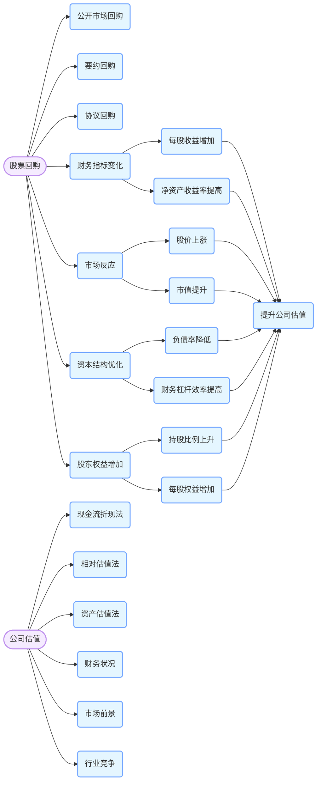

# 股票回购对公司估值的影响分析

> 关键词：股票回购、公司估值、财务指标、市场反应、股东权益、资本结构、企业价值

> 摘要：本文旨在深入探讨股票回购对公司估值的影响。首先介绍了股票回购和公司估值的相关背景知识，明确研究的目的、范围和预期读者。接着阐述了股票回购与公司估值的核心概念及联系，通过理论分析和实际案例相结合的方式，探讨了股票回购对公司财务指标、市场反应等多方面的影响。详细讲解了股票回购影响公司估值的核心算法原理，结合数学模型和公式进行深入剖析。通过项目实战，展示了股票回购在实际案例中的具体应用和对公司估值的影响。分析了股票回购在不同场景下的实际应用，并推荐了相关的学习资源、开发工具框架以及论文著作。最后总结了股票回购对公司估值影响的未来发展趋势与挑战，为投资者、企业管理者等提供全面、深入的参考。

## 1. 背景介绍 
### 1.1 目的和范围
本研究的目的在于全面、深入地分析股票回购对公司估值的影响。随着金融市场的不断发展，股票回购已成为公司重要的财务决策之一，其对公司估值的影响涉及到多个方面，包括公司的财务状况、市场形象、股东权益等。本研究将涵盖股票回购的基本概念、实施方式、对公司估值的各种影响机制，以及通过实际案例进行验证和分析。通过对这些内容的研究，旨在为投资者、企业管理者等相关利益者提供科学、准确的决策依据，帮助他们更好地理解股票回购与公司估值之间的关系，从而做出合理的决策。

### 1.2 预期读者
本文的预期读者包括但不限于以下几类人群：
- **投资者**：包括个人投资者和机构投资者。他们可以通过本文了解股票回购对公司估值的影响，从而更好地评估投资价值，做出更明智的投资决策。
- **企业管理者**：企业的高层管理人员，如CEO、CFO等，他们在制定公司的财务战略和决策时，需要考虑股票回购对公司估值的影响。本文可以为他们提供理论支持和实践参考。
- **金融分析师**：专业的金融分析师需要对公司的财务状况和市场表现进行深入分析，股票回购对公司估值的影响是他们研究的重要内容之一。本文可以为他们提供新的分析视角和方法。
- **学术研究人员**：从事金融、财务等领域研究的学者，可以通过本文了解股票回购对公司估值影响的最新研究成果和发展趋势，为进一步的学术研究提供参考。

### 1.3 文档结构概述
本文将按照以下结构进行组织：
- **核心概念与联系**：介绍股票回购和公司估值的基本概念，以及它们之间的内在联系。
- **核心算法原理 & 具体操作步骤**：详细讲解股票回购影响公司估值的核心算法原理，并给出具体的操作步骤。
- **数学模型和公式 & 详细讲解 & 举例说明**：通过数学模型和公式，深入分析股票回购对公司估值的影响，并结合实际案例进行说明。
- **项目实战：代码实际案例和详细解释说明**：通过实际项目案例，展示股票回购在实际中的应用和对公司估值的影响，并对代码进行详细解读。
- **实际应用场景**：分析股票回购在不同场景下的实际应用，以及对公司估值的影响。
- **工具和资源推荐**：推荐相关的学习资源、开发工具框架以及论文著作，帮助读者进一步深入学习和研究。
- **总结：未来发展趋势与挑战**：总结股票回购对公司估值影响的未来发展趋势与挑战，为读者提供前瞻性的思考。
- **附录：常见问题与解答**：解答读者在阅读过程中可能遇到的常见问题。
- **扩展阅读 & 参考资料**：提供相关的扩展阅读资料和参考文献，方便读者进一步深入研究。

### 1.4 术语表
#### 1.4.1 核心术语定义
- **股票回购**：指上市公司利用现金等方式，从股票市场上购回本公司发行在外的一定数额股票的行为。
- **公司估值**：对公司的内在价值进行评估和计算，通常采用多种方法，如现金流折现法、相对估值法等。
- **股东权益**：指公司总资产中扣除负债所余下的部分，也称为净资产。
- **资本结构**：指企业各种资本的价值构成及其比例关系，是企业一定时期筹资组合的结果。
- **企业价值**：指企业的市场价值，是企业未来现金流量的现值。

#### 1.4.2 相关概念解释
- **财务指标**：用于衡量公司财务状况和经营业绩的各种指标，如净利润、净资产收益率、资产负债率等。
- **市场反应**：指股票市场对公司股票回购等重大事件的反应，通常表现为股价的波动。
- **信号传递理论**：认为公司的股票回购行为向市场传递了公司管理层对公司未来发展前景的信心，从而影响市场对公司的估值。
- **自由现金流假说**：认为公司进行股票回购可以减少公司的自由现金流，降低代理成本，从而提高公司的价值。

#### 1.4.3 缩略词列表
- **EPS**：Earnings Per Share，每股收益
- **ROE**：Return on Equity，净资产收益率
- **DCF**：Discounted Cash Flow，现金流折现法
- **P/E**：Price-to-Earnings Ratio，市盈率

## 2. 核心概念与联系 

### 2.1 股票回购的基本概念
股票回购是上市公司的一种重要财务决策行为。从本质上来说，股票回购是公司利用自有资金或者通过债务融资等方式，从股票市场上购回自己发行在外的股票。股票回购的方式有多种，常见的包括公开市场回购、要约回购和协议回购等。

- **公开市场回购**：公司在证券市场上以市场价格购买本公司的股票。这种方式的优点是操作灵活，成本相对较低，但回购的时间和数量可能受到市场情况的限制。
- **要约回购**：公司向全体股东发出要约，以特定的价格购买一定数量的股票。要约回购的优点是可以在较短的时间内完成大规模的回购，但成本相对较高。
- **协议回购**：公司与特定的股东协商，以特定的价格购买其持有的股票。协议回购通常用于解决大股东减持等问题。

### 2.2 公司估值的基本概念
公司估值是对公司的内在价值进行评估和计算的过程。公司估值的方法有很多种，常见的包括现金流折现法、相对估值法和资产估值法等。

- **现金流折现法（DCF）**：通过预测公司未来的现金流量，并将其折现到当前时点，来计算公司的内在价值。现金流折现法的核心思想是，公司的价值等于其未来现金流量的现值。
- **相对估值法**：通过比较同行业或类似公司的估值指标，如市盈率（P/E）、市净率（P/B）等，来评估公司的价值。相对估值法的优点是简单易懂，操作方便，但需要选择合适的可比公司。
- **资产估值法**：通过评估公司的资产价值，如固定资产、无形资产等，来计算公司的内在价值。资产估值法适用于资产密集型企业，但对于一些轻资产企业，其估值结果可能不太准确。

### 2.3 股票回购与公司估值的联系
股票回购与公司估值之间存在着密切的联系。股票回购可以通过多种方式影响公司的估值，主要包括以下几个方面：

- **财务指标的变化**：股票回购会导致公司的股本减少，从而影响公司的每股收益（EPS）、净资产收益率（ROE）等财务指标。一般来说，股票回购会提高公司的每股收益和净资产收益率，从而提升公司的估值。
- **市场反应**：股票回购向市场传递了公司管理层对公司未来发展前景的信心，从而影响市场对公司的预期。市场通常会对股票回购做出积极的反应，导致股价上涨，从而提升公司的市值。
- **资本结构的优化**：股票回购可以调整公司的资本结构，降低公司的负债率，提高公司的财务杠杆效率。合理的资本结构可以降低公司的融资成本，提高公司的价值。
- **股东权益的增加**：股票回购可以减少公司的流通股数量，从而增加股东的持股比例和每股权益。股东权益的增加会提升股东对公司的信心，从而对公司的估值产生积极的影响。

### 2.4 核心概念原理和架构的文本示意图
```plaintext
股票回购
├── 方式
│   ├── 公开市场回购
│   ├── 要约回购
│   └── 协议回购
├── 影响
│   ├── 财务指标变化
│   │   ├── 每股收益增加
│   │   └── 净资产收益率提高
│   ├── 市场反应
│   │   ├── 股价上涨
│   │   └── 市值提升
│   ├── 资本结构优化
│   │   ├── 负债率降低
│   │   └── 财务杠杆效率提高
│   └── 股东权益增加
│       ├── 持股比例上升
│       └── 每股权益增加
└── 与公司估值的联系
    └── 提升公司估值

公司估值
├── 方法
│   ├── 现金流折现法
│   ├── 相对估值法
│   └── 资产估值法
└── 影响因素
    ├── 财务状况
    ├── 市场前景
    └── 行业竞争
```

### 2.5 Mermaid 流程图


## 3. 核心算法原理 & 具体操作步骤 

### 3.1 股票回购对每股收益的影响
每股收益（EPS）是衡量公司盈利能力的重要指标之一。股票回购会导致公司的股本减少，从而影响每股收益。其计算公式为：

```python
def calculate_eps(before_repurchase_eps, before_repurchase_shares, repurchase_shares):
    """
    计算股票回购后的每股收益
    :param before_repurchase_eps: 回购前的每股收益
    :param before_repurchase_shares: 回购前的股份总数
    :param repurchase_shares: 回购的股份数
    :return: 回购后的每股收益
    """
    after_repurchase_shares = before_repurchase_shares - repurchase_shares
    after_repurchase_eps = before_repurchase_eps * (before_repurchase_shares / after_repurchase_shares)
    return after_repurchase_eps

# 示例数据
before_repurchase_eps = 2.0
before_repurchase_shares = 1000000
repurchase_shares = 100000

after_repurchase_eps = calculate_eps(before_repurchase_eps, before_repurchase_shares, repurchase_shares)
print(f"回购前每股收益: {before_repurchase_eps}")
print(f"回购后每股收益: {after_repurchase_eps}")
```

### 3.2 股票回购对净资产收益率的影响
净资产收益率（ROE）是衡量公司股东权益收益水平的重要指标。股票回购会导致公司的净资产减少，从而影响净资产收益率。其计算公式为：

```python
def calculate_roe(before_repurchase_roe, before_repurchase_equity, repurchase_amount):
    """
    计算股票回购后的净资产收益率
    :param before_repurchase_roe: 回购前的净资产收益率
    :param before_repurchase_equity: 回购前的净资产
    :param repurchase_amount: 回购的金额
    :return: 回购后的净资产收益率
    """
    after_repurchase_equity = before_repurchase_equity - repurchase_amount
    after_repurchase_roe = before_repurchase_roe * (before_repurchase_equity / after_repurchase_equity)
    return after_repurchase_roe

# 示例数据
before_repurchase_roe = 0.2
before_repurchase_equity = 5000000
repurchase_amount = 500000

after_repurchase_roe = calculate_roe(before_repurchase_roe, before_repurchase_equity, repurchase_amount)
print(f"回购前净资产收益率: {before_repurchase_roe}")
print(f"回购后净资产收益率: {after_repurchase_roe}")
```

### 3.3 股票回购对公司市值的影响
股票回购向市场传递了公司管理层对公司未来发展前景的信心，从而影响市场对公司的预期，导致股价上涨，进而影响公司的市值。其具体影响机制较为复杂，受到多种因素的影响，如市场环境、公司业绩等。以下是一个简单的示例，假设股票回购后股价上涨一定比例：

```python
def calculate_market_value(before_repurchase_market_value, price_increase_ratio):
    """
    计算股票回购后的公司市值
    :param before_repurchase_market_value: 回购前的公司市值
    :param price_increase_ratio: 股价上涨比例
    :return: 回购后的公司市值
    """
    after_repurchase_market_value = before_repurchase_market_value * (1 + price_increase_ratio)
    return after_repurchase_market_value

# 示例数据
before_repurchase_market_value = 10000000
price_increase_ratio = 0.1

after_repurchase_market_value = calculate_market_value(before_repurchase_market_value, price_increase_ratio)
print(f"回购前公司市值: {before_repurchase_market_value}")
print(f"回购后公司市值: {after_repurchase_market_value}")
```

### 3.4 具体操作步骤
1. **确定回购计划**：公司管理层根据公司的财务状况、发展战略等因素，确定股票回购的计划，包括回购的方式、数量、价格等。
2. **公告回购计划**：公司向市场公告股票回购计划，向市场传递公司的决策信息。
3. **实施回购**：按照回购计划，公司在市场上进行股票回购操作。
4. **财务调整**：回购完成后，公司对财务报表进行相应的调整，反映股票回购对公司财务指标的影响。
5. **评估影响**：公司管理层和投资者对股票回购的影响进行评估，包括对公司估值、市场反应等方面的影响。

## 4. 数学模型和公式 & 详细讲解 & 举例说明 

### 4.1 每股收益的数学模型和公式
每股收益（EPS）的计算公式为：

$$EPS = \frac{净利润}{发行在外的普通股股数}$$

在股票回购后，发行在外的普通股股数减少，假设净利润不变，则回购后的每股收益为：

$$EPS_{after} = \frac{净利润}{发行在外的普通股股数 - 回购的股数}$$

例如，某公司的净利润为 1000 万元，发行在外的普通股股数为 500 万股，则回购前的每股收益为：

$$EPS_{before} = \frac{1000}{500} = 2（元/股）$$

假设公司回购了 50 万股，则回购后的每股收益为：

$$EPS_{after} = \frac{1000}{500 - 50} = \frac{1000}{450} \approx 2.22（元/股）$$

可以看出，股票回购后每股收益有所提高。

### 4.2 净资产收益率的数学模型和公式
净资产收益率（ROE）的计算公式为：

$$ROE = \frac{净利润}{股东权益}$$

在股票回购后，股东权益减少，假设净利润不变，则回购后的净资产收益率为：

$$ROE_{after} = \frac{净利润}{股东权益 - 回购的金额}$$

例如，某公司的净利润为 500 万元，股东权益为 2500 万元，则回购前的净资产收益率为：

$$ROE_{before} = \frac{500}{2500} = 0.2 = 20\%$$

假设公司以每股 10 元的价格回购了 10 万股，回购金额为 100 万元，则回购后的净资产收益率为：

$$ROE_{after} = \frac{500}{2500 - 100} = \frac{500}{2400} \approx 0.2083 = 20.83\%$$

可以看出，股票回购后净资产收益率有所提高。

### 4.3 现金流折现法的数学模型和公式
现金流折现法（DCF）是一种常用的公司估值方法，其基本思想是将公司未来的现金流量折现到当前时点，来计算公司的内在价值。其计算公式为：

$$V = \sum_{t=1}^{n} \frac{CF_t}{(1 + r)^t} + \frac{TV}{(1 + r)^n}$$

其中，$V$ 表示公司的内在价值，$CF_t$ 表示第 $t$ 期的现金流量，$r$ 表示折现率，$TV$ 表示终值，$n$ 表示预测期数。

例如，某公司未来 5 年的现金流量分别为 100 万元、120 万元、140 万元、160 万元、180 万元，折现率为 10%，终值为 2000 万元，则该公司的内在价值为：

$$V = \frac{100}{(1 + 0.1)^1} + \frac{120}{(1 + 0.1)^2} + \frac{140}{(1 + 0.1)^3} + \frac{160}{(1 + 0.1)^4} + \frac{180}{(1 + 0.1)^5} + \frac{2000}{(1 + 0.1)^5}$$

```python
import numpy as np

cash_flows = np.array([100, 120, 140, 160, 180])
discount_rate = 0.1
terminal_value = 2000
n = 5

discounted_cash_flows = cash_flows / (1 + discount_rate) ** np.arange(1, n + 1)
discounted_terminal_value = terminal_value / (1 + discount_rate) ** n

company_value = np.sum(discounted_cash_flows) + discounted_terminal_value
print(f"公司的内在价值: {company_value} 万元")
```

### 4.4 相对估值法的数学模型和公式
相对估值法是通过比较同行业或类似公司的估值指标，来评估公司的价值。常见的估值指标包括市盈率（P/E）、市净率（P/B）等。

以市盈率为例，其计算公式为：

$$P = EPS \times P/E$$

其中，$P$ 表示公司的股价，$EPS$ 表示每股收益，$P/E$ 表示市盈率。

例如，某公司的每股收益为 2 元，同行业类似公司的平均市盈率为 15，则该公司的股价为：

$$P = 2 \times 15 = 30（元/股）$$

## 5. 项目实战：代码实际案例和详细解释说明 

### 5.1  开发环境搭建
- **编程语言**：Python 3.x
- **开发工具**：Jupyter Notebook 或 PyCharm
- **相关库**：pandas、numpy、matplotlib 等

安装相关库的命令如下：

```sh
pip install pandas numpy matplotlib
```

### 5.2  源代码详细实现和代码解读
以下是一个模拟股票回购对公司估值影响的代码示例：

```python
import pandas as pd
import numpy as np
import matplotlib.pyplot as plt

# 定义公司初始信息
initial_eps = 2.0
initial_shares = 1000000
initial_equity = 5000000
initial_market_value = 10000000
initial_price = initial_market_value / initial_shares
price_increase_ratio = 0.1
repurchase_ratio = 0.1

# 计算回购的股份数和金额
repurchase_shares = int(initial_shares * repurchase_ratio)
repurchase_amount = repurchase_shares * initial_price

# 计算回购后的财务指标
after_repurchase_shares = initial_shares - repurchase_shares
after_repurchase_eps = initial_eps * (initial_shares / after_repurchase_shares)
after_repurchase_equity = initial_equity - repurchase_amount
after_repurchase_roe = initial_eps * initial_shares / after_repurchase_equity
after_repurchase_price = initial_price * (1 + price_increase_ratio)
after_repurchase_market_value = after_repurchase_price * after_repurchase_shares

# 打印结果
print(f"回购前每股收益: {initial_eps}")
print(f"回购后每股收益: {after_repurchase_eps}")
print(f"回购前净资产: {initial_equity}")
print(f"回购后净资产: {after_repurchase_equity}")
print(f"回购前净资产收益率: {initial_eps * initial_shares / initial_equity}")
print(f"回购后净资产收益率: {after_repurchase_roe}")
print(f"回购前公司市值: {initial_market_value}")
print(f"回购后公司市值: {after_repurchase_market_value}")

# 绘制图表
labels = ['Before Repurchase', 'After Repurchase']
eps_values = [initial_eps, after_repurchase_eps]
roe_values = [initial_eps * initial_shares / initial_equity, after_repurchase_roe]
market_value_values = [initial_market_value, after_repurchase_market_value]

x = np.arange(len(labels))
width = 0.25

fig, ax = plt.subplots()
rects1 = ax.bar(x - width, eps_values, width, label='EPS')
rects2 = ax.bar(x, roe_values, width, label='ROE')
rects3 = ax.bar(x + width, market_value_values, width, label='Market Value')

ax.set_ylabel('Value')
ax.set_title('Impact of Stock Repurchase on Company Valuation')
ax.set_xticks(x)
ax.set_xticklabels(labels)
ax.legend()

def autolabel(rects):
    for rect in rects:
        height = rect.get_height()
        ax.annotate('{:.2f}'.format(height),
                    xy=(rect.get_x() + rect.get_width() / 2, height),
                    xytext=(0, 3),
                    textcoords="offset points",
                    ha='center', va='bottom')

autolabel(rects1)
autolabel(rects2)
autolabel(rects3)

fig.tight_layout()
plt.show()
```

### 5.3  代码解读与分析
- **数据初始化**：定义了公司的初始信息，包括每股收益、股份总数、净资产、公司市值等。
- **计算回购相关数据**：根据回购比例计算回购的股份数和金额。
- **计算回购后的财务指标**：根据前面介绍的公式，计算回购后的每股收益、净资产、净资产收益率和公司市值。
- **打印结果**：将回购前后的财务指标打印输出，方便对比分析。
- **绘制图表**：使用 matplotlib 库绘制柱状图，直观地展示股票回购对公司估值的影响。

通过这个代码示例，我们可以看到股票回购对公司的每股收益、净资产收益率和公司市值等方面都有积极的影响。

## 6. 实际应用场景 
### 6.1 提升公司股价
当公司认为其股价被市场低估时，可以通过股票回购来向市场传递公司管理层对公司未来发展前景的信心，从而吸引投资者的关注，推动股价上涨。例如，苹果公司在过去的几年中多次进行大规模的股票回购，其股价也随之不断攀升。

### 6.2 优化资本结构
如果公司的负债率较高，可以通过股票回购来减少股东权益，降低负债率，优化资本结构。合理的资本结构可以降低公司的融资成本，提高公司的财务杠杆效率。例如，一些金融机构会在适当的时候进行股票回购，以调整其资本结构。

### 6.3 回报股东
股票回购可以减少公司的流通股数量，从而增加股东的持股比例和每股权益。股东可以通过出售股票获得资本利得，或者继续持有股票享受更高的股息收益。例如，一些成熟的上市公司会定期进行股票回购，以回报股东。

### 6.4 防止恶意收购
当公司面临恶意收购的威胁时，可以通过股票回购来增加公司的股权集中度，提高收购的难度，从而保护公司的控制权。例如，一些大型企业会在面临恶意收购时迅速启动股票回购计划，以抵御收购方的进攻。

### 6.5 调整股权结构
公司可以通过股票回购来调整股权结构，例如回购大股东的股份，以平衡股东之间的利益关系。这种方式可以促进公司的稳定发展，提高公司的治理效率。

## 7. 工具和资源推荐
### 7.1 学习资源推荐
#### 7.1.1 书籍推荐
- 《公司理财》（原书第 11 版），作者：斯蒂芬 A. 罗斯等。这本书是公司理财领域的经典教材，全面系统地介绍了公司理财的基本理论和方法，包括股票回购、公司估值等内容。
- 《证券分析》，作者：本杰明·格雷厄姆等。该书是价值投资的经典之作，对股票估值、投资分析等方面进行了深入的探讨，对于理解股票回购对公司估值的影响具有重要的参考价值。
- 《财务报表分析与证券定价》（原书第 4 版），作者：斯蒂芬 H. 佩因曼。本书详细介绍了如何通过财务报表分析来评估公司的价值，以及股票回购等财务决策对公司财务报表的影响。

#### 7.1.2 在线课程
- Coursera 平台上的“Corporate Finance”课程，由知名大学的教授授课，涵盖了公司理财的各个方面，包括股票回购和公司估值的理论和实践。
- edX 平台上的“Financial Markets”课程，由耶鲁大学的教授主讲，深入讲解了金融市场的运行机制和公司的财务决策，对理解股票回购的影响具有很大的帮助。
- 中国大学 MOOC 平台上的“财务管理”课程，由国内高校的优秀教师授课，结合中国的实际情况，介绍了公司财务管理的基本理论和方法，包括股票回购和公司估值的相关内容。

#### 7.1.3 技术博客和网站
- Seeking Alpha：这是一个专业的金融投资网站，提供了大量关于股票回购、公司估值等方面的研究报告和分析文章，作者包括专业的金融分析师和投资者。
- Bloomberg：全球知名的金融信息服务提供商，提供实时的金融市场数据和专业的分析报道，对于了解股票回购的市场动态和影响具有重要的参考价值。
- 雪球网：国内知名的投资交流社区，聚集了众多的投资者和金融专家，他们分享了大量关于股票回购、公司估值等方面的经验和见解。

### 7.2 开发工具框架推荐
#### 7.2.1 IDE和编辑器
- PyCharm：一款专门为 Python 开发设计的集成开发环境，具有强大的代码编辑、调试和自动补全功能，适合用于开发和分析股票回购相关的 Python 代码。
- Jupyter Notebook：一种交互式的开发环境，支持多种编程语言，包括 Python。它可以方便地进行数据处理、可视化和代码演示，非常适合用于股票回购的数据分析和模拟。

#### 7.2.2 调试和性能分析工具
- pdb：Python 内置的调试器，可以帮助开发者逐步调试代码，查找代码中的错误和问题。
- cProfile：Python 标准库中的性能分析工具，可以分析代码的执行时间和性能瓶颈，帮助开发者优化代码。

#### 7.2.3 相关框架和库
- pandas：一个强大的数据处理和分析库，提供了丰富的数据结构和数据处理方法，适合用于处理和分析股票回购相关的财务数据。
- numpy：一个用于科学计算的 Python 库，提供了高效的数组和矩阵运算功能，在股票回购的数值计算和模拟中具有重要的应用。
- matplotlib：一个用于数据可视化的 Python 库，可以绘制各种类型的图表，如柱状图、折线图等，帮助开发者直观地展示股票回购的影响。

### 7.3 相关论文著作推荐
#### 7.3.1 经典论文
- “The Determinants of Corporate Borrowing”，作者：Stewart C. Myers。该论文探讨了公司资本结构的决定因素，对于理解股票回购对公司资本结构的影响具有重要的理论意义。
- “Dividend Policy, Growth, and the Valuation of Shares”，作者：Myron J. Gordon。这篇论文提出了股利增长模型，为公司估值提供了重要的理论基础。
- “The Market for “Lemons”: Quality Uncertainty and the Market Mechanism”，作者：George A. Akerlof。该论文提出了信息不对称理论，对于理解股票回购的信号传递效应具有重要的启示。

#### 7.3.2 最新研究成果
- 近年来，学术界对股票回购的研究不断深入，许多学者通过实证研究和理论分析，探讨了股票回购对公司估值、股东权益、市场效率等方面的影响。可以通过学术数据库，如 Web of Science、EBSCOhost 等，查找相关的最新研究论文。

#### 7.3.3 应用案例分析
- 一些金融研究机构和咨询公司会发布关于股票回购的应用案例分析报告，这些报告通过实际案例分析了股票回购的实施过程、效果和影响因素。可以通过这些案例分析，学习和借鉴其他公司的经验和做法。

## 8. 总结：未来发展趋势与挑战
### 8.1 未来发展趋势
- **股票回购规模持续增长**：随着金融市场的不断发展和公司治理水平的提高，越来越多的公司将股票回购作为一种重要的财务决策工具。预计未来股票回购的规模将继续保持增长趋势。
- **回购方式多样化**：除了传统的公开市场回购、要约回购和协议回购等方式外，未来可能会出现更多创新的回购方式，如可转换债券回购、优先股回购等。
- **与其他金融工具结合使用**：股票回购可能会与其他金融工具，如股权激励、并购重组等结合使用，以实现公司的战略目标和股东价值最大化。
- **更加注重长期价值创造**：未来公司在进行股票回购时，将更加注重长期价值创造，而不仅仅是短期的股价提升。公司会综合考虑自身的财务状况、发展战略和市场环境等因素，制定合理的回购计划。

### 8.2 挑战
- **市场波动风险**：股票回购会受到市场波动的影响，如果市场行情不佳，股票回购可能无法达到预期的效果，甚至可能导致公司的财务状况恶化。
- **财务风险**：大规模的股票回购可能会导致公司的负债率上升，增加公司的财务风险。如果公司的现金流不足，可能无法按时偿还债务，从而影响公司的信誉和发展。
- **信息不对称问题**：股票回购的决策通常由公司管理层做出，投资者可能无法获取足够的信息来评估股票回购的合理性和影响。这种信息不对称可能会导致投资者的决策失误，影响市场的效率和公平性。
- **监管政策变化**：股票回购受到监管政策的严格限制，监管政策的变化可能会对股票回购的实施产生影响。公司需要密切关注监管政策的变化，确保股票回购的合规性。

## 9. 附录：常见问题与解答
### 9.1 股票回购对股价的影响一定是正面的吗？
不一定。虽然股票回购通常会向市场传递公司管理层对公司未来发展前景的信心，从而推动股价上涨，但在某些情况下，股票回购也可能对股价产生负面影响。例如，如果市场认为公司的回购计划是为了掩盖公司的业绩下滑或财务问题，或者回购规模过大导致公司的财务状况恶化，投资者可能会对公司的前景产生担忧，从而导致股价下跌。

### 9.2 股票回购会影响公司的分红政策吗？
股票回购和分红都是公司向股东分配利润的方式，它们之间存在一定的替代关系。如果公司进行大规模的股票回购，可能会减少用于分红的资金，从而影响公司的分红政策。但是，具体情况还需要根据公司的财务状况、发展战略和股东需求等因素来确定。

### 9.3 如何判断公司的股票回购计划是否合理？
可以从以下几个方面来判断公司的股票回购计划是否合理：
- **公司的财务状况**：检查公司的现金流、负债率等财务指标，确保公司有足够的资金进行股票回购，并且不会因回购而导致财务状况恶化。
- **回购的目的和动机**：了解公司进行股票回购的目的，如提升股价、优化资本结构、回报股东等，判断其是否符合公司的发展战略和股东利益。
- **市场环境**：考虑市场行情和行业竞争状况，评估股票回购在当前市场环境下的可行性和效果。
- **历史回购记录**：查看公司过去的股票回购记录，了解其回购的频率、规模和效果，判断公司的回购决策是否具有一致性和合理性。

### 9.4 股票回购对股东权益有哪些影响？
股票回购对股东权益的影响主要包括以下几个方面：
- **持股比例增加**：股票回购会减少公司的流通股数量，从而使股东的持股比例相对增加。
- **每股权益增加**：由于回购后公司的净资产减少，而股东的持股比例相对增加，因此每股权益可能会增加。
- **资本利得**：如果股票回购导致股价上涨，股东可以通过出售股票获得资本利得。
- **股息收益**：在某些情况下，股票回购可能会导致公司的分红政策发生变化，从而影响股东的股息收益。

## 10. 扩展阅读 & 参考资料
### 10.1 扩展阅读
- 《金融市场与金融机构基础》，作者：弗兰克 J. 法博齐等。该书全面介绍了金融市场和金融机构的基本概念、运行机制和业务操作，对于理解股票回购的市场环境和金融背景具有重要的帮助。
- 《投资学》（原书第 10 版），作者：滋维·博迪等。这本书是投资学领域的经典教材，系统地介绍了投资的基本理论和方法，包括股票投资、债券投资、衍生品投资等，对于深入理解股票回购的投资策略和影响具有重要的参考价值。
- 《聪明的投资者》，作者：本杰明·格雷厄姆。该书是价值投资的经典之作，强调了投资者的理性和风险控制，对于投资者在股票回购背景下的投资决策具有重要的指导意义。

### 10.2 参考资料
- 各上市公司的年报、季报和公告，这些资料提供了公司的财务状况、经营业绩和重大决策等信息，是研究股票回购的重要数据来源。
- 金融监管机构发布的政策文件和统计数据，如中国证券监督管理委员会、美国证券交易委员会等发布的相关文件和数据，对于了解股票回购的监管政策和市场动态具有重要的参考价值。
- 学术期刊和研究报告，如《金融研究》《管理世界》等学术期刊，以及各大金融研究机构发布的研究报告，提供了关于股票回购的最新研究成果和理论分析。