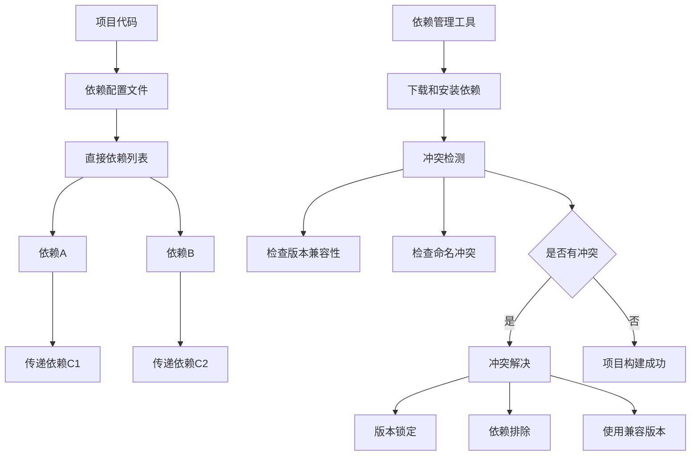

# 自动化依赖冲突解决:AI辅助项目构建

> 关键词：自动化、依赖冲突、AI、项目构建、软件依赖管理、冲突检测、冲突解决

> 摘要：本文聚焦于自动化依赖冲突解决以及AI在项目构建中的辅助作用。首先介绍了依赖冲突在项目构建过程中带来的问题及研究背景，详细阐述了相关核心概念，包括依赖管理、冲突检测等的原理与联系。深入讲解了用于解决依赖冲突的核心算法原理及具体操作步骤，结合数学模型和公式进行理论分析。通过项目实战展示了代码实际案例并给出详细解释，探讨了实际应用场景。同时推荐了相关的学习资源、开发工具框架以及论文著作。最后总结了未来发展趋势与挑战，并在附录中对常见问题进行了解答，旨在为开发者提供全面的依赖冲突解决及AI辅助项目构建的知识体系和实践指导。

## 1. 背景介绍 
### 1.1 目的和范围
在现代软件开发中，项目往往依赖于大量的外部库和组件。这些依赖关系的复杂性不断增加，导致依赖冲突成为一个常见且棘手的问题。依赖冲突可能引发各种错误，如编译失败、运行时异常等，严重影响项目的开发进度和质量。本文章的目的在于深入探讨自动化依赖冲突解决的方法，并研究如何利用AI技术辅助项目构建，以提高项目构建的成功率和效率。范围涵盖从依赖冲突的基础概念到具体的算法实现、项目实战，以及相关的应用场景和未来发展趋势等多个方面。

### 1.2 预期读者
本文预期读者包括软件开发工程师、软件架构师、技术管理人员以及对软件开发过程中依赖管理和AI应用感兴趣的研究人员。无论是初学者想要了解依赖冲突的基本知识，还是有经验的开发者寻求更高效的依赖冲突解决策略，都能从本文中获得有价值的信息。

### 1.3 文档结构概述
本文首先介绍背景知识，包括目的、预期读者和文档结构。接着阐述核心概念与联系，帮助读者理解依赖管理和冲突解决的基本原理。然后详细讲解核心算法原理和具体操作步骤，并结合数学模型和公式进行理论分析。通过项目实战展示实际代码案例和详细解释。探讨实际应用场景，推荐相关的工具和资源。最后总结未来发展趋势与挑战，在附录中解答常见问题，并提供扩展阅读和参考资料。

### 1.4 术语表
#### 1.4.1 核心术语定义
- **依赖**：指一个软件组件需要另一个软件组件才能正常工作的关系。例如，一个Python项目可能依赖于NumPy库来进行数值计算。
- **依赖冲突**：当项目中的多个依赖之间存在不兼容的情况时，就会发生依赖冲突。例如，两个不同的库可能依赖于同一个库的不同版本，从而导致冲突。
- **依赖管理**：是指对项目中所有依赖的管理过程，包括依赖的添加、删除、版本控制等。
- **项目构建**：将源代码转换为可执行程序或部署包的过程，在这个过程中需要处理各种依赖关系。
- **AI辅助**：利用人工智能技术，如机器学习、自然语言处理等，来辅助解决依赖冲突和优化项目构建过程。

#### 1.4.2 相关概念解释
- **语义版本控制**：一种用于管理软件版本号的标准，格式为MAJOR.MINOR.PATCH。MAJOR版本号的变更表示不兼容的API变更，MINOR版本号的变更表示向后兼容的功能添加，PATCH版本号的变更表示向后兼容的错误修复。
- **传递依赖**：一个直接依赖所依赖的其他库。例如，库A依赖于库B，库B又依赖于库C，那么库C就是库A的传递依赖。

#### 1.4.3 缩略词列表
- **API**：Application Programming Interface，应用程序编程接口。
- **SDK**：Software Development Kit，软件开发工具包。
- **ML**：Machine Learning，机器学习。
- **NLP**：Natural Language Processing，自然语言处理。

## 2. 核心概念与联系 

### 依赖管理原理
依赖管理的核心目标是确保项目中所有依赖的正确加载和使用。在一个典型的项目中，依赖信息通常存储在配置文件中，如Python项目的`requirements.txt`文件或Maven项目的`pom.xml`文件。这些配置文件记录了项目所依赖的库及其版本信息。依赖管理工具（如pip、Maven等）根据这些配置文件来下载和安装所需的依赖。

### 依赖冲突检测原理
依赖冲突检测是识别项目中潜在冲突的过程。常见的冲突类型包括版本冲突、命名冲突等。版本冲突是指多个依赖需要同一个库的不同版本，而命名冲突是指不同的库使用了相同的类名或函数名。冲突检测工具会遍历项目的依赖树，检查各个依赖之间的兼容性。

### 依赖冲突解决原理
当检测到依赖冲突时，需要采取相应的解决策略。常见的解决策略包括版本锁定、依赖排除、使用兼容版本等。版本锁定是指强制指定某个库的特定版本，依赖排除是指在某些依赖中排除不需要的传递依赖，使用兼容版本是指寻找能够同时满足多个依赖需求的库版本。

### 文本示意图
```plaintext
项目代码
|
|-- 依赖配置文件（如requirements.txt、pom.xml）
|   |
|   |-- 直接依赖列表
|       |
|       |-- 依赖A（版本1.0）
|       |   |
|       |   |-- 传递依赖C（版本2.0）
|       |
|       |-- 依赖B（版本2.0）
|           |
|           |-- 传递依赖C（版本3.0）  <-- 版本冲突
|
|-- 依赖管理工具（如pip、Maven）
|   |
|   |-- 下载和安装依赖
|       |
|       |-- 冲突检测
|       |   |
|       |   |-- 检查版本兼容性
|       |   |-- 检查命名冲突
|       |
|       |-- 冲突解决
|           |
|           |-- 版本锁定
|           |-- 依赖排除
|           |-- 使用兼容版本
```

### Mermaid流程图


## 3. 核心算法原理 & 具体操作步骤 

### 核心算法原理：基于图的依赖冲突检测与解决算法

该算法的核心思想是将项目的依赖关系表示为一个有向图，其中节点表示库，边表示依赖关系。通过对图的分析，可以检测出潜在的依赖冲突，并采取相应的解决策略。

### Python源代码实现

```python
from collections import defaultdict

class DependencyGraph:
    def __init__(self):
        self.graph = defaultdict(list)
        self.versions = {}

    def add_dependency(self, library, version, dependencies):
        """
        添加依赖关系
        :param library: 库名
        :param version: 版本号
        :param dependencies: 依赖列表
        """
        self.versions[library] = version
        for dep in dependencies:
            self.graph[library].append(dep)

    def detect_conflicts(self):
        """
        检测依赖冲突
        :return: 冲突列表
        """
        conflicts = []
        visited = set()
        def dfs(node):
            visited.add(node)
            for neighbor in self.graph[node]:
                if neighbor in self.versions and self.versions[neighbor] != self.versions.get(node, None):
                    conflicts.append((node, neighbor))
                if neighbor not in visited:
                    dfs(neighbor)
        for node in self.graph:
            if node not in visited:
                dfs(node)
        return conflicts

    def resolve_conflicts(self, conflicts):
        """
        解决依赖冲突
        :param conflicts: 冲突列表
        :return: 解决后的依赖关系
        """
        resolved_graph = self.graph.copy()
        for conflict in conflicts:
            # 简单的解决策略：选择版本号较高的库
            lib1, lib2 = conflict
            if self.versions[lib1] > self.versions[lib2]:
                # 移除lib2的依赖
                for node in resolved_graph:
                    if lib2 in resolved_graph[node]:
                        resolved_graph[node].remove(lib2)
            else:
                # 移除lib1的依赖
                for node in resolved_graph:
                    if lib1 in resolved_graph[node]:
                        resolved_graph[node].remove(lib1)
        return resolved_graph

# 示例使用
graph = DependencyGraph()
graph.add_dependency("A", "1.0", ["B", "C"])
graph.add_dependency("B", "2.0", ["C"])
graph.add_dependency("C", "1.0", [])

conflicts = graph.detect_conflicts()
print("检测到的冲突:", conflicts)

resolved_graph = graph.resolve_conflicts(conflicts)
print("解决后的依赖关系:", resolved_graph)
```

### 具体操作步骤

1. **构建依赖图**：读取项目的依赖配置文件，将依赖关系添加到图中。每个节点表示一个库，边表示依赖关系，同时记录每个库的版本号。
2. **冲突检测**：使用深度优先搜索（DFS）遍历图，检查是否存在版本冲突。如果发现两个库依赖同一个库的不同版本，则记录为冲突。
3. **冲突解决**：根据冲突列表，采取相应的解决策略。在上述示例中，我们采用了简单的策略，即选择版本号较高的库，并移除版本号较低的库的依赖。
4. **更新依赖配置文件**：将解决后的依赖关系更新到项目的依赖配置文件中。

## 4. 数学模型和公式 & 详细讲解 & 举例说明 

### 数学模型

我们可以将项目的依赖关系表示为一个有向图 $G=(V, E)$，其中 $V$ 是节点集合，表示库，$E$ 是边集合，表示依赖关系。每个节点 $v \in V$ 都有一个版本号 $v_{version}$。

### 冲突检测公式

设 $u$ 和 $v$ 是图中的两个节点，且存在边 $(u, v) \in E$。如果 $u$ 和 $v$ 依赖同一个库 $w$，且 $u$ 依赖的 $w$ 的版本号为 $w_{version}^u$，$v$ 依赖的 $w$ 的版本号为 $w_{version}^v$，且 $w_{version}^u \neq w_{version}^v$，则存在版本冲突。

### 冲突解决公式

在解决冲突时，我们可以定义一个评分函数 $f(v_{version})$ 来评估每个版本的优劣。例如，我们可以简单地将版本号转换为数字进行比较。设 $v_{version}^1$ 和 $v_{version}^2$ 是两个版本号，我们可以定义：

$$
f(v_{version}) = \sum_{i=0}^{n} a_i \times 10^{n - i}
$$

其中 $a_i$ 是版本号中第 $i$ 位的数字，$n$ 是版本号的位数。例如，对于版本号 $1.2.3$，$f(1.2.3) = 1 \times 10^2 + 2 \times 10^1 + 3 \times 10^0 = 123$。

然后，我们可以选择评分较高的版本作为最终版本：

$$
v_{final} = \arg\max_{v_{version} \in \{v_{version}^1, v_{version}^2\}} f(v_{version})
$$

### 举例说明

假设项目中有两个依赖 $A$ 和 $B$，$A$ 依赖于库 $C$ 的版本 $1.0$，$B$ 依赖于库 $C$ 的版本 $2.0$。我们可以计算 $f(1.0) = 1 \times 10^0 = 1$，$f(2.0) = 2 \times 10^0 = 2$。由于 $f(2.0) > f(1.0)$，我们选择版本 $2.0$ 作为最终版本，并移除对版本 $1.0$ 的依赖。

## 5. 项目实战：代码实际案例和详细解释说明 

### 5.1  开发环境搭建

#### Python项目
1. 安装Python：从Python官方网站（https://www.python.org/downloads/）下载并安装Python 3.x版本。
2. 安装依赖管理工具：使用`pip`安装所需的依赖管理工具，如`pip install pip-tools`。

#### Java项目
1. 安装JDK：从Oracle官方网站（https://www.oracle.com/java/technologies/javase-downloads.html）或OpenJDK官方网站（https://openjdk.java.net/）下载并安装JDK。
2. 安装Maven：从Maven官方网站（https://maven.apache.org/download.cgi）下载并安装Maven。

### 5.2  源代码详细实现和代码解读

#### Python项目示例

```python
# requirements.in
requests==2.26.0
flask==2.0.1

# 使用pip-tools生成锁定文件
# pip-compile requirements.in

# requirements.txt
# This file is autogenerated by pip-compile with Python 3.9
# To update, run:
#
#    pip-compile requirements.in
#
certifi==2021.10.8
charset-normalizer==2.0.7
click==8.0.3
flask==2.0.1
idna==3.3
itsdangerous==2.0.1
jinja2==3.0.3
markupsafe==2.0.1
requests==2.26.0
urllib3==1.26.7
werkzeug==2.0.1

# main.py
import requests
from flask import Flask

app = Flask(__name__)

@app.route('/')
def hello_world():
    response = requests.get('https://www.example.com')
    return response.text

if __name__ == '__main__':
    app.run()
```

代码解读：
- `requirements.in`：定义了项目的直接依赖，包括`requests`和`flask`及其版本号。
- `requirements.txt`：通过`pip-compile`工具生成的锁定文件，包含了所有直接依赖和传递依赖及其精确版本号。
- `main.py`：项目的主代码文件，使用`requests`库发送HTTP请求，使用`flask`框架创建一个简单的Web应用。

#### Java项目示例

```xml
<!-- pom.xml -->
<project xmlns="http://maven.apache.org/POM/4.0.0"
         xmlns:xsi="http://www.w3.org/2001/XMLSchema-instance"
         xsi:schemaLocation="http://maven.apache.org/POM/4.0.0 http://maven.apache.org/xsd/maven-4.0.0.xsd">
    <modelVersion>4.0.0</modelVersion>

    <groupId>com.example</groupId>
    <artifactId>myproject</artifactId>
    <version>1.0-SNAPSHOT</version>

    <dependencies>
        <dependency>
            <groupId>org.apache.httpcomponents</groupId>
            <artifactId>httpclient</artifactId>
            <version>4.5.13</version>
        </dependency>
        <dependency>
            <groupId>org.springframework.boot</groupId>
            <artifactId>spring-boot-starter-web</artifactId>
            <version>2.6.1</version>
        </dependency>
    </dependencies>

    <build>
        <plugins>
            <plugin>
                <groupId>org.springframework.boot</groupId>
                <artifactId>spring-boot-maven-plugin</artifactId>
            </plugin>
        </plugins>
    </build>
</project>

// src/main/java/com/example/myproject/MainApplication.java
package com.example.myproject;

import org.springframework.boot.SpringApplication;
import org.springframework.boot.autoconfigure.SpringBootApplication;
import org.springframework.web.bind.annotation.GetMapping;
import org.springframework.web.bind.annotation.RestController;

@SpringBootApplication
@RestController
public class MainApplication {

    public static void main(String[] args) {
        SpringApplication.run(MainApplication.class, args);
    }

    @GetMapping("/")
    public String helloWorld() {
        return "Hello, World!";
    }
}
```

代码解读：
- `pom.xml`：Maven项目的配置文件，定义了项目的基本信息、依赖和构建插件。
- `MainApplication.java`：项目的主代码文件，使用Spring Boot框架创建一个简单的Web应用。

### 5.3  代码解读与分析

#### Python项目
- **依赖管理**：通过`requirements.in`和`requirements.txt`文件进行依赖管理，`pip-compile`工具可以确保所有依赖的版本一致性。
- **冲突检测**：`pip`在安装依赖时会自动检测版本冲突，如果发现冲突会抛出错误。
- **冲突解决**：可以通过手动调整`requirements.in`文件中的版本号来解决冲突，或者使用`pip-tools`的`--upgrade`选项来更新依赖。

#### Java项目
- **依赖管理**：通过`pom.xml`文件进行依赖管理，Maven会自动下载和管理所有依赖。
- **冲突检测**：Maven会根据依赖的传递性和版本规则进行冲突检测，如果发现冲突会选择合适的版本。
- **冲突解决**：可以通过在`pom.xml`文件中使用`<exclusions>`标签排除不需要的传递依赖，或者手动指定依赖的版本号来解决冲突。

## 6. 实际应用场景 

### 大型软件项目开发
在大型软件项目中，往往涉及到大量的模块和依赖。不同的模块可能由不同的团队开发，使用的依赖版本也可能不同，这就容易导致依赖冲突。通过自动化依赖冲突解决和AI辅助项目构建，可以提高项目的集成效率，减少开发周期。

### 开源项目维护
开源项目通常会有大量的贡献者，每个贡献者可能使用不同的开发环境和依赖版本。在合并代码时，容易出现依赖冲突。利用自动化工具和AI技术，可以快速检测和解决冲突，保证项目的稳定性和兼容性。

### 云原生应用开发
云原生应用通常采用微服务架构，每个微服务都有自己的依赖。在部署和运行过程中，可能会出现依赖冲突。通过自动化依赖冲突解决和AI辅助项目构建，可以确保微服务之间的兼容性，提高应用的可靠性。

### DevOps流程
在DevOps流程中，持续集成和持续部署（CI/CD）是关键环节。依赖冲突可能导致CI/CD流程失败，影响软件的交付速度。通过自动化依赖冲突解决和AI辅助项目构建，可以提高CI/CD流程的成功率，实现快速迭代和交付。

## 7. 工具和资源推荐
### 7.1 学习资源推荐
#### 7.1.1 书籍推荐
- 《Python实战》：详细介绍了Python的开发技巧和最佳实践，包括依赖管理和项目构建。
- 《Effective Java》：对于Java开发者来说，这本书是必读的经典之作，涵盖了Java的各种特性和最佳实践，包括依赖管理和项目构建。
- 《软件架构设计：大型网站技术架构与业务架构融合之道》：介绍了大型软件项目的架构设计原则和方法，包括依赖管理和冲突解决。

#### 7.1.2 在线课程
- Coursera上的“Software Engineering Specialization”：提供了软件开发的全面知识，包括依赖管理和项目构建。
- edX上的“Java Programming and Software Engineering Fundamentals”：适合Java开发者学习Java编程和项目管理。
- Udemy上的“Python for Data Science and Machine Learning Bootcamp”：对于Python开发者来说，这个课程可以帮助你学习Python的数据分析和机器学习应用，同时也涉及到依赖管理和项目构建。

#### 7.1.3 技术博客和网站
- Medium：有很多关于软件开发和依赖管理的优秀文章。
- Stack Overflow：一个非常有用的技术问答社区，可以在这里找到各种依赖冲突解决的案例和经验。
- InfoQ：提供了最新的技术资讯和行业趋势，包括依赖管理和项目构建的相关内容。

### 7.2 开发工具框架推荐
#### 7.2.1 IDE和编辑器
- PyCharm：一款专门为Python开发设计的集成开发环境，提供了强大的依赖管理和项目构建功能。
- IntelliJ IDEA：对于Java开发者来说，IntelliJ IDEA是一款非常优秀的集成开发环境，支持Maven和Gradle等依赖管理工具。
- Visual Studio Code：一款轻量级的代码编辑器，支持多种编程语言，通过安装插件可以实现依赖管理和项目构建功能。

#### 7.2.2 调试和性能分析工具
- pdb：Python的内置调试器，可以帮助开发者调试代码和解决依赖冲突。
- jdb：Java的调试器，结合IntelliJ IDEA等开发工具可以方便地进行调试和性能分析。
- Py-Spy：一个用于Python的性能分析工具，可以帮助开发者找出性能瓶颈和依赖冲突。

#### 7.2.3 相关框架和库
- pip-tools：用于Python的依赖管理工具，可以生成锁定文件，确保依赖的版本一致性。
- Maven：Java的项目管理和依赖管理工具，提供了丰富的插件和功能。
- Gradle：另一个流行的Java项目构建工具，支持多种编程语言和依赖管理方式。

### 7.3 相关论文著作推荐
#### 7.3.1 经典论文
- “Dependency Management in Software Systems”：详细介绍了软件系统中依赖管理的基本原理和方法。
- “Detecting and Resolving Dependency Conflicts in Software Projects”：提出了一种基于图的依赖冲突检测和解决算法。

#### 7.3.2 最新研究成果
- “AI-Enabled Dependency Management for Software Projects”：探讨了如何利用AI技术辅助软件项目的依赖管理和冲突解决。
- “Automated Dependency Resolution in Microservices Architectures”：研究了微服务架构中自动化依赖解决的方法和技术。

#### 7.3.3 应用案例分析
- “Case Studies on Dependency Conflict Resolution in Large-Scale Software Projects”：通过实际案例分析了大型软件项目中依赖冲突解决的方法和经验。
- “Dependency Management in Open Source Projects: A Comparative Analysis”：对开源项目中的依赖管理进行了比较分析，提出了一些优化建议。

## 8. 总结：未来发展趋势与挑战

### 未来发展趋势

#### AI技术的深度应用
未来，AI技术将在依赖冲突解决和项目构建中发挥更加重要的作用。例如，利用机器学习算法预测潜在的依赖冲突，使用自然语言处理技术理解依赖文档和错误信息，从而提供更智能的冲突解决建议。

#### 自动化程度的提高
随着技术的不断发展，依赖冲突解决和项目构建的自动化程度将不断提高。例如，自动检测和解决依赖冲突，自动更新依赖版本，自动生成项目构建脚本等。

#### 跨平台和跨语言支持
随着软件开发的多元化，项目可能涉及到多种编程语言和平台。未来的依赖管理工具和冲突解决方法将提供更好的跨平台和跨语言支持，确保不同语言和平台之间的兼容性。

#### 云原生依赖管理
云原生应用的兴起将推动云原生依赖管理的发展。未来的依赖管理工具将更好地支持容器化和微服务架构，实现依赖的快速部署和更新。

### 挑战

#### 依赖的复杂性增加
随着软件系统的不断发展，依赖的数量和复杂性将不断增加。这将给依赖冲突检测和解决带来更大的挑战，需要更高效的算法和工具来应对。

#### AI模型的准确性和可解释性
虽然AI技术在依赖冲突解决中具有很大的潜力，但AI模型的准确性和可解释性仍然是一个问题。开发者需要信任AI模型的建议，并能够理解其决策过程。

#### 安全风险
依赖管理涉及到大量的外部库和组件，这些库和组件可能存在安全漏洞。如何在解决依赖冲突的同时，确保项目的安全性是一个重要的挑战。

#### 兼容性问题
不同的编程语言、平台和工具之间可能存在兼容性问题。如何确保依赖管理工具和冲突解决方法在不同的环境中都能正常工作是一个需要解决的问题。

## 9. 附录：常见问题与解答

### 1. 什么是依赖冲突？
依赖冲突是指项目中的多个依赖之间存在不兼容的情况。常见的冲突类型包括版本冲突、命名冲突等。版本冲突是指多个依赖需要同一个库的不同版本，而命名冲突是指不同的库使用了相同的类名或函数名。

### 2. 如何检测依赖冲突？
可以使用依赖管理工具（如pip、Maven等）自带的冲突检测功能，也可以使用专门的冲突检测工具。此外，还可以通过分析依赖树和查看错误信息来手动检测依赖冲突。

### 3. 如何解决依赖冲突？
常见的解决策略包括版本锁定、依赖排除、使用兼容版本等。版本锁定是指强制指定某个库的特定版本，依赖排除是指在某些依赖中排除不需要的传递依赖，使用兼容版本是指寻找能够同时满足多个依赖需求的库版本。

### 4. AI如何辅助依赖冲突解决？
AI可以通过机器学习算法预测潜在的依赖冲突，使用自然语言处理技术理解依赖文档和错误信息，从而提供更智能的冲突解决建议。例如，AI可以分析大量的项目数据，学习不同依赖之间的兼容性模式，从而在检测到冲突时提供更准确的解决方案。

### 5. 依赖管理工具和冲突解决方法对项目性能有影响吗？
依赖管理工具和冲突解决方法本身对项目性能的影响通常较小。但是，如果依赖的数量过多或版本不兼容，可能会导致项目启动时间延长、内存占用增加等问题。因此，合理管理依赖和解决冲突可以提高项目的性能。

## 10. 扩展阅读 & 参考资料

### 扩展阅读
- 《Software Engineering at Google》：介绍了Google的软件开发实践，包括依赖管理和项目构建。
- 《Continuous Delivery: Reliable Software Releases through Build, Test, and Deployment Automation》：详细介绍了持续交付的原理和方法，包括依赖管理和项目构建在持续交付中的应用。

### 参考资料
- Python官方文档：https://docs.python.org/
- Maven官方文档：https://maven.apache.org/guides/index.html
- Gradle官方文档：https://docs.gradle.org/current/userguide/userguide.html
- Stack Overflow：https://stackoverflow.com/
- Medium：https://medium.com/
- InfoQ：https://www.infoq.com/